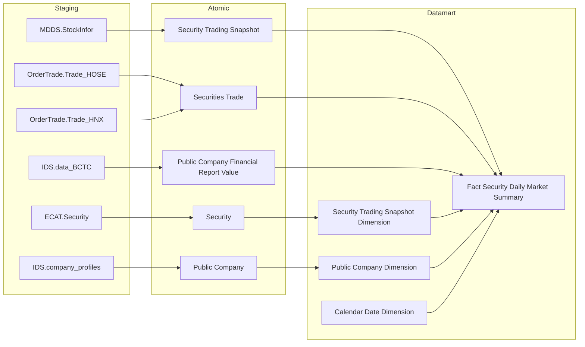
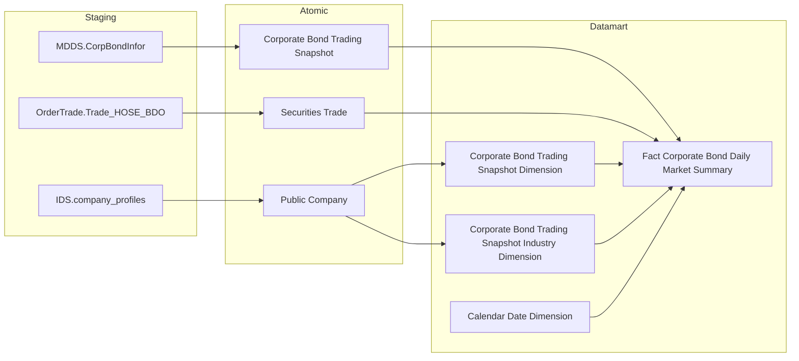
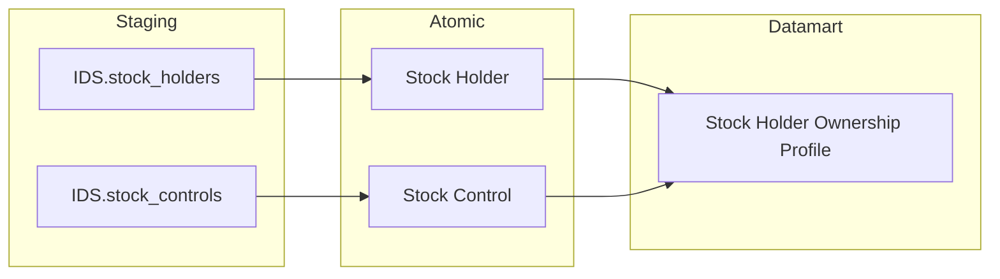

## 3.1.6 LUỒNG ĐỒNG BỘ DỮ LIỆU CHO NHÓM BÁO CÁO Giám sát Thị trường

### 3.1.6.1 Thông tin chung luồng đồng bộ

- Tên job:
- Nguồn dữ liệu (Hệ thống nguồn): MDDS, OrderTrade, IDS, ECAT
- Cách thức truy xuất đồng bộ dữ liệu:
- Tần suất đồng bộ dữ liệu:
- Dung lượng dữ liệu sẽ thực hiện đồng bộ:
- Thời gian lưu trữ dữ liệu:
- Thư mục lưu trữ dữ liệu trên kho dữ liệu:

### 3.1.6.2 Luồng nghiệp vụ

#### 3.1.6.2.1 Nhóm thông tin Security Daily Market

**Mục đích:** Cung cấp dữ liệu thị trường chứng khoán cuối ngày (EOD) theo mã CK và ngày giao dịch, phục vụ bảng `Fact Security Daily Market Summary` dùng cho toàn bộ các nhóm báo cáo cổ phiếu (Nhóm 1, 3, 6–27 và STT 49).

**Mô tả luồng:**

Staging → Atomic:
- **Security Trading Snapshot:** Bảng lưu thông tin thị trường chứng khoán cuối ngày (giá, khối lượng, trạng thái) lấy thông tin từ bảng MDDS.StockInfor
- **Securities Trade:** Bảng lưu chi tiết từng lệnh khớp giao dịch chứng khoán lấy thông tin từ bảng OrderTrade.Trade_HOSE, kết hợp dữ liệu khớp lệnh sàn HNX từ bảng OrderTrade.Trade_HNX
- **Public Company Financial Report Value:** Bảng lưu giá trị từng chỉ tiêu báo cáo tài chính của công ty đại chúng lấy thông tin từ bảng IDS.data_BCTC
- **Security:** Bảng lưu thông tin định danh chứng khoán lấy thông tin từ bảng ECAT.Security
- **Public Company:** Bảng lưu thông tin công ty đại chúng (ngành, mã cổ phiếu) lấy thông tin từ bảng IDS.company_profiles

Atomic → Datamart:
- **Security Trading Snapshot Dimension:** Bảng lưu thông tin mã chứng khoán phục vụ slicer Mã CK, Sàn, Loại CK và Chỉ số. Áp dụng SCD2.
- **Public Company Dimension:** Bảng lưu thông tin phân loại ngành kinh tế của cổ phiếu (10 ngành IDS cấp 1) phục vụ slicer Ngành. Áp dụng SCD2.
- **Calendar Date Dimension:** Bảng lưu thông tin lịch ngày giao dịch phục vụ slicer Ngày, Tháng, Quý, Năm.
- **Fact Security Daily Market Summary:** Bảng sự kiện tổng hợp thông tin thị trường chứng khoán cuối ngày theo mã CK và ngày giao dịch, bao gồm giá, khối lượng, giá trị giao dịch, giao dịch nước ngoài, phái sinh và chỉ tiêu tài chính.

---

#### 3.1.6.2.2 Nhóm thông tin Corporate Bond Daily Market

**Mục đích:** Cung cấp dữ liệu thị trường trái phiếu doanh nghiệp niêm yết cuối ngày theo mã TP và ngày giao dịch, phục vụ bảng `Fact Corporate Bond Daily Market Summary` dùng cho Nhóm 2 (Bảng số liệu Trái phiếu DN).

**Mô tả luồng:**

Staging → Atomic:
- **Corporate Bond Trading Snapshot:** Bảng lưu thông tin thị trường trái phiếu doanh nghiệp cuối ngày (giá tham chiếu, giá đóng cửa) lấy thông tin từ bảng MDDS.CorpBondInfor
- **Securities Trade:** Bảng lưu chi tiết khớp lệnh giao dịch trái phiếu DN (market = BDO) lấy thông tin từ bảng OrderTrade.Trade_HOSE_BDO
- **Public Company:** Bảng lưu thông tin công ty đại chúng gồm ngành kinh tế và mã trái phiếu lấy thông tin từ bảng IDS.company_profiles

Atomic → Datamart:
- **Corporate Bond Trading Snapshot Dimension:** Bảng lưu thông tin tổ chức phát hành trái phiếu DN phục vụ slicer Mã TP và Tên nhà phát hành. Áp dụng SCD2.
- **Corporate Bond Trading Snapshot Industry Dimension:** Bảng lưu thông tin phân loại ngành kinh tế của tổ chức phát hành TPDN (10 ngành IDS cấp 1) phục vụ slicer Ngành TPDN. Áp dụng SCD2.
- **Calendar Date Dimension:** Bảng lưu thông tin lịch ngày giao dịch phục vụ slicer Ngày, Tháng, Quý, Năm.
- **Fact Corporate Bond Daily Market Summary:** Bảng sự kiện tổng hợp thông tin thị trường trái phiếu doanh nghiệp cuối ngày theo mã TP và ngày giao dịch, bao gồm giá, khối lượng, giá trị giao dịch và doanh thu thuần.

---

#### 3.1.6.2.3 Nhóm thông tin Stock Holder Ownership

**Mục đích:** Cung cấp thông tin sở hữu cổ đông và người nội bộ theo từng công ty đại chúng, phục vụ bảng `Stock Holder Ownership Profile` dùng cho STT 47 (Sở hữu và giao dịch nội bộ).

**Mô tả luồng:**

Staging → Atomic:
- **Stock Holder:** Bảng lưu thông tin từng cổ đông (tên, loại, tỷ lệ sở hữu, cờ nước ngoài, cờ người nội bộ) lấy thông tin từ bảng IDS.stock_holders
- **Stock Control:** Bảng lưu thông tin hạn chế chuyển nhượng cổ phần lấy thông tin từ bảng IDS.stock_controls

Atomic → Datamart:
- **Stock Holder Ownership Profile:** Bảng tác nghiệp lưu danh sách cổ đông và thông tin sở hữu của từng công ty đại chúng ở trạng thái mới nhất, phục vụ tra cứu sở hữu nội bộ và cổ đông lớn.
