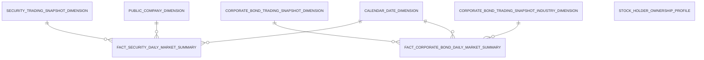
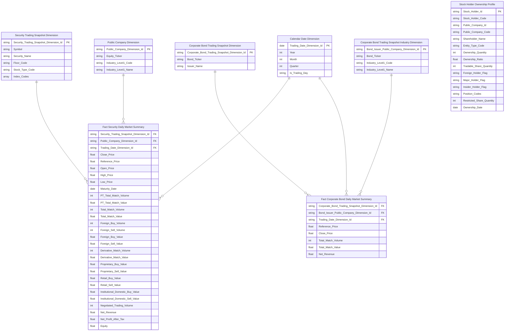
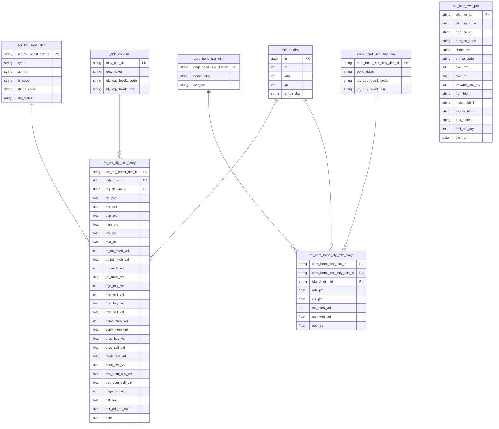

# 3. KHO DỮ LIỆU (OLAP) — Giám sát thị trường

## 3.1 Mô hình dữ liệu mức High Level / Conceptual

### 3.1.1 Sơ đồ ERD

### 3.1.2 Danh sách thực thể

| STT | Thực thể | Tên bảng | Mô tả |
|---|---|---|---|
| 1 | Security Trading Snapshot Dimension | scr_tdg_snpst_dim | Dimension mã chứng khoán — slicer Mã CK, Sàn, Loại CK, Chỉ số. SCD2. Driving = scr_tdg_snpst. |
| 2 | Public Company Dimension | pblc_co_dim | Dimension ngành kinh tế cổ phiếu (10 ngành IDS cấp 1) — slicer Ngành. SCD2. Driving = pblc_co. |
| 3 | Corporate Bond Trading Snapshot Dimension | corp_bond_issr_dim | Dimension tổ chức phát hành trái phiếu DN — slicer Mã TP, Tên nhà phát hành. SCD2. Driving = corp_bond_tdg_snpst. |
| 4 | Corporate Bond Trading Snapshot Industry Dimension | corp_bond_issr_indy_dim | Dimension ngành kinh tế TPDN (10 ngành IDS cấp 1) — slicer Ngành TPDN. SCD2. Driving = corp_bond_tdg_snpst, join sang pblc_co qua bond_ticker. |
| 5 | Fact Security Daily Market Summary | fct_scr_dly_mkt_smry | Fact Periodic Snapshot — tổng hợp thị trường chứng khoán EOD theo mã CK / ngày. Phục vụ Nhóm 1–27d_heatmap và STT 49. |
| 6 | Fact Corporate Bond Daily Market Summary | fct_corp_bond_dly_mkt_smry | Fact Periodic Snapshot — tổng hợp thị trường TPDN EOD theo mã TP / ngày. Phục vụ Nhóm 2. |
| 7 | Stock Holder Ownership Profile | stk_hldr_own_prfl | Bảng Tác nghiệp — thông tin sở hữu và người nội bộ theo cổ đông / công ty đại chúng. Phục vụ STT 47 (Nhóm 28). Driving = stk_hldr. |

---

## 3.2 Mô hình dữ liệu mức Logic

### 3.2.1 Sơ đồ ERD

### 3.2.2 Danh sách các bảng và thuộc tính

#### 3.2.2.1 Bảng Security Trading Snapshot Dimension

| STT | Tên trường | Kiểu dữ liệu và độ dài | Nullable | Unique | P/F Key | Mặc định | Mô tả |
|---|---|---|---|---|---|---|---|
| 1 | Security Trading Snapshot Dimension Id | string | | X | P | | Surrogate key định danh mã chứng khoán |
| 2 | Symbol | string | | | | | Mã chứng khoán — slicer Mã CK |
| 3 | Security Name | string | X | | | | Tên đầy đủ chứng khoán |
| 4 | Floor Code | string | | | | | Mã sàn (HOSE/HNX/UPCOM/FDS) |
| 5 | Stock Type Code | string | X | | | | Loại chứng khoán — slicer Loại CK |
| 6 | Index Codes | array\<string\> | X | | | | Danh sách mã chỉ số chứng khoán thuộc về |

#### 3.2.2.2 Bảng Public Company Dimension

| STT | Tên trường | Kiểu dữ liệu và độ dài | Nullable | Unique | P/F Key | Mặc định | Mô tả |
|---|---|---|---|---|---|---|---|
| 1 | Public Company Dimension Id | string | | X | P | | Surrogate key định danh công ty đại chúng |
| 2 | Equity Ticker | string | | | | | Mã cổ phiếu niêm yết — join anchor ETL |
| 3 | Industry Level1 Code | string | X | | | | Mã ngành kinh tế cấp 1 (10 ngành IDS) |
| 4 | Industry Level1 Name | string | X | | | | Tên ngành kinh tế cấp 1 |

#### 3.2.2.3 Bảng Corporate Bond Trading Snapshot Dimension

| STT | Tên trường | Kiểu dữ liệu và độ dài | Nullable | Unique | P/F Key | Mặc định | Mô tả |
|---|---|---|---|---|---|---|---|
| 1 | Corporate Bond Trading Snapshot Dimension Id | string | | X | P | | Surrogate key định danh mã trái phiếu DN |
| 2 | Bond Ticker | string | | | | | Mã trái phiếu — join anchor ETL |
| 3 | Issuer Name | string | X | | | | Tên tổ chức phát hành trái phiếu |

#### 3.2.2.4 Bảng Corporate Bond Trading Snapshot Industry Dimension

| STT | Tên trường | Kiểu dữ liệu và độ dài | Nullable | Unique | P/F Key | Mặc định | Mô tả |
|---|---|---|---|---|---|---|---|
| 1 | Bond Issuer Public Company Dimension Id | string | | X | P | | Surrogate key định danh ngành TPDN |
| 2 | Bond Ticker | string | | | | | Mã trái phiếu — join anchor ETL |
| 3 | Industry Level1 Code | string | X | | | | Mã ngành TPDN cấp 1 |
| 4 | Industry Level1 Name | string | X | | | | Tên ngành TPDN cấp 1 |

#### 3.2.2.5 Bảng Fact Security Daily Market Summary

| STT | Tên trường | Kiểu dữ liệu và độ dài | Nullable | Unique | P/F Key | Mặc định | Mô tả |
|---|---|---|---|---|---|---|---|
| 1 | Security Trading Snapshot Dimension Id | string | | | F | | FK mã chứng khoán |
| 2 | Public Company Dimension Id | string | X | | F | | FK ngành |
| 3 | Trading Date Dimension Id | string | | | F | | FK ngày giao dịch |
| 4 | Close Price | decimal(23,2) | X | | | | Giá đóng cửa |
| 5 | Reference Price | decimal(23,2) | X | | | | Giá tham chiếu |
| 6 | Open Price | decimal(23,2) | X | | | | Giá mở cửa |
| 7 | High Price | decimal(23,2) | X | | | | Giá cao nhất |
| 8 | Low Price | decimal(23,2) | X | | | | Giá thấp nhất |
| 9 | Maturity Date | date | X | | | | Ngày đáo hạn phái sinh |
| 10 | PT Total Match Volume | int | X | | | | Tổng khối lượng khớp lệnh thỏa thuận từ snapshot |
| 11 | PT Total Match Value | decimal(23,2) | X | | | | Tổng giá trị khớp lệnh thỏa thuận từ snapshot |
| 12 | Total Match Volume | int | X | | | | Tổng khối lượng khớp lệnh (cổ phiếu + FDS) |
| 13 | Total Match Value | decimal(23,2) | X | | | | Tổng giá trị khớp lệnh |
| 14 | Foreign Buy Volume | int | X | | | | Khối lượng nước ngoài mua |
| 15 | Foreign Sell Volume | int | X | | | | Khối lượng nước ngoài bán |
| 16 | Foreign Buy Value | decimal(23,2) | X | | | | Giá trị nước ngoài mua |
| 17 | Foreign Sell Value | decimal(23,2) | X | | | | Giá trị nước ngoài bán |
| 18 | Derivative Match Volume | int | X | | | | Tổng khối lượng phái sinh |
| 19 | Derivative Match Value | decimal(23,2) | X | | | | Tổng giá trị phái sinh |
| 20 | Proprietary Buy Value | decimal(23,2) | X | | | | Giá trị tự doanh mua |
| 21 | Proprietary Sell Value | decimal(23,2) | X | | | | Giá trị tự doanh bán |
| 22 | Retail Buy Value | decimal(23,2) | X | | | | Giá trị cá nhân trong nước mua |
| 23 | Retail Sell Value | decimal(23,2) | X | | | | Giá trị cá nhân trong nước bán |
| 24 | Institutional Domestic Buy Value | decimal(23,2) | X | | | | Giá trị tổ chức trong nước mua |
| 25 | Institutional Domestic Sell Value | decimal(23,2) | X | | | | Giá trị tổ chức trong nước bán |
| 26 | Negotiated Trading Volume | int | X | | | | Khối lượng thỏa thuận |
| 27 | Net Revenue | decimal(23,2) | X | | | | Doanh thu thuần forward-fill theo quý |
| 28 | Net Profit After Tax | decimal(23,2) | X | | | | Lợi nhuận sau thuế forward-fill theo quý |
| 29 | Equity | decimal(23,2) | X | | | | Vốn chủ sở hữu forward-fill theo quý |

#### 3.2.2.6 Bảng Fact Corporate Bond Daily Market Summary

| STT | Tên trường | Kiểu dữ liệu và độ dài | Nullable | Unique | P/F Key | Mặc định | Mô tả |
|---|---|---|---|---|---|---|---|
| 1 | Corporate Bond Trading Snapshot Dimension Id | string | | | F | | FK tổ chức phát hành TPDN |
| 2 | Bond Issuer Public Company Dimension Id | string | X | | F | | FK ngành TPDN |
| 3 | Trading Date Dimension Id | string | | | F | | FK ngày giao dịch TPDN |
| 4 | Reference Price | decimal(23,2) | X | | | | Giá tham chiếu TPDN |
| 5 | Close Price | decimal(23,2) | X | | | | Giá đóng cửa TPDN |
| 6 | Total Match Volume | int | X | | | | Tổng khối lượng khớp lệnh TPDN |
| 7 | Total Match Value | decimal(23,2) | X | | | | Tổng giá trị khớp lệnh TPDN |
| 8 | Net Revenue | decimal(23,2) | X | | | | Doanh thu thuần TPDN forward-fill theo quý |

#### 3.2.2.7 Bảng Stock Holder Ownership Profile

| STT | Tên trường | Kiểu dữ liệu và độ dài | Nullable | Unique | P/F Key | Mặc định | Mô tả |
|---|---|---|---|---|---|---|---|
| 1 | Stock Holder Id | string | | X | P | | Surrogate key cổ đông |
| 2 | Stock Holder Code | string | | | | | Mã cổ đông |
| 3 | Public Company Id | string | | | | | Mã nội bộ công ty đại chúng |
| 4 | Public Company Code | string | | | | | Mã công ty đại chúng — slicer Mã CK |
| 5 | Shareholder Name | string | X | | | | Tên cổ đông (cá nhân hoặc tổ chức) |
| 6 | Entity Type Code | string | X | | | | Loại hình cổ đông (cá nhân/tổ chức) |
| 7 | Ownership Quantity | int | X | | | | Số cổ phần đang sở hữu |
| 8 | Ownership Ratio | decimal(5,2) | X | | | | Tỷ lệ sở hữu (%) |
| 9 | Tradable Share Quantity | int | X | | | | Số cổ phần được phép giao dịch |
| 10 | Foreign Holder Flag | boolean | X | | | | Cờ cổ đông nước ngoài |
| 11 | Major Holder Flag | boolean | X | | | | Cờ cổ đông lớn (≥5%) |
| 12 | Insider Holder Flag | boolean | X | | | | Cờ người nội bộ |
| 13 | Position Codes | string | X | | | | Danh sách mã chức vụ người nội bộ |
| 14 | Restricted Share Quantity | int | X | | | | Số cổ phần bị hạn chế chuyển nhượng |
| 15 | Ownership Date | date | X | | | | Ngày cập nhật tỷ lệ sở hữu |

---

## 3.3 Mô hình dữ liệu mức vật lý

### 3.3.1 Sơ đồ ERD

### 3.3.2 Danh sách bảng Dimension

#### 3.3.2.1 Bảng Security Trading Snapshot Dimension (scr_tdg_snpst_dim)

*Mô tả bảng:* Dimension mã chứng khoán — slicer Mã CK, Sàn, Loại CK, Chỉ số. SCD2. Driving = scr_tdg_snpst.
*Đường dẫn trên kho dữ liệu:*
*Các trường Partition:*
*Thời gian lưu trữ:*
*Định dạng lưu trữ:*

| STT | Tên trường | Kiểu dữ liệu và độ dài | Nullable | Unique | P/F Key | Giá trị mặc định | Mô tả | Hệ thống nguồn | Schema.Table | Source Field Name | ETL Rules |
|---|---|---|---|---|---|---|---|---|---|---|---|
| 1 | scr_tdg_snpst_dim_id | string | | X | P | | Surrogate key định danh mã chứng khoán | | | | ETL sinh tự động |
| 2 | symb | string | | | | | Mã chứng khoán | MDDS | ATM.scr_tdg_snpst | symb | scr_tdg_snpst.symb |
| 3 | scr_nm | string | X | | | | Tên đầy đủ chứng khoán | MDDS | ATM.scr_tdg_snpst | full_nm | scr_tdg_snpst.full_nm |
| 4 | flr_code | string | | | | | Mã sàn (HOSE/HNX/UPCOM/FDS) | MDDS | ATM.scr_tdg_snpst | flr_code | scr_tdg_snpst.flr_code |
| 5 | stk_tp_code | string | X | | | | Loại chứng khoán | MDDS | ATM.scr_tdg_snpst | stk_tp_code | scr_tdg_snpst.stk_tp_code |
| 6 | idx_codes | array\<string\> | X | | | | Danh sách mã chỉ số chứng khoán thuộc về | MDDS | ATM.indx_constituent_snpst | indx_code | LEFT JOIN indx_constituent_snpst ON indx_constituent_snpst.scr_tdg_snpst_id = scr_tdg_snpst.scr_tdg_snpst_id → COLLECT_LIST(indx_constituent_snpst.indx_code ORDER BY indx_constituent_snpst.indx_code ASC) |

#### 3.3.2.2 Bảng Public Company Dimension (pblc_co_dim)

*Mô tả bảng:* Dimension ngành kinh tế cổ phiếu (10 ngành IDS cấp 1) — slicer Ngành. SCD2. Driving = pblc_co.
*Đường dẫn trên kho dữ liệu:*
*Các trường Partition:*
*Thời gian lưu trữ:*
*Định dạng lưu trữ:*

| STT | Tên trường | Kiểu dữ liệu và độ dài | Nullable | Unique | P/F Key | Giá trị mặc định | Mô tả | Hệ thống nguồn | Schema.Table | Source Field Name | ETL Rules |
|---|---|---|---|---|---|---|---|---|---|---|---|
| 1 | indy_dim_id | string | | X | P | | Surrogate key định danh công ty đại chúng | | | | ETL sinh tự động |
| 2 | eqty_ticker | string | | | | | Mã cổ phiếu niêm yết | IDS | ATM.pblc_co | eqty_ticker | pblc_co.eqty_ticker |
| 3 | idy_cgy_level1_code | string | X | | | | Mã ngành kinh tế cấp 1 (10 ngành IDS) | IDS | ATM.pblc_co | idy_cgy_level1_code | pblc_co.idy_cgy_level1_code |
| 4 | idy_cgy_level1_nm | string | X | | | | Tên ngành kinh tế cấp 1 | IDS | ATM.cv | cl_nm | JOIN cv ON cv.cl_code = pblc_co.idy_cgy_level1_code AND cv.scm_code = 'IDS_INDUSTRY_CATEGORY' → cv.cl_nm |

#### 3.3.2.3 Bảng Corporate Bond Trading Snapshot Dimension (corp_bond_issr_dim)

*Mô tả bảng:* Dimension tổ chức phát hành trái phiếu DN — slicer Mã TP, Tên nhà phát hành. SCD2. Driving = corp_bond_tdg_snpst.
*Đường dẫn trên kho dữ liệu:*
*Các trường Partition:*
*Thời gian lưu trữ:*
*Định dạng lưu trữ:*

| STT | Tên trường | Kiểu dữ liệu và độ dài | Nullable | Unique | P/F Key | Giá trị mặc định | Mô tả | Hệ thống nguồn | Schema.Table | Source Field Name | ETL Rules |
|---|---|---|---|---|---|---|---|---|---|---|---|
| 1 | corp_bond_issr_dim_id | string | | X | P | | Surrogate key định danh mã trái phiếu DN | | | | ETL sinh tự động |
| 2 | bond_ticker | string | | | | | Mã trái phiếu | MDDS | ATM.corp_bond_tdg_snpst | symb | corp_bond_tdg_snpst.symb |
| 3 | issr_nm | string | X | | | | Tên tổ chức phát hành trái phiếu | MDDS | ATM.corp_bond_tdg_snpst | full_nm | corp_bond_tdg_snpst.full_nm |

#### 3.3.2.4 Bảng Corporate Bond Trading Snapshot Industry Dimension (corp_bond_issr_indy_dim)

*Mô tả bảng:* Dimension ngành kinh tế TPDN (10 ngành IDS cấp 1) — slicer Ngành TPDN. SCD2. Driving = corp_bond_tdg_snpst, join sang pblc_co qua bond_ticker.
*Đường dẫn trên kho dữ liệu:*
*Các trường Partition:*
*Thời gian lưu trữ:*
*Định dạng lưu trữ:*

| STT | Tên trường | Kiểu dữ liệu và độ dài | Nullable | Unique | P/F Key | Giá trị mặc định | Mô tả | Hệ thống nguồn | Schema.Table | Source Field Name | ETL Rules |
|---|---|---|---|---|---|---|---|---|---|---|---|
| 1 | corp_bond_issr_indy_dim_id | string | | X | P | | Surrogate key định danh ngành TPDN | | | | ETL sinh tự động |
| 2 | bond_ticker | string | | | | | Mã trái phiếu | MDDS | ATM.corp_bond_tdg_snpst | symb | corp_bond_tdg_snpst.symb |
| 3 | idy_cgy_level1_code | string | X | | | | Mã ngành TPDN cấp 1 | IDS | ATM.pblc_co | idy_cgy_level1_code | JOIN pblc_co ON pblc_co.bond_ticker = corp_bond_tdg_snpst.symb → pblc_co.idy_cgy_level1_code |
| 4 | idy_cgy_level1_nm | string | X | | | | Tên ngành TPDN cấp 1 | IDS | ATM.cv | cl_nm | JOIN pblc_co ON pblc_co.bond_ticker = corp_bond_tdg_snpst.symb → JOIN cv ON cv.cl_code = pblc_co.idy_cgy_level1_code AND cv.scm_code = 'IDS_INDUSTRY_CATEGORY' → cv.cl_nm |

### 3.3.3 Danh sách bảng Detail Fact

#### 3.3.3.1 Bảng Fact Security Daily Market Summary (fct_scr_dly_mkt_smry)

*Mô tả bảng:* Fact Periodic Snapshot — tổng hợp thị trường chứng khoán EOD theo mã CK / ngày. Phục vụ Nhóm 1–27d_heatmap và STT 49.
*Đường dẫn trên kho dữ liệu:*
*Các trường Partition:*
*Thời gian lưu trữ:*
*Định dạng lưu trữ:*

| STT | Tên trường | Kiểu dữ liệu và độ dài | Nullable | Unique | P/F Key | Giá trị mặc định | Mô tả | Hệ thống nguồn | Schema.Table | Source Field Name | ETL Rules |
|---|---|---|---|---|---|---|---|---|---|---|---|
| 1 | scr_tdg_snpst_dim_id | string | | | F | | FK mã chứng khoán | MDDS | ATM.scr_tdg_snpst | symb | LOOKUP scr_tdg_snpst_dim ON scr_tdg_snpst_dim.symb = scr_tdg_snpst.symb AND scr_tdg_snpst.tdg_dt BETWEEN scr_tdg_snpst_dim.eff_dt AND scr_tdg_snpst_dim.expiry_dt |
| 2 | indy_dim_id | string | X | | F | | FK ngành | IDS | ATM.pblc_co | eqty_ticker | JOIN pblc_co ON pblc_co.eqty_ticker = scr_tdg_snpst.symb → LOOKUP pblc_co_dim ON pblc_co_dim.eqty_ticker = pblc_co.eqty_ticker AND scr_tdg_snpst.tdg_dt BETWEEN pblc_co_dim.eff_dt AND pblc_co_dim.expiry_dt |
| 3 | tdg_dt_dim_id | string | | | F | | FK ngày giao dịch | MDDS | ATM.scr_tdg_snpst | tdg_dt | LOOKUP cdr_dt_dim ON cdr_dt_dim.dt = scr_tdg_snpst.tdg_dt |
| 4 | cls_prc | decimal(23,2) | X | | | | Giá đóng cửa | MDDS | ATM.scr_tdg_snpst | cls_prc | scr_tdg_snpst.cls_prc |
| 5 | refr_prc | decimal(23,2) | X | | | | Giá tham chiếu | MDDS | ATM.scr_tdg_snpst | refr_prc | scr_tdg_snpst.refr_prc |
| 6 | opn_prc | decimal(23,2) | X | | | | Giá mở cửa | MDDS | ATM.scr_tdg_snpst | opn_prc | scr_tdg_snpst.opn_prc |
| 7 | high_prc | decimal(23,2) | X | | | | Giá cao nhất | MDDS | ATM.scr_tdg_snpst | high_prc | scr_tdg_snpst.high_prc |
| 8 | low_prc | decimal(23,2) | X | | | | Giá thấp nhất | MDDS | ATM.scr_tdg_snpst | low_prc | scr_tdg_snpst.low_prc |
| 9 | mat_dt | date | X | | | | Ngày đáo hạn phái sinh | MDDS | ATM.scr_tdg_snpst | mat_dt | scr_tdg_snpst.mat_dt |
| 10 | pt_tot_mtch_vol | int | X | | | | Tổng khối lượng khớp lệnh thỏa thuận từ snapshot | MDDS | ATM.scr_tdg_snpst | pt_tot_mtch_vol | scr_tdg_snpst.pt_tot_mtch_vol |
| 11 | pt_tot_mtch_val | decimal(23,2) | X | | | | Tổng giá trị khớp lệnh thỏa thuận từ snapshot | MDDS | ATM.scr_tdg_snpst | pt_tot_mtch_val | scr_tdg_snpst.pt_tot_mtch_val |
| 12 | tot_mtch_vol | int | X | | | | Tổng khối lượng khớp lệnh (cổ phiếu + FDS, loại trừ TP) | OrderTrade | ATM.scr_trd | exec_vol | INNER JOIN scr_trd ON scr_trd.symb_code = scr_tdg_snpst.symb AND scr_trd.trd_dt = scr_tdg_snpst.tdg_dt → SUM(scr_trd.exec_vol WHERE scr_trd.mkt_id_code IN ('STO','STX','UPX','DVX')) |
| 13 | tot_mtch_val | decimal(23,2) | X | | | | Tổng giá trị khớp lệnh | OrderTrade | ATM.scr_trd | exec_val | INNER JOIN scr_trd ON scr_trd.symb_code = scr_tdg_snpst.symb AND scr_trd.trd_dt = scr_tdg_snpst.tdg_dt → SUM(scr_trd.exec_val WHERE scr_trd.mkt_id_code IN ('STO','STX','UPX','DVX')) |
| 14 | frgn_buy_vol | int | X | | | | Khối lượng nước ngoài mua | OrderTrade | ATM.scr_trd | exec_vol | INNER JOIN scr_trd ON scr_trd.symb_code = scr_tdg_snpst.symb AND scr_trd.trd_dt = scr_tdg_snpst.tdg_dt → SUM(scr_trd.exec_vol WHERE scr_trd.buy_frgn_ivsr_tp_code IN ('10','20')) |
| 15 | frgn_sell_vol | int | X | | | | Khối lượng nước ngoài bán | OrderTrade | ATM.scr_trd | exec_vol | INNER JOIN scr_trd ON scr_trd.symb_code = scr_tdg_snpst.symb AND scr_trd.trd_dt = scr_tdg_snpst.tdg_dt → SUM(scr_trd.exec_vol WHERE scr_trd.sell_frgn_ivsr_tp_code IN ('10','20')) |
| 16 | frgn_buy_val | decimal(23,2) | X | | | | Giá trị nước ngoài mua | OrderTrade | ATM.scr_trd | exec_val | INNER JOIN scr_trd ON scr_trd.symb_code = scr_tdg_snpst.symb AND scr_trd.trd_dt = scr_tdg_snpst.tdg_dt → SUM(scr_trd.exec_val WHERE scr_trd.buy_frgn_ivsr_tp_code IN ('10','20')) |
| 17 | frgn_sell_val | decimal(23,2) | X | | | | Giá trị nước ngoài bán | OrderTrade | ATM.scr_trd | exec_val | INNER JOIN scr_trd ON scr_trd.symb_code = scr_tdg_snpst.symb AND scr_trd.trd_dt = scr_tdg_snpst.tdg_dt → SUM(scr_trd.exec_val WHERE scr_trd.sell_frgn_ivsr_tp_code IN ('10','20')) |
| 18 | deriv_mtch_vol | int | X | | | | Tổng khối lượng phái sinh | OrderTrade | ATM.scr_trd | exec_vol | INNER JOIN scr_trd ON scr_trd.symb_code = scr_tdg_snpst.symb AND scr_trd.trd_dt = scr_tdg_snpst.tdg_dt → SUM(scr_trd.exec_vol WHERE scr_trd.mkt_id_code = 'DVX') |
| 19 | deriv_mtch_val | decimal(23,2) | X | | | | Tổng giá trị phái sinh | OrderTrade | ATM.scr_trd | exec_val | INNER JOIN scr_trd ON scr_trd.symb_code = scr_tdg_snpst.symb AND scr_trd.trd_dt = scr_tdg_snpst.tdg_dt → SUM(scr_trd.exec_val WHERE scr_trd.mkt_id_code = 'DVX') |
| 20 | prop_buy_val | decimal(23,2) | X | | | | Giá trị tự doanh mua | OrderTrade | ATM.scr_trd | exec_val | INNER JOIN scr_trd ON scr_trd.symb_code = scr_tdg_snpst.symb AND scr_trd.trd_dt = scr_tdg_snpst.tdg_dt → SUM(scr_trd.exec_val WHERE scr_trd.buy_clnt_hs_tp_code = '30') |
| 21 | prop_sell_val | decimal(23,2) | X | | | | Giá trị tự doanh bán | OrderTrade | ATM.scr_trd | exec_val | INNER JOIN scr_trd ON scr_trd.symb_code = scr_tdg_snpst.symb AND scr_trd.trd_dt = scr_tdg_snpst.tdg_dt → SUM(scr_trd.exec_val WHERE scr_trd.sell_clnt_hs_tp_code = '30') |
| 22 | retail_buy_val | decimal(23,2) | X | | | | Giá trị cá nhân trong nước mua | OrderTrade | ATM.scr_trd | exec_val | INNER JOIN scr_trd ON scr_trd.symb_code = scr_tdg_snpst.symb AND scr_trd.trd_dt = scr_tdg_snpst.tdg_dt → SUM(scr_trd.exec_val WHERE scr_trd.buy_ivsr_tp_code = '8000' AND scr_trd.buy_frgn_ivsr_tp_code = '00') |
| 23 | retail_sell_val | decimal(23,2) | X | | | | Giá trị cá nhân trong nước bán | OrderTrade | ATM.scr_trd | exec_val | INNER JOIN scr_trd ON scr_trd.symb_code = scr_tdg_snpst.symb AND scr_trd.trd_dt = scr_tdg_snpst.tdg_dt → SUM(scr_trd.exec_val WHERE scr_trd.sell_ivsr_tp_code = '8000' AND scr_trd.sell_frgn_ivsr_tp_code = '00') |
| 24 | inst_dom_buy_val | decimal(23,2) | X | | | | Giá trị tổ chức trong nước mua | OrderTrade | ATM.scr_trd | exec_val | INNER JOIN scr_trd ON scr_trd.symb_code = scr_tdg_snpst.symb AND scr_trd.trd_dt = scr_tdg_snpst.tdg_dt → SUM(scr_trd.exec_val WHERE (CASE WHEN scr_trd.src_stm_code = 'ORDERTRADE_HOSE' THEN scr_trd.buy_ivsr_tp_code IN ('3000','4000','5000') ELSE scr_trd.buy_ivsr_tp_code IN ('1000','2000','3000','4000','7100') END) AND scr_trd.buy_frgn_ivsr_tp_code = '00') |
| 25 | inst_dom_sell_val | decimal(23,2) | X | | | | Giá trị tổ chức trong nước bán | OrderTrade | ATM.scr_trd | exec_val | INNER JOIN scr_trd ON scr_trd.symb_code = scr_tdg_snpst.symb AND scr_trd.trd_dt = scr_tdg_snpst.tdg_dt → SUM(scr_trd.exec_val WHERE (CASE WHEN scr_trd.src_stm_code = 'ORDERTRADE_HOSE' THEN scr_trd.sell_ivsr_tp_code IN ('3000','4000','5000') ELSE scr_trd.sell_ivsr_tp_code IN ('1000','2000','3000','4000','7100') END) AND scr_trd.sell_frgn_ivsr_tp_code = '00') |
| 26 | nego_tdg_vol | int | X | | | | Khối lượng thỏa thuận | OrderTrade | ATM.scr_trd | exec_vol | INNER JOIN scr_trd ON scr_trd.symb_code = scr_tdg_snpst.symb AND scr_trd.trd_dt = scr_tdg_snpst.tdg_dt → SUM(scr_trd.exec_vol WHERE scr_trd.board_tp_code IN ('T1','T2','T3','T4','T6')) |
| 27 | net_rev | decimal(23,2) | X | | | | Doanh thu thuần forward-fill theo quý | IDS | ATM.pblc_co_fnc_rpt_val | data_val | LEFT JOIN pblc_co ON pblc_co.eqty_ticker = scr_tdg_snpst.symb → JOIN pblc_co_rpt_subm ON pblc_co_rpt_subm.pblc_co_id = pblc_co.pblc_co_id → JOIN pblc_co_fnc_rpt_val ON pblc_co_fnc_rpt_val.pblc_co_rpt_subm_id = pblc_co_rpt_subm.pblc_co_rpt_subm_id AND pblc_co_fnc_rpt_val.row_code IN ('10','03') AND pblc_co_fnc_rpt_val.clmn_code = '1' → pblc_co_fnc_rpt_val.data_val |
| 28 | net_prft_aft_tax | decimal(23,2) | X | | | | Lợi nhuận sau thuế forward-fill theo quý | IDS | ATM.pblc_co_fnc_rpt_val | data_val | LEFT JOIN pblc_co ON pblc_co.eqty_ticker = scr_tdg_snpst.symb → JOIN pblc_co_rpt_subm ON pblc_co_rpt_subm.pblc_co_id = pblc_co.pblc_co_id → JOIN pblc_co_fnc_rpt_val ON pblc_co_fnc_rpt_val.pblc_co_rpt_subm_id = pblc_co_rpt_subm.pblc_co_rpt_subm_id AND pblc_co_fnc_rpt_val.row_code IN ('60','21') AND pblc_co_fnc_rpt_val.clmn_code = '1' → pblc_co_fnc_rpt_val.data_val |
| 29 | eqty | decimal(23,2) | X | | | | Vốn chủ sở hữu forward-fill theo quý | IDS | ATM.pblc_co_fnc_rpt_val | data_val | LEFT JOIN pblc_co ON pblc_co.eqty_ticker = scr_tdg_snpst.symb → JOIN pblc_co_rpt_subm ON pblc_co_rpt_subm.pblc_co_id = pblc_co.pblc_co_id → JOIN pblc_co_fnc_rpt_val ON pblc_co_fnc_rpt_val.pblc_co_rpt_subm_id = pblc_co_rpt_subm.pblc_co_rpt_subm_id AND pblc_co_fnc_rpt_val.fnc_rpt_ctlg_code LIKE 'BCDKT%' AND pblc_co_fnc_rpt_val.clmn_code = '1' → pblc_co_fnc_rpt_val.data_val |

#### 3.3.3.2 Bảng Fact Corporate Bond Daily Market Summary (fct_corp_bond_dly_mkt_smry)

*Mô tả bảng:* Fact Periodic Snapshot — tổng hợp thị trường TPDN EOD theo mã TP / ngày. Phục vụ Nhóm 2.
*Đường dẫn trên kho dữ liệu:*
*Các trường Partition:*
*Thời gian lưu trữ:*
*Định dạng lưu trữ:*

| STT | Tên trường | Kiểu dữ liệu và độ dài | Nullable | Unique | P/F Key | Giá trị mặc định | Mô tả | Hệ thống nguồn | Schema.Table | Source Field Name | ETL Rules |
|---|---|---|---|---|---|---|---|---|---|---|---|
| 1 | corp_bond_issr_dim_id | string | | | F | | FK tổ chức phát hành TPDN | MDDS | ATM.corp_bond_tdg_snpst | symb | LOOKUP corp_bond_issr_dim ON corp_bond_issr_dim.bond_ticker = corp_bond_tdg_snpst.symb AND corp_bond_tdg_snpst.tdg_dt BETWEEN corp_bond_issr_dim.eff_dt AND corp_bond_issr_dim.expiry_dt |
| 2 | corp_bond_issr_indy_dim_id | string | X | | F | | FK ngành TPDN | IDS | ATM.pblc_co | bond_ticker | JOIN pblc_co ON pblc_co.bond_ticker = corp_bond_tdg_snpst.symb → LOOKUP corp_bond_issr_indy_dim ON corp_bond_issr_indy_dim.bond_ticker = corp_bond_tdg_snpst.symb AND corp_bond_tdg_snpst.tdg_dt BETWEEN corp_bond_issr_indy_dim.eff_dt AND corp_bond_issr_indy_dim.expiry_dt |
| 3 | tdg_dt_dim_id | string | | | F | | FK ngày giao dịch TPDN | MDDS | ATM.corp_bond_tdg_snpst | tdg_dt | LOOKUP cdr_dt_dim ON cdr_dt_dim.dt = corp_bond_tdg_snpst.tdg_dt |
| 4 | refr_prc | decimal(23,2) | X | | | | Giá tham chiếu TPDN | MDDS | ATM.corp_bond_tdg_snpst | refr_prc | corp_bond_tdg_snpst.refr_prc |
| 5 | cls_prc | decimal(23,2) | X | | | | Giá đóng cửa TPDN | MDDS | ATM.corp_bond_tdg_snpst | cls_prc | corp_bond_tdg_snpst.cls_prc |
| 6 | tot_mtch_vol | int | X | | | | Tổng khối lượng khớp lệnh TPDN | OrderTrade | ATM.scr_trd | exec_vol | INNER JOIN scr_trd ON scr_trd.symb_code = corp_bond_tdg_snpst.symb AND scr_trd.trd_dt = corp_bond_tdg_snpst.tdg_dt → SUM(scr_trd.exec_vol WHERE scr_trd.mkt_id_code = 'BDO' AND scr_trd.board_tp_code IN ('G1','G2','G3','T1','T2','T3')) |
| 7 | tot_mtch_val | decimal(23,2) | X | | | | Tổng giá trị khớp lệnh TPDN | OrderTrade | ATM.scr_trd | exec_val | INNER JOIN scr_trd ON scr_trd.symb_code = corp_bond_tdg_snpst.symb AND scr_trd.trd_dt = corp_bond_tdg_snpst.tdg_dt → SUM(scr_trd.exec_val WHERE scr_trd.mkt_id_code = 'BDO' AND scr_trd.board_tp_code IN ('G1','G2','G3','T1','T2','T3')) |
| 8 | net_rev | decimal(23,2) | X | | | | Doanh thu thuần TPDN forward-fill theo quý | IDS | ATM.pblc_co_fnc_rpt_val | data_val | LEFT JOIN pblc_co ON pblc_co.bond_ticker = corp_bond_tdg_snpst.symb → JOIN pblc_co_rpt_subm ON pblc_co_rpt_subm.pblc_co_id = pblc_co.pblc_co_id → JOIN pblc_co_fnc_rpt_val ON pblc_co_fnc_rpt_val.pblc_co_rpt_subm_id = pblc_co_rpt_subm.pblc_co_rpt_subm_id AND pblc_co_fnc_rpt_val.row_code IN ('10','03') AND pblc_co_fnc_rpt_val.clmn_code = '1' → pblc_co_fnc_rpt_val.data_val |

### 3.3.4 Danh sách bảng tác nghiệp (Operational)

#### 3.3.4.1 Bảng Stock Holder Ownership Profile (stk_hldr_own_prfl)

*Mô tả bảng:* Bảng Tác nghiệp — thông tin sở hữu và người nội bộ theo cổ đông / công ty đại chúng. Phục vụ STT 47 (Nhóm 28). Driving = stk_hldr.
*Đường dẫn trên kho dữ liệu:*
*Các trường Partition:*
*Thời gian lưu trữ:*
*Định dạng lưu trữ:*

| STT | Tên trường | Kiểu dữ liệu và độ dài | Nullable | Unique | P/F Key | Giá trị mặc định | Mô tả | Hệ thống nguồn | Schema.Table | Source Field Name | ETL Rules |
|---|---|---|---|---|---|---|---|---|---|---|---|
| 1 | stk_hldr_id | string | | X | P | | Surrogate key cổ đông | IDS | ATM.stk_hldr | stk_hldr_id | stk_hldr.stk_hldr_id |
| 2 | stk_hldr_code | string | | | | | Mã cổ đông | IDS | ATM.stk_hldr | stk_hldr_code | stk_hldr.stk_hldr_code |
| 3 | pblc_co_id | string | | | | | Mã nội bộ công ty đại chúng | IDS | ATM.stk_hldr | pblc_co_id | stk_hldr.pblc_co_id |
| 4 | pblc_co_code | string | | | | | Mã công ty đại chúng | IDS | ATM.stk_hldr | pblc_co_code | stk_hldr.pblc_co_code |
| 5 | shrhlr_nm | string | X | | | | Tên cổ đông (cá nhân hoặc tổ chức) | IDS | ATM.stk_hldr | shrhlr_nm | stk_hldr.shrhlr_nm |
| 6 | ent_tp_code | string | X | | | | Loại hình cổ đông | IDS | ATM.stk_hldr | ent_tp_code | stk_hldr.ent_tp_code |
| 7 | own_qty | int | X | | | | Số cổ phần đang sở hữu | IDS | ATM.stk_hldr | own_qty | stk_hldr.own_qty |
| 8 | own_rto | decimal(5,2) | X | | | | Tỷ lệ sở hữu (%) | IDS | ATM.stk_hldr | own_rto | stk_hldr.own_rto |
| 9 | tradable_shr_qty | int | X | | | | Số cổ phần được phép giao dịch | IDS | ATM.stk_hldr | tradable_shr_qty | stk_hldr.tradable_shr_qty |
| 10 | frgn_hldr_f | boolean | X | | | | Cờ cổ đông nước ngoài | IDS | ATM.stk_hldr | frgn_hldr_f | stk_hldr.frgn_hldr_f |
| 11 | major_hldr_f | boolean | X | | | | Cờ cổ đông lớn (≥5%) | IDS | ATM.stk_hldr | major_hldr_f | stk_hldr.major_hldr_f |
| 12 | insider_hldr_f | boolean | X | | | | Cờ người nội bộ | IDS | ATM.stk_hldr | insider_hldr_f | stk_hldr.insider_hldr_f |
| 13 | pos_codes | string | X | | | | Danh sách mã chức vụ người nội bộ | IDS | ATM.stk_hldr | pos_codes | stk_hldr.pos_codes |
| 14 | rstd_shr_qty | int | X | | | | Số cổ phần bị hạn chế chuyển nhượng | IDS | ATM.stk_cntl | rstd_shr_qty | LEFT JOIN stk_cntl ON stk_cntl.stk_hldr_id = stk_hldr.stk_hldr_id → SUM(stk_cntl.rstd_shr_qty) |
| 15 | own_dt | date | X | | | | Ngày cập nhật tỷ lệ sở hữu | IDS | ATM.stk_hldr | own_dt | stk_hldr.own_dt |
