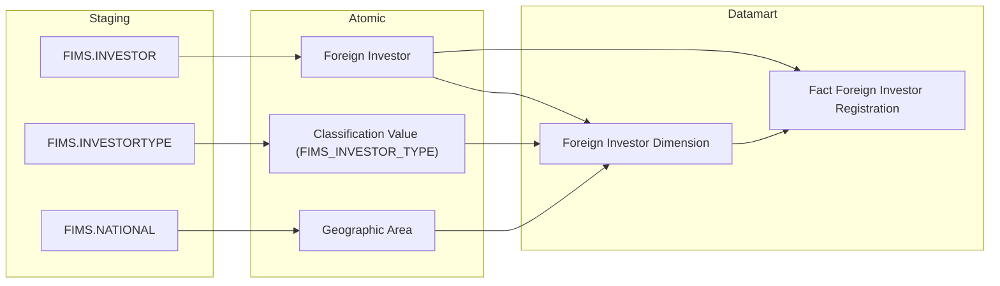
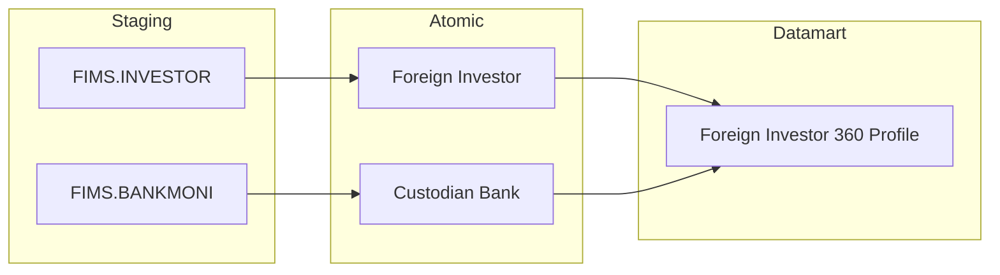
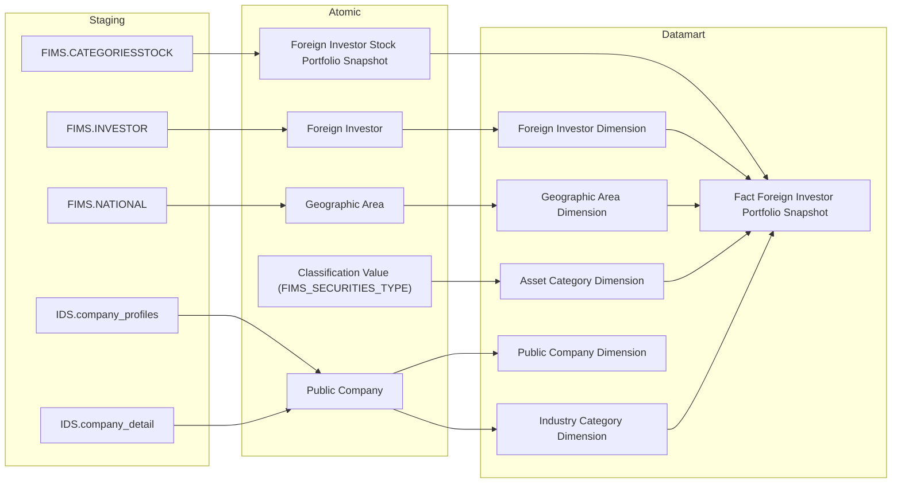
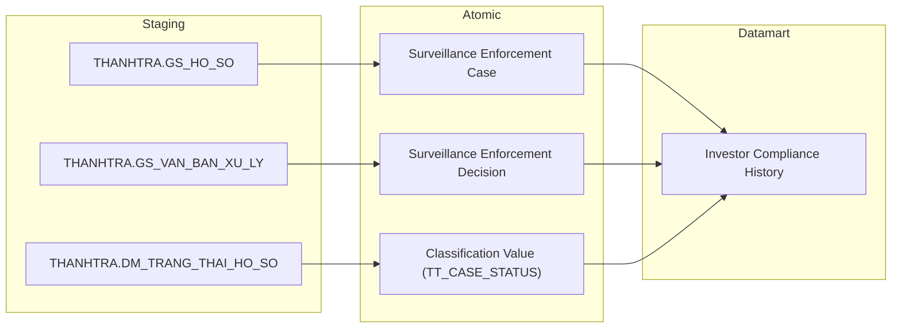
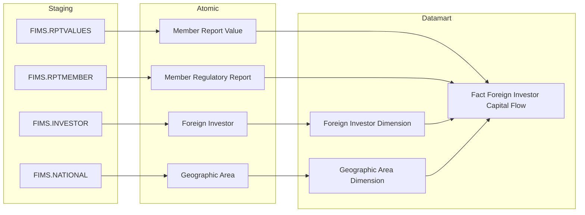
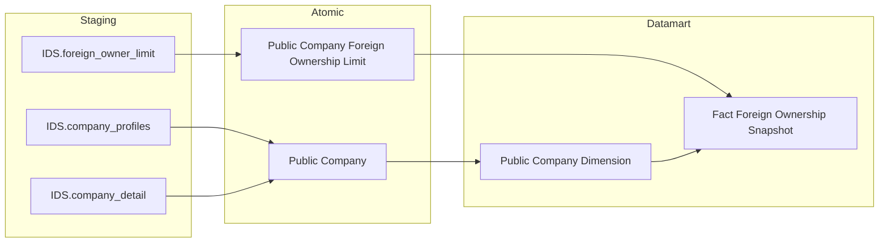
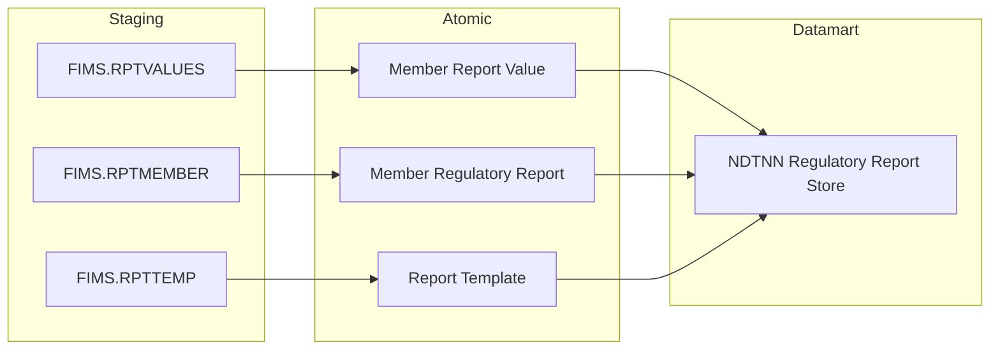

## 3.2.4 Luồng đồng bộ dữ liệu cho nhóm báo cáo Nhà đầu tư nước ngoài

### 3.2.4.1 Thông tin chung luồng đồng bộ

- Tên job:
- Nguồn dữ liệu (hệ thống nguồn): FIMS, IDS, THANHTRA
- Cách thức truy xuất đồng bộ dữ liệu:
- Tần suất đồng bộ dữ liệu:
- Dung lượng dữ liệu sẽ thực hiện đồng bộ:
- Thời gian lưu trữ dữ liệu:
- Thư mục lưu trữ dữ liệu trên kho dữ liệu:

---

### 3.2.4.2 Luồng nghiệp vụ

#### 3.2.4.2.1 Nhóm thông tin Đăng ký NĐT nước ngoài

**Mục đích:** Phục vụ Tab GIAO DỊCH — nhóm thông tin tăng trưởng NĐT mới (Box 2–4), cung cấp bảng `Fact Foreign Investor Registration` ghi nhận sự kiện đăng ký mã giao dịch của NĐTNN và `Foreign Investor Dimension` lưu thông tin định danh NĐT.

**Mô tả luồng:**

Staging → Atomic:

- **Foreign Investor:** Bảng lưu thông tin định danh nhà đầu tư nước ngoài lấy thông tin từ bảng FIMS.INVESTOR
- **Classification Value (FIMS_INVESTOR_TYPE):** Bảng code value lưu danh mục loại hình nhà đầu tư lấy thông tin từ bảng FIMS.INVESTORTYPE
- **Geographic Area:** Bảng lưu thông tin quốc gia / quốc tịch lấy thông tin từ bảng FIMS.NATIONAL

Atomic → Datamart:

- **Foreign Investor Dimension:** Bảng lưu thông tin định danh NĐT nước ngoài — mã giao dịch, tên, loại đối tượng, loại hình, quốc tịch (SCD2)
- **Fact Foreign Investor Registration:** Bảng sự kiện tổng hợp thông tin đăng ký mã giao dịch — 1 row per NĐT NN, grain = 1 NĐT × 1 ngày đăng ký

---

#### 3.2.4.2.2 Nhóm thông tin Hồ sơ 360° NĐT nước ngoài

**Mục đích:** Phục vụ Tab NĐTNN 360 — Danh sách tìm kiếm và Sub-tab A Hồ sơ định danh, cung cấp bảng `Foreign Investor 360 Profile` lưu trạng thái mới nhất của từng NĐT để tra cứu hồ sơ 360° theo mã FII hoặc tên NĐT.

**Mô tả luồng:**

Staging → Atomic:

- **Foreign Investor:** Bảng lưu thông tin định danh nhà đầu tư nước ngoài lấy thông tin từ bảng FIMS.INVESTOR
- **Custodian Bank:** Bảng lưu thông tin ngân hàng lưu ký lấy thông tin từ bảng FIMS.BANKMONI

Atomic → Datamart:

- **Foreign Investor 360 Profile:** Bảng tác nghiệp lưu danh sách NĐT nước ngoài ở trạng thái mới nhất — denormalize từ Foreign Investor kết hợp tên ngân hàng lưu ký, phục vụ tra cứu nhanh hồ sơ định danh 360°

---

#### 3.2.4.2.3 Nhóm thông tin Danh mục chứng khoán NĐTNN

**Mục đích:** Phục vụ Tab DANH MỤC (Nhóm 6–8) và Tab NĐTNN 360 Sub-tab B Biến động tài sản, cung cấp bảng `Fact Foreign Investor Portfolio Snapshot` lưu periodic snapshot danh mục chứng khoán NĐTNN theo tháng, phân tích theo loại tài sản, nhóm ngành, quốc gia.

**Mô tả luồng:**

Staging → Atomic:

- **Foreign Investor Stock Portfolio Snapshot:** Bảng lưu vị thế sở hữu chứng khoán của NĐTNN lấy thông tin từ bảng FIMS.CATEGORIESSTOCK
- **Foreign Investor:** Bảng lưu thông tin định danh nhà đầu tư nước ngoài lấy thông tin từ bảng FIMS.INVESTOR
- **Geographic Area:** Bảng lưu thông tin quốc gia / quốc tịch lấy thông tin từ bảng FIMS.NATIONAL
- **Public Company:** Bảng lưu thông tin công ty đại chúng lấy thông tin từ bảng IDS.company_profiles, kết hợp thông tin ngành nghề từ bảng IDS.company_detail
- **Classification Value (FIMS_SECURITIES_TYPE):** Bảng code value lưu danh mục loại hình chứng khoán lấy thông tin từ scheme FIMS_SECURITIES_TYPE

Atomic → Datamart:

- **Asset Category Dimension:** Bảng lưu danh mục loại hình tài sản đầu tư (5 giá trị: Cổ phiếu CCQ niêm yết / Trái phiếu / UPCoM / Vốn góp CK khác / Tiền tương đương)
- **Foreign Investor Dimension:** Bảng lưu thông tin định danh NĐT nước ngoài — mã giao dịch, tên, loại đối tượng, quốc tịch (SCD2)
- **Geographic Area Dimension:** Bảng lưu thông tin quốc gia / quốc tịch (SCD2)
- **Industry Category Dimension:** Bảng lưu thông tin nhóm ngành kinh tế — ETL-derived Conformed Dim từ Public Company
- **Public Company Dimension:** Bảng lưu thông tin công ty đại chúng — mã CK, nhóm ngành Level1/Level2 (SCD2)
- **Fact Foreign Investor Portfolio Snapshot:** Bảng sự kiện tổng hợp thông tin danh mục chứng khoán NĐTNN — grain = 1 NĐT × 1 mã tài sản × 1 tháng snapshot

---

#### 3.2.4.2.4 Nhóm thông tin Lịch sử tuân thủ NĐTNN

**Mục đích:** Phục vụ Tab NĐTNN 360 — Sub-tab C Lịch sử tuân thủ, cung cấp bảng `Investor Compliance History` lưu lịch sử quyết định xử lý và xử phạt hành chính của từng NĐT nước ngoài từ phân hệ Giám sát (THANHTRA).

**Mô tả luồng:**

Staging → Atomic:

- **Surveillance Enforcement Case:** Bảng lưu thông tin hồ sơ giám sát NĐT lấy thông tin từ bảng THANHTRA.GS_HO_SO
- **Surveillance Enforcement Decision:** Bảng lưu thông tin văn bản xử lý / quyết định xử phạt lấy thông tin từ bảng THANHTRA.GS_VAN_BAN_XU_LY
- **Classification Value (TT_CASE_STATUS):** Bảng code value lưu danh mục trạng thái hồ sơ giám sát lấy thông tin từ bảng THANHTRA.DM_TRANG_THAI_HO_SO

Atomic → Datamart:

- **Investor Compliance History:** Bảng tác nghiệp lưu danh sách quyết định xử lý / xử phạt của NĐT nước ngoài ở trạng thái mới nhất — denormalize từ Surveillance Enforcement Decision join ngược Surveillance Enforcement Case, grain = 1 quyết định xử lý per NĐT

---

#### 3.2.4.2.5 Nhóm thông tin Dòng vốn đầu tư gián tiếp

**Mục đích:** Phục vụ Tab GIÁM SÁT DÒNG VỐN (Nhóm 3–5) và Tab DATA EXPLORER Nhóm 11a, cung cấp bảng `Fact Foreign Investor Capital Flow` ghi nhận sự kiện vào/ra vốn đầu tư gián tiếp của NĐTNN từ báo cáo định kỳ nộp vào FIMS (TT51/2021).

**Mô tả luồng:**

Staging → Atomic:

- **Member Report Value:** Bảng lưu giá trị từng chỉ tiêu trong lần nộp báo cáo lấy thông tin từ bảng FIMS.RPTVALUES
- **Member Regulatory Report:** Bảng lưu thông tin lần nộp báo cáo định kỳ lấy thông tin từ bảng FIMS.RPTMEMBER
- **Foreign Investor:** Bảng lưu thông tin định danh nhà đầu tư nước ngoài lấy thông tin từ bảng FIMS.INVESTOR
- **Geographic Area:** Bảng lưu thông tin quốc gia / quốc tịch lấy thông tin từ bảng FIMS.NATIONAL

Atomic → Datamart:

- **Foreign Investor Dimension:** Bảng lưu thông tin định danh NĐT nước ngoài (SCD2)
- **Geographic Area Dimension:** Bảng lưu thông tin quốc gia / quốc tịch (SCD2)
- **Fact Foreign Investor Capital Flow:** Bảng sự kiện tổng hợp thông tin dòng vốn đầu tư gián tiếp — grain = 1 sự kiện IN/OUT × 1 NĐT × 1 ngày báo cáo

---

#### 3.2.4.2.6 Nhóm thông tin Giới hạn sở hữu nước ngoài — ROOM

**Mục đích:** Phục vụ Tab DANH MỤC Nhóm 9 (ROOM), cung cấp bảng `Fact Foreign Ownership Snapshot` lưu periodic snapshot tỷ lệ sở hữu tổng hợp và giới hạn ROOM của từng mã chứng khoán theo ngày.

**Mô tả luồng:**

Staging → Atomic:

- **Public Company Foreign Ownership Limit:** Bảng lưu giới hạn tỷ lệ sở hữu nước ngoài tối đa (Max Ownership Rate) theo từng công ty đại chúng lấy thông tin từ bảng IDS.foreign_owner_limit
- **Public Company:** Bảng lưu thông tin công ty đại chúng lấy thông tin từ bảng IDS.company_profiles, kết hợp thông tin ngành nghề từ bảng IDS.company_detail

Atomic → Datamart:

- **Public Company Dimension:** Bảng lưu thông tin công ty đại chúng — mã CK, tên công ty, nhóm ngành Level1/Level2 (SCD2)
- **Fact Foreign Ownership Snapshot:** Bảng sự kiện tổng hợp thông tin ROOM sở hữu nước ngoài — grain = 1 mã CK × 1 ngày snapshot, ETL pre-aggregate tổng tỷ lệ sở hữu từ FIMS.CATEGORIESSTOCK join IDS.foreign_owner_limit

---

#### 3.2.4.2.7 Nhóm thông tin Báo cáo TT51 — Generic Store

**Mục đích:** Phục vụ Tab DATA EXPLORER Nhóm 12 — lưu trữ và tra cứu nội dung 26 mẫu biểu báo cáo TT51/2021/TT-BTC từ 8 nhóm đối tượng nộp vào FIMS, cung cấp bảng `NDTNN Regulatory Report Store` theo kiến trúc generic store (1 bảng thay cho 23 bảng riêng).

**Mô tả luồng:**

Staging → Atomic:

- **Member Report Value:** Bảng lưu giá trị từng chỉ tiêu (cell code, cell value) trong lần nộp báo cáo lấy thông tin từ bảng FIMS.RPTVALUES
- **Member Regulatory Report:** Bảng lưu thông tin metadata lần nộp báo cáo định kỳ lấy thông tin từ bảng FIMS.RPTMEMBER
- **Report Template:** Bảng lưu thông tin biểu mẫu báo cáo (mã, tên biểu mẫu TT51) lấy thông tin từ bảng FIMS.RPTTEMP

Atomic → Datamart:

- **NDTNN Regulatory Report Store:** Bảng tác nghiệp lưu danh sách chỉ tiêu báo cáo TT51 nộp vào FIMS ở trạng thái mới nhất — grain = 1 lần nộp × 1 chỉ tiêu (Cell Code), filter theo Report Template Code và Member Object Type Code để truy xuất đúng mẫu biểu
