# 3. KHO DỮ LIỆU (OLAP) — Nhà đầu tư nước ngoài

## 3.1 Mô hình dữ liệu mức High Level / Conceptual

### 3.1.1 Sơ đồ ERD

```mermaid
erDiagram
    CALENDAR_DATE_DIMENSION ||--o{ FACT_FOREIGN_INVESTOR_REGISTRATION : " "
    FOREIGN_INVESTOR_DIMENSION ||--o{ FACT_FOREIGN_INVESTOR_REGISTRATION : " "

    CALENDAR_DATE_DIMENSION ||--o{ FACT_FOREIGN_INVESTOR_PORTFOLIO_SNAPSHOT : " "
    FOREIGN_INVESTOR_DIMENSION ||--o{ FACT_FOREIGN_INVESTOR_PORTFOLIO_SNAPSHOT : " "
    GEOGRAPHIC_AREA_DIMENSION ||--o{ FACT_FOREIGN_INVESTOR_PORTFOLIO_SNAPSHOT : " "
    ASSET_CATEGORY_DIMENSION ||--o{ FACT_FOREIGN_INVESTOR_PORTFOLIO_SNAPSHOT : " "
    INDUSTRY_CATEGORY_DIMENSION ||--o{ FACT_FOREIGN_INVESTOR_PORTFOLIO_SNAPSHOT : " "

    CALENDAR_DATE_DIMENSION ||--o{ FACT_FOREIGN_INVESTOR_CAPITAL_FLOW : " "
    FOREIGN_INVESTOR_DIMENSION ||--o{ FACT_FOREIGN_INVESTOR_CAPITAL_FLOW : " "
    GEOGRAPHIC_AREA_DIMENSION ||--o{ FACT_FOREIGN_INVESTOR_CAPITAL_FLOW : " "

    CALENDAR_DATE_DIMENSION ||--o{ FACT_FOREIGN_OWNERSHIP_SNAPSHOT : " "
    PUBLIC_COMPANY_DIMENSION ||--o{ FACT_FOREIGN_OWNERSHIP_SNAPSHOT : " "

    FOREIGN_INVESTOR_360_PROFILE
    INVESTOR_COMPLIANCE_HISTORY
    NDTNN_REGULATORY_REPORT_STORE
```



### 3.1.2 Danh sách thực thể

| STT | Thực thể | Tên bảng | Mô tả |
|---|---|---|---|
| 1 | Calendar Date Dimension | cdr_dt_dim | Lịch ngày — năm/quý/tháng phục vụ slicer và phân tích theo thời gian |
| 2 | Foreign Investor Dimension | frgn_ivsr_dim | NĐTNN — Mã GD / Tên / ObjectType / Loại hình / Quốc tịch (SCD2) |
| 3 | Geographic Area Dimension | geo_dim | Quốc gia / quốc tịch — FIMS.NATIONAL (SCD2) |
| 4 | Asset Category Dimension | ast_cgy_dim | Loại hình tài sản 5 giá trị: Cổ phiếu CCQ niêm yết / Trái phiếu / UPCoM / Vốn góp CK khác / Tiền (SCD2) |
| 5 | Industry Category Dimension | idy_cgy_dim | Nhóm ngành — ETL-derived Conformed Dim từ Public Company.Industry Category Level1 Code (IDS). Tái sử dụng cross-module (SCD2) |
| 6 | Public Company Dimension | pblc_co_dim | Công ty đại chúng — IDS.company_profiles + company_detail. Chứa Stock Code + Industry Category Level1 Code (SCD2) |
| 7 | Fact Foreign Investor Registration | fct_frgn_ivsr_rgst | Event đăng ký MSGD — 1 row per NĐT NN đăng ký mã giao dịch |
| 8 | Fact Foreign Investor Capital Flow | fct_frgn_ivsr_cptl_flow | Event vào/ra vốn — 1 row per sự kiện IN/OUT × 1 NĐT × 1 ngày báo cáo (FIMS.RPTMEMBER) |
| 9 | Fact Foreign Investor Portfolio Snapshot | fct_frgn_ivsr_prtfl_snpst | Periodic snapshot danh mục — 1 row per NĐT × 1 mã tài sản × 1 tháng |
| 10 | Fact Foreign Ownership Snapshot | fct_frgn_own_snpst | Periodic snapshot ROOM — 1 row per mã CK × 1 ngày. ETL pre-aggregate SUM(Ownership Rate) từ FIMS.CATEGORIESSTOCK trước khi join IDS.foreign_owner_limit |
| 11 | Foreign Investor 360 Profile | frgn_ivsr_360_prfl | Hồ sơ 360° NĐT — latest state / lookup 1 NĐT |
| 12 | Investor Compliance History | ivsr_cmpln_hist | Lịch sử tuân thủ NĐT — 1 row per quyết định xử lý. Driving: surveil_nfrc_dcsn. Join ngược sang surveil_nfrc_case để lấy thông tin hồ sơ cha |
| 13 | NDTNN Regulatory Report Store | ndtnn_reg_rpt_store | Generic store 26 mẫu biểu TT51/2021 — pass-through nội dung báo cáo nộp vào FIMS. 1 bảng thay vì 23 bảng riêng |

---

## 3.2 Mô hình dữ liệu mức Logic

### 3.2.1 Sơ đồ ERD

```mermaid
erDiagram
    CALENDAR_DATE_DIMENSION["Calendar Date Dimension"] {
        string Date_Dimension_Id PK
        date Full_Date NK
        int Year
        int Month
        int Day_Of_Year
        date Month_Start_Date
        date Month_End_Date
    }
    FOREIGN_INVESTOR_DIMENSION["Foreign Investor Dimension"] {
        string Investor_Dimension_Id PK
        string Investor_Code NK
        string Investor_Name
        string English_Name
        string Investor_Object_Type_Code
        string Investor_Type_Code
        string Nationality_Code
        string Custodian_Bank_Code
        string Director_Name
        string Life_Cycle_Status_Code
        timestamp Created_Timestamp
    }
    GEOGRAPHIC_AREA_DIMENSION["Geographic Area Dimension"] {
        string Geographic_Area_Dimension_Id PK
        string Geographic_Area_Code NK
        string Geographic_Area_Short_Code
        string Geographic_Area_Name
        string Life_Cycle_Status_Code
    }
    ASSET_CATEGORY_DIMENSION["Asset Category Dimension"] {
        string Asset_Category_Dimension_Id PK
        string Asset_Category_Code NK
        string Asset_Category_Name
    }
    INDUSTRY_CATEGORY_DIMENSION["Industry Category Dimension"] {
        string Industry_Category_Dimension_Id PK
        string Industry_Category_Code NK
        string Industry_Category_Name
        string Parent_Category_Code
    }
    PUBLIC_COMPANY_DIMENSION["Public Company Dimension"] {
        string Public_Company_Dimension_Id PK
        string Public_Company_Id NK
        string Stock_Code
        string Public_Company_Code
        string Public_Company_Name
        string Industry_Category_Level1_Code
        string Industry_Category_Level2_Code
        string Equity_Listing_Exchange_Code
        string Life_Cycle_Status_Code
    }
    FACT_FOREIGN_INVESTOR_REGISTRATION["Fact Foreign Investor Registration"] {
        string Investor_Dimension_Id FK
        string Registration_Date_Dimension_Id FK
    }
    FACT_FOREIGN_INVESTOR_CAPITAL_FLOW["Fact Foreign Investor Capital Flow"] {
        string Report_Date_Dimension_Id FK
        string Investor_Dimension_Id FK
        string Country_Dimension_Id FK
        string Event_Type_Code
        float Capital_Amount
    }
    FACT_FOREIGN_INVESTOR_PORTFOLIO_SNAPSHOT["Fact Foreign Investor Portfolio Snapshot"] {
        string Investor_Dimension_Id FK
        string Snapshot_Date_Dimension_Id FK
        string Country_Dimension_Id FK
        string Asset_Category_Dimension_Id FK
        string Industry_Category_Dimension_Id FK
        string Securities_Company_Code
        int Quantity
        float Ownership_Rate
        float Portfolio_Market_Value
    }
    FACT_FOREIGN_OWNERSHIP_SNAPSHOT["Fact Foreign Ownership Snapshot"] {
        string Public_Company_Dimension_Id FK
        string Snapshot_Date_Dimension_Id FK
        float Total_Ownership_Rate
        float Max_Ownership_Rate
    }
    FOREIGN_INVESTOR_360_PROFILE["Foreign Investor 360 Profile"] {
        string Foreign_Investor_Profile_Id PK
        string Investor_Code
        string Investor_Name
        string English_Name
        string Investor_Object_Type_Code
        string Investor_Type_Code
        string Nationality_Code
        string Custodian_Bank_Name
        string Director_Name
        string Life_Cycle_Status_Code
        date Created_Date
    }
    INVESTOR_COMPLIANCE_HISTORY["Investor Compliance History"] {
        string Enforcement_Decision_Id PK
        string Investor_Code
        string Decision_Code
        string Enforcement_Case_Code
        string Subject_Name
        string Penalty_Decision_Number
        date Decision_Date
        string Decision_Status_Code
        string Penalty_Content
        float Total_Penalty_Amount
        string Case_Status_Code
        string Case_Content
        string Business_Sector_Code
    }
    NDTNN_REGULATORY_REPORT_STORE["NDTNN Regulatory Report Store"] {
        string Report_Value_Id PK
        string Member_Regulatory_Report_Code
        string Report_Type_Code
        string Report_Template_Code
        string Report_Template_Name
        string Member_Object_Type_Code
        string Member_Code
        string Reporting_Period_Type_Code
        int Period_Value
        int Report_Year
        date Report_Date
        date Submission_Status_Code
        string Cell_Code
        string Cell_Name
        string Cell_Value
    }

    CALENDAR_DATE_DIMENSION ||--o{ FACT_FOREIGN_INVESTOR_REGISTRATION : " "
    FOREIGN_INVESTOR_DIMENSION ||--o{ FACT_FOREIGN_INVESTOR_REGISTRATION : " "
    CALENDAR_DATE_DIMENSION ||--o{ FACT_FOREIGN_INVESTOR_PORTFOLIO_SNAPSHOT : " "
    FOREIGN_INVESTOR_DIMENSION ||--o{ FACT_FOREIGN_INVESTOR_PORTFOLIO_SNAPSHOT : " "
    GEOGRAPHIC_AREA_DIMENSION ||--o{ FACT_FOREIGN_INVESTOR_PORTFOLIO_SNAPSHOT : " "
    ASSET_CATEGORY_DIMENSION ||--o{ FACT_FOREIGN_INVESTOR_PORTFOLIO_SNAPSHOT : " "
    INDUSTRY_CATEGORY_DIMENSION ||--o{ FACT_FOREIGN_INVESTOR_PORTFOLIO_SNAPSHOT : " "
    CALENDAR_DATE_DIMENSION ||--o{ FACT_FOREIGN_INVESTOR_CAPITAL_FLOW : " "
    FOREIGN_INVESTOR_DIMENSION ||--o{ FACT_FOREIGN_INVESTOR_CAPITAL_FLOW : " "
    GEOGRAPHIC_AREA_DIMENSION ||--o{ FACT_FOREIGN_INVESTOR_CAPITAL_FLOW : " "
    CALENDAR_DATE_DIMENSION ||--o{ FACT_FOREIGN_OWNERSHIP_SNAPSHOT : " "
    PUBLIC_COMPANY_DIMENSION ||--o{ FACT_FOREIGN_OWNERSHIP_SNAPSHOT : " "
```

### 3.2.2 Danh sách các bảng và thuộc tính

#### 3.2.2.1 Bảng Calendar Date Dimension

| STT | Tên trường | Kiểu dữ liệu và độ dài | Nullable | Unique | P/F Key | Mặc định | Mô tả |
|---|---|---|---|---|---|---|---|
| 1 | Date Dimension Id | string | | X | P | | Surrogate key = YYYYMMDD |
| 2 | Full Date | date | | | | | Ngày đầy đủ |
| 3 | Year | int | X | | | | Năm — derive từ Full Date |
| 4 | Month | int | X | | | | Tháng — derive từ Full Date |
| 5 | Day Of Year | int | X | | | | Ngày trong năm — derive từ Full Date |
| 6 | Month Start Date | date | X | | | | Ngày đầu tháng — derive từ Full Date |
| 7 | Month End Date | date | X | | | | Ngày cuối tháng — derive từ Full Date |

#### 3.2.2.2 Bảng Foreign Investor Dimension

| STT | Tên trường | Kiểu dữ liệu và độ dài | Nullable | Unique | P/F Key | Mặc định | Mô tả |
|---|---|---|---|---|---|---|---|
| 1 | Investor Dimension Id | string | | X | P | | Surrogate key |
| 2 | Investor Code | string | | | | | Mã số giao dịch MSGD (Transaction Code) |
| 3 | Investor Name | string | X | | | | Tên NĐT (cá nhân: họ tên / tổ chức: tên pháp lý) |
| 4 | English Name | string | X | | | | Tên tiếng Anh |
| 5 | Investor Object Type Code | string | X | | | | Loại đối tượng: INDIVIDUAL / ORG (ETL map từ ObjectType INT) |
| 6 | Investor Type Code | string | | | | | Loại hình NĐT chi tiết |
| 7 | Nationality Code | string | X | | | | Mã quốc tịch |
| 8 | Custodian Bank Code | string | X | | | | Mã ngân hàng lưu ký |
| 9 | Director Name | string | X | | | | Tên đại diện giao dịch (tổ chức) |
| 10 | Life Cycle Status Code | string | | | | | Trạng thái hoạt động |
| 11 | Created Timestamp | timestamp | X | | | | Ngày đăng ký MSGD |

#### 3.2.2.3 Bảng Geographic Area Dimension

| STT | Tên trường | Kiểu dữ liệu và độ dài | Nullable | Unique | P/F Key | Mặc định | Mô tả |
|---|---|---|---|---|---|---|---|
| 1 | Geographic Area Dimension Id | string | | X | P | | Surrogate key |
| 2 | Geographic Area Code | string | | | | | Mã quốc gia |
| 3 | Geographic Area Short Code | string | X | | | | Mã viết tắt |
| 4 | Geographic Area Name | string | X | | | | Tên quốc gia |
| 5 | Life Cycle Status Code | string | | | | | Trạng thái |

#### 3.2.2.4 Bảng Asset Category Dimension

| STT | Tên trường | Kiểu dữ liệu và độ dài | Nullable | Unique | P/F Key | Mặc định | Mô tả |
|---|---|---|---|---|---|---|---|
| 1 | Asset Category Dimension Id | string | | X | P | | Surrogate key |
| 2 | Asset Category Code | string | | | | | Mã loại tài sản |
| 3 | Asset Category Name | string | X | | | | Tên loại tài sản (Cổ phiếu CCQ niêm yết / Trái phiếu / UPCoM / Vốn góp CK khác / Tiền tương đương) |

#### 3.2.2.5 Bảng Industry Category Dimension

| STT | Tên trường | Kiểu dữ liệu và độ dài | Nullable | Unique | P/F Key | Mặc định | Mô tả |
|---|---|---|---|---|---|---|---|
| 1 | Industry Category Dimension Id | string | | X | P | | Surrogate key — ETL generated |
| 2 | Industry Category Code | string | | | | | Mã nhóm ngành — ETL extract từ Public Company |
| 3 | Industry Category Name | string | X | | | | Tên ngành cấp 1 |
| 4 | Parent Category Code | string | X | | | | Mã danh mục cha (Level 1 parent) |

#### 3.2.2.6 Bảng Public Company Dimension

| STT | Tên trường | Kiểu dữ liệu và độ dài | Nullable | Unique | P/F Key | Mặc định | Mô tả |
|---|---|---|---|---|---|---|---|
| 1 | Public Company Dimension Id | string | | X | P | | Surrogate key |
| 2 | Public Company Id | string | | | | | Silver surrogate Id của công ty đại chúng |
| 3 | Stock Code | string | X | | | | Mã chứng khoán (ISIN) |
| 4 | Public Company Code | string | X | | | | Mã công ty đại chúng |
| 5 | Public Company Name | string | X | | | | Tên công ty tiếng Việt |
| 6 | Industry Category Level1 Code | string | | | | | Mã ngành cấp 1 |
| 7 | Industry Category Level2 Code | string | | | | | Mã ngành cấp 2 |
| 8 | Equity Listing Exchange Code | string | | | | | Sàn niêm yết |
| 9 | Life Cycle Status Code | string | | | | | Trạng thái hoạt động |

#### 3.2.2.7 Bảng Fact Foreign Investor Registration

| STT | Tên trường | Kiểu dữ liệu và độ dài | Nullable | Unique | P/F Key | Mặc định | Mô tả |
|---|---|---|---|---|---|---|---|
| 1 | Investor Dimension Id | string | | | F | | FK nhà đầu tư |
| 2 | Registration Date Dimension Id | string | | | F | | FK lịch ngày đăng ký |

#### 3.2.2.8 Bảng Fact Foreign Investor Capital Flow

| STT | Tên trường | Kiểu dữ liệu và độ dài | Nullable | Unique | P/F Key | Mặc định | Mô tả |
|---|---|---|---|---|---|---|---|
| 1 | Report Date Dimension Id | string | | | F | | FK lịch ngày báo cáo |
| 2 | Investor Dimension Id | string | | | F | | FK nhà đầu tư |
| 3 | Country Dimension Id | string | | | F | | FK quốc tịch NĐT |
| 4 | Event Type Code | string | | | | | Loại sự kiện: IN = dòng tiền vào / OUT = dòng tiền ra |
| 5 | Capital Amount | decimal(23,2) | X | | | | Số tiền vào hoặc ra (VNĐ) — luôn dương |

#### 3.2.2.9 Bảng Fact Foreign Investor Portfolio Snapshot

| STT | Tên trường | Kiểu dữ liệu và độ dài | Nullable | Unique | P/F Key | Mặc định | Mô tả |
|---|---|---|---|---|---|---|---|
| 1 | Investor Dimension Id | string | | | F | | FK nhà đầu tư |
| 2 | Snapshot Date Dimension Id | string | | | F | | FK lịch ngày snapshot |
| 3 | Country Dimension Id | string | | | F | | FK quốc tịch NĐT |
| 4 | Asset Category Dimension Id | string | | | F | | FK loại tài sản |
| 5 | Industry Category Dimension Id | string | | | F | | FK nhóm ngành |
| 6 | Securities Company Code | string | X | | | | Mã công ty chứng khoán (degenerate dim) |
| 7 | Quantity | int | X | | | | Số lượng chứng khoán sở hữu |
| 8 | Ownership Rate | decimal(5,2) | X | | | | Tỷ lệ % sở hữu |
| 9 | Portfolio Market Value | decimal(23,2) | X | | | | Giá trị thị trường danh mục |

#### 3.2.2.10 Bảng Fact Foreign Ownership Snapshot

| STT | Tên trường | Kiểu dữ liệu và độ dài | Nullable | Unique | P/F Key | Mặc định | Mô tả |
|---|---|---|---|---|---|---|---|
| 1 | Public Company Dimension Id | string | | | F | | FK công ty đại chúng |
| 2 | Snapshot Date Dimension Id | string | | | F | | FK lịch ngày snapshot |
| 3 | Total Ownership Rate | decimal(5,2) | X | | | | Tổng tỷ lệ sở hữu NĐTNN per mã CK |
| 4 | Max Ownership Rate | decimal(5,2) | X | | | | Tỷ lệ sở hữu nước ngoài tối đa theo quy định |

#### 3.2.2.11 Bảng Foreign Investor 360 Profile

| STT | Tên trường | Kiểu dữ liệu và độ dài | Nullable | Unique | P/F Key | Mặc định | Mô tả |
|---|---|---|---|---|---|---|---|
| 1 | Foreign Investor Profile Id | string | | X | P | | Surrogate key ETL generated |
| 2 | Investor Code | string | | | | | Mã số giao dịch MSGD — business key NĐT nước ngoài |
| 3 | Investor Name | string | X | | | | Tên NĐT |
| 4 | English Name | string | X | | | | Tên tiếng Anh |
| 5 | Investor Object Type Code | string | X | | | | INDIVIDUAL / FUND / OTHER_ORG |
| 6 | Investor Type Code | string | X | | | | Mã loại hình NĐT |
| 7 | Nationality Code | string | X | | | | Mã quốc tịch |
| 8 | Custodian Bank Name | string | X | | | | Tên ngân hàng lưu ký |
| 9 | Director Name | string | X | | | | Tên đại diện giao dịch |
| 10 | Life Cycle Status Code | string | X | | | | Trạng thái hoạt động |
| 11 | Created Date | date | X | | | | Ngày đăng ký MSGD |

#### 3.2.2.12 Bảng Investor Compliance History

| STT | Tên trường | Kiểu dữ liệu và độ dài | Nullable | Unique | P/F Key | Mặc định | Mô tả |
|---|---|---|---|---|---|---|---|
| 1 | Enforcement Decision Id | string | | X | P | | Surrogate key ETL generated |
| 2 | Investor Code | string | X | | | | Mã NĐT NN |
| 3 | Decision Code | string | | | | | Mã quyết định xử lý |
| 4 | Enforcement Case Code | string | X | | | | Mã hồ sơ giám sát cha |
| 5 | Subject Name | string | X | | | | Tên đối tượng vi phạm |
| 6 | Penalty Decision Number | string | X | | | | Số quyết định xử phạt |
| 7 | Decision Date | date | X | | | | Ngày lập biên bản vi phạm hành chính |
| 8 | Decision Status Code | string | X | | | | Trạng thái quyết định xử lý |
| 9 | Penalty Content | string | X | | | | Nội dung xử phạt |
| 10 | Total Penalty Amount | decimal(23,2) | X | | | | Tổng số tiền phạt (VNĐ) |
| 11 | Case Status Code | string | | | | | Trạng thái hồ sơ giám sát |
| 12 | Case Content | string | X | | | | Nội dung mô tả hồ sơ |
| 13 | Business Sector Code | string | | | | | Mảng nghiệp vụ vi phạm |

#### 3.2.2.13 Bảng NDTNN Regulatory Report Store

| STT | Tên trường | Kiểu dữ liệu và độ dài | Nullable | Unique | P/F Key | Mặc định | Mô tả |
|---|---|---|---|---|---|---|---|
| 1 | Report Value Id | string | | X | P | | Surrogate key ETL generated |
| 2 | Member Regulatory Report Code | string | | | | | Mã lần nộp báo cáo |
| 3 | Report Type Code | string | X | | | | Loại báo cáo — phân biệt 23 loại biểu mẫu TT51/2021 |
| 4 | Report Template Code | string | X | | | | Mã biểu mẫu báo cáo |
| 5 | Report Template Name | string | X | | | | Tên biểu mẫu báo cáo |
| 6 | Member Object Type Code | string | X | | | | Loại đối tượng nộp: CTQLQ / CTCK / NHLK / SGDCK / VSDC / Đại diện CBTT / NĐTNN |
| 7 | Member Code | string | X | | | | Mã thành viên nộp báo cáo |
| 8 | Reporting Period Type Code | string | X | | | | Loại kỳ: Tháng / Quý / Năm |
| 9 | Period Value | int | X | | | | Giá trị kỳ (1–12 cho tháng, 1–4 cho quý) |
| 10 | Report Year | int | X | | | | Năm kỳ báo cáo |
| 11 | Report Date | date | X | | | | Ngày báo cáo |
| 12 | Submission Status Code | string | X | | | | Trạng thái nộp: Draft / Submitted / Approved |
| 13 | Cell Code | string | X | | | | Mã chỉ tiêu trong biểu mẫu |
| 14 | Cell Name | string | X | | | | Tên chỉ tiêu tương ứng Cell Code |
| 15 | Cell Value | string | X | | | | Giá trị chỉ tiêu |

---

## 3.3 Mô hình dữ liệu mức vật lý

### 3.3.1 Sơ đồ ERD

```mermaid
erDiagram
    CALENDAR_DATE_DIMENSION["cdr_dt_dim"] {
        string dt_dim_id PK
        date full_dt NK
        int yr
        int mo
        int day_of_yr
        date mo_strt_dt
        date mo_end_dt
    }
    FOREIGN_INVESTOR_DIMENSION["frgn_ivsr_dim"] {
        string ivsr_dim_id PK
        string ivsr_code NK
        string ivsr_nm
        string english_nm
        string ivsr_obj_tp_code
        string ivsr_tp_code
        string nationality_code
        string cstd_bnk_code
        string director_nm
        string lcs_code
        timestamp crt_tms
    }
    GEOGRAPHIC_AREA_DIMENSION["geo_dim"] {
        string geo_dim_id PK
        string geo_code NK
        string geo_shrt_code
        string geo_nm
        string lcs_code
    }
    ASSET_CATEGORY_DIMENSION["ast_cgy_dim"] {
        string ast_cgy_dim_id PK
        string ast_cgy_code NK
        string ast_cgy_nm
    }
    INDUSTRY_CATEGORY_DIMENSION["idy_cgy_dim"] {
        string idy_cgy_dim_id PK
        string idy_cgy_code NK
        string idy_cgy_nm
        string prn_cgy_code
    }
    PUBLIC_COMPANY_DIMENSION["pblc_co_dim"] {
        string pblc_co_dim_id PK
        string pblc_co_id NK
        string stk_code
        string pblc_co_code
        string pblc_co_nm
        string idy_cgy_level1_code
        string idy_cgy_level2_code
        string eqty_listing_exg_code
        string lcs_code
    }
    FACT_FOREIGN_INVESTOR_REGISTRATION["fct_frgn_ivsr_rgst"] {
        string ivsr_dim_id FK
        string rgst_dt_dim_id FK
    }
    FACT_FOREIGN_INVESTOR_CAPITAL_FLOW["fct_frgn_ivsr_cptl_flow"] {
        string rpt_dt_dim_id FK
        string ivsr_dim_id FK
        string cty_dim_id FK
        string ev_tp_code
        float cptl_amt
    }
    FACT_FOREIGN_INVESTOR_PORTFOLIO_SNAPSHOT["fct_frgn_ivsr_prtfl_snpst"] {
        string ivsr_dim_id FK
        string snpst_dt_dim_id FK
        string cty_dim_id FK
        string ast_cgy_dim_id FK
        string idy_cgy_dim_id FK
        string scr_co_code
        int qty
        float own_rate
        float prtfl_mkt_val
    }
    FACT_FOREIGN_OWNERSHIP_SNAPSHOT["fct_frgn_own_snpst"] {
        string pblc_co_dim_id FK
        string snpst_dt_dim_id FK
        float tot_own_rate
        float max_own_rate
    }
    FOREIGN_INVESTOR_360_PROFILE["frgn_ivsr_360_prfl"] {
        string frgn_ivsr_prfl_id PK
        string ivsr_code
        string ivsr_nm
        string english_nm
        string ivsr_obj_tp_code
        string ivsr_tp_code
        string nationality_code
        string cstd_bnk_nm
        string director_nm
        string lcs_code
        date crt_dt
    }
    INVESTOR_COMPLIANCE_HISTORY["ivsr_cmpln_hist"] {
        string surveil_nfrc_dcsn_id PK
        string ivsr_code
        string dcsn_code
        string surveil_nfrc_case_code
        string sbj_nm
        string pny_dcsn_nbr
        date dcsn_dt
        string dcsn_st_code
        string pny_cntnt
        float tot_pny_amt
        string case_st_code
        string case_cntnt
        string bsn_sctr_code
    }
    NDTNN_REGULATORY_REPORT_STORE["ndtnn_reg_rpt_store"] {
        string rpt_val_id PK
        string mbr_reg_rpt_code
        string rpt_tp_code
        string rpt_tpl_code
        string rpt_tpl_nm
        string mbr_obj_tp_code
        string mbr_code
        string rpt_prd_tp_code
        int prd_val
        int rpt_yr
        date rpt_dt
        string submission_st_code
        string cell_code
        string cell_nm
        string cell_val
    }

    CALENDAR_DATE_DIMENSION ||--o{ FACT_FOREIGN_INVESTOR_REGISTRATION : " "
    FOREIGN_INVESTOR_DIMENSION ||--o{ FACT_FOREIGN_INVESTOR_REGISTRATION : " "
    CALENDAR_DATE_DIMENSION ||--o{ FACT_FOREIGN_INVESTOR_PORTFOLIO_SNAPSHOT : " "
    FOREIGN_INVESTOR_DIMENSION ||--o{ FACT_FOREIGN_INVESTOR_PORTFOLIO_SNAPSHOT : " "
    GEOGRAPHIC_AREA_DIMENSION ||--o{ FACT_FOREIGN_INVESTOR_PORTFOLIO_SNAPSHOT : " "
    ASSET_CATEGORY_DIMENSION ||--o{ FACT_FOREIGN_INVESTOR_PORTFOLIO_SNAPSHOT : " "
    INDUSTRY_CATEGORY_DIMENSION ||--o{ FACT_FOREIGN_INVESTOR_PORTFOLIO_SNAPSHOT : " "
    CALENDAR_DATE_DIMENSION ||--o{ FACT_FOREIGN_INVESTOR_CAPITAL_FLOW : " "
    FOREIGN_INVESTOR_DIMENSION ||--o{ FACT_FOREIGN_INVESTOR_CAPITAL_FLOW : " "
    GEOGRAPHIC_AREA_DIMENSION ||--o{ FACT_FOREIGN_INVESTOR_CAPITAL_FLOW : " "
    CALENDAR_DATE_DIMENSION ||--o{ FACT_FOREIGN_OWNERSHIP_SNAPSHOT : " "
    PUBLIC_COMPANY_DIMENSION ||--o{ FACT_FOREIGN_OWNERSHIP_SNAPSHOT : " "
```

### 3.3.2 Danh sách bảng Dimension

#### 3.3.2.1 Bảng Calendar Date Dimension (cdr_dt_dim)

*Mô tả bảng:* Lịch ngày — năm/quý/tháng phục vụ slicer và phân tích theo thời gian
*Đường dẫn trên kho dữ liệu:*
*Các trường Partition:*
*Thời gian lưu trữ:*
*Định dạng lưu trữ:*

| STT | Tên trường | Kiểu dữ liệu và độ dài | Nullable | Unique | P/F Key | Giá trị mặc định | Mô tả | Hệ thống nguồn | Schema.Table | Source Field Name | ETL Rules |
|---|---|---|---|---|---|---|---|---|---|---|---|
| 1 | dt_dim_id | string | | X | P | | Surrogate key = YYYYMMDD | | | | ETL sinh tự động |
| 2 | full_dt | date | | | | | Ngày đầy đủ | | | | ETL sinh tự động |
| 3 | yr | int | X | | | | Năm | | | | EXTRACT(YEAR FROM cdr_dt_dim.full_dt) |
| 4 | mo | int | X | | | | Tháng | | | | EXTRACT(MONTH FROM cdr_dt_dim.full_dt) |
| 5 | day_of_yr | int | X | | | | Ngày trong năm | | | | EXTRACT(DOY FROM cdr_dt_dim.full_dt) |
| 6 | mo_strt_dt | date | X | | | | Ngày đầu tháng | | | | DATE_TRUNC('month', cdr_dt_dim.full_dt) |
| 7 | mo_end_dt | date | X | | | | Ngày cuối tháng | | | | LAST_DAY(cdr_dt_dim.full_dt) |

#### 3.3.2.2 Bảng Foreign Investor Dimension (frgn_ivsr_dim)

*Mô tả bảng:* NĐTNN — Mã GD / Tên / ObjectType / Loại hình / Quốc tịch (SCD2)
*Đường dẫn trên kho dữ liệu:*
*Các trường Partition:*
*Thời gian lưu trữ:*
*Định dạng lưu trữ:*

| STT | Tên trường | Kiểu dữ liệu và độ dài | Nullable | Unique | P/F Key | Giá trị mặc định | Mô tả | Hệ thống nguồn | Schema.Table | Source Field Name | ETL Rules |
|---|---|---|---|---|---|---|---|---|---|---|---|
| 1 | ivsr_dim_id | string | | X | P | | Surrogate key | | | | ETL sinh tự động |
| 2 | ivsr_code | string | | | | | Mã số giao dịch MSGD | FIMS | ATM.frgn_ivsr | txn_code | frgn_ivsr.txn_code |
| 3 | ivsr_nm | string | X | | | | Tên NĐT | FIMS | ATM.frgn_ivsr | full_nm | frgn_ivsr.full_nm |
| 4 | english_nm | string | X | | | | Tên tiếng Anh | FIMS | ATM.frgn_ivsr | en_nm | frgn_ivsr.en_nm |
| 5 | ivsr_obj_tp_code | string | X | | | | Loại đối tượng: INDIVIDUAL / ORG | FIMS | ATM.frgn_ivsr | ivsr_obj_tp_code | frgn_ivsr.ivsr_obj_tp_code |
| 6 | ivsr_tp_code | string | | | | | Loại hình NĐT chi tiết | FIMS | ATM.frgn_ivsr | ivsr_tp_code | frgn_ivsr.ivsr_tp_code |
| 7 | nationality_code | string | X | | | | Mã quốc tịch | FIMS | ATM.frgn_ivsr | nat_code | frgn_ivsr.nat_code |
| 8 | cstd_bnk_code | string | X | | | | Mã ngân hàng lưu ký | FIMS | ATM.frgn_ivsr | cstd_bnk_code | frgn_ivsr.cstd_bnk_code |
| 9 | director_nm | string | X | | | | Tên đại diện giao dịch | FIMS | ATM.frgn_ivsr | director_nm | frgn_ivsr.director_nm |
| 10 | lcs_code | string | | | | | Trạng thái hoạt động | FIMS | ATM.frgn_ivsr | lcs_code | frgn_ivsr.lcs_code |
| 11 | crt_tms | timestamp | X | | | | Ngày đăng ký MSGD | FIMS | ATM.frgn_ivsr | crt_tms | frgn_ivsr.crt_tms |

#### 3.3.2.3 Bảng Geographic Area Dimension (geo_dim)

*Mô tả bảng:* Quốc gia / quốc tịch — FIMS.NATIONAL (SCD2)
*Đường dẫn trên kho dữ liệu:*
*Các trường Partition:*
*Thời gian lưu trữ:*
*Định dạng lưu trữ:*

| STT | Tên trường | Kiểu dữ liệu và độ dài | Nullable | Unique | P/F Key | Giá trị mặc định | Mô tả | Hệ thống nguồn | Schema.Table | Source Field Name | ETL Rules |
|---|---|---|---|---|---|---|---|---|---|---|---|
| 1 | geo_dim_id | string | | X | P | | Surrogate key | | | | ETL sinh tự động |
| 2 | geo_code | string | | | | | Mã quốc gia | FIMS | ATM.geo | geo_code | geo.geo_code |
| 3 | geo_shrt_code | string | X | | | | Mã viết tắt | FIMS | ATM.geo | geo_shrt_code | geo.geo_shrt_code |
| 4 | geo_nm | string | X | | | | Tên quốc gia | FIMS | ATM.geo | geo_nm | geo.geo_nm |
| 5 | lcs_code | string | | | | | Trạng thái | FIMS | ATM.geo | lcs_code | geo.lcs_code |

#### 3.3.2.4 Bảng Asset Category Dimension (ast_cgy_dim)

*Mô tả bảng:* Loại hình tài sản 5 giá trị: Cổ phiếu CCQ niêm yết / Trái phiếu / UPCoM / Vốn góp CK khác / Tiền (SCD2)
*Đường dẫn trên kho dữ liệu:*
*Các trường Partition:*
*Thời gian lưu trữ:*
*Định dạng lưu trữ:*

| STT | Tên trường | Kiểu dữ liệu và độ dài | Nullable | Unique | P/F Key | Giá trị mặc định | Mô tả | Hệ thống nguồn | Schema.Table | Source Field Name | ETL Rules |
|---|---|---|---|---|---|---|---|---|---|---|---|
| 1 | ast_cgy_dim_id | string | | X | P | | Surrogate key | | | | ETL sinh tự động |
| 2 | ast_cgy_code | string | | | | | Mã loại tài sản | | | | ETL sinh tự động |
| 3 | ast_cgy_nm | string | X | | | | Tên loại tài sản | | | | ETL sinh tự động |

#### 3.3.2.5 Bảng Industry Category Dimension (idy_cgy_dim)

*Mô tả bảng:* Nhóm ngành — ETL-derived Conformed Dim từ Public Company.Industry Category Level1 Code (IDS). Tái sử dụng cross-module (SCD2)
*Đường dẫn trên kho dữ liệu:*
*Các trường Partition:*
*Thời gian lưu trữ:*
*Định dạng lưu trữ:*

| STT | Tên trường | Kiểu dữ liệu và độ dài | Nullable | Unique | P/F Key | Giá trị mặc định | Mô tả | Hệ thống nguồn | Schema.Table | Source Field Name | ETL Rules |
|---|---|---|---|---|---|---|---|---|---|---|---|
| 1 | idy_cgy_dim_id | string | | X | P | | Surrogate key — ETL generated | | | | ETL sinh tự động |
| 2 | idy_cgy_code | string | | | | | Mã nhóm ngành | IDS | ATM.pblc_co | idy_cgy_level1_code | pblc_co.idy_cgy_level1_code |
| 3 | idy_cgy_nm | string | X | | | | Tên ngành cấp 1 | FIMS | ATM.cv | cl_nm | INNER JOIN cv ON cv.cl_code = pblc_co.idy_cgy_level1_code AND cv.scm_code = 'IDS_INDUSTRY_CATEGORY' → cv.cl_nm |
| 4 | prn_cgy_code | string | X | | | | Mã danh mục cha | | | | ETL sinh tự động |

#### 3.3.2.6 Bảng Public Company Dimension (pblc_co_dim)

*Mô tả bảng:* Công ty đại chúng — IDS.company_profiles + company_detail. Chứa Stock Code + Industry Category Level1 Code (SCD2)
*Đường dẫn trên kho dữ liệu:*
*Các trường Partition:*
*Thời gian lưu trữ:*
*Định dạng lưu trữ:*

| STT | Tên trường | Kiểu dữ liệu và độ dài | Nullable | Unique | P/F Key | Giá trị mặc định | Mô tả | Hệ thống nguồn | Schema.Table | Source Field Name | ETL Rules |
|---|---|---|---|---|---|---|---|---|---|---|---|
| 1 | pblc_co_dim_id | string | | X | P | | Surrogate key | | | | ETL sinh tự động |
| 2 | pblc_co_id | string | | | | | Silver surrogate Id của công ty đại chúng | IDS | ATM.pblc_co | pblc_co_id | pblc_co.pblc_co_id |
| 3 | stk_code | string | X | | | | Mã chứng khoán (ISIN) | IDS | ATM.pblc_co | isin_code | pblc_co.isin_code |
| 4 | pblc_co_code | string | X | | | | Mã công ty đại chúng | IDS | ATM.pblc_co | pblc_co_code | pblc_co.pblc_co_code |
| 5 | pblc_co_nm | string | X | | | | Tên công ty tiếng Việt | IDS | ATM.pblc_co | pblc_co_nm | pblc_co.pblc_co_nm |
| 6 | idy_cgy_level1_code | string | | | | | Mã ngành cấp 1 | IDS | ATM.pblc_co | idy_cgy_level1_code | pblc_co.idy_cgy_level1_code |
| 7 | idy_cgy_level2_code | string | | | | | Mã ngành cấp 2 | IDS | ATM.pblc_co | idy_cgy_level2_code | pblc_co.idy_cgy_level2_code |
| 8 | eqty_listing_exg_code | string | | | | | Sàn niêm yết | IDS | ATM.pblc_co | eqty_listing_exg_code | pblc_co.eqty_listing_exg_code |
| 9 | lcs_code | string | | | | | Trạng thái hoạt động | IDS | ATM.pblc_co | lcs_code | pblc_co.lcs_code |

---

### 3.3.3 Danh sách bảng Detail Fact

#### 3.3.3.1 Bảng Fact Foreign Investor Registration (fct_frgn_ivsr_rgst)

*Mô tả bảng:* Event đăng ký MSGD — 1 row per NĐT NN đăng ký mã giao dịch
*Đường dẫn trên kho dữ liệu:*
*Các trường Partition:*
*Thời gian lưu trữ:*
*Định dạng lưu trữ:*

| STT | Tên trường | Kiểu dữ liệu và độ dài | Nullable | Unique | P/F Key | Giá trị mặc định | Mô tả | Hệ thống nguồn | Schema.Table | Source Field Name | ETL Rules |
|---|---|---|---|---|---|---|---|---|---|---|---|
| 1 | ivsr_dim_id | string | | | F | | FK nhà đầu tư | FIMS | ATM.frgn_ivsr | txn_code | LOOKUP frgn_ivsr_dim ON frgn_ivsr_dim.ivsr_code = frgn_ivsr.txn_code AND CAST(frgn_ivsr.crt_tms AS DATE) BETWEEN frgn_ivsr_dim.eff_dt AND frgn_ivsr_dim.expiry_dt |
| 2 | rgst_dt_dim_id | string | | | F | | FK lịch ngày đăng ký | FIMS | ATM.frgn_ivsr | crt_tms | LOOKUP cdr_dt_dim ON cdr_dt_dim.full_dt = CAST(frgn_ivsr.crt_tms AS DATE) |

#### 3.3.3.2 Bảng Fact Foreign Investor Capital Flow (fct_frgn_ivsr_cptl_flow)

*Mô tả bảng:* Event vào/ra vốn — 1 row per sự kiện IN/OUT × 1 NĐT × 1 ngày báo cáo (FIMS.RPTMEMBER)
*Đường dẫn trên kho dữ liệu:*
*Các trường Partition:*
*Thời gian lưu trữ:*
*Định dạng lưu trữ:*

| STT | Tên trường | Kiểu dữ liệu và độ dài | Nullable | Unique | P/F Key | Giá trị mặc định | Mô tả | Hệ thống nguồn | Schema.Table | Source Field Name | ETL Rules |
|---|---|---|---|---|---|---|---|---|---|---|---|
| 1 | rpt_dt_dim_id | string | | | F | | FK lịch ngày báo cáo | FIMS | ATM.mbr_reg_rpt | rpt_dt | LOOKUP cdr_dt_dim ON cdr_dt_dim.full_dt = mbr_reg_rpt.rpt_dt -- via: INNER JOIN mbr_reg_rpt ON mbr_reg_rpt.mbr_reg_rpt_id = mbr_rpt_val.mbr_reg_rpt_id |
| 2 | ivsr_dim_id | string | | | F | | FK nhà đầu tư | FIMS | ATM.mbr_reg_rpt | frgn_ivsr_code | LOOKUP frgn_ivsr_dim ON frgn_ivsr_dim.ivsr_code = mbr_reg_rpt.frgn_ivsr_code AND mbr_reg_rpt.rpt_dt BETWEEN frgn_ivsr_dim.eff_dt AND frgn_ivsr_dim.expiry_dt -- via: INNER JOIN mbr_reg_rpt ON mbr_reg_rpt.mbr_reg_rpt_id = mbr_rpt_val.mbr_reg_rpt_id |
| 3 | cty_dim_id | string | | | F | | FK quốc tịch NĐT | FIMS | ATM.frgn_ivsr | nat_code | LOOKUP geo_dim ON geo_dim.geo_code = frgn_ivsr.nat_code AND mbr_reg_rpt.rpt_dt BETWEEN geo_dim.eff_dt AND geo_dim.expiry_dt -- via: INNER JOIN mbr_reg_rpt ... INNER JOIN frgn_ivsr ON frgn_ivsr.frgn_ivsr_id = mbr_reg_rpt.frgn_ivsr_id |
| 4 | ev_tp_code | string | | | | | Loại sự kiện: IN = dòng tiền vào / OUT = dòng tiền ra | FIMS | ATM.mbr_rpt_val | cell_code | CASE WHEN mbr_rpt_val.cell_code IN ('IN_CELLS') THEN 'IN' ELSE 'OUT' END |
| 5 | cptl_amt | decimal(23,2) | X | | | | Số tiền vào hoặc ra (VNĐ) — luôn dương | FIMS | ATM.mbr_rpt_val | cell_val | mbr_rpt_val.cell_val |

#### 3.3.3.3 Bảng Fact Foreign Investor Portfolio Snapshot (fct_frgn_ivsr_prtfl_snpst)

*Mô tả bảng:* Periodic snapshot danh mục — 1 row per NĐT × 1 mã tài sản × 1 tháng
*Đường dẫn trên kho dữ liệu:*
*Các trường Partition:*
*Thời gian lưu trữ:*
*Định dạng lưu trữ:*

| STT | Tên trường | Kiểu dữ liệu và độ dài | Nullable | Unique | P/F Key | Giá trị mặc định | Mô tả | Hệ thống nguồn | Schema.Table | Source Field Name | ETL Rules |
|---|---|---|---|---|---|---|---|---|---|---|---|
| 1 | ivsr_dim_id | string | | | F | | FK nhà đầu tư | FIMS | ATM.frgn_ivsr_stk_prtfl_snpst | frgn_ivsr_code | LOOKUP frgn_ivsr_dim ON frgn_ivsr_dim.ivsr_code = frgn_ivsr_stk_prtfl_snpst.frgn_ivsr_code AND slicer_dt BETWEEN frgn_ivsr_dim.eff_dt AND frgn_ivsr_dim.expiry_dt |
| 2 | snpst_dt_dim_id | string | | | F | | FK lịch ngày snapshot | | | | LOOKUP cdr_dt_dim ON cdr_dt_dim.full_dt = slicer_dt |
| 3 | cty_dim_id | string | | | F | | FK quốc tịch NĐT | FIMS | ATM.frgn_ivsr | nat_code | LOOKUP geo_dim ON geo_dim.geo_code = frgn_ivsr.nat_code AND slicer_dt BETWEEN geo_dim.eff_dt AND geo_dim.expiry_dt -- via: INNER JOIN frgn_ivsr ON frgn_ivsr.frgn_ivsr_id = frgn_ivsr_stk_prtfl_snpst.frgn_ivsr_id |
| 4 | ast_cgy_dim_id | string | | | F | | FK loại tài sản | | | | ETL sinh tự động |
| 5 | idy_cgy_dim_id | string | | | F | | FK nhóm ngành | IDS | ATM.pblc_co | idy_cgy_level1_code | ETL sinh tự động |
| 6 | scr_co_code | string | X | | | | Mã công ty chứng khoán (degenerate dim) | FIMS | ATM.frgn_ivsr_stk_prtfl_snpst | scr_co_code | frgn_ivsr_stk_prtfl_snpst.scr_co_code |
| 7 | qty | int | X | | | | Số lượng chứng khoán sở hữu | FIMS | ATM.frgn_ivsr_stk_prtfl_snpst | qty | frgn_ivsr_stk_prtfl_snpst.qty |
| 8 | own_rate | decimal(5,2) | X | | | | Tỷ lệ % sở hữu | FIMS | ATM.frgn_ivsr_stk_prtfl_snpst | own_rate | frgn_ivsr_stk_prtfl_snpst.own_rate |
| 9 | prtfl_mkt_val | decimal(23,2) | X | | | | Giá trị thị trường danh mục | FIMS | ATM.frgn_ivsr_stk_prtfl_snpst | qty | frgn_ivsr_stk_prtfl_snpst.qty * <closing_price> |

#### 3.3.3.4 Bảng Fact Foreign Ownership Snapshot (fct_frgn_own_snpst)

*Mô tả bảng:* Periodic snapshot ROOM — 1 row per mã CK × 1 ngày. ETL pre-aggregate SUM(Ownership Rate) từ FIMS.CATEGORIESSTOCK trước khi join IDS.foreign_owner_limit
*Đường dẫn trên kho dữ liệu:*
*Các trường Partition:*
*Thời gian lưu trữ:*
*Định dạng lưu trữ:*

| STT | Tên trường | Kiểu dữ liệu và độ dài | Nullable | Unique | P/F Key | Giá trị mặc định | Mô tả | Hệ thống nguồn | Schema.Table | Source Field Name | ETL Rules |
|---|---|---|---|---|---|---|---|---|---|---|---|
| 1 | pblc_co_dim_id | string | | | F | | FK công ty đại chúng | IDS | ATM.pblc_co_frgn_own_lmt | pblc_co_id | LOOKUP pblc_co_dim ON pblc_co_dim.pblc_co_id = pblc_co_frgn_own_lmt.pblc_co_id AND slicer_dt BETWEEN pblc_co_frgn_own_lmt.eff_fm_dt AND pblc_co_frgn_own_lmt.eff_to_dt |
| 2 | snpst_dt_dim_id | string | | | F | | FK lịch ngày snapshot | | | | LOOKUP cdr_dt_dim ON cdr_dt_dim.full_dt = slicer_dt |
| 3 | tot_own_rate | decimal(5,2) | X | | | | Tổng tỷ lệ sở hữu NĐTNN per mã CK | | | | SUM(frgn_ivsr_stk_prtfl_snpst.own_rate WHERE <join_by_stock_code>) |
| 4 | max_own_rate | decimal(5,2) | X | | | | Tỷ lệ sở hữu nước ngoài tối đa theo quy định | IDS | ATM.pblc_co_frgn_own_lmt | max_own_rate | pblc_co_frgn_own_lmt.max_own_rate |

---

### 3.3.4 Danh sách bảng tác nghiệp (Operational)

#### 3.3.4.1 Bảng Foreign Investor 360 Profile (frgn_ivsr_360_prfl)

*Mô tả bảng:* Hồ sơ 360° NĐT — latest state / lookup 1 NĐT
*Đường dẫn trên kho dữ liệu:*
*Các trường Partition:*
*Thời gian lưu trữ:*
*Định dạng lưu trữ:*

| STT | Tên trường | Kiểu dữ liệu và độ dài | Nullable | Unique | P/F Key | Giá trị mặc định | Mô tả | Hệ thống nguồn | Schema.Table | Source Field Name | ETL Rules |
|---|---|---|---|---|---|---|---|---|---|---|---|
| 1 | frgn_ivsr_prfl_id | string | | X | P | | Surrogate key ETL generated | | | | ETL sinh tự động |
| 2 | ivsr_code | string | | | | | Mã số giao dịch MSGD | FIMS | ATM.frgn_ivsr | txn_code | frgn_ivsr.txn_code |
| 3 | ivsr_nm | string | X | | | | Tên NĐT | FIMS | ATM.frgn_ivsr | full_nm | frgn_ivsr.full_nm |
| 4 | english_nm | string | X | | | | Tên tiếng Anh | FIMS | ATM.frgn_ivsr | en_nm | frgn_ivsr.en_nm |
| 5 | ivsr_obj_tp_code | string | X | | | | INDIVIDUAL / FUND / OTHER_ORG | FIMS | ATM.frgn_ivsr | ivsr_obj_tp_code | frgn_ivsr.ivsr_obj_tp_code |
| 6 | ivsr_tp_code | string | X | | | | Mã loại hình NĐT | FIMS | ATM.frgn_ivsr | ivsr_tp_code | frgn_ivsr.ivsr_tp_code |
| 7 | nationality_code | string | X | | | | Mã quốc tịch | FIMS | ATM.frgn_ivsr | nat_code | frgn_ivsr.nat_code |
| 8 | cstd_bnk_nm | string | X | | | | Tên ngân hàng lưu ký | FIMS | ATM.cstd_bnk | cstd_bnk_nm | INNER JOIN cstd_bnk ON cstd_bnk.cstd_bnk_id = frgn_ivsr.cstd_bnk_id → cstd_bnk.cstd_bnk_nm |
| 9 | director_nm | string | X | | | | Tên đại diện giao dịch | FIMS | ATM.frgn_ivsr | director_nm | frgn_ivsr.director_nm |
| 10 | lcs_code | string | X | | | | Trạng thái hoạt động | FIMS | ATM.frgn_ivsr | lcs_code | frgn_ivsr.lcs_code |
| 11 | crt_dt | date | X | | | | Ngày đăng ký MSGD | FIMS | ATM.frgn_ivsr | crt_tms | CAST(frgn_ivsr.crt_tms AS DATE) |

#### 3.3.4.2 Bảng Investor Compliance History (ivsr_cmpln_hist)

*Mô tả bảng:* Lịch sử tuân thủ NĐT — 1 row per quyết định xử lý. Driving: surveil_nfrc_dcsn. Join ngược sang surveil_nfrc_case để lấy thông tin hồ sơ cha
*Đường dẫn trên kho dữ liệu:*
*Các trường Partition:*
*Thời gian lưu trữ:*
*Định dạng lưu trữ:*

| STT | Tên trường | Kiểu dữ liệu và độ dài | Nullable | Unique | P/F Key | Giá trị mặc định | Mô tả | Hệ thống nguồn | Schema.Table | Source Field Name | ETL Rules |
|---|---|---|---|---|---|---|---|---|---|---|---|
| 1 | surveil_nfrc_dcsn_id | string | | X | P | | Surrogate key ETL generated | | | | ETL sinh tự động |
| 2 | ivsr_code | string | X | | | | Mã NĐT NN | | | | ETL sinh tự động |
| 3 | dcsn_code | string | | | | | Mã quyết định xử lý | ThanhTra | ATM.surveil_nfrc_dcsn | surveil_nfrc_dcsn_code | surveil_nfrc_dcsn.surveil_nfrc_dcsn_code |
| 4 | surveil_nfrc_case_code | string | X | | | | Mã hồ sơ giám sát cha | ThanhTra | ATM.surveil_nfrc_dcsn | surveil_nfrc_case_code | surveil_nfrc_dcsn.surveil_nfrc_case_code |
| 5 | sbj_nm | string | X | | | | Tên đối tượng vi phạm | ThanhTra | ATM.surveil_nfrc_case | sbj_nm | INNER JOIN surveil_nfrc_case ON surveil_nfrc_case.surveil_nfrc_case_id = surveil_nfrc_dcsn.surveil_nfrc_case_id → surveil_nfrc_case.sbj_nm |
| 6 | pny_dcsn_nbr | string | X | | | | Số quyết định xử phạt | ThanhTra | ATM.surveil_nfrc_dcsn | pny_dcsn_nbr | surveil_nfrc_dcsn.pny_dcsn_nbr |
| 7 | dcsn_dt | date | X | | | | Ngày lập biên bản vi phạm hành chính | ThanhTra | ATM.surveil_nfrc_dcsn | vln_rpt_dt | surveil_nfrc_dcsn.vln_rpt_dt |
| 8 | dcsn_st_code | string | X | | | | Trạng thái quyết định xử lý | ThanhTra | ATM.surveil_nfrc_dcsn | dcsn_st_code | surveil_nfrc_dcsn.dcsn_st_code |
| 9 | pny_cntnt | string | X | | | | Nội dung xử phạt | ThanhTra | ATM.surveil_nfrc_dcsn | pny_cntnt | surveil_nfrc_dcsn.pny_cntnt |
| 10 | tot_pny_amt | decimal(23,2) | X | | | | Tổng số tiền phạt (VNĐ) | ThanhTra | ATM.surveil_nfrc_dcsn | tot_pny_amt | surveil_nfrc_dcsn.tot_pny_amt |
| 11 | case_st_code | string | | | | | Trạng thái hồ sơ giám sát | ThanhTra | ATM.surveil_nfrc_case | case_st_code | INNER JOIN surveil_nfrc_case ON surveil_nfrc_case.surveil_nfrc_case_id = surveil_nfrc_dcsn.surveil_nfrc_case_id → surveil_nfrc_case.case_st_code |
| 12 | case_cntnt | string | X | | | | Nội dung mô tả hồ sơ | ThanhTra | ATM.surveil_nfrc_case | case_cntnt | INNER JOIN surveil_nfrc_case ON surveil_nfrc_case.surveil_nfrc_case_id = surveil_nfrc_dcsn.surveil_nfrc_case_id → surveil_nfrc_case.case_cntnt |
| 13 | bsn_sctr_code | string | | | | | Mảng nghiệp vụ vi phạm | ThanhTra | ATM.surveil_nfrc_case | bsn_sctr_code | INNER JOIN surveil_nfrc_case ON surveil_nfrc_case.surveil_nfrc_case_id = surveil_nfrc_dcsn.surveil_nfrc_case_id → surveil_nfrc_case.bsn_sctr_code |

#### 3.3.4.3 Bảng NDTNN Regulatory Report Store (ndtnn_reg_rpt_store)

*Mô tả bảng:* Generic store 26 mẫu biểu TT51/2021 — pass-through nội dung báo cáo nộp vào FIMS. 1 bảng thay vì 23 bảng riêng
*Đường dẫn trên kho dữ liệu:*
*Các trường Partition:*
*Thời gian lưu trữ:*
*Định dạng lưu trữ:*

| STT | Tên trường | Kiểu dữ liệu và độ dài | Nullable | Unique | P/F Key | Giá trị mặc định | Mô tả | Hệ thống nguồn | Schema.Table | Source Field Name | ETL Rules |
|---|---|---|---|---|---|---|---|---|---|---|---|
| 1 | rpt_val_id | string | | X | P | | Surrogate key ETL generated | | | | ETL sinh tự động |
| 2 | mbr_reg_rpt_code | string | | | | | Mã lần nộp báo cáo | FIMS | ATM.mbr_reg_rpt | mbr_reg_rpt_code | INNER JOIN mbr_reg_rpt ON mbr_reg_rpt.mbr_reg_rpt_id = mbr_rpt_val.mbr_reg_rpt_id → mbr_reg_rpt.mbr_reg_rpt_code |
| 3 | rpt_tp_code | string | X | | | | Loại báo cáo — phân biệt 23 loại biểu mẫu TT51/2021 | FIMS | ATM.mbr_reg_rpt | rpt_tp_code | INNER JOIN mbr_reg_rpt ON mbr_reg_rpt.mbr_reg_rpt_id = mbr_rpt_val.mbr_reg_rpt_id → mbr_reg_rpt.rpt_tp_code |
| 4 | rpt_tpl_code | string | X | | | | Mã biểu mẫu báo cáo | FIMS | ATM.mbr_reg_rpt | rpt_tpl_code | INNER JOIN mbr_reg_rpt ON mbr_reg_rpt.mbr_reg_rpt_id = mbr_rpt_val.mbr_reg_rpt_id → mbr_reg_rpt.rpt_tpl_code |
| 5 | rpt_tpl_nm | string | X | | | | Tên biểu mẫu báo cáo | FIMS | ATM.rpt_tpl | rpt_tpl_nm | INNER JOIN mbr_reg_rpt ... → INNER JOIN rpt_tpl ON rpt_tpl.rpt_tpl_id = mbr_reg_rpt.rpt_tpl_id → rpt_tpl.rpt_tpl_nm |
| 6 | mbr_obj_tp_code | string | X | | | | Loại đối tượng nộp: CTQLQ / CTCK / NHLK / SGDCK / VSDC / Đại diện CBTT / NĐTNN | FIMS | ATM.mbr_reg_rpt | mbr_obj_tp_code | INNER JOIN mbr_reg_rpt ON mbr_reg_rpt.mbr_reg_rpt_id = mbr_rpt_val.mbr_reg_rpt_id → mbr_reg_rpt.mbr_obj_tp_code |
| 7 | mbr_code | string | X | | | | Mã thành viên nộp báo cáo | | | | ETL sinh tự động |
| 8 | rpt_prd_tp_code | string | X | | | | Loại kỳ: Tháng / Quý / Năm | FIMS | ATM.mbr_reg_rpt | rpt_prd_tp_code | INNER JOIN mbr_reg_rpt ON mbr_reg_rpt.mbr_reg_rpt_id = mbr_rpt_val.mbr_reg_rpt_id → mbr_reg_rpt.rpt_prd_tp_code |
| 9 | prd_val | int | X | | | | Giá trị kỳ (1–12 cho tháng, 1–4 cho quý) | FIMS | ATM.mbr_reg_rpt | prd_val | INNER JOIN mbr_reg_rpt ON mbr_reg_rpt.mbr_reg_rpt_id = mbr_rpt_val.mbr_reg_rpt_id → mbr_reg_rpt.prd_val |
| 10 | rpt_yr | int | X | | | | Năm kỳ báo cáo | FIMS | ATM.mbr_reg_rpt | rpt_yr | INNER JOIN mbr_reg_rpt ON mbr_reg_rpt.mbr_reg_rpt_id = mbr_rpt_val.mbr_reg_rpt_id → mbr_reg_rpt.rpt_yr |
| 11 | rpt_dt | date | X | | | | Ngày báo cáo | FIMS | ATM.mbr_reg_rpt | rpt_dt | INNER JOIN mbr_reg_rpt ON mbr_reg_rpt.mbr_reg_rpt_id = mbr_rpt_val.mbr_reg_rpt_id → mbr_reg_rpt.rpt_dt |
| 12 | submission_st_code | string | X | | | | Trạng thái nộp: Draft / Submitted / Approved | FIMS | ATM.mbr_reg_rpt | subm_st_code | INNER JOIN mbr_reg_rpt ON mbr_reg_rpt.mbr_reg_rpt_id = mbr_rpt_val.mbr_reg_rpt_id → mbr_reg_rpt.subm_st_code |
| 13 | cell_code | string | X | | | | Mã chỉ tiêu trong biểu mẫu | FIMS | ATM.mbr_rpt_val | cell_code | mbr_rpt_val.cell_code |
| 14 | cell_nm | string | X | | | | Tên chỉ tiêu tương ứng Cell Code | | | | ETL sinh tự động |
| 15 | cell_val | string | X | | | | Giá trị chỉ tiêu | FIMS | ATM.mbr_rpt_val | cell_val | mbr_rpt_val.cell_val |
