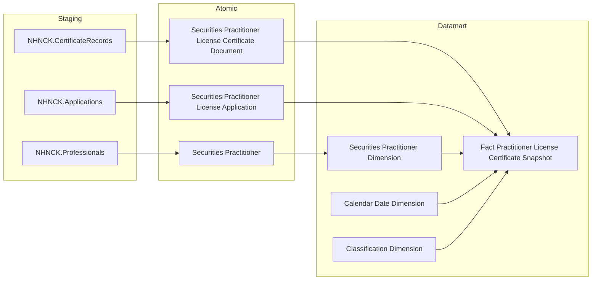
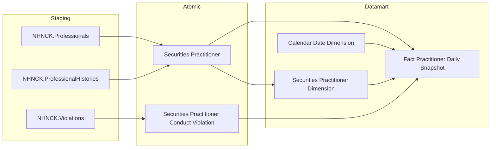
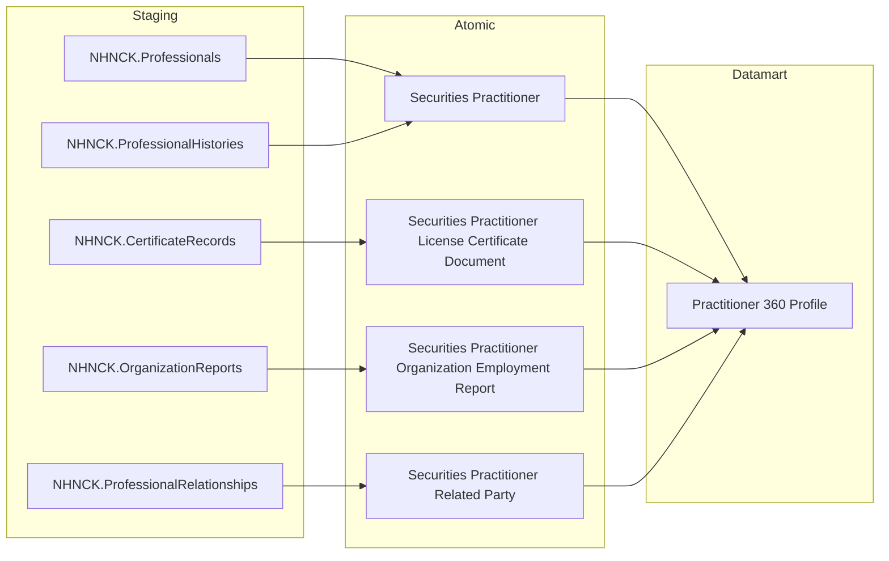
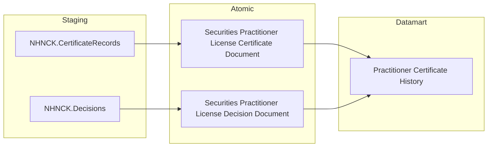
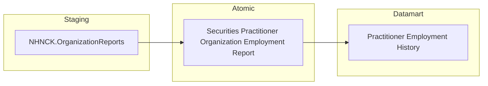
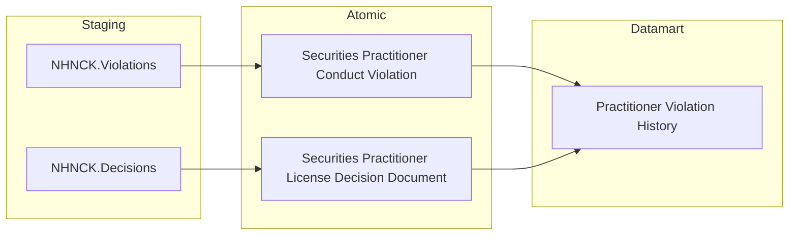
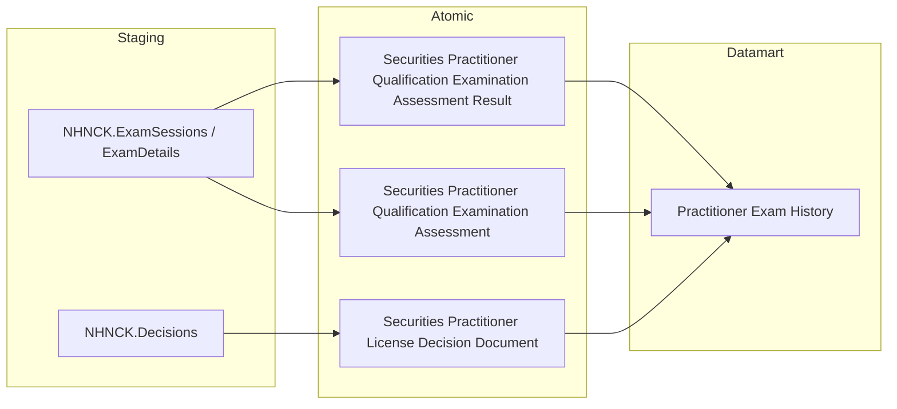
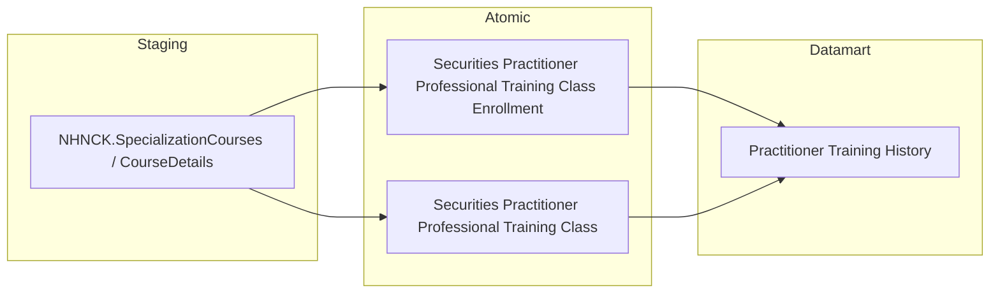
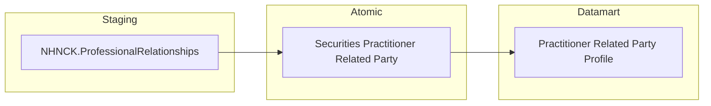
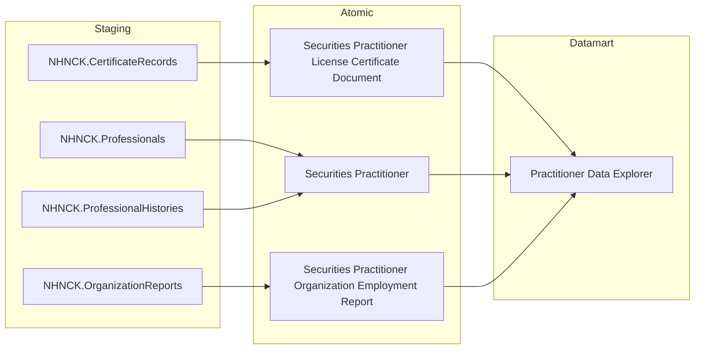

## 3.1.2 LUỒNG ĐỒNG BỘ DỮ LIỆU CHO NHÓM BÁO CÁO Người hành nghề

### 3.1.2.1 Thông tin chung luồng đồng bộ

- Tên job:
- Nguồn dữ liệu (Hệ thống nguồn): NHNCK
- Cách thức truy xuất đồng bộ dữ liệu:
- Tần suất đồng bộ dữ liệu:
- Dung lượng dữ liệu sẽ thực hiện đồng bộ:
- Thời gian lưu trữ dữ liệu:
- Thư mục lưu trữ dữ liệu trên kho dữ liệu:

---

### 3.1.2.2 Luồng nghiệp vụ

#### 3.1.2.2.1 Nhóm thông tin Chứng chỉ hành nghề — Thống kê tổng hợp

**Mục đích:** Cung cấp bảng sự kiện tổng hợp thông tin chứng chỉ hành nghề theo tháng snapshot, phục vụ Tab THỐNG KÊ CHUNG — KPI đếm CCHN theo trạng thái, loại hình, cấp mới và thu hồi.

**Mô tả luồng:**

Staging → Atomic:
- **Securities Practitioner License Certificate Document:** Bảng lưu hồ sơ chứng chỉ hành nghề — thông tin số CCHN, loại hình, trạng thái, ngày cấp, ngày thu hồi, lấy thông tin từ bảng NHNCK.CertificateRecords
- **Securities Practitioner:** Bảng lưu thông tin người hành nghề chứng khoán — định danh, họ tên, ngày sinh, trình độ, quốc tịch, trạng thái hành nghề, lấy thông tin từ bảng NHNCK.Professionals
- **Securities Practitioner License Application:** Bảng lưu hồ sơ đăng ký cấp chứng chỉ hành nghề — loại hồ sơ, ngày nộp, ngày cấp quyết định, lấy thông tin từ bảng NHNCK.Applications

Atomic → Datamart:
- **Fact Practitioner License Certificate Snapshot:** Bảng sự kiện tổng hợp thông tin 1 chứng chỉ hành nghề trên 1 tháng snapshot — phục vụ đếm CCHN theo trạng thái, loại hình, tính chỉ tiêu cấp mới, thu hồi, hủy trong năm
- **Securities Practitioner Dimension:** Bảng lưu thông tin người hành nghề chứng khoán — mã định danh, họ tên, ngày sinh, trình độ học vấn, quốc tịch, trạng thái hành nghề (SCD2)
- **Calendar Date Dimension:** Bảng lưu thông tin thời gian
- **Classification Dimension:** Bảng lưu danh mục thông tin phân loại (ví dụ: loại chứng chỉ, trạng thái chứng chỉ)

---

#### 3.1.2.2.2 Nhóm thông tin Người hành nghề — Trình độ & Phân bổ độ tuổi

**Mục đích:** Cung cấp bảng sự kiện tổng hợp thông tin người hành nghề theo ngày snapshot, phục vụ Tab THỐNG KÊ CHUNG — KPI tổng số NHN, cảnh báo NHNCK, trình độ chuyên môn và phân bổ độ tuổi.

**Mô tả luồng:**

Staging → Atomic:
- **Securities Practitioner:** Bảng lưu thông tin người hành nghề chứng khoán — định danh, họ tên, ngày sinh, trình độ, quốc tịch, trạng thái hành nghề, lấy thông tin từ bảng NHNCK.Professionals, kết hợp thông tin lịch sử từ bảng NHNCK.ProfessionalHistories
- **Securities Practitioner Conduct Violation:** Bảng lưu hồ sơ vi phạm hành vi người hành nghề — loại vi phạm, trạng thái, ghi chú, lấy thông tin từ bảng NHNCK.Violations

Atomic → Datamart:
- **Fact Practitioner Daily Snapshot:** Bảng sự kiện tổng hợp thông tin 1 người hành nghề trên 1 ngày snapshot — phục vụ đếm tổng NHN, cảnh báo vi phạm, phân bổ theo trình độ và nhóm tuổi
- **Securities Practitioner Dimension:** Bảng lưu thông tin người hành nghề chứng khoán — mã định danh, họ tên, ngày sinh, trình độ học vấn, quốc tịch, trạng thái hành nghề (SCD2)
- **Calendar Date Dimension:** Bảng lưu thông tin thời gian

---

#### 3.1.2.2.3 Nhóm thông tin Tra cứu NHN 360° — Danh sách & Header

**Mục đích:** Cung cấp bảng tác nghiệp lưu danh sách người hành nghề ở trạng thái mới nhất, phục vụ Tab TRA CỨU HỒ SƠ 360° — màn hình danh sách tra cứu và header thông tin tổng quát của từng NHN.

**Mô tả luồng:**

Staging → Atomic:
- **Securities Practitioner:** Bảng lưu thông tin người hành nghề chứng khoán — định danh, họ tên, ngày sinh, trình độ, quốc tịch, trạng thái hành nghề, lấy thông tin từ bảng NHNCK.Professionals, kết hợp thông tin lịch sử từ bảng NHNCK.ProfessionalHistories
- **Securities Practitioner License Certificate Document:** Bảng lưu hồ sơ chứng chỉ hành nghề — số CCHN, loại hình, trạng thái, ngày cấp, lấy thông tin từ bảng NHNCK.CertificateRecords
- **Securities Practitioner Organization Employment Report:** Bảng lưu báo cáo công tác tại tổ chức của người hành nghề — tên tổ chức, vị trí, ngày bắt đầu, ngày kết thúc, lấy thông tin từ bảng NHNCK.OrganizationReports
- **Securities Practitioner Related Party:** Bảng lưu thông tin người liên quan của người hành nghề — họ tên, mối quan hệ, nghề nghiệp, nơi làm việc, lấy thông tin từ bảng NHNCK.ProfessionalRelationships

Atomic → Datamart:
- **Practitioner 360 Profile:** Bảng tác nghiệp lưu danh sách người hành nghề ở trạng thái mới nhất — hồ sơ 360° tổng hợp họ tên, tuổi, quốc tịch, nơi công tác, CCHN hiện tại và số người liên quan

---

#### 3.1.2.2.4 Nhóm thông tin Lịch sử CCHN, Quá trình hành nghề, Vi phạm, Thi sát hạch, Cập nhật kiến thức — Practitioner Certificate History

**Mục đích:** Cung cấp bảng tác nghiệp lưu danh sách lịch sử chứng chỉ hành nghề ở trạng thái mới nhất, phục vụ Tab TRA CỨU HỒ SƠ 360° — sub-tab Lịch sử cấp chứng chỉ hành nghề.

**Mô tả luồng:**

Staging → Atomic:
- **Securities Practitioner License Certificate Document:** Bảng lưu hồ sơ chứng chỉ hành nghề — số CCHN, loại hình, trạng thái, ngày cấp, ngày thu hồi, lấy thông tin từ bảng NHNCK.CertificateRecords
- **Securities Practitioner License Decision Document:** Bảng lưu quyết định liên quan đến chứng chỉ hành nghề — số quyết định, loại quyết định, ngày ban hành, lấy thông tin từ bảng NHNCK.Decisions

Atomic → Datamart:
- **Practitioner Certificate History:** Bảng tác nghiệp lưu danh sách lịch sử cấp chứng chỉ ở trạng thái mới nhất — toàn bộ CCHN per NHN gồm số CCHN, loại hình, ngày cấp, ngày thu hồi, số quyết định cấp và trạng thái

---

#### 3.1.2.2.5 Nhóm thông tin Lịch sử CCHN, Quá trình hành nghề, Vi phạm, Thi sát hạch, Cập nhật kiến thức — Practitioner Employment History

**Mục đích:** Cung cấp bảng tác nghiệp lưu danh sách quá trình hành nghề ở trạng thái mới nhất, phục vụ Tab TRA CỨU HỒ SƠ 360° — sub-tab Quá trình hành nghề.

**Mô tả luồng:**

Staging → Atomic:
- **Securities Practitioner Organization Employment Report:** Bảng lưu báo cáo công tác tại tổ chức của người hành nghề — tên tổ chức, vị trí công tác, ngày bắt đầu, ngày kết thúc, lấy thông tin từ bảng NHNCK.OrganizationReports

Atomic → Datamart:
- **Practitioner Employment History:** Bảng tác nghiệp lưu danh sách quá trình hành nghề ở trạng thái mới nhất — toàn bộ lần công tác per NHN gồm tên tổ chức, vị trí, ngày bắt đầu và ngày kết thúc

---

#### 3.1.2.2.6 Nhóm thông tin Lịch sử CCHN, Quá trình hành nghề, Vi phạm, Thi sát hạch, Cập nhật kiến thức — Practitioner Violation History

**Mục đích:** Cung cấp bảng tác nghiệp lưu danh sách lịch sử vi phạm ở trạng thái mới nhất, phục vụ Tab TRA CỨU HỒ SƠ 360° — sub-tab Lịch sử vi phạm & xử phạt hành chính.

**Mô tả luồng:**

Staging → Atomic:
- **Securities Practitioner Conduct Violation:** Bảng lưu hồ sơ vi phạm hành vi người hành nghề — loại vi phạm, nội dung vi phạm, trạng thái, lấy thông tin từ bảng NHNCK.Violations
- **Securities Practitioner License Decision Document:** Bảng lưu quyết định liên quan đến chứng chỉ hành nghề — số quyết định, ngày ban hành, lấy thông tin từ bảng NHNCK.Decisions

Atomic → Datamart:
- **Practitioner Violation History:** Bảng tác nghiệp lưu danh sách lịch sử vi phạm ở trạng thái mới nhất — toàn bộ vi phạm per NHN gồm loại vi phạm, nội dung, trạng thái và số quyết định xử phạt

---

#### 3.1.2.2.7 Nhóm thông tin Lịch sử CCHN, Quá trình hành nghề, Vi phạm, Thi sát hạch, Cập nhật kiến thức — Practitioner Exam History

**Mục đích:** Cung cấp bảng tác nghiệp lưu danh sách lịch sử thi sát hạch ở trạng thái mới nhất, phục vụ Tab TRA CỨU HỒ SƠ 360° — sub-tab Đợt thi sát hạch.

**Mô tả luồng:**

Staging → Atomic:
- **Securities Practitioner Qualification Examination Assessment Result:** Bảng lưu kết quả thi sát hạch của từng người hành nghề — điểm luật, điểm chuyên môn, kết quả Đạt/Không đạt, lấy thông tin từ bảng NHNCK.ExamSessions / ExamDetails
- **Securities Practitioner Qualification Examination Assessment:** Bảng lưu thông tin đợt thi sát hạch — tên đợt, ngày thi, lấy thông tin từ bảng NHNCK.ExamSessions / ExamDetails
- **Securities Practitioner License Decision Document:** Bảng lưu quyết định liên quan đến chứng chỉ hành nghề — số quyết định công bố kết quả thi, ngày ban hành, lấy thông tin từ bảng NHNCK.Decisions

Atomic → Datamart:
- **Practitioner Exam History:** Bảng tác nghiệp lưu danh sách lịch sử thi sát hạch ở trạng thái mới nhất — toàn bộ lần thi per NHN gồm tên đợt thi, ngày thi, điểm luật, điểm chuyên môn, kết quả và số quyết định công bố

---

#### 3.1.2.2.8 Nhóm thông tin Lịch sử CCHN, Quá trình hành nghề, Vi phạm, Thi sát hạch, Cập nhật kiến thức — Practitioner Training History

**Mục đích:** Cung cấp bảng tác nghiệp lưu danh sách lịch sử cập nhật kiến thức hành nghề ở trạng thái mới nhất, phục vụ Tab TRA CỨU HỒ SƠ 360° — sub-tab Cập nhật kiến thức hành nghề.

**Mô tả luồng:**

Staging → Atomic:
- **Securities Practitioner Professional Training Class Enrollment:** Bảng lưu thông tin đăng ký tham dự khóa học cập nhật kiến thức của người hành nghề — kết quả kiểm tra, lấy thông tin từ bảng NHNCK.SpecializationCourses / CourseDetails
- **Securities Practitioner Professional Training Class:** Bảng lưu thông tin lớp học cập nhật kiến thức chuyên môn — năm học, lấy thông tin từ bảng NHNCK.SpecializationCourses / CourseDetails

Atomic → Datamart:
- **Practitioner Training History:** Bảng tác nghiệp lưu danh sách lịch sử cập nhật kiến thức ở trạng thái mới nhất — toàn bộ lần đăng ký khóa học per NHN gồm năm học và kết quả kiểm tra

---

#### 3.1.2.2.9 Nhóm thông tin Lịch sử CCHN, Quá trình hành nghề, Vi phạm, Thi sát hạch, Cập nhật kiến thức — Practitioner Related Party Profile

**Mục đích:** Cung cấp bảng tác nghiệp lưu danh sách người liên quan ở trạng thái mới nhất, phục vụ Tab TRA CỨU HỒ SƠ 360° — sub-tab Hồ sơ / Mạng lưới người liên quan.

**Mô tả luồng:**

Staging → Atomic:
- **Securities Practitioner Related Party:** Bảng lưu thông tin người liên quan của người hành nghề — họ tên, mối quan hệ, nghề nghiệp, nơi làm việc, lấy thông tin từ bảng NHNCK.ProfessionalRelationships

Atomic → Datamart:
- **Practitioner Related Party Profile:** Bảng tác nghiệp lưu danh sách mạng lưới người liên quan ở trạng thái mới nhất — toàn bộ người liên quan per NHN gồm họ tên, mối quan hệ, nghề nghiệp và nơi làm việc

---

#### 3.1.2.2.10 Nhóm thông tin Data Explorer — Tra cứu danh sách CCHN

**Mục đích:** Cung cấp bảng tác nghiệp lưu danh sách chứng chỉ hành nghề toàn thị trường ở trạng thái mới nhất, phục vụ Tab DATA EXPLORER — tra cứu flat toàn bộ CCHN với slicer Loại chứng chỉ và Trạng thái.

**Mô tả luồng:**

Staging → Atomic:
- **Securities Practitioner License Certificate Document:** Bảng lưu hồ sơ chứng chỉ hành nghề — số CCHN, loại hình, trạng thái, ngày cấp, lấy thông tin từ bảng NHNCK.CertificateRecords
- **Securities Practitioner:** Bảng lưu thông tin người hành nghề chứng khoán — định danh, họ tên, lấy thông tin từ bảng NHNCK.Professionals, kết hợp thông tin lịch sử từ bảng NHNCK.ProfessionalHistories
- **Securities Practitioner Organization Employment Report:** Bảng lưu báo cáo công tác tại tổ chức của người hành nghề — thông tin nơi công tác hiện tại, lấy thông tin từ bảng NHNCK.OrganizationReports

Atomic → Datamart:
- **Practitioner Data Explorer:** Bảng tác nghiệp lưu danh sách chứng chỉ hành nghề toàn thị trường ở trạng thái mới nhất — bảng tra cứu flat denormalized 1 CCHN per NHN, toàn bộ trạng thái, slicer Loại chứng chỉ và Trạng thái filter tại query time
