# 3. KHO DỮ LIỆU (OLAP) — Người hành nghề chứng khoán

## 3.1 Mô hình dữ liệu mức High Level / Conceptual

### 3.1.1 Sơ đồ ERD

```mermaid
erDiagram
    CALENDAR_DATE_DIMENSION ||--o{ FACT_PRACTITIONER_LICENSE_CERTIFICATE_SNAPSHOT : " "
    CALENDAR_DATE_DIMENSION ||--o{ FACT_PRACTITIONER_DAILY_SNAPSHOT : " "
    SECURITIES_PRACTITIONER_DIMENSION ||--o{ FACT_PRACTITIONER_LICENSE_CERTIFICATE_SNAPSHOT : " "
    SECURITIES_PRACTITIONER_DIMENSION ||--o{ FACT_PRACTITIONER_DAILY_SNAPSHOT : " "
    PRACTITIONER_360_PROFILE
    PRACTITIONER_CERTIFICATE_HISTORY
    PRACTITIONER_EMPLOYMENT_HISTORY
    PRACTITIONER_VIOLATION_HISTORY
    PRACTITIONER_EXAM_HISTORY
    PRACTITIONER_TRAINING_HISTORY
    PRACTITIONER_RELATED_PARTY_PROFILE
    PRACTITIONER_DATA_EXPLORER
```

### 3.1.2 Danh sách thực thể

| STT | Thực thể | Tên bảng | Mô tả |
|---|---|---|---|
| 1 | Calendar Date Dimension | cdr_dt_dim | Lịch ngày — năm/quý/tháng/ngày phục vụ slicer và phân tích theo thời gian. Conformed Dim. |
| 2 | Securities Practitioner Dimension | scr_practitioner_dim | NHN — mã định danh, họ tên, ngày sinh, trình độ, quốc tịch, trạng thái hành nghề. SCD2. |
| 3 | Fact Practitioner License Certificate Snapshot | fct_practitioner_license_ctf_snpst | Periodic Snapshot tháng — 1 CCHN × 1 tháng. Phục vụ KPI đếm CCHN theo trạng thái, loại hình, cấp mới, thu hồi. |
| 4 | Fact Practitioner Daily Snapshot | fct_practitioner_dly_snpst | Periodic Snapshot ngày — 1 NHN × 1 ngày. Phục vụ KPI đếm tổng NHN, cảnh báo, trình độ, độ tuổi. Slicer năm = filter snapshot cuối năm hoặc ngày mới nhất trong năm. |
| 5 | Practitioner 360 Profile | practitioner_360_prfl | Hồ sơ 360° NHN — latest state. Lookup 1 NHN: họ tên, tuổi, quốc tịch, nơi công tác, CCHN hiện tại, số người liên quan. |
| 6 | Practitioner Certificate History | practitioner_ctf_hist | Lịch sử cấp CCHN — toàn bộ CCHN per NHN: số CCHN, loại hình, ngày cấp, ngày thu hồi, quyết định cấp, trạng thái. |
| 7 | Practitioner Employment History | practitioner_emp_hist | Quá trình hành nghề — toàn bộ lần công tác per NHN: tổ chức, vị trí, từ tháng, đến tháng. |
| 8 | Practitioner Violation History | practitioner_vln_hist | Lịch sử vi phạm — toàn bộ vi phạm per NHN: loại vi phạm, nội dung, trạng thái, số quyết định xử phạt. |
| 9 | Practitioner Exam History | practitioner_exam_hist | Lịch sử thi sát hạch — toàn bộ lần thi per NHN: đợt thi, ngày thi, điểm luật, điểm chuyên môn, kết quả, số quyết định công bố. |
| 10 | Practitioner Training History | practitioner_trn_hist | Lịch sử cập nhật kiến thức — 1 lần đăng ký khóa học per NHN: năm học, kết quả. DRAFT — thiếu Training Hours. |
| 11 | Practitioner Related Party Profile | practitioner_rel_p_prfl | Mạng lưới người liên quan — toàn bộ người liên quan per NHN: họ tên, mối quan hệ, nghề nghiệp, nơi làm việc. |
| 12 | Practitioner Data Explorer | practitioner_data_explorer | Bảng tra cứu flat CCHN toàn thị trường — 1 CCHN per NHN, toàn bộ trạng thái. Slicer Loại hình và Trạng thái filter tại query time. Dùng cho Tab DATA EXPLORER. |

---

## 3.2 Mô hình dữ liệu mức Logic

### 3.2.1 Sơ đồ ERD

```mermaid
erDiagram
    CALENDAR_DATE_DIMENSION["Calendar Date Dimension"] {
        string Date_Dimension_Id PK
        date Full_Date
        int Year
        int Quarter
        int Month
        int Day_Of_Month
        int Day_Of_Year
        int Day_Of_Week
        int Week_Of_Year
        boolean Is_Weekend
        boolean Is_Holiday
    }
    SECURITIES_PRACTITIONER_DIMENSION["Securities Practitioner Dimension"] {
        string Practitioner_Dimension_Id PK
        string Practitioner_Code
        string Full_Name
        date Date_Of_Birth
        string Education_Level_Code
        string Nationality_Code
        string Identity_Reference_Code
        string Practice_Status_Code
    }
    FACT_PRACTITIONER_LICENSE_CERTIFICATE_SNAPSHOT["Fact Practitioner License Certificate Snapshot"] {
        string Practitioner_Dimension_Id FK
        string Issue_Date_Dimension_Id FK
        string Snapshot_Date_Dimension_Id FK
        string License_Certificate_Document_Code
        string Certificate_Type_Code
        string Certificate_Status_Code
        boolean Allow_Reissue_Indicator
        string Is_Reissue_Indicator
        date Certificate_Issue_Date
        date Revocation_Date
    }
    FACT_PRACTITIONER_DAILY_SNAPSHOT["Fact Practitioner Daily Snapshot"] {
        string Practitioner_Dimension_Id FK
        string Snapshot_Date_Dimension_Id FK
        int Age
        boolean Has_Active_Certificate
        boolean Has_Active_Violation
    }
    CALENDAR_DATE_DIMENSION ||--o{ FACT_PRACTITIONER_LICENSE_CERTIFICATE_SNAPSHOT : " "
    CALENDAR_DATE_DIMENSION ||--o{ FACT_PRACTITIONER_DAILY_SNAPSHOT : " "
    SECURITIES_PRACTITIONER_DIMENSION ||--o{ FACT_PRACTITIONER_LICENSE_CERTIFICATE_SNAPSHOT : " "
    SECURITIES_PRACTITIONER_DIMENSION ||--o{ FACT_PRACTITIONER_DAILY_SNAPSHOT : " "
    PRACTITIONER_360_PROFILE["Practitioner 360 Profile"] {
        string Practitioner_Id PK
        string Practitioner_Code
        string Full_Name
        date Date_Of_Birth
        int Age
        string Nationality_Name
        string Identity_Reference_Code
        string Practice_Status_Code
        string Practice_Status_Name
        string Current_Organization_Name
        string Active_Certificate_Number
        string Active_Certificate_Type_Code
        string Active_Certificate_Type_Name
        int Related_Party_Count
    }
    PRACTITIONER_CERTIFICATE_HISTORY["Practitioner Certificate History"] {
        string Practitioner_Id PK
        string Practitioner_Code
        string License_Certificate_Document_Code
        string Certificate_Number
        string Certificate_Type_Name
        string Certificate_Status_Name
        date Certificate_Issue_Date
        date Revocation_Date
        string Issuance_Decision_Number
    }
    PRACTITIONER_EMPLOYMENT_HISTORY["Practitioner Employment History"] {
        string Practitioner_Id PK
        string Practitioner_Code
        string Organization_Employment_Report_Code
        string Securities_Organization_Name
        string Position_Name
        date Hire_Date
        date Termination_Date
    }
    PRACTITIONER_VIOLATION_HISTORY["Practitioner Violation History"] {
        string Practitioner_Id PK
        string Practitioner_Code
        string Conduct_Violation_Code
        string Conduct_Violation_Type_Name
        string Violation_Note
        string Violation_Status_Name
        string Decision_Number
        date Decision_Issue_Date
    }
    PRACTITIONER_EXAM_HISTORY["Practitioner Exam History"] {
        string Practitioner_Id PK
        string Practitioner_Code
        string Examination_Assessment_Result_Code
        string Session_Name
        date Examination_Start_Date
        string Law_Score
        string Specialization_Score
        string Examination_Result_Code
        string Decision_Number
        date Decision_Issue_Date
    }
    PRACTITIONER_TRAINING_HISTORY["Practitioner Training History"] {
        string Practitioner_Id PK
        string Practitioner_Code
        string Enrollment_Code
        string Training_Year
        string Assessment_Result_Name
    }
    PRACTITIONER_RELATED_PARTY_PROFILE["Practitioner Related Party Profile"] {
        string Practitioner_Id PK
        string Practitioner_Code
        string Securities_Practitioner_Related_Party_Code
        string Related_Party_Full_Name
        string Relationship_Type_Name
        string Occupation_Name
        string Workplace_Name
    }
    PRACTITIONER_DATA_EXPLORER["Practitioner Data Explorer"] {
        string Practitioner_Id PK
        string Practitioner_Code
        string License_Certificate_Document_Code
        string Full_Name
        string Certificate_Number
        string Certificate_Type_Code
        string Certificate_Type_Name
        string Certificate_Status_Code
        string Certificate_Status_Name
        date Certificate_Issue_Date
        string Current_Organization_Name
    }
```

### 3.2.2 Danh sách các bảng và thuộc tính

#### 3.2.2.1 Bảng Calendar Date Dimension

| STT | Tên trường | Kiểu dữ liệu và độ dài | Nullable | Unique | P/F Key | Mặc định | Mô tả |
|---|---|---|---|---|---|---|---|
| 1 | Date Dimension Id | string | | X | P | | Surrogate key ETL generated |
| 2 | Full Date | date | | | | | Ngày đầy đủ — YYYYMMDD |
| 3 | Year | int | X | | | | Năm |
| 4 | Quarter | int | X | | | | Quý (1–4) |
| 5 | Month | int | X | | | | Tháng (1–12) |
| 6 | Day Of Month | int | X | | | | Ngày trong tháng |
| 7 | Day Of Year | int | X | | | | Ngày trong năm |
| 8 | Day Of Week | int | X | | | | Thứ trong tuần (1=CN) |
| 9 | Week Of Year | int | X | | | | Tuần trong năm |
| 10 | Is Weekend | boolean | X | | | | Cờ cuối tuần |
| 11 | Is Holiday | boolean | X | | | | Cờ ngày lễ Việt Nam |

#### 3.2.2.2 Bảng Securities Practitioner Dimension

| STT | Tên trường | Kiểu dữ liệu và độ dài | Nullable | Unique | P/F Key | Mặc định | Mô tả |
|---|---|---|---|---|---|---|---|
| 1 | Practitioner Dimension Id | string | | X | P | | Surrogate key SCD2 |
| 2 | Practitioner Code | string | | | | | Mã định danh NHN — NK dùng để join ETL |
| 3 | Full Name | string | X | | | | Họ và tên NHN |
| 4 | Date Of Birth | date | X | | | | Ngày sinh đầy đủ |
| 5 | Education Level Code | string | X | | | | Trình độ học vấn — Scheme: EDUCATION_LEVEL |
| 6 | Nationality Code | string | X | | | | Quốc tịch — Scheme: NATIONALITY |
| 7 | Identity Reference Code | string | X | | | | Mã định danh giấy tờ tùy thân |
| 8 | Practice Status Code | string | X | | | | Trạng thái hành nghề — Scheme: PRACTICE_STATUS |

#### 3.2.2.3 Bảng Fact Practitioner License Certificate Snapshot

| STT | Tên trường | Kiểu dữ liệu và độ dài | Nullable | Unique | P/F Key | Mặc định | Mô tả |
|---|---|---|---|---|---|---|---|
| 1 | Practitioner Dimension Id | string | | | F | | FK NHN |
| 2 | Issue Date Dimension Id | string | | | F | | FK lịch ngày cấp CCHN |
| 3 | Snapshot Date Dimension Id | string | | | F | | FK lịch ngày snapshot |
| 4 | License Certificate Document Code | string | X | | | | DD — BK CCHN |
| 5 | Certificate Type Code | string | X | | | | Loại CCHN — Scheme: CERTIFICATE_TYPE |
| 6 | Certificate Status Code | string | X | | | | Trạng thái CCHN — Scheme: CERTIFICATE_STATUS |
| 7 | Allow Reissue Indicator | boolean | X | | | | Cho phép cấp lại |
| 8 | Is Reissue Indicator | string | X | | | | Cờ cấp lại (Y/N) |
| 9 | Certificate Issue Date | date | X | | | | Ngày cấp CCHN |
| 10 | Revocation Date | date | X | | | | Ngày thu hồi — NULL = chưa thu hồi |

#### 3.2.2.4 Bảng Fact Practitioner Daily Snapshot

| STT | Tên trường | Kiểu dữ liệu và độ dài | Nullable | Unique | P/F Key | Mặc định | Mô tả |
|---|---|---|---|---|---|---|---|
| 1 | Practitioner Dimension Id | string | | | F | | FK NHN |
| 2 | Snapshot Date Dimension Id | string | | | F | | FK lịch ngày snapshot |
| 3 | Age | int | X | | | | Tuổi = Year(Snapshot_Date) - Year(Date_Of_Birth) |
| 4 | Has Active Certificate | boolean | X | | | | Cờ có CCHN hiệu lực tại ngày snapshot |
| 5 | Has Active Violation | boolean | X | | | | Cờ có vi phạm đang hoạt động tại ngày snapshot |

#### 3.2.2.5 Bảng Practitioner 360 Profile

| STT | Tên trường | Kiểu dữ liệu và độ dài | Nullable | Unique | P/F Key | Mặc định | Mô tả |
|---|---|---|---|---|---|---|---|
| 1 | Practitioner Id | string | | X | P | | Surrogate PK |
| 2 | Practitioner Code | string | | | | | BK NHN |
| 3 | Full Name | string | X | | | | Họ và tên |
| 4 | Date Of Birth | date | X | | | | Ngày sinh |
| 5 | Age | int | X | | | | Tuổi tại thời điểm populate |
| 6 | Nationality Name | string | X | | | | Tên quốc tịch |
| 7 | Identity Reference Code | string | X | | | | Số CMND/CCCD/Hộ chiếu |
| 8 | Practice Status Code | string | X | | | | Mã trạng thái hành nghề — Scheme: PRACTICE_STATUS |
| 9 | Practice Status Name | string | X | | | | Tên trạng thái hành nghề |
| 10 | Current Organization Name | string | X | | | | Tên tổ chức hiện tại |
| 11 | Active Certificate Number | string | X | | | | Số CCHN đang hiệu lực |
| 12 | Active Certificate Type Code | string | X | | | | Mã loại CCHN hiện tại — Scheme: CERTIFICATE_TYPE |
| 13 | Active Certificate Type Name | string | X | | | | Tên loại CCHN hiện tại |
| 14 | Related Party Count | int | X | | | | Số người liên quan |

#### 3.2.2.6 Bảng Practitioner Certificate History

| STT | Tên trường | Kiểu dữ liệu và độ dài | Nullable | Unique | P/F Key | Mặc định | Mô tả |
|---|---|---|---|---|---|---|---|
| 1 | Practitioner Id | string | | X | P | | Surrogate PK |
| 2 | Practitioner Code | string | | | | | BK NHN |
| 3 | License Certificate Document Code | string | | | | | BK CCHN |
| 4 | Certificate Number | string | X | | | | Số chứng chỉ |
| 5 | Certificate Type Name | string | X | | | | Tên loại CCHN |
| 6 | Certificate Status Name | string | X | | | | Tên trạng thái CCHN |
| 7 | Certificate Issue Date | date | X | | | | Ngày cấp |
| 8 | Revocation Date | date | X | | | | Ngày thu hồi — NULL = chưa thu hồi |
| 9 | Issuance Decision Number | string | X | | | | Số quyết định cấp |

#### 3.2.2.7 Bảng Practitioner Employment History

| STT | Tên trường | Kiểu dữ liệu và độ dài | Nullable | Unique | P/F Key | Mặc định | Mô tả |
|---|---|---|---|---|---|---|---|
| 1 | Practitioner Id | string | | X | P | | Surrogate PK |
| 2 | Practitioner Code | string | | | | | BK NHN |
| 3 | Organization Employment Report Code | string | | | | | BK báo cáo công tác |
| 4 | Securities Organization Name | string | X | | | | Tên tổ chức |
| 5 | Position Name | string | X | | | | Chức vụ |
| 6 | Hire Date | date | X | | | | Ngày tiếp nhận |
| 7 | Termination Date | date | X | | | | Ngày thôi việc — NULL = đang làm việc |

#### 3.2.2.8 Bảng Practitioner Violation History

| STT | Tên trường | Kiểu dữ liệu và độ dài | Nullable | Unique | P/F Key | Mặc định | Mô tả |
|---|---|---|---|---|---|---|---|
| 1 | Practitioner Id | string | | X | P | | Surrogate PK |
| 2 | Practitioner Code | string | | | | | BK NHN |
| 3 | Conduct Violation Code | string | | | | | BK vi phạm |
| 4 | Conduct Violation Type Name | string | X | | | | Tên loại vi phạm |
| 5 | Violation Note | string | X | | | | Nội dung vi phạm |
| 6 | Violation Status Name | string | X | | | | Tên trạng thái vi phạm |
| 7 | Decision Number | string | X | | | | Số quyết định xử phạt |
| 8 | Decision Issue Date | date | X | | | | Ngày ban hành quyết định |

#### 3.2.2.9 Bảng Practitioner Exam History

| STT | Tên trường | Kiểu dữ liệu và độ dài | Nullable | Unique | P/F Key | Mặc định | Mô tả |
|---|---|---|---|---|---|---|---|
| 1 | Practitioner Id | string | | X | P | | Surrogate PK |
| 2 | Practitioner Code | string | | | | | BK NHN |
| 3 | Examination Assessment Result Code | string | | | | | BK kết quả thi |
| 4 | Session Name | string | X | | | | Tên đợt thi |
| 5 | Examination Start Date | date | X | | | | Ngày thi |
| 6 | Law Score | string | X | | | | Điểm pháp luật |
| 7 | Specialization Score | string | X | | | | Điểm chuyên môn |
| 8 | Examination Result Code | string | X | | | | Kết quả tổng — Scheme: EXAMINATION_RESULT |
| 9 | Decision Number | string | X | | | | Số quyết định công bố kết quả |
| 10 | Decision Issue Date | date | X | | | | Ngày ban hành quyết định công bố |

#### 3.2.2.10 Bảng Practitioner Training History

| STT | Tên trường | Kiểu dữ liệu và độ dài | Nullable | Unique | P/F Key | Mặc định | Mô tả |
|---|---|---|---|---|---|---|---|
| 1 | Practitioner Id | string | | X | P | | Surrogate PK |
| 2 | Practitioner Code | string | | | | | BK NHN |
| 3 | Enrollment Code | string | | | | | BK đăng ký khóa học |
| 4 | Training Year | string | X | | | | Năm học |
| 5 | Assessment Result Name | string | X | | | | Kết quả kiểm tra |

#### 3.2.2.11 Bảng Practitioner Related Party Profile

| STT | Tên trường | Kiểu dữ liệu và độ dài | Nullable | Unique | P/F Key | Mặc định | Mô tả |
|---|---|---|---|---|---|---|---|
| 1 | Practitioner Id | string | | X | P | | Surrogate PK |
| 2 | Practitioner Code | string | | | | | BK NHN |
| 3 | Securities Practitioner Related Party Code | string | | | | | BK người liên quan |
| 4 | Related Party Full Name | string | X | | | | Họ tên người liên quan |
| 5 | Relationship Type Name | string | X | | | | Tên mối quan hệ |
| 6 | Occupation Name | string | X | | | | Nghề nghiệp |
| 7 | Workplace Name | string | X | | | | Nơi làm việc |

#### 3.2.2.12 Bảng Practitioner Data Explorer

| STT | Tên trường | Kiểu dữ liệu và độ dài | Nullable | Unique | P/F Key | Mặc định | Mô tả |
|---|---|---|---|---|---|---|---|
| 1 | Practitioner Id | string | | X | P | | Surrogate PK |
| 2 | Practitioner Code | string | | | | | BK NHN |
| 3 | License Certificate Document Code | string | X | | | | BK CCHN |
| 4 | Full Name | string | X | | | | Họ và tên NHN |
| 5 | Certificate Number | string | X | | | | Số CCHN |
| 6 | Certificate Type Code | string | X | | | | Mã loại CCHN — Scheme: CERTIFICATE_TYPE |
| 7 | Certificate Type Name | string | X | | | | Tên loại CCHN |
| 8 | Certificate Status Code | string | X | | | | Mã trạng thái CCHN — Scheme: CERTIFICATE_STATUS |
| 9 | Certificate Status Name | string | X | | | | Tên trạng thái CCHN |
| 10 | Certificate Issue Date | date | X | | | | Ngày cấp CCHN |
| 11 | Current Organization Name | string | X | | | | Tên tổ chức hiện tại |

---

## 3.3 Mô hình dữ liệu mức vật lý

### 3.3.1 Sơ đồ ERD

```mermaid
erDiagram
    CALENDAR_DATE_DIMENSION["cdr_dt_dim"] {
        string dt_dim_id PK
        date full_dt
        int yr
        int qtr
        int mo
        int day_of_mo
        int day_of_yr
        int day_of_wk
        int wk_of_yr
        boolean is_weekend
        boolean is_hol
    }
    SECURITIES_PRACTITIONER_DIMENSION["scr_practitioner_dim"] {
        string practitioner_dim_id PK
        string practitioner_code
        string full_nm
        date dob
        string ed_lvl_code
        string nationality_code
        string identity_refr_code
        string practice_st_code
    }
    FACT_PRACTITIONER_LICENSE_CERTIFICATE_SNAPSHOT["fct_practitioner_license_ctf_snpst"] {
        string practitioner_dim_id FK
        string issu_dt_dim_id FK
        string snpst_dt_dim_id FK
        string license_ctf_doc_code
        string ctf_tp_code
        string ctf_st_code
        boolean alw_reissue_ind
        string is_reissue_ind
        date ctf_issu_dt
        date revocation_dt
    }
    FACT_PRACTITIONER_DAILY_SNAPSHOT["fct_practitioner_dly_snpst"] {
        string practitioner_dim_id FK
        string snpst_dt_dim_id FK
        int age
        boolean has_actv_ctf
        boolean has_actv_vln
    }
    CALENDAR_DATE_DIMENSION ||--o{ FACT_PRACTITIONER_LICENSE_CERTIFICATE_SNAPSHOT : " "
    CALENDAR_DATE_DIMENSION ||--o{ FACT_PRACTITIONER_DAILY_SNAPSHOT : " "
    SECURITIES_PRACTITIONER_DIMENSION ||--o{ FACT_PRACTITIONER_LICENSE_CERTIFICATE_SNAPSHOT : " "
    SECURITIES_PRACTITIONER_DIMENSION ||--o{ FACT_PRACTITIONER_DAILY_SNAPSHOT : " "
    PRACTITIONER_360_PROFILE["practitioner_360_prfl"] {
        string practitioner_id PK
        string practitioner_code
        string full_nm
        date dob
        int age
        string nationality_nm
        string identity_refr_code
        string practice_st_code
        string practice_st_nm
        string crn_org_nm
        string actv_ctf_nbr
        string actv_ctf_tp_code
        string actv_ctf_tp_nm
        int rel_p_cnt
    }
    PRACTITIONER_CERTIFICATE_HISTORY["practitioner_ctf_hist"] {
        string practitioner_id PK
        string practitioner_code
        string license_ctf_doc_code
        string ctf_nbr
        string ctf_tp_nm
        string ctf_st_nm
        date ctf_issu_dt
        date revocation_dt
        string issn_dcsn_nbr
    }
    PRACTITIONER_EMPLOYMENT_HISTORY["practitioner_emp_hist"] {
        string practitioner_id PK
        string practitioner_code
        string org_emp_rpt_code
        string scr_org_nm
        string pos_nm
        date hire_dt
        date tmt_dt
    }
    PRACTITIONER_VIOLATION_HISTORY["practitioner_vln_hist"] {
        string practitioner_id PK
        string practitioner_code
        string conduct_vln_code
        string conduct_vln_tp_nm
        string vln_note
        string vln_st_nm
        string dcsn_nbr
        date dcsn_issu_dt
    }
    PRACTITIONER_EXAM_HISTORY["practitioner_exam_hist"] {
        string practitioner_id PK
        string practitioner_code
        string exam_ases_rslt_code
        string ssn_nm
        date exam_strt_dt
        string law_scor
        string specialization_scor
        string exam_rslt_code
        string dcsn_nbr
        date dcsn_issu_dt
    }
    PRACTITIONER_TRAINING_HISTORY["practitioner_trn_hist"] {
        string practitioner_id PK
        string practitioner_code
        string enrollment_code
        string trn_yr
        string ases_rslt_nm
    }
    PRACTITIONER_RELATED_PARTY_PROFILE["practitioner_rel_p_prfl"] {
        string practitioner_id PK
        string practitioner_code
        string scr_practitioner_rel_p_code
        string rel_p_full_nm
        string rltnp_tp_nm
        string ocp_nm
        string workplace_nm
    }
    PRACTITIONER_DATA_EXPLORER["practitioner_data_explorer"] {
        string practitioner_id PK
        string practitioner_code
        string license_ctf_doc_code
        string full_nm
        string ctf_nbr
        string ctf_tp_code
        string ctf_tp_nm
        string ctf_st_code
        string ctf_st_nm
        date ctf_issu_dt
        string crn_org_nm
    }
```

### 3.3.2 Danh sách bảng Dimension

#### 3.3.2.1 Bảng Calendar Date Dimension (cdr_dt_dim)

*Mô tả bảng:* Lịch ngày — năm/quý/tháng/ngày phục vụ slicer và phân tích theo thời gian. Conformed Dim.
*Đường dẫn trên kho dữ liệu:*
*Các trường Partition:*
*Thời gian lưu trữ:*
*Định dạng lưu trữ:*

| STT | Tên trường | Kiểu dữ liệu và độ dài | Nullable | Unique | P/F Key | Giá trị mặc định | Mô tả | Hệ thống nguồn | Schema.Table | Source Field Name | ETL Rules |
|---|---|---|---|---|---|---|---|---|---|---|---|
| 1 | dt_dim_id | string | | X | P | | Surrogate key ETL generated | | | | ETL sinh tự động |
| 2 | full_dt | date | | | | | Ngày đầy đủ — YYYYMMDD | | | | ETL sinh tự động |
| 3 | yr | int | X | | | | Năm | | | | ETL sinh tự động |
| 4 | qtr | int | X | | | | Quý (1–4) | | | | ETL sinh tự động |
| 5 | mo | int | X | | | | Tháng (1–12) | | | | ETL sinh tự động |
| 6 | day_of_mo | int | X | | | | Ngày trong tháng | | | | ETL sinh tự động |
| 7 | day_of_yr | int | X | | | | Ngày trong năm | | | | ETL sinh tự động |
| 8 | day_of_wk | int | X | | | | Thứ trong tuần (1=CN) | | | | ETL sinh tự động |
| 9 | wk_of_yr | int | X | | | | Tuần trong năm | | | | ETL sinh tự động |
| 10 | is_weekend | boolean | X | | | | Cờ cuối tuần | | | | ETL sinh tự động |
| 11 | is_hol | boolean | X | | | | Cờ ngày lễ Việt Nam | | | | ETL sinh tự động |

#### 3.3.2.2 Bảng Securities Practitioner Dimension (scr_practitioner_dim)

*Mô tả bảng:* NHN — mã định danh, họ tên, ngày sinh, trình độ, quốc tịch, trạng thái hành nghề. SCD2.
*Đường dẫn trên kho dữ liệu:*
*Các trường Partition:*
*Thời gian lưu trữ:*
*Định dạng lưu trữ:*

| STT | Tên trường | Kiểu dữ liệu và độ dài | Nullable | Unique | P/F Key | Giá trị mặc định | Mô tả | Hệ thống nguồn | Schema.Table | Source Field Name | ETL Rules |
|---|---|---|---|---|---|---|---|---|---|---|---|
| 1 | practitioner_dim_id | string | | X | P | | Surrogate key SCD2 | | | | ETL sinh tự động |
| 2 | practitioner_code | string | | | | | Mã định danh NHN | NHNCK | ATM.scr_prac | prac_code | scr_prac.prac_code |
| 3 | full_nm | string | X | | | | Họ và tên NHN | NHNCK | ATM.scr_prac | full_nm | scr_prac.full_nm |
| 4 | dob | date | X | | | | Ngày sinh đầy đủ | NHNCK | ATM.scr_prac | dob | scr_prac.dob |
| 5 | ed_lvl_code | string | X | | | | Trình độ học vấn | NHNCK | ATM.scr_prac | ed_lvl_code | scr_prac.ed_lvl_code |
| 6 | nationality_code | string | X | | | | Quốc tịch | NHNCK | ATM.scr_prac | nat_code | scr_prac.nat_code |
| 7 | identity_refr_code | string | X | | | | Mã định danh giấy tờ tùy thân | NHNCK | ATM.scr_prac | id_refr_code | scr_prac.id_refr_code |
| 8 | practice_st_code | string | X | | | | Trạng thái hành nghề | NHNCK | ATM.scr_prac | practice_st_code | scr_prac.practice_st_code |

---

### 3.3.3 Danh sách bảng Detail Fact

#### 3.3.3.1 Bảng Fact Practitioner License Certificate Snapshot (fct_practitioner_license_ctf_snpst)

*Mô tả bảng:* Periodic Snapshot tháng — 1 CCHN × 1 tháng. Phục vụ KPI đếm CCHN theo trạng thái, loại hình, cấp mới, thu hồi.
*Đường dẫn trên kho dữ liệu:*
*Các trường Partition:*
*Thời gian lưu trữ:*
*Định dạng lưu trữ:*

| STT | Tên trường | Kiểu dữ liệu và độ dài | Nullable | Unique | P/F Key | Giá trị mặc định | Mô tả | Hệ thống nguồn | Schema.Table | Source Field Name | ETL Rules |
|---|---|---|---|---|---|---|---|---|---|---|---|
| 1 | practitioner_dim_id | string | | | F | | FK NHN | NHNCK | ATM.scr_prac_license_ctf_doc | prac_code | LOOKUP scr_practitioner_dim ON scr_practitioner_dim.practitioner_code = scr_prac_license_ctf_doc.prac_code AND scr_prac_license_ctf_doc.ctf_issu_dt BETWEEN scr_practitioner_dim.eff_dt AND scr_practitioner_dim.expiry_dt |
| 2 | issu_dt_dim_id | string | | | F | | FK lịch ngày cấp CCHN | NHNCK | ATM.scr_prac_license_ap | issu_dt | JOIN scr_prac_license_ap ON scr_prac_license_ap.license_ctf_doc_id = scr_prac_license_ctf_doc.license_ctf_doc_id → LOOKUP cdr_dt_dim ON cdr_dt_dim.full_dt = scr_prac_license_ap.issu_dt |
| 3 | snpst_dt_dim_id | string | | | F | | FK lịch ngày snapshot | | | | LOOKUP cdr_dt_dim ON cdr_dt_dim.full_dt = slicer_dt |
| 4 | license_ctf_doc_code | string | X | | | | DD — BK CCHN | NHNCK | ATM.scr_prac_license_ctf_doc | license_ctf_doc_code | scr_prac_license_ctf_doc.license_ctf_doc_code |
| 5 | ctf_tp_code | string | X | | | | Loại CCHN | NHNCK | ATM.scr_prac_license_ctf_doc | ctf_tp_code | scr_prac_license_ctf_doc.ctf_tp_code |
| 6 | ctf_st_code | string | X | | | | Trạng thái CCHN | NHNCK | ATM.scr_prac_license_ctf_doc | ctf_st_code | scr_prac_license_ctf_doc.ctf_st_code |
| 7 | alw_reissue_ind | boolean | X | | | | Cho phép cấp lại | NHNCK | ATM.scr_prac_license_ctf_doc | alw_reissue_ind | scr_prac_license_ctf_doc.alw_reissue_ind |
| 8 | is_reissue_ind | string | X | | | | Cờ cấp lại (Y/N) | NHNCK | ATM.scr_prac_license_ap | ap_tp_code | JOIN scr_prac_license_ap ON scr_prac_license_ap.license_ctf_doc_id = scr_prac_license_ctf_doc.license_ctf_doc_id → CASE WHEN scr_prac_license_ap.ap_tp_code = 'NEW' THEN 'N' ELSE 'Y' END |
| 9 | ctf_issu_dt | date | X | | | | Ngày cấp CCHN | NHNCK | ATM.scr_prac_license_ap | issu_dt | JOIN scr_prac_license_ap ON scr_prac_license_ap.license_ctf_doc_id = scr_prac_license_ctf_doc.license_ctf_doc_id → scr_prac_license_ap.issu_dt |
| 10 | revocation_dt | date | X | | | | Ngày thu hồi — NULL = chưa thu hồi | NHNCK | ATM.scr_prac_license_ctf_doc | revocation_dt | scr_prac_license_ctf_doc.revocation_dt |

#### 3.3.3.2 Bảng Fact Practitioner Daily Snapshot (fct_practitioner_dly_snpst)

*Mô tả bảng:* Periodic Snapshot ngày — 1 NHN × 1 ngày. Phục vụ KPI đếm tổng NHN, cảnh báo, trình độ, độ tuổi. Slicer năm = filter snapshot cuối năm hoặc ngày mới nhất trong năm.
*Đường dẫn trên kho dữ liệu:*
*Các trường Partition:*
*Thời gian lưu trữ:*
*Định dạng lưu trữ:*

| STT | Tên trường | Kiểu dữ liệu và độ dài | Nullable | Unique | P/F Key | Giá trị mặc định | Mô tả | Hệ thống nguồn | Schema.Table | Source Field Name | ETL Rules |
|---|---|---|---|---|---|---|---|---|---|---|---|
| 1 | practitioner_dim_id | string | | | F | | FK NHN | NHNCK | ATM.scr_prac | prac_code | LOOKUP scr_practitioner_dim ON scr_practitioner_dim.practitioner_code = scr_prac.prac_code AND slicer_dt BETWEEN scr_practitioner_dim.eff_dt AND scr_practitioner_dim.expiry_dt |
| 2 | snpst_dt_dim_id | string | | | F | | FK lịch ngày snapshot | | | | LOOKUP cdr_dt_dim ON cdr_dt_dim.full_dt = slicer_dt |
| 3 | age | int | X | | | | Tuổi = Year(Snapshot_Date) - Year(Date_Of_Birth) | NHNCK | ATM.scr_prac | dob | YEAR(slicer_dt) - YEAR(scr_prac.dob) |
| 4 | has_actv_ctf | boolean | X | | | | Cờ có CCHN hiệu lực tại ngày snapshot | NHNCK | ATM.scr_prac_license_ctf_doc | ctf_st_code | LEFT JOIN scr_prac_license_ctf_doc ON scr_prac_license_ctf_doc.prac_id = scr_prac.prac_id → COUNT(scr_prac_license_ctf_doc.license_ctf_doc_id WHERE scr_prac_license_ctf_doc.ctf_st_code = '1') > 0 |
| 5 | has_actv_vln | boolean | X | | | | Cờ có vi phạm đang hoạt động tại ngày snapshot | NHNCK | ATM.scr_prac_conduct_vln | vln_st_code | LEFT JOIN scr_prac_conduct_vln ON scr_prac_conduct_vln.prac_id = scr_prac.prac_id → COUNT(scr_prac_conduct_vln.conduct_vln_id WHERE scr_prac_conduct_vln.vln_st_code = '1') > 0 |

---

### 3.3.4 Danh sách bảng tác nghiệp (Operational)

#### 3.3.4.1 Bảng Practitioner 360 Profile (practitioner_360_prfl)

*Mô tả bảng:* Hồ sơ 360° NHN — latest state. Lookup 1 NHN: họ tên, tuổi, quốc tịch, nơi công tác, CCHN hiện tại, số người liên quan.
*Đường dẫn trên kho dữ liệu:*
*Các trường Partition:*
*Thời gian lưu trữ:*
*Định dạng lưu trữ:*

| STT | Tên trường | Kiểu dữ liệu và độ dài | Nullable | Unique | P/F Key | Giá trị mặc định | Mô tả | Hệ thống nguồn | Schema.Table | Source Field Name | ETL Rules |
|---|---|---|---|---|---|---|---|---|---|---|---|
| 1 | practitioner_id | string | | X | P | | Surrogate PK | NHNCK | ATM.scr_prac | prac_id | scr_prac.prac_id |
| 2 | practitioner_code | string | | | | | BK NHN | NHNCK | ATM.scr_prac | prac_code | scr_prac.prac_code |
| 3 | full_nm | string | X | | | | Họ và tên | NHNCK | ATM.scr_prac | full_nm | scr_prac.full_nm |
| 4 | dob | date | X | | | | Ngày sinh | NHNCK | ATM.scr_prac | dob | scr_prac.dob |
| 5 | age | int | X | | | | Tuổi tại thời điểm populate | NHNCK | ATM.scr_prac | dob | YEAR(slicer_dt) - YEAR(scr_prac.dob) |
| 6 | nationality_nm | string | X | | | | Tên quốc tịch | NHNCK | ATM.cv | cl_nm | JOIN cv ON cv.cl_code = scr_prac.nat_code AND cv.scm_code = 'NATIONALITY' → cv.cl_nm |
| 7 | identity_refr_code | string | X | | | | Số CMND/CCCD/Hộ chiếu | NHNCK | ATM.scr_prac | id_refr_code | scr_prac.id_refr_code |
| 8 | practice_st_code | string | X | | | | Mã trạng thái hành nghề | NHNCK | ATM.scr_prac | practice_st_code | scr_prac.practice_st_code |
| 9 | practice_st_nm | string | X | | | | Tên trạng thái hành nghề | NHNCK | ATM.cv | cl_nm | JOIN cv ON cv.cl_code = scr_prac.practice_st_code AND cv.scm_code = 'PRACTICE_STATUS' → cv.cl_nm |
| 10 | crn_org_nm | string | X | | | | Tên tổ chức hiện tại | NHNCK | ATM.scr_org_refr | org_nm | LEFT JOIN scr_prac_org_emp_rpt ON scr_prac_org_emp_rpt.prac_id = scr_prac.prac_id AND scr_prac_org_emp_rpt.tmt_dt IS NULL → JOIN scr_org_refr ON scr_org_refr.scr_org_refr_id = scr_prac_org_emp_rpt.scr_org_id → scr_org_refr.org_nm |
| 11 | actv_ctf_nbr | string | X | | | | Số CCHN đang hiệu lực | NHNCK | ATM.scr_prac_license_ctf_doc | ctf_nbr | LEFT JOIN scr_prac_license_ctf_doc ON scr_prac_license_ctf_doc.prac_id = scr_prac.prac_id AND scr_prac_license_ctf_doc.ctf_st_code = '1' → scr_prac_license_ctf_doc.ctf_nbr |
| 12 | actv_ctf_tp_code | string | X | | | | Mã loại CCHN hiện tại | NHNCK | ATM.scr_prac_license_ctf_doc | ctf_tp_code | LEFT JOIN scr_prac_license_ctf_doc ON scr_prac_license_ctf_doc.prac_id = scr_prac.prac_id AND scr_prac_license_ctf_doc.ctf_st_code = '1' → scr_prac_license_ctf_doc.ctf_tp_code |
| 13 | actv_ctf_tp_nm | string | X | | | | Tên loại CCHN hiện tại | NHNCK | ATM.cv | cl_nm | JOIN cv ON cv.cl_code = scr_prac_license_ctf_doc.ctf_tp_code AND cv.scm_code = 'CERTIFICATE_TYPE' → cv.cl_nm |
| 14 | rel_p_cnt | int | X | | | | Số người liên quan | NHNCK | ATM.scr_prac_rel_p | scr_prac_rel_p_id | LEFT JOIN scr_prac_rel_p ON scr_prac_rel_p.prac_id = scr_prac.prac_id → COUNT(scr_prac_rel_p.scr_prac_rel_p_id) |

#### 3.3.4.2 Bảng Practitioner Certificate History (practitioner_ctf_hist)

*Mô tả bảng:* Lịch sử cấp CCHN — toàn bộ CCHN per NHN: số CCHN, loại hình, ngày cấp, ngày thu hồi, quyết định cấp, trạng thái.
*Đường dẫn trên kho dữ liệu:*
*Các trường Partition:*
*Thời gian lưu trữ:*
*Định dạng lưu trữ:*

| STT | Tên trường | Kiểu dữ liệu và độ dài | Nullable | Unique | P/F Key | Giá trị mặc định | Mô tả | Hệ thống nguồn | Schema.Table | Source Field Name | ETL Rules |
|---|---|---|---|---|---|---|---|---|---|---|---|
| 1 | practitioner_id | string | | X | P | | Surrogate PK | NHNCK | ATM.scr_prac_license_ctf_doc | prac_id | scr_prac_license_ctf_doc.prac_id |
| 2 | practitioner_code | string | | | | | BK NHN | NHNCK | ATM.scr_prac_license_ctf_doc | prac_code | scr_prac_license_ctf_doc.prac_code |
| 3 | license_ctf_doc_code | string | | | | | BK CCHN | NHNCK | ATM.scr_prac_license_ctf_doc | license_ctf_doc_code | scr_prac_license_ctf_doc.license_ctf_doc_code |
| 4 | ctf_nbr | string | X | | | | Số chứng chỉ | NHNCK | ATM.scr_prac_license_ctf_doc | ctf_nbr | scr_prac_license_ctf_doc.ctf_nbr |
| 5 | ctf_tp_nm | string | X | | | | Tên loại CCHN | NHNCK | ATM.cv | cl_nm | JOIN cv ON cv.cl_code = scr_prac_license_ctf_doc.ctf_tp_code AND cv.scm_code = 'CERTIFICATE_TYPE' → cv.cl_nm |
| 6 | ctf_st_nm | string | X | | | | Tên trạng thái CCHN | NHNCK | ATM.cv | cl_nm | JOIN cv ON cv.cl_code = scr_prac_license_ctf_doc.ctf_st_code AND cv.scm_code = 'CERTIFICATE_STATUS' → cv.cl_nm |
| 7 | ctf_issu_dt | date | X | | | | Ngày cấp | NHNCK | ATM.scr_prac_license_ctf_doc | ctf_issu_dt | scr_prac_license_ctf_doc.ctf_issu_dt |
| 8 | revocation_dt | date | X | | | | Ngày thu hồi — NULL = chưa thu hồi | NHNCK | ATM.scr_prac_license_ctf_doc | revocation_dt | scr_prac_license_ctf_doc.revocation_dt |
| 9 | issn_dcsn_nbr | string | X | | | | Số quyết định cấp | NHNCK | ATM.scr_prac_license_dcsn_doc | dcsn_nbr | JOIN scr_prac_license_dcsn_doc ON scr_prac_license_dcsn_doc.license_dcsn_doc_id = scr_prac_license_ctf_doc.issn_dcsn_doc_id → scr_prac_license_dcsn_doc.dcsn_nbr |

#### 3.3.4.3 Bảng Practitioner Employment History (practitioner_emp_hist)

*Mô tả bảng:* Quá trình hành nghề — toàn bộ lần công tác per NHN: tổ chức, vị trí, từ tháng, đến tháng.
*Đường dẫn trên kho dữ liệu:*
*Các trường Partition:*
*Thời gian lưu trữ:*
*Định dạng lưu trữ:*

| STT | Tên trường | Kiểu dữ liệu và độ dài | Nullable | Unique | P/F Key | Giá trị mặc định | Mô tả | Hệ thống nguồn | Schema.Table | Source Field Name | ETL Rules |
|---|---|---|---|---|---|---|---|---|---|---|---|
| 1 | practitioner_id | string | | X | P | | Surrogate PK | NHNCK | ATM.scr_prac_org_emp_rpt | prac_id | scr_prac_org_emp_rpt.prac_id |
| 2 | practitioner_code | string | | | | | BK NHN | NHNCK | ATM.scr_prac_org_emp_rpt | prac_code | scr_prac_org_emp_rpt.prac_code |
| 3 | org_emp_rpt_code | string | | | | | BK báo cáo công tác | NHNCK | ATM.scr_prac_org_emp_rpt | org_emp_rpt_code | scr_prac_org_emp_rpt.org_emp_rpt_code |
| 4 | scr_org_nm | string | X | | | | Tên tổ chức | NHNCK | ATM.scr_org_refr | org_nm | JOIN scr_org_refr ON scr_org_refr.scr_org_refr_id = scr_prac_org_emp_rpt.scr_org_id → scr_org_refr.org_nm |
| 5 | pos_nm | string | X | | | | Chức vụ | NHNCK | ATM.scr_prac_org_emp_rpt | pos_nm | scr_prac_org_emp_rpt.pos_nm |
| 6 | hire_dt | date | X | | | | Ngày tiếp nhận | NHNCK | ATM.scr_prac_org_emp_rpt | hire_dt | scr_prac_org_emp_rpt.hire_dt |
| 7 | tmt_dt | date | X | | | | Ngày thôi việc — NULL = đang làm việc | NHNCK | ATM.scr_prac_org_emp_rpt | tmt_dt | scr_prac_org_emp_rpt.tmt_dt |

#### 3.3.4.4 Bảng Practitioner Violation History (practitioner_vln_hist)

*Mô tả bảng:* Lịch sử vi phạm — toàn bộ vi phạm per NHN: loại vi phạm, nội dung, trạng thái, số quyết định xử phạt.
*Đường dẫn trên kho dữ liệu:*
*Các trường Partition:*
*Thời gian lưu trữ:*
*Định dạng lưu trữ:*

| STT | Tên trường | Kiểu dữ liệu và độ dài | Nullable | Unique | P/F Key | Giá trị mặc định | Mô tả | Hệ thống nguồn | Schema.Table | Source Field Name | ETL Rules |
|---|---|---|---|---|---|---|---|---|---|---|---|
| 1 | practitioner_id | string | | X | P | | Surrogate PK | NHNCK | ATM.scr_prac_conduct_vln | prac_id | scr_prac_conduct_vln.prac_id |
| 2 | practitioner_code | string | | | | | BK NHN | NHNCK | ATM.scr_prac_conduct_vln | prac_code | scr_prac_conduct_vln.prac_code |
| 3 | conduct_vln_code | string | | | | | BK vi phạm | NHNCK | ATM.scr_prac_conduct_vln | conduct_vln_code | scr_prac_conduct_vln.conduct_vln_code |
| 4 | conduct_vln_tp_nm | string | X | | | | Tên loại vi phạm | NHNCK | ATM.cv | cl_nm | JOIN cv ON cv.cl_code = scr_prac_conduct_vln.conduct_vln_tp_code AND cv.scm_code = 'CONDUCT_VIOLATION_TYPE' → cv.cl_nm |
| 5 | vln_note | string | X | | | | Nội dung vi phạm | NHNCK | ATM.scr_prac_conduct_vln | vln_note | scr_prac_conduct_vln.vln_note |
| 6 | vln_st_nm | string | X | | | | Tên trạng thái vi phạm | NHNCK | ATM.cv | cl_nm | JOIN cv ON cv.cl_code = scr_prac_conduct_vln.vln_st_code AND cv.scm_code = 'VIOLATION_STATUS' → cv.cl_nm |
| 7 | dcsn_nbr | string | X | | | | Số quyết định xử phạt | NHNCK | ATM.scr_prac_license_dcsn_doc | dcsn_nbr | JOIN scr_prac_license_dcsn_doc ON scr_prac_license_dcsn_doc.license_dcsn_doc_id = scr_prac_conduct_vln.license_dcsn_doc_id → scr_prac_license_dcsn_doc.dcsn_nbr |
| 8 | dcsn_issu_dt | date | X | | | | Ngày ban hành quyết định | NHNCK | ATM.scr_prac_license_dcsn_doc | signing_dt | JOIN scr_prac_license_dcsn_doc ON scr_prac_license_dcsn_doc.license_dcsn_doc_id = scr_prac_conduct_vln.license_dcsn_doc_id → scr_prac_license_dcsn_doc.signing_dt |

#### 3.3.4.5 Bảng Practitioner Exam History (practitioner_exam_hist)

*Mô tả bảng:* Lịch sử thi sát hạch — toàn bộ lần thi per NHN: đợt thi, ngày thi, điểm luật, điểm chuyên môn, kết quả, số quyết định công bố.
*Đường dẫn trên kho dữ liệu:*
*Các trường Partition:*
*Thời gian lưu trữ:*
*Định dạng lưu trữ:*

| STT | Tên trường | Kiểu dữ liệu và độ dài | Nullable | Unique | P/F Key | Giá trị mặc định | Mô tả | Hệ thống nguồn | Schema.Table | Source Field Name | ETL Rules |
|---|---|---|---|---|---|---|---|---|---|---|---|
| 1 | practitioner_id | string | | X | P | | Surrogate PK | NHNCK | ATM.scr_prac_qualf_exam_ases_rslt | prac_id | scr_prac_qualf_exam_ases_rslt.prac_id |
| 2 | practitioner_code | string | | | | | BK NHN | NHNCK | ATM.scr_prac_qualf_exam_ases_rslt | prac_code | scr_prac_qualf_exam_ases_rslt.prac_code |
| 3 | exam_ases_rslt_code | string | | | | | BK kết quả thi | NHNCK | ATM.scr_prac_qualf_exam_ases_rslt | exam_ases_rslt_code | scr_prac_qualf_exam_ases_rslt.exam_ases_rslt_code |
| 4 | ssn_nm | string | X | | | | Tên đợt thi | NHNCK | ATM.scr_prac_qualf_exam_ases | ssn_nm | JOIN scr_prac_qualf_exam_ases ON scr_prac_qualf_exam_ases.exam_ases_id = scr_prac_qualf_exam_ases_rslt.exam_ases_id → scr_prac_qualf_exam_ases.ssn_nm |
| 5 | exam_strt_dt | date | X | | | | Ngày thi | NHNCK | ATM.scr_prac_qualf_exam_ases | exam_strt_dt | JOIN scr_prac_qualf_exam_ases ON scr_prac_qualf_exam_ases.exam_ases_id = scr_prac_qualf_exam_ases_rslt.exam_ases_id → scr_prac_qualf_exam_ases.exam_strt_dt |
| 6 | law_scor | string | X | | | | Điểm pháp luật | NHNCK | ATM.scr_prac_qualf_exam_ases_rslt | law_scor | scr_prac_qualf_exam_ases_rslt.law_scor |
| 7 | specialization_scor | string | X | | | | Điểm chuyên môn | NHNCK | ATM.scr_prac_qualf_exam_ases_rslt | specialization_scor | scr_prac_qualf_exam_ases_rslt.specialization_scor |
| 8 | exam_rslt_code | string | X | | | | Kết quả tổng — Scheme: EXAMINATION_RESULT | NHNCK | ATM.scr_prac_qualf_exam_ases_rslt | exam_rslt_code | scr_prac_qualf_exam_ases_rslt.exam_rslt_code |
| 9 | dcsn_nbr | string | X | | | | Số quyết định công bố kết quả | NHNCK | ATM.scr_prac_license_dcsn_doc | dcsn_nbr | JOIN scr_prac_license_dcsn_doc ON scr_prac_license_dcsn_doc.license_dcsn_doc_id = scr_prac_qualf_exam_ases.license_dcsn_doc_id → scr_prac_license_dcsn_doc.dcsn_nbr |
| 10 | dcsn_issu_dt | date | X | | | | Ngày ban hành quyết định công bố | NHNCK | ATM.scr_prac_license_dcsn_doc | signing_dt | JOIN scr_prac_license_dcsn_doc ON scr_prac_license_dcsn_doc.license_dcsn_doc_id = scr_prac_qualf_exam_ases.license_dcsn_doc_id → scr_prac_license_dcsn_doc.signing_dt |

#### 3.3.4.6 Bảng Practitioner Training History (practitioner_trn_hist)

*Mô tả bảng:* Lịch sử cập nhật kiến thức — 1 lần đăng ký khóa học per NHN: năm học, kết quả. DRAFT — thiếu Training Hours (xem O_NHNCK_9).
*Đường dẫn trên kho dữ liệu:*
*Các trường Partition:*
*Thời gian lưu trữ:*
*Định dạng lưu trữ:*

| STT | Tên trường | Kiểu dữ liệu và độ dài | Nullable | Unique | P/F Key | Giá trị mặc định | Mô tả | Hệ thống nguồn | Schema.Table | Source Field Name | ETL Rules |
|---|---|---|---|---|---|---|---|---|---|---|---|
| 1 | practitioner_id | string | | X | P | | Surrogate PK | NHNCK | ATM.scr_prac_prof_trn_clss_enrollment | prac_id | scr_prac_prof_trn_clss_enrollment.prac_id |
| 2 | practitioner_code | string | | | | | BK NHN | NHNCK | ATM.scr_prac_prof_trn_clss_enrollment | prac_code | scr_prac_prof_trn_clss_enrollment.prac_code |
| 3 | enrollment_code | string | | | | | BK đăng ký khóa học | NHNCK | ATM.scr_prac_prof_trn_clss_enrollment | prof_trn_clss_enrollment_code | scr_prac_prof_trn_clss_enrollment.prof_trn_clss_enrollment_code |
| 4 | trn_yr | string | X | | | | Năm học | NHNCK | ATM.scr_prac_prof_trn_clss | academic_yr | JOIN scr_prac_prof_trn_clss ON scr_prac_prof_trn_clss.prof_trn_clss_id = scr_prac_prof_trn_clss_enrollment.prof_trn_clss_id → scr_prac_prof_trn_clss.academic_yr |
| 5 | ases_rslt_nm | string | X | | | | Kết quả kiểm tra | NHNCK | ATM.cv | cl_nm | JOIN cv ON cv.cl_code = scr_prac_prof_trn_clss_enrollment.ases_rslt_code AND cv.scm_code = 'TRAINING_RESULT' → cv.cl_nm |

#### 3.3.4.7 Bảng Practitioner Related Party Profile (practitioner_rel_p_prfl)

*Mô tả bảng:* Mạng lưới người liên quan — toàn bộ người liên quan per NHN: họ tên, mối quan hệ, nghề nghiệp, nơi làm việc.
*Đường dẫn trên kho dữ liệu:*
*Các trường Partition:*
*Thời gian lưu trữ:*
*Định dạng lưu trữ:*

| STT | Tên trường | Kiểu dữ liệu và độ dài | Nullable | Unique | P/F Key | Giá trị mặc định | Mô tả | Hệ thống nguồn | Schema.Table | Source Field Name | ETL Rules |
|---|---|---|---|---|---|---|---|---|---|---|---|
| 1 | practitioner_id | string | | X | P | | Surrogate PK | NHNCK | ATM.scr_prac_rel_p | prac_id | scr_prac_rel_p.prac_id |
| 2 | practitioner_code | string | | | | | BK NHN | NHNCK | ATM.scr_prac_rel_p | prac_code | scr_prac_rel_p.prac_code |
| 3 | scr_practitioner_rel_p_code | string | | | | | BK người liên quan | NHNCK | ATM.scr_prac_rel_p | scr_prac_rel_p_code | scr_prac_rel_p.scr_prac_rel_p_code |
| 4 | rel_p_full_nm | string | X | | | | Họ tên người liên quan | NHNCK | ATM.scr_prac_rel_p | rel_p_full_nm | scr_prac_rel_p.rel_p_full_nm |
| 5 | rltnp_tp_nm | string | X | | | | Tên mối quan hệ | NHNCK | ATM.cv | cl_nm | JOIN cv ON cv.cl_code = scr_prac_rel_p.rltnp_tp_code AND cv.scm_code = 'RELATIONSHIP_TYPE' → cv.cl_nm |
| 6 | ocp_nm | string | X | | | | Nghề nghiệp | NHNCK | ATM.scr_prac_rel_p | ocp_nm | scr_prac_rel_p.ocp_nm |
| 7 | workplace_nm | string | X | | | | Nơi làm việc | NHNCK | ATM.scr_prac_rel_p | workplace_nm | scr_prac_rel_p.workplace_nm |

#### 3.3.4.8 Bảng Practitioner Data Explorer (practitioner_data_explorer)

*Mô tả bảng:* Bảng tra cứu flat CCHN toàn thị trường — 1 CCHN per NHN, toàn bộ trạng thái. Slicer Loại hình và Trạng thái filter tại query time. Dùng cho Tab DATA EXPLORER.
*Đường dẫn trên kho dữ liệu:*
*Các trường Partition:*
*Thời gian lưu trữ:*
*Định dạng lưu trữ:*

| STT | Tên trường | Kiểu dữ liệu và độ dài | Nullable | Unique | P/F Key | Giá trị mặc định | Mô tả | Hệ thống nguồn | Schema.Table | Source Field Name | ETL Rules |
|---|---|---|---|---|---|---|---|---|---|---|---|
| 1 | practitioner_id | string | | X | P | | Surrogate PK | NHNCK | ATM.scr_prac | prac_id | scr_prac.prac_id |
| 2 | practitioner_code | string | | | | | BK NHN | NHNCK | ATM.scr_prac | prac_code | scr_prac.prac_code |
| 3 | license_ctf_doc_code | string | X | | | | BK CCHN | NHNCK | ATM.scr_prac_license_ctf_doc | license_ctf_doc_code | LEFT JOIN scr_prac_license_ctf_doc ON scr_prac_license_ctf_doc.prac_id = scr_prac.prac_id → scr_prac_license_ctf_doc.license_ctf_doc_code |
| 4 | full_nm | string | X | | | | Họ và tên NHN | NHNCK | ATM.scr_prac | full_nm | scr_prac.full_nm |
| 5 | ctf_nbr | string | X | | | | Số CCHN | NHNCK | ATM.scr_prac_license_ctf_doc | ctf_nbr | LEFT JOIN scr_prac_license_ctf_doc ON scr_prac_license_ctf_doc.prac_id = scr_prac.prac_id → scr_prac_license_ctf_doc.ctf_nbr |
| 6 | ctf_tp_code | string | X | | | | Mã loại CCHN | NHNCK | ATM.scr_prac_license_ctf_doc | ctf_tp_code | LEFT JOIN scr_prac_license_ctf_doc ON scr_prac_license_ctf_doc.prac_id = scr_prac.prac_id → scr_prac_license_ctf_doc.ctf_tp_code |
| 7 | ctf_tp_nm | string | X | | | | Tên loại CCHN | NHNCK | ATM.cv | cl_nm | JOIN cv ON cv.cl_code = scr_prac_license_ctf_doc.ctf_tp_code AND cv.scm_code = 'CERTIFICATE_TYPE' → cv.cl_nm |
| 8 | ctf_st_code | string | X | | | | Mã trạng thái CCHN | NHNCK | ATM.scr_prac_license_ctf_doc | ctf_st_code | LEFT JOIN scr_prac_license_ctf_doc ON scr_prac_license_ctf_doc.prac_id = scr_prac.prac_id → scr_prac_license_ctf_doc.ctf_st_code |
| 9 | ctf_st_nm | string | X | | | | Tên trạng thái CCHN | NHNCK | ATM.cv | cl_nm | JOIN cv ON cv.cl_code = scr_prac_license_ctf_doc.ctf_st_code AND cv.scm_code = 'CERTIFICATE_STATUS' → cv.cl_nm |
| 10 | ctf_issu_dt | date | X | | | | Ngày cấp CCHN | NHNCK | ATM.scr_prac_license_ctf_doc | ctf_issu_dt | LEFT JOIN scr_prac_license_ctf_doc ON scr_prac_license_ctf_doc.prac_id = scr_prac.prac_id → scr_prac_license_ctf_doc.ctf_issu_dt |
| 11 | crn_org_nm | string | X | | | | Tên tổ chức hiện tại | NHNCK | ATM.scr_org_refr | org_nm | LEFT JOIN scr_prac_org_emp_rpt ON scr_prac_org_emp_rpt.prac_id = scr_prac.prac_id AND scr_prac_org_emp_rpt.tmt_dt IS NULL → JOIN scr_org_refr ON scr_org_refr.scr_org_refr_id = scr_prac_org_emp_rpt.scr_org_id → scr_org_refr.org_nm |
