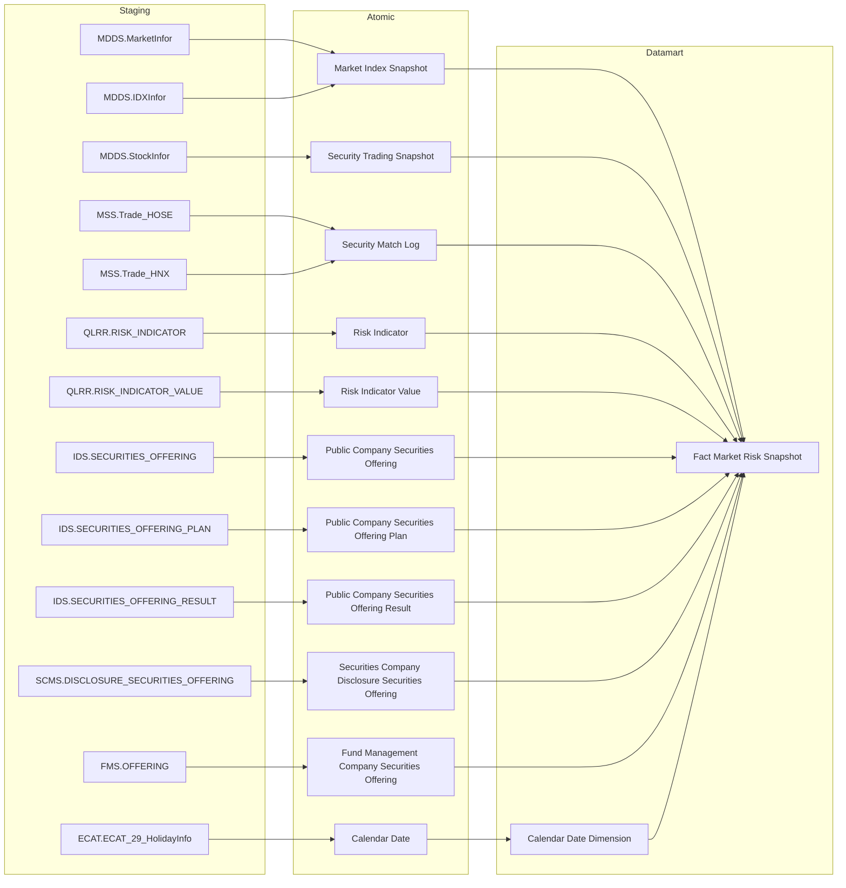
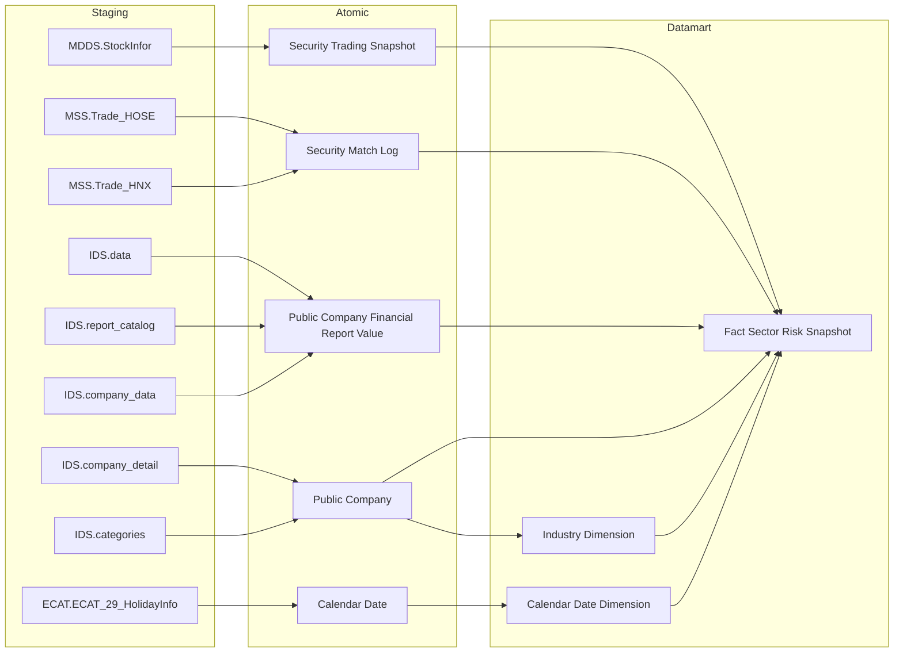
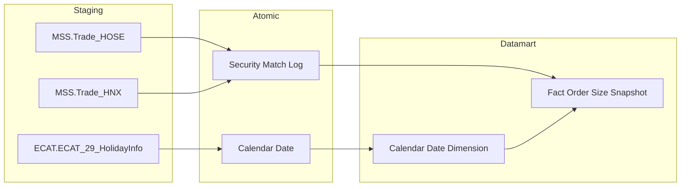
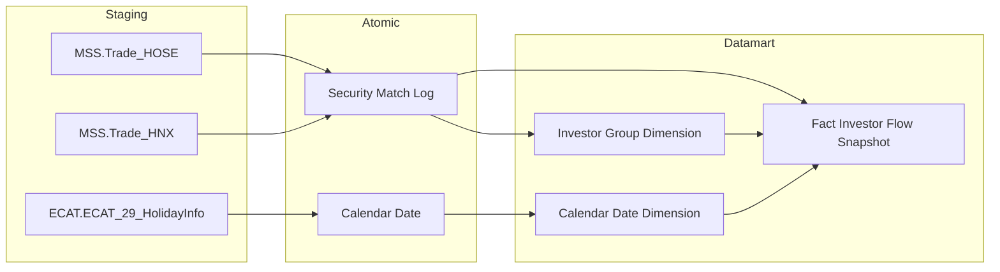
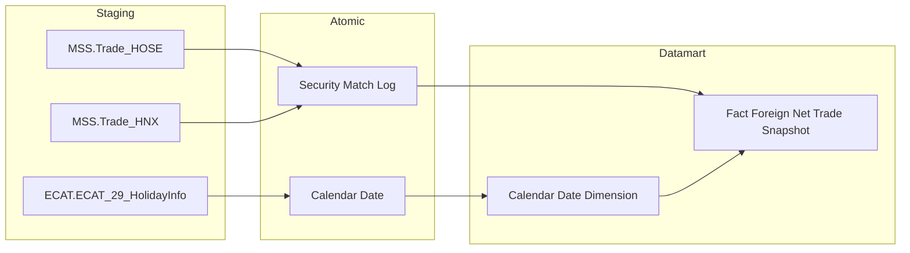
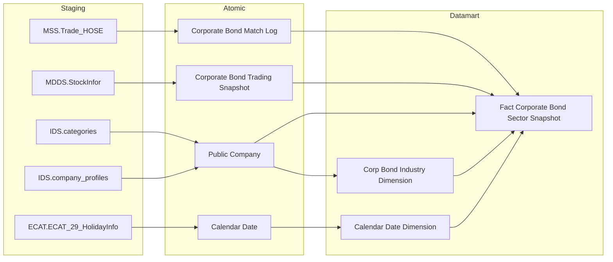
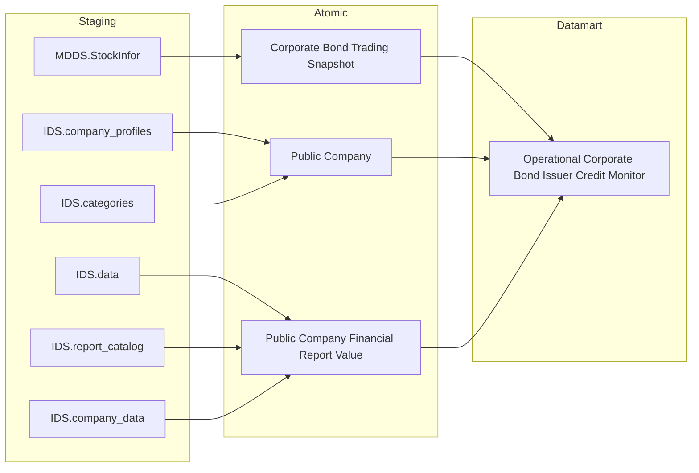
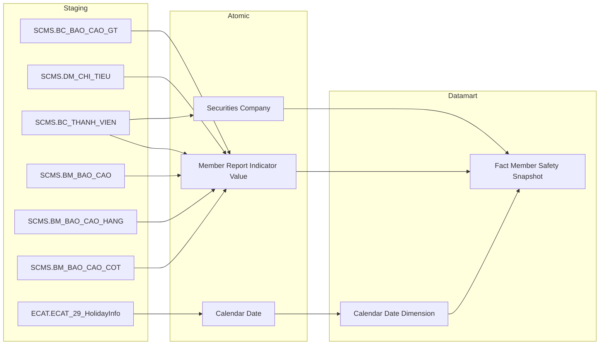
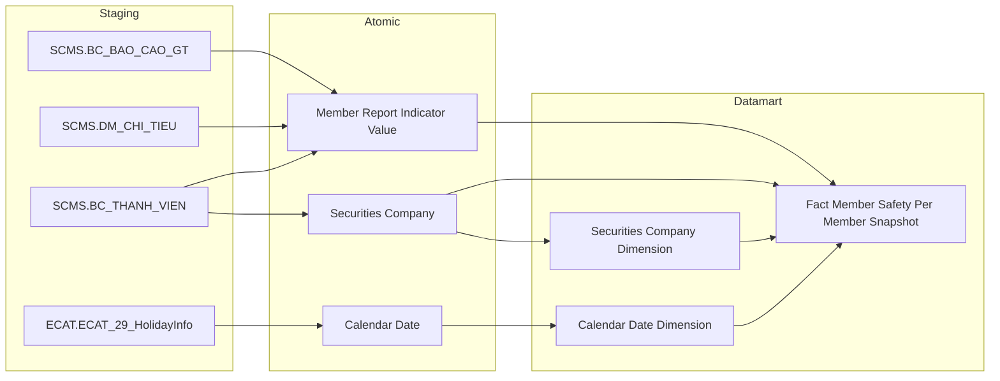

## 3.1.9 LUỒNG ĐỒNG BỘ DỮ LIỆU CHO NHÓM BÁO CÁO Phân tích thị trường

### 3.1.9.1 Thông tin chung luồng đồng bộ

- Tên job:
- Nguồn dữ liệu (Hệ thống nguồn): MDDS, MSS, QLRR, IDS, SCMS, FMS, ECAT
- Cách thức truy xuất đồng bộ dữ liệu:
- Tần suất đồng bộ dữ liệu:
- Dung lượng dữ liệu sẽ thực hiện đồng bộ:
- Thời gian lưu trữ dữ liệu:
- Thư mục lưu trữ dữ liệu trên kho dữ liệu:

### 3.1.9.2 Luồng nghiệp vụ

#### 3.1.9.2.1 Nhóm thông tin Rủi ro thị trường

**Mục đích:** Cung cấp dữ liệu chỉ số rủi ro hệ thống toàn thị trường (Systemic Risk Index) theo ngày snapshot, phục vụ Dashboard Giám sát rủi ro (Nhóm 1 & Nhóm 2).

**Mô tả luồng:**

Staging → Atomic:
- **Market Index Snapshot:** Bảng lưu thông tin chỉ số thị trường cuối ngày lấy thông tin từ bảng MDDS.MarketInfor và MDDS.IDXInfor
- **Security Trading Snapshot:** Bảng lưu thông tin thị trường chứng khoán cuối ngày lấy thông tin từ bảng MDDS.StockInfor
- **Security Match Log:** Bảng lưu chi tiết các lệnh khớp giao dịch lấy thông tin từ bảng MSS.Trade_HOSE và MSS.Trade_HNX
- **Risk Indicator:** Bảng lưu định nghĩa chỉ số rủi ro lấy thông tin từ bảng QLRR.RISK_INDICATOR
- **Risk Indicator Value:** Bảng lưu giá trị các chỉ số rủi ro lấy thông tin từ bảng QLRR.RISK_INDICATOR_VALUE
- **Public Company Securities Offering:** Bảng lưu thông tin đợt chào bán chứng khoán công ty đại chúng lấy thông tin từ bảng IDS.SECURITIES_OFFERING
- **Public Company Securities Offering Plan:** Bảng lưu phương án chào bán chứng khoán lấy thông tin từ bảng IDS.SECURITIES_OFFERING_PLAN
- **Public Company Securities Offering Result:** Bảng lưu kết quả chào bán chứng khoán lấy thông tin từ bảng IDS.SECURITIES_OFFERING_RESULT
- **Securities Company Disclosure Securities Offering:** Bảng lưu công bố thông tin chào bán chứng khoán CTCK lấy thông tin từ bảng SCMS.DISCLOSURE_SECURITIES_OFFERING
- **Fund Management Company Securities Offering:** Bảng lưu thông tin chào bán CCQ của công ty quản lý quỹ lấy thông tin từ bảng FMS.OFFERING
- **Calendar Date:** Bảng lưu thông tin lịch ngày lấy thông tin từ bảng ECAT.ECAT_29_HolidayInfo

Atomic → Datamart:
- **Fact Market Risk Snapshot:** Bảng sự kiện tổng hợp chỉ số rủi ro hệ thống toàn thị trường theo ngày snapshot, bao gồm các hệ số đóng góp rủi ro và biến động vĩ mô.
- **Calendar Date Dimension:** Bảng lưu thông tin thời gian.

---

#### 3.1.9.2.2 Nhóm thông tin Rủi ro ngành

**Mục đích:** Cung cấp dữ liệu rủi ro và áp lực theo từng nhóm ngành kinh tế (Sector Stress), phục vụ Dashboard Sức khỏe thị trường và vĩ mô (Nhóm 7).

**Mô tả luồng:**

Staging → Atomic:
- **Security Trading Snapshot:** Bảng lưu thông tin giao dịch chứng khoán cuối ngày lấy thông tin từ bảng MDDS.StockInfor
- **Security Match Log:** Bảng lưu chi tiết lệnh khớp lấy thông tin từ bảng MSS.Trade_HOSE và MSS.Trade_HNX
- **Public Company Financial Report Value:** Bảng lưu giá trị chỉ tiêu báo cáo tài chính lấy thông tin từ các bảng IDS.data, IDS.report_catalog, IDS.company_data
- **Public Company:** Bảng lưu thông tin công ty đại chúng và phân loại ngành lấy thông tin từ bảng IDS.company_detail và IDS.categories
- **Calendar Date:** Bảng lưu thông tin lịch ngày lấy thông tin từ bảng ECAT.ECAT_29_HolidayInfo

Atomic → Datamart:
- **Fact Sector Risk Snapshot:** Bảng sự kiện tổng hợp rủi ro ngành theo ngày, gồm chỉ số định giá P/E, P/B, áp lực nợ và thanh khoản theo ngành.
- **Industry Dimension:** Bảng lưu danh mục phân ngành kinh tế.
- **Calendar Date Dimension:** Bảng lưu thông tin thời gian.

---

#### 3.1.9.2.3 Nhóm thông tin Quy mô lệnh per mã CK

**Mục đích:** Cung cấp dữ liệu phân bổ thanh khoản theo quy mô lệnh giao dịch (lệnh lớn, vừa, nhỏ) của từng mã chứng khoán, phục vụ Dashboard Thanh khoản và đòn bẩy (Nhóm 11).

**Mô tả luồng:**

Staging → Atomic:
- **Security Match Log:** Bảng lưu chi tiết từng lệnh khớp chứng khoán lấy thông tin từ bảng MSS.Trade_HOSE và MSS.Trade_HNX
- **Calendar Date:** Bảng lưu thông tin lịch ngày lấy thông tin từ bảng ECAT.ECAT_29_HolidayInfo

Atomic → Datamart:
- **Fact Order Size Snapshot:** Bảng sự kiện phân tích cấu trúc quy mô lệnh khớp theo mã chứng khoán và ngày giao dịch.
- **Calendar Date Dimension:** Bảng lưu thông tin thời gian.

---

#### 3.1.9.2.4 Nhóm thông tin Dòng tiền nhà đầu tư

**Mục đích:** Cung cấp dữ liệu dòng tiền theo từng nhóm nhà đầu tư (cá nhân trong nước, tổ chức trong nước, cá nhân nước ngoài, tổ chức nước ngoài, tự doanh), phục vụ Dashboard Dòng tiền và cơ cấu nhà đầu tư (Nhóm 13, 14, 15).

**Mô tả luồng:**

Staging → Atomic:
- **Security Match Log:** Bảng lưu chi tiết khớp lệnh chứng khoán theo loại tài khoản nhà đầu tư lấy thông tin từ bảng MSS.Trade_HOSE và MSS.Trade_HNX
- **Calendar Date:** Bảng lưu thông tin lịch ngày lấy thông tin từ bảng ECAT.ECAT_29_HolidayInfo

Atomic → Datamart:
- **Fact Investor Flow Snapshot:** Bảng sự kiện tổng hợp giá trị và khối lượng giao dịch mua/bán theo nhóm nhà đầu tư theo ngày.
- **Investor Group Dimension:** Bảng lưu danh mục phân nhóm nhà đầu tư.
- **Calendar Date Dimension:** Bảng lưu thông tin thời gian.

---

#### 3.1.9.2.5 Nhóm thông tin Top giao dịch NĐTNN per mã CK

**Mục đích:** Cung cấp bảng xếp hạng top mua ròng, bán ròng của nhà đầu tư nước ngoài theo từng mã chứng khoán, phục vụ Dashboard Dòng tiền và cơ cấu nhà đầu tư (Nhóm 16).

**Mô tả luồng:**

Staging → Atomic:
- **Security Match Log:** Bảng lưu chi tiết giao dịch khớp lệnh của nhà đầu tư nước ngoài lấy thông tin từ bảng MSS.Trade_HOSE và MSS.Trade_HNX
- **Calendar Date:** Bảng lưu thông tin lịch ngày lấy thông tin từ bảng ECAT.ECAT_29_HolidayInfo

Atomic → Datamart:
- **Fact Foreign Net Trade Snapshot:** Bảng sự kiện tổng hợp giá trị mua ròng, bán ròng và khối lượng giao dịch của khối ngoại theo từng mã CK và ngày.
- **Calendar Date Dimension:** Bảng lưu thông tin thời gian.

---

#### 3.1.9.2.6 Nhóm thông tin Top giao dịch tự doanh per mã CK

**Mục đích:** Cung cấp bảng xếp hạng top mua ròng, bán ròng của khối tự doanh CTCK theo từng mã chứng khoán, phục vụ Dashboard Dòng tiền và cơ cấu nhà đầu tư (Nhóm 17).

**Mô tả luồng:**

Staging → Atomic:
- **Security Match Log:** Bảng lưu chi tiết giao dịch khớp lệnh tự doanh CTCK lấy thông tin từ bảng MSS.Trade_HOSE và MSS.Trade_HNX
- **Calendar Date:** Bảng lưu thông tin lịch ngày lấy thông tin từ bảng ECAT.ECAT_29_HolidayInfo

Atomic → Datamart:
- **Fact Proprietary Net Trade Snapshot:** Bảng sự kiện tổng hợp giá trị mua ròng, bán ròng và khối lượng giao dịch của khối tự doanh theo từng mã CK và ngày.
- **Calendar Date Dimension:** Bảng lưu thông tin thời gian.

---

#### 3.1.9.2.7 Nhóm thông tin Cơ cấu nợ vay trái phiếu theo ngành

**Mục đích:** Cung cấp dữ liệu tổng hợp cơ cấu nợ vay trái phiếu doanh nghiệp, áp lực đáo hạn và lãi suất theo ngành kinh tế, phục vụ Dashboard Trái phiếu doanh nghiệp (Nhóm 18, 19, 20).

**Mô tả luồng:**

Staging → Atomic:
- **Corporate Bond Match Log:** Bảng lưu chi tiết khớp lệnh trái phiếu doanh nghiệp lấy thông tin từ bảng MSS.Trade_HOSE
- **Corporate Bond Trading Snapshot:** Bảng lưu thông tin giao dịch TPDN cuối ngày lấy thông tin từ bảng MDDS.StockInfor
- **Public Company:** Bảng lưu thông tin tổ chức phát hành và phân ngành lấy thông tin từ bảng IDS.categories và IDS.company_profiles
- **Calendar Date:** Bảng lưu thông tin lịch ngày lấy thông tin từ bảng ECAT.ECAT_29_HolidayInfo

Atomic → Datamart:
- **Fact Corporate Bond Sector Snapshot:** Bảng sự kiện tổng hợp quy mô nợ vay trái phiếu, dư nợ theo ngành và kỳ đáo hạn.
- **Corp Bond Industry Dimension:** Bảng lưu danh mục ngành nghề của tổ chức phát hành TPDN.
- **Calendar Date Dimension:** Bảng lưu thông tin thời gian.

---

#### 3.1.9.2.8 Nhóm thông tin Danh mục tổ chức phát hành cần giám sát tín dụng

**Mục đích:** Cung cấp bảng danh sách theo dõi sức khỏe tài chính và rủi ro tín dụng của các tổ chức phát hành trái phiếu doanh nghiệp, phục vụ Dashboard Trái phiếu doanh nghiệp (Nhóm 21).

**Mô tả luồng:**

Staging → Atomic:
- **Corporate Bond Trading Snapshot:** Bảng lưu thông tin giao dịch trái phiếu doanh nghiệp lấy thông tin từ bảng MDDS.StockInfor
- **Public Company:** Bảng lưu thông tin công ty đại chúng phát hành trái phiếu lấy thông tin từ bảng IDS.company_profiles và IDS.categories
- **Public Company Financial Report Value:** Bảng lưu chỉ tiêu tài chính (hệ số nợ, khả năng thanh toán) lấy thông tin từ các bảng IDS.data, IDS.report_catalog, IDS.company_data

Atomic → Datamart:
- **Operational Corporate Bond Issuer Credit Monitor:** Bảng tác nghiệp lưu danh sách các tổ chức phát hành trái phiếu có dấu hiệu rủi ro tín dụng ở trạng thái mới nhất.

---

#### 3.1.9.2.9 Nhóm thông tin Bộ chỉ tiêu an toàn CTCK

**Mục đích:** Cung cấp dữ liệu tổng hợp các chỉ tiêu an toàn tài chính và tỷ lệ an toàn vốn khả dụng toàn hệ thống CTCK, phục vụ Dashboard An toàn CTCK (Nhóm 22, 23, 24).

**Mô tả luồng:**

Staging → Atomic:
- **Member Report Indicator Value:** Bảng lưu giá trị các chỉ tiêu báo cáo định kỳ của CTCK lấy thông tin từ các bảng SCMS.BC_BAO_CAO_GT, SCMS.DM_CHI_TIEU, SCMS.BC_THANH_VIEN, SCMS.BM_BAO_CAO, SCMS.BM_BAO_CAO_HANG, SCMS.BM_BAO_CAO_COT
- **Securities Company:** Bảng lưu thông tin công ty chứng khoán lấy thông tin từ bảng SCMS.BC_THANH_VIEN
- **Calendar Date:** Bảng lưu thông tin lịch ngày lấy thông tin từ bảng ECAT.ECAT_29_HolidayInfo

Atomic → Datamart:
- **Fact Member Safety Snapshot:** Bảng sự kiện tổng hợp chỉ tiêu an toàn tài chính toàn hệ thống CTCK theo kỳ snapshot.
- **Calendar Date Dimension:** Bảng lưu thông tin thời gian.

---

#### 3.1.9.2.10 Nhóm thông tin Chỉ tiêu an toàn per CTCK

**Mục đích:** Cung cấp dữ liệu chi tiết các chỉ tiêu an toàn tài chính, tỷ lệ an toàn vốn khả dụng và dư nợ margin của từng CTCK, phục vụ Dashboard An toàn CTCK (Nhóm 25).

**Mô tả luồng:**

Staging → Atomic:
- **Member Report Indicator Value:** Bảng lưu giá trị chỉ tiêu an toàn tài chính lấy thông tin từ các bảng SCMS.BC_BAO_CAO_GT, SCMS.DM_CHI_TIEU, SCMS.BC_THANH_VIEN
- **Securities Company:** Bảng lưu thông tin định danh CTCK lấy thông tin từ bảng SCMS.BC_THANH_VIEN
- **Calendar Date:** Bảng lưu thông tin lịch ngày lấy thông tin từ bảng ECAT.ECAT_29_HolidayInfo

Atomic → Datamart:
- **Fact Member Safety Per Member Snapshot:** Bảng sự kiện lưu chỉ tiêu an toàn tài chính chi tiết của từng công ty chứng khoán theo kỳ snapshot.
- **Securities Company Dimension:** Bảng lưu thông tin chiều công ty chứng khoán.
- **Calendar Date Dimension:** Bảng lưu thông tin thời gian.
