# 3. KHO DỮ LIỆU (OLAP) — Phân tích thị trường

## 3.1 Mô hình dữ liệu mức High Level / Conceptual

### 3.1.1 Sơ đồ ERD

```mermaid
erDiagram
    CALENDAR_DATE_DIMENSION ||--o{ FACT_MARKET_RISK_SNAPSHOT : " "
    CALENDAR_DATE_DIMENSION ||--o{ FACT_SECTOR_RISK_SNAPSHOT : " "
    INDUSTRY_DIMENSION ||--o{ FACT_SECTOR_RISK_SNAPSHOT : " "
    CALENDAR_DATE_DIMENSION ||--o{ FACT_ORDER_SIZE_SNAPSHOT : " "
    CALENDAR_DATE_DIMENSION ||--o{ FACT_INVESTOR_FLOW_SNAPSHOT : " "
    INVESTOR_GROUP_DIMENSION ||--o{ FACT_INVESTOR_FLOW_SNAPSHOT : " "
    CALENDAR_DATE_DIMENSION ||--o{ FACT_FOREIGN_NET_TRADE_SNAPSHOT : " "
    CALENDAR_DATE_DIMENSION ||--o{ FACT_PROPRIETARY_NET_TRADE_SNAPSHOT : " "
    CALENDAR_DATE_DIMENSION ||--o{ FACT_CORPORATE_BOND_SECTOR_SNAPSHOT : " "
    CORP_BOND_SECTOR_DIMENSION ||--o{ FACT_CORPORATE_BOND_SECTOR_SNAPSHOT : " "
    CALENDAR_DATE_DIMENSION ||--o{ FACT_CORPORATE_BOND_MARKET_SNAPSHOT : " "
    CALENDAR_DATE_DIMENSION ||--o{ FACT_CORPORATE_BOND_MATURITY_WALL : " "
    CALENDAR_DATE_DIMENSION ||--o{ FACT_FUTURES_INTRADAY_SNAPSHOT : " "
    CALENDAR_DATE_DIMENSION ||--o{ FACT_FUTURES_INVESTOR_FLOW_SNAPSHOT : " "
    CALENDAR_DATE_DIMENSION ||--o{ FACT_MARKET_STATISTICS_SNAPSHOT : " "
    CALENDAR_DATE_DIMENSION ||--o{ FACT_MEMBER_SAFETY_PER_MEMBER_SNAPSHOT : " "
    SECURITIES_COMPANY_DIMENSION ||--o{ FACT_MEMBER_SAFETY_PER_MEMBER_SNAPSHOT : " "
    OPERATIONAL_CORPORATE_BOND_ISSUER_CREDIT_MONITOR
    OPERATIONAL_MEMBER_SAFETY_MONITOR
```

### 3.1.2 Danh sách thực thể

| STT | Thực thể | Tên bảng | Mô tả |
|---|---|---|---|
| 1 | Calendar Date Dimension | cdr_dt_dim | Chiều thời gian dùng chung toàn hệ thống — SCD4A — grain 1 row/ngày |
| 2 | Industry Dimension | industry_dim | Chiều ngành nghề kinh doanh mã CK — SCD4A — reuse từ GSDC (2026-08-17) — grain 1 row/ngành |
| 3 | Investor Group Dimension | investor_group_dim | Chiều nhóm nhà đầu tư (NĐTNN/Tự doanh/Tổ chức trong nước/Cá nhân trong nước) — SCD4A — grain 1 row/nhóm NĐT |
| 4 | Corp Bond Sector Dimension | corp_bond_industry_dim | Chiều ngành nghề tổ chức phát hành trái phiếu doanh nghiệp — SCD4A — grain 1 row/ngành TCPH |
| 5 | Securities Company Dimension | scr_co_dim | Chiều công ty chứng khoán thành viên — SCD4A — grain 1 row/CTCK |
| 6 | Securities Dimension | securities_dim | Chiều mã chứng khoán/HĐTL/mã TP (reuse từ module NDTNN) — SCD4A — grain 1 row/mã CK |
| 7 | Fact Market Risk Snapshot | fct_market_risk_snpst | Chỉ số rủi ro hệ thống tổng hợp theo ngày — Risk Index, Volatility, Z-score, Sentiment, Margin Stress — grain 1 row/ngày |
| 8 | Fact Sector Risk Snapshot | fct_sector_risk_snpst | Chỉ số áp lực, thanh khoản và sức khỏe tài chính theo ngành — StressScore, D/E, GTGD ngành — grain 1 row/ngành/ngày |
| 9 | Fact Order Size Snapshot | fct_order_size_snpst | GTGD và phân loại quy mô lệnh per mã CK theo ngày — grain 1 row/mã CK/order_size_band/ngày |
| 10 | Fact Investor Flow Snapshot | fct_investor_flow_snpst | GTGD mua/bán/dòng tiền ròng theo nhóm nhà đầu tư — grain 1 row/nhóm NĐT/ngày |
| 11 | Fact Foreign Net Trade Snapshot | fct_foreign_net_trade_snpst | GTGD mua/bán/dòng tiền ròng NĐTNN per mã CK — grain 1 row/mã CK/ngày |
| 12 | Fact Proprietary Net Trade Snapshot | fct_proprietary_net_trade_snpst | GTGD mua/bán/dòng tiền ròng khối tự doanh per mã CK — grain 1 row/mã CK/ngày |
| 13 | Fact Corporate Bond Sector Snapshot | fct_corporate_bond_sector_snpst | GTGD trái phiếu và tỷ trọng dư nợ theo ngành TCPH — grain 1 row/ngành TCPH/kỳ báo cáo |
| 14 | Fact Member Safety Per Member Snapshot | fct_mbr_sfty_per_mbr_snpst | Chỉ tiêu an toàn tài chính per CTCK per ngày — grain 1 row/CTCK/ngày |
| 15 | Fact Corporate Bond Market Snapshot | fct_corporate_bond_market_snpst | Quy mô thị trường TPDN tổng hợp toàn thị trường theo ngày — grain 1 row/ngày |
| 16 | Fact Corporate Bond Maturity Wall | fct_corporate_bond_maturity_wall | Lịch biểu đáo hạn trái phiếu per mã TP — 2 luồng nguồn (niêm yết READY / riêng lẻ VSDC BM29 PENDING) — grain 1 row/mã TP/kỳ (quý) |
| 17 | Fact Futures Intraday Snapshot | fct_futures_intraday_snpst | Biến động giá/KLGD trong phiên của HĐTL chỉ số (VN30/VN100) — dùng chung entity equity — grain 1 row/mã HĐTL/mốc thời gian |
| 18 | Fact Futures Investor Flow Snapshot | fct_futures_investor_flow_snpst | GTGD mua/bán/dòng tiền ròng NĐTNN + Tự doanh trên HĐTL chỉ số — grain 1 row/nhóm NĐT/mã HĐTL/ngày |
| 19 | Fact Market Statistics Snapshot | fct_market_statistics_snpst | Bộ chỉ tiêu thống kê theo chỉ số (Data Explorer) — grain 1 row/chỉ số/ngày |
| 20 | Fact Market Statistics By Industry Snapshot | fct_market_statistics_by_industry_snpst | Bộ chỉ tiêu thống kê breakdown theo ngành nghề kinh tế (Data Explorer) — grain 1 row/ngành/ngày |
| 21 | Fact Market Statistics By Cap Snapshot | fct_market_statistics_by_cap_snpst | Bộ chỉ tiêu thống kê breakdown theo nhóm vốn hóa + GTGD/GDP (Data Explorer) — grain 1 row/(ngành × nhóm vốn hóa)/ngày |
| 22 | Operational Corporate Bond Issuer Credit Monitor | opr_corporate_bond_issuer_credit_monitor | Danh sách TCPH TPDN kèm chỉ tiêu tín dụng (D/E, ROE) để giám sát rủi ro — grain 1 row/TCPH/kỳ báo cáo |
| 23 | Operational Member Safety Monitor | opr_mbr_sfty_monitor | Danh sách CTCK kèm chỉ tiêu an toàn tài chính, sắp xếp theo mức độ rủi ro — grain 1 row/CTCK/ngày |

---

## 3.2 Mô hình dữ liệu mức Logic

### 3.2.1 Sơ đồ ERD

```mermaid
erDiagram
    CORP_BOND_INDUSTRY_DIMENSION["Corp Bond Industry Dimension"] {
        string Corp_Bond_Industry_Dimension_Id PK
        string Industry_Code
        string Industry_Name
        string Source_System_Code
    }
    FACT_CORPORATE_BOND_MARKET_SNAPSHOT["Fact Corporate Bond Market Snapshot"] {
        string Snapshot_Date_Dimension_Id FK
        float Par_Value
        float Outstanding_Volume
        float Bond_Outstanding_Value
        float Maturity_Pressure_12_Months
        float Maturity_Pressure_12_Months_Previous
        float Maturity_Pressure_Growth_Percentage
    }
    FACT_CORPORATE_BOND_MATURITY_WALL["Fact Corporate Bond Maturity Wall"] {
        string Snapshot_Date_Dimension_Id FK
        string Securities_Dimension_Id FK
        string Ranking_Code
    }
    FACT_CORPORATE_BOND_SECTOR_SNAPSHOT["Fact Corporate Bond Sector Snapshot"] {
        string Snapshot_Date_Dimension_Id FK
        string Corp_Bond_Industry_Dimension_Id FK
        float Bond_Outstanding_Value
        float Bond_Outstanding_Value_Total
        float Bond_Outstanding_Ratio
    }
    FACT_FOREIGN_NET_TRADE_SNAPSHOT["Fact Foreign Net Trade Snapshot"] {
        string Snapshot_Date_Dimension_Id FK
        string Security_Symbol_Code
        float Foreign_Buy_Value
        float Foreign_Sell_Value
        float Foreign_Net_Value
    }
    FACT_FUTURES_INTRADAY_SNAPSHOT["Fact Futures Intraday Snapshot"] {
        string Snapshot_Date_Dimension_Id FK
        string Security_Symbol_Code
        string Underlying_Symbol
        string Maturity_Month_Year
        float Close_Price
        float Reference_Price
        float Price_Change_Percentage
        float Total_Trading_Volume_Matched
        float Total_Trading_Volume_Matched_Average_50_Days
        float Liquidity_Spike_Ratio
    }
    FACT_FUTURES_INVESTOR_FLOW_SNAPSHOT["Fact Futures Investor Flow Snapshot"] {
        string Snapshot_Date_Dimension_Id FK
        string Security_Symbol_Code
        string Underlying_Symbol
        float Foreign_Buy_Volume
        float Foreign_Sell_Volume
        float Foreign_Net_Volume
        float Proprietary_Buy_Volume
        float Proprietary_Sell_Volume
        float Proprietary_Net_Volume
    }
    FACT_INVESTOR_FLOW_SNAPSHOT["Fact Investor Flow Snapshot"] {
        string Snapshot_Date_Dimension_Id FK
        string Investor_Group_Dimension_Id FK
        float Buy_Value
        float Sell_Value
        float Net_Flow_Value
        float Trading_Value_Ratio
    }
    FACT_MARKET_RISK_SNAPSHOT["Fact Market Risk Snapshot"] {
        string Snapshot_Date_Dimension_Id FK
        float Volatility_30_Days
        float Z_Score_Volatility
        float Z_Score_Liquidity
        float Z_Score_Margin_Balance
        float Z_Score_Interbank_Rate
        float Z_Score_Foreign_Net_Flow
        float Total_Market_Cap
        float Margin_To_Market_Cap_Ratio
        float Beta_Volatility
        float Beta_Liquidity
        float Beta_Margin_Balance
        float Beta_Interbank_Rate
        float Beta_Foreign_Net_Flow
        float Beta_Equity_Capital_Raising
        float Beta_Intercept
        float Epsilon_Error_Term
        float Risk_Index
        float Z_Score_Equity_Capital_Raising
        float Equity_Capital_Raising_Amount
        float Z_Score_Margin_Balance_Current
        float Margin_To_Cap_Ratio_Stddev
        float Margin_To_Cap_Ratio_Current
        float Margin_To_Cap_Ratio_Avg
        float Index_Log_Return
        float Illiquidity_Ratio
        float Foreign_Net_Flow
        float VNIndex_Value
        float Weight_Liquidity
        float Weight_Stability
        float Sentiment_Index
        string Sentiment_Index_Status
        float Margin_Tension
        string Margin_Tension_Status
        float VNIndex_Daily_Return
        float Systemic_Vol_Current
        float Systemic_Vol_Max
        float Systemic_Vol
        string Systemic_Vol_Status
        float VNIndex_Value_Previous_Day
        float VNIndex_Daily_Return_Average
        float Index_Value_Monthly_Average
        float Total_Trading_Value_Matched
        float Total_Trading_Value_Matched_Previous_Day
        int Total_Order_Count_Matched
        float Average_Order_Size
        float Total_Trading_Volume_Matched
        float Total_Trading_Value_Matched_Average_50_Days
        float Total_Trading_Value_Matched_Average_N_Days
        float Net_Flow_Foreign_Average_30_Days
        float Net_Flow_Proprietary_Average_30_Days
        float Net_Flow_Correlation_Foreign_Proprietary
    }
    FACT_MARKET_STATISTICS_SNAPSHOT["Fact Market Statistics Snapshot"] {
        string Snapshot_Date_Dimension_Id FK
        string Market_Code
        float Total_Trading_Volume_Matched
        float Close_Price
        float Close_Price_Previous_Day
        float Price_Change_Percentage
        float Total_Trading_Value_Matched
        float Total_Trading_Value_Matched_Average_50_Days
    }
    FACT_ORDER_SIZE_SNAPSHOT["Fact Order Size Snapshot"] {
        string Snapshot_Date_Dimension_Id FK
        string Security_Symbol_Code
        float Total_Trading_Value_Matched
        string Order_Size_Band
        float Total_Trading_Volume_Matched
    }
    FACT_PROPRIETARY_NET_TRADE_SNAPSHOT["Fact Proprietary Net Trade Snapshot"] {
        string Snapshot_Date_Dimension_Id FK
        string Security_Symbol_Code
        float Proprietary_Buy_Value
        float Proprietary_Sell_Value
        float Proprietary_Net_Value
    }
    FACT_SECTOR_RISK_SNAPSHOT["Fact Sector Risk Snapshot"] {
        string Snapshot_Date_Dimension_Id FK
        string Industry_Dimension_Id FK
        float Total_Value_Sector
    }
    INVESTOR_GROUP_DIMENSION["Investor Group Dimension"] {
        string Investor_Group_Dimension_Id PK
        string Investor_Group_Code
        string Investor_Group_Name
        string Source_System_Code
    }
    OPERATIONAL_CORPORATE_BOND_ISSUER_CREDIT_MONITOR["Operational Corporate Bond Issuer Credit Monitor"] {
        string Issuer_Symbol_Code PK
        date Snapshot_Date PK
        float Bond_Outstanding_Value
        float Par_Value
        float Outstanding_Volume
        string Audit_Opinion_Text
        string Ranking_Code
        string Risk_Rating_Text
    }
    INVESTOR_GROUP_DIMENSION ||--o{ FACT_INVESTOR_FLOW_SNAPSHOT : " "
    CORP_BOND_INDUSTRY_DIMENSION ||--o{ FACT_CORPORATE_BOND_SECTOR_SNAPSHOT : " "
```

### 3.2.2 Danh sách các bảng và thuộc tính

#### 3.2.2.1 Bảng Corp Bond Industry Dimension

| STT | Tên trường | Kiểu dữ liệu và độ dài | Nullable | Unique | P/F Key | Mặc định | Mô tả |
|---|---|---|---|---|---|---|---|
| 1 | Corp Bond Industry Dimension Id | string |  | X | P | | Khóa chính bảng |
| 2 | Industry Code | string |  |  |  | | Mã ngành nghề cấp 1 (Classification Business Line Code) của TCPH |
| 3 | Industry Name | string |  |  |  | | Tên ngành nghề cấp 1 của TCPH |
| 4 | Source System Code | string |  |  |  | | Src_stm_code — Driving: cl_business_line, current-state SCD4A lấy bản ghi mới nhất theo Industry Code |

#### 3.2.2.2 Bảng Fact Corporate Bond Market Snapshot

| STT | Tên trường | Kiểu dữ liệu và độ dài | Nullable | Unique | P/F Key | Mặc định | Mô tả |
|---|---|---|---|---|---|---|---|
| 1 | Snapshot Date Dimension Id | string |  |  | F | | FK to Calendar Date Dimension |
| 2 | Par Value | decimal(23,2) | X |  |  | | Mệnh giá trái phiếu (100.000 VND/TP) — hardcode theo BA note |
| 3 | Outstanding Volume | decimal(23,2) | X |  |  | | KL TP lưu hành toàn thị trường ngày t |
| 4 | Bond Outstanding Value | decimal(23,2) | X |  |  | | Tổng dư nợ trái phiếu toàn thị trường ngày t |
| 5 | Maturity Pressure 12 Months | decimal(23,2) | X |  |  | | Áp lực đáo hạn 12 tháng — tổng dư nợ TP có ngày đáo hạn trong 365 ngày tới tính từ ngày t |
| 6 | Maturity Pressure 12 Months Previous | decimal(23,2) | X |  |  | | Áp lực đáo hạn 12 tháng tại kỳ liền trước |
| 7 | Maturity Pressure Growth Percentage | decimal(5,2) | X |  |  | | Tăng trưởng áp lực đáo hạn so với kỳ trước |

#### 3.2.2.3 Bảng Fact Corporate Bond Maturity Wall

| STT | Tên trường | Kiểu dữ liệu và độ dài | Nullable | Unique | P/F Key | Mặc định | Mô tả |
|---|---|---|---|---|---|---|---|
| 1 | Snapshot Date Dimension Id | string |  |  | F | | FK lịch ngày — snapshot theo ngày giao dịch |
| 2 | Securities Dimension Id | string |  |  | F | | FK to Securities Dimension (reuse từ module NDTNN) |
| 3 | Ranking Code | string | X |  |  | | Xếp hạng tín nhiệm DN — dùng chung cho cả nhánh niêm yết + riêng lẻ |

#### 3.2.2.4 Bảng Fact Corporate Bond Sector Snapshot

| STT | Tên trường | Kiểu dữ liệu và độ dài | Nullable | Unique | P/F Key | Mặc định | Mô tả |
|---|---|---|---|---|---|---|---|
| 1 | Snapshot Date Dimension Id | string |  |  | F | | FK to Calendar Date Dimension |
| 2 | Corp Bond Industry Dimension Id | string |  |  | F | | FK to Corp Bond Industry Dimension |
| 3 | Bond Outstanding Value | decimal(23,2) | X |  |  | | Tổng dư nợ trái phiếu theo ngành TCPH tại ngày t |
| 4 | Bond Outstanding Value Total | decimal(23,2) | X |  |  | | Dư nợ trái phiếu toàn thị trường tại ngày t (tổng tất cả ngành, mẫu số Tỷ trọng) |
| 5 | Bond Outstanding Ratio | decimal(5,2) | X |  |  | | Tỷ trọng dư nợ trái phiếu theo ngành TCPH |

#### 3.2.2.5 Bảng Fact Foreign Net Trade Snapshot

| STT | Tên trường | Kiểu dữ liệu và độ dài | Nullable | Unique | P/F Key | Mặc định | Mô tả |
|---|---|---|---|---|---|---|---|
| 1 | Snapshot Date Dimension Id | string |  |  | F | | FK to Calendar Date Dimension |
| 2 | Security Symbol Code | string |  |  |  | | Mã chứng khoán |
| 3 | Foreign Buy Value | decimal(23,2) | X |  |  | | GTGD mua NĐTNN per mã CK tại ngày t |
| 4 | Foreign Sell Value | decimal(23,2) | X |  |  | | GTGD bán NĐTNN per mã CK tại ngày t |
| 5 | Foreign Net Value | decimal(23,2) | X |  |  | | Dòng tiền ròng NĐTNN per mã CK tại ngày t (Buy − Sell) |

#### 3.2.2.6 Bảng Fact Futures Intraday Snapshot

| STT | Tên trường | Kiểu dữ liệu và độ dài | Nullable | Unique | P/F Key | Mặc định | Mô tả |
|---|---|---|---|---|---|---|---|
| 1 | Snapshot Date Dimension Id | string |  |  | F | | FK to Calendar Date Dimension |
| 2 | Security Symbol Code | string |  |  |  | | Mã hợp đồng tương lai (VN30F1M/VN30F2M/VN100F1M/VN100F2M...) |
| 3 | Underlying Symbol | string |  |  |  | | Mã chỉ số cơ sở (VN30/VN100) |
| 4 | Maturity Month Year | string | X |  |  | | Tháng đáo hạn hợp đồng — dùng để lọc F1M (tháng gần nhất)/F2M (tháng tiếp theo) |
| 5 | Close Price | decimal(23,2) | X |  |  | | Giá đóng cửa HĐTL ngày t (Pt) |
| 6 | Reference Price | decimal(23,2) | X |  |  | | Giá tham chiếu ngày t (Ptc — giá đóng cửa ngày t-1 theo quy tắc khớp lệnh) |
| 7 | Price Change Percentage | decimal(5,2) | X |  |  | | Tỷ lệ thay đổi giá HĐTL (%) |
| 8 | Total Trading Volume Matched | decimal(23,2) | X |  |  | | KLGD HĐTL ngày t |
| 9 | Total Trading Volume Matched Average 50 Days | decimal(23,2) | X |  |  | | KLGD HĐTL trung bình 50 phiên (MA50) |
| 10 | Liquidity Spike Ratio | decimal(5,2) | X |  |  | | Tỷ lệ đột biến thanh khoản HĐTL |

#### 3.2.2.7 Bảng Fact Futures Investor Flow Snapshot

| STT | Tên trường | Kiểu dữ liệu và độ dài | Nullable | Unique | P/F Key | Mặc định | Mô tả |
|---|---|---|---|---|---|---|---|
| 1 | Snapshot Date Dimension Id | string |  |  | F | | FK to Calendar Date Dimension |
| 2 | Security Symbol Code | string |  |  |  | | Mã hợp đồng tương lai |
| 3 | Underlying Symbol | string |  |  |  | | Mã chỉ số cơ sở (VN30/VN100) |
| 4 | Foreign Buy Volume | decimal(23,2) | X |  |  | | KLGD NĐTNN mua HĐTL |
| 5 | Foreign Sell Volume | decimal(23,2) | X |  |  | | KLGD NĐTNN bán HĐTL |
| 6 | Foreign Net Volume | decimal(23,2) | X |  |  | | Dòng tiền ròng NĐTNN HĐTL (Buy − Sell) |
| 7 | Proprietary Buy Volume | decimal(23,2) | X |  |  | | KLGD Tự doanh mua HĐTL |
| 8 | Proprietary Sell Volume | decimal(23,2) | X |  |  | | KLGD Tự doanh bán HĐTL |
| 9 | Proprietary Net Volume | decimal(23,2) | X |  |  | | Dòng tiền ròng Tự doanh HĐTL (Buy − Sell) |

#### 3.2.2.8 Bảng Fact Investor Flow Snapshot

| STT | Tên trường | Kiểu dữ liệu và độ dài | Nullable | Unique | P/F Key | Mặc định | Mô tả |
|---|---|---|---|---|---|---|---|
| 1 | Snapshot Date Dimension Id | string |  |  | F | | FK to Calendar Date Dimension |
| 2 | Investor Group Dimension Id | string |  |  | F | | FK to Investor Group Dimension — 1 trong 6 giá trị cố định, xem investor_group_dim |
| 3 | Buy Value | decimal(23,2) | X |  |  | | GTGD mua theo nhóm NĐT tại ngày t — filter theo Investor Group Dimension Id |
| 4 | Sell Value | decimal(23,2) | X |  |  | | GTGD bán theo nhóm NĐT tại ngày t — filter theo Investor Group Dimension Id |
| 5 | Net Flow Value | decimal(23,2) | X |  |  | | Dòng tiền ròng theo nhóm NĐT tại ngày t (Buy − Sell) |
| 6 | Trading Value Ratio | decimal(5,2) | X |  |  | | Tỷ trọng GTGD nhóm NĐT trên tổng GTGD toàn thị trường |

#### 3.2.2.9 Bảng Fact Market Risk Snapshot

| STT | Tên trường | Kiểu dữ liệu và độ dài | Nullable | Unique | P/F Key | Mặc định | Mô tả |
|---|---|---|---|---|---|---|---|
| 1 | Snapshot Date Dimension Id | string |  |  | F | | FK to Calendar Date Dimension |
| 2 | Volatility 30 Days | decimal(5,2) | X |  |  | | Biến động giá VN-Index 30 phiên (độ lệch chuẩn log-return) |
| 3 | Z Score Volatility | decimal(5,2) | X |  |  | | Z-score Biến động giá |
| 4 | Z Score Liquidity | decimal(5,2) | X |  |  | | Z-score Thanh khoản ILLIQ |
| 5 | Z Score Margin Balance | decimal(5,2) | X |  |  | | Z-score Dư nợ Margin |
| 6 | Z Score Interbank Rate | decimal(5,2) | X |  |  | | Z-score Lãi suất liên ngân hàng |
| 7 | Z Score Foreign Net Flow | decimal(5,2) | X |  |  | | Z-score Dòng tiền ròng NĐTNN |
| 8 | Total Market Cap | decimal(23,2) | X |  |  | | Tổng vốn hóa thị trường MCAPt |
| 9 | Margin To Market Cap Ratio | decimal(5,2) | X |  |  | | Tỷ lệ Dư nợ Margin / Tổng vốn hóa Mt |
| 10 | Beta Volatility | decimal(5,2) | X |  |  | | Hệ số hồi quy β — Biến động chỉ số VN-Index |
| 11 | Beta Liquidity | decimal(5,2) | X |  |  | | Hệ số hồi quy β — Thanh khoản |
| 12 | Beta Margin Balance | decimal(5,2) | X |  |  | | Hệ số hồi quy β — Dư nợ Margin |
| 13 | Beta Interbank Rate | decimal(5,2) | X |  |  | | Hệ số hồi quy β — Lãi suất liên ngân hàng |
| 14 | Beta Foreign Net Flow | decimal(5,2) | X |  |  | | Hệ số hồi quy β — Dòng tiền ròng NĐTNN |
| 15 | Beta Equity Capital Raising | decimal(5,2) | X |  |  | | Hệ số hồi quy β — Huy động vốn cổ phần |
| 16 | Beta Intercept | decimal(5,2) | X |  |  | | Hằng số hồi quy β0 |
| 17 | Epsilon Error Term | decimal(5,2) | X |  |  | | Sai số hồi quy ε |
| 18 | Risk Index | decimal(5,2) | X |  |  | | Risk Index — Chỉ số rủi ro hệ thống tổng hợp |
| 19 | Z Score Equity Capital Raising | decimal(5,2) | X |  |  | | Z-score Huy động vốn cổ phần |
| 20 | Equity Capital Raising Amount | decimal(23,2) | X |  |  | | Huy động vốn cổ phần thị trường tại ngày t — tổng 3 nguồn UNION ALL |
| 21 | Z Score Margin Balance Current | decimal(5,2) | X |  |  | | Z-score Dư nợ Margin — giá trị chuẩn hóa ngày t |
| 22 | Margin To Cap Ratio Stddev | decimal(5,2) | X |  |  | | Độ lệch chuẩn chuỗi tỷ lệ Dư nợ Margin/MCAP |
| 23 | Margin To Cap Ratio Current | decimal(5,2) | X |  |  | | Tỷ lệ Dư nợ Margin / Tổng vốn hóa tại ngày t |
| 24 | Margin To Cap Ratio Avg | decimal(5,2) | X |  |  | | Tỷ lệ Dư nợ Margin / Tổng vốn hóa trung bình |
| 25 | Index Log Return | decimal(5,2) | X |  |  | | Giá trị hiện tại — log return chỉ số VN-Index ngày t |
| 26 | Illiquidity Ratio | decimal(5,2) | X |  |  | | Giá trị hiện tại — tỷ lệ thanh khoản ILLIQ ngày t |
| 27 | Foreign Net Flow | decimal(23,2) | X |  |  | | Giá trị hiện tại — dòng tiền ròng NĐTNN ngày t |
| 28 | VNIndex Value | decimal(23,2) | X |  |  | | Điểm chứng khoán VN-Index ngày t |
| 29 | Weight Liquidity | decimal(5,2) | X |  |  | | Trọng số W1 áp dụng cho S_liquidity trong công thức Sentiment Score |
| 30 | Weight Stability | decimal(5,2) | X |  |  | | Trọng số W2 áp dụng cho S_stability trong công thức Sentiment Score |
| 31 | Sentiment Index | decimal(5,2) | X |  |  | | Chỉ số tâm lý giao dịch toàn thị trường — weighted average Sentiment Score theo GTGD |
| 32 | Sentiment Index Status | string | X |  |  | | Ngưỡng trạng thái Sentiment Index |
| 33 | Margin Tension | decimal(5,2) | X |  |  | | Chỉ số độ căng margin — tỷ lệ dư nợ margin trên hạn mức tối đa |
| 34 | Margin Tension Status | string | X |  |  | | Ngưỡng trạng thái Margin Tension |
| 35 | VNIndex Daily Return | decimal(5,2) | X |  |  | | Lợi suất ngày VN-Index Rt |
| 36 | Systemic Vol Current | decimal(5,2) | X |  |  | | Độ lệch chuẩn biến động VN-Index 20 phiên (annualized) |
| 37 | Systemic Vol Max | decimal(5,2) | X |  |  | | Độ lệch chuẩn biến động VN-Index lịch sử tối đa |
| 38 | Systemic Vol | decimal(5,2) | X |  |  | | Chỉ số biến động hệ thống |
| 39 | Systemic Vol Status | string | X |  |  | | Ngưỡng trạng thái Systemic Vol |
| 40 | VNIndex Value Previous Day | decimal(23,2) | X |  |  | | Điểm chứng khoán VN-Index phiên trước (Pₜ₋₁) — sub-component tính Return VN-Index |
| 41 | VNIndex Daily Return Average | decimal(5,2) | X |  |  | | Lợi suất VN-Index trung bình N phiên (R̄ₙ) — cửa sổ tính correlation, mặc định 30 phiên |
| 42 | Index Value Monthly Average | decimal(23,2) | X |  |  | | Chỉ số Index bình quân toàn bộ tháng chứa ngày thống kê (VN-Index AVG tháng) |
| 43 | Total Trading Value Matched | decimal(23,2) | X |  |  | | Tổng GTGD khớp lệnh toàn thị trường ngày t (GTGDₜ) |
| 44 | Total Trading Value Matched Previous Day | decimal(23,2) | X |  |  | | Tổng GTGD khớp lệnh toàn thị trường ngày giao dịch trước (GTGDₜ₋₁) |
| 45 | Total Order Count Matched | int | X |  |  | | Tổng số lệnh khớp toàn thị trường ngày t |
| 46 | Average Order Size | decimal(23,2) | X |  |  | | Quy mô lệnh khớp trung bình ngày t (Triệu VND) |
| 47 | Total Trading Volume Matched | decimal(23,2) | X |  |  | | Khối lượng giao dịch khớp lệnh toàn thị trường ngày t (Execution-Volume HOSE / Trade_quantity HNX) |
| 48 | Total Trading Value Matched Average 50 Days | decimal(23,2) | X |  |  | | GTGD MA50 — Trung bình GTGD khớp lệnh 50 phiên giao dịch gần nhất tính đến ngày t |
| 49 | Total Trading Value Matched Average N Days | decimal(23,2) | X |  |  | | Avg Trading Value — GTGD bình quân N phiên giao dịch gần nhất (N = tham số cấu hình), mẫu số công thức Margin Stress |
| 50 | Net Flow Foreign Average 30 Days | decimal(23,2) | X |  |  | | Dòng tiền ròng NĐTNN trung bình 30 phiên (MA30_NĐTNN) — toàn thị trường, không phân theo Investor Group |
| 51 | Net Flow Proprietary Average 30 Days | decimal(23,2) | X |  |  | | Dòng tiền ròng Tự doanh trung bình 30 phiên (MA30_TựDoanh) — toàn thị trường, không phân theo Investor Group |
| 52 | Net Flow Correlation Foreign Proprietary | decimal(5,2) | X |  |  | | Hệ số tương quan Pearson — dòng tiền ròng NĐTNN & Tự doanh, cửa sổ 30 phiên |

#### 3.2.2.10 Bảng Fact Market Statistics Snapshot

| STT | Tên trường | Kiểu dữ liệu và độ dài | Nullable | Unique | P/F Key | Mặc định | Mô tả |
|---|---|---|---|---|---|---|---|
| 1 | Snapshot Date Dimension Id | string |  |  | F | | FK to Calendar Date Dimension |
| 2 | Market Code | string |  |  |  | | Chiều Chỉ số (mã chỉ số/mã sàn) |
| 3 | Total Trading Volume Matched | decimal(23,2) | X |  |  | | KLGD theo chỉ số tại ngày t |
| 4 | Close Price | decimal(23,2) | X |  |  | | Giá đóng cửa ngày t |
| 5 | Close Price Previous Day | decimal(23,2) | X |  |  | | Giá đóng cửa ngày t-1 |
| 6 | Price Change Percentage | decimal(5,2) | X |  |  | | % thay đổi giá |
| 7 | Total Trading Value Matched | decimal(23,2) | X |  |  | | GTGD phiên tại ngày t |
| 8 | Total Trading Value Matched Average 50 Days | decimal(23,2) | X |  |  | | GTGD trung bình 50 phiên (MA50) |

#### 3.2.2.11 Bảng Fact Order Size Snapshot

| STT | Tên trường | Kiểu dữ liệu và độ dài | Nullable | Unique | P/F Key | Mặc định | Mô tả |
|---|---|---|---|---|---|---|---|
| 1 | Snapshot Date Dimension Id | string |  |  | F | | FK to Calendar Date Dimension |
| 2 | Security Symbol Code | string |  |  |  | | Mã chứng khoán |
| 3 | Total Trading Value Matched | decimal(23,2) | X |  |  | | GTGD per mã CK tại ngày t |
| 4 | Order Size Band | string | X |  |  | | Phân loại quy mô lệnh (GTGD >= 1 tỷ / GTGD < 1 tỷ) per mã CK per ngày |
| 5 | Total Trading Volume Matched | decimal(23,2) | X |  |  | | KL khớp lệnh tại ngày per mã CK |

#### 3.2.2.12 Bảng Fact Proprietary Net Trade Snapshot

| STT | Tên trường | Kiểu dữ liệu và độ dài | Nullable | Unique | P/F Key | Mặc định | Mô tả |
|---|---|---|---|---|---|---|---|
| 1 | Snapshot Date Dimension Id | string |  |  | F | | FK to Calendar Date Dimension |
| 2 | Security Symbol Code | string |  |  |  | | Mã chứng khoán |
| 3 | Proprietary Buy Value | decimal(23,2) | X |  |  | | GTGD mua tự doanh per mã CK tại ngày t |
| 4 | Proprietary Sell Value | decimal(23,2) | X |  |  | | GTGD bán tự doanh per mã CK tại ngày t |
| 5 | Proprietary Net Value | decimal(23,2) | X |  |  | | Dòng tiền ròng tự doanh per mã CK tại ngày t (Buy − Sell) |

#### 3.2.2.13 Bảng Fact Sector Risk Snapshot

| STT | Tên trường | Kiểu dữ liệu và độ dài | Nullable | Unique | P/F Key | Mặc định | Mô tả |
|---|---|---|---|---|---|---|---|
| 1 | Snapshot Date Dimension Id | string |  |  | F | | FK to Calendar Date Dimension |
| 2 | Industry Dimension Id | string |  |  | F | | FK to Industry Dimension |
| 3 | Total Value Sector | decimal(23,2) | X |  |  | | Tổng giá trị giao dịch toàn bộ cổ phiếu trong ngành ngày t (TotalValue_Sector) |

#### 3.2.2.14 Bảng Investor Group Dimension

| STT | Tên trường | Kiểu dữ liệu và độ dài | Nullable | Unique | P/F Key | Mặc định | Mô tả |
|---|---|---|---|---|---|---|---|
| 1 | Investor Group Dimension Id | string |  | X | P | | Tên nhóm nhà đầu tư |
| 2 | Investor Group Code | string |  |  |  | | Mã nhóm NĐT, |
| 3 | Investor Group Name | string |  |  |  | | Tên nhóm NĐT: NĐT nước ngoài / Tự doanh / Tổ chức trong nước / Cá nhân trong nước / Cá nhân nước ngoài / Tổ chức nước ngoài |
| 4 | Source System Code | string |  |  |  | | Mã hệ thống nguồn |

#### 3.2.2.15 Bảng Operational Corporate Bond Issuer Credit Monitor

| STT | Tên trường | Kiểu dữ liệu và độ dài | Nullable | Unique | P/F Key | Mặc định | Mô tả |
|---|---|---|---|---|---|---|---|
| 1 | Issuer Symbol Code | string |  | X | P | | Mã TCPH (định danh qua mã TP) |
| 2 | Snapshot Date | date |  | X | P | | Ngày thống kê |
| 3 | Bond Outstanding Value | decimal(23,2) | X |  |  | | Dư nợ trái phiếu per TCPH tại ngày t |
| 4 | Par Value | decimal(23,2) | X |  |  | | Mệnh giá trái phiếu (100.000 VND/TP) — hardcode theo BA note |
| 5 | Outstanding Volume | decimal(23,2) | X |  |  | | KL TP lưu hành per TCPH tại ngày t |
| 6 | Audit Opinion Text | string | X |  |  | | Ý kiến kiểm toán per TCPH |
| 7 | Ranking Code | string | X |  |  | | Xếp hạng tín nhiệm per TCPH |
| 8 | Risk Rating Text | string | X |  |  | | Xếp loại rủi ro per TCPH (Thấp/Trung bình/Cao/Chưa xếp hạng), derive từ Ranking Code theo CASE WHEN BA cung cấp |

---

## 3.3 Mô hình dữ liệu mức vật lý

### 3.3.1 Sơ đồ ERD

```mermaid
erDiagram
    CORP_BOND_INDUSTRY_DIMENSION["corp_bond_industry_dim"] {
        string corp_bond_industry_dim_id PK
        string industry_code
        string industry_nm
        string src_stm_code
    }
    FACT_CORPORATE_BOND_MARKET_SNAPSHOT["fct_corporate_bond_market_snpst"] {
        string snpst_dt_dim_id FK
        float par_val
        float outstanding_vol
        float bond_outstanding_val
        float maturity_pressure_12_months
        float maturity_pressure_12_months_previous
        float maturity_pressure_growth_percentage
    }
    FACT_CORPORATE_BOND_MATURITY_WALL["fct_corporate_bond_maturity_wall"] {
        string snpst_dt_dim_id FK
        string securities_dim_id FK
        string ranking_code
    }
    FACT_CORPORATE_BOND_SECTOR_SNAPSHOT["fct_corporate_bond_sector_snpst"] {
        string snpst_dt_dim_id FK
        string corp_bond_industry_dim_id FK
        float bond_outstanding_val
        float bond_outstanding_val_total
        float bond_outstanding_ratio
    }
    FACT_FOREIGN_NET_TRADE_SNAPSHOT["fct_foreign_net_trade_snpst"] {
        string snpst_dt_dim_id FK
        string security_symbol_code
        float foreign_buy_val
        float foreign_sell_val
        float foreign_net_val
    }
    FACT_FUTURES_INTRADAY_SNAPSHOT["fct_futures_intraday_snpst"] {
        string snpst_dt_dim_id FK
        string security_symbol_code
        string underlying_symbol
        string maturity_month_year
        float close_price
        float reference_price
        float price_change_percentage
        float total_trading_vol_matched
        float total_trading_vol_matched_average_50_days
        float liquidity_spike_ratio
    }
    FACT_FUTURES_INVESTOR_FLOW_SNAPSHOT["fct_futures_investor_flow_snpst"] {
        string snpst_dt_dim_id FK
        string security_symbol_code
        string underlying_symbol
        float foreign_buy_vol
        float foreign_sell_vol
        float foreign_net_vol
        float proprietary_buy_vol
        float proprietary_sell_vol
        float proprietary_net_vol
    }
    FACT_INVESTOR_FLOW_SNAPSHOT["fct_investor_flow_snpst"] {
        string snpst_dt_dim_id FK
        string investor_group_dim_id FK
        float buy_val
        float sell_val
        float net_flow_val
        float trading_val_ratio
    }
    FACT_MARKET_RISK_SNAPSHOT["fct_market_risk_snpst"] {
        string snpst_dt_dim_id FK
        float volatility_30_days
        float z_score_volatility
        float z_score_liquidity
        float z_score_margin_balance
        float z_score_interbank_rate
        float z_score_foreign_net_flow
        float total_market_cap
        float margin_to_market_cap_ratio
        float beta_volatility
        float beta_liquidity
        float beta_margin_balance
        float beta_interbank_rate
        float beta_foreign_net_flow
        float beta_equity_capital_raising
        float beta_intercept
        float epsilon_error_term
        float risk_index
        float z_score_equity_capital_raising
        float equity_capital_raising_amt
        float z_score_margin_balance_current
        float margin_to_cap_ratio_stddev
        float margin_to_cap_ratio_current
        float margin_to_cap_ratio_avg
        float index_log_return
        float illiquidity_ratio
        float foreign_net_flow
        float vnindex_val
        float weight_liquidity
        float weight_stability
        float sentiment_index
        string sentiment_index_status
        float margin_tension
        string margin_tension_status
        float vnindex_daily_return
        float systemic_vol_current
        float systemic_vol_max
        float systemic_vol
        string systemic_vol_status
        float vnindex_val_previous_day
        float vnindex_daily_return_average
        float index_val_monthly_average
        float total_trading_val_matched
        float total_trading_val_matched_previous_day
        int total_order_count_matched
        float average_order_size
        float total_trading_vol_matched
        float total_trading_val_matched_average_50_days
        float total_trading_val_matched_average_n_days
        float net_flow_foreign_average_30_days
        float net_flow_proprietary_average_30_days
        float net_flow_correlation_foreign_proprietary
    }
    FACT_MARKET_STATISTICS_SNAPSHOT["fct_market_statistics_snpst"] {
        string snpst_dt_dim_id FK
        string market_code
        float total_trading_vol_matched
        float close_price
        float close_price_previous_day
        float price_change_percentage
        float total_trading_val_matched
        float total_trading_val_matched_average_50_days
    }
    FACT_ORDER_SIZE_SNAPSHOT["fct_order_size_snpst"] {
        string snpst_dt_dim_id FK
        string security_symbol_code
        float total_trading_val_matched
        string order_size_band
        float total_trading_vol_matched
    }
    FACT_PROPRIETARY_NET_TRADE_SNAPSHOT["fct_proprietary_net_trade_snpst"] {
        string snpst_dt_dim_id FK
        string security_symbol_code
        float proprietary_buy_val
        float proprietary_sell_val
        float proprietary_net_val
    }
    FACT_SECTOR_RISK_SNAPSHOT["fct_sector_risk_snpst"] {
        string snpst_dt_dim_id FK
        string industry_dim_id FK
        float total_val_sector
    }
    INVESTOR_GROUP_DIMENSION["investor_group_dim"] {
        string investor_group_dim_id PK
        string investor_group_code
        string investor_group_nm
        string src_stm_code
    }
    OPERATIONAL_CORPORATE_BOND_ISSUER_CREDIT_MONITOR["opr_corporate_bond_issuer_credit_monitor"] {
        string issuer_symbol_code PK
        date snpst_dt PK
        float bond_outstanding_val
        float par_val
        float outstanding_vol
        string audit_opinion_text
        string ranking_code
        string risk_rating_text
    }
    INVESTOR_GROUP_DIMENSION ||--o{ FACT_INVESTOR_FLOW_SNAPSHOT : " "
    CORP_BOND_INDUSTRY_DIMENSION ||--o{ FACT_CORPORATE_BOND_SECTOR_SNAPSHOT : " "
```

### 3.3.2 Danh sách bảng Dimension

#### 3.3.2.1 Bảng Corp Bond Industry Dimension (corp_bond_industry_dim)
*Mô tả bảng:* Chiều ngành nghề tổ chức phát hành trái phiếu doanh nghiệp
*Đường dẫn trên kho dữ liệu:*
*Các trường Partition:*
*Thời gian lưu trữ:*
*Định dạng lưu trữ:*

| STT | Tên trường | Kiểu dữ liệu và độ dài | Nullable | Unique | P/F Key | Giá trị mặc định | Mô tả | Hệ thống nguồn | Schema.Table | Source Field Name | ETL Rules |
|---|---|---|---|---|---|---|---|---|---|---|---|
| 1 | corp_bond_industry_dim_id | string |  | X | P | | Khóa chính bảng |  |  |  | ETL sinh tự động |
| 2 | industry_code | string |  |  |  | | Mã ngành nghề cấp 1 (Classification Business Line Code) của TCPH | ECAT | ATM.cl_business_line | cl_business_line_code | cl_business_line.cl_business_line_code |
| 3 | industry_nm | string |  |  |  | | Tên ngành nghề cấp 1 của TCPH | ECAT | ATM.cl_business_line | cl_business_line_nm | cl_business_line.cl_business_line_nm |
| 4 | src_stm_code | string |  |  |  | | Src_stm_code — Driving: cl_business_line, current-state SCD4A lấy bản ghi mới nhất theo Industry Code | ECAT | ATM.cl_business_line | src_stm_code | cl_business_line.src_stm_code WHERE cl_business_line.src_stm_code = 'ECAT_BUSINESS_LINE_LEVEL_1' |

#### 3.3.2.2 Bảng Investor Group Dimension (investor_group_dim)
*Mô tả bảng:* Chiều nhóm nhà đầu tư (NĐTNN/Tự doanh/Tổ chức trong nước/Cá nhân trong nước)
*Đường dẫn trên kho dữ liệu:*
*Các trường Partition:*
*Thời gian lưu trữ:*
*Định dạng lưu trữ:*

| STT | Tên trường | Kiểu dữ liệu và độ dài | Nullable | Unique | P/F Key | Giá trị mặc định | Mô tả | Hệ thống nguồn | Schema.Table | Source Field Name | ETL Rules |
|---|---|---|---|---|---|---|---|---|---|---|---|
| 1 | investor_group_dim_id | string |  | X | P | | Tên nhóm nhà đầu tư |  |  |  | ETL sinh tự động |
| 2 | investor_group_code | string |  |  |  | | Mã nhóm NĐT, |  |  |  | ETL-derived — 6 giá trị cố định theo 2 bộ filter khác nhau (Nhóm 13: FOREIGN/PROPRIETARY/DOMESTIC_INSTITUTION/DOMESTIC_INDIVIDUAL; Nhóm 15: DOMESTIC_INDIVIDUAL/FOREIGN_INDIVIDUAL/DOMESTIC_INSTITUTION/FOREIGN_INSTITUTION) |
| 3 | investor_group_nm | string |  |  |  | | Tên nhóm NĐT: NĐT nước ngoài / Tự doanh / Tổ chức trong nước / Cá nhân trong nước / Cá nhân nước ngoài / Tổ chức nước ngoài |  |  |  | ETL-derived theo Investor Group Code |
| 4 | src_stm_code | string |  |  |  | | Mã hệ thống nguồn |  |  |  | 'PTTT_INVESTOR_GROUP' (hardcode) |

### 3.3.3 Danh sách bảng Detail Fact

#### 3.3.3.1 Bảng Fact Corporate Bond Market Snapshot (fct_corporate_bond_market_snpst)
*Mô tả bảng:* Quy mô thị trường TPDN tổng hợp toàn thị trường theo ngày
*Đường dẫn trên kho dữ liệu:*
*Các trường Partition:*
*Thời gian lưu trữ:*
*Định dạng lưu trữ:*

| STT | Tên trường | Kiểu dữ liệu và độ dài | Nullable | Unique | P/F Key | Giá trị mặc định | Mô tả | Hệ thống nguồn | Schema.Table | Source Field Name | ETL Rules |
|---|---|---|---|---|---|---|---|---|---|---|---|
| 1 | snpst_dt_dim_id | string |  |  | F | | FK to Calendar Date Dimension | MDDS | ATM.security_trading_snapshot | trading_dt | LOOKUP cdr_dt_dim ON cdr_dt_dim.cdr_dt = security_trading_snapshot.trading_dt |
| 2 | par_val | decimal(23,2) | X |  |  | | Mệnh giá trái phiếu (100.000 VND/TP) — hardcode theo BA note | MDDS | ATM.fct_corporate_bond_market_snpst | par_val | 100000 (hardcode) |
| 3 | outstanding_vol | decimal(23,2) | X |  |  | | KL TP lưu hành toàn thị trường ngày t | MDDS | ATM.security_trading_snapshot | total_listing_vol | SUM(security_trading_snapshot.total_listing_vol) WHERE security_trading_snapshot.stock_tp_code IN ('B','1','D') AND security_trading_snapshot.trading_dt = :etl_date |
| 4 | bond_outstanding_val | decimal(23,2) | X |  |  | | Tổng dư nợ trái phiếu toàn thị trường ngày t | MDDS | ATM.fct_corporate_bond_market_snpst | outstanding_vol | fct_corporate_bond_market_snpst.par_val * fct_corporate_bond_market_snpst.outstanding_vol GROUP BY security_trading_snapshot.trading_dt |
| 5 | maturity_pressure_12_months | decimal(23,2) | X |  |  | | Áp lực đáo hạn 12 tháng — tổng dư nợ TP có ngày đáo hạn trong 365 ngày tới tính từ ngày t | MDDS | ATM.security_trading_snapshot | maturity_dt | SUM(security_trading_snapshot.total_listing_vol * 100000) WHERE security_trading_snapshot.stock_tp_code IN ('B','1','D') AND security_trading_snapshot.trading_dt = :etl_date AND security_trading_snapshot.maturity_dt BETWEEN :etl_date AND :etl_date + 365 |
| 6 | maturity_pressure_12_months_previous | decimal(23,2) | X |  |  | | Áp lực đáo hạn 12 tháng tại kỳ liền trước | MDDS | ATM.fct_corporate_bond_market_snpst | maturity_pressure_12_months | fct_corporate_bond_market_snpst.maturity_pressure_12_months tại kỳ liền trước :etl_date |
| 7 | maturity_pressure_growth_percentage | decimal(5,2) | X |  |  | | Tăng trưởng áp lực đáo hạn so với kỳ trước | MDDS | ATM.fct_corporate_bond_market_snpst | maturity_pressure_12_months | (fct_corporate_bond_market_snpst.maturity_pressure_12_months - fct_corporate_bond_market_snpst.maturity_pressure_12_months_previous) / NULLIF(fct_corporate_bond_market_snpst.maturity_pressure_12_months_previous, 0) * 100 |

#### 3.3.3.2 Bảng Fact Corporate Bond Maturity Wall (fct_corporate_bond_maturity_wall)
*Mô tả bảng:* Lịch biểu đáo hạn trái phiếu per mã TP — 2 luồng nguồn (niêm yết READY / riêng lẻ VSDC BM29 PENDING)
*Đường dẫn trên kho dữ liệu:*
*Các trường Partition:*
*Thời gian lưu trữ:*
*Định dạng lưu trữ:*

| STT | Tên trường | Kiểu dữ liệu và độ dài | Nullable | Unique | P/F Key | Giá trị mặc định | Mô tả | Hệ thống nguồn | Schema.Table | Source Field Name | ETL Rules |
|---|---|---|---|---|---|---|---|---|---|---|---|
| 1 | snpst_dt_dim_id | string |  |  | F | | FK lịch ngày — snapshot theo ngày giao dịch | MDDS | ATM.security_trading_snapshot | trading_dt | LOOKUP cdr_dt_dim ON cdr_dt_dim.cdr_dt = security_trading_snapshot.trading_dt |
| 2 | securities_dim_id | string |  |  | F | | FK to Securities Dimension (reuse từ module NDTNN) | MDDS | ATM.securities_dim | symbol | LOOKUP securities_dim ON securities_dim.symbol = security_trading_snapshot.security_symbol_code |
| 3 | ranking_code | string | X |  |  | | Xếp hạng tín nhiệm DN — dùng chung cho cả nhánh niêm yết + riêng lẻ | IDS | ATM.pc_bond_evaluation | ranking_code | pc_bond_evaluation.ranking_code WHERE pc_bond_evaluation.pc_id = :company_id AND pc_bond_evaluation.evaluation_year = :p_year AND pc_bond_evaluation.evaluation_month = :p_month |

#### 3.3.3.3 Bảng Fact Corporate Bond Sector Snapshot (fct_corporate_bond_sector_snpst)
*Mô tả bảng:* GTGD trái phiếu và tỷ trọng dư nợ theo ngành TCPH
*Đường dẫn trên kho dữ liệu:*
*Các trường Partition:*
*Thời gian lưu trữ:*
*Định dạng lưu trữ:*

| STT | Tên trường | Kiểu dữ liệu và độ dài | Nullable | Unique | P/F Key | Giá trị mặc định | Mô tả | Hệ thống nguồn | Schema.Table | Source Field Name | ETL Rules |
|---|---|---|---|---|---|---|---|---|---|---|---|
| 1 | snpst_dt_dim_id | string |  |  | F | | FK to Calendar Date Dimension | MDDS | ATM.security_trading_snapshot | trading_dt | LOOKUP cdr_dt_dim ON cdr_dt_dim.cdr_dt = security_trading_snapshot.trading_dt |
| 2 | corp_bond_industry_dim_id | string |  |  | F | | FK to Corp Bond Industry Dimension | IDS | ATM.public_company | business_line_level_1_code | LOOKUP corp_bond_industry_dim ON corp_bond_industry_dim.industry_code = public_company.business_line_level_1_code |
| 3 | bond_outstanding_val | decimal(23,2) | X |  |  | | Tổng dư nợ trái phiếu theo ngành TCPH tại ngày t | MDDS | ATM.security_trading_snapshot / ATM.public_company | total_listing_vol | SUM(security_trading_snapshot.total_listing_vol * 100000) GROUP BY public_company.business_line_level_1_code WHERE security_trading_snapshot.stock_tp_code IN ('B','1','D') AND security_trading_snapshot.trading_dt = :etl_date AND public_company.bond_ticker_symbol = security_trading_snapshot.security_symbol_code |
| 4 | bond_outstanding_val_total | decimal(23,2) | X |  |  | | Dư nợ trái phiếu toàn thị trường tại ngày t (tổng tất cả ngành, mẫu số Tỷ trọng) | MDDS | ATM.fct_corporate_bond_sector_snpst | bond_outstanding_val | SUM(fct_corporate_bond_sector_snpst.bond_outstanding_val) GROUP BY fct_corporate_bond_sector_snpst.snpst_dt_dim_id |
| 5 | bond_outstanding_ratio | decimal(5,2) | X |  |  | | Tỷ trọng dư nợ trái phiếu theo ngành TCPH | MDDS | ATM.fct_corporate_bond_sector_snpst | bond_outstanding_val | fct_corporate_bond_sector_snpst.bond_outstanding_val / NULLIF(fct_corporate_bond_sector_snpst.bond_outstanding_val_total, 0) * 100 |

#### 3.3.3.4 Bảng Fact Foreign Net Trade Snapshot (fct_foreign_net_trade_snpst)
*Mô tả bảng:* GTGD mua/bán/dòng tiền ròng NĐTNN per mã CK
*Đường dẫn trên kho dữ liệu:*
*Các trường Partition:*
*Thời gian lưu trữ:*
*Định dạng lưu trữ:*

| STT | Tên trường | Kiểu dữ liệu và độ dài | Nullable | Unique | P/F Key | Giá trị mặc định | Mô tả | Hệ thống nguồn | Schema.Table | Source Field Name | ETL Rules |
|---|---|---|---|---|---|---|---|---|---|---|---|
| 1 | snpst_dt_dim_id | string |  |  | F | | FK to Calendar Date Dimension | ORDERTRADE | ATM.securities_trade | trade_dt | LOOKUP cdr_dt_dim ON cdr_dt_dim.cdr_dt = securities_trade.trade_dt |
| 2 | security_symbol_code | string |  |  |  | | Mã chứng khoán | ORDERTRADE | ATM.securities_trade | security_symbol_code | securities_trade.security_symbol_code |
| 3 | foreign_buy_val | decimal(23,2) | X |  |  | | GTGD mua NĐTNN per mã CK tại ngày t | ORDERTRADE | ATM.securities_trade | execution_val | SUM(securities_trade.execution_vol * securities_trade.execution_price) GROUP BY securities_trade.security_symbol_code, securities_trade.trade_dt WHERE securities_trade.trade_dt = :etl_date AND securities_trade.market_id_code IN ('STO','STX','UPX') AND securities_trade.buy_foreign_investor_tp_code IN ('10','20') |
| 4 | foreign_sell_val | decimal(23,2) | X |  |  | | GTGD bán NĐTNN per mã CK tại ngày t | ORDERTRADE | ATM.securities_trade | execution_val | SUM(securities_trade.execution_vol * securities_trade.execution_price) GROUP BY securities_trade.security_symbol_code, securities_trade.trade_dt WHERE securities_trade.trade_dt = :etl_date AND securities_trade.market_id_code IN ('STO','STX','UPX') AND securities_trade.sell_foreign_investor_tp_code IN ('10','20') |
| 5 | foreign_net_val | decimal(23,2) | X |  |  | | Dòng tiền ròng NĐTNN per mã CK tại ngày t (Buy − Sell) | MDDS | ATM.fct_foreign_net_trade_snpst | foreign_buy_val | fct_foreign_net_trade_snpst.foreign_buy_val - fct_foreign_net_trade_snpst.foreign_sell_val |

#### 3.3.3.5 Bảng Fact Futures Intraday Snapshot (fct_futures_intraday_snpst)
*Mô tả bảng:* Biến động giá/KLGD trong phiên của HĐTL chỉ số (VN30/VN100) — dùng chung entity equity
*Đường dẫn trên kho dữ liệu:*
*Các trường Partition:*
*Thời gian lưu trữ:*
*Định dạng lưu trữ:*

| STT | Tên trường | Kiểu dữ liệu và độ dài | Nullable | Unique | P/F Key | Giá trị mặc định | Mô tả | Hệ thống nguồn | Schema.Table | Source Field Name | ETL Rules |
|---|---|---|---|---|---|---|---|---|---|---|---|
| 1 | snpst_dt_dim_id | string |  |  | F | | FK to Calendar Date Dimension | MDDS | ATM.security_trading_snapshot | trading_dt | LOOKUP cdr_dt_dim ON cdr_dt_dim.cdr_dt = security_trading_snapshot.trading_dt |
| 2 | security_symbol_code | string |  |  |  | | Mã hợp đồng tương lai (VN30F1M/VN30F2M/VN100F1M/VN100F2M...) | MDDS | ATM.security_trading_snapshot | symbol | security_trading_snapshot.symbol WHERE security_trading_snapshot.stock_tp_code = 'FU' AND security_trading_snapshot.floor_code = '03' |
| 3 | underlying_symbol | string |  |  |  | | Mã chỉ số cơ sở (VN30/VN100) | MDDS | ATM.security_trading_snapshot | underlying_symbol | security_trading_snapshot.underlying_symbol WHERE security_trading_snapshot.stock_tp_code = 'FU' AND security_trading_snapshot.floor_code = '03' |
| 4 | maturity_month_year | string | X |  |  | | Tháng đáo hạn hợp đồng — dùng để lọc F1M (tháng gần nhất)/F2M (tháng tiếp theo) | MDDS | ATM.security_trading_snapshot | maturity_month_year | security_trading_snapshot.maturity_month_year |
| 5 | close_price | decimal(23,2) | X |  |  | | Giá đóng cửa HĐTL ngày t (Pt) | MDDS | ATM.security_trading_snapshot | close_price | security_trading_snapshot.close_price WHERE security_trading_snapshot.trading_dt = :etl_date |
| 6 | reference_price | decimal(23,2) | X |  |  | | Giá tham chiếu ngày t (Ptc — giá đóng cửa ngày t-1 theo quy tắc khớp lệnh) | MDDS | ATM.security_trading_snapshot | reference_price | security_trading_snapshot.reference_price WHERE security_trading_snapshot.trading_dt = :etl_date |
| 7 | price_change_percentage | decimal(5,2) | X |  |  | | Tỷ lệ thay đổi giá HĐTL (%) | MDDS | ATM.fct_futures_intraday_snpst | close_price | (fct_futures_intraday_snpst.close_price - fct_futures_intraday_snpst.reference_price) / NULLIF(fct_futures_intraday_snpst.reference_price, 0) * 100 |
| 8 | total_trading_vol_matched | decimal(23,2) | X |  |  | | KLGD HĐTL ngày t | ORDERTRADE | ATM.securities_trade | execution_vol | SUM(securities_trade.execution_vol) JOIN security_trading_snapshot ON security_trading_snapshot.symbol = securities_trade.security_symbol_code WHERE securities_trade.market_id_code = 'DVX' AND securities_trade.trade_dt = :etl_date |
| 9 | total_trading_vol_matched_average_50_days | decimal(23,2) | X |  |  | | KLGD HĐTL trung bình 50 phiên (MA50) | MDDS | ATM.fct_futures_intraday_snpst | total_trading_vol_matched | AVG(fct_futures_intraday_snpst.total_trading_vol_matched) trên 50 phiên giao dịch gần nhất WHERE fct_futures_intraday_snpst.snpst_dt_dim_id <= :etl_date |
| 10 | liquidity_spike_ratio | decimal(5,2) | X |  |  | | Tỷ lệ đột biến thanh khoản HĐTL | MDDS | ATM.fct_futures_intraday_snpst | total_trading_vol_matched | fct_futures_intraday_snpst.total_trading_vol_matched / NULLIF(fct_futures_intraday_snpst.total_trading_vol_matched_average_50_days, 0) * 100 |

#### 3.3.3.6 Bảng Fact Futures Investor Flow Snapshot (fct_futures_investor_flow_snpst)
*Mô tả bảng:* GTGD mua/bán/dòng tiền ròng NĐTNN + Tự doanh trên HĐTL chỉ số
*Đường dẫn trên kho dữ liệu:*
*Các trường Partition:*
*Thời gian lưu trữ:*
*Định dạng lưu trữ:*

| STT | Tên trường | Kiểu dữ liệu và độ dài | Nullable | Unique | P/F Key | Giá trị mặc định | Mô tả | Hệ thống nguồn | Schema.Table | Source Field Name | ETL Rules |
|---|---|---|---|---|---|---|---|---|---|---|---|
| 1 | snpst_dt_dim_id | string |  |  | F | | FK to Calendar Date Dimension | MDDS | ATM.security_trading_snapshot | trading_dt | LOOKUP cdr_dt_dim ON cdr_dt_dim.cdr_dt = security_trading_snapshot.trading_dt |
| 2 | security_symbol_code | string |  |  |  | | Mã hợp đồng tương lai | MDDS | ATM.security_trading_snapshot | symbol | security_trading_snapshot.symbol WHERE security_trading_snapshot.stock_tp_code = 'FU' AND security_trading_snapshot.floor_code = '03' |
| 3 | underlying_symbol | string |  |  |  | | Mã chỉ số cơ sở (VN30/VN100) | MDDS | ATM.security_trading_snapshot | underlying_symbol | security_trading_snapshot.underlying_symbol |
| 4 | foreign_buy_vol | decimal(23,2) | X |  |  | | KLGD NĐTNN mua HĐTL | ORDERTRADE | ATM.securities_trade | execution_vol | SUM(securities_trade.execution_vol) JOIN security_trading_snapshot ON security_trading_snapshot.symbol = securities_trade.security_symbol_code WHERE securities_trade.market_id_code = 'DVX' AND securities_trade.buy_foreign_investor_tp_code <> '00' AND securities_trade.trade_dt BETWEEN :from_date AND :to_date |
| 5 | foreign_sell_vol | decimal(23,2) | X |  |  | | KLGD NĐTNN bán HĐTL | ORDERTRADE | ATM.securities_trade | execution_vol | SUM(securities_trade.execution_vol) JOIN security_trading_snapshot ON security_trading_snapshot.symbol = securities_trade.security_symbol_code WHERE securities_trade.market_id_code = 'DVX' AND securities_trade.sell_foreign_investor_tp_code <> '00' AND securities_trade.trade_dt BETWEEN :from_date AND :to_date |
| 6 | foreign_net_vol | decimal(23,2) | X |  |  | | Dòng tiền ròng NĐTNN HĐTL (Buy − Sell) | MDDS | ATM.fct_futures_investor_flow_snpst | foreign_buy_vol | fct_futures_investor_flow_snpst.foreign_buy_vol - fct_futures_investor_flow_snpst.foreign_sell_vol |
| 7 | proprietary_buy_vol | decimal(23,2) | X |  |  | | KLGD Tự doanh mua HĐTL | ORDERTRADE | ATM.securities_trade | execution_vol | SUM(securities_trade.execution_vol) JOIN security_trading_snapshot ON security_trading_snapshot.symbol = securities_trade.security_symbol_code WHERE securities_trade.market_id_code = 'DVX' AND securities_trade.buy_client_house_cl_code IN ('30') AND securities_trade.trade_dt BETWEEN :from_date AND :to_date |
| 8 | proprietary_sell_vol | decimal(23,2) | X |  |  | | KLGD Tự doanh bán HĐTL | ORDERTRADE | ATM.securities_trade | execution_vol | SUM(securities_trade.execution_vol) JOIN security_trading_snapshot ON security_trading_snapshot.symbol = securities_trade.security_symbol_code WHERE securities_trade.market_id_code = 'DVX' AND securities_trade.sell_client_house_cl_code IN ('30') AND securities_trade.trade_dt BETWEEN :from_date AND :to_date |
| 9 | proprietary_net_vol | decimal(23,2) | X |  |  | | Dòng tiền ròng Tự doanh HĐTL (Buy − Sell) | MDDS | ATM.fct_futures_investor_flow_snpst | proprietary_buy_vol | fct_futures_investor_flow_snpst.proprietary_buy_vol - fct_futures_investor_flow_snpst.proprietary_sell_vol |

#### 3.3.3.7 Bảng Fact Investor Flow Snapshot (fct_investor_flow_snpst)
*Mô tả bảng:* GTGD mua/bán/dòng tiền ròng theo nhóm nhà đầu tư
*Đường dẫn trên kho dữ liệu:*
*Các trường Partition:*
*Thời gian lưu trữ:*
*Định dạng lưu trữ:*

| STT | Tên trường | Kiểu dữ liệu và độ dài | Nullable | Unique | P/F Key | Giá trị mặc định | Mô tả | Hệ thống nguồn | Schema.Table | Source Field Name | ETL Rules |
|---|---|---|---|---|---|---|---|---|---|---|---|
| 1 | snpst_dt_dim_id | string |  |  | F | | FK to Calendar Date Dimension | ORDERTRADE | ATM.securities_trade | trade_dt | LOOKUP cdr_dt_dim ON cdr_dt_dim.cdr_dt = securities_trade.trade_dt |
| 2 | investor_group_dim_id | string |  |  | F | | FK to Investor Group Dimension — 1 trong 6 giá trị cố định, xem investor_group_dim | MDDS | ATM.investor_group_dim | investor_group_code | LOOKUP investor_group_dim ON investor_group_dim.investor_group_code = <ETL-derived theo filter buy/sell_foreign_investor_tp_code, buy/sell_client_house_cl_code> |
| 3 | buy_val | decimal(23,2) | X |  |  | | GTGD mua theo nhóm NĐT tại ngày t — filter theo Investor Group Dimension Id | ORDERTRADE | ATM.securities_trade | execution_val | SUM(securities_trade.execution_vol * securities_trade.execution_price) WHERE securities_trade.trade_dt = :etl_date AND securities_trade.market_id_code IN ('STO','STX','UPX') AND <filter theo nhóm — buy_foreign_investor_tp_code/buy_client_house_cl_code tùy Investor Group Code> |
| 4 | sell_val | decimal(23,2) | X |  |  | | GTGD bán theo nhóm NĐT tại ngày t — filter theo Investor Group Dimension Id | ORDERTRADE | ATM.securities_trade | execution_val | SUM(securities_trade.execution_vol * securities_trade.execution_price) WHERE securities_trade.trade_dt = :etl_date AND securities_trade.market_id_code IN ('STO','STX','UPX') AND <filter theo nhóm — sell_foreign_investor_tp_code/sell_client_house_cl_code tùy Investor Group Code> |
| 5 | net_flow_val | decimal(23,2) | X |  |  | | Dòng tiền ròng theo nhóm NĐT tại ngày t (Buy − Sell) | MDDS | ATM.fct_investor_flow_snpst | buy_val | fct_investor_flow_snpst.buy_val - fct_investor_flow_snpst.sell_val |
| 6 | trading_val_ratio | decimal(5,2) | X |  |  | | Tỷ trọng GTGD nhóm NĐT trên tổng GTGD toàn thị trường | MDDS | ATM.fct_market_risk_snpst | total_trading_val_matched | (fct_investor_flow_snpst.buy_val + fct_investor_flow_snpst.sell_val) / NULLIF(fct_market_risk_snpst.total_trading_val_matched, 0) * 100 |

#### 3.3.3.8 Bảng Fact Market Risk Snapshot (fct_market_risk_snpst)
*Mô tả bảng:* Chỉ số rủi ro hệ thống tổng hợp theo ngày — Risk Index, Volatility, Z-score, Sentiment, Margin Stress
*Đường dẫn trên kho dữ liệu:*
*Các trường Partition:*
*Thời gian lưu trữ:*
*Định dạng lưu trữ:*

| STT | Tên trường | Kiểu dữ liệu và độ dài | Nullable | Unique | P/F Key | Giá trị mặc định | Mô tả | Hệ thống nguồn | Schema.Table | Source Field Name | ETL Rules |
|---|---|---|---|---|---|---|---|---|---|---|---|
| 1 | snpst_dt_dim_id | string |  |  | F | | FK to Calendar Date Dimension | MDDS | ATM.market_index_snapshot | trading_dt | LOOKUP cdr_dt_dim ON cdr_dt_dim.cdr_dt = market_index_snapshot.trading_dt |
| 2 | volatility_30_days | decimal(5,2) | X |  |  | | Biến động giá VN-Index 30 phiên (độ lệch chuẩn log-return) | MDDS | ATM.fct_market_risk_snpst | index_log_return | STDDEV_SAMP(fct_market_risk_snpst.index_log_return) trên 30 ngày gần nhất WHERE market_index_snapshot.market_code = 'HOSE' ORDER BY market_index_snapshot.trading_dt DESC |
| 3 | z_score_volatility | decimal(5,2) | X |  |  | | Z-score Biến động giá | MDDS | ATM.fct_market_risk_snpst | volatility_30_days | (fct_market_risk_snpst.volatility_30_days - AVG(fct_market_risk_snpst.volatility_30_days)) / STDDEV_SAMP(fct_market_risk_snpst.volatility_30_days) trên toàn bộ market_index_snapshot.trading_dt <= snapshot_date WHERE market_index_snapshot.market_code = 'HOSE' |
| 4 | z_score_liquidity | decimal(5,2) | X |  |  | | Z-score Thanh khoản ILLIQ | MDDS | ATM.fct_market_risk_snpst | illiquidity_ratio | (fct_market_risk_snpst.illiquidity_ratio - AVG(fct_market_risk_snpst.illiquidity_ratio)) / STDDEV_SAMP(fct_market_risk_snpst.illiquidity_ratio) trên toàn bộ securities_trade.trade_dt <= snapshot_date |
| 5 | z_score_margin_balance | decimal(5,2) | X |  |  | | Z-score Dư nợ Margin |  |  |  | ETL sinh tự động |
| 6 | z_score_interbank_rate | decimal(5,2) | X |  |  | | Z-score Lãi suất liên ngân hàng |  |  |  | ETL sinh tự động |
| 7 | z_score_foreign_net_flow | decimal(5,2) | X |  |  | | Z-score Dòng tiền ròng NĐTNN | MDDS | ATM.fct_market_risk_snpst | foreign_net_flow | (AVG(fct_market_risk_snpst.foreign_net_flow) - fct_market_risk_snpst.foreign_net_flow) / STDDEV_SAMP(fct_market_risk_snpst.foreign_net_flow) (đảo chiều) trên toàn bộ securities_trade.trade_dt <= snapshot_date |
| 8 | total_market_cap | decimal(23,2) | X |  |  | | Tổng vốn hóa thị trường MCAPt | MDDS | ATM.security_trading_snapshot | close_price | SUM(security_trading_snapshot.close_price * security_trading_snapshot.total_listing_vol) GROUP BY security_trading_snapshot.trading_dt WHERE security_trading_snapshot.floor_code IN ('02','04','10') AND security_trading_snapshot.stock_tp_code IN ('2','S','U','E','3') |
| 9 | margin_to_market_cap_ratio | decimal(5,2) | X |  |  | | Tỷ lệ Dư nợ Margin / Tổng vốn hóa Mt |  |  |  | ETL sinh tự động |
| 10 | beta_volatility | decimal(5,2) | X |  |  | | Hệ số hồi quy β — Biến động chỉ số VN-Index | MDDS | ATM.risk_weight_config | weight | risk_weight_config.weight WHERE risk_weight_config.risk_factor_code = 'VNINDEX_VOLATILITY' AND risk_weight_config.risk_factor_type = 'Chỉ số rủi ro hệ thống' AND risk_weight_config.data_dt = MAX(data_dt) <= snapshot_date |
| 11 | beta_liquidity | decimal(5,2) | X |  |  | | Hệ số hồi quy β — Thanh khoản | MDDS | ATM.risk_weight_config | weight | risk_weight_config.weight WHERE risk_weight_config.risk_factor_code = 'ILLIQ' AND risk_weight_config.risk_factor_type = 'Chỉ số rủi ro hệ thống' AND risk_weight_config.data_dt = MAX(data_dt) <= snapshot_date |
| 12 | beta_margin_balance | decimal(5,2) | X |  |  | | Hệ số hồi quy β — Dư nợ Margin | MDDS | ATM.risk_weight_config | weight | risk_weight_config.weight WHERE risk_weight_config.risk_factor_code = 'MARGIN_BALANCE' AND risk_weight_config.risk_factor_type = 'Chỉ số rủi ro hệ thống' AND risk_weight_config.data_dt = MAX(data_dt) <= snapshot_date |
| 13 | beta_interbank_rate | decimal(5,2) | X |  |  | | Hệ số hồi quy β — Lãi suất liên ngân hàng | MDDS | ATM.risk_weight_config | weight | risk_weight_config.weight WHERE risk_weight_config.risk_factor_code = 'INTERBANK_RATE' AND risk_weight_config.risk_factor_type = 'Chỉ số rủi ro hệ thống' AND risk_weight_config.data_dt = MAX(data_dt) <= snapshot_date |
| 14 | beta_foreign_net_flow | decimal(5,2) | X |  |  | | Hệ số hồi quy β — Dòng tiền ròng NĐTNN | MDDS | ATM.risk_weight_config | weight | risk_weight_config.weight WHERE risk_weight_config.risk_factor_code = 'FOREIGN_NET_FLOW' AND risk_weight_config.risk_factor_type = 'Chỉ số rủi ro hệ thống' AND risk_weight_config.data_dt = MAX(data_dt) <= snapshot_date |
| 15 | beta_equity_capital_raising | decimal(5,2) | X |  |  | | Hệ số hồi quy β — Huy động vốn cổ phần | MDDS | ATM.risk_weight_config | weight | risk_weight_config.weight WHERE risk_weight_config.risk_factor_code = 'EQUITY_CAPITAL_RAISING' AND risk_weight_config.risk_factor_type = 'Chỉ số rủi ro hệ thống' AND risk_weight_config.data_dt = MAX(data_dt) <= snapshot_date |
| 16 | beta_intercept | decimal(5,2) | X |  |  | | Hằng số hồi quy β0 | MDDS | ATM.risk_weight_config | weight | risk_weight_config.weight WHERE risk_weight_config.risk_factor_code = 'RISK_INDEX' AND risk_weight_config.risk_factor_type = 'Chỉ số rủi ro hệ thống' AND risk_weight_config.data_dt = MAX(data_dt) <= snapshot_date |
| 17 | epsilon_error_term | decimal(5,2) | X |  |  | | Sai số hồi quy ε | MDDS | ATM.risk_weight_config | weight | risk_weight_config.weight WHERE risk_weight_config.risk_factor_code = 'UNEXPLAINED_ERROR_TERM' AND risk_weight_config.risk_factor_type = 'Chỉ số rủi ro hệ thống' AND risk_weight_config.data_dt = MAX(data_dt) <= snapshot_date |
| 18 | risk_index | decimal(5,2) | X |  |  | | Risk Index — Chỉ số rủi ro hệ thống tổng hợp |  |  |  | ETL sinh tự động |
| 19 | z_score_equity_capital_raising | decimal(5,2) | X |  |  | | Z-score Huy động vốn cổ phần | MDDS | ATM.fct_market_risk_snpst | equity_capital_raising_amt | (AVG(fct_market_risk_snpst.equity_capital_raising_amt) - fct_market_risk_snpst.equity_capital_raising_amt) / STDDEV_SAMP(fct_market_risk_snpst.equity_capital_raising_amt) (Z-score đảo chiều) trên 20 phiên gần nhất |
| 20 | equity_capital_raising_amt | decimal(23,2) | X |  |  | | Huy động vốn cổ phần thị trường tại ngày t — tổng 3 nguồn UNION ALL | MDDS | ATM.pc_securities_offering_result / ATM.pc_securities_offering_plan / ATM.pc_securities_offering / ATM.sc_disclosure_securities_offering / ATM.fmc_securities_offering | total_collected_amt | COALESCE(SUM(pc_securities_offering_result.total_collected_amt WHERE pc_securities_offering_plan.offering_method_code IN ('1','2','3','5','9','11') AND pc_securities_offering.official_letter_dt = :etl_date),0) + COALESCE(SUM(sc_disclosure_securities_offering.proceeds_collected_amt WHERE sc_disclosure_securities_offering.offering_tp_code IN ('1','4','5','6','7') AND sc_disclosure_securities_offering.document_dt = :etl_date),0) + COALESCE(SUM(fmc_securities_offering.actual_total_val_amt WHERE fmc_securities_offering.approval_document_dt = :etl_date),0) |
| 21 | z_score_margin_balance_current | decimal(5,2) | X |  |  | | Z-score Dư nợ Margin — giá trị chuẩn hóa ngày t |  |  |  | ETL sinh tự động |
| 22 | margin_to_cap_ratio_stddev | decimal(5,2) | X |  |  | | Độ lệch chuẩn chuỗi tỷ lệ Dư nợ Margin/MCAP |  |  |  | ETL sinh tự động |
| 23 | margin_to_cap_ratio_current | decimal(5,2) | X |  |  | | Tỷ lệ Dư nợ Margin / Tổng vốn hóa tại ngày t |  |  |  | ETL sinh tự động |
| 24 | margin_to_cap_ratio_avg | decimal(5,2) | X |  |  | | Tỷ lệ Dư nợ Margin / Tổng vốn hóa trung bình |  |  |  | ETL sinh tự động |
| 25 | index_log_return | decimal(5,2) | X |  |  | | Giá trị hiện tại — log return chỉ số VN-Index ngày t | MDDS | ATM.market_index_snapshot | market_index_val | LN(market_index_snapshot.market_index_val / market_index_snapshot.market_index_val) WHERE market_index_snapshot.market_code = 'HOSE' ORDER BY market_index_snapshot.trading_dt DESC |
| 26 | illiquidity_ratio | decimal(5,2) | X |  |  | | Giá trị hiện tại — tỷ lệ thanh khoản ILLIQ ngày t | ORDERTRADE | ATM.securities_trade | execution_val | ABS(fct_market_risk_snpst.index_log_return) / SUM(securities_trade.execution_val) GROUP BY securities_trade.trade_dt WHERE securities_trade.market_id_code IN ('STO','STX','UPX') AND securities_trade.board_tp_code IN ('G1','G2','G3') |
| 27 | foreign_net_flow | decimal(23,2) | X |  |  | | Giá trị hiện tại — dòng tiền ròng NĐTNN ngày t | ORDERTRADE | ATM.securities_trade | execution_val | SUM(securities_trade.execution_val WHERE buy_foreign_investor_tp_code IN ('10','20')) - SUM(securities_trade.execution_val WHERE sell_foreign_investor_tp_code IN ('10','20')) GROUP BY securities_trade.trade_dt WHERE securities_trade.market_id_code IN ('STO','STX','UPX') |
| 28 | vnindex_val | decimal(23,2) | X |  |  | | Điểm chứng khoán VN-Index ngày t | MDDS | ATM.market_index_snapshot | market_index_val | market_index_snapshot.market_index_val WHERE market_index_snapshot.market_code = 'VNINDEX' AND market_index_snapshot.trading_dt = :etl_date |
| 29 | weight_liquidity | decimal(5,2) | X |  |  | | Trọng số W1 áp dụng cho S_liquidity trong công thức Sentiment Score | MDDS | ATM.risk_weight_config | weight | risk_weight_config.weight WHERE risk_weight_config.risk_factor_code = 'S_LIQUIDITY' AND risk_weight_config.risk_factor_type = 'Chỉ số tâm lý giao dịch của mã chứng khoán' AND risk_weight_config.data_dt = MAX(data_dt) <= snapshot_date |
| 30 | weight_stability | decimal(5,2) | X |  |  | | Trọng số W2 áp dụng cho S_stability trong công thức Sentiment Score | MDDS | ATM.risk_weight_config | weight | risk_weight_config.weight WHERE risk_weight_config.risk_factor_code = 'S_STABILITY' AND risk_weight_config.risk_factor_type = 'Chỉ số tâm lý giao dịch của mã chứng khoán' AND risk_weight_config.data_dt = MAX(data_dt) <= snapshot_date |
| 31 | sentiment_index | decimal(5,2) | X |  |  | | Chỉ số tâm lý giao dịch toàn thị trường — weighted average Sentiment Score theo GTGD | MDDS | ATM.security_trading_snapshot / ATM.securities_trade | total_trading_val | SUM(sentiment_score * security_trading_snapshot.total_trading_val) / NULLIF(SUM(security_trading_snapshot.total_trading_val), 0) trong đó sentiment_score = (fct_market_risk_snpst.weight_liquidity * s_liquidity) + (fct_market_risk_snpst.weight_stability * s_stability) per mã CK; s_liquidity = 50 + SIGN(security_trading_snapshot.close_price - security_trading_snapshot.open_price) * LEAST((securities_trade.execution_vol / NULLIF(AVG(securities_trade.execution_vol) trên 20 phiên trước, 0)) * 25, 50); s_stability = GREATEST(0, 100 - (ABS(LN(security_trading_snapshot.close_price / security_trading_snapshot.close_price[t-1])) * 50)) GROUP BY security_trading_snapshot.trading_dt WHERE security_trading_snapshot.floor_code IN ('02','04','10') AND security_trading_snapshot.stock_tp_code IN ('2','S','U','E','3') |
| 32 | sentiment_index_status | string | X |  |  | | Ngưỡng trạng thái Sentiment Index | MDDS | ATM.status_threshold_config | status | LOOKUP status_threshold_config ON status_threshold_config.index_code = 'SENTIMENTINDEX' AND fct_market_risk_snpst.sentiment_index BETWEEN status_threshold_config.from_value AND status_threshold_config.to_value → status_threshold_config.status |
| 33 | margin_tension | decimal(5,2) | X |  |  | | Chỉ số độ căng margin — tỷ lệ dư nợ margin trên hạn mức tối đa |  |  |  | ETL sinh tự động |
| 34 | margin_tension_status | string | X |  |  | | Ngưỡng trạng thái Margin Tension |  |  |  | ETL sinh tự động |
| 35 | vnindex_daily_return | decimal(5,2) | X |  |  | | Lợi suất ngày VN-Index Rt | MDDS | ATM.market_index_snapshot | market_index_val | (market_index_snapshot.market_index_val - market_index_snapshot.market_index_val) / market_index_snapshot.market_index_val WHERE market_index_snapshot.market_code = 'VNINDEX' |
| 36 | systemic_vol_current | decimal(5,2) | X |  |  | | Độ lệch chuẩn biến động VN-Index 20 phiên (annualized) | MDDS | ATM.fct_market_risk_snpst | vnindex_daily_return | STDDEV_SAMP(fct_market_risk_snpst.vnindex_daily_return) * SQRT(252) trên 20 ngày gần nhất WHERE market_index_snapshot.market_code = 'VNINDEX' |
| 37 | systemic_vol_max | decimal(5,2) | X |  |  | | Độ lệch chuẩn biến động VN-Index lịch sử tối đa | MDDS | ATM.fct_market_risk_snpst | systemic_vol_current | MAX(fct_market_risk_snpst.systemic_vol_current) trên toàn bộ market_index_snapshot.trading_dt <= snapshot_date WHERE market_index_snapshot.market_code = 'VNINDEX' |
| 38 | systemic_vol | decimal(5,2) | X |  |  | | Chỉ số biến động hệ thống | MDDS | ATM.fct_market_risk_snpst | systemic_vol_current | fct_market_risk_snpst.systemic_vol_current / NULLIF(fct_market_risk_snpst.systemic_vol_max, 0) * 100 |
| 39 | systemic_vol_status | string | X |  |  | | Ngưỡng trạng thái Systemic Vol | MDDS | ATM.status_threshold_config | status | LOOKUP status_threshold_config ON status_threshold_config.index_code = 'SYSTEMICVOL' AND fct_market_risk_snpst.systemic_vol BETWEEN status_threshold_config.from_value AND status_threshold_config.to_value → status_threshold_config.status |
| 40 | vnindex_val_previous_day | decimal(23,2) | X |  |  | | Điểm chứng khoán VN-Index phiên trước (Pₜ₋₁) — sub-component tính Return VN-Index | MDDS | ATM.market_index_snapshot | market_index_val | market_index_snapshot.market_index_val WHERE market_index_snapshot.market_code = 'VNINDEX' AND market_index_snapshot.trading_dt = MAX(trading_dt) < :etl_date |
| 41 | vnindex_daily_return_average | decimal(5,2) | X |  |  | | Lợi suất VN-Index trung bình N phiên (R̄ₙ) — cửa sổ tính correlation, mặc định 30 phiên | MDDS | ATM.fct_market_risk_snpst | vnindex_daily_return | AVG(LN(market_index_snapshot.market_index_val[t] / market_index_snapshot.market_index_val[t-1])) trên 30 phiên gần nhất WHERE market_index_snapshot.market_code = 'VNINDEX' |
| 42 | index_val_monthly_average | decimal(23,2) | X |  |  | | Chỉ số Index bình quân toàn bộ tháng chứa ngày thống kê (VN-Index AVG tháng) | MDDS | ATM.market_index_snapshot | market_index_val | AVG(market_index_snapshot.market_index_val) GROUP BY TRUNC(market_index_snapshot.trading_dt, 'MM') WHERE market_index_snapshot.market_code = 'HOSE' AND market_index_snapshot.trading_dt >= TRUNC(:etl_date, 'MM') AND market_index_snapshot.trading_dt < TRUNC(ADD_MONTHS(:etl_date, 1), 'MM') |
| 43 | total_trading_val_matched | decimal(23,2) | X |  |  | | Tổng GTGD khớp lệnh toàn thị trường ngày t (GTGDₜ) | ORDERTRADE | ATM.securities_trade | execution_val | SUM(securities_trade.execution_val) WHERE securities_trade.trade_dt = :etl_date AND securities_trade.market_id_code IN ('STO','STX','UPX') AND securities_trade.board_tp_code IN ('G1','G2','G3') |
| 44 | total_trading_val_matched_previous_day | decimal(23,2) | X |  |  | | Tổng GTGD khớp lệnh toàn thị trường ngày giao dịch trước (GTGDₜ₋₁) | ORDERTRADE | ATM.securities_trade | execution_val | SUM(securities_trade.execution_val) WHERE securities_trade.trade_dt = MAX(trade_dt) < :etl_date AND securities_trade.market_id_code IN ('STO','STX','UPX') AND securities_trade.board_tp_code IN ('G1','G2','G3') |
| 45 | total_order_count_matched | int | X |  |  | | Tổng số lệnh khớp toàn thị trường ngày t | ORDERTRADE | ATM.securities_trade | trade_dt | COUNT(*) FROM securities_trade WHERE securities_trade.trade_dt = :etl_date AND securities_trade.market_id_code IN ('STO','STX','UPX') AND securities_trade.board_tp_code IN ('G1','G2','G3') |
| 46 | average_order_size | decimal(23,2) | X |  |  | | Quy mô lệnh khớp trung bình ngày t (Triệu VND) | MDDS | ATM.fct_market_risk_snpst | total_trading_val_matched | fct_market_risk_snpst.total_trading_val_matched / NULLIF(fct_market_risk_snpst.total_order_count_matched, 0) |
| 47 | total_trading_vol_matched | decimal(23,2) | X |  |  | | Khối lượng giao dịch khớp lệnh toàn thị trường ngày t (Execution-Volume HOSE / Trade_quantity HNX) | ORDERTRADE | ATM.securities_trade | execution_vol | SUM(securities_trade.execution_vol) WHERE securities_trade.trade_dt = :etl_date AND securities_trade.market_id_code IN ('STO','STX','UPX') AND securities_trade.board_tp_code IN ('G1','G2','G3') |
| 48 | total_trading_val_matched_average_50_days | decimal(23,2) | X |  |  | | GTGD MA50 — Trung bình GTGD khớp lệnh 50 phiên giao dịch gần nhất tính đến ngày t | MDDS | ATM.fct_market_risk_snpst | total_trading_val_matched | AVG(fct_market_risk_snpst.total_trading_val_matched) trên 50 phiên giao dịch gần nhất WHERE fct_market_risk_snpst.snpst_dt_dim_id <= :etl_date |
| 49 | total_trading_val_matched_average_n_days | decimal(23,2) | X |  |  | | Avg Trading Value — GTGD bình quân N phiên giao dịch gần nhất (N = tham số cấu hình), mẫu số công thức Margin Stress | MDDS | ATM.fct_market_risk_snpst | total_trading_val_matched | AVG(fct_market_risk_snpst.total_trading_val_matched) trên N phiên giao dịch gần nhất (N = tham số :n) WHERE fct_market_risk_snpst.snpst_dt_dim_id <= :etl_date |
| 50 | net_flow_foreign_average_30_days | decimal(23,2) | X |  |  | | Dòng tiền ròng NĐTNN trung bình 30 phiên (MA30_NĐTNN) — toàn thị trường, không phân theo Investor Group | MDDS | ATM.fct_investor_flow_snpst | net_flow_val | AVG(fct_investor_flow_snpst.net_flow_val) trên 30 phiên giao dịch gần nhất WHERE fct_investor_flow_snpst.investor_group_dim_id = <FOREIGN> AND fct_investor_flow_snpst.snpst_dt_dim_id <= :etl_date |
| 51 | net_flow_proprietary_average_30_days | decimal(23,2) | X |  |  | | Dòng tiền ròng Tự doanh trung bình 30 phiên (MA30_TựDoanh) — toàn thị trường, không phân theo Investor Group | MDDS | ATM.fct_investor_flow_snpst | net_flow_val | AVG(fct_investor_flow_snpst.net_flow_val) trên 30 phiên giao dịch gần nhất WHERE fct_investor_flow_snpst.investor_group_dim_id = <PROPRIETARY> AND fct_investor_flow_snpst.snpst_dt_dim_id <= :etl_date |
| 52 | net_flow_correlation_foreign_proprietary | decimal(5,2) | X |  |  | | Hệ số tương quan Pearson — dòng tiền ròng NĐTNN & Tự doanh, cửa sổ 30 phiên | MDDS | ATM.fct_market_risk_snpst | net_flow_foreign_average_30_days | Σ[(Xₜ − net_flow_foreign_average_30_days)(Yₜ − net_flow_proprietary_average_30_days)] / SQRT[Σ(Xₜ − X̄)² × Σ(Yₜ − Ȳ)²] trong đó Xₜ = fct_investor_flow_snpst.net_flow_val WHERE investor_group_dim_id=<FOREIGN>, Yₜ = fct_investor_flow_snpst.net_flow_val WHERE investor_group_dim_id=<PROPRIETARY>, tính trên 30 phiên gần nhất |

#### 3.3.3.9 Bảng Fact Market Statistics Snapshot (fct_market_statistics_snpst)
*Mô tả bảng:* Bộ chỉ tiêu thống kê theo chỉ số
*Đường dẫn trên kho dữ liệu:*
*Các trường Partition:*
*Thời gian lưu trữ:*
*Định dạng lưu trữ:*

| STT | Tên trường | Kiểu dữ liệu và độ dài | Nullable | Unique | P/F Key | Giá trị mặc định | Mô tả | Hệ thống nguồn | Schema.Table | Source Field Name | ETL Rules |
|---|---|---|---|---|---|---|---|---|---|---|---|
| 1 | snpst_dt_dim_id | string |  |  | F | | FK to Calendar Date Dimension | MDDS | ATM.security_trading_snapshot | trading_dt | LOOKUP cdr_dt_dim ON cdr_dt_dim.cdr_dt = security_trading_snapshot.trading_dt |
| 2 | market_code | string |  |  |  | | Chiều Chỉ số (mã chỉ số/mã sàn) | MDDS | ATM.market_index_snapshot | market_code | market_index_snapshot.market_code |
| 3 | total_trading_vol_matched | decimal(23,2) | X |  |  | | KLGD theo chỉ số tại ngày t | MDDS | ATM.securities_trade / ATM.index_constituent_snapshot | execution_vol | SUM(securities_trade.execution_vol) JOIN index_constituent_snapshot ON index_constituent_snapshot.symbol = securities_trade.security_symbol_code WHERE index_constituent_snapshot.index_code = :ma_chi_so AND securities_trade.market_id_code IN ('STO','STX','UPX') AND securities_trade.trade_dt = :etl_date |
| 4 | close_price | decimal(23,2) | X |  |  | | Giá đóng cửa ngày t | MDDS | ATM.security_trading_snapshot | close_price | security_trading_snapshot.close_price WHERE security_trading_snapshot.floor_code IN ('02','04','10') AND security_trading_snapshot.trading_dt = :etl_date |
| 5 | close_price_previous_day | decimal(23,2) | X |  |  | | Giá đóng cửa ngày t-1 | MDDS | ATM.security_trading_snapshot | close_price | security_trading_snapshot.close_price WHERE security_trading_snapshot.floor_code IN ('02','04','10') AND security_trading_snapshot.trading_dt = MAX(trading_dt) < :etl_date |
| 6 | price_change_percentage | decimal(5,2) | X |  |  | | % thay đổi giá | MDDS | ATM.fct_market_statistics_snpst | close_price | (fct_market_statistics_snpst.close_price - fct_market_statistics_snpst.close_price_previous_day) / NULLIF(fct_market_statistics_snpst.close_price_previous_day, 0) * 100 |
| 7 | total_trading_val_matched | decimal(23,2) | X |  |  | | GTGD phiên tại ngày t | ORDERTRADE | ATM.securities_trade | execution_val | SUM(securities_trade.execution_val) WHERE securities_trade.market_id_code IN ('UPX','STX','STO') AND securities_trade.trade_dt = :etl_date |
| 8 | total_trading_val_matched_average_50_days | decimal(23,2) | X |  |  | | GTGD trung bình 50 phiên (MA50) | MDDS | ATM.fct_market_statistics_snpst | total_trading_val_matched | AVG(fct_market_statistics_snpst.total_trading_val_matched) trên 50 phiên giao dịch gần nhất WHERE fct_market_statistics_snpst.snpst_dt_dim_id <= :etl_date |

#### 3.3.3.10 Bảng Fact Order Size Snapshot (fct_order_size_snpst)
*Mô tả bảng:* GTGD và phân loại quy mô lệnh per mã CK theo ngày
*Đường dẫn trên kho dữ liệu:*
*Các trường Partition:*
*Thời gian lưu trữ:*
*Định dạng lưu trữ:*

| STT | Tên trường | Kiểu dữ liệu và độ dài | Nullable | Unique | P/F Key | Giá trị mặc định | Mô tả | Hệ thống nguồn | Schema.Table | Source Field Name | ETL Rules |
|---|---|---|---|---|---|---|---|---|---|---|---|
| 1 | snpst_dt_dim_id | string |  |  | F | | FK to Calendar Date Dimension | ORDERTRADE | ATM.securities_trade | trade_dt | LOOKUP cdr_dt_dim ON cdr_dt_dim.cdr_dt = securities_trade.trade_dt |
| 2 | security_symbol_code | string |  |  |  | | Mã chứng khoán | ORDERTRADE | ATM.securities_trade | security_symbol_code | securities_trade.security_symbol_code |
| 3 | total_trading_val_matched | decimal(23,2) | X |  |  | | GTGD per mã CK tại ngày t | ORDERTRADE | ATM.securities_trade | execution_val | SUM(securities_trade.execution_val) GROUP BY securities_trade.security_symbol_code, securities_trade.trade_dt WHERE securities_trade.trade_dt = :etl_date AND securities_trade.market_id_code IN ('STO','STX','UPX') AND securities_trade.board_tp_code IN ('G1','G2','G3') |
| 4 | order_size_band | string | X |  |  | | Phân loại quy mô lệnh (GTGD >= 1 tỷ / GTGD < 1 tỷ) per mã CK per ngày | MDDS | ATM.fct_order_size_snpst | total_trading_val_matched | CASE WHEN fct_order_size_snpst.total_trading_val_matched >= 1000000000 THEN 'GTGD >= 1 ty' ELSE 'GTGD < 1 ty' END |
| 5 | total_trading_vol_matched | decimal(23,2) | X |  |  | | KL khớp lệnh tại ngày per mã CK | ORDERTRADE | ATM.securities_trade | execution_vol | SUM(securities_trade.execution_vol) GROUP BY securities_trade.security_symbol_code, securities_trade.trade_dt WHERE securities_trade.trade_dt = :etl_date AND securities_trade.market_id_code IN ('STO','STX','UPX') AND securities_trade.board_tp_code IN ('G1','G2','G3') |

#### 3.3.3.11 Bảng Fact Proprietary Net Trade Snapshot (fct_proprietary_net_trade_snpst)
*Mô tả bảng:* GTGD mua/bán/dòng tiền ròng khối tự doanh per mã CK
*Đường dẫn trên kho dữ liệu:*
*Các trường Partition:*
*Thời gian lưu trữ:*
*Định dạng lưu trữ:*

| STT | Tên trường | Kiểu dữ liệu và độ dài | Nullable | Unique | P/F Key | Giá trị mặc định | Mô tả | Hệ thống nguồn | Schema.Table | Source Field Name | ETL Rules |
|---|---|---|---|---|---|---|---|---|---|---|---|
| 1 | snpst_dt_dim_id | string |  |  | F | | FK to Calendar Date Dimension | ORDERTRADE | ATM.securities_trade | trade_dt | LOOKUP cdr_dt_dim ON cdr_dt_dim.cdr_dt = securities_trade.trade_dt |
| 2 | security_symbol_code | string |  |  |  | | Mã chứng khoán | ORDERTRADE | ATM.securities_trade | security_symbol_code | securities_trade.security_symbol_code |
| 3 | proprietary_buy_val | decimal(23,2) | X |  |  | | GTGD mua tự doanh per mã CK tại ngày t | ORDERTRADE | ATM.securities_trade | execution_val | SUM(securities_trade.execution_vol * securities_trade.execution_price) GROUP BY securities_trade.security_symbol_code, securities_trade.trade_dt WHERE securities_trade.trade_dt = :etl_date AND securities_trade.market_id_code IN ('STO','STX','UPX') AND securities_trade.buy_client_house_cl_code IN ('30') |
| 4 | proprietary_sell_val | decimal(23,2) | X |  |  | | GTGD bán tự doanh per mã CK tại ngày t | ORDERTRADE | ATM.securities_trade | execution_val | SUM(securities_trade.execution_vol * securities_trade.execution_price) GROUP BY securities_trade.security_symbol_code, securities_trade.trade_dt WHERE securities_trade.trade_dt = :etl_date AND securities_trade.market_id_code IN ('STO','STX','UPX') AND securities_trade.sell_client_house_cl_code IN ('30') |
| 5 | proprietary_net_val | decimal(23,2) | X |  |  | | Dòng tiền ròng tự doanh per mã CK tại ngày t (Buy − Sell) | MDDS | ATM.fct_proprietary_net_trade_snpst | proprietary_buy_val | fct_proprietary_net_trade_snpst.proprietary_buy_val - fct_proprietary_net_trade_snpst.proprietary_sell_val |

#### 3.3.3.12 Bảng Fact Sector Risk Snapshot (fct_sector_risk_snpst)
*Mô tả bảng:* Chỉ số áp lực, thanh khoản và sức khỏe tài chính theo ngành — StressScore, D/E, GTGD ngành
*Đường dẫn trên kho dữ liệu:*
*Các trường Partition:*
*Thời gian lưu trữ:*
*Định dạng lưu trữ:*

| STT | Tên trường | Kiểu dữ liệu và độ dài | Nullable | Unique | P/F Key | Giá trị mặc định | Mô tả | Hệ thống nguồn | Schema.Table | Source Field Name | ETL Rules |
|---|---|---|---|---|---|---|---|---|---|---|---|
| 1 | snpst_dt_dim_id | string |  |  | F | | FK to Calendar Date Dimension | MDDS | ATM.security_trading_snapshot | trading_dt | LOOKUP cdr_dt_dim ON cdr_dt_dim.cdr_dt = security_trading_snapshot.trading_dt |
| 2 | industry_dim_id | string |  |  | F | | FK to Industry Dimension | IDS | ATM.public_company | business_line_level_1_code | LOOKUP industry_dim ON industry_dim.industry_code = public_company.business_line_level_1_code |
| 3 | total_val_sector | decimal(23,2) | X |  |  | | Tổng giá trị giao dịch toàn bộ cổ phiếu trong ngành ngày t (TotalValue_Sector) | MDDS | ATM.security_trading_snapshot / ATM.securities_trade / ATM.public_company | close_price | SUM(security_trading_snapshot.close_price * securities_trade.execution_vol) JOIN security_trading_snapshot.security_symbol_code = securities_trade.security_symbol_code AND security_trading_snapshot.trading_dt = securities_trade.trading_dt GROUP BY public_company.business_line_level_1_code, security_trading_snapshot.trading_dt |

### 3.3.4 Danh sách bảng tác nghiệp (Operational)

#### 3.3.4.1 Bảng Operational Corporate Bond Issuer Credit Monitor (opr_corporate_bond_issuer_credit_monitor)
*Mô tả bảng:* Danh sách TCPH TPDN kèm chỉ tiêu tín dụng (D/E, ROE) để giám sát rủi ro
*Đường dẫn trên kho dữ liệu:*
*Các trường Partition:*
*Thời gian lưu trữ:*
*Định dạng lưu trữ:*

| STT | Tên trường | Kiểu dữ liệu và độ dài | Nullable | Unique | P/F Key | Giá trị mặc định | Mô tả | Hệ thống nguồn | Schema.Table | Source Field Name | ETL Rules |
|---|---|---|---|---|---|---|---|---|---|---|---|
| 1 | issuer_symbol_code | string |  | X | P | | Mã TCPH (định danh qua mã TP) | MDDS | ATM.security_trading_snapshot | symbol | security_trading_snapshot.symbol WHERE security_trading_snapshot.stock_tp_code IN ('B','1','D') |
| 2 | snpst_dt | date |  | X | P | | Ngày thống kê | MDDS | ATM.security_trading_snapshot | trading_dt | security_trading_snapshot.trading_dt WHERE security_trading_snapshot.stock_tp_code IN ('B','1','D') |
| 3 | bond_outstanding_val | decimal(23,2) | X |  |  | | Dư nợ trái phiếu per TCPH tại ngày t | MDDS | ATM.security_trading_snapshot | total_listing_vol | 100000 * security_trading_snapshot.total_listing_vol WHERE security_trading_snapshot.stock_tp_code IN ('B','1','D') AND security_trading_snapshot.trading_dt = :etl_date |
| 4 | par_val | decimal(23,2) | X |  |  | | Mệnh giá trái phiếu (100.000 VND/TP) — hardcode theo BA note | MDDS | ATM.opr_corporate_bond_issuer_credit_monitor | par_val | 100000 (hardcode) |
| 5 | outstanding_vol | decimal(23,2) | X |  |  | | KL TP lưu hành per TCPH tại ngày t | MDDS | ATM.security_trading_snapshot | total_listing_vol | security_trading_snapshot.total_listing_vol WHERE security_trading_snapshot.stock_tp_code IN ('B','1','D') AND security_trading_snapshot.trading_dt = :etl_date |
| 6 | audit_opinion_text | string | X |  |  | | Ý kiến kiểm toán per TCPH | MDDS | ATM.pc_evaluation_detail / ATM.pc_evaluation_criterion / ATM.pc_evaluation_group / ATM.pc_evaluation / ATM.pc_evaluation_period | evaluation_result_text | pc_evaluation_detail.evaluation_result_text, pc_evaluation_detail.evaluation_score JOIN pc_evaluation_criterion ON pc_evaluation_criterion.pc_evaluation_criterion_code = 'TAI_CHINH_YKKT' JOIN pc_evaluation_group ON pc_evaluation_group.pc_evaluation_group_code = 'TAI_CHINH' JOIN pc_evaluation ON pc_evaluation.pc_id = :p_company_id JOIN pc_evaluation_period ON pc_evaluation_period.evaluation_year = :p_year AND pc_evaluation_period.evaluation_month = :p_month |
| 7 | ranking_code | string | X |  |  | | Xếp hạng tín nhiệm per TCPH | IDS | ATM.pc_bond_evaluation | ranking_code | pc_bond_evaluation.ranking_code WHERE pc_bond_evaluation.pc_id = :p_company_id AND pc_bond_evaluation.evaluation_year = :p_year AND pc_bond_evaluation.evaluation_month = :p_month |
| 8 | risk_rating_text | string | X |  |  | | Xếp loại rủi ro per TCPH (Thấp/Trung bình/Cao/Chưa xếp hạng), derive từ Ranking Code theo CASE WHEN BA cung cấp | MDDS | ATM.opr_corporate_bond_issuer_credit_monitor | ranking_code | CASE WHEN opr_corporate_bond_issuer_credit_monitor.ranking_code IN ('AAA','AA+','AA','AA-','A+','A','A-') THEN 'Thấp' WHEN opr_corporate_bond_issuer_credit_monitor.ranking_code IN ('BBB+','BBB','BBB-') THEN 'Trung bình' WHEN opr_corporate_bond_issuer_credit_monitor.ranking_code IN ('BB+','BB','BB-','B+','B','B-','CCC+','CCC','CCC-','CC','C','D') THEN 'Cao' ELSE 'Chưa xếp hạng' END |
