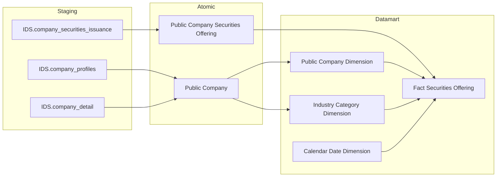
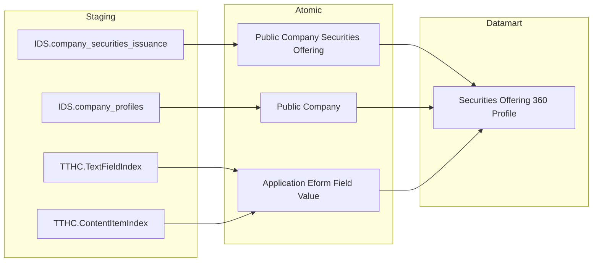
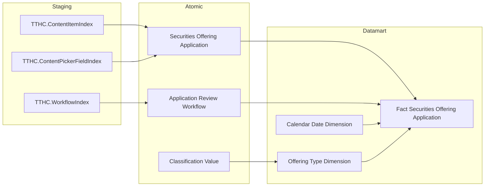

## 3.2.6 Luồng đồng bộ dữ liệu cho nhóm báo cáo Quản lý chào bán

### 3.2.6.1 Thông tin chung luồng đồng bộ

- Tên job:
- Nguồn dữ liệu (hệ thống nguồn): IDS, TTHC
- Cách thức truy xuất đồng bộ dữ liệu:
- Tần suất đồng bộ dữ liệu:
- Dung lượng dữ liệu sẽ thực hiện đồng bộ:
- Thời gian lưu trữ dữ liệu:
- Thư mục lưu trữ dữ liệu trên kho dữ liệu:

### 3.2.6.2 Luồng nghiệp vụ

#### 3.2.6.2.1 Nhóm thông tin Chào bán phát hành

**Mục đích:** Cung cấp dữ liệu cho bảng `Fact Securities Offering` phục vụ Tab CHÀO BÁN PHÁT HÀNH — phân tích tình hình cấp phép, giá trị huy động theo ngành và loại hình phát hành (KPI K_QLCB_1–16).

**Mô tả luồng:**

Staging → Atomic:

- **Public Company Securities Offering:** Bảng lưu thông tin đợt chào bán/phát hành chứng khoán của công ty đại chúng, lấy thông tin từ bảng IDS.company_securities_issuance.
- **Public Company:** Bảng lưu thông tin công ty đại chúng bao gồm mã CK, tên, ngành nghề, sàn niêm yết, lấy thông tin từ bảng IDS.company_profiles, kết hợp thông tin ngành từ bảng IDS.company_detail.

Atomic → Datamart:

- **Fact Securities Offering:** Bảng sự kiện tổng hợp thông tin đợt chào bán/phát hành chứng khoán — 1 row per đợt chào bán của 1 công ty đại chúng, lưu 6 cột giá trị/số lượng theo loại hình để phục vụ breakdown.
- **Public Company Dimension:** Bảng lưu thông tin công ty đại chúng — mã CK, tên, ngành, sàn niêm yết (SCD2).
- **Industry Category Dimension:** Bảng lưu thông tin nhóm ngành cấp 1 và cấp 2 — ETL-derived conformed dimension từ Public Company, tái sử dụng cross-module.
- **Calendar Date Dimension:** Bảng lưu thông tin thời gian — 1 row per ngày, phục vụ slicer và phân tích theo kỳ.

---

#### 3.2.6.2.2 Nhóm thông tin Chi tiết đợt chào bán

**Mục đích:** Cung cấp dữ liệu cho bảng tác nghiệp `Securities Offering 360 Profile` phục vụ Tab CHÀO BÁN PHÁT HÀNH Nhóm 4 (bảng chi tiết số lượng CK) và Tab CHÀO BÁN VÀ PHÁT HÀNH Nhóm 8–11 (tra cứu chi tiết đợt chào bán theo 4 nhóm chỉ số).

**Mô tả luồng:**

Staging → Atomic:

- **Public Company Securities Offering:** Bảng lưu thông tin đợt chào bán/phát hành chứng khoán, lấy thông tin từ bảng IDS.company_securities_issuance.
- **Public Company:** Bảng lưu thông tin công ty đại chúng, lấy thông tin từ bảng IDS.company_profiles.
- **Application Eform Field Value:** Bảng lưu toàn bộ field Eform dạng array cấu trúc `Array<Struct<content_part, content_field, text_value, big_text_value>>`, lấy thông tin từ bảng TTHC.TextFieldIndex, kết hợp dữ liệu định danh nội dung từ bảng TTHC.ContentItemIndex.

Atomic → Datamart:

- **Securities Offering 360 Profile:** Bảng tác nghiệp lưu danh sách chi tiết 360° từng đợt chào bán ở trạng thái mới nhất — pivot theo loại hình chào bán (6 giá trị), bổ sung 4 cột thông tin tổ chức từ hồ sơ TTHC (đơn vị tư vấn, kiểm toán, bảo lãnh, xếp hạng tín nhiệm).

---

#### 3.2.6.2.3 Nhóm thông tin Hồ sơ đăng ký chào bán

**Mục đích:** Cung cấp dữ liệu cho bảng `Fact Securities Offering Application` phục vụ Tab HỒ SƠ ĐĂNG KÝ CHÀO BÁN — KPI Cards tổng quan (Nhóm 5), biểu đồ tỷ lệ xử lý hồ sơ (Nhóm 6) và bảng chi tiết hồ sơ theo hình thức × năm (Nhóm 7).

**Mô tả luồng:**

Staging → Atomic:

- **Securities Offering Application:** Bảng lưu thông tin metadata hồ sơ đăng ký chào bán nộp lên UBCKNN, bao gồm trạng thái hồ sơ ETL-derived tổng hợp từ nhiều nguồn, lấy thông tin từ bảng TTHC.ContentItemIndex, kết hợp thông tin liên kết nội dung từ bảng TTHC.ContentPickerFieldIndex.
- **Application Review Workflow:** Bảng lưu thông tin workflow instance xét duyệt hồ sơ, lấy thông tin từ bảng TTHC.WorkflowIndex.
- **Classification Value (TTHC_CONTENT_TYPE):** Bảng code value lưu danh mục loại hình chào bán map từ ContentType TTHC, lấy thông tin từ bảng Classification Value Atomic.

Atomic → Datamart:

- **Fact Securities Offering Application:** Bảng sự kiện tổng hợp thông tin hồ sơ đăng ký chào bán nộp lên UBCKNN — 1 row per hồ sơ, lưu trạng thái xử lý (`Application Status Code`) ETL-derived để phục vụ đếm và phân tích.
- **Offering Type Dimension:** Bảng lưu thông tin loại hình chào bán — 11 giá trị ContentType map qua Classification Value scheme TTHC_CONTENT_TYPE.
- **Calendar Date Dimension:** Bảng lưu thông tin thời gian — 1 row per ngày nộp hồ sơ.
