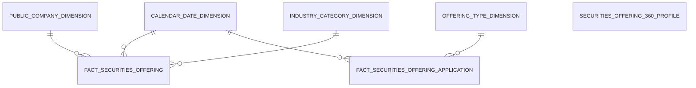
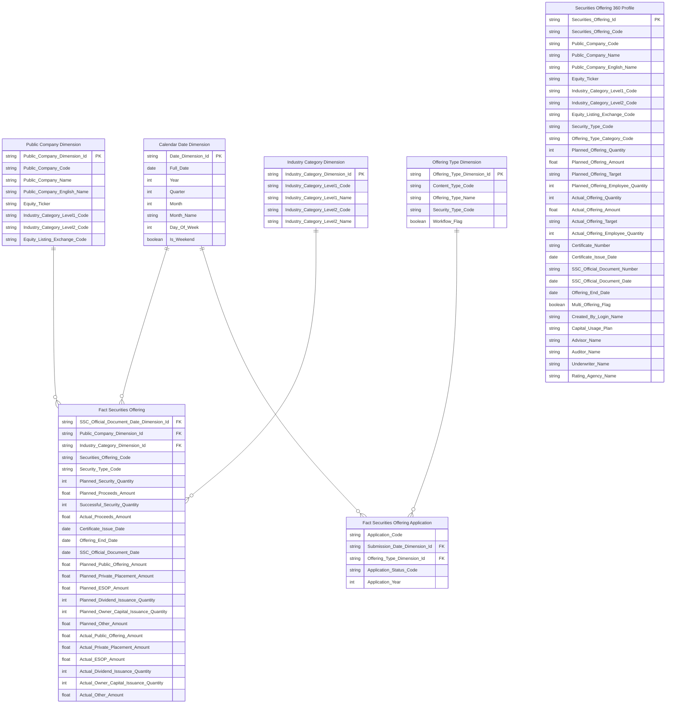
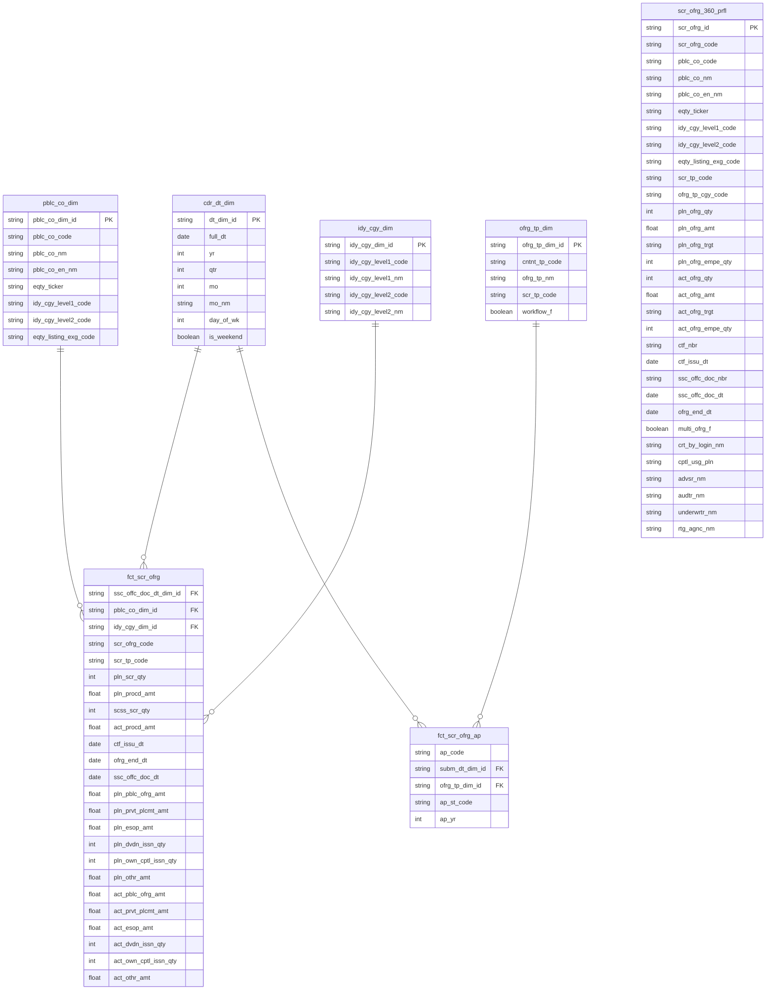

# 3. KHO DỮ LIỆU (OLAP) — Quản lý chào bán

## 3.1 Mô hình dữ liệu mức High Level / Conceptual

### 3.1.1 Sơ đồ ERD

### 3.1.2 Danh sách thực thể

| STT | Thực thể | Tên bảng | Mô tả |
|---|---|---|---|
| 1 | Calendar Date Dimension | cdr_dt_dim | Lịch ngày — năm/quý/tháng phục vụ slicer và phân tích theo thời gian |
| 2 | Public Company Dimension | pblc_co_dim | Công ty đại chúng — mã CK / tên / ngành / sàn niêm yết (SCD2) |
| 3 | Industry Category Dimension | idy_cgy_dim | Nhóm ngành — ETL-derived Conformed Dim từ Public Company. Tái sử dụng cross-module. |
| 4 | Offering Type Dimension | ofrg_tp_dim | Loại hình chào bán — map từ ContentType TTHC qua CV TTHC_CONTENT_TYPE. 11 giá trị ContentType → 11 nhãn loại hình. |
| 5 | Fact Securities Offering | fct_scr_ofrg | Event chào bán/phát hành CK — 1 row per đợt chào bán của 1 công ty đại chúng. Lưu 6 cột per-type Amount/Quantity phục vụ breakdown loại hình. |
| 6 | Fact Securities Offering Application | fct_scr_ofrg_ap | Event hồ sơ đăng ký chào bán nộp lên UBCKNN — 1 row per hồ sơ. Application Status Code ETL-derived tại Atomic. Phục vụ KPI Cards / donut / bảng chi tiết Tab Hồ sơ đăng ký chào bán. |
| 7 | Securities Offering 360 Profile | scr_ofrg_360_prfl | Hồ sơ 360° đợt chào bán — pivot theo loại hình chào bán (6 giá trị). Bổ sung 4 cột tổ chức từ TTHC. Grain: 1 row = 1 đợt × 1 loại hình có qty > 0. |

---

## 3.2 Mô hình dữ liệu mức Logic

### 3.2.1 Sơ đồ ERD

### 3.2.2 Danh sách các bảng và thuộc tính

#### 3.2.2.1 Bảng Calendar Date Dimension

| STT | Tên trường | Kiểu dữ liệu và độ dài | Nullable | Unique | P/F Key | Mặc định | Mô tả |
|---|---|---|---|---|---|---|---|
| 1 | Date Dimension Id | string | | X | P | | Surrogate key ETL sinh tự động |
| 2 | Full Date | date | | | | | Ngày dương lịch đầy đủ |
| 3 | Year | int | X | | | | Năm (YYYY) |
| 4 | Quarter | int | X | | | | Quý (1–4) |
| 5 | Month | int | X | | | | Tháng (1–12) |
| 6 | Month Name | string | X | | | | Tên tháng (tiếng Việt) |
| 7 | Day Of Week | int | X | | | | Thứ trong tuần (1=Thứ 2 ... 7=Chủ nhật) |
| 8 | Is Weekend | boolean | X | | | | Cuối tuần (True/False) |

#### 3.2.2.2 Bảng Public Company Dimension

| STT | Tên trường | Kiểu dữ liệu và độ dài | Nullable | Unique | P/F Key | Mặc định | Mô tả |
|---|---|---|---|---|---|---|---|
| 1 | Public Company Dimension Id | string | | X | P | | Surrogate key ETL sinh tự động |
| 2 | Public Company Code | string | | | | | Mã định danh công ty đại chúng |
| 3 | Public Company Name | string | X | | | | Tên công ty đại chúng (tiếng Việt) |
| 4 | Public Company English Name | string | X | | | | Tên công ty đại chúng (tiếng Anh) |
| 5 | Equity Ticker | string | X | | | | Mã chứng khoán cổ phiếu |
| 6 | Industry Category Level1 Code | string | X | | | | Mã ngành cấp 1 |
| 7 | Industry Category Level2 Code | string | X | | | | Mã ngành cấp 2 |
| 8 | Equity Listing Exchange Code | string | X | | | | Sàn niêm yết cổ phiếu (HNX/HOSE/UPCoM) |

#### 3.2.2.3 Bảng Industry Category Dimension

| STT | Tên trường | Kiểu dữ liệu và độ dài | Nullable | Unique | P/F Key | Mặc định | Mô tả |
|---|---|---|---|---|---|---|---|
| 1 | Industry Category Dimension Id | string | | X | P | | Surrogate key ETL sinh tự động |
| 2 | Industry Category Level1 Code | string | | | | | Mã ngành cấp 1 |
| 3 | Industry Category Level1 Name | string | X | | | | Tên ngành cấp 1 |
| 4 | Industry Category Level2 Code | string | | | | | Mã ngành cấp 2 |
| 5 | Industry Category Level2 Name | string | X | | | | Tên ngành cấp 2 |

#### 3.2.2.4 Bảng Offering Type Dimension

| STT | Tên trường | Kiểu dữ liệu và độ dài | Nullable | Unique | P/F Key | Mặc định | Mô tả |
|---|---|---|---|---|---|---|---|
| 1 | Offering Type Dimension Id | string | | X | P | | Surrogate key ETL sinh tự động |
| 2 | Content Type Code | string | | | | | Natural Key — mã ContentType TTHC |
| 3 | Offering Type Name | string | X | | | | Tên loại hình chào bán (tiếng Việt) |
| 4 | Security Type Code | string | X | | | | Loại CK tương ứng với loại hình chào bán |
| 5 | Workflow Flag | boolean | X | | | | Có qua workflow xét duyệt không |

#### 3.2.2.5 Bảng Fact Securities Offering

| STT | Tên trường | Kiểu dữ liệu và độ dài | Nullable | Unique | P/F Key | Mặc định | Mô tả |
|---|---|---|---|---|---|---|---|
| 1 | SSC Official Document Date Dimension Id | string | | | F | | FK lịch theo ngày công văn UBCKNN |
| 2 | Public Company Dimension Id | string | | | F | | FK công ty đại chúng |
| 3 | Industry Category Dimension Id | string | | | F | | FK ngành cấp 1 |
| 4 | Securities Offering Code | string | X | | | | Mã đợt chào bán (degenerate key) |
| 5 | Security Type Code | string | | | | | Loại CK phát hành |
| 6 | Planned Security Quantity | int | X | | | | Tổng số CK dự kiến chào bán |
| 7 | Planned Proceeds Amount | decimal(23,2) | X | | | | Tổng tiền dự kiến thu được (VNĐ) |
| 8 | Successful Security Quantity | int | X | | | | Tổng số CK chào bán thành công |
| 9 | Actual Proceeds Amount | decimal(23,2) | X | | | | Tổng tiền thực thu (VNĐ) |
| 10 | Certificate Issue Date | date | X | | | | Ngày cấp GCN chào bán |
| 11 | Offering End Date | date | X | | | | Ngày kết thúc chào bán CK |
| 12 | SSC Official Document Date | date | X | | | | Ngày công văn UBCKNN — FK date chính trên Fact |
| 13 | Planned Public Offering Amount | decimal(23,2) | X | | | | Tổng giá trị chào bán công khai dự kiến |
| 14 | Planned Private Placement Amount | decimal(23,2) | X | | | | Tổng giá trị chào bán riêng lẻ dự kiến |
| 15 | Planned ESOP Amount | decimal(23,2) | X | | | | Tổng giá trị ESOP dự kiến |
| 16 | Planned Dividend Issuance Quantity | int | X | | | | Phát hành trả cổ tức — số lượng CK dự kiến |
| 17 | Planned Owner Capital Issuance Quantity | int | X | | | | Phát hành tăng vốn từ VCSH — số lượng CK dự kiến |
| 18 | Planned Other Amount | decimal(23,2) | X | | | | Giá trị chào bán loại khác dự kiến |
| 19 | Actual Public Offering Amount | decimal(23,2) | X | | | | Tổng giá trị chào bán công khai thực tế |
| 20 | Actual Private Placement Amount | decimal(23,2) | X | | | | Tổng giá trị chào bán riêng lẻ thực tế |
| 21 | Actual ESOP Amount | decimal(23,2) | X | | | | Tổng giá trị ESOP thực tế |
| 22 | Actual Dividend Issuance Quantity | int | X | | | | Phát hành trả cổ tức — số lượng CK thực tế |
| 23 | Actual Owner Capital Issuance Quantity | int | X | | | | Phát hành tăng vốn từ VCSH — số lượng CK thực tế |
| 24 | Actual Other Amount | decimal(23,2) | X | | | | Giá trị chào bán loại khác thực tế |

#### 3.2.2.6 Bảng Fact Securities Offering Application

| STT | Tên trường | Kiểu dữ liệu và độ dài | Nullable | Unique | P/F Key | Mặc định | Mô tả |
|---|---|---|---|---|---|---|---|
| 1 | Application Code | string | | | | | Degenerate Dimension — Business key hồ sơ (TTHC ContentItemId) |
| 2 | Submission Date Dimension Id | string | | | F | | FK lịch theo ngày nộp hồ sơ |
| 3 | Offering Type Dimension Id | string | | | F | | FK loại hình chào bán |
| 4 | Application Status Code | string | | | | | Trạng thái hồ sơ ETL-derived tại tầng Atomic |
| 5 | Application Year | int | | | | | Năm nộp hồ sơ — Degenerate Dimension dạng int |

#### 3.2.2.7 Bảng Securities Offering 360 Profile

| STT | Tên trường | Kiểu dữ liệu và độ dài | Nullable | Unique | P/F Key | Mặc định | Mô tả |
|---|---|---|---|---|---|---|---|
| 1 | Securities Offering Id | string | | X | P | | Surrogate PK Atomic |
| 2 | Securities Offering Code | string | | | | | Mã đợt chào bán |
| 3 | Public Company Code | string | X | | | | Mã định danh công ty đại chúng |
| 4 | Public Company Name | string | X | | | | Tên công ty đại chúng (tiếng Việt) |
| 5 | Public Company English Name | string | X | | | | Tên công ty đại chúng (tiếng Anh) |
| 6 | Equity Ticker | string | X | | | | Mã chứng khoán cổ phiếu |
| 7 | Industry Category Level1 Code | string | X | | | | Mã ngành cấp 1 |
| 8 | Industry Category Level2 Code | string | X | | | | Mã ngành cấp 2 |
| 9 | Equity Listing Exchange Code | string | X | | | | Sàn niêm yết |
| 10 | Security Type Code | string | X | | | | Loại CK phát hành |
| 11 | Offering Type Category Code | string | | | | | Loại hình chào bán trong đợt |
| 12 | Planned Offering Quantity | int | X | | | | Số lượng CK chào bán dự kiến theo loại hình |
| 13 | Planned Offering Amount | decimal(23,2) | X | | | | Giá trị chào bán dự kiến (qty × price) theo loại hình |
| 14 | Planned Offering Target | string | X | | | | Đối tượng chào bán dự kiến theo loại hình |
| 15 | Planned Offering Employee Quantity | int | X | | | | Số CK phát hành cho người lao động dự kiến |
| 16 | Actual Offering Quantity | int | X | | | | Số lượng CK chào bán thực tế theo loại hình |
| 17 | Actual Offering Amount | decimal(23,2) | X | | | | Giá trị chào bán thực tế (qty × price) theo loại hình |
| 18 | Actual Offering Target | string | X | | | | Đối tượng chào bán thực tế theo loại hình |
| 19 | Actual Offering Employee Quantity | int | X | | | | Số CK phát hành cho người lao động thực tế |
| 20 | Certificate Number | string | X | | | | Số GCN chào bán |
| 21 | Certificate Issue Date | date | X | | | | Ngày cấp GCN chào bán |
| 22 | SSC Official Document Number | string | X | | | | Số công văn UBCKNN |
| 23 | SSC Official Document Date | date | X | | | | Ngày ra công văn UBCKNN |
| 24 | Offering End Date | date | X | | | | Ngày kết thúc chào bán CK |
| 25 | Multi Offering Flag | boolean | X | | | | Có chào bán nhiều đợt |
| 26 | Created By Login Name | string | X | | | | Chuyên viên (login_name kỹ thuật) |
| 27 | Capital Usage Plan | string | X | | | | Mục đích sử dụng vốn |
| 28 | Advisor Name | string | X | | | | Đơn vị tư vấn |
| 29 | Auditor Name | string | X | | | | Tổ chức kiểm toán |
| 30 | Underwriter Name | string | X | | | | Đơn vị bảo lãnh |
| 31 | Rating Agency Name | string | X | | | | Đơn vị xếp hạng tín nhiệm |

---

## 3.3 Mô hình dữ liệu mức vật lý

### 3.3.1 Sơ đồ ERD

### 3.3.2 Danh sách bảng Dimension

#### 3.3.2.1 Bảng Calendar Date Dimension (cdr_dt_dim)

*Mô tả bảng:* Lịch ngày — năm/quý/tháng phục vụ slicer và phân tích theo thời gian
*Đường dẫn trên kho dữ liệu:*
*Các trường Partition:*
*Thời gian lưu trữ:*
*Định dạng lưu trữ:*

| STT | Tên trường | Kiểu dữ liệu và độ dài | Nullable | Unique | P/F Key | Giá trị mặc định | Mô tả | Hệ thống nguồn | Schema.Table | Source Field Name | ETL Rules |
|---|---|---|---|---|---|---|---|---|---|---|---|
| 1 | dt_dim_id | string | | X | P | | Surrogate key ETL sinh tự động | | | | ETL sinh tự động |
| 2 | full_dt | date | | | | | Ngày dương lịch đầy đủ | | | | ETL sinh tự động |
| 3 | yr | int | X | | | | Năm (YYYY) | | | | ETL sinh tự động |
| 4 | qtr | int | X | | | | Quý (1–4) | | | | ETL sinh tự động |
| 5 | mo | int | X | | | | Tháng (1–12) | | | | ETL sinh tự động |
| 6 | mo_nm | string | X | | | | Tên tháng (tiếng Việt) | | | | ETL sinh tự động |
| 7 | day_of_wk | int | X | | | | Thứ trong tuần (1=Thứ 2 ... 7=Chủ nhật) | | | | ETL sinh tự động |
| 8 | is_weekend | boolean | X | | | | Cuối tuần (True/False) | | | | ETL sinh tự động |

#### 3.3.2.2 Bảng Public Company Dimension (pblc_co_dim)

*Mô tả bảng:* Công ty đại chúng — mã CK / tên / ngành / sàn niêm yết (SCD2)
*Đường dẫn trên kho dữ liệu:*
*Các trường Partition:*
*Thời gian lưu trữ:*
*Định dạng lưu trữ:*

| STT | Tên trường | Kiểu dữ liệu và độ dài | Nullable | Unique | P/F Key | Giá trị mặc định | Mô tả | Hệ thống nguồn | Schema.Table | Source Field Name | ETL Rules |
|---|---|---|---|---|---|---|---|---|---|---|---|
| 1 | pblc_co_dim_id | string | | X | P | | Surrogate key ETL sinh tự động | | | | ETL sinh tự động |
| 2 | pblc_co_code | string | | | | | Mã định danh công ty đại chúng | IDS | ATM.pblc_co | pblc_co_code | pblc_co.pblc_co_code |
| 3 | pblc_co_nm | string | X | | | | Tên công ty đại chúng (tiếng Việt) | IDS | ATM.pblc_co | pblc_co_nm | pblc_co.pblc_co_nm |
| 4 | pblc_co_en_nm | string | X | | | | Tên công ty đại chúng (tiếng Anh) | IDS | ATM.pblc_co | pblc_co_en_nm | pblc_co.pblc_co_en_nm |
| 5 | eqty_ticker | string | X | | | | Mã chứng khoán cổ phiếu | IDS | ATM.pblc_co | eqty_ticker | pblc_co.eqty_ticker |
| 6 | idy_cgy_level1_code | string | X | | | | Mã ngành cấp 1 | IDS | ATM.pblc_co | idy_cgy_level1_code | pblc_co.idy_cgy_level1_code |
| 7 | idy_cgy_level2_code | string | X | | | | Mã ngành cấp 2 | IDS | ATM.pblc_co | idy_cgy_level2_code | pblc_co.idy_cgy_level2_code |
| 8 | eqty_listing_exg_code | string | X | | | | Sàn niêm yết cổ phiếu (HNX/HOSE/UPCoM) | IDS | ATM.pblc_co | eqty_listing_exg_code | pblc_co.eqty_listing_exg_code |

#### 3.3.2.3 Bảng Industry Category Dimension (idy_cgy_dim)

*Mô tả bảng:* Nhóm ngành — ETL-derived Conformed Dim từ Public Company. Tái sử dụng cross-module.
*Đường dẫn trên kho dữ liệu:*
*Các trường Partition:*
*Thời gian lưu trữ:*
*Định dạng lưu trữ:*

| STT | Tên trường | Kiểu dữ liệu và độ dài | Nullable | Unique | P/F Key | Giá trị mặc định | Mô tả | Hệ thống nguồn | Schema.Table | Source Field Name | ETL Rules |
|---|---|---|---|---|---|---|---|---|---|---|---|
| 1 | idy_cgy_dim_id | string | | X | P | | Surrogate key ETL sinh tự động | | | | ETL sinh tự động |
| 2 | idy_cgy_level1_code | string | | | | | Mã ngành cấp 1 | IDS | ATM.pblc_co | idy_cgy_level1_code | pblc_co.idy_cgy_level1_code |
| 3 | idy_cgy_level1_nm | string | X | | | | Tên ngành cấp 1 | IDS | ATM.cv | cl_nm | JOIN cv ON cv.cl_code = pblc_co.idy_cgy_level1_code AND cv.scm_code = 'ECAT_INDUSTRY_LV1' → cv.cl_nm |
| 4 | idy_cgy_level2_code | string | | | | | Mã ngành cấp 2 | IDS | ATM.pblc_co | idy_cgy_level2_code | pblc_co.idy_cgy_level2_code |
| 5 | idy_cgy_level2_nm | string | X | | | | Tên ngành cấp 2 | IDS | ATM.cv | cl_nm | JOIN cv ON cv.cl_code = pblc_co.idy_cgy_level2_code AND cv.scm_code = 'ECAT_INDUSTRY_LV2' → cv.cl_nm |

#### 3.3.2.4 Bảng Offering Type Dimension (ofrg_tp_dim)

*Mô tả bảng:* Loại hình chào bán — map từ ContentType TTHC qua CV TTHC_CONTENT_TYPE. 11 giá trị ContentType → 11 nhãn loại hình.
*Đường dẫn trên kho dữ liệu:*
*Các trường Partition:*
*Thời gian lưu trữ:*
*Định dạng lưu trữ:*

| STT | Tên trường | Kiểu dữ liệu và độ dài | Nullable | Unique | P/F Key | Giá trị mặc định | Mô tả | Hệ thống nguồn | Schema.Table | Source Field Name | ETL Rules |
|---|---|---|---|---|---|---|---|---|---|---|---|
| 1 | ofrg_tp_dim_id | string | | X | P | | Surrogate key ETL sinh tự động | | | | ETL sinh tự động |
| 2 | cntnt_tp_code | string | | | | | Natural Key — mã ContentType TTHC | TTHC | ATM.scr_ofrg_ap | cntnt_tp_code | scr_ofrg_ap.cntnt_tp_code |
| 3 | ofrg_tp_nm | string | X | | | | Tên loại hình chào bán (tiếng Việt) | TTHC | ATM.cv | cl_nm | JOIN cv ON cv.cl_code = scr_ofrg_ap.cntnt_tp_code AND cv.scm_code = 'TTHC_CONTENT_TYPE' → cv.cl_nm |
| 4 | scr_tp_code | string | X | | | | Loại CK tương ứng với loại hình chào bán | | | | ETL sinh tự động |
| 5 | workflow_f | boolean | X | | | | Có qua workflow xét duyệt không | | | | ETL sinh tự động |

### 3.3.3 Danh sách bảng Detail Fact

#### 3.3.3.1 Bảng Fact Securities Offering (fct_scr_ofrg)

*Mô tả bảng:* Event chào bán/phát hành CK — 1 row per đợt chào bán của 1 công ty đại chúng. Lưu 6 cột per-type Amount/Quantity phục vụ breakdown loại hình.
*Đường dẫn trên kho dữ liệu:*
*Các trường Partition:*
*Thời gian lưu trữ:*
*Định dạng lưu trữ:*

| STT | Tên trường | Kiểu dữ liệu và độ dài | Nullable | Unique | P/F Key | Giá trị mặc định | Mô tả | Hệ thống nguồn | Schema.Table | Source Field Name | ETL Rules |
|---|---|---|---|---|---|---|---|---|---|---|---|
| 1 | ssc_offc_doc_dt_dim_id | string | | | F | | FK lịch theo ngày công văn UBCKNN | IDS | ATM.pblc_co_scr_ofrg | ssc_offc_doc_dt | LOOKUP cdr_dt_dim ON cdr_dt_dim.dt = pblc_co_scr_ofrg.ssc_offc_doc_dt |
| 2 | pblc_co_dim_id | string | | | F | | FK công ty đại chúng | IDS | ATM.pblc_co_scr_ofrg | pblc_co_code | LOOKUP pblc_co_dim ON pblc_co_dim.pblc_co_code = pblc_co_scr_ofrg.pblc_co_code AND pblc_co_scr_ofrg.ssc_offc_doc_dt BETWEEN pblc_co_dim.eff_dt AND pblc_co_dim.expiry_dt |
| 3 | idy_cgy_dim_id | string | | | F | | FK ngành cấp 1 | IDS | ATM.pblc_co_scr_ofrg | pblc_co_code | LOOKUP idy_cgy_dim ON idy_cgy_dim.idy_cgy_level1_code = pblc_co.idy_cgy_level1_code AND idy_cgy_dim.idy_cgy_level2_code = pblc_co.idy_cgy_level2_code AND pblc_co_scr_ofrg.ssc_offc_doc_dt BETWEEN idy_cgy_dim.eff_dt AND idy_cgy_dim.expiry_dt |
| 4 | scr_ofrg_code | string | X | | | | Mã đợt chào bán (degenerate key) | IDS | ATM.pblc_co_scr_ofrg | pblc_co_scr_ofrg_code | pblc_co_scr_ofrg.pblc_co_scr_ofrg_code |
| 5 | scr_tp_code | string | | | | | Loại CK phát hành | IDS | ATM.pblc_co_scr_ofrg | scr_tp_code | pblc_co_scr_ofrg.scr_tp_code |
| 6 | pln_scr_qty | int | X | | | | Tổng số CK dự kiến chào bán | IDS | ATM.pblc_co_scr_ofrg | pln_scr_qty | pblc_co_scr_ofrg.pln_scr_qty |
| 7 | pln_procd_amt | decimal(23,2) | X | | | | Tổng tiền dự kiến thu được (VNĐ) | IDS | ATM.pblc_co_scr_ofrg | pln_procd_amt | pblc_co_scr_ofrg.pln_procd_amt |
| 8 | scss_scr_qty | int | X | | | | Tổng số CK chào bán thành công | IDS | ATM.pblc_co_scr_ofrg | scss_scr_qty | pblc_co_scr_ofrg.scss_scr_qty |
| 9 | act_procd_amt | decimal(23,2) | X | | | | Tổng tiền thực thu (VNĐ) | IDS | ATM.pblc_co_scr_ofrg | act_procd_amt | pblc_co_scr_ofrg.act_procd_amt |
| 10 | ctf_issu_dt | date | X | | | | Ngày cấp GCN chào bán | IDS | ATM.pblc_co_scr_ofrg | ctf_issu_dt | pblc_co_scr_ofrg.ctf_issu_dt |
| 11 | ofrg_end_dt | date | X | | | | Ngày kết thúc chào bán CK | IDS | ATM.pblc_co_scr_ofrg | ofrg_end_dt | pblc_co_scr_ofrg.ofrg_end_dt |
| 12 | ssc_offc_doc_dt | date | X | | | | Ngày công văn UBCKNN — FK date chính trên Fact | IDS | ATM.pblc_co_scr_ofrg | ssc_offc_doc_dt | pblc_co_scr_ofrg.ssc_offc_doc_dt |
| 13 | pln_pblc_ofrg_amt | decimal(23,2) | X | | | | Tổng giá trị chào bán công khai dự kiến | IDS | ATM.pblc_co_scr_ofrg | pln_exst_shrhlr_ofrg_qty / pln_exst_shrhlr_ofrg_prc / pln_auctn_ofrg_qty / pln_auctn_ofrg_prc / pln_pblc_othr_ofrg_qty / pln_pblc_othr_ofrg_prc / pln_pblc_co_ofrg_qty / pln_pblc_co_ofrg_prc | (pblc_co_scr_ofrg.pln_exst_shrhlr_ofrg_qty * pblc_co_scr_ofrg.pln_exst_shrhlr_ofrg_prc) + (pblc_co_scr_ofrg.pln_auctn_ofrg_qty * pblc_co_scr_ofrg.pln_auctn_ofrg_prc) + (pblc_co_scr_ofrg.pln_pblc_othr_ofrg_qty * pblc_co_scr_ofrg.pln_pblc_othr_ofrg_prc) + (pblc_co_scr_ofrg.pln_pblc_co_ofrg_qty * pblc_co_scr_ofrg.pln_pblc_co_ofrg_prc) |
| 14 | pln_prvt_plcmt_amt | decimal(23,2) | X | | | | Tổng giá trị chào bán riêng lẻ dự kiến | IDS | ATM.pblc_co_scr_ofrg | pln_prvt_plcmt_ofrg_qty / pln_prvt_plcmt_ofrg_prc | pblc_co_scr_ofrg.pln_prvt_plcmt_ofrg_qty * pblc_co_scr_ofrg.pln_prvt_plcmt_ofrg_prc |
| 15 | pln_esop_amt | decimal(23,2) | X | | | | Tổng giá trị ESOP dự kiến | IDS | ATM.pblc_co_scr_ofrg | pln_esop_issn_qty / pln_esop_issn_prc / pln_bns_shr_issn_qty / pln_bns_shr_issn_prc | (pblc_co_scr_ofrg.pln_esop_issn_qty * pblc_co_scr_ofrg.pln_esop_issn_prc) + (pblc_co_scr_ofrg.pln_bns_shr_issn_qty * pblc_co_scr_ofrg.pln_bns_shr_issn_prc) |
| 16 | pln_dvdn_issn_qty | int | X | | | | Phát hành trả cổ tức — số lượng CK dự kiến | IDS | ATM.pblc_co_scr_ofrg | pln_dvdn_issn_qty | pblc_co_scr_ofrg.pln_dvdn_issn_qty |
| 17 | pln_own_cptl_issn_qty | int | X | | | | Phát hành tăng vốn từ VCSH — số lượng CK dự kiến | IDS | ATM.pblc_co_scr_ofrg | pln_own_cptl_issn_qty | pblc_co_scr_ofrg.pln_own_cptl_issn_qty |
| 18 | pln_othr_amt | decimal(23,2) | X | | | | Giá trị chào bán loại khác dự kiến | IDS | ATM.pblc_co_scr_ofrg | pln_procd_amt / pln_exst_shrhlr_ofrg_qty / pln_exst_shrhlr_ofrg_prc / pln_auctn_ofrg_qty / pln_auctn_ofrg_prc / pln_pblc_othr_ofrg_qty / pln_pblc_othr_ofrg_prc / pln_pblc_co_ofrg_qty / pln_pblc_co_ofrg_prc / pln_prvt_plcmt_ofrg_qty / pln_prvt_plcmt_ofrg_prc / pln_esop_issn_qty / pln_esop_issn_prc / pln_bns_shr_issn_qty / pln_bns_shr_issn_prc | pblc_co_scr_ofrg.pln_procd_amt - ((pblc_co_scr_ofrg.pln_exst_shrhlr_ofrg_qty * pblc_co_scr_ofrg.pln_exst_shrhlr_ofrg_prc) + (pblc_co_scr_ofrg.pln_auctn_ofrg_qty * pblc_co_scr_ofrg.pln_auctn_ofrg_prc) + (pblc_co_scr_ofrg.pln_pblc_othr_ofrg_qty * pblc_co_scr_ofrg.pln_pblc_othr_ofrg_prc) + (pblc_co_scr_ofrg.pln_pblc_co_ofrg_qty * pblc_co_scr_ofrg.pln_pblc_co_ofrg_prc) + (pblc_co_scr_ofrg.pln_prvt_plcmt_ofrg_qty * pblc_co_scr_ofrg.pln_prvt_plcmt_ofrg_prc) + (pblc_co_scr_ofrg.pln_esop_issn_qty * pblc_co_scr_ofrg.pln_esop_issn_prc) + (pblc_co_scr_ofrg.pln_bns_shr_issn_qty * pblc_co_scr_ofrg.pln_bns_shr_issn_prc)) |
| 19 | act_pblc_ofrg_amt | decimal(23,2) | X | | | | Tổng giá trị chào bán công khai thực tế | IDS | ATM.pblc_co_scr_ofrg | rslt_exst_shrhlr_ofrg_qty / rslt_exst_shrhlr_ofrg_prc / rslt_auctn_ofrg_qty / rslt_auctn_ofrg_prc / rslt_pblc_othr_ofrg_qty / rslt_pblc_othr_ofrg_prc / rslt_pblc_co_ofrg_qty / rslt_pblc_co_ofrg_prc | (pblc_co_scr_ofrg.rslt_exst_shrhlr_ofrg_qty * pblc_co_scr_ofrg.rslt_exst_shrhlr_ofrg_prc) + (pblc_co_scr_ofrg.rslt_auctn_ofrg_qty * pblc_co_scr_ofrg.rslt_auctn_ofrg_prc) + (pblc_co_scr_ofrg.rslt_pblc_othr_ofrg_qty * pblc_co_scr_ofrg.rslt_pblc_othr_ofrg_prc) + (pblc_co_scr_ofrg.rslt_pblc_co_ofrg_qty * pblc_co_scr_ofrg.rslt_pblc_co_ofrg_prc) |
| 20 | act_prvt_plcmt_amt | decimal(23,2) | X | | | | Tổng giá trị chào bán riêng lẻ thực tế | IDS | ATM.pblc_co_scr_ofrg | rslt_prvt_plcmt_ofrg_qty / rslt_prvt_plcmt_ofrg_prc | pblc_co_scr_ofrg.rslt_prvt_plcmt_ofrg_qty * pblc_co_scr_ofrg.rslt_prvt_plcmt_ofrg_prc |
| 21 | act_esop_amt | decimal(23,2) | X | | | | Tổng giá trị ESOP thực tế | IDS | ATM.pblc_co_scr_ofrg | rslt_esop_issn_qty / rslt_esop_issn_prc / rslt_bns_shr_issn_qty / rslt_bns_shr_issn_prc | (pblc_co_scr_ofrg.rslt_esop_issn_qty * pblc_co_scr_ofrg.rslt_esop_issn_prc) + (pblc_co_scr_ofrg.rslt_bns_shr_issn_qty * pblc_co_scr_ofrg.rslt_bns_shr_issn_prc) |
| 22 | act_dvdn_issn_qty | int | X | | | | Phát hành trả cổ tức — số lượng CK thực tế | IDS | ATM.pblc_co_scr_ofrg | rslt_dvdn_issn_qty | pblc_co_scr_ofrg.rslt_dvdn_issn_qty |
| 23 | act_own_cptl_issn_qty | int | X | | | | Phát hành tăng vốn từ VCSH — số lượng CK thực tế | IDS | ATM.pblc_co_scr_ofrg | rslt_own_cptl_issn_qty | pblc_co_scr_ofrg.rslt_own_cptl_issn_qty |
| 24 | act_othr_amt | decimal(23,2) | X | | | | Giá trị chào bán loại khác thực tế | IDS | ATM.pblc_co_scr_ofrg | act_procd_amt / rslt_exst_shrhlr_ofrg_qty / rslt_exst_shrhlr_ofrg_prc / rslt_auctn_ofrg_qty / rslt_auctn_ofrg_prc / rslt_pblc_othr_ofrg_qty / rslt_pblc_othr_ofrg_prc / rslt_pblc_co_ofrg_qty / rslt_pblc_co_ofrg_prc / rslt_prvt_plcmt_ofrg_qty / rslt_prvt_plcmt_ofrg_prc / rslt_esop_issn_qty / rslt_esop_issn_prc / rslt_bns_shr_issn_qty / rslt_bns_shr_issn_prc | pblc_co_scr_ofrg.act_procd_amt - ((pblc_co_scr_ofrg.rslt_exst_shrhlr_ofrg_qty * pblc_co_scr_ofrg.rslt_exst_shrhlr_ofrg_prc) + (pblc_co_scr_ofrg.rslt_auctn_ofrg_qty * pblc_co_scr_ofrg.rslt_auctn_ofrg_prc) + (pblc_co_scr_ofrg.rslt_pblc_othr_ofrg_qty * pblc_co_scr_ofrg.rslt_pblc_othr_ofrg_prc) + (pblc_co_scr_ofrg.rslt_pblc_co_ofrg_qty * pblc_co_scr_ofrg.rslt_pblc_co_ofrg_prc) + (pblc_co_scr_ofrg.rslt_prvt_plcmt_ofrg_qty * pblc_co_scr_ofrg.rslt_prvt_plcmt_ofrg_prc) + (pblc_co_scr_ofrg.rslt_esop_issn_qty * pblc_co_scr_ofrg.rslt_esop_issn_prc) + (pblc_co_scr_ofrg.rslt_bns_shr_issn_qty * pblc_co_scr_ofrg.rslt_bns_shr_issn_prc)) |

#### 3.3.3.2 Bảng Fact Securities Offering Application (fct_scr_ofrg_ap)

*Mô tả bảng:* Event hồ sơ đăng ký chào bán nộp lên UBCKNN — 1 row per hồ sơ. Application Status Code ETL-derived tại Atomic. Phục vụ KPI Cards / donut / bảng chi tiết Tab Hồ sơ đăng ký chào bán.
*Đường dẫn trên kho dữ liệu:*
*Các trường Partition:*
*Thời gian lưu trữ:*
*Định dạng lưu trữ:*

| STT | Tên trường | Kiểu dữ liệu và độ dài | Nullable | Unique | P/F Key | Giá trị mặc định | Mô tả | Hệ thống nguồn | Schema.Table | Source Field Name | ETL Rules |
|---|---|---|---|---|---|---|---|---|---|---|---|
| 1 | ap_code | string | | | | | Degenerate Dimension — Business key hồ sơ (TTHC ContentItemId) | TTHC | ATM.scr_ofrg_ap | scr_ofrg_ap_code | scr_ofrg_ap.scr_ofrg_ap_code |
| 2 | subm_dt_dim_id | string | | | F | | FK lịch theo ngày nộp hồ sơ | TTHC | ATM.scr_ofrg_ap | crt_tms | LOOKUP cdr_dt_dim ON cdr_dt_dim.dt = CAST(scr_ofrg_ap.crt_tms AS date) |
| 3 | ofrg_tp_dim_id | string | | | F | | FK loại hình chào bán | TTHC | ATM.scr_ofrg_ap | cntnt_tp_code | LOOKUP ofrg_tp_dim ON ofrg_tp_dim.cntnt_tp_code = scr_ofrg_ap.cntnt_tp_code AND CAST(scr_ofrg_ap.crt_tms AS date) BETWEEN ofrg_tp_dim.eff_dt AND ofrg_tp_dim.expiry_dt |
| 4 | ap_st_code | string | | | | | Trạng thái hồ sơ ETL-derived tại tầng Atomic | TTHC | ATM.scr_ofrg_ap | ap_st_code | scr_ofrg_ap.ap_st_code |
| 5 | ap_yr | int | | | | | Năm nộp hồ sơ — Degenerate Dimension dạng int | TTHC | ATM.scr_ofrg_ap | crt_tms | EXTRACT(YEAR FROM scr_ofrg_ap.crt_tms) |

### 3.3.4 Danh sách bảng tác nghiệp (Operational)

#### 3.3.4.1 Bảng Securities Offering 360 Profile (scr_ofrg_360_prfl)

*Mô tả bảng:* Hồ sơ 360° đợt chào bán — pivot theo loại hình chào bán (6 giá trị). Bổ sung 4 cột tổ chức từ TTHC. Grain: 1 row = 1 đợt × 1 loại hình có qty > 0.
*Đường dẫn trên kho dữ liệu:*
*Các trường Partition:*
*Thời gian lưu trữ:*
*Định dạng lưu trữ:*

| STT | Tên trường | Kiểu dữ liệu và độ dài | Nullable | Unique | P/F Key | Giá trị mặc định | Mô tả | Hệ thống nguồn | Schema.Table | Source Field Name | ETL Rules |
|---|---|---|---|---|---|---|---|---|---|---|---|
| 1 | scr_ofrg_id | string | | X | P | | Surrogate PK Atomic | IDS | ATM.pblc_co_scr_ofrg | pblc_co_scr_ofrg_id | pblc_co_scr_ofrg.pblc_co_scr_ofrg_id |
| 2 | scr_ofrg_code | string | | | | | Mã đợt chào bán | IDS | ATM.pblc_co_scr_ofrg | pblc_co_scr_ofrg_code | pblc_co_scr_ofrg.pblc_co_scr_ofrg_code |
| 3 | pblc_co_code | string | X | | | | Mã định danh công ty đại chúng | IDS | ATM.pblc_co | pblc_co_code | pblc_co.pblc_co_code |
| 4 | pblc_co_nm | string | X | | | | Tên công ty đại chúng (tiếng Việt) | IDS | ATM.pblc_co | pblc_co_nm | pblc_co.pblc_co_nm |
| 5 | pblc_co_en_nm | string | X | | | | Tên công ty đại chúng (tiếng Anh) | IDS | ATM.pblc_co | pblc_co_en_nm | pblc_co.pblc_co_en_nm |
| 6 | eqty_ticker | string | X | | | | Mã chứng khoán cổ phiếu | IDS | ATM.pblc_co | eqty_ticker | pblc_co.eqty_ticker |
| 7 | idy_cgy_level1_code | string | X | | | | Mã ngành cấp 1 | IDS | ATM.pblc_co | idy_cgy_level1_code | pblc_co.idy_cgy_level1_code |
| 8 | idy_cgy_level2_code | string | X | | | | Mã ngành cấp 2 | IDS | ATM.pblc_co | idy_cgy_level2_code | pblc_co.idy_cgy_level2_code |
| 9 | eqty_listing_exg_code | string | X | | | | Sàn niêm yết | IDS | ATM.pblc_co | eqty_listing_exg_code | pblc_co.eqty_listing_exg_code |
| 10 | scr_tp_code | string | X | | | | Loại CK phát hành | IDS | ATM.pblc_co_scr_ofrg | scr_tp_code | pblc_co_scr_ofrg.scr_tp_code |
| 11 | ofrg_tp_cgy_code | string | | | | | Loại hình chào bán trong đợt | | | | 'PUBLIC' UNION ALL 'PRIVATE' UNION ALL 'ESOP' UNION ALL 'DIVIDEND' UNION ALL 'OWNER_CAPITAL' UNION ALL 'OTHER' |
| 12 | pln_ofrg_qty | int | X | | | | Số lượng CK chào bán dự kiến theo loại hình | IDS | ATM.pblc_co_scr_ofrg | pln_scr_qty / pln_exst_shrhlr_ofrg_qty / pln_auctn_ofrg_qty / pln_pblc_othr_ofrg_qty / pln_pblc_co_ofrg_qty / pln_prvt_plcmt_ofrg_qty / pln_esop_issn_qty / pln_bns_shr_issn_qty / pln_dvdn_issn_qty / pln_own_cptl_issn_qty | Pivot qty dự kiến theo loại hình chào bán |
| 13 | pln_ofrg_amt | decimal(23,2) | X | | | | Giá trị chào bán dự kiến theo loại hình | IDS | ATM.pblc_co_scr_ofrg | pln_procd_amt / pln_exst_shrhlr_ofrg_qty / pln_exst_shrhlr_ofrg_prc / pln_auctn_ofrg_qty / pln_auctn_ofrg_prc / pln_pblc_othr_ofrg_qty / pln_pblc_othr_ofrg_prc / pln_pblc_co_ofrg_qty / pln_pblc_co_ofrg_prc / pln_prvt_plcmt_ofrg_qty / pln_prvt_plcmt_ofrg_prc / pln_esop_issn_qty / pln_esop_issn_prc / pln_bns_shr_issn_qty / pln_bns_shr_issn_prc | Pivot giá trị dự kiến (qty × price) theo loại hình |
| 14 | pln_ofrg_trgt | string | X | | | | Đối tượng chào bán dự kiến theo loại hình | IDS | ATM.pblc_co_scr_ofrg | pln_prvt_plcmt_ofrg_trgt / pln_esop_issn_trgt / pln_bns_shr_issn_trgt / pln_own_cptl_issn_src | Pivot đối tượng chào bán dự kiến theo loại hình |
| 15 | pln_ofrg_empe_qty | int | X | | | | Số CK phát hành cho người lao động dự kiến | IDS | ATM.pblc_co_scr_ofrg | pln_esop_issn_qty / pln_bns_shr_issn_qty | Pivot số CK phát hành cho NLĐ dự kiến |
| 16 | act_ofrg_qty | int | X | | | | Số lượng CK chào bán thực tế theo loại hình | IDS | ATM.pblc_co_scr_ofrg | scss_scr_qty / rslt_exst_shrhlr_ofrg_qty / rslt_auctn_ofrg_qty / rslt_pblc_othr_ofrg_qty / rslt_pblc_co_ofrg_qty / rslt_prvt_plcmt_ofrg_qty / rslt_esop_issn_qty / rslt_bns_shr_issn_qty / rslt_dvdn_issn_qty / rslt_own_cptl_issn_qty | Pivot qty thực tế theo loại hình chào bán |
| 17 | act_ofrg_amt | decimal(23,2) | X | | | | Giá trị chào bán thực tế theo loại hình | IDS | ATM.pblc_co_scr_ofrg | act_procd_amt / rslt_exst_shrhlr_ofrg_qty / rslt_exst_shrhlr_ofrg_prc / rslt_auctn_ofrg_qty / rslt_auctn_ofrg_prc / rslt_pblc_othr_ofrg_qty / rslt_pblc_othr_ofrg_prc / rslt_pblc_co_ofrg_qty / rslt_pblc_co_ofrg_prc / rslt_prvt_plcmt_ofrg_qty / rslt_prvt_plcmt_ofrg_prc / rslt_esop_issn_qty / rslt_esop_issn_prc / rslt_bns_shr_issn_qty / rslt_bns_shr_issn_prc | Pivot giá trị thực tế (qty × price) theo loại hình |
| 18 | act_ofrg_trgt | string | X | | | | Đối tượng chào bán thực tế theo loại hình | IDS | ATM.pblc_co_scr_ofrg | rslt_prvt_plcmt_ofrg_trgt / rslt_esop_issn_trgt / rslt_bns_shr_issn_trgt / rslt_own_cptl_issn_src | Pivot đối tượng chào bán thực tế theo loại hình |
| 19 | act_ofrg_empe_qty | int | X | | | | Số CK phát hành cho người lao động thực tế | IDS | ATM.pblc_co_scr_ofrg | rslt_esop_issn_qty / rslt_bns_shr_issn_qty | Pivot số CK phát hành cho NLĐ thực tế |
| 20 | ctf_nbr | string | X | | | | Số GCN chào bán | IDS | ATM.pblc_co_scr_ofrg | ctf_nbr | pblc_co_scr_ofrg.ctf_nbr |
| 21 | ctf_issu_dt | date | X | | | | Ngày cấp GCN chào bán | IDS | ATM.pblc_co_scr_ofrg | ctf_issu_dt | pblc_co_scr_ofrg.ctf_issu_dt |
| 22 | ssc_offc_doc_nbr | string | X | | | | Số công văn UBCKNN | IDS | ATM.pblc_co_scr_ofrg | ssc_offc_doc_nbr | pblc_co_scr_ofrg.ssc_offc_doc_nbr |
| 23 | ssc_offc_doc_dt | date | X | | | | Ngày ra công văn UBCKNN | IDS | ATM.pblc_co_scr_ofrg | ssc_offc_doc_dt | pblc_co_scr_ofrg.ssc_offc_doc_dt |
| 24 | ofrg_end_dt | date | X | | | | Ngày kết thúc chào bán CK | IDS | ATM.pblc_co_scr_ofrg | ofrg_end_dt | pblc_co_scr_ofrg.ofrg_end_dt |
| 25 | multi_ofrg_f | boolean | X | | | | Có chào bán nhiều đợt | IDS | ATM.pblc_co_scr_ofrg | multi_ofrg_f | pblc_co_scr_ofrg.multi_ofrg_f |
| 26 | crt_by_login_nm | string | X | | | | Chuyên viên (login_name kỹ thuật) | IDS | ATM.pblc_co_scr_ofrg | crt_by_login_nm | pblc_co_scr_ofrg.crt_by_login_nm |
| 27 | cptl_usg_pln | string | X | | | | Mục đích sử dụng vốn | IDS | ATM.pblc_co_scr_ofrg | cptl_usg_pln | pblc_co_scr_ofrg.cptl_usg_pln |
| 28 | advsr_nm | string | X | | | | Đơn vị tư vấn | TTHC | ATM.ap_eform_fld_val | tx_fields | FILTER(ap_eform_fld_val.tx_fields, x -> x.cntnt_field LIKE '%Tochuctuvan%' OR x.cntnt_field LIKE '%Tentochuctuvan%')[0].tx_val |
| 29 | audtr_nm | string | X | | | | Tổ chức kiểm toán | TTHC | ATM.ap_eform_fld_val | tx_fields | FILTER(ap_eform_fld_val.tx_fields, x -> x.cntnt_field LIKE '%Tochuckiemtoan%')[0].tx_val |
| 30 | underwrtr_nm | string | X | | | | Đơn vị bảo lãnh | TTHC | ATM.ap_eform_fld_val | tx_fields | FILTER(ap_eform_fld_val.tx_fields, x -> x.cntnt_field LIKE '%baolanh%' AND x.cntnt_field NOT LIKE '%baolanhthanhtoan%')[0].tx_val |
| 31 | rtg_agnc_nm | string | X | | | | Đơn vị xếp hạng tín nhiệm | TTHC | ATM.ap_eform_fld_val | tx_fields | FILTER(ap_eform_fld_val.tx_fields, x -> x.cntnt_field LIKE '%xephang%')[0].tx_val |
