## 3.2.7 Luồng đồng bộ dữ liệu cho nhóm báo cáo Quản lý kinh doanh

### 3.2.7.1 Thông tin chung luồng đồng bộ

- Tên job:
- Nguồn dữ liệu (hệ thống nguồn): SCMS, FIMS, NHNCK, THANHTRA, IDS
- Cách thức truy xuất đồng bộ dữ liệu:
- Tần suất đồng bộ dữ liệu:
- Dung lượng dữ liệu sẽ thực hiện đồng bộ:
- Thời gian lưu trữ dữ liệu:
- Thư mục lưu trữ dữ liệu trên kho dữ liệu:

### 3.2.7.2 Luồng nghiệp vụ

#### 3.2.7.2.1 Nhóm thông tin Thống kê tổng hợp CTCK

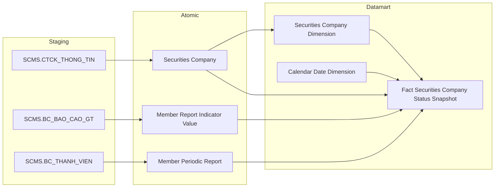

**Mục đích:** Cung cấp dữ liệu cho bảng `Fact Securities Company Status Snapshot` phục vụ Tab TỔNG QUAN — Nhóm 1, tổng hợp tình trạng CTCK theo ngày bao gồm số lượng CTCK theo trạng thái, số tài khoản phát sinh giao dịch và số dư tiền gửi giao dịch.

**Mô tả luồng:**

Staging → Atomic:
- **Securities Company:** Bảng lưu thông tin công ty chứng khoán (tên, mã, trạng thái, vốn điều lệ, niêm yết) lấy thông tin từ bảng SCMS.CTCK_THONG_TIN
- **Member Report Indicator Value:** Bảng lưu giá trị chỉ tiêu báo cáo định kỳ (số tài khoản GD, số dư tiền gửi) lấy thông tin từ bảng SCMS.BC_BAO_CAO_GT
- **Member Periodic Report:** Bảng lưu thông tin kỳ báo cáo định kỳ thành viên lấy thông tin từ bảng SCMS.BC_THANH_VIEN

Atomic → Datamart:
- **Securities Company Dimension:** Bảng lưu thông tin công ty chứng khoán phục vụ tra cứu và lọc theo CTCK (SCD2)
- **Calendar Date Dimension:** Bảng lưu thông tin thời gian phục vụ slicer và time-series
- **Fact Securities Company Status Snapshot:** Bảng sự kiện tổng hợp thông tin tình trạng CTCK — 1 dòng = 1 CTCK × 1 ngày snapshot, lưu trạng thái, cờ niêm yết, vốn điều lệ và các chỉ tiêu tổng hợp

---

#### 3.2.7.2.2 Nhóm thông tin Số lượng CTCK theo nghiệp vụ và dịch vụ

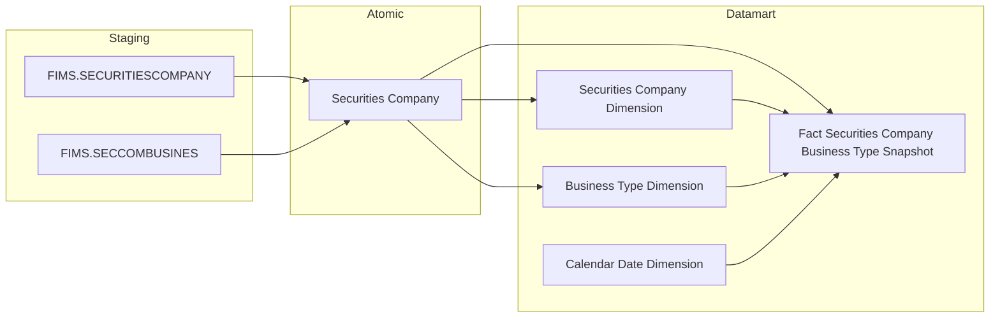

**Mục đích:** Cung cấp dữ liệu cho bảng `Fact Securities Company Business Type Snapshot` phục vụ Tab TỔNG QUAN — Nhóm 2 (Biểu đồ Nghiệp vụ) và Nhóm 3 (Biểu đồ Dịch vụ), thể hiện số lượng CTCK theo từng nghiệp vụ kinh doanh (môi giới/bảo lãnh/tư vấn/tự doanh) từ nguồn FIMS.

**Mô tả luồng:**

Staging → Atomic:
- **Securities Company:** Bảng lưu thông tin công ty chứng khoán, bao gồm danh sách mã nghiệp vụ kinh doanh được cấp phép dạng Array (ETL UNNEST từ junction SECCOMBUSINES, scheme FIMS_BUSINESS_TYPE) lấy thông tin từ bảng FIMS.SECURITIESCOMPANY, kết hợp dữ liệu nghiệp vụ từ bảng FIMS.SECCOMBUSINES

Atomic → Datamart:
- **Securities Company Dimension:** Bảng lưu thông tin công ty chứng khoán phục vụ tra cứu và lọc theo CTCK (SCD2)
- **Business Type Dimension:** Bảng lưu danh mục nghiệp vụ CTCK (môi giới/bảo lãnh/tư vấn/tự doanh) theo scheme FIMS_BUSINESS_TYPE (SCD2)
- **Calendar Date Dimension:** Bảng lưu thông tin thời gian phục vụ slicer và time-series
- **Fact Securities Company Business Type Snapshot:** Bảng sự kiện tổng hợp thông tin nghiệp vụ CTCK — 1 dòng = 1 CTCK × 1 nghiệp vụ × 1 ngày snapshot, phục vụ đếm số CTCK theo nghiệp vụ

---

#### 3.2.7.2.3 Nhóm thông tin Đăng ký dịch vụ CTCK

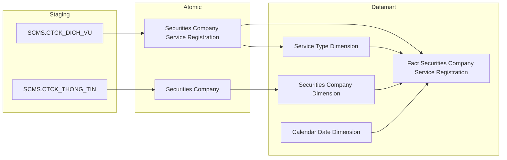

**Mục đích:** Cung cấp dữ liệu cho bảng `Fact Securities Company Service Registration` phục vụ Tab TỔNG QUAN — Nhóm 3 (Dịch vụ CK) và Nhóm 4 (Dịch vụ phái sinh), thể hiện số CTCK theo dịch vụ đã đăng ký (ký quỹ/ứng trước/lưu ký/phái sinh) từ nguồn SCMS.

**Mô tả luồng:**

Staging → Atomic:
- **Securities Company Service Registration:** Bảng lưu lịch sử đăng ký dịch vụ bổ sung của CTCK (pattern Event — 1 dòng per lần đăng ký, scheme SCMS_SERVICE_TYPE) lấy thông tin từ bảng SCMS.CTCK_DICH_VU
- **Securities Company:** Bảng lưu thông tin công ty chứng khoán lấy thông tin từ bảng SCMS.CTCK_THONG_TIN

Atomic → Datamart:
- **Service Type Dimension:** Bảng lưu danh mục dịch vụ CTCK (ký quỹ/ứng trước/lưu ký/phái sinh) theo scheme SCMS_SERVICE_TYPE (SCD2)
- **Securities Company Dimension:** Bảng lưu thông tin công ty chứng khoán phục vụ tra cứu và lọc theo CTCK (SCD2)
- **Calendar Date Dimension:** Bảng lưu thông tin thời gian phục vụ slicer và time-series
- **Fact Securities Company Service Registration:** Bảng sự kiện tổng hợp thông tin đăng ký dịch vụ CTCK — 1 dòng = 1 CTCK × 1 dịch vụ × 1 lần đăng ký, filter IS_DRAFT=false và Service Status=ACTIVE để lấy danh sách hiện tại

---

#### 3.2.7.2.4 Nhóm thông tin Cơ cấu tài chính và Hoạt động tài chính CTCK

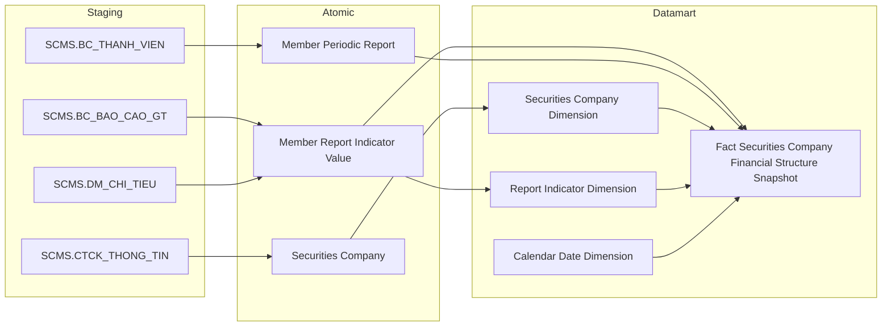

**Mục đích:** Cung cấp dữ liệu cho bảng `Fact Securities Company Financial Structure Snapshot` phục vụ Tab TỔNG QUAN — Nhóm 8 (Cơ cấu tài sản), Nhóm 9 (Cơ cấu nguồn vốn) và Tab GIÁM SÁT — các nhóm GS-1 đến GS-8 (VCSH, vốn đầu tư, doanh thu, lợi nhuận, thị phần môi giới), lưu các chỉ tiêu BCTC định kỳ theo từng CTCK và từng chỉ tiêu.

**Mô tả luồng:**

Staging → Atomic:
- **Member Report Indicator Value:** Bảng lưu giá trị từng chỉ tiêu trong báo cáo tài chính định kỳ (pattern EAV — 1 dòng per chỉ tiêu per kỳ per CTCK) lấy thông tin từ bảng SCMS.BC_BAO_CAO_GT, kết hợp danh mục chỉ tiêu từ bảng SCMS.DM_CHI_TIEU
- **Member Periodic Report:** Bảng lưu thông tin kỳ báo cáo định kỳ (loại kỳ, năm, ngày nộp, hạn nộp) lấy thông tin từ bảng SCMS.BC_THANH_VIEN
- **Securities Company:** Bảng lưu thông tin công ty chứng khoán lấy thông tin từ bảng SCMS.CTCK_THONG_TIN

Atomic → Datamart:
- **Securities Company Dimension:** Bảng lưu thông tin công ty chứng khoán phục vụ tra cứu và lọc theo CTCK (SCD2)
- **Report Indicator Dimension:** Bảng lưu danh mục chỉ tiêu báo cáo — mã, tên, sheet/hàng/cột biểu mẫu (ETL-derived từ Member Report Indicator Value)
- **Calendar Date Dimension:** Bảng lưu thông tin thời gian phục vụ slicer và time-series
- **Fact Securities Company Financial Structure Snapshot:** Bảng sự kiện tổng hợp thông tin chỉ tiêu BCTC — 1 dòng = 1 CTCK × 1 chỉ tiêu × 1 kỳ báo cáo, phục vụ phân tích cơ cấu tài chính và giám sát hoạt động

---

#### 3.2.7.2.5 Nhóm thông tin Tuân thủ nộp báo cáo

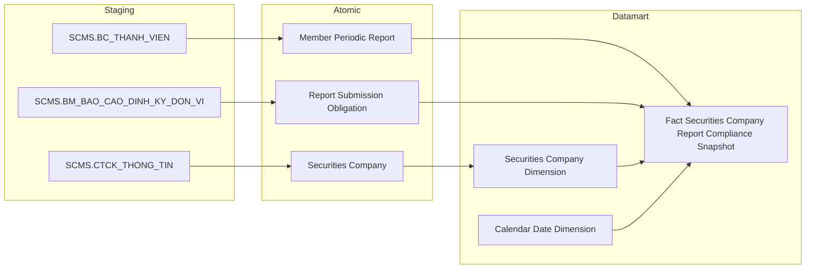

**Mục đích:** Cung cấp dữ liệu cho bảng `Fact Securities Company Report Compliance Snapshot` phục vụ Tab GIÁM SÁT — Sub-tab GIÁM SÁT TUÂN THỦ (Nhóm GS-9), theo dõi số lượng báo cáo đúng hạn/chậm/chưa nộp và tỷ lệ tuân thủ toàn thị trường theo ngày.

**Mô tả luồng:**

Staging → Atomic:
- **Member Periodic Report:** Bảng lưu thông tin báo cáo định kỳ thành viên (loại kỳ, năm, ngày nộp thực tế, hạn nộp, trạng thái nộp) lấy thông tin từ bảng SCMS.BC_THANH_VIEN
- **Securities Company:** Bảng lưu thông tin công ty chứng khoán lấy thông tin từ bảng SCMS.CTCK_THONG_TIN
- **Report Submission Obligation:** Bảng lưu quy định nghĩa vụ nộp báo cáo định kỳ lấy thông tin từ bảng SCMS.BM_BAO_CAO_DINH_KY_DON_VI

Atomic → Datamart:
- **Securities Company Dimension:** Bảng lưu thông tin công ty chứng khoán phục vụ tra cứu và lọc theo CTCK (SCD2)
- **Calendar Date Dimension:** Bảng lưu thông tin thời gian phục vụ slicer và time-series
- **Fact Securities Company Report Compliance Snapshot:** Bảng sự kiện tổng hợp thông tin tuân thủ nộp báo cáo — 1 dòng = 1 CTCK × 1 biểu mẫu × 1 kỳ báo cáo, lưu trạng thái nộp và cờ đúng hạn

---

#### 3.2.7.2.6 Nhóm thông tin Nhân sự cao cấp CTCK

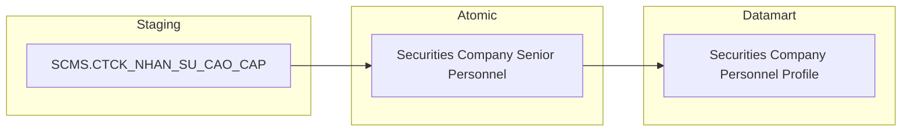

**Mục đích:** Cung cấp dữ liệu cho bảng `Securities Company Personnel Profile` phục vụ Tab HỒ SƠ CTCK 360 — Sub-tab Nhân sự, hiển thị danh sách HĐQT/HĐTV/BKS/BĐH của từng CTCK ở trạng thái mới nhất.

**Mô tả luồng:**

Staging → Atomic:
- **Securities Company Senior Personnel:** Bảng lưu thông tin nhân sự cao cấp CTCK (chức vụ, ngày sinh, giới tính, trạng thái, ngày thôi việc) lấy thông tin từ bảng SCMS.CTCK_NHAN_SU_CAO_CAP

Atomic → Datamart:
- **Securities Company Personnel Profile:** Bảng tác nghiệp lưu danh sách nhân sự cao cấp CTCK ở trạng thái mới nhất, bổ sung CMND/CCCD, email, số điện thoại từ Involved Party

---

#### 3.2.7.2.7 Nhóm thông tin Cổ đông CTCK

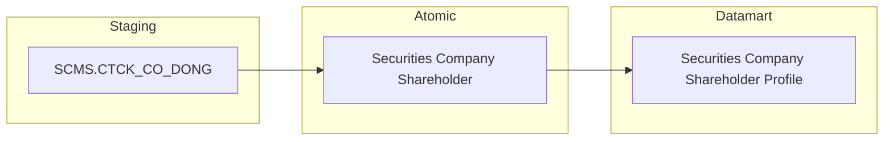

**Mục đích:** Cung cấp dữ liệu cho bảng `Securities Company Shareholder Profile` phục vụ Tab HỒ SƠ CTCK 360 — Sub-tab Nhân sự, hiển thị danh sách cổ đông lớn của từng CTCK ở trạng thái mới nhất.

**Mô tả luồng:**

Staging → Atomic:
- **Securities Company Shareholder:** Bảng lưu thông tin cổ đông CTCK (tên, loại cổ đông, số CP, tỷ lệ sở hữu, số TK GD) lấy thông tin từ bảng SCMS.CTCK_CO_DONG

Atomic → Datamart:
- **Securities Company Shareholder Profile:** Bảng tác nghiệp lưu danh sách cổ đông CTCK ở trạng thái mới nhất, bao gồm tỷ lệ sở hữu và số tài khoản giao dịch

---

#### 3.2.7.2.8 Nhóm thông tin CN, PGD, VPĐD CTCK

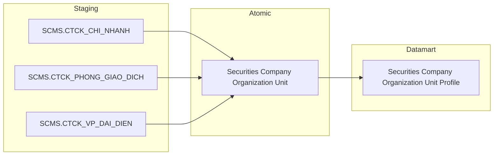

**Mục đích:** Cung cấp dữ liệu cho bảng `Securities Company Organization Unit Profile` phục vụ Tab HỒ SƠ CTCK 360 — Sub-tab CN/PGD/VPĐD, hiển thị mạng lưới đơn vị trực thuộc của từng CTCK ở trạng thái mới nhất.

**Mô tả luồng:**

Staging → Atomic:
- **Securities Company Organization Unit:** Bảng lưu thông tin chi nhánh/phòng giao dịch/văn phòng đại diện CTCK (tên, loại đơn vị, ngày thành lập, trạng thái) lấy thông tin từ bảng SCMS.CTCK_CHI_NHANH, SCMS.CTCK_PHONG_GIAO_DICH, SCMS.CTCK_VP_DAI_DIEN

Atomic → Datamart:
- **Securities Company Organization Unit Profile:** Bảng tác nghiệp lưu danh sách CN/PGD/VPĐD của CTCK ở trạng thái mới nhất, bao gồm địa chỉ và ngày thành lập

---

#### 3.2.7.2.9 Nhóm thông tin Người hành nghề chứng khoán CTCK

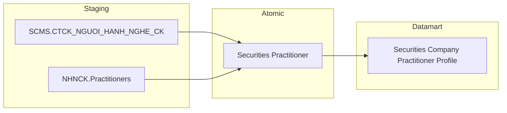

**Mục đích:** Cung cấp dữ liệu cho bảng `Securities Company Practitioner Profile` phục vụ Tab HỒ SƠ CTCK 360 — Sub-tab NHNCK, hiển thị danh sách người hành nghề chứng khoán của từng CTCK ở trạng thái mới nhất.

**Mô tả luồng:**

Staging → Atomic:
- **Securities Practitioner:** Bảng lưu thông tin người hành nghề chứng khoán (mã, tên, trạng thái hành nghề, loại đăng ký, GCN) lấy thông tin từ bảng SCMS.CTCK_NGUOI_HANH_NGHE_CK, kết hợp dữ liệu từ bảng NHNCK.Practitioners

Atomic → Datamart:
- **Securities Company Practitioner Profile:** Bảng tác nghiệp lưu danh sách người hành nghề chứng khoán tại CTCK ở trạng thái mới nhất, bao gồm GCN, chứng chỉ và trạng thái

---

#### 3.2.7.2.10 Nhóm thông tin Lịch sử báo cáo tài chính CTCK

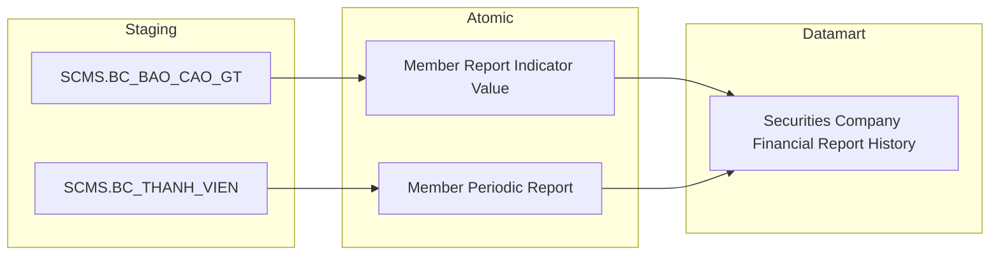

**Mục đích:** Cung cấp dữ liệu cho bảng `Securities Company Financial Report History` phục vụ Tab HỒ SƠ CTCK 360 — Sub-tab Tài chính, hiển thị bảng lịch sử báo cáo tài chính per CTCK per kỳ và tính các thẻ tổng hợp DT YTD, LN YTD, ROA, ROE.

**Mô tả luồng:**

Staging → Atomic:
- **Member Report Indicator Value:** Bảng lưu giá trị từng chỉ tiêu báo cáo tài chính định kỳ (EAV) lấy thông tin từ bảng SCMS.BC_BAO_CAO_GT
- **Member Periodic Report:** Bảng lưu thông tin kỳ báo cáo (biểu mẫu, kỳ, ngày nộp, trạng thái) lấy thông tin từ bảng SCMS.BC_THANH_VIEN

Atomic → Datamart:
- **Securities Company Financial Report History:** Bảng tác nghiệp lưu lịch sử BCTC CTCK — 1 dòng = 1 CTCK × 1 biểu mẫu × 1 kỳ × 1 chỉ tiêu, phục vụ tra cứu và tổng hợp chỉ tiêu tài chính theo kỳ

---

#### 3.2.7.2.11 Nhóm thông tin Tuân thủ và Vi phạm CTCK — Hồ sơ 360

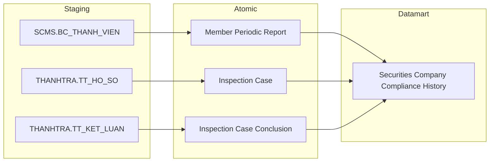

**Mục đích:** Cung cấp dữ liệu cho bảng `Securities Company Compliance History` phục vụ Tab HỒ SƠ CTCK 360 — Sub-tab Tuân thủ, hiển thị danh sách báo cáo tuân thủ (đúng hạn/trễ hạn) và lịch sử thanh tra/xử phạt per CTCK.

**Mô tả luồng:**

Staging → Atomic:
- **Member Periodic Report:** Bảng lưu thông tin báo cáo định kỳ thành viên (trạng thái nộp, ngày nộp, hạn nộp) lấy thông tin từ bảng SCMS.BC_THANH_VIEN
- **Inspection Case:** Bảng lưu hồ sơ thanh tra/kiểm tra CTCK (loại hình, tên hồ sơ, tên tổ chức bị kiểm tra) lấy thông tin từ bảng THANHTRA.TT_HO_SO
- **Inspection Case Conclusion:** Bảng lưu kết luận xử phạt thanh tra (số QĐ, ngày ký, hình thức phạt, số tiền phạt) lấy thông tin từ bảng THANHTRA.TT_KET_LUAN

Atomic → Datamart:
- **Securities Company Compliance History:** Bảng tác nghiệp lưu lịch sử tuân thủ và vi phạm CTCK ở trạng thái mới nhất, kết hợp dữ liệu báo cáo định kỳ và thanh tra/xử phạt

---

#### 3.2.7.2.12 Nhóm thông tin Hồ sơ cá nhân tổng hợp

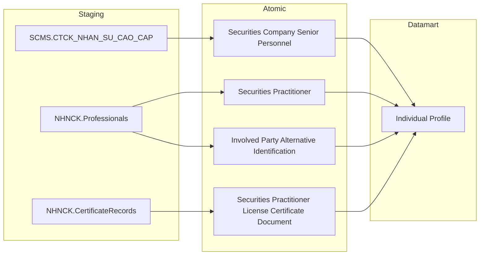

**Mục đích:** Cung cấp dữ liệu cho bảng `Individual Profile` phục vụ Tab TRA CỨU CÁ NHÂN — Landing page (danh sách cá nhân), hiển thị hồ sơ tổng hợp cá nhân (merge SCMS + NHNCK theo CMND/CCCD).

**Mô tả luồng:**

Staging → Atomic:
- **Securities Company Senior Personnel:** Bảng lưu thông tin nhân sự cao cấp CTCK (chức vụ, họ tên, CMND/CCCD, trạng thái) lấy thông tin từ bảng SCMS.CTCK_NHAN_SU_CAO_CAP
- **Securities Practitioner:** Bảng lưu thông tin người hành nghề chứng khoán (họ tên, trạng thái hành nghề) lấy thông tin từ bảng NHNCK.Professionals
- **Involved Party Alternative Identification:** Bảng lưu thông tin định danh thay thế (CMND/CCCD) lấy thông tin từ bảng NHNCK.Professionals
- **Securities Practitioner License Certificate Document:** Bảng lưu giấy chứng nhận hành nghề và chứng chỉ của người hành nghề lấy thông tin từ bảng NHNCK.CertificateRecords

Atomic → Datamart:
- **Individual Profile:** Bảng tác nghiệp lưu hồ sơ cá nhân tổng hợp (merge SCMS + NHNCK theo CMND/CCCD) ở trạng thái mới nhất, bao gồm thông tin định danh, chức vụ, GCN hành nghề

---

#### 3.2.7.2.13 Nhóm thông tin Mạng lưới người liên quan

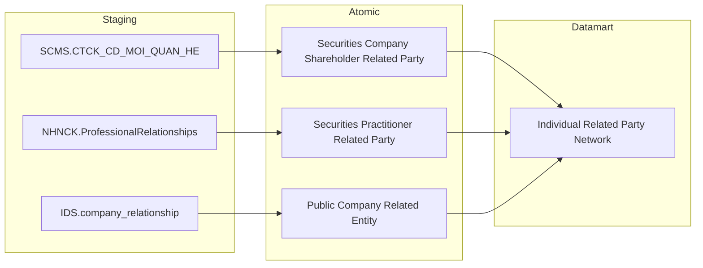

**Mục đích:** Cung cấp dữ liệu cho bảng `Individual Related Party Network` phục vụ Tab TRA CỨU CÁ NHÂN — Sub-tab Mạng lưới 360°, hiển thị mạng lưới người liên quan của cá nhân (gia đình + DN niêm yết nodes).

**Mô tả luồng:**

Staging → Atomic:
- **Securities Company Shareholder Related Party:** Bảng lưu thông tin người có quan hệ với cổ đông CTCK (họ tên, mối quan hệ, số CP, tỷ lệ sở hữu) lấy thông tin từ bảng SCMS.CTCK_CD_MOI_QUAN_HE
- **Securities Practitioner Related Party:** Bảng lưu thông tin người liên quan của người hành nghề chứng khoán lấy thông tin từ bảng NHNCK.ProfessionalRelationships
- **Public Company Related Entity:** Bảng lưu thông tin người liên quan trong DN niêm yết/ĐKGD (vai trò, số CP, tỷ lệ sở hữu) lấy thông tin từ bảng IDS.company_relationship

Atomic → Datamart:
- **Individual Related Party Network:** Bảng tác nghiệp lưu mạng lưới người liên quan của cá nhân (gia đình + DN niêm yết nodes) ở trạng thái mới nhất

---

#### 3.2.7.2.14 Nhóm thông tin Vai trò cá nhân tại DN niêm yết

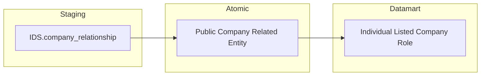

**Mục đích:** Cung cấp dữ liệu cho bảng `Individual Listed Company Role` phục vụ Tab TRA CỨU CÁ NHÂN — Sub-tab Hồ sơ, hiển thị vai trò cá nhân tại các DN niêm yết.

**Mô tả luồng:**

Staging → Atomic:
- **Public Company Related Entity:** Bảng lưu thông tin người liên quan trong DN niêm yết/ĐKGD (mã công ty, vai trò, số CP, tỷ lệ sở hữu, ngày bắt đầu/kết thúc) lấy thông tin từ bảng IDS.company_relationship

Atomic → Datamart:
- **Individual Listed Company Role:** Bảng tác nghiệp lưu vai trò cá nhân tại từng DN niêm yết ở trạng thái mới nhất, bao gồm số CP sở hữu và tỷ lệ sở hữu

---

#### 3.2.7.2.15 Nhóm thông tin Tài khoản giao dịch chứng khoán cá nhân

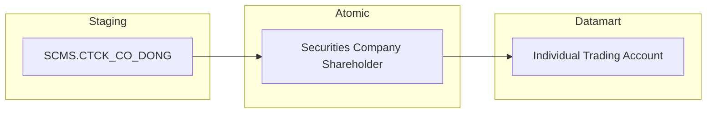

**Mục đích:** Cung cấp dữ liệu cho bảng `Individual Trading Account` phục vụ Tab TRA CỨU CÁ NHÂN — Sub-tab Hồ sơ, hiển thị tài khoản giao dịch chứng khoán của cá nhân mở tại CTCK.

**Mô tả luồng:**

Staging → Atomic:
- **Securities Company Shareholder:** Bảng lưu thông tin cổ đông CTCK (số tài khoản GD, tên cổ đông) lấy thông tin từ bảng SCMS.CTCK_CO_DONG

Atomic → Datamart:
- **Individual Trading Account:** Bảng tác nghiệp lưu tài khoản giao dịch chứng khoán của cá nhân mở tại CTCK ở trạng thái mới nhất

---

#### 3.2.7.2.16 Nhóm thông tin Quá trình hành nghề cá nhân

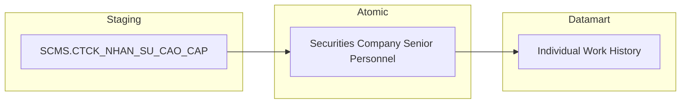

**Mục đích:** Cung cấp dữ liệu cho bảng `Individual Work History` phục vụ Tab TRA CỨU CÁ NHÂN — Sub-tab Quá trình hành nghề, hiển thị timeline công tác của cá nhân tại các CTCK.

**Mô tả luồng:**

Staging → Atomic:
- **Securities Company Senior Personnel:** Bảng lưu thông tin nhân sự cao cấp CTCK (chức vụ, ngày bổ nhiệm, ngày thôi việc) lấy thông tin từ bảng SCMS.CTCK_NHAN_SU_CAO_CAP

Atomic → Datamart:
- **Individual Work History:** Bảng tác nghiệp lưu lịch sử công tác của cá nhân tại CTCK — 1 dòng = 1 cá nhân × 1 lần bổ nhiệm × 1 CTCK

---

#### 3.2.7.2.17 Nhóm thông tin Lịch sử vi phạm cá nhân

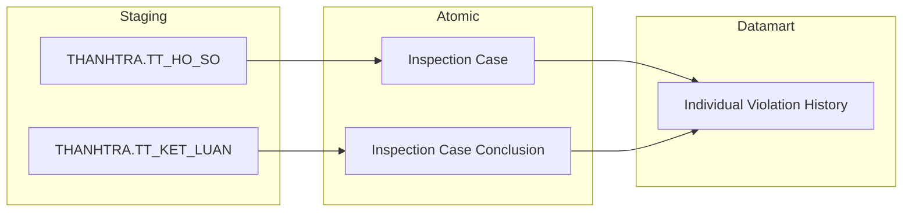

**Mục đích:** Cung cấp dữ liệu cho bảng `Individual Violation History` phục vụ Tab TRA CỨU CÁ NHÂN — Sub-tab Lịch sử vi phạm, hiển thị lịch sử vi phạm và xử phạt của cá nhân.

**Mô tả luồng:**

Staging → Atomic:
- **Inspection Case:** Bảng lưu hồ sơ thanh tra/kiểm tra cá nhân (CMND/CCCD đối tượng, loại hình thanh tra) lấy thông tin từ bảng THANHTRA.TT_HO_SO
- **Inspection Case Conclusion:** Bảng lưu kết luận xử phạt (số QĐ, ngày ký, hành vi vi phạm, hình thức phạt, số tiền phạt) lấy thông tin từ bảng THANHTRA.TT_KET_LUAN

Atomic → Datamart:
- **Individual Violation History:** Bảng tác nghiệp lưu lịch sử vi phạm và xử phạt cá nhân theo hồ sơ thanh tra/kiểm tra

---

#### 3.2.7.2.18 Nhóm thông tin Data Explorer — Báo cáo biểu mẫu định kỳ CTCK

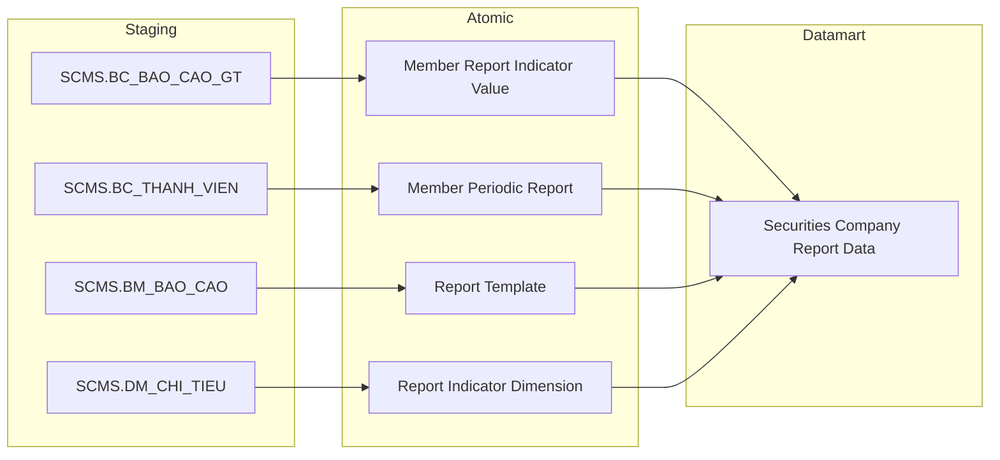

**Mục đích:** Cung cấp dữ liệu cho bảng `Securities Company Report Data` phục vụ Tab DATA EXPLORER, cho phép tra cứu raw data 102 biểu mẫu báo cáo định kỳ của CTCK với đầy đủ context để filter và hiển thị.

**Mô tả luồng:**

Staging → Atomic:
- **Member Report Indicator Value:** Bảng lưu giá trị từng chỉ tiêu trong báo cáo định kỳ (pattern EAV — 1 dòng per chỉ tiêu) lấy thông tin từ bảng SCMS.BC_BAO_CAO_GT
- **Member Periodic Report:** Bảng lưu metadata kỳ báo cáo (CTCK, biểu mẫu, kỳ, ngày nộp) lấy thông tin từ bảng SCMS.BC_THANH_VIEN
- **Report Template:** Bảng lưu thông tin metadata biểu mẫu báo cáo định kỳ lấy thông tin từ bảng SCMS.BM_BAO_CAO
- **Report Indicator Dimension:** Bảng lưu danh mục chỉ tiêu báo cáo (mã chỉ tiêu, tên hàng, tên cột, tên sheet) lấy thông tin từ bảng SCMS.DM_CHI_TIEU

Atomic → Datamart:
- **Securities Company Report Data:** Bảng tác nghiệp lưu báo cáo biểu mẫu định kỳ EAV — 1 dòng = 1 chỉ tiêu × 1 kỳ × 1 CTCK × 1 biểu mẫu, denormalize đầy đủ context (tên hàng, tên cột, tên sheet) để phục vụ Data Explorer
