# 3. KHO DỮ LIỆU (OLAP) — Quản lý kinh doanh

## 3.1 Mô hình dữ liệu mức High Level / Conceptual

### 3.1.1 Sơ đồ ERD

```mermaid
erDiagram
    CALENDAR_DATE_DIMENSION ||--o{ FACT_SECURITIES_COMPANY_STATUS_SNAPSHOT : " "
    SECURITIES_COMPANY_DIMENSION ||--o{ FACT_SECURITIES_COMPANY_STATUS_SNAPSHOT : " "
    CALENDAR_DATE_DIMENSION ||--o{ FACT_SECURITIES_COMPANY_BUSINESS_TYPE_SNAPSHOT : " "
    SECURITIES_COMPANY_DIMENSION ||--o{ FACT_SECURITIES_COMPANY_BUSINESS_TYPE_SNAPSHOT : " "
    BUSINESS_TYPE_DIMENSION ||--o{ FACT_SECURITIES_COMPANY_BUSINESS_TYPE_SNAPSHOT : " "
    CALENDAR_DATE_DIMENSION ||--o{ FACT_SECURITIES_COMPANY_SERVICE_REGISTRATION : " "
    SECURITIES_COMPANY_DIMENSION ||--o{ FACT_SECURITIES_COMPANY_SERVICE_REGISTRATION : " "
    SERVICE_TYPE_DIMENSION ||--o{ FACT_SECURITIES_COMPANY_SERVICE_REGISTRATION : " "
    CALENDAR_DATE_DIMENSION ||--o{ FACT_SECURITIES_COMPANY_FINANCIAL_STRUCTURE_SNAPSHOT : " "
    SECURITIES_COMPANY_DIMENSION ||--o{ FACT_SECURITIES_COMPANY_FINANCIAL_STRUCTURE_SNAPSHOT : " "
    REPORT_INDICATOR_DIMENSION ||--o{ FACT_SECURITIES_COMPANY_FINANCIAL_STRUCTURE_SNAPSHOT : " "
    CALENDAR_DATE_DIMENSION ||--o{ FACT_SECURITIES_COMPANY_REPORT_COMPLIANCE_SNAPSHOT : " "
    SECURITIES_COMPANY_DIMENSION ||--o{ FACT_SECURITIES_COMPANY_REPORT_COMPLIANCE_SNAPSHOT : " "
    SECURITIES_COMPANY_FINANCIAL_REPORT_HISTORY
    SECURITIES_COMPANY_PERSONNEL_PROFILE
    SECURITIES_COMPANY_SHAREHOLDER_PROFILE
    SECURITIES_COMPANY_PRACTITIONER_PROFILE
    SECURITIES_COMPANY_COMPLIANCE_HISTORY
    SECURITIES_COMPANY_ORGANIZATION_UNIT_PROFILE
    INDIVIDUAL_PROFILE
    INDIVIDUAL_RELATED_PARTY_NETWORK
    INDIVIDUAL_LISTED_COMPANY_ROLE
    INDIVIDUAL_TRADING_ACCOUNT
    INDIVIDUAL_WORK_HISTORY
    INDIVIDUAL_VIOLATION_HISTORY
    SECURITIES_COMPANY_REPORT_DATA
```

### 3.1.2 Danh sách thực thể

| STT | Thực thể | Tên bảng | Mô tả |
|---|---|---|---|
| 1 | Calendar Date Dimension | cdr_dt_dim | Lịch ngày — năm/quý/tháng/tuần phục vụ slicer và time-series |
| 2 | Securities Company Dimension | scr_co_dim | CTCK — tên, mã, trạng thái, vốn điều lệ, niêm yết (SCD2) |
| 3 | Business Type Dimension | bsn_tp_dim | Nghiệp vụ CTCK (FIMS_BUSINESS_TYPE) — môi giới/bảo lãnh/tư vấn/tự doanh (SCD2) |
| 4 | Service Type Dimension | svc_tp_dim | Dịch vụ CTCK (SCMS_SERVICE_TYPE) — ký quỹ/ứng trước/lưu ký/phái sinh (SCD2) |
| 5 | Report Indicator Dimension | rpt_ind_dim | Chỉ tiêu báo cáo — mã, tên, hàng/cột/sheet biểu mẫu |
| 6 | Fact Securities Company Status Snapshot | fct_scr_co_st_snpst | Periodic Snapshot tình trạng CTCK — 1 CTCK × 1 ngày |
| 7 | Fact Securities Company Business Type Snapshot | fct_scr_co_bsn_tp_snpst | Periodic Snapshot nghiệp vụ CTCK (FIMS) — 1 CTCK × 1 nghiệp vụ × 1 ngày |
| 8 | Fact Securities Company Service Registration | fct_scr_co_svc_rgst | Event đăng ký dịch vụ CTCK (SCMS) — 1 CTCK × 1 dịch vụ × 1 lần đăng ký |
| 9 | Fact Securities Company Financial Structure Snapshot | fct_scr_co_fnc_stc_snpst | Periodic Snapshot chỉ tiêu BCTC — 1 CTCK × 1 chỉ tiêu × 1 kỳ |
| 10 | Fact Securities Company Report Compliance Snapshot | fct_scr_co_rpt_cmpln_snpst | Periodic Snapshot tuân thủ nộp báo cáo — 1 CTCK × 1 biểu mẫu × 1 kỳ |
| 11 | Securities Company Financial Report History | scr_co_fnc_rpt_hist | Lịch sử BCTC CTCK — 1 CTCK × 1 biểu mẫu × 1 kỳ × 1 chỉ tiêu |
| 12 | Securities Company Personnel Profile | scr_co_psn_prfl | Nhân sự cao cấp CTCK — HĐQT/BĐH/BKS, thông tin cá nhân, email, phone |
| 13 | Securities Company Shareholder Profile | scr_co_shrhlr_prfl | Cổ đông CTCK — tên, tỷ lệ sở hữu, số tài khoản |
| 14 | Securities Company Practitioner Profile | scr_co_practitioner_prfl | Người hành nghề CK tại CTCK — GCN, chứng chỉ, trạng thái |
| 15 | Securities Company Compliance History | scr_co_cmpln_hist | Lịch sử tuân thủ và vi phạm CTCK — BC định kỳ + thanh tra |
| 16 | Securities Company Organization Unit Profile | scr_co_ou_prfl | CN/PGD/VPĐD của CTCK — tên, địa chỉ, ngày thành lập |
| 17 | Individual Profile | idv_prfl | Hồ sơ cá nhân nội bộ/NHN — merge SCMS + NHNCK theo CMND/CCCD |
| 18 | Individual Related Party Network | idv_rel_p_ntw | Mạng lưới người liên quan — gia đình + DN niêm yết nodes |
| 19 | Individual Listed Company Role | idv_list_co_rl | Vai trò cá nhân tại DN niêm yết (IDS) |
| 20 | Individual Trading Account | idv_tdg_ac | Tài khoản giao dịch CK cá nhân mở tại CTCK |
| 21 | Individual Work History | idv_wrk_hist | Lịch sử công tác CTCK — 1 cá nhân × 1 lần bổ nhiệm × 1 CTCK |
| 22 | Individual Violation History | idv_vln_hist | Lịch sử vi phạm và xử phạt cá nhân |
| 23 | Securities Company Report Data | scr_co_rpt_data | Báo cáo biểu mẫu định kỳ EAV — 1 chỉ tiêu × 1 kỳ × 1 CTCK × 1 biểu mẫu |

## 3.2 Mô hình dữ liệu mức Logic

### 3.2.1 Sơ đồ ERD

```mermaid
erDiagram
    CALENDAR_DATE_DIMENSION["Calendar Date Dimension"] {
        string Calendar_Date_Dimension_Id PK
        int Date_Key
        date Full_Date
        int Year
        int Quarter
        int Month
        int Day_Of_Month
        int Day_Of_Week
        int Week_Of_Year
        boolean Is_Weekend
        boolean Is_Holiday
    }
    SECURITIES_COMPANY_DIMENSION["Securities Company Dimension"] {
        string Securities_Company_Dimension_Id PK
        string Securities_Company_Code
        string Securities_Company_Name
        string Securities_Company_Short_Name
        string Company_Status_Code
        string Is_Listed_Indicator
        string Stock_Exchange_Name
        float Charter_Capital_Amount
    }
    BUSINESS_TYPE_DIMENSION["Business Type Dimension"] {
        string Business_Type_Dimension_Id PK
        string Business_Type_Code
        string Business_Type_Name
        string Business_Category_Code
    }
    SERVICE_TYPE_DIMENSION["Service Type Dimension"] {
        string Service_Type_Dimension_Id PK
        string Service_Type_Code
        string Service_Type_Name
        string Service_Category_Code
    }
    REPORT_INDICATOR_DIMENSION["Report Indicator Dimension"] {
        string Report_Indicator_Dimension_Id PK
        string Report_Indicator_Code
        string Report_Template_Code
        string Report_Template_Name
        string Sheet_Name
        string Row_Name
        string Column_Name
    }
    FACT_SECURITIES_COMPANY_STATUS_SNAPSHOT["Fact Securities Company Status Snapshot"] {
        string Snapshot_Date_Dimension_Id FK
        string Securities_Company_Dimension_Id FK
        string Company_Status_Code
        string Is_Listed_Indicator
        float Charter_Capital_Amount
        float Indicator_Value_Amount
        string Report_Indicator_Code
        date Report_Date
    }
    FACT_SECURITIES_COMPANY_BUSINESS_TYPE_SNAPSHOT["Fact Securities Company Business Type Snapshot"] {
        string Snapshot_Date_Dimension_Id FK
        string Securities_Company_Dimension_Id FK
        string Business_Type_Dimension_Id FK
        string Business_Category_Code
    }
    FACT_SECURITIES_COMPANY_SERVICE_REGISTRATION["Fact Securities Company Service Registration"] {
        string Registration_Date_Dimension_Id FK
        string Securities_Company_Dimension_Id FK
        string Service_Type_Dimension_Id FK
        string Service_Status_Code
        string Registration_Document_Number
        date Termination_Date
        date Valid_Document_Date
        string Is_Draft_Indicator
    }
    FACT_SECURITIES_COMPANY_FINANCIAL_STRUCTURE_SNAPSHOT["Fact Securities Company Financial Structure Snapshot"] {
        string Report_Date_Dimension_Id FK
        string Securities_Company_Dimension_Id FK
        string Report_Indicator_Dimension_Id FK
        string Report_Template_Code
        string Report_Period_Type_Code
        float Indicator_Value_Amount
        string Version
    }
    FACT_SECURITIES_COMPANY_REPORT_COMPLIANCE_SNAPSHOT["Fact Securities Company Report Compliance Snapshot"] {
        string Snapshot_Date_Dimension_Id FK
        string Securities_Company_Dimension_Id FK
        string Report_Template_Code
        date Submission_Date
        date Submission_Deadline_Date
        string Submission_Status_Code
        int Report_Period_Year
        string Report_Period_Type_Code
        string Is_On_Time_Indicator
    }
    CALENDAR_DATE_DIMENSION ||--o{ FACT_SECURITIES_COMPANY_STATUS_SNAPSHOT : " "
    SECURITIES_COMPANY_DIMENSION ||--o{ FACT_SECURITIES_COMPANY_STATUS_SNAPSHOT : " "
    CALENDAR_DATE_DIMENSION ||--o{ FACT_SECURITIES_COMPANY_BUSINESS_TYPE_SNAPSHOT : " "
    SECURITIES_COMPANY_DIMENSION ||--o{ FACT_SECURITIES_COMPANY_BUSINESS_TYPE_SNAPSHOT : " "
    BUSINESS_TYPE_DIMENSION ||--o{ FACT_SECURITIES_COMPANY_BUSINESS_TYPE_SNAPSHOT : " "
    CALENDAR_DATE_DIMENSION ||--o{ FACT_SECURITIES_COMPANY_SERVICE_REGISTRATION : " "
    SECURITIES_COMPANY_DIMENSION ||--o{ FACT_SECURITIES_COMPANY_SERVICE_REGISTRATION : " "
    SERVICE_TYPE_DIMENSION ||--o{ FACT_SECURITIES_COMPANY_SERVICE_REGISTRATION : " "
    CALENDAR_DATE_DIMENSION ||--o{ FACT_SECURITIES_COMPANY_FINANCIAL_STRUCTURE_SNAPSHOT : " "
    SECURITIES_COMPANY_DIMENSION ||--o{ FACT_SECURITIES_COMPANY_FINANCIAL_STRUCTURE_SNAPSHOT : " "
    REPORT_INDICATOR_DIMENSION ||--o{ FACT_SECURITIES_COMPANY_FINANCIAL_STRUCTURE_SNAPSHOT : " "
    CALENDAR_DATE_DIMENSION ||--o{ FACT_SECURITIES_COMPANY_REPORT_COMPLIANCE_SNAPSHOT : " "
    SECURITIES_COMPANY_DIMENSION ||--o{ FACT_SECURITIES_COMPANY_REPORT_COMPLIANCE_SNAPSHOT : " "
```

### 3.2.2 Danh sách các bảng và thuộc tính

#### 3.2.2.1 Bảng Calendar Date Dimension

| STT | Tên trường | Kiểu dữ liệu và độ dài | Nullable | Unique | P/F Key | Mặc định | Mô tả |
|---|---|---|---|---|---|---|---|
| 1 | Calendar Date Dimension Id | string | | X | P | | Khóa đại diện |
| 2 | Date Key | int | | | | | Ngày dạng số YYYYMMDD |
| 3 | Full Date | date | | | | | Ngày đầy đủ |
| 4 | Year | int | | | | | Năm |
| 5 | Quarter | int | | | | | Quý |
| 6 | Month | int | | | | | Tháng |
| 7 | Day Of Month | int | | | | | Ngày trong tháng |
| 8 | Day Of Week | int | | | | | Ngày trong tuần |
| 9 | Week Of Year | int | | | | | Tuần trong năm |
| 10 | Is Weekend | boolean | X | | | | Cờ cuối tuần |
| 11 | Is Holiday | boolean | X | | | | Cờ ngày lễ |
| 12 | Population Date | timestamp | X | | | | Thời điểm ETL nạp dữ liệu |

#### 3.2.2.2 Bảng Securities Company Dimension

| STT | Tên trường | Kiểu dữ liệu và độ dài | Nullable | Unique | P/F Key | Mặc định | Mô tả |
|---|---|---|---|---|---|---|---|
| 1 | Securities Company Dimension Id | string | | X | P | | Khóa đại diện |
| 2 | Securities Company Code | string | | | | | Mã CTCK |
| 3 | Securities Company Name | string | X | | | | Tên đầy đủ |
| 4 | Securities Company Short Name | string | X | | | | Tên viết tắt |
| 5 | Company Status Code | string | X | | | | Trạng thái CTCK |
| 6 | Is Listed Indicator | string | X | | | | Cờ niêm yết |
| 7 | Stock Exchange Name | string | X | | | | Tên sàn niêm yết |
| 8 | Charter Capital Amount | decimal(23,2) | X | | | | Vốn điều lệ |
| 9 | Population Date | timestamp | X | | | | Thời điểm ETL nạp dữ liệu |

#### 3.2.2.3 Bảng Business Type Dimension

| STT | Tên trường | Kiểu dữ liệu và độ dài | Nullable | Unique | P/F Key | Mặc định | Mô tả |
|---|---|---|---|---|---|---|---|
| 1 | Business Type Dimension Id | string | | X | P | | Khóa đại diện |
| 2 | Business Type Code | string | | | | | Mã nghiệp vụ |
| 3 | Business Type Name | string | X | | | | Tên nghiệp vụ |
| 4 | Business Category Code | string | X | | | | Mã nhóm nghiệp vụ |
| 5 | Population Date | timestamp | X | | | | Thời điểm ETL nạp dữ liệu |

#### 3.2.2.4 Bảng Service Type Dimension

| STT | Tên trường | Kiểu dữ liệu và độ dài | Nullable | Unique | P/F Key | Mặc định | Mô tả |
|---|---|---|---|---|---|---|---|
| 1 | Service Type Dimension Id | string | | X | P | | Khóa đại diện |
| 2 | Service Type Code | string | | | | | Mã dịch vụ |
| 3 | Service Type Name | string | X | | | | Tên dịch vụ |
| 4 | Service Category Code | string | X | | | | Mã nhóm dịch vụ |
| 5 | Population Date | timestamp | X | | | | Thời điểm ETL nạp dữ liệu |

#### 3.2.2.5 Bảng Report Indicator Dimension

| STT | Tên trường | Kiểu dữ liệu và độ dài | Nullable | Unique | P/F Key | Mặc định | Mô tả |
|---|---|---|---|---|---|---|---|
| 1 | Report Indicator Dimension Id | string | | X | P | | Khóa đại diện |
| 2 | Report Indicator Code | string | | | | | Mã chỉ tiêu |
| 3 | Report Template Code | string | X | | | | Mã biểu mẫu |
| 4 | Report Template Name | string | X | | | | Tên biểu mẫu |
| 5 | Sheet Name | string | X | | | | Tên sheet |
| 6 | Row Name | string | X | | | | Tên hàng |
| 7 | Column Name | string | X | | | | Tên cột |
| 8 | Population Date | timestamp | X | | | | Thời điểm ETL nạp dữ liệu |

#### 3.2.2.6 Bảng Fact Securities Company Status Snapshot

| STT | Tên trường | Kiểu dữ liệu và độ dài | Nullable | Unique | P/F Key | Mặc định | Mô tả |
|---|---|---|---|---|---|---|---|
| 1 | Snapshot Date Dimension Id | string | | | F | | FK đến Calendar Date Dimension |
| 2 | Securities Company Dimension Id | string | | | F | | FK đến Securities Company Dimension |
| 3 | Company Status Code | string | X | | | | Trạng thái CTCK |
| 4 | Is Listed Indicator | string | X | | | | Cờ niêm yết |
| 5 | Charter Capital Amount | decimal(23,2) | X | | | | Vốn điều lệ |
| 6 | Indicator Value Amount | decimal(23,2) | X | | | | Giá trị chỉ tiêu |
| 7 | Report Indicator Code | string | X | | | | Mã chỉ tiêu |
| 8 | Report Date | date | X | | | | Ngày số liệu báo cáo |
| 9 | Population Date | timestamp | X | | | | Thời điểm ETL nạp dữ liệu |

#### 3.2.2.7 Bảng Fact Securities Company Business Type Snapshot

| STT | Tên trường | Kiểu dữ liệu và độ dài | Nullable | Unique | P/F Key | Mặc định | Mô tả |
|---|---|---|---|---|---|---|---|
| 1 | Snapshot Date Dimension Id | string | | | F | | FK đến Calendar Date Dimension |
| 2 | Securities Company Dimension Id | string | | | F | | FK đến Securities Company Dimension |
| 3 | Business Type Dimension Id | string | | | F | | FK đến Business Type Dimension |
| 4 | Business Category Code | string | X | | | | Mã nhóm nghiệp vụ |
| 5 | Population Date | timestamp | X | | | | Thời điểm ETL nạp dữ liệu |

#### 3.2.2.8 Bảng Fact Securities Company Service Registration

| STT | Tên trường | Kiểu dữ liệu và độ dài | Nullable | Unique | P/F Key | Mặc định | Mô tả |
|---|---|---|---|---|---|---|---|
| 1 | Registration Date Dimension Id | string | | | F | | FK đến Calendar Date Dimension |
| 2 | Securities Company Dimension Id | string | | | F | | FK đến Securities Company Dimension |
| 3 | Service Type Dimension Id | string | | | F | | FK đến Service Type Dimension |
| 4 | Service Status Code | string | X | | | | Trạng thái dịch vụ |
| 5 | Registration Document Number | string | X | | | | Số văn bản đăng ký |
| 6 | Termination Date | date | X | | | | Ngày chấm dứt |
| 7 | Valid Document Date | date | X | | | | Ngày hồ sơ hợp lệ |
| 8 | Is Draft Indicator | string | X | | | | Cờ bản tạm |
| 9 | Population Date | timestamp | X | | | | Thời điểm ETL nạp dữ liệu |

#### 3.2.2.9 Bảng Fact Securities Company Financial Structure Snapshot

| STT | Tên trường | Kiểu dữ liệu và độ dài | Nullable | Unique | P/F Key | Mặc định | Mô tả |
|---|---|---|---|---|---|---|---|
| 1 | Report Date Dimension Id | string | | | F | | FK đến Calendar Date Dimension |
| 2 | Securities Company Dimension Id | string | | | F | | FK đến Securities Company Dimension |
| 3 | Report Indicator Dimension Id | string | | | F | | FK đến Report Indicator Dimension |
| 4 | Report Template Code | string | X | | | | Mã biểu mẫu |
| 5 | Report Period Type Code | string | X | | | | Kỳ báo cáo |
| 6 | Indicator Value Amount | decimal(23,2) | X | | | | Giá trị chỉ tiêu |
| 7 | Version | string | X | | | | Phiên bản báo cáo |
| 8 | Population Date | timestamp | X | | | | Thời điểm ETL nạp dữ liệu |

#### 3.2.2.10 Bảng Fact Securities Company Report Compliance Snapshot

| STT | Tên trường | Kiểu dữ liệu và độ dài | Nullable | Unique | P/F Key | Mặc định | Mô tả |
|---|---|---|---|---|---|---|---|
| 1 | Snapshot Date Dimension Id | string | | | F | | FK đến Calendar Date Dimension |
| 2 | Securities Company Dimension Id | string | | | F | | FK đến Securities Company Dimension |
| 3 | Report Template Code | string | X | | | | Mã biểu mẫu |
| 4 | Submission Date | date | X | | | | Ngày nộp thực tế |
| 5 | Submission Deadline Date | date | X | | | | Hạn nộp |
| 6 | Submission Status Code | string | X | | | | Trạng thái nộp |
| 7 | Report Period Year | int | X | | | | Năm kỳ báo cáo |
| 8 | Report Period Type Code | string | X | | | | Kỳ báo cáo |
| 9 | Is On Time Indicator | string | X | | | | Cờ nộp đúng hạn |
| 10 | Population Date | timestamp | X | | | | Thời điểm ETL nạp dữ liệu |

#### 3.2.2.11 Bảng Securities Company Financial Report History

| STT | Tên trường | Kiểu dữ liệu và độ dài | Nullable | Unique | P/F Key | Mặc định | Mô tả |
|---|---|---|---|---|---|---|---|
| 1 | Financial Report History Id | string | | X | P | | Khóa đại diện |
| 2 | Securities Company Code | string | | | | | Mã CTCK |
| 3 | Report Template Code | string | | | | | Mã biểu mẫu báo cáo |
| 4 | Report Period Year | int | | | | | Năm kỳ báo cáo |
| 5 | Report Period Type Code | string | | | | | Kỳ báo cáo |
| 6 | Report Date | date | X | | | | Ngày số liệu báo cáo |
| 7 | Submission Date | date | X | | | | Ngày nộp thực tế |
| 8 | Submission Deadline Date | date | X | | | | Hạn nộp |
| 9 | Submission Status Code | string | X | | | | Trạng thái nộp |
| 10 | Indicator Value Amount | decimal(23,2) | X | | | | Giá trị chỉ tiêu BCTC |
| 11 | Report Indicator Code | string | X | | | | Mã chỉ tiêu |
| 12 | Row Name | string | X | | | | Tên hàng chỉ tiêu |
| 13 | Population Date | timestamp | X | | | | Thời điểm ETL nạp dữ liệu |

#### 3.2.2.12 Bảng Securities Company Personnel Profile

| STT | Tên trường | Kiểu dữ liệu và độ dài | Nullable | Unique | P/F Key | Mặc định | Mô tả |
|---|---|---|---|---|---|---|---|
| 1 | Personnel Profile Id | string | | X | P | | Khóa đại diện |
| 2 | Securities Company Senior Personnel Code | string | | | | | Mã nhân sự cao cấp |
| 3 | Securities Company Code | string | | | | | Mã CTCK |
| 4 | Full Name | string | | | | | Họ tên nhân sự |
| 5 | Position Type Code | string | X | | | | Chức vụ |
| 6 | Date Of Birth | date | X | | | | Ngày sinh |
| 7 | Individual Gender Code | string | X | | | | Giới tính |
| 8 | Identification Number | string | X | | | | CMND/CCCD |
| 9 | Email Address | string | X | | | | Email nhân sự cao cấp |
| 10 | Phone Number | string | X | | | | Điện thoại nhân sự cao cấp |
| 11 | Personnel Status Code | string | X | | | | Trạng thái nhân sự |
| 12 | Created Timestamp | timestamp | X | | | | Ngày tạo bản ghi |
| 13 | Resignation Date | date | X | | | | Ngày thôi việc |
| 14 | Population Date | timestamp | X | | | | Thời điểm ETL nạp dữ liệu |

#### 3.2.2.13 Bảng Securities Company Shareholder Profile

| STT | Tên trường | Kiểu dữ liệu và độ dài | Nullable | Unique | P/F Key | Mặc định | Mô tả |
|---|---|---|---|---|---|---|---|
| 1 | Shareholder Profile Id | string | | X | P | | Khóa đại diện |
| 2 | Securities Company Shareholder Code | string | | | | | Mã cổ đông |
| 3 | Securities Company Code | string | | | | | Mã CTCK |
| 4 | Shareholder Name | string | | | | | Tên cổ đông |
| 5 | Is Individual Indicator | string | X | | | | Cổ đông cá nhân hay tổ chức |
| 6 | Shareholder Type Code | string | X | | | | Loại cổ đông |
| 7 | Share Quantity | int | X | | | | Số CP nắm giữ tại CTCK |
| 8 | Share Ratio | decimal(5,2) | X | | | | Tỷ lệ sở hữu CP |
| 9 | Identification Number | string | X | | | | CMND/CCCD cổ đông |
| 10 | Job Position Name | string | X | | | | Chức vụ cổ đông tại nơi khác |
| 11 | Workplace Name | string | X | | | | Nơi làm việc của cổ đông |
| 12 | Trading Account Number | string | X | | | | Số TK giao dịch tại CTCK |
| 13 | Shareholder Status Code | string | X | | | | Trạng thái cổ đông |
| 14 | Population Date | timestamp | X | | | | Thời điểm ETL nạp dữ liệu |

#### 3.2.2.14 Bảng Securities Company Practitioner Profile

| STT | Tên trường | Kiểu dữ liệu và độ dài | Nullable | Unique | P/F Key | Mặc định | Mô tả |
|---|---|---|---|---|---|---|---|
| 1 | Practitioner Profile Id | string | | X | P | | Khóa đại diện |
| 2 | Practitioner Code | string | | | | | Mã người hành nghề |
| 3 | Securities Company Code | string | | | | | Mã CTCK |
| 4 | Full Name | string | | | | | Họ tên NHN |
| 5 | Identity Reference Code | string | X | | | | CMND/CCCD NHN |
| 6 | Practice Status Code | string | X | | | | Trạng thái hành nghề |
| 7 | Practitioner Registration Type Code | string | X | | | | Loại đăng ký hành nghề |
| 8 | License Certificate Number | string | X | | | | Số GCN hành nghề |
| 9 | Certificate Type Code | string | X | | | | Loại chứng chỉ/nghiệp vụ |
| 10 | Certificate Status Code | string | X | | | | Trạng thái GCN |
| 11 | Population Date | timestamp | X | | | | Thời điểm ETL nạp dữ liệu |

#### 3.2.2.15 Bảng Securities Company Compliance History

| STT | Tên trường | Kiểu dữ liệu và độ dài | Nullable | Unique | P/F Key | Mặc định | Mô tả |
|---|---|---|---|---|---|---|---|
| 1 | Compliance History Id | string | | X | P | | Khóa đại diện |
| 2 | Securities Company Code | string | | | | | Mã CTCK |
| 3 | Report Template Code | string | | | | | Mã biểu mẫu |
| 4 | Report Period Year | int | | | | | Năm kỳ |
| 5 | Submission Date | date | X | | | | Ngày nộp thực tế |
| 6 | Submission Deadline Date | date | X | | | | Hạn nộp |
| 7 | Submission Status Code | string | X | | | | Trạng thái nộp |
| 8 | Subject Organization Short Name | string | X | | | | Tên viết tắt CTCK từ Inspection Case |
| 9 | Inspection Type Code | string | X | | | | Loại hình thanh/kiểm tra |
| 10 | Case Name | string | X | | | | Tên hồ sơ thanh tra/kiểm tra |
| 11 | Conclusion Document Number | string | X | | | | Số QĐ kết luận xử phạt |
| 12 | Signing Date | date | X | | | | Ngày ký kết luận |
| 13 | Penalty Type Code | string | X | | | | Hình thức xử phạt |
| 14 | Penalty Amount | decimal(23,2) | X | | | | Số tiền phạt |
| 15 | Conclusion Status Code | string | X | | | | Trạng thái kết luận |
| 16 | Population Date | timestamp | X | | | | Thời điểm ETL nạp dữ liệu |

#### 3.2.2.16 Bảng Securities Company Organization Unit Profile

| STT | Tên trường | Kiểu dữ liệu và độ dài | Nullable | Unique | P/F Key | Mặc định | Mô tả |
|---|---|---|---|---|---|---|---|
| 1 | Organization Unit Profile Id | string | | X | P | | Khóa đại diện |
| 2 | Securities Company Organization Unit Code | string | | | | | Mã đơn vị trực thuộc |
| 3 | Securities Company Code | string | | | | | Mã CTCK |
| 4 | Organization Unit Name | string | | | | | Tên CN/PGD/VPĐD |
| 5 | Organization Unit Type Code | string | | | | | Loại đơn vị |
| 6 | Address | string | X | | | | Địa chỉ |
| 7 | Established Date | date | X | | | | Ngày thành lập/khai trương |
| 8 | Life Cycle Status Code | string | X | | | | Trạng thái |
| 9 | Business Sector Name | string | X | | | | Tên lĩnh vực nghiệp vụ |
| 10 | Population Date | timestamp | X | | | | Thời điểm ETL nạp dữ liệu |

#### 3.2.2.17 Bảng Individual Profile

| STT | Tên trường | Kiểu dữ liệu và độ dài | Nullable | Unique | P/F Key | Mặc định | Mô tả |
|---|---|---|---|---|---|---|---|
| 1 | Individual Profile Id | string | | X | P | | Khóa đại diện |
| 2 | Securities Company Senior Personnel Code | string | | | | | Mã nhân sự (merge SCMS + NHNCK) |
| 3 | Practitioner Id | string | X | | | | Mã người hành nghề phía NHNCK |
| 4 | Securities Company Code | string | | | | | Mã CTCK |
| 5 | Full Name | string | | | | | Họ tên cá nhân |
| 6 | Position Type Code | string | X | | | | Chức vụ tại CTCK |
| 7 | Identification Number | string | X | | | | CMND/CCCD |
| 8 | License Certificate Number | string | X | | | | Số GCN hành nghề |
| 9 | Certificate Type Code | string | X | | | | Loại chứng chỉ/nghiệp vụ |
| 10 | Is Insider Verified | string | X | | | | Cờ khớp SCMS + NHNCK theo CMND/CCCD |
| 11 | Personnel Status Code | string | X | | | | Trạng thái nhân sự |
| 12 | Practice Status Code | string | X | | | | Trạng thái hành nghề |
| 13 | Population Date | timestamp | X | | | | Thời điểm ETL nạp dữ liệu |

#### 3.2.2.18 Bảng Individual Related Party Network

| STT | Tên trường | Kiểu dữ liệu và độ dài | Nullable | Unique | P/F Key | Mặc định | Mô tả |
|---|---|---|---|---|---|---|---|
| 1 | Related Party Network Id | string | | X | P | | Khóa đại diện |
| 2 | Individual Profile Id | string | | | | | FK đến Individual Profile |
| 3 | Related Party Full Name | string | | | | | Tên người liên quan |
| 4 | Relationship Type Code | string | X | | | | Mối quan hệ |
| 5 | Related Party Identity Reference Code | string | X | | | | CMND/CCCD người liên quan |
| 6 | Related Party Job Position Name | string | X | | | | Chức vụ/nghề nghiệp người liên quan |
| 7 | Share Quantity | int | X | | | | Số CP người liên quan nắm giữ |
| 8 | Share Ratio | decimal(5,2) | X | | | | Tỷ lệ sở hữu |
| 9 | Source System Code | string | | | | | Hệ thống nguồn |
| 10 | Public Company Code | string | X | | | | Mã DN niêm yết node |
| 11 | Public Company Name | string | X | | | | Tên DN niêm yết node |
| 12 | Population Date | timestamp | X | | | | Thời điểm ETL nạp dữ liệu |

#### 3.2.2.19 Bảng Individual Listed Company Role

| STT | Tên trường | Kiểu dữ liệu và độ dài | Nullable | Unique | P/F Key | Mặc định | Mô tả |
|---|---|---|---|---|---|---|---|
| 1 | Listed Company Role Id | string | | X | P | | Khóa đại diện |
| 2 | Individual Profile Id | string | | | | | FK đến Individual Profile |
| 3 | Public Company Code | string | | | | | Mã DN niêm yết/ĐKGD |
| 4 | Relationship Type Code | string | X | | | | Vai trò tại DN niêm yết |
| 5 | Related Entity Name | string | X | | | | Tên người liên quan trong IDS |
| 6 | Owned Share Quantity | int | X | | | | Số CP sở hữu tại DN niêm yết |
| 7 | Ownership Ratio | decimal(5,2) | X | | | | Tỷ lệ sở hữu tại DN niêm yết |
| 8 | Effective From Date | date | X | | | | Ngày bắt đầu vai trò |
| 9 | Effective To Date | date | X | | | | Ngày kết thúc vai trò |
| 10 | Life Cycle Status Code | string | X | | | | Trạng thái vai trò |
| 11 | Population Date | timestamp | X | | | | Thời điểm ETL nạp dữ liệu |

#### 3.2.2.20 Bảng Individual Trading Account

| STT | Tên trường | Kiểu dữ liệu và độ dài | Nullable | Unique | P/F Key | Mặc định | Mô tả |
|---|---|---|---|---|---|---|---|
| 1 | Trading Account Id | string | | X | P | | Khóa đại diện |
| 2 | Individual Profile Id | string | | | | | FK đến Individual Profile |
| 3 | Securities Company Shareholder Id | string | | | | | Mã surrogate cổ đông phía Atomic |
| 4 | Securities Company Code | string | | | | | Mã CTCK nơi mở TK |
| 5 | Trading Account Number | string | | | | | Số tài khoản giao dịch CK |
| 6 | Shareholder Name | string | X | | | | Tên chủ tài khoản |
| 7 | Population Date | timestamp | X | | | | Thời điểm ETL nạp dữ liệu |

#### 3.2.2.21 Bảng Individual Work History

| STT | Tên trường | Kiểu dữ liệu và độ dài | Nullable | Unique | P/F Key | Mặc định | Mô tả |
|---|---|---|---|---|---|---|---|
| 1 | Work History Id | string | | X | P | | Khóa đại diện |
| 2 | Individual Profile Id | string | | | | | FK đến Individual Profile |
| 3 | Securities Company Senior Personnel Id | string | | | | | Mã surrogate nhân sự phía Atomic |
| 4 | Securities Company Code | string | | | | | Mã CTCK công tác |
| 5 | Position Type Code | string | | | | | Chức vụ |
| 6 | Employment Start Date | date | X | | | | Ngày bắt đầu công tác |
| 7 | Resignation Date | date | X | | | | Ngày thôi việc |
| 8 | Is Current Indicator | string | X | | | | Cờ đang công tác |
| 9 | Population Date | timestamp | X | | | | Thời điểm ETL nạp dữ liệu |

#### 3.2.2.22 Bảng Individual Violation History

| STT | Tên trường | Kiểu dữ liệu và độ dài | Nullable | Unique | P/F Key | Mặc định | Mô tả |
|---|---|---|---|---|---|---|---|
| 1 | Violation History Id | string | | X | P | | Khóa đại diện |
| 2 | Individual Profile Id | string | | | | | FK đến Individual Profile |
| 3 | Inspection Case Code | string | | | | | Mã hồ sơ thanh tra/kiểm tra |
| 4 | Subject Id Number | string | X | | | | CMND/CCCD đối tượng vi phạm |
| 5 | Subject Full Name | string | X | | | | Họ tên đối tượng vi phạm |
| 6 | Inspection Type Code | string | X | | | | Loại hình thanh/kiểm tra |
| 7 | Case Name | string | X | | | | Tên hồ sơ |
| 8 | Signing Date | date | X | | | | Ngày ký kết luận xử phạt |
| 9 | Conclusion Document Number | string | X | | | | Số QĐ xử phạt |
| 10 | Conclusion Summary | string | X | | | | Nội dung kết luận vi phạm |
| 11 | Violation Type Code | string | X | | | | Hành vi vi phạm |
| 12 | Penalty Type Code | string | X | | | | Hình thức xử phạt |
| 13 | Penalty Amount | decimal(23,2) | X | | | | Số tiền phạt |
| 14 | Conclusion Status Code | string | X | | | | Trạng thái kết luận |
| 15 | Population Date | timestamp | X | | | | Thời điểm ETL nạp dữ liệu |

#### 3.2.2.23 Bảng Securities Company Report Data

| STT | Tên trường | Kiểu dữ liệu và độ dài | Nullable | Unique | P/F Key | Mặc định | Mô tả |
|---|---|---|---|---|---|---|---|
| 1 | Report Data Id | string | | X | P | | Khóa đại diện |
| 2 | Member Periodic Report Code | string | | | | | Mã báo cáo định kỳ |
| 3 | Securities Company Code | string | | | | | Mã CTCK |
| 4 | Report Template Code | string | | | | | Mã biểu mẫu báo cáo |
| 5 | Report Type Code | string | X | | | | Loại báo cáo |
| 6 | Report Period Type Code | string | X | | | | Kỳ báo cáo |
| 7 | Year Value | string | X | | | | Năm kỳ báo cáo |
| 8 | Report Date | date | X | | | | Ngày số liệu báo cáo |
| 9 | Submission Date | date | X | | | | Ngày nộp thực tế |
| 10 | Submission Deadline Date | date | X | | | | Hạn nộp |
| 11 | Report Indicator Code | string | | | | | Mã chỉ tiêu danh mục |
| 12 | Report Template Indicator Code | string | X | | | | Mã chỉ tiêu trong biểu mẫu |
| 13 | Row Name | string | X | | | | Tên hàng chỉ tiêu |
| 14 | Column Name | string | X | | | | Tên cột chỉ tiêu |
| 15 | Sheet Name | string | X | | | | Tên sheet báo cáo |
| 16 | Value | string | X | | | | Giá trị chỉ tiêu |
| 17 | Row Sequence | int | X | | | | Số thứ tự dòng |
| 18 | Version | string | X | | | | Phiên bản báo cáo |
| 19 | Population Date | timestamp | X | | | | Thời điểm ETL nạp dữ liệu |

## 3.3 Mô hình dữ liệu mức vật lý

### 3.3.1 Sơ đồ ERD

```mermaid
erDiagram
    CALENDAR_DATE_DIMENSION["cdr_dt_dim"] {
        string cdr_dt_dim_id PK
        int dt_key
        date full_dt
        int yr
        int qtr
        int mo
        int day_of_mo
        int day_of_wk
        int wk_of_yr
        string is_weekend
        string is_hol
    }
    SECURITIES_COMPANY_DIMENSION["scr_co_dim"] {
        string scr_co_dim_id PK
        string scr_co_code
        string scr_co_nm
        string scr_co_shrt_nm
        string co_st_code
        string is_list_ind
        string stk_exg_nm
        float charter_cptl_amt
    }
    BUSINESS_TYPE_DIMENSION["bsn_tp_dim"] {
        string bsn_tp_dim_id PK
        string bsn_tp_code
        string bsn_tp_nm
        string bsn_cgy_code
    }
    SERVICE_TYPE_DIMENSION["svc_tp_dim"] {
        string svc_tp_dim_id PK
        string svc_tp_code
        string svc_tp_nm
        string svc_cgy_code
    }
    REPORT_INDICATOR_DIMENSION["rpt_ind_dim"] {
        string rpt_ind_dim_id PK
        string rpt_ind_code
        string rpt_tpl_code
        string rpt_tpl_nm
        string shet_nm
        string row_nm
        string clmn_nm
    }
    FACT_SECURITIES_COMPANY_STATUS_SNAPSHOT["fct_scr_co_st_snpst"] {
        string snpst_dt_dim_id FK
        string scr_co_dim_id FK
        string co_st_code
        string is_list_ind
        float charter_cptl_amt
        float ind_val_amt
        string rpt_ind_code
        date rpt_dt
    }
    FACT_SECURITIES_COMPANY_BUSINESS_TYPE_SNAPSHOT["fct_scr_co_bsn_tp_snpst"] {
        string snpst_dt_dim_id FK
        string scr_co_dim_id FK
        string bsn_tp_dim_id FK
        string bsn_cgy_code
    }
    FACT_SECURITIES_COMPANY_SERVICE_REGISTRATION["fct_scr_co_svc_rgst"] {
        string rgst_dt_dim_id FK
        string scr_co_dim_id FK
        string svc_tp_dim_id FK
        string svc_st_code
        string rgst_doc_nbr
        date tmt_dt
        date vld_doc_dt
        string is_drft_ind
    }
    FACT_SECURITIES_COMPANY_FINANCIAL_STRUCTURE_SNAPSHOT["fct_scr_co_fnc_stc_snpst"] {
        string rpt_dt_dim_id FK
        string scr_co_dim_id FK
        string rpt_ind_dim_id FK
        string rpt_tpl_code
        string rpt_prd_tp_code
        float ind_val_amt
        string vrsn
    }
    FACT_SECURITIES_COMPANY_REPORT_COMPLIANCE_SNAPSHOT["fct_scr_co_rpt_cmpln_snpst"] {
        string snpst_dt_dim_id FK
        string scr_co_dim_id FK
        string rpt_tpl_code
        date submission_dt
        date submission_ddln_dt
        string submission_st_code
        int rpt_prd_yr
        string rpt_prd_tp_code
        string is_on_tm_ind
    }
    SECURITIES_COMPANY_FINANCIAL_REPORT_HISTORY["scr_co_fnc_rpt_hist"]
    SECURITIES_COMPANY_PERSONNEL_PROFILE["scr_co_psn_prfl"]
    SECURITIES_COMPANY_SHAREHOLDER_PROFILE["scr_co_shrhlr_prfl"]
    SECURITIES_COMPANY_PRACTITIONER_PROFILE["scr_co_practitioner_prfl"]
    SECURITIES_COMPANY_COMPLIANCE_HISTORY["scr_co_cmpln_hist"]
    SECURITIES_COMPANY_ORGANIZATION_UNIT_PROFILE["scr_co_ou_prfl"]
    INDIVIDUAL_PROFILE["idv_prfl"]
    INDIVIDUAL_RELATED_PARTY_NETWORK["idv_rel_p_ntw"]
    INDIVIDUAL_LISTED_COMPANY_ROLE["idv_list_co_rl"]
    INDIVIDUAL_TRADING_ACCOUNT["idv_tdg_ac"]
    INDIVIDUAL_WORK_HISTORY["idv_wrk_hist"]
    INDIVIDUAL_VIOLATION_HISTORY["idv_vln_hist"]
    SECURITIES_COMPANY_REPORT_DATA["scr_co_rpt_data"]
    CALENDAR_DATE_DIMENSION ||--o{ FACT_SECURITIES_COMPANY_STATUS_SNAPSHOT : " "
    SECURITIES_COMPANY_DIMENSION ||--o{ FACT_SECURITIES_COMPANY_STATUS_SNAPSHOT : " "
    CALENDAR_DATE_DIMENSION ||--o{ FACT_SECURITIES_COMPANY_BUSINESS_TYPE_SNAPSHOT : " "
    SECURITIES_COMPANY_DIMENSION ||--o{ FACT_SECURITIES_COMPANY_BUSINESS_TYPE_SNAPSHOT : " "
    BUSINESS_TYPE_DIMENSION ||--o{ FACT_SECURITIES_COMPANY_BUSINESS_TYPE_SNAPSHOT : " "
    CALENDAR_DATE_DIMENSION ||--o{ FACT_SECURITIES_COMPANY_SERVICE_REGISTRATION : " "
    SECURITIES_COMPANY_DIMENSION ||--o{ FACT_SECURITIES_COMPANY_SERVICE_REGISTRATION : " "
    SERVICE_TYPE_DIMENSION ||--o{ FACT_SECURITIES_COMPANY_SERVICE_REGISTRATION : " "
    CALENDAR_DATE_DIMENSION ||--o{ FACT_SECURITIES_COMPANY_FINANCIAL_STRUCTURE_SNAPSHOT : " "
    SECURITIES_COMPANY_DIMENSION ||--o{ FACT_SECURITIES_COMPANY_FINANCIAL_STRUCTURE_SNAPSHOT : " "
    REPORT_INDICATOR_DIMENSION ||--o{ FACT_SECURITIES_COMPANY_FINANCIAL_STRUCTURE_SNAPSHOT : " "
    CALENDAR_DATE_DIMENSION ||--o{ FACT_SECURITIES_COMPANY_REPORT_COMPLIANCE_SNAPSHOT : " "
    SECURITIES_COMPANY_DIMENSION ||--o{ FACT_SECURITIES_COMPANY_REPORT_COMPLIANCE_SNAPSHOT : " "
```

### 3.3.2 Danh sách bảng Dimension

#### 3.3.2.1 Bảng Calendar Date Dimension (cdr_dt_dim)

*Mô tả bảng:* Lịch ngày — năm/quý/tháng/tuần phục vụ slicer và time-series
*Đường dẫn trên kho dữ liệu:*
*Các trường Partition:*
*Thời gian lưu trữ:*
*Định dạng lưu trữ:*

| STT | Tên trường | Kiểu dữ liệu và độ dài | Nullable | Unique | P/F Key | Giá trị mặc định | Mô tả | Hệ thống nguồn | Schema.Table | Source Field Name | ETL Rules |
|---|---|---|---|---|---|---|---|---|---|---|---|
| 1 | cdr_dt_dim_id | string | | X | P | | Khóa đại diện | | | | ETL sinh tự động |
| 2 | dt_key | int | | | | | Ngày dạng số YYYYMMDD | | | | CAST(Full_Date AS INT FORMAT YYYYMMDD) |
| 3 | full_dt | date | | | | | Ngày đầy đủ | | | | ETL sinh tự động |
| 4 | yr | int | | | | | Năm | | | | YEAR(Calendar Date Dimension.Full Date) |
| 5 | qtr | int | | | | | Quý | | | | QUARTER(Calendar Date Dimension.Full Date) |
| 6 | mo | int | | | | | Tháng | | | | MONTH(Calendar Date Dimension.Full Date) |
| 7 | day_of_mo | int | | | | | Ngày trong tháng | | | | DAY(Calendar Date Dimension.Full Date) |
| 8 | day_of_wk | int | | | | | Ngày trong tuần | | | | DAYOFWEEK(Calendar Date Dimension.Full Date) |
| 9 | wk_of_yr | int | | | | | Tuần trong năm | | | | WEEKOFYEAR(Calendar Date Dimension.Full Date) |
| 10 | is_weekend | boolean | X | | | | Cờ cuối tuần | | | | CASE WHEN Calendar Date Dimension.Day Of Week IN (7, 1) THEN true ELSE false END |
| 11 | is_hol | boolean | X | | | | Cờ ngày lễ | | | | CASE WHEN Calendar Date Dimension.Full Date IN (holiday_list) THEN true ELSE false END |
| 12 | ppn_dt | timestamp | X | | | | Thời điểm ETL nạp dữ liệu | | | | ETL sinh tự động |

#### 3.3.2.2 Bảng Securities Company Dimension (scr_co_dim)

*Mô tả bảng:* CTCK — tên, mã, trạng thái, vốn điều lệ, niêm yết (SCD2)
*Đường dẫn trên kho dữ liệu:*
*Các trường Partition:*
*Thời gian lưu trữ:*
*Định dạng lưu trữ:*

| STT | Tên trường | Kiểu dữ liệu và độ dài | Nullable | Unique | P/F Key | Giá trị mặc định | Mô tả | Hệ thống nguồn | Schema.Table | Source Field Name | ETL Rules |
|---|---|---|---|---|---|---|---|---|---|---|---|
| 1 | scr_co_dim_id | string | | X | P | | Khóa đại diện | | | | ETL sinh tự động |
| 2 | scr_co_code | string | | | | | Mã CTCK | SCMS | ATM.scr_co | scr_co_code | Mã CTCK |
| 3 | scr_co_nm | string | X | | | | Tên đầy đủ | SCMS | ATM.scr_co | scr_co_nm | Tên đầy đủ |
| 4 | scr_co_shrt_nm | string | X | | | | Tên viết tắt | SCMS | ATM.scr_co | scr_co_shrt_nm | Tên viết tắt |
| 5 | co_st_code | string | X | | | | Trạng thái CTCK | SCMS | ATM.scr_co | co_st_code | Trạng thái CTCK |
| 6 | is_list_ind | string | X | | | | Cờ niêm yết | SCMS | ATM.scr_co | is_list_ind | Cờ niêm yết |
| 7 | stk_exg_nm | string | X | | | | Tên sàn niêm yết | SCMS | ATM.scr_co | stk_exg_nm | Tên sàn niêm yết |
| 8 | charter_cptl_amt | decimal(23,2) | X | | | | Vốn điều lệ | SCMS | ATM.scr_co | charter_cptl_amt | Vốn điều lệ |
| 9 | ppn_dt | timestamp | X | | | | Thời điểm ETL nạp dữ liệu | | | | ETL sinh tự động |

#### 3.3.2.3 Bảng Business Type Dimension (bsn_tp_dim)

*Mô tả bảng:* Nghiệp vụ CTCK (FIMS_BUSINESS_TYPE) — môi giới/bảo lãnh/tư vấn/tự doanh (SCD2)
*Đường dẫn trên kho dữ liệu:*
*Các trường Partition:*
*Thời gian lưu trữ:*
*Định dạng lưu trữ:*

| STT | Tên trường | Kiểu dữ liệu và độ dài | Nullable | Unique | P/F Key | Giá trị mặc định | Mô tả | Hệ thống nguồn | Schema.Table | Source Field Name | ETL Rules |
|---|---|---|---|---|---|---|---|---|---|---|---|
| 1 | bsn_tp_dim_id | string | | X | P | | Khóa đại diện | | | | ETL sinh tự động |
| 2 | bsn_tp_code | string | | | | | Mã nghiệp vụ | | ATM.cv | cl_code | Mã nghiệp vụ — Classification Value (scheme: FIMS_BUSINESS_TYPE) |
| 3 | bsn_tp_nm | string | X | | | | Tên nghiệp vụ | | ATM.cv | cl_nm | Tên nghiệp vụ — Classification Value (scheme: FIMS_BUSINESS_TYPE) |
| 4 | bsn_cgy_code | string | X | | | | Mã nhóm nghiệp vụ | | | | CASE WHEN Classification Value.Classification Code IN ('MGIOI','BLANH','TUVAN','TDOANH') THEN 'NGHIEP_VU' ELSE NULL END (scheme: FIMS_BUSINESS_TYPE) |
| 5 | ppn_dt | timestamp | X | | | | Thời điểm ETL nạp dữ liệu | | | | ETL sinh tự động |

#### 3.3.2.4 Bảng Service Type Dimension (svc_tp_dim)

*Mô tả bảng:* Dịch vụ CTCK (SCMS_SERVICE_TYPE) — ký quỹ/ứng trước/lưu ký/phái sinh (SCD2)
*Đường dẫn trên kho dữ liệu:*
*Các trường Partition:*
*Thời gian lưu trữ:*
*Định dạng lưu trữ:*

| STT | Tên trường | Kiểu dữ liệu và độ dài | Nullable | Unique | P/F Key | Giá trị mặc định | Mô tả | Hệ thống nguồn | Schema.Table | Source Field Name | ETL Rules |
|---|---|---|---|---|---|---|---|---|---|---|---|
| 1 | svc_tp_dim_id | string | | X | P | | Khóa đại diện | | | | ETL sinh tự động |
| 2 | svc_tp_code | string | | | | | Mã dịch vụ | | ATM.cv | cl_code | Mã dịch vụ — Classification Value (scheme: SCMS_SERVICE_TYPE) |
| 3 | svc_tp_nm | string | X | | | | Tên dịch vụ | | ATM.cv | cl_nm | Tên dịch vụ — Classification Value (scheme: SCMS_SERVICE_TYPE) |
| 4 | svc_cgy_code | string | X | | | | Mã nhóm dịch vụ | | | | CASE WHEN Securities Company Service Registration.Service Type Code IN ('KQY','UTRUOC','LUUKY') THEN 'CK' WHEN Securities Company Service Registration.Service Type Code IN ('MGPS','TVPS','TDPS') THEN 'PHAI_SINH' ELSE NULL END |
| 5 | ppn_dt | timestamp | X | | | | Thời điểm ETL nạp dữ liệu | | | | ETL sinh tự động |

#### 3.3.2.5 Bảng Report Indicator Dimension (rpt_ind_dim)

*Mô tả bảng:* Chỉ tiêu báo cáo — mã, tên, hàng/cột/sheet biểu mẫu
*Đường dẫn trên kho dữ liệu:*
*Các trường Partition:*
*Thời gian lưu trữ:*
*Định dạng lưu trữ:*

| STT | Tên trường | Kiểu dữ liệu và độ dài | Nullable | Unique | P/F Key | Giá trị mặc định | Mô tả | Hệ thống nguồn | Schema.Table | Source Field Name | ETL Rules |
|---|---|---|---|---|---|---|---|---|---|---|---|
| 1 | rpt_ind_dim_id | string | | X | P | | Khóa đại diện | | | | ETL sinh tự động |
| 2 | rpt_ind_code | string | | | | | Mã chỉ tiêu | SCMS | ATM.mbr_rpt_ind_val | rpt_ind_code | Mã chỉ tiêu |
| 3 | rpt_tpl_code | string | X | | | | Mã biểu mẫu | SCMS | ATM.mbr_rpt_ind_val | rpt_tpl_code | Mã biểu mẫu |
| 4 | rpt_tpl_nm | string | X | | | | Tên biểu mẫu | | | | ETL sinh tự động |
| 5 | shet_nm | string | X | | | | Tên sheet | SCMS | ATM.mbr_rpt_ind_val | shet_nm | Tên sheet |
| 6 | row_nm | string | X | | | | Tên hàng | SCMS | ATM.mbr_rpt_ind_val | row_nm | Tên hàng |
| 7 | clmn_nm | string | X | | | | Tên cột | SCMS | ATM.mbr_rpt_ind_val | clmn_nm | Tên cột |
| 8 | ppn_dt | timestamp | X | | | | Thời điểm ETL nạp dữ liệu | | | | ETL sinh tự động |

### 3.3.3 Danh sách bảng Detail Fact

#### 3.3.3.1 Bảng Fact Securities Company Status Snapshot (fct_scr_co_st_snpst)

*Mô tả bảng:* Periodic Snapshot tình trạng CTCK — 1 CTCK × 1 ngày
*Đường dẫn trên kho dữ liệu:*
*Các trường Partition:*
*Thời gian lưu trữ:*
*Định dạng lưu trữ:*

| STT | Tên trường | Kiểu dữ liệu và độ dài | Nullable | Unique | P/F Key | Giá trị mặc định | Mô tả | Hệ thống nguồn | Schema.Table | Source Field Name | ETL Rules |
|---|---|---|---|---|---|---|---|---|---|---|---|
| 1 | snpst_dt_dim_id | string | | | F | | FK đến Calendar Date Dimension | | | | ETL sinh tự động |
| 2 | scr_co_dim_id | string | | | F | | FK đến Securities Company Dimension | | | | ETL sinh tự động |
| 3 | co_st_code | string | X | | | | Trạng thái CTCK | SCMS | ATM.scr_co | co_st_code | Trạng thái CTCK |
| 4 | is_list_ind | string | X | | | | Cờ niêm yết | SCMS | ATM.scr_co | is_list_ind | Cờ niêm yết |
| 5 | charter_cptl_amt | decimal(23,2) | X | | | | Vốn điều lệ | SCMS | ATM.scr_co | charter_cptl_amt | Vốn điều lệ |
| 6 | ind_val_amt | decimal(23,2) | X | | | | Giá trị chỉ tiêu | SCMS | ATM.mbr_rpt_ind_val | val | Giá trị chỉ tiêu |
| 7 | rpt_ind_code | string | X | | | | Mã chỉ tiêu | SCMS | ATM.mbr_rpt_ind_val | rpt_ind_code | Mã chỉ tiêu |
| 8 | rpt_dt | date | X | | | | Ngày số liệu báo cáo | SCMS | ATM.mbr_rpt_ind_val | rpt_dt | Ngày số liệu báo cáo |
| 9 | ppn_dt | timestamp | X | | | | Thời điểm ETL nạp dữ liệu | | | | ETL sinh tự động |

#### 3.3.3.2 Bảng Fact Securities Company Business Type Snapshot (fct_scr_co_bsn_tp_snpst)

*Mô tả bảng:* Periodic Snapshot nghiệp vụ CTCK (FIMS) — 1 CTCK × 1 nghiệp vụ × 1 ngày
*Đường dẫn trên kho dữ liệu:*
*Các trường Partition:*
*Thời gian lưu trữ:*
*Định dạng lưu trữ:*

| STT | Tên trường | Kiểu dữ liệu và độ dài | Nullable | Unique | P/F Key | Giá trị mặc định | Mô tả | Hệ thống nguồn | Schema.Table | Source Field Name | ETL Rules |
|---|---|---|---|---|---|---|---|---|---|---|---|
| 1 | snpst_dt_dim_id | string | | | F | | FK đến Calendar Date Dimension | | | | ETL sinh tự động |
| 2 | scr_co_dim_id | string | | | F | | FK đến Securities Company Dimension | | | | ETL sinh tự động |
| 3 | bsn_tp_dim_id | string | | | F | | FK đến Business Type Dimension | | | | ETL sinh tự động |
| 4 | bsn_cgy_code | string | X | | | | Mã nhóm nghiệp vụ | | | | CASE WHEN Business Type Dimension.Business Type Code IN ('MGIOI','BLANH','TUVAN','TDOANH') THEN 'NGHIEP_VU' ELSE NULL END |
| 5 | ppn_dt | timestamp | X | | | | Thời điểm ETL nạp dữ liệu | | | | ETL sinh tự động |

#### 3.3.3.3 Bảng Fact Securities Company Service Registration (fct_scr_co_svc_rgst)

*Mô tả bảng:* Event đăng ký dịch vụ CTCK (SCMS) — 1 CTCK × 1 dịch vụ × 1 lần đăng ký
*Đường dẫn trên kho dữ liệu:*
*Các trường Partition:*
*Thời gian lưu trữ:*
*Định dạng lưu trữ:*

| STT | Tên trường | Kiểu dữ liệu và độ dài | Nullable | Unique | P/F Key | Giá trị mặc định | Mô tả | Hệ thống nguồn | Schema.Table | Source Field Name | ETL Rules |
|---|---|---|---|---|---|---|---|---|---|---|---|
| 1 | rgst_dt_dim_id | string | | | F | | FK đến Calendar Date Dimension | | | | ETL sinh tự động |
| 2 | scr_co_dim_id | string | | | F | | FK đến Securities Company Dimension | | | | ETL sinh tự động |
| 3 | svc_tp_dim_id | string | | | F | | FK đến Service Type Dimension | | | | ETL sinh tự động |
| 4 | svc_st_code | string | X | | | | Trạng thái dịch vụ | SCMS | ATM.scr_co_svc_reg | svc_sts_code | Trạng thái dịch vụ |
| 5 | rgst_doc_nbr | string | X | | | | Số văn bản đăng ký | SCMS | ATM.scr_co_svc_reg | reg_doc_no | Số văn bản đăng ký |
| 6 | tmt_dt | date | X | | | | Ngày chấm dứt | SCMS | ATM.scr_co_svc_reg | trm_dt | Ngày chấm dứt |
| 7 | vld_doc_dt | date | X | | | | Ngày hồ sơ hợp lệ | SCMS | ATM.scr_co_svc_reg | vld_doc_dt | Ngày hồ sơ hợp lệ |
| 8 | is_drft_ind | string | X | | | | Cờ bản tạm | SCMS | ATM.scr_co_svc_reg | is_drft_ind | Cờ bản tạm |
| 9 | ppn_dt | timestamp | X | | | | Thời điểm ETL nạp dữ liệu | | | | ETL sinh tự động |

#### 3.3.3.4 Bảng Fact Securities Company Financial Structure Snapshot (fct_scr_co_fnc_stc_snpst)

*Mô tả bảng:* Periodic Snapshot chỉ tiêu BCTC — 1 CTCK × 1 chỉ tiêu × 1 kỳ
*Đường dẫn trên kho dữ liệu:*
*Các trường Partition:*
*Thời gian lưu trữ:*
*Định dạng lưu trữ:*

| STT | Tên trường | Kiểu dữ liệu và độ dài | Nullable | Unique | P/F Key | Giá trị mặc định | Mô tả | Hệ thống nguồn | Schema.Table | Source Field Name | ETL Rules |
|---|---|---|---|---|---|---|---|---|---|---|---|
| 1 | rpt_dt_dim_id | string | | | F | | FK đến Calendar Date Dimension | | | | ETL sinh tự động |
| 2 | scr_co_dim_id | string | | | F | | FK đến Securities Company Dimension | | | | ETL sinh tự động |
| 3 | rpt_ind_dim_id | string | | | F | | FK đến Report Indicator Dimension | | | | ETL sinh tự động |
| 4 | rpt_tpl_code | string | X | | | | Mã biểu mẫu | SCMS | ATM.mbr_rpt_ind_val | rpt_tpl_code | Mã biểu mẫu |
| 5 | rpt_prd_tp_code | string | X | | | | Kỳ báo cáo | SCMS | ATM.mbr_prd_rpt | rpt_prd_tp_code | Kỳ báo cáo |
| 6 | ind_val_amt | decimal(23,2) | X | | | | Giá trị chỉ tiêu | SCMS | ATM.mbr_rpt_ind_val | val | Giá trị chỉ tiêu |
| 7 | vrsn | string | X | | | | Phiên bản báo cáo | SCMS | ATM.mbr_rpt_ind_val | vrsn | Phiên bản báo cáo |
| 8 | ppn_dt | timestamp | X | | | | Thời điểm ETL nạp dữ liệu | | | | ETL sinh tự động |

#### 3.3.3.5 Bảng Fact Securities Company Report Compliance Snapshot (fct_scr_co_rpt_cmpln_snpst)

*Mô tả bảng:* Periodic Snapshot tuân thủ nộp báo cáo — 1 CTCK × 1 biểu mẫu × 1 kỳ
*Đường dẫn trên kho dữ liệu:*
*Các trường Partition:*
*Thời gian lưu trữ:*
*Định dạng lưu trữ:*

| STT | Tên trường | Kiểu dữ liệu và độ dài | Nullable | Unique | P/F Key | Giá trị mặc định | Mô tả | Hệ thống nguồn | Schema.Table | Source Field Name | ETL Rules |
|---|---|---|---|---|---|---|---|---|---|---|---|
| 1 | snpst_dt_dim_id | string | | | F | | FK đến Calendar Date Dimension | | | | ETL sinh tự động |
| 2 | scr_co_dim_id | string | | | F | | FK đến Securities Company Dimension | | | | ETL sinh tự động |
| 3 | rpt_tpl_code | string | X | | | | Mã biểu mẫu | SCMS | ATM.mbr_prd_rpt | rpt_tpl_code | Mã biểu mẫu |
| 4 | submission_dt | date | X | | | | Ngày nộp thực tế | SCMS | ATM.mbr_prd_rpt | subm_dt | Ngày nộp thực tế |
| 5 | submission_ddln_dt | date | X | | | | Hạn nộp | SCMS | ATM.mbr_prd_rpt | subm_ddln_dt | Hạn nộp |
| 6 | submission_st_code | string | X | | | | Trạng thái nộp | SCMS | ATM.mbr_prd_rpt | subm_st_code | Trạng thái nộp |
| 7 | rpt_prd_yr | int | X | | | | Năm kỳ báo cáo | SCMS | ATM.mbr_prd_rpt | yr_val | Năm kỳ báo cáo |
| 8 | rpt_prd_tp_code | string | X | | | | Kỳ báo cáo | SCMS | ATM.mbr_prd_rpt | rpt_prd_tp_code | Kỳ báo cáo |
| 9 | is_on_tm_ind | string | X | | | | Cờ nộp đúng hạn | | | | CASE WHEN Member Periodic Report.Submission Date <= Member Periodic Report.Submission Deadline Date THEN true ELSE false END |
| 10 | ppn_dt | timestamp | X | | | | Thời điểm ETL nạp dữ liệu | | | | ETL sinh tự động |

### 3.3.4 Danh sách bảng tác nghiệp (Operational)

#### 3.3.4.1 Bảng Securities Company Financial Report History (scr_co_fnc_rpt_hist)

*Mô tả bảng:* Lịch sử BCTC CTCK — 1 CTCK × 1 biểu mẫu × 1 kỳ × 1 chỉ tiêu
*Đường dẫn trên kho dữ liệu:*
*Các trường Partition:*
*Thời gian lưu trữ:*
*Định dạng lưu trữ:*

| STT | Tên trường | Kiểu dữ liệu và độ dài | Nullable | Unique | P/F Key | Giá trị mặc định | Mô tả | Hệ thống nguồn | Schema.Table | Source Field Name | ETL Rules |
|---|---|---|---|---|---|---|---|---|---|---|---|
| 1 | fnc_rpt_hist_id | string | | X | P | | Khóa đại diện | | | | ETL sinh tự động |
| 2 | scr_co_code | string | | | | | Mã CTCK | SCMS | ATM.mbr_prd_rpt | scr_co_code | Mã CTCK |
| 3 | rpt_tpl_code | string | | | | | Mã biểu mẫu báo cáo | SCMS | ATM.mbr_prd_rpt | rpt_tpl_code | Mã biểu mẫu báo cáo |
| 4 | rpt_prd_yr | int | | | | | Năm kỳ báo cáo | SCMS | ATM.mbr_prd_rpt | yr_val | Năm kỳ báo cáo |
| 5 | rpt_prd_tp_code | string | | | | | Kỳ báo cáo | SCMS | ATM.mbr_prd_rpt | rpt_prd_tp_code | Kỳ báo cáo |
| 6 | rpt_dt | date | X | | | | Ngày số liệu báo cáo | SCMS | ATM.mbr_prd_rpt | rpt_dt | Ngày số liệu báo cáo |
| 7 | submission_dt | date | X | | | | Ngày nộp thực tế | SCMS | ATM.mbr_prd_rpt | subm_dt | Ngày nộp thực tế |
| 8 | submission_ddln_dt | date | X | | | | Hạn nộp | SCMS | ATM.mbr_prd_rpt | subm_ddln_dt | Hạn nộp |
| 9 | submission_st_code | string | X | | | | Trạng thái nộp | SCMS | ATM.mbr_prd_rpt | subm_st_code | Trạng thái nộp |
| 10 | ind_val_amt | decimal(23,2) | X | | | | Giá trị chỉ tiêu BCTC | SCMS | ATM.mbr_rpt_ind_val | val | Giá trị chỉ tiêu BCTC |
| 11 | rpt_ind_code | string | X | | | | Mã chỉ tiêu | SCMS | ATM.mbr_rpt_ind_val | rpt_ind_code | Mã chỉ tiêu |
| 12 | row_nm | string | X | | | | Tên hàng chỉ tiêu | SCMS | ATM.mbr_rpt_ind_val | row_nm | Tên hàng chỉ tiêu |
| 13 | ppn_dt | timestamp | X | | | | Thời điểm ETL nạp dữ liệu | | | | ETL sinh tự động |

#### 3.3.4.2 Bảng Securities Company Personnel Profile (scr_co_psn_prfl)

*Mô tả bảng:* Nhân sự cao cấp CTCK — HĐQT/BĐH/BKS, thông tin cá nhân, email, phone
*Đường dẫn trên kho dữ liệu:*
*Các trường Partition:*
*Thời gian lưu trữ:*
*Định dạng lưu trữ:*

| STT | Tên trường | Kiểu dữ liệu và độ dài | Nullable | Unique | P/F Key | Giá trị mặc định | Mô tả | Hệ thống nguồn | Schema.Table | Source Field Name | ETL Rules |
|---|---|---|---|---|---|---|---|---|---|---|---|
| 1 | psn_prfl_id | string | | X | P | | Khóa đại diện | | | | ETL sinh tự động |
| 2 | scr_co_snr_psn_code | string | | | | | Mã nhân sự cao cấp | SCMS | ATM.scr_co_snr_psn | scr_co_snr_psn_code | Mã nhân sự cao cấp |
| 3 | scr_co_code | string | | | | | Mã CTCK | SCMS | ATM.scr_co_snr_psn | scr_co_code | Mã CTCK |
| 4 | full_nm | string | | | | | Họ tên nhân sự | SCMS | ATM.scr_co_snr_psn | full_nm | Họ tên nhân sự |
| 5 | pos_tp_code | string | X | | | | Chức vụ | SCMS | ATM.scr_co_snr_psn | pos_tp_code | Chức vụ |
| 6 | dob | date | X | | | | Ngày sinh | SCMS | ATM.scr_co_snr_psn | dob | Ngày sinh |
| 7 | idv_gnd_code | string | X | | | | Giới tính | SCMS | ATM.scr_co_snr_psn | idv_gnd_code | Giới tính |
| 8 | identn_nbr | string | X | | | | CMND/CCCD | SCMS | ATM.ip_alt_identn | identn_nbr | CMND/CCCD |
| 9 | email_adr | string | X | | | | Email nhân sự cao cấp | SCMS | ATM.ip_elc_adr | elc_adr_val | Email nhân sự cao cấp |
| 10 | ph_nbr | string | X | | | | Điện thoại nhân sự cao cấp | SCMS | ATM.ip_elc_adr | elc_adr_val | Điện thoại nhân sự cao cấp |
| 11 | psn_st_code | string | X | | | | Trạng thái nhân sự | SCMS | ATM.scr_co_snr_psn | psn_st_code | Trạng thái nhân sự |
| 12 | crt_tms | timestamp | X | | | | Ngày tạo bản ghi | SCMS | ATM.scr_co_snr_psn | crt_tms | Ngày tạo bản ghi |
| 13 | resignation_dt | date | X | | | | Ngày thôi việc | SCMS | ATM.scr_co_snr_psn | resignation_dt | Ngày thôi việc |
| 14 | ppn_dt | timestamp | X | | | | Thời điểm ETL nạp dữ liệu | | | | ETL sinh tự động |

#### 3.3.4.3 Bảng Securities Company Shareholder Profile (scr_co_shrhlr_prfl)

*Mô tả bảng:* Cổ đông CTCK — tên, tỷ lệ sở hữu, số tài khoản
*Đường dẫn trên kho dữ liệu:*
*Các trường Partition:*
*Thời gian lưu trữ:*
*Định dạng lưu trữ:*

| STT | Tên trường | Kiểu dữ liệu và độ dài | Nullable | Unique | P/F Key | Giá trị mặc định | Mô tả | Hệ thống nguồn | Schema.Table | Source Field Name | ETL Rules |
|---|---|---|---|---|---|---|---|---|---|---|---|
| 1 | shrhlr_prfl_id | string | | X | P | | Khóa đại diện | | | | ETL sinh tự động |
| 2 | scr_co_shrhlr_code | string | | | | | Mã cổ đông | SCMS | ATM.scr_co_shrhlr | scr_co_shrhlr_code | Mã cổ đông |
| 3 | scr_co_code | string | | | | | Mã CTCK | SCMS | ATM.scr_co_shrhlr | scr_co_code | Mã CTCK |
| 4 | shrhlr_nm | string | | | | | Tên cổ đông | SCMS | ATM.scr_co_shrhlr | shrhlr_nm | Tên cổ đông |
| 5 | is_idv_ind | string | X | | | | Cổ đông cá nhân hay tổ chức | SCMS | ATM.scr_co_shrhlr | is_idv_ind | Cổ đông cá nhân hay tổ chức |
| 6 | shrhlr_tp_code | string | X | | | | Loại cổ đông | SCMS | ATM.scr_co_shrhlr | shrhlr_tp_code | Loại cổ đông |
| 7 | shr_qty | int | X | | | | Số CP nắm giữ tại CTCK | SCMS | ATM.scr_co_shrhlr | shr_qty | Số CP nắm giữ tại CTCK |
| 8 | shr_rto | decimal(5,2) | X | | | | Tỷ lệ sở hữu CP | SCMS | ATM.scr_co_shrhlr | shr_rto | Tỷ lệ sở hữu CP |
| 9 | identn_nbr | string | X | | | | CMND/CCCD cổ đông | SCMS | ATM.ip_alt_identn | identn_nbr | CMND/CCCD cổ đông |
| 10 | job_pos_nm | string | X | | | | Chức vụ cổ đông tại nơi khác | SCMS | ATM.scr_co_shrhlr | job_pos_nm | Chức vụ cổ đông tại nơi khác |
| 11 | workplace_nm | string | X | | | | Nơi làm việc của cổ đông | SCMS | ATM.scr_co_shrhlr | workplace_nm | Nơi làm việc của cổ đông |
| 12 | tdg_ac_nbr | string | X | | | | Số TK giao dịch tại CTCK | SCMS | ATM.scr_co_shrhlr | tdg_ac_nbr | Số TK giao dịch tại CTCK |
| 13 | shrhlr_st_code | string | X | | | | Trạng thái cổ đông | SCMS | ATM.scr_co_shrhlr | shrhlr_st_code | Trạng thái cổ đông |
| 14 | ppn_dt | timestamp | X | | | | Thời điểm ETL nạp dữ liệu | | | | ETL sinh tự động |

#### 3.3.4.4 Bảng Securities Company Practitioner Profile (scr_co_practitioner_prfl)

*Mô tả bảng:* Người hành nghề CK tại CTCK — GCN, chứng chỉ, trạng thái
*Đường dẫn trên kho dữ liệu:*
*Các trường Partition:*
*Thời gian lưu trữ:*
*Định dạng lưu trữ:*

| STT | Tên trường | Kiểu dữ liệu và độ dài | Nullable | Unique | P/F Key | Giá trị mặc định | Mô tả | Hệ thống nguồn | Schema.Table | Source Field Name | ETL Rules |
|---|---|---|---|---|---|---|---|---|---|---|---|
| 1 | practitioner_prfl_id | string | | X | P | | Khóa đại diện | | | | ETL sinh tự động |
| 2 | prac_code | string | | | | | Mã người hành nghề | NHNCK | ATM.scr_prac | prac_code | Mã người hành nghề |
| 3 | scr_co_code | string | | | | | Mã CTCK | NHNCK | ATM.scr_prac | scr_co_code | Mã CTCK |
| 4 | full_nm | string | | | | | Họ tên NHN | NHNCK | ATM.scr_prac | full_nm | Họ tên NHN |
| 5 | identity_refr_code | string | X | | | | CMND/CCCD NHN | NHNCK | ATM.scr_prac | id_refr_code | CMND/CCCD NHN |
| 6 | practice_st_code | string | X | | | | Trạng thái hành nghề | NHNCK | ATM.scr_prac | practice_st_code | Trạng thái hành nghề |
| 7 | practitioner_rgst_tp_code | string | X | | | | Loại đăng ký hành nghề | NHNCK | ATM.scr_prac | prac_rgst_tp_code | Loại đăng ký hành nghề |
| 8 | license_ctf_nbr | string | X | | | | Số GCN hành nghề | NHNCK | ATM.scr_prac_license_ctf_doc | ctf_nbr | Số GCN hành nghề |
| 9 | ctf_tp_code | string | X | | | | Loại chứng chỉ/nghiệp vụ | NHNCK | ATM.scr_prac_license_ctf_doc | ctf_tp_code | Loại chứng chỉ/nghiệp vụ |
| 10 | ctf_st_code | string | X | | | | Trạng thái GCN | NHNCK | ATM.scr_prac_license_ctf_doc | ctf_st_code | Trạng thái GCN |
| 11 | ppn_dt | timestamp | X | | | | Thời điểm ETL nạp dữ liệu | | | | ETL sinh tự động |

#### 3.3.4.5 Bảng Securities Company Compliance History (scr_co_cmpln_hist)

*Mô tả bảng:* Lịch sử tuân thủ và vi phạm CTCK — BC định kỳ + thanh tra
*Đường dẫn trên kho dữ liệu:*
*Các trường Partition:*
*Thời gian lưu trữ:*
*Định dạng lưu trữ:*

| STT | Tên trường | Kiểu dữ liệu và độ dài | Nullable | Unique | P/F Key | Giá trị mặc định | Mô tả | Hệ thống nguồn | Schema.Table | Source Field Name | ETL Rules |
|---|---|---|---|---|---|---|---|---|---|---|---|
| 1 | cmpln_hist_id | string | | X | P | | Khóa đại diện | | | | ETL sinh tự động |
| 2 | scr_co_code | string | | | | | Mã CTCK | SCMS | ATM.mbr_prd_rpt | scr_co_code | Mã CTCK |
| 3 | rpt_tpl_code | string | | | | | Mã biểu mẫu | SCMS | ATM.mbr_prd_rpt | rpt_tpl_code | Mã biểu mẫu |
| 4 | rpt_prd_yr | int | | | | | Năm kỳ | SCMS | ATM.mbr_prd_rpt | yr_val | Năm kỳ |
| 5 | submission_dt | date | X | | | | Ngày nộp thực tế | SCMS | ATM.mbr_prd_rpt | subm_dt | Ngày nộp thực tế |
| 6 | submission_ddln_dt | date | X | | | | Hạn nộp | SCMS | ATM.mbr_prd_rpt | subm_ddln_dt | Hạn nộp |
| 7 | submission_st_code | string | X | | | | Trạng thái nộp | SCMS | ATM.mbr_prd_rpt | subm_st_code | Trạng thái nộp |
| 8 | sbj_org_shrt_nm | string | X | | | | Tên viết tắt CTCK từ Inspection Case | ThanhTra | ATM.insp_case | sbj_org_shrt_nm | Tên viết tắt CTCK từ Inspection Case |
| 9 | inspection_tp_code | string | X | | | | Loại hình thanh/kiểm tra | ThanhTra | ATM.insp_case | insp_tp_code | Loại hình thanh/kiểm tra |
| 10 | case_nm | string | X | | | | Tên hồ sơ thanh tra/kiểm tra | ThanhTra | ATM.insp_case | case_nm | Tên hồ sơ thanh tra/kiểm tra |
| 11 | conclusion_doc_nbr | string | X | | | | Số QĐ kết luận xử phạt | ThanhTra | ATM.insp_case_conclusion | conclusion_doc_nbr | Số QĐ kết luận xử phạt |
| 12 | signing_dt | date | X | | | | Ngày ký kết luận | ThanhTra | ATM.insp_case_conclusion | signing_dt | Ngày ký kết luận |
| 13 | pny_tp_code | string | X | | | | Hình thức xử phạt | ThanhTra | ATM.insp_case_conclusion | pny_tp_code | Hình thức xử phạt |
| 14 | pny_amt | decimal(23,2) | X | | | | Số tiền phạt | ThanhTra | ATM.insp_case_conclusion | pny_amt | Số tiền phạt |
| 15 | conclusion_st_code | string | X | | | | Trạng thái kết luận | ThanhTra | ATM.insp_case_conclusion | conclusion_st_code | Trạng thái kết luận |
| 16 | ppn_dt | timestamp | X | | | | Thời điểm ETL nạp dữ liệu | | | | ETL sinh tự động |

#### 3.3.4.6 Bảng Securities Company Organization Unit Profile (scr_co_ou_prfl)

*Mô tả bảng:* CN/PGD/VPĐD của CTCK — tên, địa chỉ, ngày thành lập
*Đường dẫn trên kho dữ liệu:*
*Các trường Partition:*
*Thời gian lưu trữ:*
*Định dạng lưu trữ:*

| STT | Tên trường | Kiểu dữ liệu và độ dài | Nullable | Unique | P/F Key | Giá trị mặc định | Mô tả | Hệ thống nguồn | Schema.Table | Source Field Name | ETL Rules |
|---|---|---|---|---|---|---|---|---|---|---|---|
| 1 | ou_prfl_id | string | | X | P | | Khóa đại diện | | | | ETL sinh tự động |
| 2 | scr_co_ou_code | string | | | | | Mã đơn vị trực thuộc | SCMS | ATM.scr_co_ou | scr_co_ou_code | Mã đơn vị trực thuộc |
| 3 | scr_co_code | string | | | | | Mã CTCK | SCMS | ATM.scr_co_ou | scr_co_code | Mã CTCK |
| 4 | ou_nm | string | | | | | Tên CN/PGD/VPĐD | SCMS | ATM.scr_co_ou | ou_nm | Tên CN/PGD/VPĐD |
| 5 | ou_tp_code | string | | | | | Loại đơn vị | SCMS | ATM.scr_co_ou | ou_tp_code | Loại đơn vị |
| 6 | adr | string | X | | | | Địa chỉ CN/PGD/VPĐD | SCMS | ATM.ip_pst_adr | adr_val | Địa chỉ CN/PGD/VPĐD |
| 7 | estb_dt | date | X | | | | Ngày thành lập/khai trương | SCMS | ATM.scr_co_ou | dcsn_dt | Ngày thành lập/khai trương |
| 8 | lcs_code | string | X | | | | Trạng thái | SCMS | ATM.scr_co_ou | lcs_code | Trạng thái |
| 9 | bsn_sctr_nm | string | X | | | | Tên lĩnh vực nghiệp vụ | SCMS | ATM.scr_co_ou | bsn_sctr_nm | Tên lĩnh vực nghiệp vụ |
| 10 | ppn_dt | timestamp | X | | | | Thời điểm ETL nạp dữ liệu | | | | ETL sinh tự động |

#### 3.3.4.7 Bảng Individual Profile (idv_prfl)

*Mô tả bảng:* Hồ sơ cá nhân nội bộ/NHN — merge SCMS + NHNCK theo CMND/CCCD
*Đường dẫn trên kho dữ liệu:*
*Các trường Partition:*
*Thời gian lưu trữ:*
*Định dạng lưu trữ:*

| STT | Tên trường | Kiểu dữ liệu và độ dài | Nullable | Unique | P/F Key | Giá trị mặc định | Mô tả | Hệ thống nguồn | Schema.Table | Source Field Name | ETL Rules |
|---|---|---|---|---|---|---|---|---|---|---|---|
| 1 | idv_prfl_id | string | | X | P | | Khóa đại diện | | | | ETL sinh tự động |
| 2 | scr_co_snr_psn_code | string | | | | | Mã nhân sự (merge SCMS + NHNCK) | SCMS | ATM.scr_co_snr_psn | scr_co_snr_psn_code | Mã nhân sự (merge SCMS + NHNCK) |
| 3 | practitioner_id | string | X | | | | Mã người hành nghề phía NHNCK | NHNCK | ATM.scr_prac | prac_id | Mã người hành nghề phía NHNCK |
| 4 | scr_co_code | string | | | | | Mã CTCK | SCMS | ATM.scr_co_snr_psn | scr_co_code | Mã CTCK |
| 5 | full_nm | string | | | | | Họ tên cá nhân | SCMS | ATM.scr_co_snr_psn | full_nm | Họ tên cá nhân |
| 6 | pos_tp_code | string | X | | | | Chức vụ tại CTCK | SCMS | ATM.scr_co_snr_psn | pos_tp_code | Chức vụ tại CTCK |
| 7 | identn_nbr | string | X | | | | CMND/CCCD | SCMS | ATM.ip_alt_identn | identn_nbr | CMND/CCCD |
| 8 | license_ctf_nbr | string | X | | | | Số GCN hành nghề | NHNCK | ATM.scr_prac_license_ctf_doc | ctf_nbr | Số GCN hành nghề |
| 9 | ctf_tp_code | string | X | | | | Loại chứng chỉ/nghiệp vụ | NHNCK | ATM.scr_prac_license_ctf_doc | ctf_tp_code | Loại chứng chỉ/nghiệp vụ |
| 10 | is_insider_verf | string | X | | | | Cờ khớp SCMS + NHNCK theo CMND/CCCD | | | | CASE WHEN Securities Company Senior Personnel.Identification Number = Securities Practitioner.Identification Number THEN true ELSE false END |
| 11 | psn_st_code | string | X | | | | Trạng thái nhân sự | SCMS | ATM.scr_co_snr_psn | psn_st_code | Trạng thái nhân sự |
| 12 | practice_st_code | string | X | | | | Trạng thái hành nghề | NHNCK | ATM.scr_prac | practice_st_code | Trạng thái hành nghề |
| 13 | ppn_dt | timestamp | X | | | | Thời điểm ETL nạp dữ liệu | | | | ETL sinh tự động |

#### 3.3.4.8 Bảng Individual Related Party Network (idv_rel_p_ntw)

*Mô tả bảng:* Mạng lưới người liên quan — gia đình + DN niêm yết nodes
*Đường dẫn trên kho dữ liệu:*
*Các trường Partition:*
*Thời gian lưu trữ:*
*Định dạng lưu trữ:*

| STT | Tên trường | Kiểu dữ liệu và độ dài | Nullable | Unique | P/F Key | Giá trị mặc định | Mô tả | Hệ thống nguồn | Schema.Table | Source Field Name | ETL Rules |
|---|---|---|---|---|---|---|---|---|---|---|---|
| 1 | rel_p_ntw_id | string | | X | P | | Khóa đại diện | | | | ETL sinh tự động |
| 2 | idv_prfl_id | string | | | | | FK đến Individual Profile | | | | ETL sinh tự động |
| 3 | rel_p_full_nm | string | | | | | Tên người liên quan | SCMS | ATM.scr_co_shrhlr_rel_p | rel_p_full_nm | Tên người liên quan |
| 4 | rltnp_tp_code | string | X | | | | Mối quan hệ | SCMS | ATM.scr_co_shrhlr_rel_p | rltnp_tp_code | Mối quan hệ |
| 5 | rel_p_identity_refr_code | string | X | | | | CMND/CCCD người liên quan | SCMS | ATM.ip_alt_identn | identn_nbr | CMND/CCCD người liên quan |
| 6 | rel_p_job_pos_nm | string | X | | | | Chức vụ/nghề nghiệp người liên quan | SCMS | ATM.scr_co_shrhlr_rel_p | rel_p_job_pos_nm | Chức vụ/nghề nghiệp người liên quan |
| 7 | shr_qty | int | X | | | | Số CP người liên quan nắm giữ | SCMS | ATM.scr_co_shrhlr_rel_p | shr_qty | Số CP người liên quan nắm giữ |
| 8 | shr_rto | decimal(5,2) | X | | | | Tỷ lệ sở hữu | SCMS | ATM.scr_co_shrhlr_rel_p | shr_rto | Tỷ lệ sở hữu |
| 9 | src_stm_code | string | | | | | Hệ thống nguồn | | | | CASE WHEN source = Securities Company Shareholder Related Party THEN 'SCMS' WHEN source = Securities Practitioner THEN 'NHNCK' ELSE NULL END |
| 10 | pblc_co_code | string | X | | | | Mã DN niêm yết node | IDS | ATM.pblc_co_rel_ent | pblc_co_code | Mã DN niêm yết node |
| 11 | pblc_co_nm | string | X | | | | Tên DN niêm yết node | IDS | ATM.pblc_co_rel_ent | rel_ent_nm | Tên DN niêm yết node |
| 12 | ppn_dt | timestamp | X | | | | Thời điểm ETL nạp dữ liệu | | | | ETL sinh tự động |

#### 3.3.4.9 Bảng Individual Listed Company Role (idv_list_co_rl)

*Mô tả bảng:* Vai trò cá nhân tại DN niêm yết (IDS)
*Đường dẫn trên kho dữ liệu:*
*Các trường Partition:*
*Thời gian lưu trữ:*
*Định dạng lưu trữ:*

| STT | Tên trường | Kiểu dữ liệu và độ dài | Nullable | Unique | P/F Key | Giá trị mặc định | Mô tả | Hệ thống nguồn | Schema.Table | Source Field Name | ETL Rules |
|---|---|---|---|---|---|---|---|---|---|---|---|
| 1 | list_co_rl_id | string | | X | P | | Khóa đại diện | | | | ETL sinh tự động |
| 2 | idv_prfl_id | string | | | | | FK đến Individual Profile | | | | ETL sinh tự động |
| 3 | pblc_co_code | string | | | | | Mã DN niêm yết/ĐKGD | IDS | ATM.pblc_co_rel_ent | pblc_co_code | Mã DN niêm yết/ĐKGD |
| 4 | rltnp_tp_code | string | X | | | | Vai trò tại DN niêm yết | IDS | ATM.pblc_co_rel_ent | rltnp_tp_code | Vai trò tại DN niêm yết |
| 5 | rel_ent_nm | string | X | | | | Tên người liên quan trong IDS | IDS | ATM.pblc_co_rel_ent | rel_ent_nm | Tên người liên quan trong IDS |
| 6 | own_shr_qty | int | X | | | | Số CP sở hữu tại DN niêm yết | IDS | ATM.pblc_co_rel_ent | own_shr_qty | Số CP sở hữu tại DN niêm yết |
| 7 | own_rto | decimal(5,2) | X | | | | Tỷ lệ sở hữu tại DN niêm yết | IDS | ATM.pblc_co_rel_ent | own_rto | Tỷ lệ sở hữu tại DN niêm yết |
| 8 | eff_fm_dt | date | X | | | | Ngày bắt đầu vai trò | IDS | ATM.pblc_co_rel_ent | eff_fm_dt | Ngày bắt đầu vai trò |
| 9 | eff_to_dt | date | X | | | | Ngày kết thúc vai trò | IDS | ATM.pblc_co_rel_ent | eff_to_dt | Ngày kết thúc vai trò |
| 10 | lcs_code | string | X | | | | Trạng thái vai trò | | | | CASE WHEN Public Company Related Entity.Effective To Date IS NULL THEN 'ACTIVE' ELSE 'INACTIVE' END |
| 11 | ppn_dt | timestamp | X | | | | Thời điểm ETL nạp dữ liệu | | | | ETL sinh tự động |

#### 3.3.4.10 Bảng Individual Trading Account (idv_tdg_ac)

*Mô tả bảng:* Tài khoản giao dịch CK cá nhân mở tại CTCK
*Đường dẫn trên kho dữ liệu:*
*Các trường Partition:*
*Thời gian lưu trữ:*
*Định dạng lưu trữ:*

| STT | Tên trường | Kiểu dữ liệu và độ dài | Nullable | Unique | P/F Key | Giá trị mặc định | Mô tả | Hệ thống nguồn | Schema.Table | Source Field Name | ETL Rules |
|---|---|---|---|---|---|---|---|---|---|---|---|
| 1 | tdg_ac_id | string | | X | P | | Khóa đại diện | | | | ETL sinh tự động |
| 2 | idv_prfl_id | string | | | | | FK đến Individual Profile | | | | ETL sinh tự động |
| 3 | scr_co_shrhlr_id | string | | | | | Mã surrogate cổ đông phía Atomic | SCMS | ATM.scr_co_shrhlr | scr_co_shrhlr_id | Mã surrogate cổ đông phía Atomic |
| 4 | scr_co_code | string | | | | | Mã CTCK nơi mở TK | SCMS | ATM.scr_co_shrhlr | scr_co_code | Mã CTCK nơi mở TK |
| 5 | tdg_ac_nbr | string | | | | | Số tài khoản giao dịch CK | SCMS | ATM.scr_co_shrhlr | tdg_ac_nbr | Số tài khoản giao dịch CK |
| 6 | shrhlr_nm | string | X | | | | Tên chủ tài khoản | SCMS | ATM.scr_co_shrhlr | shrhlr_nm | Tên chủ tài khoản |
| 7 | ppn_dt | timestamp | X | | | | Thời điểm ETL nạp dữ liệu | | | | ETL sinh tự động |

#### 3.3.4.11 Bảng Individual Work History (idv_wrk_hist)

*Mô tả bảng:* Lịch sử công tác CTCK — 1 cá nhân × 1 lần bổ nhiệm × 1 CTCK
*Đường dẫn trên kho dữ liệu:*
*Các trường Partition:*
*Thời gian lưu trữ:*
*Định dạng lưu trữ:*

| STT | Tên trường | Kiểu dữ liệu và độ dài | Nullable | Unique | P/F Key | Giá trị mặc định | Mô tả | Hệ thống nguồn | Schema.Table | Source Field Name | ETL Rules |
|---|---|---|---|---|---|---|---|---|---|---|---|
| 1 | wrk_hist_id | string | | X | P | | Khóa đại diện | | | | ETL sinh tự động |
| 2 | idv_prfl_id | string | | | | | FK đến Individual Profile | | | | ETL sinh tự động |
| 3 | scr_co_snr_psn_id | string | | | | | Mã surrogate nhân sự phía Atomic | SCMS | ATM.scr_co_snr_psn | scr_co_snr_psn_id | Mã surrogate nhân sự phía Atomic |
| 4 | scr_co_code | string | | | | | Mã CTCK công tác | SCMS | ATM.scr_co_snr_psn | scr_co_code | Mã CTCK công tác |
| 5 | pos_tp_code | string | | | | | Chức vụ | SCMS | ATM.scr_co_snr_psn | pos_tp_code | Chức vụ |
| 6 | emp_strt_dt | date | X | | | | Ngày bắt đầu công tác | SCMS | ATM.scr_co_snr_psn | crt_tms | Ngày bắt đầu công tác (tạm dùng Created Timestamp) |
| 7 | resignation_dt | date | X | | | | Ngày thôi việc | SCMS | ATM.scr_co_snr_psn | resignation_dt | Ngày thôi việc |
| 8 | is_crn_ind | string | X | | | | Cờ đang công tác | | | | CASE WHEN Securities Company Senior Personnel.Resignation Date IS NULL THEN true ELSE false END |
| 9 | ppn_dt | timestamp | X | | | | Thời điểm ETL nạp dữ liệu | | | | ETL sinh tự động |

#### 3.3.4.12 Bảng Individual Violation History (idv_vln_hist)

*Mô tả bảng:* Lịch sử vi phạm và xử phạt cá nhân
*Đường dẫn trên kho dữ liệu:*
*Các trường Partition:*
*Thời gian lưu trữ:*
*Định dạng lưu trữ:*

| STT | Tên trường | Kiểu dữ liệu và độ dài | Nullable | Unique | P/F Key | Giá trị mặc định | Mô tả | Hệ thống nguồn | Schema.Table | Source Field Name | ETL Rules |
|---|---|---|---|---|---|---|---|---|---|---|---|
| 1 | vln_hist_id | string | | X | P | | Khóa đại diện | | | | ETL sinh tự động |
| 2 | idv_prfl_id | string | | | | | FK đến Individual Profile | | | | ETL sinh tự động |
| 3 | inspection_case_code | string | | | | | Mã hồ sơ thanh tra/kiểm tra | ThanhTra | ATM.insp_case | insp_case_code | Mã hồ sơ thanh tra/kiểm tra |
| 4 | sbj_id_nbr | string | X | | | | CMND/CCCD đối tượng vi phạm | ThanhTra | ATM.insp_case | sbj_id_nbr | CMND/CCCD đối tượng vi phạm |
| 5 | sbj_full_nm | string | X | | | | Họ tên đối tượng vi phạm | ThanhTra | ATM.insp_case | sbj_full_nm | Họ tên đối tượng vi phạm |
| 6 | inspection_tp_code | string | X | | | | Loại hình thanh/kiểm tra | ThanhTra | ATM.insp_case | insp_tp_code | Loại hình thanh/kiểm tra |
| 7 | case_nm | string | X | | | | Tên hồ sơ | ThanhTra | ATM.insp_case | case_nm | Tên hồ sơ |
| 8 | signing_dt | date | X | | | | Ngày ký kết luận xử phạt | ThanhTra | ATM.insp_case_conclusion | signing_dt | Ngày ký kết luận xử phạt |
| 9 | conclusion_doc_nbr | string | X | | | | Số QĐ xử phạt | ThanhTra | ATM.insp_case_conclusion | conclusion_doc_nbr | Số QĐ xử phạt |
| 10 | conclusion_smy | string | X | | | | Nội dung kết luận vi phạm | ThanhTra | ATM.insp_case_conclusion | conclusion_smy | Nội dung kết luận vi phạm |
| 11 | vln_tp_code | string | X | | | | Hành vi vi phạm | ThanhTra | ATM.insp_case_conclusion | vln_tp_code | Hành vi vi phạm |
| 12 | pny_tp_code | string | X | | | | Hình thức xử phạt | ThanhTra | ATM.insp_case_conclusion | pny_tp_code | Hình thức xử phạt |
| 13 | pny_amt | decimal(23,2) | X | | | | Số tiền phạt | ThanhTra | ATM.insp_case_conclusion | pny_amt | Số tiền phạt |
| 14 | conclusion_st_code | string | X | | | | Trạng thái kết luận | ThanhTra | ATM.insp_case_conclusion | conclusion_st_code | Trạng thái kết luận |
| 15 | ppn_dt | timestamp | X | | | | Thời điểm ETL nạp dữ liệu | | | | ETL sinh tự động |

#### 3.3.4.13 Bảng Securities Company Report Data (scr_co_rpt_data)

*Mô tả bảng:* Báo cáo biểu mẫu định kỳ EAV — 1 chỉ tiêu × 1 kỳ × 1 CTCK × 1 biểu mẫu
*Đường dẫn trên kho dữ liệu:*
*Các trường Partition:*
*Thời gian lưu trữ:*
*Định dạng lưu trữ:*

| STT | Tên trường | Kiểu dữ liệu và độ dài | Nullable | Unique | P/F Key | Giá trị mặc định | Mô tả | Hệ thống nguồn | Schema.Table | Source Field Name | ETL Rules |
|---|---|---|---|---|---|---|---|---|---|---|---|
| 1 | rpt_data_id | string | | X | P | | Khóa đại diện | | | | ETL sinh tự động |
| 2 | mbr_prd_rpt_code | string | | | | | Mã báo cáo định kỳ | SCMS | ATM.mbr_prd_rpt | mbr_prd_rpt_code | Mã báo cáo định kỳ |
| 3 | scr_co_code | string | | | | | Mã CTCK | SCMS | ATM.mbr_prd_rpt | scr_co_code | Mã CTCK |
| 4 | rpt_tpl_code | string | | | | | Mã biểu mẫu báo cáo | SCMS | ATM.mbr_rpt_ind_val | rpt_tpl_code | Mã biểu mẫu báo cáo |
| 5 | rpt_tp_code | string | X | | | | Loại báo cáo | SCMS | ATM.mbr_prd_rpt | rpt_tp_code | Loại báo cáo |
| 6 | rpt_prd_tp_code | string | X | | | | Kỳ báo cáo | SCMS | ATM.mbr_prd_rpt | rpt_prd_tp_code | Kỳ báo cáo |
| 7 | yr_val | string | X | | | | Năm kỳ báo cáo | SCMS | ATM.mbr_prd_rpt | yr_val | Năm kỳ báo cáo |
| 8 | rpt_dt | date | X | | | | Ngày số liệu báo cáo | SCMS | ATM.mbr_prd_rpt | rpt_dt | Ngày số liệu báo cáo |
| 9 | submission_dt | date | X | | | | Ngày nộp thực tế | SCMS | ATM.mbr_prd_rpt | subm_dt | Ngày nộp thực tế |
| 10 | submission_ddln_dt | date | X | | | | Hạn nộp | SCMS | ATM.mbr_prd_rpt | subm_ddln_dt | Hạn nộp |
| 11 | rpt_ind_code | string | | | | | Mã chỉ tiêu danh mục | SCMS | ATM.mbr_rpt_ind_val | rpt_ind_code | Mã chỉ tiêu danh mục |
| 12 | rpt_tpl_ind_code | string | X | | | | Mã chỉ tiêu trong biểu mẫu | SCMS | ATM.mbr_rpt_ind_val | rpt_tpl_ind_code | Mã chỉ tiêu trong biểu mẫu |
| 13 | row_nm | string | X | | | | Tên hàng chỉ tiêu | SCMS | ATM.mbr_rpt_ind_val | row_nm | Tên hàng chỉ tiêu |
| 14 | clmn_nm | string | X | | | | Tên cột chỉ tiêu | SCMS | ATM.mbr_rpt_ind_val | clmn_nm | Tên cột chỉ tiêu |
| 15 | shet_nm | string | X | | | | Tên sheet báo cáo | SCMS | ATM.mbr_rpt_ind_val | shet_nm | Tên sheet báo cáo |
| 16 | val | string | X | | | | Giá trị chỉ tiêu | SCMS | ATM.mbr_rpt_ind_val | val | Giá trị chỉ tiêu |
| 17 | row_seq | int | X | | | | Số thứ tự dòng | SCMS | ATM.mbr_rpt_ind_val | row_seq | Số thứ tự dòng |
| 18 | vrsn | string | X | | | | Phiên bản báo cáo | SCMS | ATM.mbr_rpt_ind_val | vrsn | Phiên bản báo cáo |
| 19 | ppn_dt | timestamp | X | | | | Thời điểm ETL nạp dữ liệu | | | | ETL sinh tự động |
