## 3.1.7 LUỒNG ĐỒNG BỘ DỮ LIỆU CHO NHÓM BÁO CÁO Công ty Quản lý Quỹ (AMC)

### 3.1.7.1 Thông tin chung luồng đồng bộ

- Tên job:
- Nguồn dữ liệu (Hệ thống nguồn): FMS, ECAT, QLRR, GSGD
- Cách thức truy xuất đồng bộ dữ liệu:
- Tần suất đồng bộ dữ liệu:
- Dung lượng dữ liệu sẽ thực hiện đồng bộ:
- Thời gian lưu trữ dữ liệu:
- Thư mục lưu trữ dữ liệu trên kho dữ liệu:

---

### 3.1.7.2 Luồng nghiệp vụ

#### 3.1.7.2.1 Nhóm thông tin Thống kê thị trường toàn phần

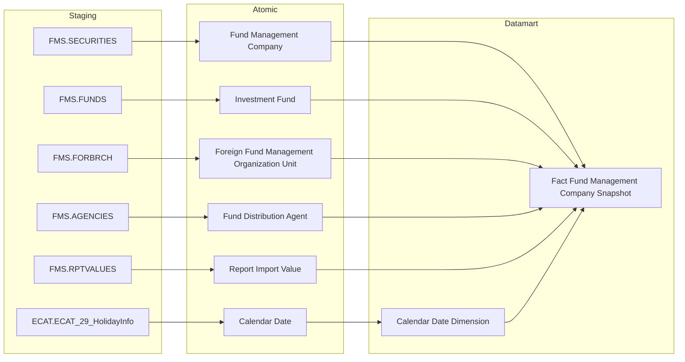

**Mục đích:** Cung cấp bảng `Fact Fund Management Company Snapshot` phục vụ Tab TỔNG QUAN CTQLQ — Nhóm 1, tổng hợp các chỉ tiêu thống kê toàn thị trường quản lý quỹ theo tháng gồm số lượng CTQLQ, quỹ đầu tư, VPĐD, chi nhánh, đại lý phân phối, quỹ hưu trí và tổng AUM toàn thị trường.

**Mô tả luồng:**

Staging → Atomic:
- **Fund Management Company:** Bảng lưu thông tin công ty quản lý quỹ lấy thông tin từ bảng FMS.SECURITIES
- **Investment Fund:** Bảng lưu thông tin quỹ đầu tư lấy thông tin từ bảng FMS.FUNDS
- **Foreign Fund Management Organization Unit:** Bảng lưu thông tin văn phòng đại diện và chi nhánh công ty quản lý quỹ nước ngoài tại Việt Nam lấy thông tin từ bảng FMS.FORBRCH
- **Fund Distribution Agent:** Bảng lưu thông tin đại lý phân phối chứng chỉ quỹ lấy thông tin từ bảng FMS.AGENCIES
- **Report Import Value:** Bảng lưu giá trị các chỉ tiêu báo cáo định kỳ lấy thông tin từ bảng FMS.RPTVALUES
- **Calendar Date:** Bảng lưu thông tin lịch ngày lấy thông tin từ bảng ECAT.ECAT_29_HolidayInfo

Atomic → Datamart:
- **Fact Fund Management Company Snapshot:** Bảng sự kiện tổng hợp thông tin thống kê toàn thị trường quản lý quỹ — grain 1 snapshot × 1 tháng, không có chiều phân tích theo từng CTQLQ
- **Calendar Date Dimension:** Bảng lưu thông tin thời gian

---

#### 3.1.7.2.2 Nhóm thông tin Số liệu hợp đồng ủy thác danh mục per CTQLQ

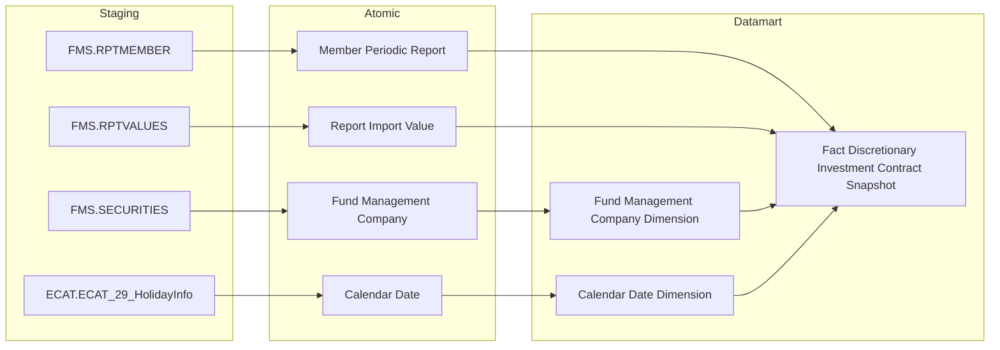

**Mục đích:** Cung cấp bảng `Fact Discretionary Investment Contract Snapshot` phục vụ Tab TỔNG QUAN CTQLQ — Nhóm 2, tổng hợp số lượng và giá trị thị trường hợp đồng ủy thác danh mục đầu tư per CTQLQ theo tháng, phân theo cá nhân và tổ chức.

**Mô tả luồng:**

Staging → Atomic:
- **Member Periodic Report:** Bảng lưu thông tin kỳ báo cáo định kỳ của thành viên lấy thông tin từ bảng FMS.RPTMEMBER
- **Report Import Value:** Bảng lưu giá trị các chỉ tiêu báo cáo định kỳ lấy thông tin từ bảng FMS.RPTVALUES
- **Fund Management Company:** Bảng lưu thông tin công ty quản lý quỹ lấy thông tin từ bảng FMS.SECURITIES
- **Calendar Date:** Bảng lưu thông tin lịch ngày lấy thông tin từ bảng ECAT.ECAT_29_HolidayInfo

Atomic → Datamart:
- **Fact Discretionary Investment Contract Snapshot:** Bảng sự kiện tổng hợp thông tin số lượng và giá trị hợp đồng UTDM per CTQLQ × kỳ báo cáo
- **Fund Management Company Dimension:** Bảng lưu thông tin công ty quản lý quỹ (SCD2)
- **Calendar Date Dimension:** Bảng lưu thông tin thời gian

---

#### 3.1.7.2.3 Nhóm thông tin Hồ sơ CTQLQ — Fund Management Company Profile

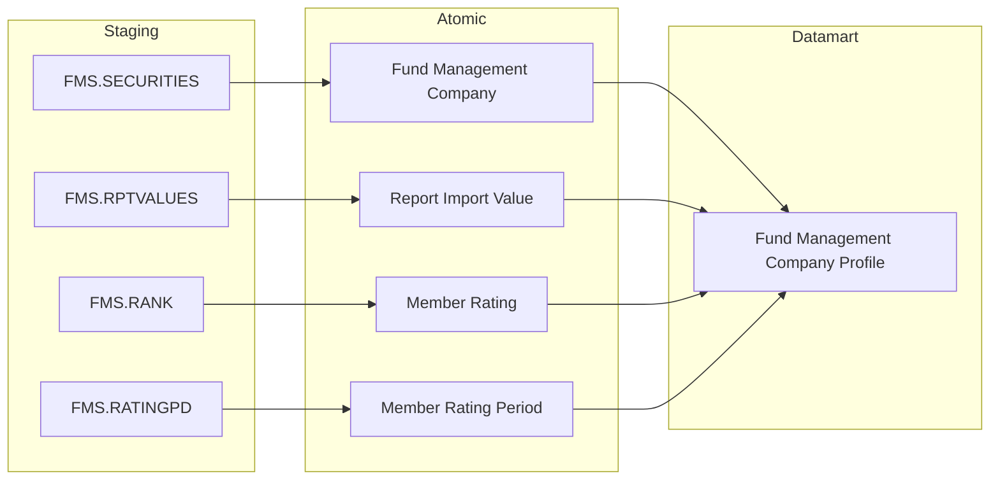

**Mục đích:** Cung cấp bảng `Fund Management Company Profile` phục vụ Tab TỔNG QUAN CTQLQ — Nhóm 3, hiển thị bảng flat chính với đầy đủ chỉ tiêu per CTQLQ (AUM, số quỹ, số HĐUTDM, CAR, lợi nhuận, vốn điều lệ, vốn CSH, xếp loại CAMEL).

**Mô tả luồng:**

Staging → Atomic:
- **Fund Management Company:** Bảng lưu thông tin công ty quản lý quỹ lấy thông tin từ bảng FMS.SECURITIES
- **Report Import Value:** Bảng lưu giá trị các chỉ tiêu báo cáo định kỳ (AUM, lợi nhuận, vốn CSH) lấy thông tin từ bảng FMS.RPTVALUES
- **Member Rating:** Bảng lưu kết quả xếp loại CAMEL của thành viên lấy thông tin từ bảng FMS.RANK
- **Member Rating Period:** Bảng lưu thông tin kỳ đánh giá xếp loại lấy thông tin từ bảng FMS.RATINGPD

Atomic → Datamart:
- **Fund Management Company Profile:** Bảng tác nghiệp lưu danh sách CTQLQ ở trạng thái mới nhất, 1 dòng per CTQLQ tại tháng slicer

---

#### 3.1.7.2.4 Nhóm thông tin Hồ sơ CTQLQ — Fund Management Company Fund List

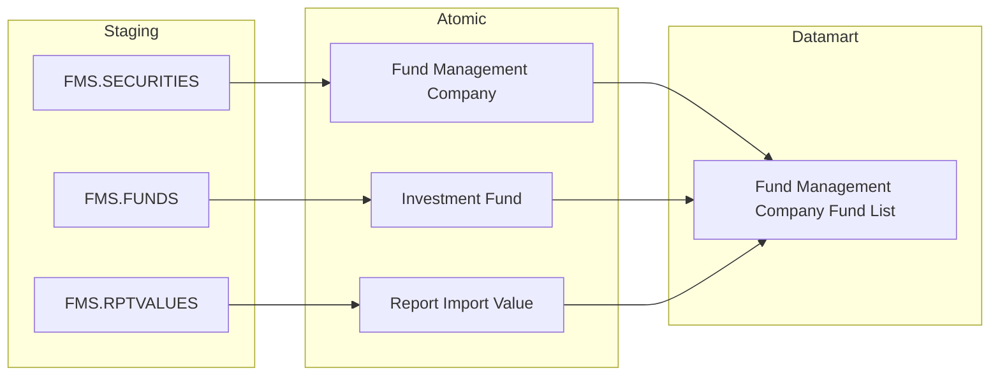

**Mục đích:** Cung cấp bảng `Fund Management Company Fund List` phục vụ popup drill-down danh sách quỹ theo CTQLQ tại Tab TỔNG QUAN CTQLQ — Nhóm 3.

**Mô tả luồng:**

Staging → Atomic:
- **Fund Management Company:** Bảng lưu thông tin công ty quản lý quỹ lấy thông tin từ bảng FMS.SECURITIES
- **Investment Fund:** Bảng lưu thông tin quỹ đầu tư lấy thông tin từ bảng FMS.FUNDS
- **Report Import Value:** Bảng lưu giá trị các chỉ tiêu báo cáo định kỳ (NAV quỹ) lấy thông tin từ bảng FMS.RPTVALUES

Atomic → Datamart:
- **Fund Management Company Fund List:** Bảng tác nghiệp lưu danh sách quỹ per CTQLQ ở trạng thái mới nhất, 1 dòng per quỹ × tháng slicer

---

#### 3.1.7.2.5 Nhóm thông tin Hồ sơ CTQLQ — Fund Management Company Contract List

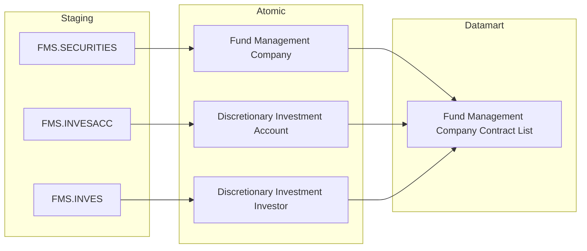

**Mục đích:** Cung cấp bảng `Fund Management Company Contract List` phục vụ popup drill-down danh sách hợp đồng UTDM theo CTQLQ tại Tab TỔNG QUAN CTQLQ — Nhóm 3.

**Mô tả luồng:**

Staging → Atomic:
- **Fund Management Company:** Bảng lưu thông tin công ty quản lý quỹ lấy thông tin từ bảng FMS.SECURITIES
- **Discretionary Investment Account:** Bảng lưu thông tin hợp đồng ủy thác danh mục đầu tư lấy thông tin từ bảng FMS.INVESACC
- **Discretionary Investment Investor:** Bảng lưu thông tin nhà đầu tư ủy thác lấy thông tin từ bảng FMS.INVES

Atomic → Datamart:
- **Fund Management Company Contract List:** Bảng tác nghiệp lưu danh sách hợp đồng UTDM per CTQLQ ở trạng thái mới nhất, 1 dòng per hợp đồng ủy thác danh mục đầu tư active tại tháng slicer

---

#### 3.1.7.2.6 Nhóm thông tin NAV quỹ theo kỳ và cross-module QLRR

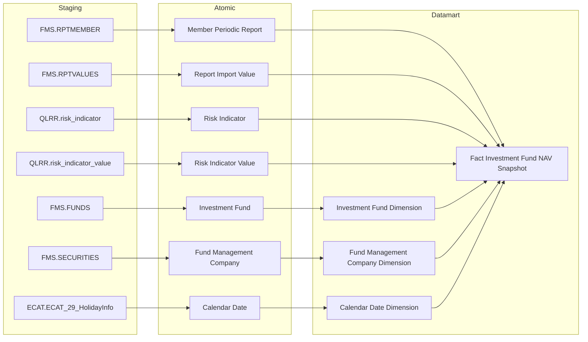

**Mục đích:** Cung cấp bảng `Fact Investment Fund NAV Snapshot` phục vụ Tab QUỸ ĐẦU TƯ — Nhóm 4, 5, 6, 9, gồm biểu đồ tổng NAV và tỷ lệ NAV/GDP, phân bổ tài sản, biến động NAV theo tháng và so sánh NAV/CCQ với VN-Index và lãi suất liên ngân hàng qua đêm.

**Mô tả luồng:**

Staging → Atomic:
- **Member Periodic Report:** Bảng lưu thông tin kỳ báo cáo định kỳ của thành viên lấy thông tin từ bảng FMS.RPTMEMBER
- **Report Import Value:** Bảng lưu giá trị các chỉ tiêu báo cáo định kỳ (NAV, phân bổ tài sản) lấy thông tin từ bảng FMS.RPTVALUES
- **Investment Fund:** Bảng lưu thông tin quỹ đầu tư lấy thông tin từ bảng FMS.FUNDS
- **Fund Management Company:** Bảng lưu thông tin công ty quản lý quỹ lấy thông tin từ bảng FMS.SECURITIES
- **Risk Indicator:** Bảng lưu thông tin danh mục chỉ tiêu rủi ro và kinh tế vĩ mô (GDP, VN-Index, lãi suất LNH) lấy thông tin từ bảng QLRR.risk_indicator
- **Risk Indicator Value:** Bảng lưu giá trị các chỉ tiêu rủi ro theo kỳ lấy thông tin từ bảng QLRR.risk_indicator_value
- **Calendar Date:** Bảng lưu thông tin lịch ngày lấy thông tin từ bảng ECAT.ECAT_29_HolidayInfo

Atomic → Datamart:
- **Fact Investment Fund NAV Snapshot:** Bảng sự kiện tổng hợp thông tin NAV, phân bổ tài sản của từng quỹ per kỳ báo cáo, kết hợp chỉ tiêu kinh tế vĩ mô (GDP, VN-Index, lãi suất LNH qua đêm) từ cross-module QLRR
- **Investment Fund Dimension:** Bảng lưu thông tin quỹ đầu tư (SCD2)
- **Fund Management Company Dimension:** Bảng lưu thông tin công ty quản lý quỹ (SCD2)
- **Calendar Date Dimension:** Bảng lưu thông tin thời gian

---

#### 3.1.7.2.7 Nhóm thông tin Số lượng quỹ theo loại hình

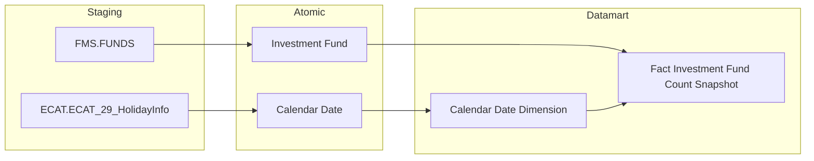

**Mục đích:** Cung cấp bảng `Fact Investment Fund Count Snapshot` phục vụ Tab QUỸ ĐẦU TƯ — Nhóm 7, thống kê số lượng quỹ đầu tư theo từng loại hình (quỹ mở, ETF, đóng, BĐS, thành viên, TTTTT, TP hạ tầng, hưu trí) theo năm.

**Mô tả luồng:**

Staging → Atomic:
- **Investment Fund:** Bảng lưu thông tin quỹ đầu tư lấy thông tin từ bảng FMS.FUNDS
- **Calendar Date:** Bảng lưu thông tin lịch ngày lấy thông tin từ bảng ECAT.ECAT_29_HolidayInfo

Atomic → Datamart:
- **Fact Investment Fund Count Snapshot:** Bảng sự kiện tổng hợp thông tin đếm quỹ theo từng loại hình — grain 1 snapshot toàn thị trường × 1 năm
- **Calendar Date Dimension:** Bảng lưu thông tin thời gian

---

#### 3.1.7.2.8 Nhóm thông tin Số lượng chứng chỉ quỹ lưu hành per quỹ

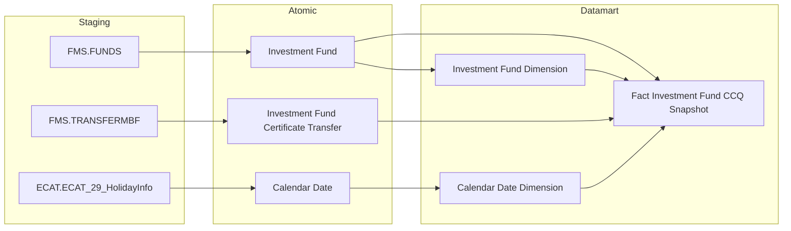

**Mục đích:** Cung cấp bảng `Fact Investment Fund CCQ Snapshot` phục vụ Tab QUỸ ĐẦU TƯ — Nhóm 8, thống kê số lượng chứng chỉ quỹ lưu hành per quỹ theo tháng, tính từ tích lũy giao dịch chuyển nhượng.

**Mô tả luồng:**

Staging → Atomic:
- **Investment Fund:** Bảng lưu thông tin quỹ đầu tư lấy thông tin từ bảng FMS.FUNDS
- **Investment Fund Certificate Transfer:** Bảng lưu thông tin giao dịch chuyển nhượng chứng chỉ quỹ (mua/bán tích lũy) lấy thông tin từ bảng FMS.TRANSFERMBF
- **Calendar Date:** Bảng lưu thông tin lịch ngày lấy thông tin từ bảng ECAT.ECAT_29_HolidayInfo

Atomic → Datamart:
- **Fact Investment Fund CCQ Snapshot:** Bảng sự kiện tổng hợp thông tin số lượng CCQ lưu hành per quỹ × kỳ snapshot, tính bằng tổng mua trừ tổng bán
- **Investment Fund Dimension:** Bảng lưu thông tin quỹ đầu tư (SCD2)
- **Calendar Date Dimension:** Bảng lưu thông tin thời gian

---

#### 3.1.7.2.9 Nhóm thông tin Danh sách quỹ đầu tư

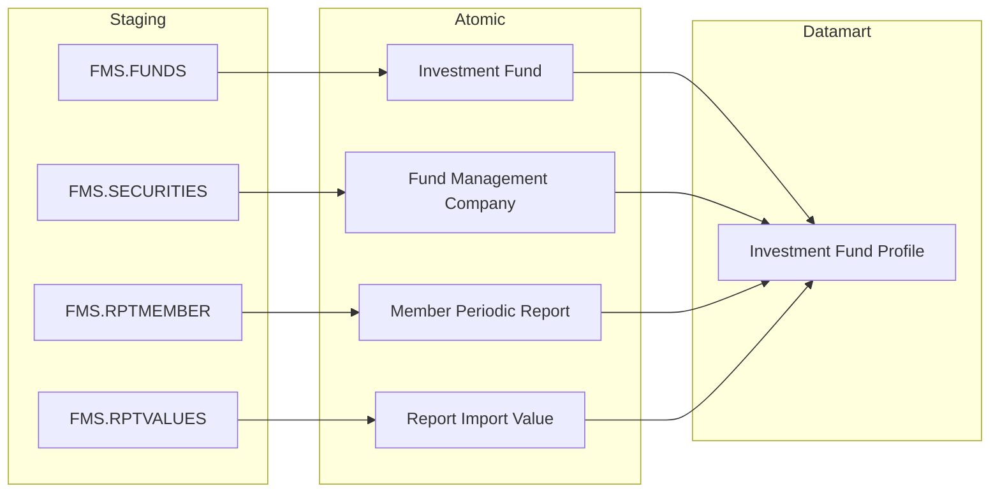

**Mục đích:** Cung cấp bảng `Investment Fund Profile` phục vụ Tab QUỸ ĐẦU TƯ — Nhóm 10, hiển thị danh sách quỹ đầu tư với các chỉ tiêu NAV, lợi nhuận YTD và số lượng CCQ lưu hành tại tháng slicer.

**Mô tả luồng:**

Staging → Atomic:
- **Investment Fund:** Bảng lưu thông tin quỹ đầu tư lấy thông tin từ bảng FMS.FUNDS
- **Fund Management Company:** Bảng lưu thông tin công ty quản lý quỹ lấy thông tin từ bảng FMS.SECURITIES
- **Member Periodic Report:** Bảng lưu thông tin kỳ báo cáo định kỳ lấy thông tin từ bảng FMS.RPTMEMBER
- **Report Import Value:** Bảng lưu giá trị các chỉ tiêu báo cáo định kỳ (NAV, lợi nhuận) lấy thông tin từ bảng FMS.RPTVALUES

Atomic → Datamart:
- **Investment Fund Profile:** Bảng tác nghiệp lưu danh sách quỹ đầu tư ở trạng thái mới nhất, 1 dòng per quỹ × tháng slicer

---

#### 3.1.7.2.10 Nhóm thông tin Pass-through báo cáo

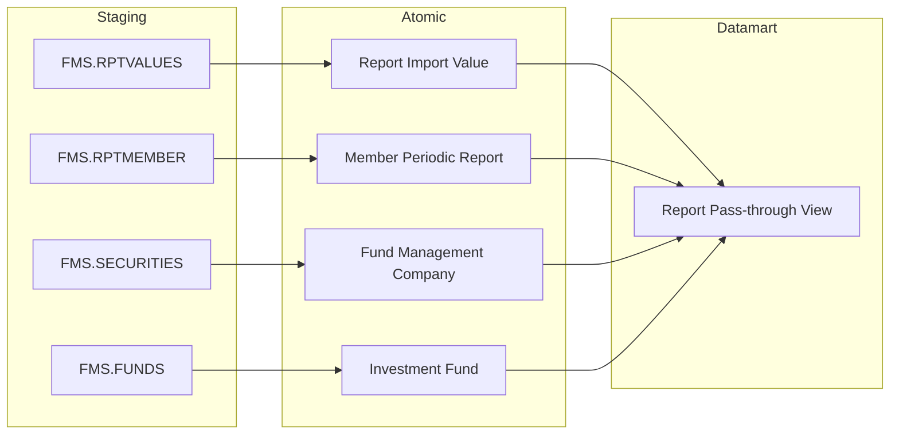

**Mục đích:** Cung cấp bảng `Report Pass-through View` phục vụ Tab DATA EXPLORER — Nhóm 12–16, cho phép tra cứu toàn bộ giá trị từng dòng chỉ tiêu báo cáo định kỳ của CTQLQ và quỹ đầu tư theo biểu mẫu và kỳ.

**Mô tả luồng:**

Staging → Atomic:
- **Report Import Value:** Bảng lưu giá trị các chỉ tiêu báo cáo định kỳ lấy thông tin từ bảng FMS.RPTVALUES
- **Member Periodic Report:** Bảng lưu thông tin kỳ báo cáo định kỳ lấy thông tin từ bảng FMS.RPTMEMBER
- **Fund Management Company:** Bảng lưu thông tin công ty quản lý quỹ lấy thông tin từ bảng FMS.SECURITIES
- **Investment Fund:** Bảng lưu thông tin quỹ đầu tư lấy thông tin từ bảng FMS.FUNDS

Atomic → Datamart:
- **Report Pass-through View:** Bảng tác nghiệp lưu danh sách toàn bộ giá trị chỉ tiêu báo cáo dạng flat ở trạng thái mới nhất, 1 dòng per CTQLQ/Quỹ × biểu mẫu × kỳ × dòng chỉ tiêu

---

#### 3.1.7.2.11 Nhóm thông tin Báo cáo giao dịch nhân viên CTQLQ

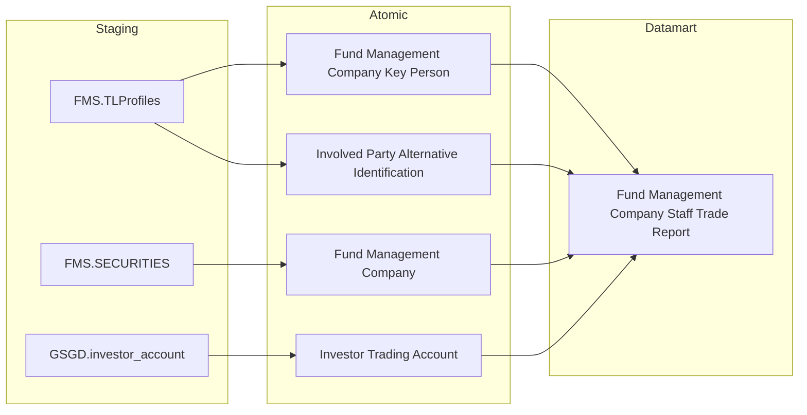

**Mục đích:** Cung cấp bảng `Fund Management Company Staff Trade Report` phục vụ Tab BÁO CÁO / CÔNG TY QLQ — Nhóm 11, hiển thị danh sách nhân viên CTQLQ và tài khoản giao dịch chứng khoán tương ứng (cross-module FMS × GSGD).

**Mô tả luồng:**

Staging → Atomic:
- **Fund Management Company Key Person:** Bảng lưu thông tin nhân viên chủ chốt của công ty quản lý quỹ lấy thông tin từ bảng FMS.TLProfiles
- **Involved Party Alternative Identification:** Bảng lưu thông tin giấy tờ định danh thay thế (CCCD/Hộ chiếu) của nhân viên, dùng làm join key sang GSGD, lấy thông tin từ bảng FMS.TLProfiles
- **Fund Management Company:** Bảng lưu thông tin công ty quản lý quỹ lấy thông tin từ bảng FMS.SECURITIES
- **Investor Trading Account:** Bảng lưu thông tin tài khoản giao dịch chứng khoán lấy thông tin từ bảng GSGD.investor_account

Atomic → Datamart:
- **Fund Management Company Staff Trade Report:** Bảng tác nghiệp lưu danh sách nhân viên CTQLQ kèm tài khoản giao dịch chứng khoán ở trạng thái mới nhất, 1 dòng per nhân viên × tài khoản GDCK
