# 3. KHO DỮ LIỆU (OLAP) — Quản lý quỹ

## 3.1 Mô hình dữ liệu mức High Level / Conceptual

### 3.1.1 Sơ đồ ERD

```mermaid
erDiagram
    CALENDAR_DATE_DIMENSION ||--o{ FACT_FUND_MANAGEMENT_COMPANY_SNAPSHOT : " "
    CALENDAR_DATE_DIMENSION ||--o{ FACT_DISCRETIONARY_INVESTMENT_CONTRACT_SNAPSHOT : " "
    CALENDAR_DATE_DIMENSION ||--o{ FACT_INVESTMENT_FUND_NAV_SNAPSHOT : " "
    CALENDAR_DATE_DIMENSION ||--o{ FACT_INVESTMENT_FUND_COUNT_SNAPSHOT : " "
    CALENDAR_DATE_DIMENSION ||--o{ FACT_INVESTMENT_FUND_CCQ_SNAPSHOT : " "
    FUND_MANAGEMENT_COMPANY_DIMENSION ||--o{ FACT_DISCRETIONARY_INVESTMENT_CONTRACT_SNAPSHOT : " "
    FUND_MANAGEMENT_COMPANY_DIMENSION ||--o{ FACT_INVESTMENT_FUND_NAV_SNAPSHOT : " "
    INVESTMENT_FUND_DIMENSION ||--o{ FACT_INVESTMENT_FUND_NAV_SNAPSHOT : " "
    INVESTMENT_FUND_DIMENSION ||--o{ FACT_INVESTMENT_FUND_CCQ_SNAPSHOT : " "
    FUND_MANAGEMENT_COMPANY_PROFILE ||--o{ FUND_MANAGEMENT_COMPANY_FUND_LIST : " "
    FUND_MANAGEMENT_COMPANY_PROFILE ||--o{ FUND_MANAGEMENT_COMPANY_CONTRACT_LIST : " "
    INVESTMENT_FUND_PROFILE
    REPORT_PASS_THROUGH_VIEW
    FUND_MANAGEMENT_COMPANY_STAFF_TRADE_REPORT
```

### 3.1.2 Danh sách thực thể

| STT | Thực thể | Tên bảng | Mô tả |
|---|---|---|---|
| 1 | Calendar Date Dimension | cdr_dt_dim | Lịch ngày — năm/quý/tháng/ngày lễ phục vụ slicer. Map từ Atomic Calendar Date |
| 2 | Fund Management Company Dimension | fnd_mgt_co_dim | CTQLQ — Mã/Tên/Tên viết tắt/Vốn ĐL/Trạng thái (SCD2) |
| 3 | Investment Fund Dimension | ivsm_fnd_dim | Quỹ đầu tư — Mã/Tên/Loại hình/Trạng thái/VĐL (SCD2) |
| 4 | Fact Fund Management Company Snapshot | fct_fnd_mgt_co_snpst | Thống kê thị trường — grain 1 snapshot toàn thị trường × 1 tháng |
| 5 | Fact Discretionary Investment Contract Snapshot | fct_dscr_ivsm_ctr_snpst | UTDM CTQLQ — grain 1 CTQLQ × 1 Report Template × 1 Report Date |
| 6 | Fact Investment Fund NAV Snapshot | fct_ivsm_fnd_nav_snpst | NAV và phân bổ tài sản quỹ — grain 1 quỹ × 1 kỳ báo cáo |
| 7 | Fact Investment Fund Count Snapshot | fct_ivsm_fnd_cnt_snpst | Đếm quỹ theo loại hình — grain 1 snapshot toàn thị trường × 1 năm |
| 8 | Fact Investment Fund CCQ Snapshot | fct_ivsm_fnd_ccq_snpst | CCQ lưu hành per quỹ — grain 1 quỹ × 1 snapshot tháng |
| 9 | Fund Management Company Profile | fnd_mgt_co_prfl | Hồ sơ CTQLQ — trạng thái mới nhất per công ty quản lý quỹ |
| 10 | Fund Management Company Fund List | fnd_mgt_co_fnd_lst | Danh sách quỹ theo CTQLQ — bảng con drill-down |
| 11 | Fund Management Company Contract List | fnd_mgt_co_ctr_lst | Danh sách hợp đồng UTDM theo CTQLQ — bảng con drill-down |
| 12 | Investment Fund Profile | ivsm_fnd_prfl | Hồ sơ quỹ — trạng thái mới nhất per quỹ đầu tư |
| 13 | Report Pass-through View | rpt_pass_thru_view | Pass-through báo cáo — 1 CTQLQ/Quỹ × 1 mẫu BC × 1 kỳ × 1 dòng chỉ tiêu |
| 14 | Fund Management Company Staff Trade Report | fnd_mgt_co_stf_trd_rpt | Báo cáo giao dịch nhân viên CTQLQ — cross-module FMS × GSGD |

---

## 3.2 Mô hình dữ liệu mức Logic

### 3.2.1 Sơ đồ ERD

```mermaid
erDiagram
    CALENDAR_DATE_DIMENSION["Calendar Date Dimension"] {
        string Calendar_Date_Dimension_Id PK
        date Calendar_Date
        int Year
        int Quarter
        int Month
        int Day_Of_Week
        string Is_Weekend
        string Holiday_Flag
        string Holiday_Name
    }
    FUND_MANAGEMENT_COMPANY_DIMENSION["Fund Management Company Dimension"] {
        string Fund_Management_Company_Dimension_Id PK
        string Company_Code
        string Company_Short_Name
        string Company_Name
        string Life_Cycle_Status_Code
    }
    INVESTMENT_FUND_DIMENSION["Investment Fund Dimension"] {
        string Investment_Fund_Dimension_Id PK
        string Fund_Code
        string Fund_Name
        string Fund_Short_Name
        string Fund_Type_Code
        string Practice_Status_Code
        float Fund_Capital_Amount
    }
    FACT_FUND_MANAGEMENT_COMPANY_SNAPSHOT["Fact Fund Management Company Snapshot"] {
        string Snapshot_Date_Dimension_Id FK
        int Active_Company_Count
        int Investment_Fund_Count
        int Retirement_Fund_Count
        int Foreign_Org_Unit_Rep_Office_Count
        int Foreign_Org_Unit_Branch_Count
        int Distribution_Agent_Count
        float Total_AUM_Amount
        int Total_Discretionary_Contract_Count
    }
    FACT_DISCRETIONARY_INVESTMENT_CONTRACT_SNAPSHOT["Fact Discretionary Investment Contract Snapshot"] {
        string Report_Date_Dimension_Id FK
        string Fund_Management_Company_Dimension_Id FK
        string Report_Template_Code
        string Reporting_Period_Code
        int Total_Contract_Count
        int Individual_Contract_Count
        int Organization_Contract_Count
        float Total_Trust_Market_Value
        float Individual_Trust_Market_Value
        float Organization_Trust_Market_Value
    }
    FACT_INVESTMENT_FUND_NAV_SNAPSHOT["Fact Investment Fund NAV Snapshot"] {
        string Report_Date_Dimension_Id FK
        string Investment_Fund_Dimension_Id FK
        string Fund_Management_Company_Dimension_Id FK
        string Report_Template_Code
        string Reporting_Period_Code
        float Fund_NAV_Amount
        float Total_Asset_Amount
        float Listed_Stock_Amount
        float Unlisted_Stock_Amount
        float Bond_Amount
        float Cash_Amount
        float Other_Securities_Amount
        float Other_Asset_Amount
        string GDP_Indicator_Code
        float GDP_Value
        string VN_Index_Indicator_Code
        float VN_Index_Value
        string Overnight_Rate_Indicator_Code
        float Overnight_Rate_Value
    }
    FACT_INVESTMENT_FUND_COUNT_SNAPSHOT["Fact Investment Fund Count Snapshot"] {
        string Snapshot_Date_Dimension_Id FK
        int Total_Fund_Count
        int Open_Fund_Count
        int Member_Fund_Count
        int ETF_Fund_Count
        int Closed_Fund_Count
        int Real_Estate_Fund_Count
        int Money_Market_Fund_Count
        int Infrastructure_Bond_Fund_Count
        int Retirement_Fund_Count
    }
    FACT_INVESTMENT_FUND_CCQ_SNAPSHOT["Fact Investment Fund CCQ Snapshot"] {
        string Report_Date_Dimension_Id FK
        string Investment_Fund_Dimension_Id FK
        string Report_Template_Code
        string Reporting_Period_Code
        float Outstanding_Unit_Count
    }
    FUND_MANAGEMENT_COMPANY_PROFILE["Fund Management Company Profile"] {
        string Fund_Management_Company_Id PK
        string Company_Code
        string Company_Short_Name
        string Company_Name
        string Life_Cycle_Status_Code
        float Charter_Capital_Amount
        int Investment_Fund_Count
        int Discretionary_Contract_Count
        float Total_AUM_Amount
        float Net_Profit_Amount
        float Equity_Amount
        string Rank_Class_Code
        float Total_Score
        string Report_Period_Code
        date Rating_Period_End_Date
    }
    FUND_MANAGEMENT_COMPANY_FUND_LIST["Fund Management Company Fund List"] {
        string Fund_Management_Company_Id PK
        string Investment_Fund_Id PK
        string Fund_Code
        string Fund_Short_Name
        string Fund_Name
        string Fund_Type_Code
        float Fund_Capital_Amount
        float Fund_NAV_Amount
        string Report_Period_Code
    }
    FUND_MANAGEMENT_COMPANY_CONTRACT_LIST["Fund Management Company Contract List"] {
        string Fund_Management_Company_Id
        string Discretionary_Investment_Account_Id PK
        string Discretionary_Investment_Account_Code
        string Account_Number
        string Contract_Number
        string Investor_Name
        string Investor_Object_Type_Code
        float Trust_Market_Value
        date Contract_Start_Date
        string Report_Period_Code
    }
    INVESTMENT_FUND_PROFILE["Investment Fund Profile"] {
        string Investment_Fund_Id PK
        string Investment_Fund_Code
        string Fund_Management_Company_Id
        string Fund_Short_Name
        string Fund_Name
        string Fund_Type_Code
        string Practice_Status_Code
        float Fund_Capital_Amount
        string Report_Period_Code
        float Fund_NAV_Amount
        float Net_Profit_Amount
        float Outstanding_Unit_Count
    }
    REPORT_PASS_THROUGH_VIEW["Report Pass-through View"] {
        string Fund_Management_Company_Id PK
        string Investment_Fund_Id PK
        string Report_Template_Code PK
        string Reporting_Period_Code PK
        string Row_Code PK
        string Fund_Management_Company_Code
        string Fund_Management_Company_Name
        string Investment_Fund_Code
        string Investment_Fund_Name
        string Report_Template_Name
        string Reporting_Period_Label
        date Report_Date
        string Row_Name
        float Cell_Value
        string Cell_Text_Value
        string Data_Unit
    }
    FUND_MANAGEMENT_COMPANY_STAFF_TRADE_REPORT["Fund Management Company Staff Trade Report"] {
        string Fund_Management_Company_Id PK
        string Fund_Management_Company_Key_Person_Id PK
        string Fund_Management_Company_Key_Person_Code
        string Full_Name
        string Job_Type_Code
        string Identification_Number
        string Investor_Trading_Account_Code
        string Securities_Company_Code
        date Transaction_Date
        string Transaction_Method_Code
        string Order_Side_Code
        string Security_Code
        int Order_Quantity
    }

    CALENDAR_DATE_DIMENSION ||--o{ FACT_FUND_MANAGEMENT_COMPANY_SNAPSHOT : " "
    CALENDAR_DATE_DIMENSION ||--o{ FACT_DISCRETIONARY_INVESTMENT_CONTRACT_SNAPSHOT : " "
    CALENDAR_DATE_DIMENSION ||--o{ FACT_INVESTMENT_FUND_NAV_SNAPSHOT : " "
    CALENDAR_DATE_DIMENSION ||--o{ FACT_INVESTMENT_FUND_COUNT_SNAPSHOT : " "
    CALENDAR_DATE_DIMENSION ||--o{ FACT_INVESTMENT_FUND_CCQ_SNAPSHOT : " "
    FUND_MANAGEMENT_COMPANY_DIMENSION ||--o{ FACT_DISCRETIONARY_INVESTMENT_CONTRACT_SNAPSHOT : " "
    FUND_MANAGEMENT_COMPANY_DIMENSION ||--o{ FACT_INVESTMENT_FUND_NAV_SNAPSHOT : " "
    INVESTMENT_FUND_DIMENSION ||--o{ FACT_INVESTMENT_FUND_NAV_SNAPSHOT : " "
    INVESTMENT_FUND_DIMENSION ||--o{ FACT_INVESTMENT_FUND_CCQ_SNAPSHOT : " "
    FUND_MANAGEMENT_COMPANY_PROFILE ||--o{ FUND_MANAGEMENT_COMPANY_FUND_LIST : " "
    FUND_MANAGEMENT_COMPANY_PROFILE ||--o{ FUND_MANAGEMENT_COMPANY_CONTRACT_LIST : " "
```

### 3.2.2 Danh sách các bảng và thuộc tính

#### 3.2.2.1 Bảng Calendar Date Dimension

| STT | Tên trường | Kiểu dữ liệu và độ dài | Nullable | Unique | P/F Key | Mặc định | Mô tả |
|---|---|---|---|---|---|---|---|
| 1 | Calendar Date Dimension Id | string | | X | P | | Surrogate key |
| 2 | Calendar Date | date | | | | | Ngày dương lịch |
| 3 | Year | int | X | | | | Năm (YYYY) |
| 4 | Quarter | int | X | | | | Quý (1–4) |
| 5 | Month | int | X | | | | Tháng (1–12) |
| 6 | Day Of Week | int | X | | | | Thứ trong tuần (1=Thứ 2 ... 7=Chủ nhật) |
| 7 | Is Weekend | boolean | X | | | | Cuối tuần (True/False) |
| 8 | Holiday Flag | boolean | X | | | | Cờ ngày nghỉ lễ công cộng |
| 9 | Holiday Name | string | X | | | | Tên ngày lễ |

#### 3.2.2.2 Bảng Fund Management Company Dimension

| STT | Tên trường | Kiểu dữ liệu và độ dài | Nullable | Unique | P/F Key | Mặc định | Mô tả |
|---|---|---|---|---|---|---|---|
| 1 | Fund Management Company Dimension Id | string | | X | P | | Surrogate key ETL sinh tự động |
| 2 | Company Code | string | | | | | Mã công ty quản lý quỹ |
| 3 | Company Short Name | string | X | | | | Tên viết tắt công ty quản lý quỹ |
| 4 | Company Name | string | | | | | Tên đầy đủ công ty quản lý quỹ |
| 5 | Life Cycle Status Code | string | X | | | | Trạng thái hoạt động công ty quản lý quỹ |

#### 3.2.2.3 Bảng Investment Fund Dimension

| STT | Tên trường | Kiểu dữ liệu và độ dài | Nullable | Unique | P/F Key | Mặc định | Mô tả |
|---|---|---|---|---|---|---|---|
| 1 | Investment Fund Dimension Id | string | | X | P | | Surrogate key ETL sinh tự động |
| 2 | Fund Code | string | | | | | Mã quỹ đầu tư |
| 3 | Fund Name | string | | | | | Tên đầy đủ quỹ đầu tư |
| 4 | Fund Short Name | string | X | | | | Tên viết tắt quỹ đầu tư |
| 5 | Fund Type Code | string | X | | | | Loại hình quỹ |
| 6 | Practice Status Code | string | X | | | | Trạng thái hoạt động quỹ |
| 7 | Fund Capital Amount | decimal(23,2) | X | | | | Vốn điều lệ quỹ (VNĐ) |

#### 3.2.2.4 Bảng Fact Fund Management Company Snapshot

| STT | Tên trường | Kiểu dữ liệu và độ dài | Nullable | Unique | P/F Key | Mặc định | Mô tả |
|---|---|---|---|---|---|---|---|
| 1 | Snapshot Date Dimension Id | string | | | F | | FK ngày snapshot |
| 2 | Active Company Count | int | X | | | | Số công ty quản lý quỹ đang hoạt động tại tháng snapshot |
| 3 | Investment Fund Count | int | X | | | | Số quỹ đầu tư tất cả loại hình tại tháng snapshot |
| 4 | Retirement Fund Count | int | X | | | | Số quỹ hưu trí tại tháng snapshot |
| 5 | Foreign Org Unit Rep Office Count | int | X | | | | Số văn phòng đại diện công ty quản lý quỹ nước ngoài tại Việt Nam |
| 6 | Foreign Org Unit Branch Count | int | X | | | | Số chi nhánh công ty quản lý quỹ nước ngoài tại Việt Nam |
| 7 | Distribution Agent Count | int | X | | | | Số đại lý phân phối chứng chỉ quỹ tại tháng snapshot |
| 8 | Total AUM Amount | decimal(23,2) | X | | | | Tổng AUM toàn thị trường từ báo cáo |
| 9 | Total Discretionary Contract Count | int | X | | | | Tổng số hợp đồng UTDM toàn thị trường từ báo cáo |

#### 3.2.2.5 Bảng Fact Discretionary Investment Contract Snapshot

| STT | Tên trường | Kiểu dữ liệu và độ dài | Nullable | Unique | P/F Key | Mặc định | Mô tả |
|---|---|---|---|---|---|---|---|
| 1 | Report Date Dimension Id | string | | | F | | FK ngày báo cáo |
| 2 | Fund Management Company Dimension Id | string | | | F | | FK công ty quản lý quỹ |
| 3 | Report Template Code | string | | | | | Mã biểu mẫu báo cáo |
| 4 | Reporting Period Code | string | | | | | Mã kỳ báo cáo |
| 5 | Total Contract Count | int | X | | | | Tổng số hợp đồng UTDM per CTQLQ per kỳ |
| 6 | Individual Contract Count | int | X | | | | Số hợp đồng UTDM cá nhân per CTQLQ per kỳ |
| 7 | Organization Contract Count | int | X | | | | Số hợp đồng UTDM tổ chức per CTQLQ per kỳ |
| 8 | Total Trust Market Value | decimal(23,2) | X | | | | Tổng giá trị thị trường UTDM per CTQLQ per kỳ |
| 9 | Individual Trust Market Value | decimal(23,2) | X | | | | Giá trị thị trường UTDM cá nhân per CTQLQ per kỳ |
| 10 | Organization Trust Market Value | decimal(23,2) | X | | | | Giá trị thị trường UTDM tổ chức per CTQLQ per kỳ |

#### 3.2.2.6 Bảng Fact Investment Fund NAV Snapshot

| STT | Tên trường | Kiểu dữ liệu và độ dài | Nullable | Unique | P/F Key | Mặc định | Mô tả |
|---|---|---|---|---|---|---|---|
| 1 | Report Date Dimension Id | string | | | F | | FK ngày báo cáo |
| 2 | Investment Fund Dimension Id | string | | | F | | FK quỹ đầu tư |
| 3 | Fund Management Company Dimension Id | string | | | F | | FK công ty quản lý quỹ |
| 4 | Report Template Code | string | | | | | Mã biểu mẫu báo cáo |
| 5 | Reporting Period Code | string | | | | | Mã kỳ báo cáo |
| 6 | Fund NAV Amount | decimal(23,2) | X | | | | NAV per quỹ per kỳ |
| 7 | Total Asset Amount | decimal(23,2) | X | | | | Tổng giá trị tài sản per quỹ per kỳ |
| 8 | Listed Stock Amount | decimal(23,2) | X | | | | Giá trị cổ phiếu niêm yết |
| 9 | Unlisted Stock Amount | decimal(23,2) | X | | | | Giá trị cổ phiếu chưa niêm yết |
| 10 | Bond Amount | decimal(23,2) | X | | | | Giá trị trái phiếu |
| 11 | Cash Amount | decimal(23,2) | X | | | | Giá trị tiền |
| 12 | Other Securities Amount | decimal(23,2) | X | | | | Giá trị chứng khoán khác |
| 13 | Other Asset Amount | decimal(23,2) | X | | | | Giá trị tài sản khác |
| 14 | GDP Indicator Code | string | | | | | Mã chỉ tiêu GDP |
| 15 | GDP Value | decimal(23,2) | X | | | | GDP kỳ quý từ cross-module QLRR |
| 16 | VN Index Indicator Code | string | | | | | Mã chỉ tiêu VN-Index |
| 17 | VN Index Value | decimal(23,2) | X | | | | VN-Index từ cross-module QLRR |
| 18 | Overnight Rate Indicator Code | string | | | | | Mã chỉ tiêu lãi suất liên ngân hàng qua đêm |
| 19 | Overnight Rate Value | decimal(5,2) | X | | | | Lãi suất liên ngân hàng qua đêm từ cross-module QLRR |

#### 3.2.2.7 Bảng Fact Investment Fund Count Snapshot

| STT | Tên trường | Kiểu dữ liệu và độ dài | Nullable | Unique | P/F Key | Mặc định | Mô tả |
|---|---|---|---|---|---|---|---|
| 1 | Snapshot Date Dimension Id | string | | | F | | FK lịch năm snapshot |
| 2 | Total Fund Count | int | X | | | | Tổng số quỹ đầu tư tất cả loại hình |
| 3 | Open Fund Count | int | X | | | | Số quỹ mở |
| 4 | Member Fund Count | int | X | | | | Số quỹ thành viên |
| 5 | ETF Fund Count | int | X | | | | Số quỹ ETF |
| 6 | Closed Fund Count | int | X | | | | Số quỹ đóng |
| 7 | Real Estate Fund Count | int | X | | | | Số quỹ bất động sản |
| 8 | Money Market Fund Count | int | X | | | | Số quỹ thị trường tiền tệ |
| 9 | Infrastructure Bond Fund Count | int | X | | | | Số quỹ trái phiếu hạ tầng |
| 10 | Retirement Fund Count | int | X | | | | Số quỹ hưu trí |

#### 3.2.2.8 Bảng Fact Investment Fund CCQ Snapshot

| STT | Tên trường | Kiểu dữ liệu và độ dài | Nullable | Unique | P/F Key | Mặc định | Mô tả |
|---|---|---|---|---|---|---|---|
| 1 | Report Date Dimension Id | string | | | F | | FK lịch ngày snapshot CCQ |
| 2 | Investment Fund Dimension Id | string | | | F | | FK quỹ đầu tư |
| 3 | Report Template Code | string | | | | | Mã biểu mẫu báo cáo |
| 4 | Reporting Period Code | string | | | | | Mã kỳ báo cáo |
| 5 | Outstanding Unit Count | decimal(23,2) | X | | | | Số chứng chỉ quỹ lưu hành |

#### 3.2.2.9 Bảng Fund Management Company Profile

| STT | Tên trường | Kiểu dữ liệu và độ dài | Nullable | Unique | P/F Key | Mặc định | Mô tả |
|---|---|---|---|---|---|---|---|
| 1 | Fund Management Company Id | string | | X | P | | Surrogate key |
| 2 | Company Code | string | | | | | Mã công ty quản lý quỹ |
| 3 | Company Short Name | string | X | | | | Tên viết tắt công ty quản lý quỹ |
| 4 | Company Name | string | | | | | Tên đầy đủ công ty quản lý quỹ |
| 5 | Life Cycle Status Code | string | X | | | | Trạng thái hoạt động |
| 6 | Charter Capital Amount | decimal(23,2) | X | | | | Vốn điều lệ công ty quản lý quỹ (VNĐ) |
| 7 | Investment Fund Count | int | X | | | | Số quỹ thuộc công ty quản lý quỹ |
| 8 | Discretionary Contract Count | int | X | | | | Số hợp đồng UTDM thuộc công ty quản lý quỹ |
| 9 | Total AUM Amount | decimal(23,2) | X | | | | AUM per CTQLQ |
| 10 | Net Profit Amount | decimal(23,2) | X | | | | Lợi nhuận per CTQLQ |
| 11 | Equity Amount | decimal(23,2) | X | | | | Vốn chủ sở hữu per CTQLQ |
| 12 | Rank Class Code | string | X | | | | Xếp loại CAMEL |
| 13 | Total Score | decimal(5,2) | X | | | | Điểm CAMEL |
| 14 | Report Period Code | string | X | | | | Mã kỳ báo cáo dùng làm tham chiếu slicer |
| 15 | Rating Period End Date | date | X | | | | Ngày kết thúc kỳ xếp loại gần nhất |

#### 3.2.2.10 Bảng Fund Management Company Fund List

| STT | Tên trường | Kiểu dữ liệu và độ dài | Nullable | Unique | P/F Key | Mặc định | Mô tả |
|---|---|---|---|---|---|---|---|
| 1 | Fund Management Company Id | string | | X | P | | Khóa thành phần 1 — FK drill-down về hồ sơ CTQLQ |
| 2 | Investment Fund Id | string | | X | P | | Khóa thành phần 2 — Surrogate key quỹ |
| 3 | Fund Code | string | | | | | Mã quỹ đầu tư |
| 4 | Fund Short Name | string | X | | | | Tên viết tắt quỹ đầu tư |
| 5 | Fund Name | string | | | | | Tên đầy đủ quỹ đầu tư |
| 6 | Fund Type Code | string | X | | | | Loại hình quỹ |
| 7 | Fund Capital Amount | decimal(23,2) | X | | | | Vốn điều lệ quỹ (VNĐ) |
| 8 | Fund NAV Amount | decimal(23,2) | X | | | | NAV quỹ kỳ báo cáo gần nhất |
| 9 | Report Period Code | string | X | | | | Mã kỳ báo cáo tương ứng NAV |

#### 3.2.2.11 Bảng Fund Management Company Contract List

| STT | Tên trường | Kiểu dữ liệu và độ dài | Nullable | Unique | P/F Key | Mặc định | Mô tả |
|---|---|---|---|---|---|---|---|
| 1 | Fund Management Company Id | string | X | | | | FK drill-down về hồ sơ CTQLQ |
| 2 | Discretionary Investment Account Id | string | | X | P | | Surrogate key hợp đồng UTDM |
| 3 | Discretionary Investment Account Code | string | | | | | Mã tài khoản UTDM |
| 4 | Account Number | string | X | | | | Số tài khoản UTDM |
| 5 | Contract Number | string | X | | | | Số hợp đồng UTDM |
| 6 | Investor Name | string | | | | | Tên nhà đầu tư |
| 7 | Investor Object Type Code | string | X | | | | Loại nhà đầu tư (cá nhân/tổ chức) |
| 8 | Trust Market Value | decimal(23,2) | X | | | | Giá trị thị trường hợp đồng UTDM |
| 9 | Contract Start Date | date | X | | | | Ngày bắt đầu hợp đồng UTDM |
| 10 | Report Period Code | string | X | | | | Mã kỳ báo cáo tương ứng giá trị thị trường |

#### 3.2.2.12 Bảng Investment Fund Profile

| STT | Tên trường | Kiểu dữ liệu và độ dài | Nullable | Unique | P/F Key | Mặc định | Mô tả |
|---|---|---|---|---|---|---|---|
| 1 | Investment Fund Id | string | | X | P | | Surrogate key |
| 2 | Investment Fund Code | string | | | | | Mã quỹ đầu tư |
| 3 | Fund Management Company Id | string | | | | | FK về công ty quản lý quỹ |
| 4 | Fund Short Name | string | X | | | | Tên viết tắt quỹ |
| 5 | Fund Name | string | | | | | Tên đầy đủ quỹ |
| 6 | Fund Type Code | string | X | | | | Loại hình quỹ |
| 7 | Practice Status Code | string | X | | | | Trạng thái hoạt động quỹ |
| 8 | Fund Capital Amount | decimal(23,2) | X | | | | Vốn điều lệ quỹ (VNĐ) |
| 9 | Report Period Code | string | X | | | | Mã kỳ báo cáo gần nhất |
| 10 | Fund NAV Amount | decimal(23,2) | X | | | | NAV quỹ kỳ báo cáo gần nhất |
| 11 | Net Profit Amount | decimal(23,2) | X | | | | Lợi nhuận gốc từ báo cáo |
| 12 | Outstanding Unit Count | decimal(23,2) | X | | | | Số lượng chứng chỉ quỹ lưu hành |

#### 3.2.2.13 Bảng Report Pass-through View

| STT | Tên trường | Kiểu dữ liệu và độ dài | Nullable | Unique | P/F Key | Mặc định | Mô tả |
|---|---|---|---|---|---|---|---|
| 1 | Fund Management Company Id | string | | X | P | | Khóa thành phần 1 — Surrogate key CTQLQ |
| 2 | Investment Fund Id | string | | X | P | | Khóa thành phần 2 — Surrogate key quỹ |
| 3 | Report Template Code | string | | X | P | | Khóa thành phần 3 — Mã biểu mẫu báo cáo |
| 4 | Reporting Period Code | string | | X | P | | Khóa thành phần 4 — Mã kỳ báo cáo |
| 5 | Row Code | string | | X | P | | Khóa thành phần 5 — Mã dòng chỉ tiêu |
| 6 | Fund Management Company Code | string | X | | | | Mã công ty quản lý quỹ |
| 7 | Fund Management Company Name | string | X | | | | Tên công ty quản lý quỹ |
| 8 | Investment Fund Code | string | X | | | | Mã quỹ đầu tư |
| 9 | Investment Fund Name | string | X | | | | Tên quỹ đầu tư |
| 10 | Report Template Name | string | X | | | | Tên biểu mẫu báo cáo |
| 11 | Reporting Period Label | string | X | | | | Nhãn kỳ báo cáo hiển thị |
| 12 | Report Date | date | X | | | | Ngày nộp báo cáo |
| 13 | Row Name | string | X | | | | Tên dòng chỉ tiêu |
| 14 | Cell Value | decimal(23,2) | X | | | | Giá trị chỉ tiêu (numeric) |
| 15 | Cell Text Value | string | X | | | | Giá trị chỉ tiêu dạng văn bản |
| 16 | Data Unit | string | X | | | | Đơn vị dữ liệu |

#### 3.2.2.14 Bảng Fund Management Company Staff Trade Report

| STT | Tên trường | Kiểu dữ liệu và độ dài | Nullable | Unique | P/F Key | Mặc định | Mô tả |
|---|---|---|---|---|---|---|---|
| 1 | Fund Management Company Id | string | | X | P | | Khóa thành phần 1 — FK Atomic CTQLQ |
| 2 | Fund Management Company Key Person Id | string | | X | P | | Khóa thành phần 2 — Surrogate key nhân viên CTQLQ |
| 3 | Fund Management Company Key Person Code | string | | | | | Mã nhân viên công ty quản lý quỹ |
| 4 | Full Name | string | | | | | Họ tên nhân viên |
| 5 | Job Type Code | string | X | | | | Chức danh nhân viên |
| 6 | Identification Number | string | X | | | | Số CCCD/Hộ chiếu nhân viên |
| 7 | Investor Trading Account Code | string | X | | | | Mã tài khoản giao dịch chứng khoán |
| 8 | Securities Company Code | string | X | | | | Mã công ty chứng khoán |
| 9 | Transaction Date | date | X | | | | Ngày giao dịch |
| 10 | Transaction Method Code | string | X | | | | Phương thức giao dịch |
| 11 | Order Side Code | string | X | | | | Lệnh mua/bán |
| 12 | Security Code | string | X | | | | Mã chứng khoán |
| 13 | Order Quantity | int | X | | | | Số lượng chứng khoán |

---

## 3.3 Mô hình dữ liệu mức vật lý

### 3.3.1 Sơ đồ ERD

### 3.3.2 Danh sách bảng Dimension

#### 3.3.2.1 Bảng Calendar Date Dimension (cdr_dt_dim)

*Mô tả bảng:* Lịch ngày — năm/quý/tháng/ngày lễ phục vụ slicer. Map từ Atomic Calendar Date (cdr_dt)
*Đường dẫn trên kho dữ liệu:*
*Các trường Partition:*
*Thời gian lưu trữ:*
*Định dạng lưu trữ:*

| STT | Tên trường | Kiểu dữ liệu và độ dài | Nullable | Unique | P/F Key | Giá trị mặc định | Mô tả | Hệ thống nguồn | Schema.Table | Source Field Name | ETL Rules |
|---|---|---|---|---|---|---|---|---|---|---|---|
| 1 | cdr_dt_dim_id | string |  | X | P |  | Surrogate key — map từ Atomic Calendar Date Id (int yyyymmdd) | ECAT | ECAT.ECAT_29_HolidayInfo | cdr_dt_id | cdr_dt.cdr_dt_id |
| 2 | cdr_dt | date |  |  |  |  | Ngày dương lịch — NK join anchor | ECAT | ECAT.ECAT_29_HolidayInfo | cdr_dt | cdr_dt.cdr_dt |
| 3 | yr | int | X |  |  |  | Năm (YYYY) | ECAT | ECAT.ECAT_29_HolidayInfo | cdr_dt | YEAR(cdr_dt.cdr_dt) |
| 4 | qtr | int | X |  |  |  | Quý (1–4) | ECAT | ECAT.ECAT_29_HolidayInfo | cdr_dt | QUARTER(cdr_dt.cdr_dt) |
| 5 | mo | int | X |  |  |  | Tháng (1–12) | ECAT | ECAT.ECAT_29_HolidayInfo | cdr_dt | MONTH(cdr_dt.cdr_dt) |
| 6 | day_of_wk | int | X |  |  |  | Thứ trong tuần (1=Thứ 2 ... 7=Chủ nhật) | ECAT | ECAT.ECAT_29_HolidayInfo | cdr_dt | DAYOFWEEK(cdr_dt.cdr_dt) |
| 7 | is_weekend | boolean | X |  |  |  | Cuối tuần (True/False) | ECAT | ECAT.ECAT_29_HolidayInfo | cdr_dt | DAYOFWEEK(cdr_dt.cdr_dt) IN (1,7) |
| 8 | hol_f | boolean | X |  |  |  | Cờ ngày nghỉ lễ công cộng | ECAT | ECAT.ECAT_29_HolidayInfo | calendar_date | cdr_dt.hol_f |
| 9 | hol_nm | string | X |  |  |  | Tên ngày lễ — NULL nếu không phải ngày nghỉ | ECAT | ECAT.ECAT_29_HolidayInfo | holiday_name | cdr_dt.hol_nm |

#### 3.3.2.2 Bảng Fund Management Company Dimension (fnd_mgt_co_dim)

*Mô tả bảng:* CTQLQ — Mã/Tên/Tên viết tắt/Vốn ĐL/Trạng thái (SCD2) ← FMS.SECURITIES
*Đường dẫn trên kho dữ liệu:*
*Các trường Partition:*
*Thời gian lưu trữ:*
*Định dạng lưu trữ:*

| STT | Tên trường | Kiểu dữ liệu và độ dài | Nullable | Unique | P/F Key | Giá trị mặc định | Mô tả | Hệ thống nguồn | Schema.Table | Source Field Name | ETL Rules |
|---|---|---|---|---|---|---|---|---|---|---|---|
| 1 | fnd_mgt_co_dim_id | string |  | X | P |  | Surrogate key ETL generated |  |  |  | ETL sinh tự động |
| 2 | co_code | string |  |  |  |  | Mã CTQLQ — join anchor ETL (= FMS.SECURITIES.Id) | FMS | FMS.SECURITIES | Id | fnd_mgt_co.fnd_mgt_co_code |
| 3 | co_shrt_nm | string | X |  |  |  | Tên viết tắt CTQLQ | FMS | FMS.SECURITIES | ShortName | fnd_mgt_co.fnd_mgt_co_shrt_nm |
| 4 | co_nm | string |  |  |  |  | Tên đầy đủ CTQLQ | FMS | FMS.SECURITIES | Name | fnd_mgt_co.fnd_mgt_co_nm |
| 5 | lcs_code | string | X |  |  |  | Trạng thái hoạt động CTQLQ — scheme: LIFE_CYCLE_STATUS | FMS | FMS.SECURITIES | lcs_code | fnd_mgt_co.lcs_code |

#### 3.3.2.3 Bảng Investment Fund Dimension (ivsm_fnd_dim)

*Mô tả bảng:* Quỹ đầu tư — Mã/Tên/Loại hình/Trạng thái/VĐL (SCD2) ← FMS.FUNDS. PENDING O_QLQ_10 cho Fund Type Code
*Đường dẫn trên kho dữ liệu:*
*Các trường Partition:*
*Thời gian lưu trữ:*
*Định dạng lưu trữ:*

| STT | Tên trường | Kiểu dữ liệu và độ dài | Nullable | Unique | P/F Key | Giá trị mặc định | Mô tả | Hệ thống nguồn | Schema.Table | Source Field Name | ETL Rules |
|---|---|---|---|---|---|---|---|---|---|---|---|
| 1 | ivsm_fnd_dim_id | string |  | X | P |  | Surrogate key ETL generated |  |  |  | ETL sinh tự động |
| 2 | fnd_code | string |  |  |  |  | Mã quỹ đầu tư — join anchor ETL (= FMS.FUNDS.Id) | FMS | FMS.FUNDS | Id | ivsm_fnd.ivsm_fnd_code |
| 3 | fnd_nm | string |  |  |  |  | Tên đầy đủ quỹ đầu tư | FMS | FMS.FUNDS | FundName | ivsm_fnd.ivsm_fnd_nm |
| 4 | fnd_shrt_nm | string | X |  |  |  | Tên viết tắt quỹ đầu tư | FMS | FMS.FUNDS | FundShortName | ivsm_fnd.ivsm_fnd_shrt_nm |
| 5 | fnd_tp_code | string | X |  |  |  | Loại hình quỹ — scheme: FMS_FUND_TYPE | FMS | FMS.FUNDS | FundType | ivsm_fnd.fnd_tp_code |
| 6 | practice_st_code | string | X |  |  |  | Trạng thái hoạt động quỹ — scheme: FMS_OPERATION_STATUS | FMS | FMS.FUNDS | Status | ivsm_fnd.practice_st_code |
| 7 | fnd_cptl_amt | decimal(23,2) | X |  |  |  | Vốn điều lệ quỹ (VNĐ) | FMS | FMS.FUNDS | FundCapital | ivsm_fnd.fnd_cptl_amt |

### 3.3.3 Danh sách bảng Detail Fact

#### 3.3.3.1 Bảng Fact Fund Management Company Snapshot (fct_fnd_mgt_co_snpst)

*Mô tả bảng:* Thống kê thị trường — grain 1 snapshot toàn TT × 1 tháng. COUNT db + AUM BC (PENDING O_QLQ_1)
*Đường dẫn trên kho dữ liệu:*
*Các trường Partition:*
*Thời gian lưu trữ:*
*Định dạng lưu trữ:*

| STT | Tên trường | Kiểu dữ liệu và độ dài | Nullable | Unique | P/F Key | Giá trị mặc định | Mô tả | Hệ thống nguồn | Schema.Table | Source Field Name | ETL Rules |
|---|---|---|---|---|---|---|---|---|---|---|---|
| 1 | snpst_dt_dim_id | string |  |  | F |  | FK ngày snapshot — lookup qua mbr_prd_rpt.day_rpt, filter SUBMITTED/LATE | FMS | FMS.RPTMEMBER | DayReport | INNER JOIN mbr_prd_rpt ON mbr_prd_rpt.mbr_prd_rpt_id = rpt_impr_val.mbr_prd_rpt_id AND mbr_prd_rpt.rpt_subm_st_code IN ('SUBMITTED','LATE') → LOOKUP cdr_dt_dim ON cdr_dt_dim.cdr_dt_id = mbr_prd_rpt.day_rpt |
| 2 | actv_co_cnt | int | X |  |  |  | COUNT CTQLQ Life Cycle Status = đang hoạt động tại tháng snapshot | FMS | FMS.SECURITIES | fnd_mgt_co_id | CROSS JOIN (SELECT COUNT(fnd_mgt_co.fnd_mgt_co_id) AS actv_co_cnt FROM fnd_mgt_co WHERE fnd_mgt_co.lcs_code = 'ACTIVE') AS cte_co |
| 3 | ivsm_fnd_cnt | int | X |  |  |  | COUNT quỹ đầu tư tất cả loại hình tại tháng snapshot | FMS | FMS.FUNDS | ivsm_fnd_id | CROSS JOIN (SELECT COUNT(ivsm_fnd.ivsm_fnd_id) AS ivsm_fnd_cnt FROM ivsm_fnd) AS cte_fnd |
| 4 | retmt_fnd_cnt | int | X |  |  |  | COUNT quỹ hưu trí tại tháng snapshot | FMS | FMS.FUNDS | ivsm_fnd_id | CROSS JOIN (SELECT COUNT(ivsm_fnd.ivsm_fnd_id) AS retmt_fnd_cnt FROM ivsm_fnd WHERE ivsm_fnd.fnd_tp_code = 'QUY_HUUTRI') AS cte_retmt |
| 5 | frgn_ou_rep_ofc_cnt | int | X |  |  |  | COUNT VPĐD CTQLQ nước ngoài tại VN | FMS | FMS.FORBRCH | frgn_fnd_mgt_ou_id | CROSS JOIN (SELECT COUNT(frgn_fnd_mgt_ou.frgn_fnd_mgt_ou_id) AS frgn_ou_rep_ofc_cnt FROM frgn_fnd_mgt_ou WHERE frgn_fnd_mgt_ou.practice_st_code = 'ACTIVE' AND ARRAY_CONTAINS(frgn_fnd_mgt_ou.bsn_tp_codes, 'VPDD')) AS cte_vpdd |
| 6 | frgn_ou_brch_cnt | int | X |  |  |  | COUNT Chi nhánh CTQLQ nước ngoài tại VN | FMS | FMS.FORBRCH | frgn_fnd_mgt_ou_id | CROSS JOIN (SELECT COUNT(frgn_fnd_mgt_ou.frgn_fnd_mgt_ou_id) AS frgn_ou_brch_cnt FROM frgn_fnd_mgt_ou WHERE frgn_fnd_mgt_ou.practice_st_code = 'ACTIVE' AND ARRAY_CONTAINS(frgn_fnd_mgt_ou.bsn_tp_codes, 'CHI_NHANH')) AS cte_brch |
| 7 | dstr_agnt_cnt | int | X |  |  |  | COUNT đại lý phân phối CCQ tại tháng snapshot | FMS | FMS.AGENCIES | fnd_dstr_agnt_id | CROSS JOIN (SELECT COUNT(fnd_dstr_agnt.fnd_dstr_agnt_id) AS dstr_agnt_cnt FROM fnd_dstr_agnt WHERE fnd_dstr_agnt.practice_st_code = 'ACTIVE') AS cte_agnt |
| 8 | tot_aum_amt | decimal(23,2) | X |  |  |  | Tổng AUM toàn thị trường từ BC RPTVALUES — pending O_QLQ_1 | FMS | FMS.RPTVALUES | Values | SUM(CAST(rpt_impr_val.val AS decimal)) WHERE rpt_impr_val.rpt_id = slicer_report_template AND rpt_impr_val.rpt_shet_id = slicer_sheet AND rpt_impr_val.rpt_trgt_id = 'AUM_ROW' |
| 9 | tot_dscr_ctr_cnt | int | X |  |  |  | Tổng số HĐ UTDM toàn thị trường từ BC RPTVALUES mã 180101 — pending O_QLQ_1 | FMS | FMS.RPTVALUES | Values | SUM(CAST(rpt_impr_val.val AS int)) WHERE rpt_impr_val.rpt_trgt_id = '180101' |

#### 3.3.3.2 Bảng Fact Discretionary Investment Contract Snapshot (fct_dscr_ivsm_ctr_snpst)

*Mô tả bảng:* UTDM CTQLQ — grain 1 CTQLQ × 1 Report Template × 1 Report Date. Tất cả measures PENDING O_QLQ_1
*Đường dẫn trên kho dữ liệu:*
*Các trường Partition:*
*Thời gian lưu trữ:*
*Định dạng lưu trữ:*

| STT | Tên trường | Kiểu dữ liệu và độ dài | Nullable | Unique | P/F Key | Giá trị mặc định | Mô tả | Hệ thống nguồn | Schema.Table | Source Field Name | ETL Rules |
|---|---|---|---|---|---|---|---|---|---|---|---|
| 1 | rpt_dt_dim_id | string |  |  | F |  | FK ngày báo cáo — lookup qua mbr_prd_rpt.day_rpt, filter SUBMITTED/LATE | FMS | FMS.RPTMEMBER | DayReport | INNER JOIN mbr_prd_rpt ON mbr_prd_rpt.mbr_prd_rpt_id = rpt_impr_val.mbr_prd_rpt_id AND mbr_prd_rpt.rpt_subm_st_code IN ('SUBMITTED','LATE') → LOOKUP cdr_dt_dim ON cdr_dt_dim.cdr_dt_id = mbr_prd_rpt.day_rpt |
| 2 | fnd_mgt_co_dim_id | string |  |  | F |  | FK CTQLQ — lookup qua NK co_code, active record | FMS | FMS.RPTVALUES | SecId | INNER JOIN mbr_prd_rpt ON mbr_prd_rpt.mbr_prd_rpt_id = rpt_impr_val.mbr_prd_rpt_id AND mbr_prd_rpt.rpt_subm_st_code IN ('SUBMITTED','LATE') → LOOKUP fnd_mgt_co_dim ON fnd_mgt_co_dim.co_code = rpt_impr_val.fnd_mgt_co_code AND fnd_mgt_co_dim.ds_rcrd_st = 1 |
| 3 | rpt_tpl_code | string |  |  |  |  | Mã biểu mẫu BC — Degenerate Dimension | FMS | FMS.RPTVALUES | RptId | rpt_impr_val.rpt_id |
| 4 | rpt_prd_code | string |  |  |  |  | Mã kỳ báo cáo — Degenerate Dimension | FMS | FMS.RPTVALUES | PrdId | rpt_impr_val.rpt_prd_code |
| 5 | tot_ctr_cnt | int | X |  |  |  | Tổng số HĐ UTDM per CTQLQ per kỳ từ RPTVALUES — pending O_QLQ_1 | FMS | FMS.RPTVALUES | Values | SUM(CAST(rpt_impr_val.val AS int)) WHERE rpt_impr_val.rpt_trgt_id = '180101' |
| 6 | ind_ctr_cnt | int | X |  |  |  | Số HĐ UTDM cá nhân per CTQLQ per kỳ — pending O_QLQ_1 | FMS | FMS.RPTVALUES | Values | SUM(CAST(rpt_impr_val.val AS int)) WHERE rpt_impr_val.rpt_trgt_id = '180102' |
| 7 | org_ctr_cnt | int | X |  |  |  | Số HĐ UTDM tổ chức per CTQLQ per kỳ — pending O_QLQ_1 | FMS | FMS.RPTVALUES | Values | SUM(CAST(rpt_impr_val.val AS int)) WHERE rpt_impr_val.rpt_trgt_id = '180103' |
| 8 | tot_trst_mkt_val | decimal(23,2) | X |  |  |  | Tổng GTTT UTDM per CTQLQ per kỳ từ RPTVALUES — pending O_QLQ_1 | FMS | FMS.RPTVALUES | Values | SUM(CAST(rpt_impr_val.val AS decimal)) WHERE rpt_impr_val.rpt_trgt_id = '180110' |
| 9 | ind_trst_mkt_val | decimal(23,2) | X |  |  |  | GTTT UTDM cá nhân per CTQLQ per kỳ — pending O_QLQ_1 | FMS | FMS.RPTVALUES | Values |  |
| 10 | org_trst_mkt_val | decimal(23,2) | X |  |  |  | GTTT UTDM tổ chức per CTQLQ per kỳ — pending O_QLQ_1 | FMS | FMS.RPTVALUES | Values |  |

#### 3.3.3.3 Bảng Fact Investment Fund NAV Snapshot (fct_ivsm_fnd_nav_snpst)

*Mô tả bảng:* NAV + phân bổ tài sản + cross-module QLRR — grain 1 quỹ × 1 BC. Measures PENDING O_QLQ_1
*Đường dẫn trên kho dữ liệu:*
*Các trường Partition:*
*Thời gian lưu trữ:*
*Định dạng lưu trữ:*

| STT | Tên trường | Kiểu dữ liệu và độ dài | Nullable | Unique | P/F Key | Giá trị mặc định | Mô tả | Hệ thống nguồn | Schema.Table | Source Field Name | ETL Rules |
|---|---|---|---|---|---|---|---|---|---|---|---|
| 1 | rpt_dt_dim_id | string |  |  | F |  | FK ngày báo cáo — lookup qua mbr_prd_rpt.day_rpt, filter SUBMITTED/LATE | FMS | FMS.RPTMEMBER | DayReport | INNER JOIN mbr_prd_rpt ON mbr_prd_rpt.mbr_prd_rpt_id = rpt_impr_val.mbr_prd_rpt_id AND mbr_prd_rpt.rpt_subm_st_code IN ('SUBMITTED','LATE') → LOOKUP cdr_dt_dim ON cdr_dt_dim.cdr_dt_id = mbr_prd_rpt.day_rpt |
| 2 | ivsm_fnd_dim_id | string |  |  | F |  | FK quỹ đầu tư — lookup qua NK fnd_code, active record | FMS | FMS.RPTVALUES | FndId | INNER JOIN mbr_prd_rpt ON mbr_prd_rpt.mbr_prd_rpt_id = rpt_impr_val.mbr_prd_rpt_id AND mbr_prd_rpt.rpt_subm_st_code IN ('SUBMITTED','LATE') → LOOKUP ivsm_fnd_dim ON ivsm_fnd_dim.fnd_code = rpt_impr_val.ivsm_fnd_code AND ivsm_fnd_dim.ds_rcrd_st = 1 |
| 3 | fnd_mgt_co_dim_id | string |  |  | F |  | FK CTQLQ — lookup qua NK co_code, active record | FMS | FMS.RPTVALUES | SecId | INNER JOIN mbr_prd_rpt ON mbr_prd_rpt.mbr_prd_rpt_id = rpt_impr_val.mbr_prd_rpt_id AND mbr_prd_rpt.rpt_subm_st_code IN ('SUBMITTED','LATE') → LOOKUP fnd_mgt_co_dim ON fnd_mgt_co_dim.co_code = rpt_impr_val.fnd_mgt_co_code AND fnd_mgt_co_dim.ds_rcrd_st = 1 |
| 4 | rpt_tpl_code | string |  |  |  |  | Mã biểu mẫu BC — Degenerate Dimension | FMS | FMS.RPTVALUES | RptId | rpt_impr_val.rpt_id |
| 5 | rpt_prd_code | string |  |  |  |  | Mã kỳ báo cáo — Degenerate Dimension | FMS | FMS.RPTVALUES | PrdId | rpt_impr_val.rpt_prd_code |
| 6 | fnd_nav_amt | decimal(23,2) | X |  |  |  | NAV per quỹ per kỳ từ RPTVALUES — pending O_QLQ_1 | FMS | FMS.RPTVALUES | Values | CAST(rpt_impr_val.val AS decimal) |
| 7 | tot_ast_amt | decimal(23,2) | X |  |  |  | Tổng giá trị tài sản per quỹ per kỳ — pending O_QLQ_1 | FMS | FMS.RPTVALUES | Values |  |
| 8 | listd_stk_amt | decimal(23,2) | X |  |  |  | Giá trị CP niêm yết — pending O_QLQ_1 | FMS | FMS.RPTVALUES | Values |  |
| 9 | unlistd_stk_amt | decimal(23,2) | X |  |  |  | Giá trị CP chưa niêm yết — pending O_QLQ_1 | FMS | FMS.RPTVALUES | Values |  |
| 10 | bond_amt | decimal(23,2) | X |  |  |  | Giá trị trái phiếu — pending O_QLQ_1 | FMS | FMS.RPTVALUES | Values |  |
| 11 | cash_amt | decimal(23,2) | X |  |  |  | Giá trị tiền — pending O_QLQ_1 | FMS | FMS.RPTVALUES | Values |  |
| 12 | othr_scr_amt | decimal(23,2) | X |  |  |  | Giá trị CK khác — pending O_QLQ_1 | FMS | FMS.RPTVALUES | Values |  |
| 13 | othr_ast_amt | decimal(23,2) | X |  |  |  | Giá trị tài sản khác — pending O_QLQ_1 | FMS | FMS.RPTVALUES | Values |  |
| 14 | gdp_ind_code | string |  |  |  |  | Mã chỉ tiêu QLRR GDP — Degenerate Dimension để tra cứu |  |  |  | ETL sinh tự động |
| 15 | gdp_val | decimal(23,2) | X |  |  |  | GDP kỳ quý từ QLRR.risk_indicator_value (category=MACRO) — T-1: Period_Type=Quý AND Period_Year=YEAR(rpt_dt) AND Period_Value=QUARTER(rpt_dt) | QLRR | QLRR.risk_indicator_value | value | INNER JOIN mbr_prd_rpt ON mbr_prd_rpt.mbr_prd_rpt_id = rpt_impr_val.mbr_prd_rpt_id AND mbr_prd_rpt.rpt_subm_st_code IN ('SUBMITTED','LATE') → INNER JOIN rsk_ind_val AS gdp ON gdp.rsk_ind_code = 'GDP' AND gdp.prd_tp_code = '3' AND gdp.prd_yr = YEAR(TO_DATE(CAST(mbr_prd_rpt.day_rpt AS string), 'yyyyMMdd')) AND gdp.prd_val = QUARTER(TO_DATE(CAST(mbr_prd_rpt.day_rpt AS string), 'yyyyMMdd')) → CAST(gdp.val AS decimal) |
| 16 | vn_idx_ind_code | string |  |  |  |  | Mã chỉ tiêu QLRR VN-Index — Degenerate Dimension để tra cứu |  |  |  | ETL sinh tự động |
| 17 | vn_idx_val | decimal(23,2) | X |  |  |  | VN-Index từ QLRR (category=STOCK_MARKET) — T-1: Period_Date = ngày làm việc trước rpt_dt | QLRR | QLRR.risk_indicator_value | value | INNER JOIN mbr_prd_rpt ON mbr_prd_rpt.mbr_prd_rpt_id = rpt_impr_val.mbr_prd_rpt_id AND mbr_prd_rpt.rpt_subm_st_code IN ('SUBMITTED','LATE') → INNER JOIN rsk_ind_val AS vnidx ON vnidx.rsk_ind_code = 'VN-Index' AND vnidx.prd_tp_code = '1' AND vnidx.prd_dt = PREV_BUSINESS_DAY(TO_DATE(CAST(mbr_prd_rpt.day_rpt AS string), 'yyyyMMdd')) → CAST(vnidx.val AS decimal) |
| 18 | ovnt_rate_ind_code | string |  |  |  |  | Mã chỉ tiêu QLRR Lãi suất LNH qua đêm — Degenerate Dimension để tra cứu |  |  |  | ETL sinh tự động |
| 19 | ovnt_rate_val | decimal(5,2) | X |  |  |  | Lãi suất LNH qua đêm từ QLRR (category=MONETARY) — T-1: Period_Date = ngày làm việc trước rpt_dt | QLRR | QLRR.risk_indicator_value | value | INNER JOIN mbr_prd_rpt ON mbr_prd_rpt.mbr_prd_rpt_id = rpt_impr_val.mbr_prd_rpt_id AND mbr_prd_rpt.rpt_subm_st_code IN ('SUBMITTED','LATE') → INNER JOIN rsk_ind_val AS lnh ON lnh.rsk_ind_code = 'LNH_OVERNIGHT' AND lnh.prd_tp_code = '1' AND lnh.prd_dt = PREV_BUSINESS_DAY(TO_DATE(CAST(mbr_prd_rpt.day_rpt AS string), 'yyyyMMdd')) → CAST(lnh.val AS decimal) |

#### 3.3.3.4 Bảng Fact Investment Fund Count Snapshot (fct_ivsm_fnd_cnt_snpst)

*Mô tả bảng:* Đếm quỹ theo loại hình — grain 1 snapshot toàn TT × 1 năm. Sub-type counts PENDING O_QLQ_10
*Đường dẫn trên kho dữ liệu:*
*Các trường Partition:*
*Thời gian lưu trữ:*
*Định dạng lưu trữ:*

| STT | Tên trường | Kiểu dữ liệu và độ dài | Nullable | Unique | P/F Key | Giá trị mặc định | Mô tả | Hệ thống nguồn | Schema.Table | Source Field Name | ETL Rules |
|---|---|---|---|---|---|---|---|---|---|---|---|
| 1 | snpst_dt_dim_id | string |  |  | F |  | FK lịch năm snapshot |  |  |  | ETL sinh tự động |
| 2 | tot_fnd_cnt | int | X |  |  |  | Tổng số quỹ đầu tư tất cả loại hình | FMS | FMS.FUNDS | ivsm_fnd_id | COUNT(ivsm_fnd.ivsm_fnd_id) |
| 3 | opn_fnd_cnt | int | X |  |  |  | Số quỹ mở | FMS | FMS.FUNDS | ivsm_fnd_id | COUNT(ivsm_fnd.ivsm_fnd_id) WHERE ivsm_fnd.fnd_tp_code = 'QUY_MO' |
| 4 | mbr_fnd_cnt | int | X |  |  |  | Số quỹ thành viên | FMS | FMS.FUNDS | ivsm_fnd_id | COUNT(ivsm_fnd.ivsm_fnd_id) WHERE ivsm_fnd.fnd_tp_code = 'QUY_TV' |
| 5 | etf_fnd_cnt | int | X |  |  |  | Số quỹ ETF | FMS | FMS.FUNDS | ivsm_fnd_id | COUNT(ivsm_fnd.ivsm_fnd_id) WHERE ivsm_fnd.fnd_tp_code = 'QUY_ETF' |
| 6 | clsd_fnd_cnt | int | X |  |  |  | Số quỹ đóng | FMS | FMS.FUNDS | ivsm_fnd_id | COUNT(ivsm_fnd.ivsm_fnd_id) WHERE ivsm_fnd.fnd_tp_code = 'QUY_DONG' |
| 7 | re_fnd_cnt | int | X |  |  |  | Số quỹ bất động sản | FMS | FMS.FUNDS | ivsm_fnd_id | COUNT(ivsm_fnd.ivsm_fnd_id) WHERE ivsm_fnd.fnd_tp_code = 'QUY_BDS' |
| 8 | mny_mkt_fnd_cnt | int | X |  |  |  | Số quỹ TTTTT | FMS | FMS.FUNDS | ivsm_fnd_id | COUNT(ivsm_fnd.ivsm_fnd_id) WHERE ivsm_fnd.fnd_tp_code = 'QUY_TTTTT' |
| 9 | infra_bond_fnd_cnt | int | X |  |  |  | Số quỹ trái phiếu hạ tầng | FMS | FMS.FUNDS | ivsm_fnd_id | COUNT(ivsm_fnd.ivsm_fnd_id) WHERE ivsm_fnd.fnd_tp_code = 'QUY_TPHT' |
| 10 | retmt_fnd_cnt | int | X |  |  |  | Số quỹ hưu trí | FMS | FMS.FUNDS | ivsm_fnd_id | COUNT(ivsm_fnd.ivsm_fnd_id) WHERE ivsm_fnd.fnd_tp_code = 'QUY_HUUTRI' |

#### 3.3.3.5 Bảng Fact Investment Fund CCQ Snapshot (fct_ivsm_fnd_ccq_snpst)

*Mô tả bảng:* CCQ lưu hành per quỹ — grain 1 quỹ × 1 snapshot tháng ← FMS.TRANSFERMBF tích lũy. PENDING O_QLQ_7 cho quỹ đóng
*Đường dẫn trên kho dữ liệu:*
*Các trường Partition:*
*Thời gian lưu trữ:*
*Định dạng lưu trữ:*

| STT | Tên trường | Kiểu dữ liệu và độ dài | Nullable | Unique | P/F Key | Giá trị mặc định | Mô tả | Hệ thống nguồn | Schema.Table | Source Field Name | ETL Rules |
|---|---|---|---|---|---|---|---|---|---|---|---|
| 1 | rpt_dt_dim_id | string |  |  | F |  | FK lịch ngày snapshot CCQ | FMS | FMS.TRANSFERMBF | TransDate | LOOKUP cdr_dt_dim ON cdr_dt_dim.cdr_dt_id = ivsm_fnd_ctf_tfr.tfr_dt |
| 2 | ivsm_fnd_dim_id | string |  |  | F |  | FK quỹ đầu tư — lookup qua NK fnd_code, active record | FMS | FMS.TRANSFERMBF | FndId | LOOKUP ivsm_fnd_dim ON ivsm_fnd_dim.fnd_code = ivsm_fnd_ctf_tfr.ivsm_fnd_code AND ivsm_fnd_dim.ds_rcrd_st = 1 |
| 3 | rpt_tpl_code | string |  |  |  |  | Mã biểu mẫu BC — Degenerate Dimension (null cho nguồn db) |  |  |  | ETL sinh tự động |
| 4 | rpt_prd_code | string |  |  |  |  | Mã kỳ báo cáo — Degenerate Dimension (null cho nguồn db) |  |  |  | ETL sinh tự động |
| 5 | outst_unit_cnt | decimal(23,2) | X |  |  |  | Số CCQ lưu hành = SUM(Transfer_Quantity MUA) − SUM(Transfer_Quantity BÁN) per quỹ per snapshot date |  | ivsm_fnd_ctf_tfr | tfr_qty / tfr_tp_code | SUM(ivsm_fnd_ctf_tfr.tfr_qty) WHERE ivsm_fnd_ctf_tfr.tfr_tp_code = 'MUA' - SUM(ivsm_fnd_ctf_tfr.tfr_qty) WHERE ivsm_fnd_ctf_tfr.tfr_tp_code = 'BAN' |

### 3.3.4 Danh sách bảng tác nghiệp (Operational)

#### 3.3.4.1 Bảng Fund Management Company Profile (fnd_mgt_co_prfl)

*Mô tả bảng:* Hồ sơ CTQLQ — latest state per CTQLQ. AUM/Vốn CSH/LN PENDING O_QLQ_1, O_QLQ_4
*Đường dẫn trên kho dữ liệu:*
*Các trường Partition:*
*Thời gian lưu trữ:*
*Định dạng lưu trữ:*

| STT | Tên trường | Kiểu dữ liệu và độ dài | Nullable | Unique | P/F Key | Giá trị mặc định | Mô tả | Hệ thống nguồn | Schema.Table | Source Field Name | ETL Rules |
|---|---|---|---|---|---|---|---|---|---|---|---|
| 1 | fnd_mgt_co_id | string |  | X | P |  | Surrogate PK Atomic — FMS.SECURITIES | FMS | FMS.SECURITIES | fnd_mgt_co_id | fnd_mgt_co.fnd_mgt_co_id |
| 2 | co_code | string |  |  |  |  | Mã CTQLQ (Business Key) — FMS.SECURITIES.Id | FMS | FMS.SECURITIES | Id | fnd_mgt_co.fnd_mgt_co_code |
| 3 | co_shrt_nm | string | X |  |  |  | Tên viết tắt CTQLQ | FMS | FMS.SECURITIES | ShortName | fnd_mgt_co.fnd_mgt_co_shrt_nm |
| 4 | co_nm | string |  |  |  |  | Tên đầy đủ CTQLQ | FMS | FMS.SECURITIES | Name | fnd_mgt_co.fnd_mgt_co_nm |
| 5 | lcs_code | string | X |  |  |  | Trạng thái hoạt động — scheme: LIFE_CYCLE_STATUS | FMS | FMS.SECURITIES | lcs_code | fnd_mgt_co.lcs_code |
| 6 | charter_cptl_amt | decimal(23,2) | X |  |  |  | Vốn điều lệ CTQLQ (VNĐ) ← FMS.SECURITIES.SecCapital | FMS | FMS.SECURITIES | SecCapital | fnd_mgt_co.charter_cptl_amt |
| 7 | ivsm_fnd_cnt | int | X |  |  |  | Số quỹ thuộc CTQLQ — LEFT JOIN ivsm_fnd qua fnd_mgt_co_id (1-N) | FMS | FMS.FUNDS | ivsm_fnd_id | LEFT JOIN ivsm_fnd ON ivsm_fnd.fnd_mgt_co_id = fnd_mgt_co.fnd_mgt_co_id → COUNT(ivsm_fnd.ivsm_fnd_id) |
| 8 | dscr_ctr_cnt | int | X |  |  |  | Số HĐ UTDM thuộc CTQLQ — multi-hop: fnd_mgt_co → dscr_ivsm_ivsr → dscr_ivsm_ac (1-N-N) | FMS | FMS.INVESACC | dscr_ivsm_ac_id | LEFT JOIN dscr_ivsm_ivsr ON dscr_ivsm_ivsr.fnd_mgt_co_id = fnd_mgt_co.fnd_mgt_co_id → LEFT JOIN dscr_ivsm_ac ON dscr_ivsm_ac.dscr_ivsm_ivsr_id = dscr_ivsm_ivsr.dscr_ivsm_ivsr_id → COUNT(dscr_ivsm_ac.dscr_ivsm_ac_id) |
| 9 | tot_aum_amt | decimal(23,2) | X |  |  |  | AUM per CTQLQ từ RPTVALUES — pending O_QLQ_1 | FMS | FMS.RPTVALUES | Values |  |
| 10 | net_prft_amt | decimal(23,2) | X |  |  |  | Lợi nhuận per CTQLQ từ RPTVALUES BCTC — pending O_QLQ_1 + O_QLQ_4 | FMS | FMS.RPTVALUES | Values |  |
| 11 | eqty_amt | decimal(23,2) | X |  |  |  | Vốn CSH per CTQLQ từ RPTVALUES mã 400 — pending O_QLQ_4 | FMS | FMS.RPTVALUES | Values |  |
| 12 | rank_clss_code | string | X |  |  |  | Xếp loại CAMEL A/B/C — kỳ đánh giá gần nhất ≤ tháng slicer | FMS | FMS.RANK | RankClass | LEFT JOIN mbr_rtg ON mbr_rtg.fnd_mgt_co_id = fnd_mgt_co.fnd_mgt_co_id → INNER JOIN mbr_rtg_prd ON mbr_rtg_prd.mbr_rtg_prd_id = mbr_rtg.mbr_rtg_prd_id AND mbr_rtg_prd.rtg_prd_end_dt <= slicer_dt → mbr_rtg.rank_clss_code (ORDER BY mbr_rtg_prd.rtg_prd_end_dt DESC LIMIT 1) |
| 13 | tot_scor | decimal(5,2) | X |  |  |  | Điểm CAMEL — kỳ đánh giá gần nhất ≤ tháng slicer | FMS | FMS.RANK | TotalScore | LEFT JOIN mbr_rtg ON mbr_rtg.fnd_mgt_co_id = fnd_mgt_co.fnd_mgt_co_id → INNER JOIN mbr_rtg_prd ON mbr_rtg_prd.mbr_rtg_prd_id = mbr_rtg.mbr_rtg_prd_id AND mbr_rtg_prd.rtg_prd_end_dt <= slicer_dt → mbr_rtg.tot_scor (ORDER BY mbr_rtg_prd.rtg_prd_end_dt DESC LIMIT 1) |
| 14 | rpt_prd_code | string | X |  |  |  | Mã kỳ BC dùng làm tham chiếu slicer (từ RPTVALUES) | FMS | FMS.RPTMEMBER | DayReport | LEFT JOIN rpt_impr_val ON rpt_impr_val.fnd_mgt_co_id = fnd_mgt_co.fnd_mgt_co_id → INNER JOIN mbr_prd_rpt ON mbr_prd_rpt.mbr_prd_rpt_id = rpt_impr_val.mbr_prd_rpt_id AND mbr_prd_rpt.rpt_subm_st_code IN ('SUBMITTED','LATE') → rpt_impr_val.rpt_prd_code ORDER BY mbr_prd_rpt.day_rpt DESC LIMIT 1 |
| 15 | rtg_prd_end_dt | date | X |  |  |  | Ngày kết thúc kỳ xếp loại gần nhất — để user biết kỳ rating đang hiển thị | FMS | FMS.RATINGPD | EndDate | LEFT JOIN mbr_rtg ON mbr_rtg.fnd_mgt_co_id = fnd_mgt_co.fnd_mgt_co_id → INNER JOIN mbr_rtg_prd ON mbr_rtg_prd.mbr_rtg_prd_id = mbr_rtg.mbr_rtg_prd_id AND mbr_rtg_prd.rtg_prd_end_dt <= slicer_dt → mbr_rtg_prd.rtg_prd_end_dt (ORDER BY mbr_rtg_prd.rtg_prd_end_dt DESC LIMIT 1) |

#### 3.3.4.2 Bảng Fund Management Company Fund List (fnd_mgt_co_fnd_lst)

*Mô tả bảng:* Bảng con drill-down danh sách quỹ per CTQLQ. NAV PENDING O_QLQ_1
*Đường dẫn trên kho dữ liệu:*
*Các trường Partition:*
*Thời gian lưu trữ:*
*Định dạng lưu trữ:*

| STT | Tên trường | Kiểu dữ liệu và độ dài | Nullable | Unique | P/F Key | Giá trị mặc định | Mô tả | Hệ thống nguồn | Schema.Table | Source Field Name | ETL Rules |
|---|---|---|---|---|---|---|---|---|---|---|---|
| 1 | fnd_mgt_co_id | string |  | X | P |  | PK component 1 — FK về Fund Management Company Profile (drill anchor) | FMS | FMS.FUNDS | SecId | ivsm_fnd.fnd_mgt_co_id |
| 2 | ivsm_fnd_id | string |  | X | P |  | PK component 2 — Surrogate PK Atomic quỹ | FMS | FMS.FUNDS | ivsm_fnd_id | ivsm_fnd.ivsm_fnd_id |
| 3 | fnd_code | string |  |  |  |  | Mã quỹ (Business Key) — FMS.FUNDS.Id | FMS | FMS.FUNDS | Id | ivsm_fnd.ivsm_fnd_code |
| 4 | fnd_shrt_nm | string | X |  |  |  | Tên viết tắt quỹ đầu tư | FMS | FMS.FUNDS | FundShortName | ivsm_fnd.ivsm_fnd_shrt_nm |
| 5 | fnd_nm | string |  |  |  |  | Tên đầy đủ quỹ đầu tư | FMS | FMS.FUNDS | FundName | ivsm_fnd.ivsm_fnd_nm |
| 6 | fnd_tp_code | string | X |  |  |  | Loại hình quỹ — scheme: FMS_FUND_TYPE | FMS | FMS.FUNDS | FundType | ivsm_fnd.fnd_tp_code |
| 7 | fnd_cptl_amt | decimal(23,2) | X |  |  |  | Vốn điều lệ quỹ (VNĐ) ← FMS.FUNDS.FundCapital | FMS | FMS.FUNDS | FundCapital | ivsm_fnd.fnd_cptl_amt |
| 8 | fnd_nav_amt | decimal(23,2) | X |  |  |  | NAV quỹ kỳ BC gần nhất từ RPTVALUES — pending O_QLQ_1 | FMS | FMS.RPTVALUES | Values |  |
| 9 | rpt_prd_code | string | X |  |  |  | Mã kỳ BC tương ứng NAV | FMS | FMS.RPTMEMBER | DayReport | LEFT JOIN rpt_impr_val ON rpt_impr_val.ivsm_fnd_id = ivsm_fnd.ivsm_fnd_id → INNER JOIN mbr_prd_rpt ON mbr_prd_rpt.mbr_prd_rpt_id = rpt_impr_val.mbr_prd_rpt_id AND mbr_prd_rpt.rpt_subm_st_code IN ('SUBMITTED','LATE') → rpt_impr_val.rpt_prd_code ORDER BY mbr_prd_rpt.day_rpt DESC LIMIT 1 |

#### 3.3.4.3 Bảng Fund Management Company Contract List (fnd_mgt_co_ctr_lst)

*Mô tả bảng:* Bảng con drill-down danh sách HĐ UTDM per CTQLQ ← FMS.INVESACC + FMS.INVES
*Đường dẫn trên kho dữ liệu:*
*Các trường Partition:*
*Thời gian lưu trữ:*
*Định dạng lưu trữ:*

| STT | Tên trường | Kiểu dữ liệu và độ dài | Nullable | Unique | P/F Key | Giá trị mặc định | Mô tả | Hệ thống nguồn | Schema.Table | Source Field Name | ETL Rules |
|---|---|---|---|---|---|---|---|---|---|---|---|
| 1 | fnd_mgt_co_id | string | X |  |  |  | PK component 1 — FK về Fund Management Company Profile (drill anchor) | FMS | FMS.INVES | SecId | LEFT JOIN dscr_ivsm_ivsr ON dscr_ivsm_ivsr.dscr_ivsm_ivsr_id = dscr_ivsm_ac.dscr_ivsm_ivsr_id → dscr_ivsm_ivsr.fnd_mgt_co_id |
| 2 | dscr_ivsm_ac_id | string |  | X | P |  | PK component 2 — Surrogate PK Atomic HĐ UTDM | FMS | FMS.INVESACC | dscr_ivsm_ac_id | dscr_ivsm_ac.dscr_ivsm_ac_id |
| 3 | dscr_ivsm_ac_code | string |  |  |  |  | Mã tài khoản UTDM (Business Key) — FMS.INVESACC.Id | FMS | FMS.INVESACC | Id | dscr_ivsm_ac.dscr_ivsm_ac_code |
| 4 | ac_nbr | string | X |  |  |  | Số tài khoản UTDM ← FMS.INVESACC.Account | FMS | FMS.INVESACC | Account | dscr_ivsm_ac.ac_nbr |
| 5 | ctr_nbr | string | X |  |  |  | Số HĐ UTDM ← FMS.INVESACC.ContractNo | FMS | FMS.INVESACC | ContractNo | dscr_ivsm_ac.ctr_nbr |
| 6 | ivsr_nm | string |  |  |  |  | Tên nhà đầu tư ← FMS.INVES.Name | FMS | FMS.INVES | Name | INNER JOIN dscr_ivsm_ivsr ON dscr_ivsm_ivsr.dscr_ivsm_ivsr_id = dscr_ivsm_ac.dscr_ivsm_ivsr_id → dscr_ivsm_ivsr.ivsr_nm |
| 7 | ivsr_obj_tp_code | string | X |  |  |  | Loại NĐT (cá nhân/tổ chức) — scheme: FMS_STOCKHOLDER_TYPE | FMS | FMS.INVES | StoId | INNER JOIN dscr_ivsm_ivsr ON dscr_ivsm_ivsr.dscr_ivsm_ivsr_id = dscr_ivsm_ac.dscr_ivsm_ivsr_id → dscr_ivsm_ivsr.stockholder_tp_code |
| 8 | trst_mkt_val | decimal(23,2) | X |  |  |  | Giá trị TT HĐ UTDM từ RPTVALUES — pending O_QLQ_1 | FMS | FMS.RPTVALUES | Values |  |
| 9 | ctr_strt_dt | date | X |  |  |  | Ngày bắt đầu HĐ UTDM ← FMS.INVESACC.DateReport (proxy) | FMS | FMS.INVESACC | DateReport | dscr_ivsm_ac.rpt_dt |
| 10 | rpt_prd_code | string | X |  |  |  | Mã kỳ BC tương ứng GTTT | FMS | FMS.RPTMEMBER | DayReport | INNER JOIN dscr_ivsm_ivsr ON dscr_ivsm_ivsr.dscr_ivsm_ivsr_id = dscr_ivsm_ac.dscr_ivsm_ivsr_id → LEFT JOIN rpt_impr_val ON rpt_impr_val.fnd_mgt_co_id = dscr_ivsm_ivsr.fnd_mgt_co_id → INNER JOIN mbr_prd_rpt ON mbr_prd_rpt.mbr_prd_rpt_id = rpt_impr_val.mbr_prd_rpt_id AND mbr_prd_rpt.rpt_subm_st_code IN ('SUBMITTED','LATE') → rpt_impr_val.rpt_prd_code ORDER BY mbr_prd_rpt.day_rpt DESC LIMIT 1 |

#### 3.3.4.4 Bảng Investment Fund Profile (ivsm_fnd_prfl)

*Mô tả bảng:* Hồ sơ quỹ — latest state per quỹ. NAV/LN PENDING O_QLQ_1
*Đường dẫn trên kho dữ liệu:*
*Các trường Partition:*
*Thời gian lưu trữ:*
*Định dạng lưu trữ:*

| STT | Tên trường | Kiểu dữ liệu và độ dài | Nullable | Unique | P/F Key | Giá trị mặc định | Mô tả | Hệ thống nguồn | Schema.Table | Source Field Name | ETL Rules |
|---|---|---|---|---|---|---|---|---|---|---|---|
| 1 | ivsm_fnd_id | string |  | X | P |  | Surrogate PK Atomic — FMS.FUNDS | FMS | FMS.FUNDS | ivsm_fnd_id | ivsm_fnd.ivsm_fnd_id |
| 2 | ivsm_fnd_code | string |  |  |  |  | Mã quỹ (Business Key) — FMS.FUNDS.Id | FMS | FMS.FUNDS | Id | ivsm_fnd.ivsm_fnd_code |
| 3 | fnd_mgt_co_id | string |  |  |  |  | FK Atomic về CTQLQ quản lý quỹ | FMS | FMS.FUNDS | SecId | ivsm_fnd.fnd_mgt_co_id |
| 4 | fnd_shrt_nm | string | X |  |  |  | Tên viết tắt quỹ | FMS | FMS.FUNDS | FundShortName | ivsm_fnd.ivsm_fnd_shrt_nm |
| 5 | fnd_nm | string |  |  |  |  | Tên đầy đủ quỹ | FMS | FMS.FUNDS | FundName | ivsm_fnd.ivsm_fnd_nm |
| 6 | fnd_tp_code | string | X |  |  |  | Loại hình quỹ — scheme: FMS_FUND_TYPE | FMS | FMS.FUNDS | FundType | ivsm_fnd.fnd_tp_code |
| 7 | practice_st_code | string | X |  |  |  | Trạng thái hoạt động quỹ — scheme: FMS_OPERATION_STATUS | FMS | FMS.FUNDS | Status | ivsm_fnd.practice_st_code |
| 8 | fnd_cptl_amt | decimal(23,2) | X |  |  |  | Vốn điều lệ quỹ (VNĐ) | FMS | FMS.FUNDS | FundCapital | ivsm_fnd.fnd_cptl_amt |
| 9 | rpt_prd_code | string | X |  |  |  | Mã kỳ BC gần nhất | FMS | FMS.RPTMEMBER | DayReport | LEFT JOIN rpt_impr_val ON rpt_impr_val.ivsm_fnd_id = ivsm_fnd.ivsm_fnd_id → INNER JOIN mbr_prd_rpt ON mbr_prd_rpt.mbr_prd_rpt_id = rpt_impr_val.mbr_prd_rpt_id AND mbr_prd_rpt.rpt_subm_st_code IN ('SUBMITTED','LATE') → rpt_impr_val.rpt_prd_code ORDER BY mbr_prd_rpt.day_rpt DESC LIMIT 1 |
| 10 | fnd_nav_amt | decimal(23,2) | X |  |  |  | NAV quỹ kỳ BC gần nhất từ RPTVALUES — pending O_QLQ_1 | FMS | FMS.RPTVALUES | Values |  |
| 11 | net_prft_amt | decimal(23,2) | X |  |  |  | LN gốc từ RPTVALUES — pending O_QLQ_1 | FMS | FMS.RPTVALUES | Values |  |
| 12 | outst_unit_cnt | decimal(23,2) | X |  |  |  | KL CCQ lưu hành — reuse từ Investment Fund Certificate Transfer (O_QLQ_7) |  | ivsm_fnd_ctf_tfr | tfr_qty / tfr_tp_code | SUM(ivsm_fnd_ctf_tfr.tfr_qty) WHERE ivsm_fnd_ctf_tfr.tfr_tp_code = 'MUA' AND ivsm_fnd_ctf_tfr.ivsm_fnd_id = ivsm_fnd.ivsm_fnd_id - SUM(ivsm_fnd_ctf_tfr.tfr_qty) WHERE ivsm_fnd_ctf_tfr.tfr_tp_code = 'BAN' AND ivsm_fnd_ctf_tfr.ivsm_fnd_id = ivsm_fnd.ivsm_fnd_id |

#### 3.3.4.5 Bảng Fund Management Company Staff Trade Report (fnd_mgt_co_stf_trd_rpt)

*Mô tả bảng:* Báo cáo GD nhân viên CTQLQ — K_QLQ_68–72 READY. K_QLQ_73–77 sổ lệnh PENDING O_QLQ_11 (GSGD không có Silver)
*Đường dẫn trên kho dữ liệu:*
*Các trường Partition:*
*Thời gian lưu trữ:*
*Định dạng lưu trữ:*

| STT | Tên trường | Kiểu dữ liệu và độ dài | Nullable | Unique | P/F Key | Giá trị mặc định | Mô tả | Hệ thống nguồn | Schema.Table | Source Field Name | ETL Rules |
|---|---|---|---|---|---|---|---|---|---|---|---|
| 1 | fnd_mgt_co_id | string |  | X | P |  | PK component 1 — FK Atomic CTQLQ | FMS | FMS.TLProfiles | SecId | fnd_mgt_co_key_psn.fnd_mgt_co_id |
| 2 | fnd_mgt_co_key_psn_id | string |  | X | P |  | PK component 2 — Surrogate PK nhân viên CTQLQ | FMS | FMS.TLProfiles | fnd_mgt_co_key_psn_id | fnd_mgt_co_key_psn.fnd_mgt_co_key_psn_id |
| 3 | fnd_mgt_co_key_psn_code | string |  |  |  |  | Mã nhân viên CTQLQ (Business Key) — FMS.TLProfiles.Id | FMS | FMS.TLProfiles | Id | fnd_mgt_co_key_psn.fnd_mgt_co_key_psn_code |
| 4 | full_nm | string |  |  |  |  | Họ tên nhân viên ← FMS.TLProfiles.FullName | FMS | FMS.TLProfiles | FullName | fnd_mgt_co_key_psn.full_nm |
| 5 | job_tp_code | string | X |  |  |  | Chức danh nhân viên — scheme: FMS_JOB_TYPE | FMS | FMS.TLProfiles | JobTypeId | fnd_mgt_co_key_psn.job_tp_code |
| 6 | identn_nbr | string | X |  |  |  | Số CCCD/HC nhân viên — join key sang GSGD ← FMS.TLProfiles.IdAdd | NHNCK | NHNCK.Professionals | IdentityId | LEFT JOIN ip_alt_identn ON ip_alt_identn.ip_id = fnd_mgt_co_key_psn.fnd_mgt_co_key_psn_id AND ip_alt_identn.identn_tp_code IN ('CITIZEN_ID','PASSPORT') → ip_alt_identn.identn_nbr |
| 7 | ivsr_tdg_ac_code | string | X |  |  |  | Mã TK GDCK ← GSGD.investor_account.account_code — join qua identity_number = identn_nbr | GSGD | GSGD.investor_account | account_code | LEFT JOIN ip_alt_identn ON ip_alt_identn.ip_id = fnd_mgt_co_key_psn.fnd_mgt_co_key_psn_id AND ip_alt_identn.identn_tp_code IN ('CITIZEN_ID','PASSPORT') → LEFT JOIN ivsr_tdg_ac ON ivsr_tdg_ac.id_nbr = ip_alt_identn.identn_nbr → ivsr_tdg_ac.ivsr_tdg_ac_code |
| 8 | scr_co_code | string | X |  |  |  | Mã CTCK — ETL parse từ 4–5 ký tự đầu Investor_Trading_Account_Code — cần xác nhận ETL team | GSGD | GSGD.investor_account | account_code | LEFT JOIN ip_alt_identn ON ip_alt_identn.ip_id = fnd_mgt_co_key_psn.fnd_mgt_co_key_psn_id AND ip_alt_identn.identn_tp_code IN ('CITIZEN_ID','PASSPORT') → LEFT JOIN ivsr_tdg_ac ON ivsr_tdg_ac.id_nbr = ip_alt_identn.identn_nbr → LEFT(ivsr_tdg_ac.ivsr_tdg_ac_code, 4) |
| 9 | txn_dt | date | X |  |  |  | Ngày giao dịch — PENDING O_QLQ_11 (VSDC) |  |  |  | ETL sinh tự động |
| 10 | txn_mthd_code | string | X |  |  |  | Phương thức giao dịch — PENDING O_QLQ_11 |  |  |  | ETL sinh tự động |
| 11 | ord_side_code | string | X |  |  |  | Lệnh mua/bán — PENDING O_QLQ_11 |  |  |  | ETL sinh tự động |
| 12 | scr_code | string | X |  |  |  | Mã chứng khoán — PENDING O_QLQ_11 |  |  |  | ETL sinh tự động |
| 13 | ord_qty | int | X |  |  |  | Số lượng CK — PENDING O_QLQ_11 |  |  |  | ETL sinh tự động |

#### 3.3.4.6 Bảng Report Pass-through View (rpt_pass_thru_view)

*Mô tả bảng:* Pass-through báo cáo — grain 1 CTQLQ/Quỹ × 1 mẫu BC × 1 kỳ × 1 dòng chỉ tiêu. Row Name PENDING O_QLQ_1
*Đường dẫn trên kho dữ liệu:*
*Các trường Partition:*
*Thời gian lưu trữ:*
*Định dạng lưu trữ:*

| STT | Tên trường | Kiểu dữ liệu và độ dài | Nullable | Unique | P/F Key | Giá trị mặc định | Mô tả | Hệ thống nguồn | Schema.Table | Source Field Name | ETL Rules |
|---|---|---|---|---|---|---|---|---|---|---|---|
| 1 | fnd_mgt_co_id | string |  | X | P |  | PK component 1 — Surrogate key CTQLQ | FMS | FMS.RPTVALUES | SecId | rpt_impr_val.fnd_mgt_co_id |
| 2 | ivsm_fnd_id | string |  | X | P |  | PK component 2 — Surrogate key quỹ (null nếu BC CTQLQ) | FMS | FMS.RPTVALUES | FndId | rpt_impr_val.ivsm_fnd_id |
| 3 | rpt_tpl_code | string |  | X | P |  | PK component 3 — Mã biểu mẫu BC | FMS | FMS.RPTVALUES | RptId | rpt_impr_val.rpt_id |
| 4 | rpt_prd_code | string |  | X | P |  | PK component 4 — Mã kỳ báo cáo | FMS | FMS.RPTVALUES | PrdId | rpt_impr_val.rpt_prd_code |
| 5 | row_code | string |  | X | P |  | PK component 5 — Mã dòng chỉ tiêu (TgtId) | FMS | FMS.RPTVALUES | TgtId | rpt_impr_val.rpt_trgt_id |
| 6 | fnd_mgt_co_code | string | X |  |  |  | Mã CTQLQ — denormalized | FMS | FMS.RPTVALUES | SecId | rpt_impr_val.fnd_mgt_co_code |
| 7 | fnd_mgt_co_nm | string | X |  |  |  | Tên CTQLQ — denormalized từ FMS.SECURITIES | FMS | FMS.SECURITIES | Name | LEFT JOIN fnd_mgt_co ON fnd_mgt_co.fnd_mgt_co_id = rpt_impr_val.fnd_mgt_co_id → fnd_mgt_co.fnd_mgt_co_nm |
| 8 | ivsm_fnd_code | string | X |  |  |  | Mã quỹ — denormalized | FMS | FMS.RPTVALUES | FndId | rpt_impr_val.ivsm_fnd_code |
| 9 | ivsm_fnd_nm | string | X |  |  |  | Tên quỹ — denormalized từ FMS.FUNDS | FMS | FMS.FUNDS | FundName | LEFT JOIN ivsm_fnd ON ivsm_fnd.ivsm_fnd_id = rpt_impr_val.ivsm_fnd_id → ivsm_fnd.ivsm_fnd_nm |
| 10 | rpt_tpl_nm | string | X |  |  |  | Tên biểu mẫu BC — lookup từ Member Periodic Report | FMS | FMS.RPTMEMBER | RptName | INNER JOIN mbr_prd_rpt ON mbr_prd_rpt.mbr_prd_rpt_id = rpt_impr_val.mbr_prd_rpt_id → mbr_prd_rpt.rpt_nm |
| 11 | rpt_prd_lbl | string | X |  |  |  | Nhãn kỳ BC hiển thị — hiện lấy yr_val (năm). Cần BA xác nhận: có cần bổ sung prd_val + prd_tp_code để tạo label đầy đủ (vd: "T3/2025") không | FMS | FMS.RPTMEMBER | YearValue | INNER JOIN mbr_prd_rpt ON mbr_prd_rpt.mbr_prd_rpt_id = rpt_impr_val.mbr_prd_rpt_id → mbr_prd_rpt.yr_val |
| 12 | rpt_dt | date | X |  |  |  | Ngày nộp BC — từ Member Periodic Report | FMS | FMS.RPTMEMBER | rpt_dt | INNER JOIN mbr_prd_rpt ON mbr_prd_rpt.mbr_prd_rpt_id = rpt_impr_val.mbr_prd_rpt_id → mbr_prd_rpt.rpt_dt |
| 13 | row_nm | string | X |  |  |  | Tên dòng chỉ tiêu — pending O_QLQ_1 (lookup từ mapping sheet/template) |  |  |  | ETL sinh tự động |
| 14 | cell_val | decimal(23,2) | X |  |  |  | Giá trị chỉ tiêu (numeric) ← FMS.RPTVALUES.Values | FMS | FMS.RPTVALUES | Values | CAST(rpt_impr_val.val AS decimal) |
| 15 | cell_txt_val | string | X |  |  |  | Giá trị chỉ tiêu dạng text (nguyên bản) ← FMS.RPTVALUES.Values | FMS | FMS.RPTVALUES | Values | rpt_impr_val.val |
| 16 | data_unit | string | X |  |  |  | Đơn vị dữ liệu ← FMS.RPTVALUES.FormatDataType | FMS | FMS.RPTVALUES | FormatDataType | rpt_impr_val.fmt_data_tp_code |
