## 3.1.10 LUỒNG ĐỒNG BỘ DỮ LIỆU CHO NHÓM BÁO CÁO Thống kê Thị trường

### 3.1.10.1 Thông tin chung luồng đồng bộ

- Tên job:
- Nguồn dữ liệu (Hệ thống nguồn): MDDS, ORDERTRADE, SCMS, IDS, FMS
- Cách thức truy xuất đồng bộ dữ liệu:
- Tần suất đồng bộ dữ liệu:
- Dung lượng dữ liệu sẽ thực hiện đồng bộ:
- Thời gian lưu trữ dữ liệu:
- Thư mục lưu trữ dữ liệu trên kho dữ liệu:

### 3.1.10.2 Luồng nghiệp vụ

#### 3.1.10.2.1 Nhóm thông tin Báo cáo về giao dịch trên thị trường cổ phiếu HNX (HNX01)

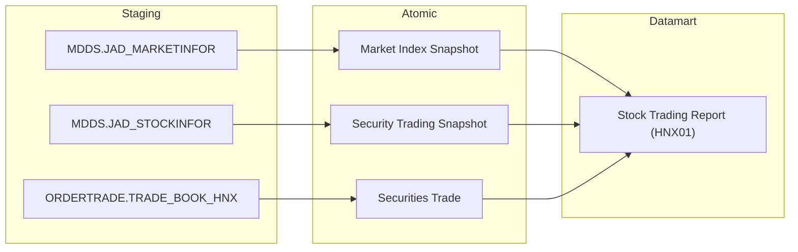

**Mục đích:** Cung cấp dữ liệu thống kê tổng hợp giao dịch thị trường cổ phiếu HNX theo định dạng biểu mẫu HNX01.

**Mô tả luồng:**

Staging → Atomic:
- **Market Index Snapshot:** Bảng lưu thông tin chỉ số thị trường lấy thông tin từ bảng MDDS.JAD_MARKETINFOR
- **Security Trading Snapshot:** Bảng lưu thông tin giao dịch chứng khoán cuối ngày lấy thông tin từ bảng MDDS.JAD_STOCKINFOR
- **Securities Trade:** Bảng lưu chi tiết khớp lệnh giao dịch lấy thông tin từ bảng ORDERTRADE.TRADE_BOOK_HNX

Atomic → Datamart:
- **Stock Trading Report (HNX01):** Bảng tác nghiệp lưu dữ liệu báo cáo giao dịch thị trường cổ phiếu HNX theo cấu trúc EAV phục vụ biểu mẫu HNX01.

---

#### 3.1.10.2.2 Nhóm thông tin Báo cáo về giao dịch trên thị trường Chứng khoán Phái sinh (TK-HNX03)

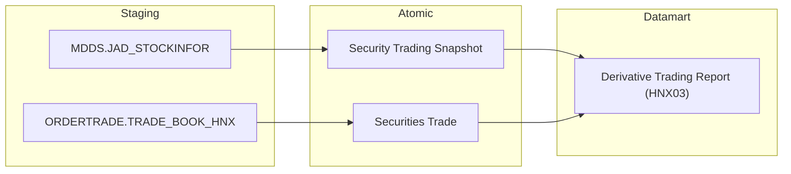

**Mục đích:** Cung cấp dữ liệu thống kê giao dịch chứng khoán phái sinh sàn HNX phục vụ biểu mẫu TK-HNX03.

**Mô tả luồng:**

Staging → Atomic:
- **Security Trading Snapshot:** Bảng lưu thông tin thị trường chứng khoán phái sinh cuối ngày lấy thông tin từ bảng MDDS.JAD_STOCKINFOR
- **Securities Trade:** Bảng lưu chi tiết khớp lệnh phái sinh lấy thông tin từ bảng ORDERTRADE.TRADE_BOOK_HNX

Atomic → Datamart:
- **Derivative Trading Report (HNX03):** Bảng tác nghiệp lưu dữ liệu báo cáo giao dịch chứng khoán phái sinh HNX theo cấu trúc EAV.

---

#### 3.1.10.2.3 Nhóm thông tin Báo cáo tổng hợp về quy mô TTCK (HNX04)

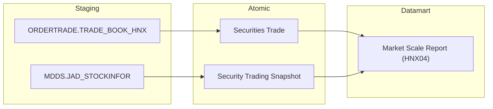

**Mục đích:** Cung cấp dữ liệu báo cáo tổng hợp về quy mô thị trường chứng khoán HNX phục vụ biểu mẫu HNX04.

**Mô tả luồng:**

Staging → Atomic:
- **Securities Trade:** Bảng lưu dữ liệu khớp lệnh chứng khoán lấy thông tin từ bảng ORDERTRADE.TRADE_BOOK_HNX
- **Security Trading Snapshot:** Bảng lưu giá trị giao dịch và vốn hóa thị trường lấy thông tin từ bảng MDDS.JAD_STOCKINFOR

Atomic → Datamart:
- **Market Scale Report (HNX04):** Bảng tác nghiệp lưu thông tin quy mô thị trường chứng khoán HNX theo cấu trúc EAV mở rộng.

---

#### 3.1.10.2.4 Nhóm thông tin Báo cáo về giao dịch trên thị trường TPDN niêm yết (TK-HNX07)

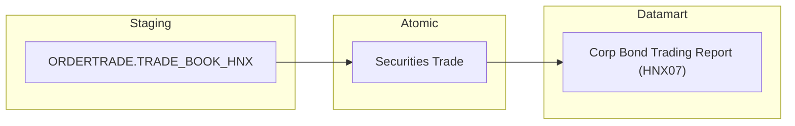

**Mục đích:** Cung cấp dữ liệu thống kê giao dịch trái phiếu doanh nghiệp niêm yết trên HNX phục vụ biểu mẫu TK-HNX07.

**Mô tả luồng:**

Staging → Atomic:
- **Securities Trade:** Bảng lưu chi tiết khớp lệnh trái phiếu doanh nghiệp lấy thông tin từ bảng ORDERTRADE.TRADE_BOOK_HNX

Atomic → Datamart:
- **Corp Bond Trading Report (HNX07):** Bảng tác nghiệp lưu dữ liệu báo cáo giao dịch TPDN niêm yết trên HNX theo cấu trúc EAV.

---

#### 3.1.10.2.5 Nhóm thông tin Báo cáo về giao dịch trên thị trường Cổ phiếu HOSE (TK-HSX01)

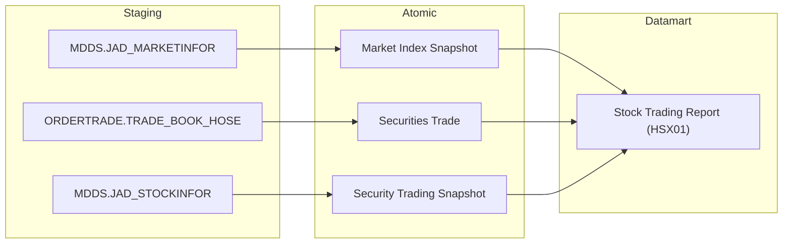

**Mục đích:** Cung cấp dữ liệu báo cáo thống kê giao dịch thị trường cổ phiếu HOSE phục vụ biểu mẫu TK-HSX01.

**Mô tả luồng:**

Staging → Atomic:
- **Market Index Snapshot:** Bảng lưu chỉ số thị trường VN-Index lấy thông tin từ bảng MDDS.JAD_MARKETINFOR
- **Securities Trade:** Bảng lưu chi tiết khớp lệnh HOSE lấy thông tin từ bảng ORDERTRADE.TRADE_BOOK_HOSE
- **Security Trading Snapshot:** Bảng lưu giá trị khớp lệnh từng mã CK lấy thông tin từ bảng MDDS.JAD_STOCKINFOR

Atomic → Datamart:
- **Stock Trading Report (HSX01):** Bảng tác nghiệp lưu dữ liệu thống kê giao dịch cổ phiếu HOSE theo cấu trúc EAV.

---

#### 3.1.10.2.6 Nhóm thông tin Báo cáo về niêm yết và giao dịch chứng khoán HOSE, kỳ tháng (HSX02)

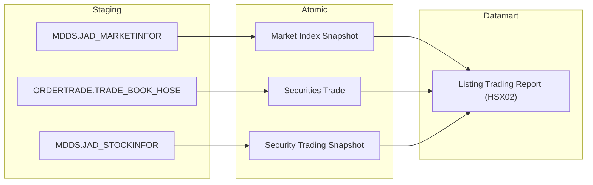

**Mục đích:** Cung cấp dữ liệu báo cáo tổng hợp niêm yết và giao dịch chứng khoán HOSE định kỳ tháng phục vụ biểu mẫu HSX02.

**Mô tả luồng:**

Staging → Atomic:
- **Market Index Snapshot:** Bảng lưu thông tin chỉ số thị trường lấy thông tin từ bảng MDDS.JAD_MARKETINFOR
- **Securities Trade:** Bảng lưu chi tiết giao dịch khớp lệnh lấy thông tin từ bảng ORDERTRADE.TRADE_BOOK_HOSE
- **Security Trading Snapshot:** Bảng lưu giá trị thị trường và vốn hóa lấy thông tin từ bảng MDDS.JAD_STOCKINFOR

Atomic → Datamart:
- **Listing Trading Report (HSX02):** Bảng tác nghiệp lưu thông tin niêm yết và giao dịch chứng khoán HOSE kỳ tháng theo cấu trúc EAV.

---

#### 3.1.10.2.7 Nhóm thông tin Báo cáo về giao dịch tự doanh của CTCK trên HOSE (TK-HSX04)

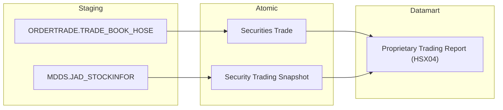

**Mục đích:** Cung cấp dữ liệu thống kê giao dịch tự doanh của các công ty chứng khoán trên sàn HOSE phục vụ biểu mẫu TK-HSX04.

**Mô tả luồng:**

Staging → Atomic:
- **Securities Trade:** Bảng lưu chi tiết khớp lệnh tự doanh CTCK lấy thông tin từ bảng ORDERTRADE.TRADE_BOOK_HOSE
- **Security Trading Snapshot:** Bảng lưu thông tin giao dịch cuối ngày lấy thông tin từ bảng MDDS.JAD_STOCKINFOR

Atomic → Datamart:
- **Proprietary Trading Report (HSX04):** Bảng tác nghiệp lưu dữ liệu báo cáo giao dịch tự doanh CTCK trên HOSE theo cấu trúc EAV.

---

#### 3.1.10.2.8 Nhóm thông tin Danh sách chứng quyền đang lưu hành (TTLK10)

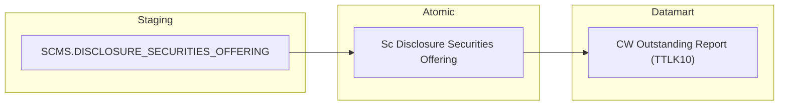

**Mục đích:** Cung cấp danh sách và thông tin chi tiết các mã chứng quyền có bảo đảm (CW) đang lưu hành phục vụ biểu mẫu TTLK10.

**Mô tả luồng:**

Staging → Atomic:
- **Sc Disclosure Securities Offering:** Bảng lưu thông tin phát hành chứng quyền có bảo đảm lấy thông tin từ bảng SCMS.DISCLOSURE_SECURITIES_OFFERING

Atomic → Datamart:
- **CW Outstanding Report (TTLK10):** Bảng tác nghiệp lưu danh sách chứng quyền đang lưu hành theo từng mã CW và kỳ báo cáo.

---

#### 3.1.10.2.9 Nhóm thông tin Báo cáo kết quả thực hiện phát hành (Biểu 0513.H.UBCK.QG)

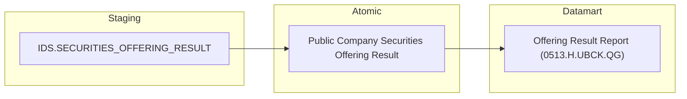

**Mục đích:** Cung cấp dữ liệu báo cáo kết quả thực hiện phát hành và chào bán chứng khoán phục vụ biểu mẫu 0513.H.UBCK.QG.

**Mô tả luồng:**

Staging → Atomic:
- **Public Company Securities Offering Result:** Bảng lưu kết quả các đợt phát hành chứng khoán lấy thông tin từ bảng IDS.SECURITIES_OFFERING_RESULT

Atomic → Datamart:
- **Offering Result Report (0513.H.UBCK.QG):** Bảng tác nghiệp lưu dữ liệu kết quả phát hành chứng khoán theo cấu trúc EAV.

---

#### 3.1.10.2.10 Nhóm thông tin Báo cáo tổng hợp thị trường chứng khoán theo quý/lũy kế (Biểu TK-04.BTC)

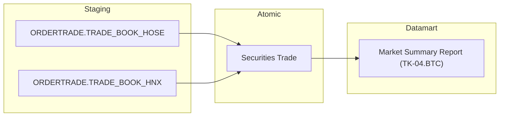

**Mục đích:** Cung cấp dữ liệu báo cáo tổng hợp thị trường chứng khoán định kỳ quý và lũy kế phục vụ biểu mẫu TK-04.BTC của Bộ Tài chính.

**Mô tả luồng:**

Staging → Atomic:
- **Securities Trade:** Bảng lưu chi tiết khớp lệnh toàn thị trường lấy thông tin từ bảng ORDERTRADE.TRADE_BOOK_HOSE và ORDERTRADE.TRADE_BOOK_HNX

Atomic → Datamart:
- **Market Summary Report (TK-04.BTC):** Bảng tác nghiệp lưu số liệu tổng hợp thị trường chứng khoán theo quý và lũy kế theo cấu trúc EAV.

---

#### 3.1.10.2.11 Nhóm thông tin Niên giám thống kê thị trường chứng khoán (TK_NienGiam)

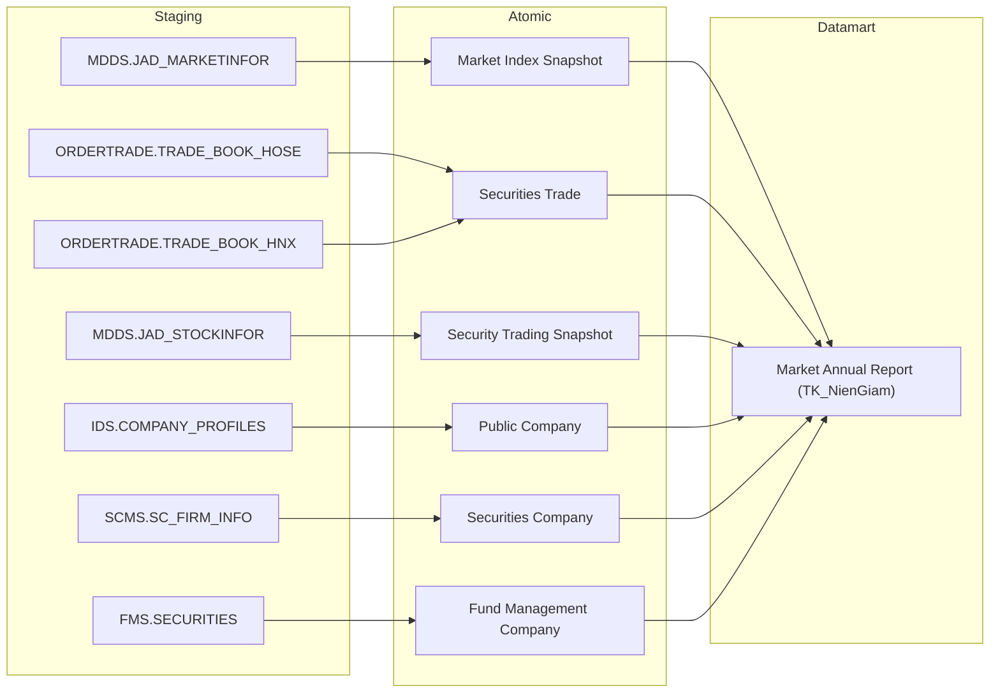

**Mục đích:** Cung cấp dữ liệu tổng hợp toàn diện thị trường chứng khoán hàng năm phục vụ xuất bản Niên giám thống kê UBCKNN.

**Mô tả luồng:**

Staging → Atomic:
- **Market Index Snapshot:** Bảng lưu chỉ số thị trường cuối năm lấy thông tin từ bảng MDDS.JAD_MARKETINFOR
- **Securities Trade:** Bảng lưu tổng giá trị giao dịch trong năm lấy thông tin từ bảng ORDERTRADE.TRADE_BOOK_HOSE và ORDERTRADE.TRADE_BOOK_HNX
- **Security Trading Snapshot:** Bảng lưu dữ liệu vốn hóa và thanh khoản lấy thông tin từ bảng MDDS.JAD_STOCKINFOR
- **Public Company:** Bảng lưu số lượng và thông tin công ty đại chúng lấy thông tin từ bảng IDS.COMPANY_PROFILES
- **Securities Company:** Bảng lưu số lượng và thông tin CTCK lấy thông tin từ bảng SCMS.SC_FIRM_INFO
- **Fund Management Company:** Bảng lưu số lượng và thông tin CTQLQ lấy thông tin từ bảng FMS.SECURITIES

Atomic → Datamart:
- **Market Annual Report (TK_NienGiam):** Bảng tác nghiệp lưu số liệu niên giám thống kê thị trường chứng khoán theo năm theo cấu trúc EAV.

---

#### 3.1.10.2.12 Nhóm thông tin Thống kê giao dịch toàn thị trường cổ phiếu (BM030a_MSS)

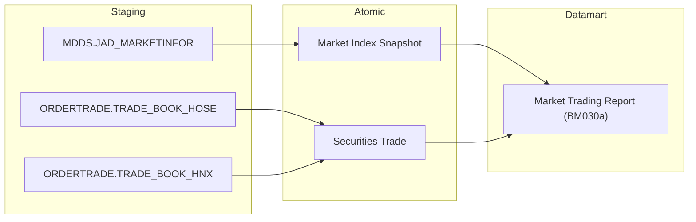

**Mục đích:** Cung cấp số liệu thống kê giao dịch toàn thị trường cổ phiếu (cộng gộp HOSE, HNX, UPCoM) hàng ngày phục vụ biểu mẫu BM030a_MSS.

**Mô tả luồng:**

Staging → Atomic:
- **Market Index Snapshot:** Bảng lưu chỉ số thị trường lấy thông tin từ bảng MDDS.JAD_MARKETINFOR
- **Securities Trade:** Bảng lưu giao dịch khớp lệnh toàn thị trường lấy thông tin từ bảng ORDERTRADE.TRADE_BOOK_HOSE và ORDERTRADE.TRADE_BOOK_HNX

Atomic → Datamart:
- **Market Trading Report (BM030a):** Bảng tác nghiệp lưu số liệu thống kê giao dịch toàn thị trường cổ phiếu theo ngày theo cấu trúc EAV.

---

#### 3.1.10.2.13 Nhóm thông tin Thống kê giao dịch toàn thị trường trái phiếu doanh nghiệp niêm yết (BM030c_MSS)

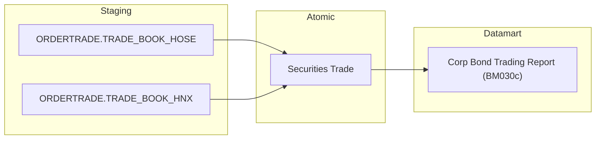

**Mục đích:** Cung cấp số liệu thống kê giao dịch thị trường trái phiếu doanh nghiệp niêm yết toàn thị trường theo ngày phục vụ biểu mẫu BM030c_MSS.

**Mô tả luồng:**

Staging → Atomic:
- **Securities Trade:** Bảng lưu chi tiết khớp lệnh trái phiếu doanh nghiệp trên 2 sàn lấy thông tin từ bảng ORDERTRADE.TRADE_BOOK_HOSE và ORDERTRADE.TRADE_BOOK_HNX

Atomic → Datamart:
- **Corp Bond Trading Report (BM030c):** Bảng tác nghiệp lưu số liệu thống kê giao dịch TPDN niêm yết theo ngày theo cấu trúc EAV.

---

#### 3.1.10.2.14 Nhóm thông tin Thống kê giao dịch thị trường chứng chỉ quỹ, ETF và CW (BM030e_MSS)


**Mục đích:** Cung cấp số liệu thống kê giao dịch thị trường CCQ, ETF và chứng quyền có bảo đảm theo ngày phục vụ biểu mẫu BM030e_MSS.

**Mô tả luồng:**

Staging → Atomic:
- **Securities Trade:** Bảng lưu chi tiết khớp lệnh CCQ, ETF, CW lấy thông tin từ bảng ORDERTRADE.TRADE_BOOK_HOSE và ORDERTRADE.TRADE_BOOK_HNX
- **Security Trading Snapshot:** Bảng lưu thông tin giao dịch cuối ngày lấy thông tin từ bảng MDDS.JAD_STOCKINFOR

Atomic → Datamart:
- **Fund Cert ETF CW Trading Report (BM030e):** Bảng tác nghiệp lưu số liệu giao dịch CCQ/ETF/CW theo ngày theo cấu trúc EAV.

---

#### 3.1.10.2.15 Nhóm thông tin Bảng dữ liệu giao dịch NĐTNN/tự doanh thị trường cổ phiếu (BM031a_MSS)

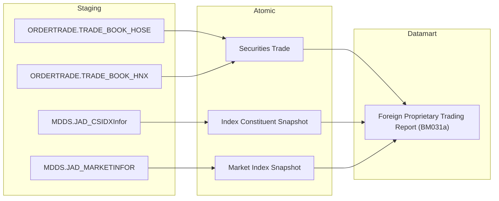

**Mục đích:** Cung cấp dữ liệu giao dịch của nhà đầu tư nước ngoài và tự doanh CTCK trên thị trường cổ phiếu theo từng rổ chỉ số phục vụ biểu mẫu BM031a_MSS.

**Mô tả luồng:**

Staging → Atomic:
- **Securities Trade:** Bảng lưu chi tiết khớp lệnh NĐTNN và tự doanh lấy thông tin từ bảng ORDERTRADE.TRADE_BOOK_HOSE và ORDERTRADE.TRADE_BOOK_HNX
- **Index Constituent Snapshot:** Bảng lưu danh mục thành phần các rổ chỉ số lấy thông tin từ bảng MDDS.JAD_CSIDXInfor
- **Market Index Snapshot:** Bảng lưu chỉ số thị trường lấy thông tin từ bảng MDDS.JAD_MARKETINFOR

Atomic → Datamart:
- **Foreign Proprietary Trading Report (BM031a):** Bảng tác nghiệp lưu dữ liệu giao dịch NĐTNN và tự doanh cổ phiếu theo ngày theo cấu trúc EAV.

---

#### 3.1.10.2.16 Nhóm thông tin Bảng dữ liệu giao dịch NĐTNN/tự doanh thị trường TPCP (BM031b_MSS)

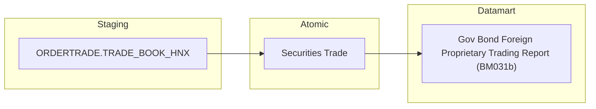

**Mục đích:** Cung cấp dữ liệu giao dịch NĐTNN và tự doanh trên thị trường Trái phiếu Chính phủ phục vụ biểu mẫu BM031b_MSS.

**Mô tả luồng:**

Staging → Atomic:
- **Securities Trade:** Bảng lưu chi tiết khớp lệnh trái phiếu chính phủ lấy thông tin từ bảng ORDERTRADE.TRADE_BOOK_HNX

Atomic → Datamart:
- **Gov Bond Foreign Proprietary Trading Report (BM031b):** Bảng tác nghiệp lưu dữ liệu giao dịch NĐTNN/tự doanh TPCP theo ngày theo cấu trúc EAV.

---

#### 3.1.10.2.17 Nhóm thông tin Bảng dữ liệu giao dịch NĐTNN/tự doanh thị trường TPDN niêm yết (BM031C_MSS)

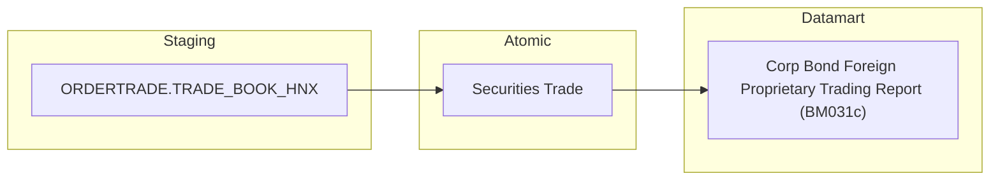

**Mục đích:** Cung cấp dữ liệu giao dịch NĐTNN và tự doanh trên thị trường Trái phiếu doanh nghiệp niêm yết phục vụ biểu mẫu BM031C_MSS.

**Mô tả luồng:**

Staging → Atomic:
- **Securities Trade:** Bảng lưu chi tiết khớp lệnh TPDN niêm yết lấy thông tin từ bảng ORDERTRADE.TRADE_BOOK_HNX

Atomic → Datamart:
- **Corp Bond Foreign Proprietary Trading Report (BM031c):** Bảng tác nghiệp lưu dữ liệu giao dịch NĐTNN/tự doanh TPDN niêm yết theo ngày theo cấu trúc EAV.

---

#### 3.1.10.2.18 Nhóm thông tin Bảng dữ liệu giao dịch NĐTNN/tự doanh thị trường CCQ, ETF, CW (BM031d_MSS)

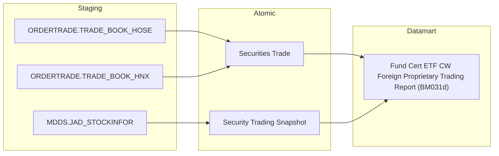

**Mục đích:** Cung cấp dữ liệu giao dịch NĐTNN và tự doanh trên thị trường CCQ, ETF và chứng quyền phục vụ biểu mẫu BM031d_MSS.

**Mô tả luồng:**

Staging → Atomic:
- **Securities Trade:** Bảng lưu chi tiết khớp lệnh CCQ/ETF/CW lấy thông tin từ bảng ORDERTRADE.TRADE_BOOK_HOSE và ORDERTRADE.TRADE_BOOK_HNX
- **Security Trading Snapshot:** Bảng lưu thông tin thị trường cuối ngày lấy thông tin từ bảng MDDS.JAD_STOCKINFOR

Atomic → Datamart:
- **Fund Cert ETF CW Foreign Proprietary Trading Report (BM031d):** Bảng tác nghiệp lưu dữ liệu giao dịch NĐTNN/tự doanh CCQ/ETF/CW theo ngày theo cấu trúc EAV.

---

#### 3.1.10.2.19 Nhóm thông tin Thống kê giao dịch thị trường chứng khoán phái sinh (BM031f_MSS)

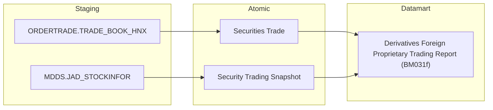

**Mục đích:** Cung cấp số liệu thống kê giao dịch chứng khoán phái sinh của NĐTNN và tự doanh phục vụ biểu mẫu BM031f_MSS.

**Mô tả luồng:**

Staging → Atomic:
- **Securities Trade:** Bảng lưu chi tiết khớp lệnh hợp đồng tương lai lấy thông tin từ bảng ORDERTRADE.TRADE_BOOK_HNX
- **Security Trading Snapshot:** Bảng lưu thông tin giao dịch phái sinh cuối ngày lấy thông tin từ bảng MDDS.JAD_STOCKINFOR

Atomic → Datamart:
- **Derivatives Foreign Proprietary Trading Report (BM031f):** Bảng tác nghiệp lưu dữ liệu thống kê giao dịch CKPS NĐTNN/tự doanh theo ngày theo cấu trúc EAV.

---

#### 3.1.10.2.20 Nhóm thông tin Thống kê thông tin giao dịch của từng mã chứng khoán (BM035_MSS)

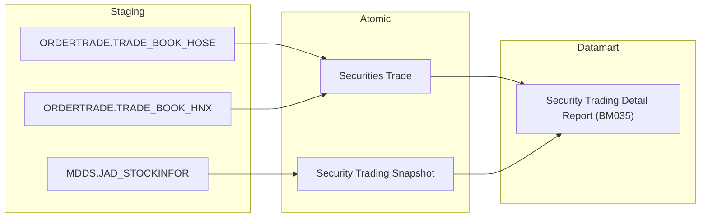

**Mục đích:** Cung cấp thông tin giao dịch chi tiết theo từng mã chứng khoán trong ngày giao dịch phục vụ biểu mẫu BM035_MSS.

**Mô tả luồng:**

Staging → Atomic:
- **Securities Trade:** Bảng lưu chi tiết khớp lệnh từng mã chứng khoán lấy thông tin từ bảng ORDERTRADE.TRADE_BOOK_HOSE và ORDERTRADE.TRADE_BOOK_HNX
- **Security Trading Snapshot:** Bảng lưu giá mở cửa, cao nhất, thấp nhất, đóng cửa của từng mã CK lấy thông tin từ bảng MDDS.JAD_STOCKINFOR

Atomic → Datamart:
- **Security Trading Detail Report (BM035):** Bảng tác nghiệp lưu dữ liệu thống kê giao dịch chi tiết theo từng mã CK theo ngày theo cấu trúc EAV.

---

#### 3.1.10.2.21 Nhóm thông tin Thị trường chứng khoán phái sinh - chi tiết từng mã (BM043_MSS)

```mermaid
flowchart LR
    subgraph Staging
        ORDERTRADE_TRADE_BOOK_HNX["ORDERTRADE.TRADE_BOOK_HNX"]
        MDDS_JAD_STOCKINFOR["MDDS.JAD_STOCKINFOR"]
    end
    subgraph Atomic
        Securities_Trade["Securities Trade"]
        Security_Trading_Snapshot["Security Trading Snapshot"]
    end
    subgraph Datamart
        bm043mss_derivatives_security_detail_rpt["Derivatives Security Detail Report (BM043)"]
    end
    ORDERTRADE_TRADE_BOOK_HNX --> Securities_Trade
    MDDS_JAD_STOCKINFOR --> Security_Trading_Snapshot
    Securities_Trade --> bm043mss_derivatives_security_detail_rpt
    Security_Trading_Snapshot --> bm043mss_derivatives_security_detail_rpt
```

**Mục đích:** Cung cấp thông tin giao dịch chi tiết theo từng mã hợp đồng tương lai trên thị trường phái sinh phục vụ biểu mẫu BM043_MSS.

**Mô tả luồng:**

Staging → Atomic:
- **Securities Trade:** Bảng lưu chi tiết khớp lệnh từng mã hợp đồng tương lai lấy thông tin từ bảng ORDERTRADE.TRADE_BOOK_HNX
- **Security Trading Snapshot:** Bảng lưu giá và khối lượng mở (OI) của từng mã HĐTL lấy thông tin từ bảng MDDS.JAD_STOCKINFOR

Atomic → Datamart:
- **Derivatives Security Detail Report (BM043):** Bảng tác nghiệp lưu dữ liệu giao dịch chi tiết từng mã chứng khoán phái sinh theo ngày theo cấu trúc EAV.
