# 3. KHO DỮ LIỆU (OLAP) — Thống kê Thị trường

## 3.1 Mô hình dữ liệu mức High Level / Conceptual

### 3.1.1 Sơ đồ ERD

```mermaid
erDiagram
    STOCK_TRADING_REPORT_HNX01
    DERIVATIVE_TRADING_REPORT_HNX03
    MARKET_SCALE_REPORT_HNX04
    CORP_BOND_TRADING_REPORT_HNX07
    STOCK_TRADING_REPORT_HSX01
    LISTING_TRADING_REPORT_HSX02
    PROPRIETARY_TRADING_REPORT_HSX04
    CW_OUTSTANDING_REPORT_TTLK10
    OFFERING_RESULT_REPORT_0513_H_UBCK_QG
    MARKET_SUMMARY_REPORT_TK_04_BTC
    MARKET_ANNUAL_REPORT_TK_NIENGIAM
    MARKET_TRADING_REPORT_BM030A
    CORP_BOND_TRADING_REPORT_BM030C
    FUND_CERT_ETF_CW_TRADING_REPORT_BM030E
    FOREIGN_PROPRIETARY_TRADING_REPORT_BM031A
    GOV_BOND_FOREIGN_PROPRIETARY_TRADING_REPORT_BM031B
    CORP_BOND_FOREIGN_PROPRIETARY_TRADING_REPORT_BM031C
    FUND_CERT_ETF_CW_FOREIGN_PROPRIETARY_TRADING_REPORT_BM031D
    DERIVATIVES_FOREIGN_PROPRIETARY_TRADING_REPORT_BM031F
    SECURITY_TRADING_DETAIL_REPORT_BM035
    DERIVATIVES_SECURITY_DETAIL_REPORT_BM043
```

### 3.1.2 Danh sách thực thể

| STT | Thực thể | Tên bảng | Mô tả |
|---|---|---|---|
| 1 | Stock Trading Report (HNX01) | hnx01_stock_trading_rpt | Báo cáo giao dịch thị trường cổ phiếu HNX theo kỳ — cấu trúc EAV 1 dòng/1 chỉ tiêu |
| 2 | Derivative Trading Report (HNX03) | hnx03_derivative_trading_rpt | Báo cáo giao dịch thị trường CKPS (HNX) theo kỳ — cấu trúc EAV 1 dòng/1 chỉ tiêu |
| 3 | Market Scale Report (HNX04) | hnx04_market_scale_rpt | Báo cáo tổng hợp quy mô TTCK HNX — EAV mở rộng period_type (trong_ky/cong_don) |
| 4 | Corp Bond Trading Report (HNX07) | hnx07_corp_bond_trading_rpt | Báo cáo giao dịch TPDN niêm yết trên HNX theo kỳ — cấu trúc EAV 1 dòng/1 chỉ tiêu |
| 5 | Stock Trading Report (HSX01) | hsx01_stock_trading_rpt | Báo cáo giao dịch thị trường cổ phiếu HOSE theo kỳ — cấu trúc EAV 1 dòng/1 chỉ tiêu |
| 6 | Listing Trading Report (HSX02) | hsx02_listing_trading_rpt | Báo cáo niêm yết và giao dịch chứng khoán HOSE kỳ tháng — EAV mở rộng period_type |
| 7 | Proprietary Trading Report (HSX04) | hsx04_proprietary_trading_rpt | Báo cáo giao dịch tự doanh của CTCK trên HOSE theo kỳ — cấu trúc EAV 1 dòng/1 chỉ tiêu |
| 8 | CW Outstanding Report (TTLK10) | ttlk10_cw_outstanding_rpt | Danh sách chứng quyền đang lưu hành — bảng danh sách (list-detail), 1 dòng/1 mã CW/1 kỳ |
| 9 | Offering Result Report (0513.H.UBCK.QG) | 0513hubckqg_offering_result_rpt | Báo cáo kết quả thực hiện phát hành chứng khoán — cấu trúc EAV 1 dòng/1 chỉ tiêu |
| 10 | Market Summary Report (TK-04.BTC) | tk04btc_market_summary_rpt | Báo cáo tổng hợp TTCK theo quý/lũy kế — EAV mở rộng period_marker (Q1/Q2/Q3) + measure_type |
| 11 | Market Annual Report (TK_NienGiam) | tkniengiam_market_annual_rpt | Niên giám thống kê thị trường chứng khoán theo năm — cấu trúc EAV cơ bản 1 dòng/1 chỉ tiêu/1 năm |
| 12 | Market Trading Report (BM030a) | bm030amss_market_trading_rpt | Thống kê giao dịch toàn thị trường cổ phiếu theo ngày (cộng gộp HOSE+HNX+UPCoM) — EAV 1 dòng/1 chỉ tiêu |
| 13 | Corp Bond Trading Report (BM030c) | bm030cmss_corp_bond_trading_rpt | Thống kê giao dịch toàn thị trường TPDN niêm yết theo ngày (cộng gộp 2 sàn) — EAV 1 dòng/1 chỉ tiêu |
| 14 | Fund Cert ETF CW Trading Report (BM030e) | bm030emss_fund_cert_etf_cw_trading_rpt | Thống kê giao dịch thị trường CCQ/ETF/CW toàn thị trường theo ngày — EAV 1 dòng/1 chỉ tiêu |
| 15 | Foreign Proprietary Trading Report (BM031a) | bm031amss_foreign_proprietary_trading_rpt | Giao dịch NĐTNN/tự doanh thị trường cổ phiếu theo ngày, breakdown theo chỉ số — EAV 1 dòng/1 chỉ tiêu |
| 16 | Gov Bond Foreign Proprietary Trading Report (BM031b) | bm031bmss_gov_bond_foreign_proprietary_trading_rpt | Giao dịch NĐTNN/tự doanh thị trường TPCP theo ngày — EAV 1 dòng/1 chỉ tiêu |
| 17 | Corp Bond Foreign Proprietary Trading Report (BM031c) | bm031cmss_corp_bond_foreign_proprietary_trading_rpt | Giao dịch NĐTNN/tự doanh thị trường TPDN niêm yết theo ngày — EAV 1 dòng/1 chỉ tiêu |
| 18 | Fund Cert ETF CW Foreign Proprietary Trading Report (BM031d) | bm031dmss_fund_cert_etf_cw_foreign_proprietary_trading_rpt | Giao dịch NĐTNN/tự doanh thị trường CCQ/ETF/CW theo ngày — EAV 1 dòng/1 chỉ tiêu |
| 19 | Derivatives Foreign Proprietary Trading Report (BM031f) | bm031fmss_derivatives_foreign_proprietary_trading_rpt | Thống kê giao dịch thị trường CKPS (NĐTNN/tự doanh) theo ngày — EAV 1 dòng/1 chỉ tiêu |
| 20 | Security Trading Detail Report (BM035) | bm035mss_security_trading_detail_rpt | Thống kê giao dịch chi tiết theo TỪNG MÃ chứng khoán theo ngày — EAV 1 dòng/1 chỉ tiêu/1 mã CK |
| 21 | Derivatives Security Detail Report (BM043) | bm043mss_derivatives_security_detail_rpt | Thị trường CKPS chi tiết theo từng mã hợp đồng theo ngày — EAV 1 dòng/1 chỉ tiêu/1 mã CK |

---

## 3.2 Mô hình dữ liệu mức Logic

### 3.2.1 Sơ đồ ERD

```mermaid
erDiagram
    OFFERING_RESULT_REPORT_0513_H_UBCK_QG["Offering Result Report (0513.H.UBCK.QG)"] {
        string Report_Code
        date Report_Period_Date
        string Item_Code PK
        int Item_STT
        string Item_Unit
        float Item_Value
        string Source_System_Code
    }
    MARKET_TRADING_REPORT_BM030A["Market Trading Report (BM030a)"] {
        string Report_Code
        date Report_Period_Date
        string Item_Code PK
        int Item_STT
        string Item_Unit
        float Item_Value
        string Source_System_Code
    }
    CORP_BOND_TRADING_REPORT_BM030C["Corp Bond Trading Report (BM030c)"] {
        string Report_Code
        date Report_Period_Date
        string Item_Code PK
        int Item_STT
        string Item_Unit
        float Item_Value
        string Source_System_Code
    }
    FUND_CERT_ETF_CW_TRADING_REPORT_BM030E["Fund Cert ETF CW Trading Report (BM030e)"] {
        string Report_Code
        date Report_Period_Date
        string Item_Code PK
        int Item_STT
        string Item_Unit
        float Item_Value
        string Source_System_Code
    }
    FOREIGN_PROPRIETARY_TRADING_REPORT_BM031A["Foreign Proprietary Trading Report (BM031a)"] {
        string Report_Code
        date Report_Period_Date
        string Item_Code PK
        int Item_STT
        string Item_Unit
        float Item_Value
        string Source_System_Code
    }
    GOV_BOND_FOREIGN_PROPRIETARY_TRADING_REPORT_BM031B["Gov Bond Foreign Proprietary Trading Report (BM031b)"] {
        string Report_Code
        date Report_Period_Date
        string Item_Code PK
        int Item_STT
        string Item_Unit
        float Item_Value
        string Source_System_Code
    }
    CORP_BOND_FOREIGN_PROPRIETARY_TRADING_REPORT_BM031C["Corp Bond Foreign Proprietary Trading Report (BM031c)"] {
        string Report_Code
        date Report_Period_Date
        string Item_Code PK
        int Item_STT
        string Item_Unit
        float Item_Value
        string Source_System_Code
    }
    FUND_CERT_ETF_CW_FOREIGN_PROPRIETARY_TRADING_REPORT_BM031D["Fund Cert ETF CW Foreign Proprietary Trading Report (BM031d)"] {
        string Report_Code
        date Report_Period_Date
        string Item_Code PK
        int Item_STT
        string Item_Unit
        float Item_Value
        string Source_System_Code
    }
    DERIVATIVES_FOREIGN_PROPRIETARY_TRADING_REPORT_BM031F["Derivatives Foreign Proprietary Trading Report (BM031f)"] {
        string Report_Code
        date Report_Period_Date
        string Item_Code PK
        int Item_STT
        string Item_Unit
        float Item_Value
        string Source_System_Code
    }
    SECURITY_TRADING_DETAIL_REPORT_BM035["Security Trading Detail Report (BM035)"] {
        string Report_Code
        date Report_Period_Date
        string Item_Code PK
        string Security_Symbol_Code
        int Item_STT
        string Item_Unit
        float Item_Value
        string Source_System_Code
    }
    DERIVATIVES_SECURITY_DETAIL_REPORT_BM043["Derivatives Security Detail Report (BM043)"] {
        string Report_Code
        date Report_Period_Date
        string Item_Code PK
        string Security_Symbol_Code
        int Item_STT
        string Item_Unit
        float Item_Value
        string Source_System_Code
    }
    STOCK_TRADING_REPORT_HNX01["Stock Trading Report (HNX01)"] {
        string Report_Code
        date Report_Period_Date
        string Item_Code PK
        int Item_STT
        string Item_Unit
        float Item_Value
        string Source_System_Code
    }
    DERIVATIVE_TRADING_REPORT_HNX03["Derivative Trading Report (HNX03)"] {
        string Report_Code
        date Report_Period_Date
        string Item_Code PK
        int Item_STT
        string Item_Unit
        float Item_Value
        string Source_System_Code
    }
    MARKET_SCALE_REPORT_HNX04["Market Scale Report (HNX04)"] {
        string Report_Code
        date Report_Period_Date
        string Item_Code PK
        string Period_Type
        int Item_STT
        string Item_Unit
        float Item_Value
        string Source_System_Code
    }
    CORP_BOND_TRADING_REPORT_HNX07["Corp Bond Trading Report (HNX07)"] {
        string Report_Code
        date Report_Period_Date
        string Item_Code PK
        int Item_STT
        string Item_Unit
        float Item_Value
        string Source_System_Code
    }
    STOCK_TRADING_REPORT_HSX01["Stock Trading Report (HSX01)"] {
        string Report_Code
        date Report_Period_Date
        string Item_Code PK
        int Item_STT
        string Item_Unit
        float Item_Value
        string Source_System_Code
    }
    LISTING_TRADING_REPORT_HSX02["Listing Trading Report (HSX02)"] {
        string Report_Code
        date Report_Period_Date
        string Item_Code PK
        string Period_Type
        int Item_STT
        string Item_Unit
        float Item_Value
        string Source_System_Code
    }
    PROPRIETARY_TRADING_REPORT_HSX04["Proprietary Trading Report (HSX04)"] {
        string Report_Code
        date Report_Period_Date
        string Item_Code PK
        int Item_STT
        string Item_Unit
        float Item_Value
        string Source_System_Code
    }
    MARKET_SUMMARY_REPORT_TK_04_BTC["Market Summary Report (TK-04.BTC)"] {
        string Report_Code
        date Report_Period_Date
        string Item_Code PK
        string Period_Marker
        string Measure_Type
        int Item_STT
        string Item_Unit
        float Item_Value
        string Source_System_Code
    }
    MARKET_ANNUAL_REPORT_TK_NIENGIAM["Market Annual Report (TK_NienGiam)"] {
        string Report_Code
        date Report_Period_Date
        string Item_Code PK
        int Item_STT
        string Item_Unit
        float Item_Value
        string Source_System_Code
    }
    CW_OUTSTANDING_REPORT_TTLK10["CW Outstanding Report (TTLK10)"] {
        string Report_Code
        date Report_Period_Date
        string Listed_CW_Code PK
        string Covered_Warrant_Name
        int Outstanding_Quantity
        string Source_System_Code
    }
```

### 3.2.2 Danh sách các bảng và thuộc tính

#### 3.2.2.1 Bảng Offering Result Report (0513.H.UBCK.QG)

| STT | Tên trường | Kiểu dữ liệu và độ dài | Nullable | Unique | P/F Key | Mặc định | Mô tả |
|---|---|---|---|---|---|---|---|
| 1 | Report Code | string |  |  |  | | Mã báo cáo, hằng số cố định cho mọi dòng bảng này |
| 2 | Report Period Date | date |  |  |  | | Kỳ báo cáo (ngày kết quả phát hành) |
| 3 | Item Code | string |  | X | P | | Mã chỉ tiêu EAV, gán theo danh mục cố định của mẫu biểu 0513.H |
| 4 | Item STT | int |  |  |  | | Số thứ tự hiển thị của chỉ tiêu theo đúng layout mẫu biểu gốc |
| 5 | Item Unit | string | X |  |  | | Đơn vị tính của chỉ tiêu |
| 6 | Item Value | float | X |  |  | | Giá trị chỉ tiêu — populate theo item_code, số lượng hoặc giá trị kết quả phát hành chứng khoán theo hình thức phát hành |
| 7 | Source System Code | string |  |  |  | | Mã hệ thống nguồn dữ liệu của báo cáo |

#### 3.2.2.2 Bảng Market Trading Report (BM030a)

| STT | Tên trường | Kiểu dữ liệu và độ dài | Nullable | Unique | P/F Key | Mặc định | Mô tả |
|---|---|---|---|---|---|---|---|
| 1 | Report Code | string |  |  |  | | Mã báo cáo, hằng số cố định cho mọi dòng bảng này |
| 2 | Report Period Date | date |  |  |  | | Kỳ báo cáo |
| 3 | Item Code | string |  | X | P | | Mã chỉ tiêu EAV, gán theo danh mục cố định của mẫu biểu BM030a_MSS |
| 4 | Item STT | int |  |  |  | | Số thứ tự hiển thị của chỉ tiêu theo đúng layout mẫu biểu gốc |
| 5 | Item Unit | string | X |  |  | | Đơn vị tính của chỉ tiêu |
| 6 | Item Value | float | X |  |  | | Giá trị chỉ tiêu — populate theo item_code, chỉ số thị trường hoặc khối lượng/giá trị giao dịch cổ phiếu toàn thị trường (cộng gộp HOSE+HNX+UPCoM) |
| 7 | Source System Code | string |  |  |  | | Mã hệ thống nguồn dữ liệu của báo cáo |

#### 3.2.2.3 Bảng Corp Bond Trading Report (BM030c)

| STT | Tên trường | Kiểu dữ liệu và độ dài | Nullable | Unique | P/F Key | Mặc định | Mô tả |
|---|---|---|---|---|---|---|---|
| 1 | Report Code | string |  |  |  | | Mã báo cáo, hằng số cố định cho mọi dòng bảng này |
| 2 | Report Period Date | date |  |  |  | | Kỳ báo cáo |
| 3 | Item Code | string |  | X | P | | Mã chỉ tiêu EAV, gán theo danh mục cố định của mẫu biểu BM030c_MSS |
| 4 | Item STT | int |  |  |  | | Số thứ tự hiển thị của chỉ tiêu theo đúng layout mẫu biểu gốc |
| 5 | Item Unit | string | X |  |  | | Đơn vị tính của chỉ tiêu |
| 6 | Item Value | float | X |  |  | | Giá trị chỉ tiêu — populate theo item_code, khối lượng/giá trị giao dịch TPDN niêm yết toàn thị trường (cộng gộp HOSE+HNX) |
| 7 | Source System Code | string |  |  |  | | Mã hệ thống nguồn dữ liệu của báo cáo |

#### 3.2.2.4 Bảng Fund Cert ETF CW Trading Report (BM030e)

| STT | Tên trường | Kiểu dữ liệu và độ dài | Nullable | Unique | P/F Key | Mặc định | Mô tả |
|---|---|---|---|---|---|---|---|
| 1 | Report Code | string |  |  |  | | Mã báo cáo, hằng số cố định cho mọi dòng bảng này |
| 2 | Report Period Date | date |  |  |  | | Kỳ báo cáo |
| 3 | Item Code | string |  | X | P | | Mã chỉ tiêu EAV, gán theo danh mục cố định của mẫu biểu BM030e_MSS |
| 4 | Item STT | int |  |  |  | | Số thứ tự hiển thị của chỉ tiêu theo đúng layout mẫu biểu gốc |
| 5 | Item Unit | string | X |  |  | | Đơn vị tính của chỉ tiêu |
| 6 | Item Value | float | X |  |  | | Giá trị chỉ tiêu — populate theo item_code, khối lượng/giá trị giao dịch CCQ/ETF/CW toàn thị trường (cộng gộp HOSE+HNX) |
| 7 | Source System Code | string |  |  |  | | Mã hệ thống nguồn dữ liệu của báo cáo |

#### 3.2.2.5 Bảng Foreign Proprietary Trading Report (BM031a)

| STT | Tên trường | Kiểu dữ liệu và độ dài | Nullable | Unique | P/F Key | Mặc định | Mô tả |
|---|---|---|---|---|---|---|---|
| 1 | Report Code | string |  |  |  | | Mã báo cáo, hằng số cố định cho mọi dòng bảng này |
| 2 | Report Period Date | date |  |  |  | | Kỳ báo cáo |
| 3 | Item Code | string |  | X | P | | Mã chỉ tiêu EAV, gán theo danh mục cố định của mẫu biểu BM031a_MSS |
| 4 | Item STT | int |  |  |  | | Số thứ tự hiển thị của chỉ tiêu theo đúng layout mẫu biểu gốc |
| 5 | Item Unit | string | X |  |  | | Đơn vị tính của chỉ tiêu |
| 6 | Item Value | float | X |  |  | | Giá trị chỉ tiêu — populate theo item_code và chỉ số breakdown, khối lượng/giá trị giao dịch NĐTNN/tự doanh thị trường cổ phiếu theo từng chỉ số (VNIndex/HNXIndex/HNX30/VN30) |
| 7 | Source System Code | string |  |  |  | | Mã hệ thống nguồn dữ liệu của báo cáo |

#### 3.2.2.6 Bảng Gov Bond Foreign Proprietary Trading Report (BM031b)

| STT | Tên trường | Kiểu dữ liệu và độ dài | Nullable | Unique | P/F Key | Mặc định | Mô tả |
|---|---|---|---|---|---|---|---|
| 1 | Report Code | string |  |  |  | | Mã báo cáo, hằng số cố định cho mọi dòng bảng này |
| 2 | Report Period Date | date |  |  |  | | Kỳ báo cáo |
| 3 | Item Code | string |  | X | P | | Mã chỉ tiêu EAV, gán theo danh mục cố định của mẫu biểu BM031b_MSS |
| 4 | Item STT | int |  |  |  | | Số thứ tự hiển thị của chỉ tiêu theo đúng layout mẫu biểu gốc |
| 5 | Item Unit | string | X |  |  | | Đơn vị tính của chỉ tiêu |
| 6 | Item Value | float | X |  |  | | Giá trị chỉ tiêu — populate theo item_code, khối lượng/giá trị giao dịch NĐTNN/tự doanh thị trường TPCP (chỉ HNX) |
| 7 | Source System Code | string |  |  |  | | Mã hệ thống nguồn dữ liệu của báo cáo |

#### 3.2.2.7 Bảng Corp Bond Foreign Proprietary Trading Report (BM031c)

| STT | Tên trường | Kiểu dữ liệu và độ dài | Nullable | Unique | P/F Key | Mặc định | Mô tả |
|---|---|---|---|---|---|---|---|
| 1 | Report Code | string |  |  |  | | Mã báo cáo, hằng số cố định cho mọi dòng bảng này |
| 2 | Report Period Date | date |  |  |  | | Kỳ báo cáo |
| 3 | Item Code | string |  | X | P | | Mã chỉ tiêu EAV, gán theo danh mục cố định của mẫu biểu BM031C_MSS |
| 4 | Item STT | int |  |  |  | | Số thứ tự hiển thị của chỉ tiêu theo đúng layout mẫu biểu gốc |
| 5 | Item Unit | string | X |  |  | | Đơn vị tính của chỉ tiêu |
| 6 | Item Value | float | X |  |  | | Giá trị chỉ tiêu — populate theo item_code, khối lượng/giá trị giao dịch NĐTNN/tự doanh thị trường TPDN niêm yết (chỉ HNX) |
| 7 | Source System Code | string |  |  |  | | Mã hệ thống nguồn dữ liệu của báo cáo |

#### 3.2.2.8 Bảng Fund Cert ETF CW Foreign Proprietary Trading Report (BM031d)

| STT | Tên trường | Kiểu dữ liệu và độ dài | Nullable | Unique | P/F Key | Mặc định | Mô tả |
|---|---|---|---|---|---|---|---|
| 1 | Report Code | string |  |  |  | | Mã báo cáo, hằng số cố định cho mọi dòng bảng này |
| 2 | Report Period Date | date |  |  |  | | Kỳ báo cáo |
| 3 | Item Code | string |  | X | P | | Mã chỉ tiêu EAV, gán theo danh mục cố định của mẫu biểu BM031d_MSS |
| 4 | Item STT | int |  |  |  | | Số thứ tự hiển thị của chỉ tiêu theo đúng layout mẫu biểu gốc |
| 5 | Item Unit | string | X |  |  | | Đơn vị tính của chỉ tiêu |
| 6 | Item Value | float | X |  |  | | Giá trị chỉ tiêu — populate theo item_code, khối lượng/giá trị giao dịch NĐTNN/tự doanh thị trường CCQ/ETF/CW |
| 7 | Source System Code | string |  |  |  | | Mã hệ thống nguồn dữ liệu của báo cáo |

#### 3.2.2.9 Bảng Derivatives Foreign Proprietary Trading Report (BM031f)

| STT | Tên trường | Kiểu dữ liệu và độ dài | Nullable | Unique | P/F Key | Mặc định | Mô tả |
|---|---|---|---|---|---|---|---|
| 1 | Report Code | string |  |  |  | | Mã báo cáo, hằng số cố định cho mọi dòng bảng này |
| 2 | Report Period Date | date |  |  |  | | Kỳ báo cáo |
| 3 | Item Code | string |  | X | P | | Mã chỉ tiêu EAV, gán theo danh mục cố định của mẫu biểu BM031f_MSS |
| 4 | Item STT | int |  |  |  | | Số thứ tự hiển thị của chỉ tiêu theo đúng layout mẫu biểu gốc |
| 5 | Item Unit | string | X |  |  | | Đơn vị tính của chỉ tiêu |
| 6 | Item Value | float | X |  |  | | Giá trị chỉ tiêu — populate theo item_code, số lượng mã/khối lượng/giá trị giao dịch CKPS toàn thị trường và NĐTNN/tự doanh |
| 7 | Source System Code | string |  |  |  | | Mã hệ thống nguồn dữ liệu của báo cáo |

#### 3.2.2.10 Bảng Security Trading Detail Report (BM035)

| STT | Tên trường | Kiểu dữ liệu và độ dài | Nullable | Unique | P/F Key | Mặc định | Mô tả |
|---|---|---|---|---|---|---|---|
| 1 | Report Code | string |  |  |  | | Mã báo cáo, hằng số cố định cho mọi dòng bảng này |
| 2 | Report Period Date | date |  |  |  | | Kỳ báo cáo |
| 3 | Item Code | string |  | X | P | | Mã chỉ tiêu EAV, gán theo danh mục cố định của mẫu biểu BM035_MSS |
| 4 | Security Symbol Code | string |  |  |  | | Mã chứng khoán/hợp đồng, 1 phần composite key (grain chi tiết theo từng mã) |
| 5 | Item STT | int |  |  |  | | Số thứ tự hiển thị của chỉ tiêu theo đúng layout mẫu biểu gốc |
| 6 | Item Unit | string | X |  |  | | Đơn vị tính của chỉ tiêu |
| 7 | Item Value | float | X |  |  | | Giá trị chỉ tiêu — populate theo item_code và mã CK, giá/khối lượng/giá trị giao dịch, GD NĐTNN/tự doanh chi tiết theo từng mã chứng khoán |
| 8 | Source System Code | string |  |  |  | | Mã hệ thống nguồn dữ liệu của báo cáo |

#### 3.2.2.11 Bảng Derivatives Security Detail Report (BM043)

| STT | Tên trường | Kiểu dữ liệu và độ dài | Nullable | Unique | P/F Key | Mặc định | Mô tả |
|---|---|---|---|---|---|---|---|
| 1 | Report Code | string |  |  |  | | Mã báo cáo, hằng số cố định cho mọi dòng bảng này |
| 2 | Report Period Date | date |  |  |  | | Kỳ báo cáo |
| 3 | Item Code | string |  | X | P | | Mã chỉ tiêu EAV, gán theo danh mục cố định của mẫu biểu BM043_MSS |
| 4 | Security Symbol Code | string |  |  |  | | Mã chứng khoán/hợp đồng, 1 phần composite key (grain chi tiết theo từng mã) |
| 5 | Item STT | int |  |  |  | | Số thứ tự hiển thị của chỉ tiêu theo đúng layout mẫu biểu gốc |
| 6 | Item Unit | string | X |  |  | | Đơn vị tính của chỉ tiêu |
| 7 | Item Value | float | X |  |  | | Giá trị chỉ tiêu — populate theo item_code và mã hợp đồng, thời gian đáo hạn/khối lượng/giá trị giao dịch, GD NĐTNN/tự doanh chi tiết theo từng mã CKPS |
| 8 | Source System Code | string |  |  |  | | Mã hệ thống nguồn dữ liệu của báo cáo |

#### 3.2.2.12 Bảng Stock Trading Report (HNX01)

| STT | Tên trường | Kiểu dữ liệu và độ dài | Nullable | Unique | P/F Key | Mặc định | Mô tả |
|---|---|---|---|---|---|---|---|
| 1 | Report Code | string |  |  |  | | Mã báo cáo, hằng số cố định cho mọi dòng bảng này |
| 2 | Report Period Date | date |  |  |  | | Kỳ báo cáo (ngày giao dịch) |
| 3 | Item Code | string |  | X | P | | Khóa chính bảng |
| 4 | Item STT | int |  |  |  | | Số thứ tự hiển thị của chỉ tiêu theo đúng layout mẫu biểu gốc |
| 5 | Item Unit | string | X |  |  | | Đơn vị tính của chỉ tiêu |
| 6 | Item Value | float | X |  |  | | Giá trị chỉ tiêu — populate theo item_code, mỗi chỉ tiêu lấy nguồn nghiệp vụ tương ứng (giá trị giao dịch, chỉ số thị trường, hoặc phân loại chứng khoán) |
| 7 | Source System Code | string |  |  |  | | Mã hệ thống nguồn dữ liệu của báo cáo |

#### 3.2.2.13 Bảng Derivative Trading Report (HNX03)

| STT | Tên trường | Kiểu dữ liệu và độ dài | Nullable | Unique | P/F Key | Mặc định | Mô tả |
|---|---|---|---|---|---|---|---|
| 1 | Report Code | string |  |  |  | | Mã báo cáo, hằng số cố định cho mọi dòng bảng này |
| 2 | Report Period Date | date |  |  |  | | Kỳ báo cáo (ngày giao dịch) |
| 3 | Item Code | string |  | X | P | | Mã chỉ tiêu EAV, gán theo danh mục cố định của mẫu biểu TK-HNX03 |
| 4 | Item STT | int |  |  |  | | Số thứ tự hiển thị của chỉ tiêu theo đúng layout mẫu biểu gốc |
| 5 | Item Unit | string | X |  |  | | Đơn vị tính của chỉ tiêu |
| 6 | Item Value | float | X |  |  | | Giá trị chỉ tiêu — populate theo item_code, mỗi chỉ tiêu lấy nguồn nghiệp vụ tương ứng (khối lượng/giá trị giao dịch CKPS, hoặc ngày đáo hạn/hệ số nhân hợp đồng) |
| 7 | Source System Code | string |  |  |  | | Mã hệ thống nguồn dữ liệu của báo cáo |

#### 3.2.2.14 Bảng Market Scale Report (HNX04)

| STT | Tên trường | Kiểu dữ liệu và độ dài | Nullable | Unique | P/F Key | Mặc định | Mô tả |
|---|---|---|---|---|---|---|---|
| 1 | Report Code | string |  |  |  | | Mã báo cáo, hằng số cố định cho mọi dòng bảng này |
| 2 | Report Period Date | date |  |  |  | | Kỳ báo cáo |
| 3 | Item Code | string |  | X | P | | Mã chỉ tiêu EAV, gán theo danh mục cố định của mẫu biểu HNX04 |
| 4 | Period Type | string |  |  |  | | Loại kỳ: trong_ky (phát sinh trong tháng) hoặc cong_don (lũy kế từ đầu năm) |
| 5 | Item STT | int |  |  |  | | Số thứ tự hiển thị của chỉ tiêu theo đúng layout mẫu biểu gốc |
| 6 | Item Unit | string | X |  |  | | Đơn vị tính của chỉ tiêu |
| 7 | Item Value | float | X |  |  | | Giá trị chỉ tiêu — populate theo item_code và period_type, mỗi chỉ tiêu lấy nguồn nghiệp vụ tương ứng (giá trị/khối lượng giao dịch, thông tin niêm yết, chỉ số thị trường) |
| 8 | Source System Code | string |  |  |  | | Mã hệ thống nguồn dữ liệu của báo cáo |

#### 3.2.2.15 Bảng Corp Bond Trading Report (HNX07)

| STT | Tên trường | Kiểu dữ liệu và độ dài | Nullable | Unique | P/F Key | Mặc định | Mô tả |
|---|---|---|---|---|---|---|---|
| 1 | Report Code | string |  |  |  | | Mã báo cáo, hằng số cố định cho mọi dòng bảng này |
| 2 | Report Period Date | date |  |  |  | | Kỳ báo cáo |
| 3 | Item Code | string |  | X | P | | Mã chỉ tiêu EAV, gán theo danh mục cố định của mẫu biểu TK-HNX07 |
| 4 | Item STT | int |  |  |  | | Số thứ tự hiển thị của chỉ tiêu theo đúng layout mẫu biểu gốc |
| 5 | Item Unit | string | X |  |  | | Đơn vị tính của chỉ tiêu |
| 6 | Item Value | float | X |  |  | | Giá trị chỉ tiêu — populate theo item_code, giá trị/khối lượng giao dịch TPDN niêm yết sàn HNX |
| 7 | Source System Code | string |  |  |  | | Mã hệ thống nguồn dữ liệu của báo cáo |

#### 3.2.2.16 Bảng Stock Trading Report (HSX01)

| STT | Tên trường | Kiểu dữ liệu và độ dài | Nullable | Unique | P/F Key | Mặc định | Mô tả |
|---|---|---|---|---|---|---|---|
| 1 | Report Code | string |  |  |  | | Mã báo cáo, hằng số cố định cho mọi dòng bảng này |
| 2 | Report Period Date | date |  |  |  | | Kỳ báo cáo |
| 3 | Item Code | string |  | X | P | | Mã chỉ tiêu EAV, gán theo danh mục cố định của mẫu biểu TK-HSX01 |
| 4 | Item STT | int |  |  |  | | Số thứ tự hiển thị của chỉ tiêu theo đúng layout mẫu biểu gốc |
| 5 | Item Unit | string | X |  |  | | Đơn vị tính của chỉ tiêu |
| 6 | Item Value | float | X |  |  | | Giá trị chỉ tiêu — populate theo item_code, mỗi chỉ tiêu lấy nguồn nghiệp vụ tương ứng (giá trị/khối lượng giao dịch, chỉ số thị trường, vốn hóa, phân loại chứng khoán) trên sàn HOSE |
| 7 | Source System Code | string |  |  |  | | Mã hệ thống nguồn dữ liệu của báo cáo |

#### 3.2.2.17 Bảng Listing Trading Report (HSX02)

| STT | Tên trường | Kiểu dữ liệu và độ dài | Nullable | Unique | P/F Key | Mặc định | Mô tả |
|---|---|---|---|---|---|---|---|
| 1 | Report Code | string |  |  |  | | Mã báo cáo, hằng số cố định cho mọi dòng bảng này |
| 2 | Report Period Date | date |  |  |  | | Kỳ báo cáo |
| 3 | Item Code | string |  | X | P | | Mã chỉ tiêu EAV, gán theo danh mục cố định của mẫu biểu HSX02 |
| 4 | Period Type | string |  |  |  | | Loại kỳ: trong_ky (phát sinh trong tháng) hoặc cong_don (lũy kế từ đầu năm) |
| 5 | Item STT | int |  |  |  | | Số thứ tự hiển thị của chỉ tiêu theo đúng layout mẫu biểu gốc |
| 6 | Item Unit | string | X |  |  | | Đơn vị tính của chỉ tiêu |
| 7 | Item Value | float | X |  |  | | Giá trị chỉ tiêu — populate theo item_code và period_type, mỗi chỉ tiêu lấy nguồn nghiệp vụ tương ứng (giá trị/khối lượng giao dịch, thông tin niêm yết) trên sàn HOSE |
| 8 | Source System Code | string |  |  |  | | Mã hệ thống nguồn dữ liệu của báo cáo |

#### 3.2.2.18 Bảng Proprietary Trading Report (HSX04)

| STT | Tên trường | Kiểu dữ liệu và độ dài | Nullable | Unique | P/F Key | Mặc định | Mô tả |
|---|---|---|---|---|---|---|---|
| 1 | Report Code | string |  |  |  | | Mã báo cáo, hằng số cố định cho mọi dòng bảng này |
| 2 | Report Period Date | date |  |  |  | | Kỳ báo cáo |
| 3 | Item Code | string |  | X | P | | Mã chỉ tiêu EAV, gán theo danh mục cố định của mẫu biểu TK-HSX04 |
| 4 | Item STT | int |  |  |  | | Số thứ tự hiển thị của chỉ tiêu theo đúng layout mẫu biểu gốc |
| 5 | Item Unit | string | X |  |  | | Đơn vị tính của chỉ tiêu |
| 6 | Item Value | float | X |  |  | | Giá trị chỉ tiêu — populate theo item_code, khối lượng/giá trị giao dịch tự doanh CTCK trên sàn HOSE |
| 7 | Source System Code | string |  |  |  | | Mã hệ thống nguồn dữ liệu của báo cáo |

#### 3.2.2.19 Bảng Market Summary Report (TK-04.BTC)

| STT | Tên trường | Kiểu dữ liệu và độ dài | Nullable | Unique | P/F Key | Mặc định | Mô tả |
|---|---|---|---|---|---|---|---|
| 1 | Report Code | string |  |  |  | | Mã báo cáo, hằng số cố định cho mọi dòng bảng này |
| 2 | Report Period Date | date |  |  |  | | Kỳ báo cáo |
| 3 | Item Code | string |  | X | P | | Mã chỉ tiêu EAV, gán theo danh mục cố định của mẫu biểu TK-04.BTC |
| 4 | Period Marker | string |  |  |  | | Kỳ gốc: Q1, Q2 hoặc Q3 (không lưu H1/9M vật lý, derive lúc đọc theo measure_type) |
| 5 | Measure Type | string |  |  |  | | Loại đo lường quyết định cách derive H1/9M ở tầng BI: flow (cộng dồn được, VD KLGD/GTGD) hoặc snapshot (tại 1 thời điểm chốt, VD vốn hóa, OI) |
| 6 | Item STT | int |  |  |  | | Số thứ tự hiển thị của chỉ tiêu theo đúng layout mẫu biểu gốc |
| 7 | Item Unit | string | X |  |  | | Đơn vị tính của chỉ tiêu |
| 8 | Item Value | float | X |  |  | | Giá trị chỉ tiêu — populate theo item_code, period_marker và measure_type, mỗi chỉ tiêu lấy nguồn nghiệp vụ tương ứng (vốn hóa, số TK NĐT, giao dịch, niêm yết, CKPS, cổ phần hóa, huy động vốn, doanh thu CTCK/CTQLQ) |
| 9 | Source System Code | string |  |  |  | | Mã hệ thống nguồn dữ liệu của báo cáo |

#### 3.2.2.20 Bảng Market Annual Report (TK_NienGiam)

| STT | Tên trường | Kiểu dữ liệu và độ dài | Nullable | Unique | P/F Key | Mặc định | Mô tả |
|---|---|---|---|---|---|---|---|
| 1 | Report Code | string |  |  |  | | Mã báo cáo, hằng số cố định cho mọi dòng bảng này |
| 2 | Report Period Date | date |  |  |  | | Kỳ báo cáo (năm) |
| 3 | Item Code | string |  | X | P | | Mã chỉ tiêu EAV, gán theo danh mục cố định của mẫu biểu TK_NienGiam |
| 4 | Item STT | int |  |  |  | | Số thứ tự hiển thị của chỉ tiêu theo đúng layout mẫu biểu gốc |
| 5 | Item Unit | string | X |  |  | | Đơn vị tính của chỉ tiêu |
| 6 | Item Value | float | X |  |  | | Giá trị chỉ tiêu — populate theo item_code theo năm báo cáo, mỗi chỉ tiêu lấy nguồn nghiệp vụ tương ứng (chỉ số, vốn hóa, giao dịch, niêm yết, số lượng công ty/CTCK/CTQLQ) breakdown theo sàn |
| 7 | Source System Code | string |  |  |  | | Mã hệ thống nguồn dữ liệu của báo cáo |

#### 3.2.2.21 Bảng CW Outstanding Report (TTLK10)

| STT | Tên trường | Kiểu dữ liệu và độ dài | Nullable | Unique | P/F Key | Mặc định | Mô tả |
|---|---|---|---|---|---|---|---|
| 1 | Report Code | string |  |  |  | | Mã báo cáo, hằng số cố định cho mọi dòng bảng này |
| 2 | Report Period Date | date |  |  |  | | Kỳ báo cáo |
| 3 | Listed CW Code | string |  | X | P | | Mã chứng quyền niêm yết, khóa nghiệp vụ danh sách (không dùng item_code vì đây là bảng danh sách, không phải EAV) |
| 4 | Covered Warrant Name | string |  |  |  | | Tên chứng quyền |
| 5 | Outstanding Quantity | int | X |  |  | | Khối lượng chứng quyền đang lưu hành (KL cho phép phát hành trừ KL đã phân phối) |
| 6 | Source System Code | string |  |  |  | | Mã hệ thống nguồn dữ liệu của báo cáo |

---

## 3.3 Mô hình dữ liệu mức vật lý

### 3.3.1 Sơ đồ ERD

```mermaid
erDiagram
    OFFERING_RESULT_REPORT_0513_H_UBCK_QG["0513hubckqg_offering_result_rpt"] {
        string report_code
        date report_period_dt
        string item_code PK
        int item_stt
        string item_unit
        float item_value
        string src_stm_code
    }
    MARKET_TRADING_REPORT_BM030A["bm030amss_market_trading_rpt"] {
        string report_code
        date report_period_dt
        string item_code PK
        int item_stt
        string item_unit
        float item_value
        string src_stm_code
    }
    CORP_BOND_TRADING_REPORT_BM030C["bm030cmss_corp_bond_trading_rpt"] {
        string report_code
        date report_period_dt
        string item_code PK
        int item_stt
        string item_unit
        float item_value
        string src_stm_code
    }
    FUND_CERT_ETF_CW_TRADING_REPORT_BM030E["bm030emss_fund_cert_etf_cw_trading_rpt"] {
        string report_code
        date report_period_dt
        string item_code PK
        int item_stt
        string item_unit
        float item_value
        string src_stm_code
    }
    FOREIGN_PROPRIETARY_TRADING_REPORT_BM031A["bm031amss_foreign_proprietary_trading_rpt"] {
        string report_code
        date report_period_dt
        string item_code PK
        int item_stt
        string item_unit
        float item_value
        string src_stm_code
    }
    GOV_BOND_FOREIGN_PROPRIETARY_TRADING_REPORT_BM031B["bm031bmss_gov_bond_foreign_proprietary_trading_rpt"] {
        string report_code
        date report_period_dt
        string item_code PK
        int item_stt
        string item_unit
        float item_value
        string src_stm_code
    }
    CORP_BOND_FOREIGN_PROPRIETARY_TRADING_REPORT_BM031C["bm031cmss_corp_bond_foreign_proprietary_trading_rpt"] {
        string report_code
        date report_period_dt
        string item_code PK
        int item_stt
        string item_unit
        float item_value
        string src_stm_code
    }
    FUND_CERT_ETF_CW_FOREIGN_PROPRIETARY_TRADING_REPORT_BM031D["bm031dmss_fund_cert_etf_cw_foreign_proprietary_trading_rpt"] {
        string report_code
        date report_period_dt
        string item_code PK
        int item_stt
        string item_unit
        float item_value
        string src_stm_code
    }
    DERIVATIVES_FOREIGN_PROPRIETARY_TRADING_REPORT_BM031F["bm031fmss_derivatives_foreign_proprietary_trading_rpt"] {
        string report_code
        date report_period_dt
        string item_code PK
        int item_stt
        string item_unit
        float item_value
        string src_stm_code
    }
    SECURITY_TRADING_DETAIL_REPORT_BM035["bm035mss_security_trading_detail_rpt"] {
        string report_code
        date report_period_dt
        string item_code PK
        string security_symbol_code
        int item_stt
        string item_unit
        float item_value
        string src_stm_code
    }
    DERIVATIVES_SECURITY_DETAIL_REPORT_BM043["bm043mss_derivatives_security_detail_rpt"] {
        string report_code
        date report_period_dt
        string item_code PK
        string security_symbol_code
        int item_stt
        string item_unit
        float item_value
        string src_stm_code
    }
    STOCK_TRADING_REPORT_HNX01["hnx01_stock_trading_rpt"] {
        string report_code
        date report_period_dt
        string item_code PK
        int item_stt
        string item_unit
        float item_value
        string src_stm_code
    }
    DERIVATIVE_TRADING_REPORT_HNX03["hnx03_derivative_trading_rpt"] {
        string report_code
        date report_period_dt
        string item_code PK
        int item_stt
        string item_unit
        float item_value
        string src_stm_code
    }
    MARKET_SCALE_REPORT_HNX04["hnx04_market_scale_rpt"] {
        string report_code
        date report_period_dt
        string item_code PK
        string period_type
        int item_stt
        string item_unit
        float item_value
        string src_stm_code
    }
    CORP_BOND_TRADING_REPORT_HNX07["hnx07_corp_bond_trading_rpt"] {
        string report_code
        date report_period_dt
        string item_code PK
        int item_stt
        string item_unit
        float item_value
        string src_stm_code
    }
    STOCK_TRADING_REPORT_HSX01["hsx01_stock_trading_rpt"] {
        string report_code
        date report_period_dt
        string item_code PK
        int item_stt
        string item_unit
        float item_value
        string src_stm_code
    }
    LISTING_TRADING_REPORT_HSX02["hsx02_listing_trading_rpt"] {
        string report_code
        date report_period_dt
        string item_code PK
        string period_type
        int item_stt
        string item_unit
        float item_value
        string src_stm_code
    }
    PROPRIETARY_TRADING_REPORT_HSX04["hsx04_proprietary_trading_rpt"] {
        string report_code
        date report_period_dt
        string item_code PK
        int item_stt
        string item_unit
        float item_value
        string src_stm_code
    }
    MARKET_SUMMARY_REPORT_TK_04_BTC["tk04btc_market_summary_rpt"] {
        string report_code
        date report_period_dt
        string item_code PK
        string period_marker
        string measure_type
        int item_stt
        string item_unit
        float item_value
        string src_stm_code
    }
    MARKET_ANNUAL_REPORT_TK_NIENGIAM["tkniengiam_market_annual_rpt"] {
        string report_code
        date report_period_dt
        string item_code PK
        int item_stt
        string item_unit
        float item_value
        string src_stm_code
    }
    CW_OUTSTANDING_REPORT_TTLK10["ttlk10_cw_outstanding_rpt"] {
        string report_code
        date report_period_dt
        string listed_cw_code PK
        string covered_warrant_nm
        int outstanding_quantity
        string src_stm_code
    }
```

### 3.3.4 Danh sách bảng tác nghiệp (Operational)

#### 3.3.4.1 Bảng Offering Result Report (0513.H.UBCK.QG) (0513hubckqg_offering_result_rpt)

*Mô tả bảng:* Báo cáo kết quả thực hiện phát hành chứng khoán
*Đường dẫn trên kho dữ liệu:*
*Các trường Partition:*
*Thời gian lưu trữ:*
*Định dạng lưu trữ:*

| STT | Tên trường | Kiểu dữ liệu và độ dài | Nullable | Unique | P/F Key | Giá trị mặc định | Mô tả | Hệ thống nguồn | Schema.Table | Source Field Name | ETL Rules |
|---|---|---|---|---|---|---|---|---|---|---|---|
| 1 | report_code | string |  |  |  | | Mã báo cáo, hằng số cố định cho mọi dòng bảng này |  |  |  | '0513.H.UBCK.QG' |
| 2 | report_period_dt | date |  |  |  | | Kỳ báo cáo (ngày kết quả phát hành) | IDS | ATM.pc_securities_offering_result | result_rpt_dt | pc_securities_offering_result.result_rpt_dt |
| 3 | item_code | string |  | X | P | | Mã chỉ tiêu EAV, gán theo danh mục cố định của mẫu biểu 0513.H |  |  |  | ETL Report Config — danh mục item_code cố định theo mẫu biểu 0513.H.UBCK.QG (chi tiết từng giá trị ở Detail Mapping) |
| 4 | item_stt | int |  |  |  | | Số thứ tự hiển thị của chỉ tiêu theo đúng layout mẫu biểu gốc |  |  |  | ETL Report Config — số thứ tự cố định theo mẫu biểu 0513.H.UBCK.QG (chi tiết ở Detail Mapping) |
| 5 | item_unit | string | X |  |  | | Đơn vị tính của chỉ tiêu |  |  |  | ETL Report Config — đơn vị tính cố định theo mẫu biểu 0513.H.UBCK.QG (chi tiết ở Detail Mapping) |
| 6 | item_value | float | X |  |  | | Giá trị chỉ tiêu — populate theo item_code, số lượng hoặc giá trị kết quả phát hành chứng khoán theo hình thức phát hành |  |  |  | ETL sinh tự động |
| 7 | src_stm_code | string |  |  |  | | Mã hệ thống nguồn dữ liệu của báo cáo | IDS | ATM.pc_securities_offering_result | src_stm_code | pc_securities_offering_result.src_stm_code WHERE pc_securities_offering_result.src_stm_code = 'IDS_SECURITIES_OFFERING_RESULT' |

#### 3.3.4.2 Bảng Market Trading Report (BM030a) (bm030amss_market_trading_rpt)

*Mô tả bảng:* Thống kê giao dịch toàn thị trường cổ phiếu theo ngày
*Đường dẫn trên kho dữ liệu:*
*Các trường Partition:*
*Thời gian lưu trữ:*
*Định dạng lưu trữ:*

| STT | Tên trường | Kiểu dữ liệu và độ dài | Nullable | Unique | P/F Key | Giá trị mặc định | Mô tả | Hệ thống nguồn | Schema.Table | Source Field Name | ETL Rules |
|---|---|---|---|---|---|---|---|---|---|---|---|
| 1 | report_code | string |  |  |  | | Mã báo cáo, hằng số cố định cho mọi dòng bảng này |  |  |  | 'BM030a_MSS' |
| 2 | report_period_dt | date |  |  |  | | Kỳ báo cáo | ORDERTRADE | ATM.securities_trade | trade_dt | securities_trade.trade_dt |
| 3 | item_code | string |  | X | P | | Mã chỉ tiêu EAV, gán theo danh mục cố định của mẫu biểu BM030a_MSS |  |  |  | ETL Report Config — danh mục item_code cố định theo mẫu biểu BM030a_MSS (chi tiết từng giá trị ở Detail Mapping) |
| 4 | item_stt | int |  |  |  | | Số thứ tự hiển thị của chỉ tiêu theo đúng layout mẫu biểu gốc |  |  |  | ETL Report Config — số thứ tự cố định theo mẫu biểu BM030a_MSS (chi tiết ở Detail Mapping) |
| 5 | item_unit | string | X |  |  | | Đơn vị tính của chỉ tiêu |  |  |  | ETL Report Config — đơn vị tính cố định theo mẫu biểu BM030a_MSS (chi tiết ở Detail Mapping) |
| 6 | item_value | float | X |  |  | | Giá trị chỉ tiêu — populate theo item_code, chỉ số thị trường hoặc khối lượng/giá trị giao dịch cổ phiếu toàn thị trường (cộng gộp HOSE+HNX+UPCoM) |  |  |  | ETL sinh tự động |
| 7 | src_stm_code | string |  |  |  | | Mã hệ thống nguồn dữ liệu của báo cáo | ORDERTRADE | ATM.securities_trade | src_stm_code | securities_trade.src_stm_code WHERE securities_trade.src_stm_code IN ('ORDERTRADE_TRADE_BOOK_HOSE','ORDERTRADE_TRADE_BOOK_HNX') |

#### 3.3.4.3 Bảng Corp Bond Trading Report (BM030c) (bm030cmss_corp_bond_trading_rpt)

*Mô tả bảng:* Thống kê giao dịch toàn thị trường TPDN niêm yết theo ngày
*Đường dẫn trên kho dữ liệu:*
*Các trường Partition:*
*Thời gian lưu trữ:*
*Định dạng lưu trữ:*

| STT | Tên trường | Kiểu dữ liệu và độ dài | Nullable | Unique | P/F Key | Giá trị mặc định | Mô tả | Hệ thống nguồn | Schema.Table | Source Field Name | ETL Rules |
|---|---|---|---|---|---|---|---|---|---|---|---|
| 1 | report_code | string |  |  |  | | Mã báo cáo, hằng số cố định cho mọi dòng bảng này |  |  |  | 'BM030c_MSS' |
| 2 | report_period_dt | date |  |  |  | | Kỳ báo cáo | ORDERTRADE | ATM.securities_trade | trade_dt | securities_trade.trade_dt |
| 3 | item_code | string |  | X | P | | Mã chỉ tiêu EAV, gán theo danh mục cố định của mẫu biểu BM030c_MSS |  |  |  | ETL Report Config — danh mục item_code cố định theo mẫu biểu BM030c_MSS (chi tiết từng giá trị ở Detail Mapping) |
| 4 | item_stt | int |  |  |  | | Số thứ tự hiển thị của chỉ tiêu theo đúng layout mẫu biểu gốc |  |  |  | ETL Report Config — số thứ tự cố định theo mẫu biểu BM030c_MSS (chi tiết ở Detail Mapping) |
| 5 | item_unit | string | X |  |  | | Đơn vị tính của chỉ tiêu |  |  |  | ETL Report Config — đơn vị tính cố định theo mẫu biểu BM030c_MSS (chi tiết ở Detail Mapping) |
| 6 | item_value | float | X |  |  | | Giá trị chỉ tiêu — populate theo item_code, khối lượng/giá trị giao dịch TPDN niêm yết toàn thị trường (cộng gộp HOSE+HNX) |  |  |  | ETL sinh tự động |
| 7 | src_stm_code | string |  |  |  | | Mã hệ thống nguồn dữ liệu của báo cáo | ORDERTRADE | ATM.securities_trade | src_stm_code | securities_trade.src_stm_code WHERE securities_trade.src_stm_code IN ('ORDERTRADE_TRADE_BOOK_HOSE','ORDERTRADE_TRADE_BOOK_HNX') |

#### 3.3.4.4 Bảng Fund Cert ETF CW Trading Report (BM030e) (bm030emss_fund_cert_etf_cw_trading_rpt)

*Mô tả bảng:* Thống kê giao dịch thị trường CCQ/ETF/CW toàn thị trường theo ngày
*Đường dẫn trên kho dữ liệu:*
*Các trường Partition:*
*Thời gian lưu trữ:*
*Định dạng lưu trữ:*

| STT | Tên trường | Kiểu dữ liệu và độ dài | Nullable | Unique | P/F Key | Giá trị mặc định | Mô tả | Hệ thống nguồn | Schema.Table | Source Field Name | ETL Rules |
|---|---|---|---|---|---|---|---|---|---|---|---|
| 1 | report_code | string |  |  |  | | Mã báo cáo, hằng số cố định cho mọi dòng bảng này |  |  |  | 'BM030e_MSS' |
| 2 | report_period_dt | date |  |  |  | | Kỳ báo cáo | ORDERTRADE | ATM.securities_trade | trade_dt | securities_trade.trade_dt |
| 3 | item_code | string |  | X | P | | Mã chỉ tiêu EAV, gán theo danh mục cố định của mẫu biểu BM030e_MSS |  |  |  | ETL Report Config — danh mục item_code cố định theo mẫu biểu BM030e_MSS (chi tiết từng giá trị ở Detail Mapping) |
| 4 | item_stt | int |  |  |  | | Số thứ tự hiển thị của chỉ tiêu theo đúng layout mẫu biểu gốc |  |  |  | ETL Report Config — số thứ tự cố định theo mẫu biểu BM030e_MSS (chi tiết ở Detail Mapping) |
| 5 | item_unit | string | X |  |  | | Đơn vị tính của chỉ tiêu |  |  |  | ETL Report Config — đơn vị tính cố định theo mẫu biểu BM030e_MSS (chi tiết ở Detail Mapping) |
| 6 | item_value | float | X |  |  | | Giá trị chỉ tiêu — populate theo item_code, khối lượng/giá trị giao dịch CCQ/ETF/CW toàn thị trường (cộng gộp HOSE+HNX) |  |  |  | ETL sinh tự động |
| 7 | src_stm_code | string |  |  |  | | Mã hệ thống nguồn dữ liệu của báo cáo | ORDERTRADE | ATM.securities_trade | src_stm_code | securities_trade.src_stm_code WHERE securities_trade.src_stm_code IN ('ORDERTRADE_TRADE_BOOK_HOSE','ORDERTRADE_TRADE_BOOK_HNX') |

#### 3.3.4.5 Bảng Foreign Proprietary Trading Report (BM031a) (bm031amss_foreign_proprietary_trading_rpt)

*Mô tả bảng:* Giao dịch NĐTNN/tự doanh thị trường cổ phiếu theo ngày, breakdown theo chỉ số
*Đường dẫn trên kho dữ liệu:*
*Các trường Partition:*
*Thời gian lưu trữ:*
*Định dạng lưu trữ:*

| STT | Tên trường | Kiểu dữ liệu và độ dài | Nullable | Unique | P/F Key | Giá trị mặc định | Mô tả | Hệ thống nguồn | Schema.Table | Source Field Name | ETL Rules |
|---|---|---|---|---|---|---|---|---|---|---|---|
| 1 | report_code | string |  |  |  | | Mã báo cáo, hằng số cố định cho mọi dòng bảng này |  |  |  | 'BM031a_MSS' |
| 2 | report_period_dt | date |  |  |  | | Kỳ báo cáo | ORDERTRADE | ATM.securities_trade | trade_dt | securities_trade.trade_dt |
| 3 | item_code | string |  | X | P | | Mã chỉ tiêu EAV, gán theo danh mục cố định của mẫu biểu BM031a_MSS |  |  |  | ETL Report Config — danh mục item_code cố định theo mẫu biểu BM031a_MSS (chi tiết từng giá trị ở Detail Mapping) |
| 4 | item_stt | int |  |  |  | | Số thứ tự hiển thị của chỉ tiêu theo đúng layout mẫu biểu gốc |  |  |  | ETL Report Config — số thứ tự cố định theo mẫu biểu BM031a_MSS (chi tiết ở Detail Mapping) |
| 5 | item_unit | string | X |  |  | | Đơn vị tính của chỉ tiêu |  |  |  | ETL Report Config — đơn vị tính cố định theo mẫu biểu BM031a_MSS (chi tiết ở Detail Mapping) |
| 6 | item_value | float | X |  |  | | Giá trị chỉ tiêu — populate theo item_code và chỉ số breakdown, khối lượng/giá trị giao dịch NĐTNN/tự doanh thị trường cổ phiếu theo từng chỉ số (VNIndex/HNXIndex/HNX30/VN30) |  |  |  | ETL sinh tự động |
| 7 | src_stm_code | string |  |  |  | | Mã hệ thống nguồn dữ liệu của báo cáo | ORDERTRADE | ATM.securities_trade | src_stm_code | securities_trade.src_stm_code WHERE securities_trade.src_stm_code IN ('ORDERTRADE_TRADE_BOOK_HOSE', 'ORDERTRADE_TRADE_BOOK_HNX') |

#### 3.3.4.6 Bảng Gov Bond Foreign Proprietary Trading Report (BM031b) (bm031bmss_gov_bond_foreign_proprietary_trading_rpt)

*Mô tả bảng:* Giao dịch NĐTNN/tự doanh thị trường TPCP theo ngày
*Đường dẫn trên kho dữ liệu:*
*Các trường Partition:*
*Thời gian lưu trữ:*
*Định dạng lưu trữ:*

| STT | Tên trường | Kiểu dữ liệu và độ dài | Nullable | Unique | P/F Key | Giá trị mặc định | Mô tả | Hệ thống nguồn | Schema.Table | Source Field Name | ETL Rules |
|---|---|---|---|---|---|---|---|---|---|---|---|
| 1 | report_code | string |  |  |  | | Mã báo cáo, hằng số cố định cho mọi dòng bảng này |  |  |  | 'BM031b_MSS' |
| 2 | report_period_dt | date |  |  |  | | Kỳ báo cáo | ORDERTRADE | ATM.securities_trade | trade_dt | securities_trade.trade_dt |
| 3 | item_code | string |  | X | P | | Mã chỉ tiêu EAV, gán theo danh mục cố định của mẫu biểu BM031b_MSS |  |  |  | ETL Report Config — danh mục item_code cố định theo mẫu biểu BM031b_MSS (chi tiết từng giá trị ở Detail Mapping) |
| 4 | item_stt | int |  |  |  | | Số thứ tự hiển thị của chỉ tiêu theo đúng layout mẫu biểu gốc |  |  |  | ETL Report Config — số thứ tự cố định theo mẫu biểu BM031b_MSS (chi tiết ở Detail Mapping) |
| 5 | item_unit | string | X |  |  | | Đơn vị tính của chỉ tiêu |  |  |  | ETL Report Config — đơn vị tính cố định theo mẫu biểu BM031b_MSS (chi tiết ở Detail Mapping) |
| 6 | item_value | float | X |  |  | | Giá trị chỉ tiêu — populate theo item_code, khối lượng/giá trị giao dịch NĐTNN/tự doanh thị trường TPCP (chỉ HNX) |  |  |  | ETL sinh tự động |
| 7 | src_stm_code | string |  |  |  | | Mã hệ thống nguồn dữ liệu của báo cáo | ORDERTRADE | ATM.securities_trade | src_stm_code | securities_trade.src_stm_code WHERE securities_trade.src_stm_code = 'ORDERTRADE_TRADE_BOOK_HNX' |

#### 3.3.4.7 Bảng Corp Bond Foreign Proprietary Trading Report (BM031c) (bm031cmss_corp_bond_foreign_proprietary_trading_rpt)

*Mô tả bảng:* Giao dịch NĐTNN/tự doanh thị trường TPDN niêm yết theo ngày
*Đường dẫn trên kho dữ liệu:*
*Các trường Partition:*
*Thời gian lưu trữ:*
*Định dạng lưu trữ:*

| STT | Tên trường | Kiểu dữ liệu và độ dài | Nullable | Unique | P/F Key | Giá trị mặc định | Mô tả | Hệ thống nguồn | Schema.Table | Source Field Name | ETL Rules |
|---|---|---|---|---|---|---|---|---|---|---|---|
| 1 | report_code | string |  |  |  | | Mã báo cáo, hằng số cố định cho mọi dòng bảng này |  |  |  | 'BM031C_MSS' |
| 2 | report_period_dt | date |  |  |  | | Kỳ báo cáo | ORDERTRADE | ATM.securities_trade | trade_dt | securities_trade.trade_dt |
| 3 | item_code | string |  | X | P | | Mã chỉ tiêu EAV, gán theo danh mục cố định của mẫu biểu BM031C_MSS |  |  |  | ETL Report Config — danh mục item_code cố định theo mẫu biểu BM031C_MSS (chi tiết từng giá trị ở Detail Mapping) |
| 4 | item_stt | int |  |  |  | | Số thứ tự hiển thị của chỉ tiêu theo đúng layout mẫu biểu gốc |  |  |  | ETL Report Config — số thứ tự cố định theo mẫu biểu BM031C_MSS (chi tiết ở Detail Mapping) |
| 5 | item_unit | string | X |  |  | | Đơn vị tính của chỉ tiêu |  |  |  | ETL Report Config — đơn vị tính cố định theo mẫu biểu BM031C_MSS (chi tiết ở Detail Mapping) |
| 6 | item_value | float | X |  |  | | Giá trị chỉ tiêu — populate theo item_code, khối lượng/giá trị giao dịch NĐTNN/tự doanh thị trường TPDN niêm yết (chỉ HNX) |  |  |  | ETL sinh tự động |
| 7 | src_stm_code | string |  |  |  | | Mã hệ thống nguồn dữ liệu của báo cáo | ORDERTRADE | ATM.securities_trade | src_stm_code | securities_trade.src_stm_code WHERE securities_trade.src_stm_code = 'ORDERTRADE_TRADE_BOOK_HNX' |

#### 3.3.4.8 Bảng Fund Cert ETF CW Foreign Proprietary Trading Report (BM031d) (bm031dmss_fund_cert_etf_cw_foreign_proprietary_trading_rpt)

*Mô tả bảng:* Giao dịch NĐTNN/tự doanh thị trường CCQ/ETF/CW theo ngày
*Đường dẫn trên kho dữ liệu:*
*Các trường Partition:*
*Thời gian lưu trữ:*
*Định dạng lưu trữ:*

| STT | Tên trường | Kiểu dữ liệu và độ dài | Nullable | Unique | P/F Key | Giá trị mặc định | Mô tả | Hệ thống nguồn | Schema.Table | Source Field Name | ETL Rules |
|---|---|---|---|---|---|---|---|---|---|---|---|
| 1 | report_code | string |  |  |  | | Mã báo cáo, hằng số cố định cho mọi dòng bảng này |  |  |  | 'BM031d_MSS' |
| 2 | report_period_dt | date |  |  |  | | Kỳ báo cáo | ORDERTRADE | ATM.securities_trade | trade_dt | securities_trade.trade_dt |
| 3 | item_code | string |  | X | P | | Mã chỉ tiêu EAV, gán theo danh mục cố định của mẫu biểu BM031d_MSS |  |  |  | ETL Report Config — danh mục item_code cố định theo mẫu biểu BM031d_MSS (chi tiết từng giá trị ở Detail Mapping) |
| 4 | item_stt | int |  |  |  | | Số thứ tự hiển thị của chỉ tiêu theo đúng layout mẫu biểu gốc |  |  |  | ETL Report Config — số thứ tự cố định theo mẫu biểu BM031d_MSS (chi tiết ở Detail Mapping) |
| 5 | item_unit | string | X |  |  | | Đơn vị tính của chỉ tiêu |  |  |  | ETL Report Config — đơn vị tính cố định theo mẫu biểu BM031d_MSS (chi tiết ở Detail Mapping) |
| 6 | item_value | float | X |  |  | | Giá trị chỉ tiêu — populate theo item_code, khối lượng/giá trị giao dịch NĐTNN/tự doanh thị trường CCQ/ETF/CW |  |  |  | ETL sinh tự động |
| 7 | src_stm_code | string |  |  |  | | Mã hệ thống nguồn dữ liệu của báo cáo | ORDERTRADE | ATM.securities_trade | src_stm_code | securities_trade.src_stm_code WHERE securities_trade.src_stm_code IN ('ORDERTRADE_TRADE_BOOK_HOSE', 'ORDERTRADE_TRADE_BOOK_HNX') |

#### 3.3.4.9 Bảng Derivatives Foreign Proprietary Trading Report (BM031f) (bm031fmss_derivatives_foreign_proprietary_trading_rpt)

*Mô tả bảng:* Thống kê giao dịch thị trường CKPS (NĐTNN/tự doanh) theo ngày
*Đường dẫn trên kho dữ liệu:*
*Các trường Partition:*
*Thời gian lưu trữ:*
*Định dạng lưu trữ:*

| STT | Tên trường | Kiểu dữ liệu và độ dài | Nullable | Unique | P/F Key | Giá trị mặc định | Mô tả | Hệ thống nguồn | Schema.Table | Source Field Name | ETL Rules |
|---|---|---|---|---|---|---|---|---|---|---|---|
| 1 | report_code | string |  |  |  | | Mã báo cáo, hằng số cố định cho mọi dòng bảng này |  |  |  | 'BM031f_MSS' |
| 2 | report_period_dt | date |  |  |  | | Kỳ báo cáo | ORDERTRADE | ATM.securities_trade | trade_dt | securities_trade.trade_dt |
| 3 | item_code | string |  | X | P | | Mã chỉ tiêu EAV, gán theo danh mục cố định của mẫu biểu BM031f_MSS |  |  |  | ETL Report Config — danh mục item_code cố định theo mẫu biểu BM031f_MSS (chi tiết từng giá trị ở Detail Mapping) |
| 4 | item_stt | int |  |  |  | | Số thứ tự hiển thị của chỉ tiêu theo đúng layout mẫu biểu gốc |  |  |  | ETL Report Config — số thứ tự cố định theo mẫu biểu BM031f_MSS (chi tiết ở Detail Mapping) |
| 5 | item_unit | string | X |  |  | | Đơn vị tính của chỉ tiêu |  |  |  | ETL Report Config — đơn vị tính cố định theo mẫu biểu BM031f_MSS (chi tiết ở Detail Mapping) |
| 6 | item_value | float | X |  |  | | Giá trị chỉ tiêu — populate theo item_code, số lượng mã/khối lượng/giá trị giao dịch CKPS toàn thị trường và NĐTNN/tự doanh |  |  |  | ETL sinh tự động |
| 7 | src_stm_code | string |  |  |  | | Mã hệ thống nguồn dữ liệu của báo cáo | ORDERTRADE | ATM.securities_trade | src_stm_code | securities_trade.src_stm_code WHERE securities_trade.src_stm_code = 'ORDERTRADE_TRADE_BOOK_HNX' |

#### 3.3.4.10 Bảng Security Trading Detail Report (BM035) (bm035mss_security_trading_detail_rpt)

*Mô tả bảng:* Thống kê giao dịch chi tiết theo TỪNG MÃ chứng khoán theo ngày
*Đường dẫn trên kho dữ liệu:*
*Các trường Partition:*
*Thời gian lưu trữ:*
*Định dạng lưu trữ:*

| STT | Tên trường | Kiểu dữ liệu và độ dài | Nullable | Unique | P/F Key | Giá trị mặc định | Mô tả | Hệ thống nguồn | Schema.Table | Source Field Name | ETL Rules |
|---|---|---|---|---|---|---|---|---|---|---|---|
| 1 | report_code | string |  |  |  | | Mã báo cáo, hằng số cố định cho mọi dòng bảng này |  |  |  | 'BM035_MSS' |
| 2 | report_period_dt | date |  |  |  | | Kỳ báo cáo | ORDERTRADE | ATM.securities_trade | trade_dt | securities_trade.trade_dt |
| 3 | item_code | string |  | X | P | | Mã chỉ tiêu EAV, gán theo danh mục cố định của mẫu biểu BM035_MSS |  |  |  | ETL Report Config — danh mục item_code cố định theo mẫu biểu BM035_MSS (chi tiết từng giá trị ở Detail Mapping) |
| 4 | security_symbol_code | string |  |  |  | | Mã chứng khoán/hợp đồng, 1 phần composite key (grain chi tiết theo từng mã) | ORDERTRADE | ATM.securities_trade | security_symbol_code | securities_trade.security_symbol_code |
| 5 | item_stt | int |  |  |  | | Số thứ tự hiển thị của chỉ tiêu theo đúng layout mẫu biểu gốc |  |  |  | ETL Report Config — số thứ tự cố định theo mẫu biểu BM035_MSS (chi tiết ở Detail Mapping) |
| 6 | item_unit | string | X |  |  | | Đơn vị tính của chỉ tiêu |  |  |  | ETL Report Config — đơn vị tính cố định theo mẫu biểu BM035_MSS (chi tiết ở Detail Mapping) |
| 7 | item_value | float | X |  |  | | Giá trị chỉ tiêu — populate theo item_code và mã CK, giá/khối lượng/giá trị giao dịch, GD NĐTNN/tự doanh chi tiết theo từng mã chứng khoán |  |  |  | ETL sinh tự động |
| 8 | src_stm_code | string |  |  |  | | Mã hệ thống nguồn dữ liệu của báo cáo | ORDERTRADE | ATM.securities_trade | src_stm_code | securities_trade.src_stm_code WHERE securities_trade.src_stm_code IN ('ORDERTRADE_TRADE_BOOK_HOSE', 'ORDERTRADE_TRADE_BOOK_HNX') |

#### 3.3.4.11 Bảng Derivatives Security Detail Report (BM043) (bm043mss_derivatives_security_detail_rpt)

*Mô tả bảng:* Thị trường CKPS chi tiết theo từng mã hợp đồng theo ngày
*Đường dẫn trên kho dữ liệu:*
*Các trường Partition:*
*Thời gian lưu trữ:*
*Định dạng lưu trữ:*

| STT | Tên trường | Kiểu dữ liệu và độ dài | Nullable | Unique | P/F Key | Giá trị mặc định | Mô tả | Hệ thống nguồn | Schema.Table | Source Field Name | ETL Rules |
|---|---|---|---|---|---|---|---|---|---|---|---|
| 1 | report_code | string |  |  |  | | Mã báo cáo, hằng số cố định cho mọi dòng bảng này |  |  |  | 'BM043_MSS' |
| 2 | report_period_dt | date |  |  |  | | Kỳ báo cáo | ORDERTRADE | ATM.securities_trade | trade_dt | securities_trade.trade_dt |
| 3 | item_code | string |  | X | P | | Mã chỉ tiêu EAV, gán theo danh mục cố định của mẫu biểu BM043_MSS |  |  |  | ETL Report Config — danh mục item_code cố định theo mẫu biểu BM043_MSS (chi tiết từng giá trị ở Detail Mapping) |
| 4 | security_symbol_code | string |  |  |  | | Mã chứng khoán/hợp đồng, 1 phần composite key (grain chi tiết theo từng mã) | ORDERTRADE | ATM.securities_trade | security_symbol_code | securities_trade.security_symbol_code |
| 5 | item_stt | int |  |  |  | | Số thứ tự hiển thị của chỉ tiêu theo đúng layout mẫu biểu gốc |  |  |  | ETL Report Config — số thứ tự cố định theo mẫu biểu BM043_MSS (chi tiết ở Detail Mapping) |
| 6 | item_unit | string | X |  |  | | Đơn vị tính của chỉ tiêu |  |  |  | ETL Report Config — đơn vị tính cố định theo mẫu biểu BM043_MSS (chi tiết ở Detail Mapping) |
| 7 | item_value | float | X |  |  | | Giá trị chỉ tiêu — populate theo item_code và mã hợp đồng, thời gian đáo hạn/khối lượng/giá trị giao dịch, GD NĐTNN/tự doanh chi tiết theo từng mã CKPS |  |  |  | ETL sinh tự động |
| 8 | src_stm_code | string |  |  |  | | Mã hệ thống nguồn dữ liệu của báo cáo | ORDERTRADE | ATM.securities_trade | src_stm_code | securities_trade.src_stm_code WHERE securities_trade.src_stm_code = 'ORDERTRADE_TRADE_BOOK_HNX' |

#### 3.3.4.12 Bảng Stock Trading Report (HNX01) (hnx01_stock_trading_rpt)

*Mô tả bảng:* Báo cáo giao dịch thị trường cổ phiếu HNX theo kỳ
*Đường dẫn trên kho dữ liệu:*
*Các trường Partition:*
*Thời gian lưu trữ:*
*Định dạng lưu trữ:*

| STT | Tên trường | Kiểu dữ liệu và độ dài | Nullable | Unique | P/F Key | Giá trị mặc định | Mô tả | Hệ thống nguồn | Schema.Table | Source Field Name | ETL Rules |
|---|---|---|---|---|---|---|---|---|---|---|---|
| 1 | report_code | string |  |  |  | | Mã báo cáo, hằng số cố định cho mọi dòng bảng này |  |  |  | 'HNX01' |
| 2 | report_period_dt | date |  |  |  | | Kỳ báo cáo (ngày giao dịch) | ORDERTRADE | ATM.securities_trade | trade_dt | securities_trade.trade_dt |
| 3 | item_code | string |  | X | P | | Khóa chính bảng |  |  |  | ETL Report Config — danh mục item_code cố định theo mẫu biểu HNX01 (chi tiết từng giá trị ở Detail Mapping) |
| 4 | item_stt | int |  |  |  | | Số thứ tự hiển thị của chỉ tiêu theo đúng layout mẫu biểu gốc |  |  |  | ETL Report Config — số thứ tự cố định theo mẫu biểu HNX01 (chi tiết ở Detail Mapping) |
| 5 | item_unit | string | X |  |  | | Đơn vị tính của chỉ tiêu |  |  |  | ETL Report Config — đơn vị tính cố định theo mẫu biểu HNX01 (chi tiết ở Detail Mapping) |
| 6 | item_value | float | X |  |  | | Giá trị chỉ tiêu — populate theo item_code, mỗi chỉ tiêu lấy nguồn nghiệp vụ tương ứng (giá trị giao dịch, chỉ số thị trường, hoặc phân loại chứng khoán) |  |  |  | ETL sinh tự động |
| 7 | src_stm_code | string |  |  |  | | Mã hệ thống nguồn dữ liệu của báo cáo | ORDERTRADE | ATM.securities_trade | src_stm_code | securities_trade.src_stm_code WHERE securities_trade.src_stm_code = 'ORDERTRADE_TRADE_BOOK_HNX' |

#### 3.3.4.13 Bảng Derivative Trading Report (HNX03) (hnx03_derivative_trading_rpt)

*Mô tả bảng:* Báo cáo giao dịch thị trường CKPS (HNX) theo kỳ
*Đường dẫn trên kho dữ liệu:*
*Các trường Partition:*
*Thời gian lưu trữ:*
*Định dạng lưu trữ:*

| STT | Tên trường | Kiểu dữ liệu và độ dài | Nullable | Unique | P/F Key | Giá trị mặc định | Mô tả | Hệ thống nguồn | Schema.Table | Source Field Name | ETL Rules |
|---|---|---|---|---|---|---|---|---|---|---|---|
| 1 | report_code | string |  |  |  | | Mã báo cáo, hằng số cố định cho mọi dòng bảng này |  |  |  | 'TK-HNX03' |
| 2 | report_period_dt | date |  |  |  | | Kỳ báo cáo (ngày giao dịch) | ORDERTRADE | ATM.securities_trade | trade_dt | securities_trade.trade_dt WHERE securities_trade.market_id_code = 'DVX' |
| 3 | item_code | string |  | X | P | | Mã chỉ tiêu EAV, gán theo danh mục cố định của mẫu biểu TK-HNX03 |  |  |  | ETL Report Config — danh mục item_code cố định theo mẫu biểu TK-HNX03 (chi tiết từng giá trị ở Detail Mapping) |
| 4 | item_stt | int |  |  |  | | Số thứ tự hiển thị của chỉ tiêu theo đúng layout mẫu biểu gốc |  |  |  | ETL Report Config — số thứ tự cố định theo mẫu biểu TK-HNX03 (chi tiết ở Detail Mapping) |
| 5 | item_unit | string | X |  |  | | Đơn vị tính của chỉ tiêu |  |  |  | ETL Report Config — đơn vị tính cố định theo mẫu biểu TK-HNX03 (chi tiết ở Detail Mapping) |
| 6 | item_value | float | X |  |  | | Giá trị chỉ tiêu — populate theo item_code, mỗi chỉ tiêu lấy nguồn nghiệp vụ tương ứng (khối lượng/giá trị giao dịch CKPS, hoặc ngày đáo hạn/hệ số nhân hợp đồng) |  |  |  | ETL sinh tự động |
| 7 | src_stm_code | string |  |  |  | | Mã hệ thống nguồn dữ liệu của báo cáo | ORDERTRADE | ATM.securities_trade | src_stm_code | securities_trade.src_stm_code WHERE securities_trade.src_stm_code = 'ORDERTRADE_TRADE_BOOK_HNX' |

#### 3.3.4.14 Bảng Market Scale Report (HNX04) (hnx04_market_scale_rpt)

*Mô tả bảng:* Báo cáo tổng hợp quy mô TTCK HNX
*Đường dẫn trên kho dữ liệu:*
*Các trường Partition:*
*Thời gian lưu trữ:*
*Định dạng lưu trữ:*

| STT | Tên trường | Kiểu dữ liệu và độ dài | Nullable | Unique | P/F Key | Giá trị mặc định | Mô tả | Hệ thống nguồn | Schema.Table | Source Field Name | ETL Rules |
|---|---|---|---|---|---|---|---|---|---|---|---|
| 1 | report_code | string |  |  |  | | Mã báo cáo, hằng số cố định cho mọi dòng bảng này |  |  |  | 'HNX04' |
| 2 | report_period_dt | date |  |  |  | | Kỳ báo cáo | ORDERTRADE | ATM.securities_trade | trade_dt | securities_trade.trade_dt |
| 3 | item_code | string |  | X | P | | Mã chỉ tiêu EAV, gán theo danh mục cố định của mẫu biểu HNX04 |  |  |  | ETL Report Config — danh mục item_code cố định theo mẫu biểu HNX04 (chi tiết từng giá trị ở Detail Mapping) |
| 4 | period_type | string |  |  |  | | Loại kỳ: trong_ky (phát sinh trong tháng) hoặc cong_don (lũy kế từ đầu năm) |  |  |  | ETL Report Config — xác định trong_ky/cong_don theo cấu hình báo cáo HNX04 |
| 5 | item_stt | int |  |  |  | | Số thứ tự hiển thị của chỉ tiêu theo đúng layout mẫu biểu gốc |  |  |  | ETL Report Config — số thứ tự cố định theo mẫu biểu HNX04 (chi tiết ở Detail Mapping) |
| 6 | item_unit | string | X |  |  | | Đơn vị tính của chỉ tiêu |  |  |  | ETL Report Config — đơn vị tính cố định theo mẫu biểu HNX04 (chi tiết ở Detail Mapping) |
| 7 | item_value | float | X |  |  | | Giá trị chỉ tiêu — populate theo item_code và period_type, mỗi chỉ tiêu lấy nguồn nghiệp vụ tương ứng (giá trị/khối lượng giao dịch, thông tin niêm yết, chỉ số thị trường) |  |  |  | ETL sinh tự động |
| 8 | src_stm_code | string |  |  |  | | Mã hệ thống nguồn dữ liệu của báo cáo | ORDERTRADE | ATM.securities_trade | src_stm_code | securities_trade.src_stm_code WHERE securities_trade.src_stm_code = 'ORDERTRADE_TRADE_BOOK_HNX' |

#### 3.3.4.15 Bảng Corp Bond Trading Report (HNX07) (hnx07_corp_bond_trading_rpt)

*Mô tả bảng:* Báo cáo giao dịch TPDN niêm yết trên HNX theo kỳ
*Đường dẫn trên kho dữ liệu:*
*Các trường Partition:*
*Thời gian lưu trữ:*
*Định dạng lưu trữ:*

| STT | Tên trường | Kiểu dữ liệu và độ dài | Nullable | Unique | P/F Key | Giá trị mặc định | Mô tả | Hệ thống nguồn | Schema.Table | Source Field Name | ETL Rules |
|---|---|---|---|---|---|---|---|---|---|---|---|
| 1 | report_code | string |  |  |  | | Mã báo cáo, hằng số cố định cho mọi dòng bảng này |  |  |  | 'TK-HNX07' |
| 2 | report_period_dt | date |  |  |  | | Kỳ báo cáo | ORDERTRADE | ATM.securities_trade | trade_dt | securities_trade.trade_dt |
| 3 | item_code | string |  | X | P | | Mã chỉ tiêu EAV, gán theo danh mục cố định của mẫu biểu TK-HNX07 |  |  |  | ETL Report Config — danh mục item_code cố định theo mẫu biểu TK-HNX07 (chi tiết từng giá trị ở Detail Mapping) |
| 4 | item_stt | int |  |  |  | | Số thứ tự hiển thị của chỉ tiêu theo đúng layout mẫu biểu gốc |  |  |  | ETL Report Config — số thứ tự cố định theo mẫu biểu TK-HNX07 (chi tiết ở Detail Mapping) |
| 5 | item_unit | string | X |  |  | | Đơn vị tính của chỉ tiêu |  |  |  | ETL Report Config — đơn vị tính cố định theo mẫu biểu TK-HNX07 (chi tiết ở Detail Mapping) |
| 6 | item_value | float | X |  |  | | Giá trị chỉ tiêu — populate theo item_code, giá trị/khối lượng giao dịch TPDN niêm yết sàn HNX |  |  |  | ETL sinh tự động |
| 7 | src_stm_code | string |  |  |  | | Mã hệ thống nguồn dữ liệu của báo cáo | ORDERTRADE | ATM.securities_trade | src_stm_code | securities_trade.src_stm_code WHERE securities_trade.src_stm_code = 'ORDERTRADE_TRADE_BOOK_HNX' |

#### 3.3.4.16 Bảng Stock Trading Report (HSX01) (hsx01_stock_trading_rpt)

*Mô tả bảng:* Báo cáo giao dịch thị trường cổ phiếu HOSE theo kỳ
*Đường dẫn trên kho dữ liệu:*
*Các trường Partition:*
*Thời gian lưu trữ:*
*Định dạng lưu trữ:*

| STT | Tên trường | Kiểu dữ liệu và độ dài | Nullable | Unique | P/F Key | Giá trị mặc định | Mô tả | Hệ thống nguồn | Schema.Table | Source Field Name | ETL Rules |
|---|---|---|---|---|---|---|---|---|---|---|---|
| 1 | report_code | string |  |  |  | | Mã báo cáo, hằng số cố định cho mọi dòng bảng này |  |  |  | 'TK-HSX01' |
| 2 | report_period_dt | date |  |  |  | | Kỳ báo cáo | ORDERTRADE | ATM.securities_trade | trade_dt | securities_trade.trade_dt |
| 3 | item_code | string |  | X | P | | Mã chỉ tiêu EAV, gán theo danh mục cố định của mẫu biểu TK-HSX01 |  |  |  | ETL Report Config — danh mục item_code cố định theo mẫu biểu TK-HSX01 (chi tiết từng giá trị ở Detail Mapping) |
| 4 | item_stt | int |  |  |  | | Số thứ tự hiển thị của chỉ tiêu theo đúng layout mẫu biểu gốc |  |  |  | ETL Report Config — số thứ tự cố định theo mẫu biểu TK-HSX01 (chi tiết ở Detail Mapping) |
| 5 | item_unit | string | X |  |  | | Đơn vị tính của chỉ tiêu |  |  |  | ETL Report Config — đơn vị tính cố định theo mẫu biểu TK-HSX01 (chi tiết ở Detail Mapping) |
| 6 | item_value | float | X |  |  | | Giá trị chỉ tiêu — populate theo item_code, mỗi chỉ tiêu lấy nguồn nghiệp vụ tương ứng (giá trị/khối lượng giao dịch, chỉ số thị trường, vốn hóa, phân loại chứng khoán) trên sàn HOSE |  |  |  | ETL sinh tự động |
| 7 | src_stm_code | string |  |  |  | | Mã hệ thống nguồn dữ liệu của báo cáo | ORDERTRADE | ATM.securities_trade | src_stm_code | securities_trade.src_stm_code WHERE securities_trade.src_stm_code = 'ORDERTRADE_TRADE_BOOK_HOSE' |

#### 3.3.4.17 Bảng Listing Trading Report (HSX02) (hsx02_listing_trading_rpt)

*Mô tả bảng:* Báo cáo niêm yết và giao dịch chứng khoán HOSE kỳ tháng
*Đường dẫn trên kho dữ liệu:*
*Các trường Partition:*
*Thời gian lưu trữ:*
*Định dạng lưu trữ:*

| STT | Tên trường | Kiểu dữ liệu và độ dài | Nullable | Unique | P/F Key | Giá trị mặc định | Mô tả | Hệ thống nguồn | Schema.Table | Source Field Name | ETL Rules |
|---|---|---|---|---|---|---|---|---|---|---|---|
| 1 | report_code | string |  |  |  | | Mã báo cáo, hằng số cố định cho mọi dòng bảng này |  |  |  | 'HSX02' |
| 2 | report_period_dt | date |  |  |  | | Kỳ báo cáo | ORDERTRADE | ATM.securities_trade | trade_dt | securities_trade.trade_dt |
| 3 | item_code | string |  | X | P | | Mã chỉ tiêu EAV, gán theo danh mục cố định của mẫu biểu HSX02 |  |  |  | ETL Report Config — danh mục item_code cố định theo mẫu biểu HSX02 (chi tiết từng giá trị ở Detail Mapping) |
| 4 | period_type | string |  |  |  | | Loại kỳ: trong_ky (phát sinh trong tháng) hoặc cong_don (lũy kế từ đầu năm) |  |  |  | ETL Report Config — xác định trong_ky/cong_don theo cấu hình báo cáo HSX02 |
| 5 | item_stt | int |  |  |  | | Số thứ tự hiển thị của chỉ tiêu theo đúng layout mẫu biểu gốc |  |  |  | ETL Report Config — số thứ tự cố định theo mẫu biểu HSX02 (chi tiết ở Detail Mapping) |
| 6 | item_unit | string | X |  |  | | Đơn vị tính của chỉ tiêu |  |  |  | ETL Report Config — đơn vị tính cố định theo mẫu biểu HSX02 (chi tiết ở Detail Mapping) |
| 7 | item_value | float | X |  |  | | Giá trị chỉ tiêu — populate theo item_code và period_type, mỗi chỉ tiêu lấy nguồn nghiệp vụ tương ứng (giá trị/khối lượng giao dịch, thông tin niêm yết) trên sàn HOSE |  |  |  | ETL sinh tự động |
| 8 | src_stm_code | string |  |  |  | | Mã hệ thống nguồn dữ liệu của báo cáo | ORDERTRADE | ATM.securities_trade | src_stm_code | securities_trade.src_stm_code WHERE securities_trade.src_stm_code = 'ORDERTRADE_TRADE_BOOK_HOSE' |

#### 3.3.4.18 Bảng Proprietary Trading Report (HSX04) (hsx04_proprietary_trading_rpt)

*Mô tả bảng:* Báo cáo giao dịch tự doanh của CTCK trên HOSE theo kỳ
*Đường dẫn trên kho dữ liệu:*
*Các trường Partition:*
*Thời gian lưu trữ:*
*Định dạng lưu trữ:*

| STT | Tên trường | Kiểu dữ liệu và độ dài | Nullable | Unique | P/F Key | Giá trị mặc định | Mô tả | Hệ thống nguồn | Schema.Table | Source Field Name | ETL Rules |
|---|---|---|---|---|---|---|---|---|---|---|---|
| 1 | report_code | string |  |  |  | | Mã báo cáo, hằng số cố định cho mọi dòng bảng này |  |  |  | 'TK-HSX04' |
| 2 | report_period_dt | date |  |  |  | | Kỳ báo cáo | ORDERTRADE | ATM.securities_trade | trade_dt | securities_trade.trade_dt |
| 3 | item_code | string |  | X | P | | Mã chỉ tiêu EAV, gán theo danh mục cố định của mẫu biểu TK-HSX04 |  |  |  | ETL Report Config — danh mục item_code cố định theo mẫu biểu TK-HSX04 (chi tiết từng giá trị ở Detail Mapping) |
| 4 | item_stt | int |  |  |  | | Số thứ tự hiển thị của chỉ tiêu theo đúng layout mẫu biểu gốc |  |  |  | ETL Report Config — số thứ tự cố định theo mẫu biểu TK-HSX04 (chi tiết ở Detail Mapping) |
| 5 | item_unit | string | X |  |  | | Đơn vị tính của chỉ tiêu |  |  |  | ETL Report Config — đơn vị tính cố định theo mẫu biểu TK-HSX04 (chi tiết ở Detail Mapping) |
| 6 | item_value | float | X |  |  | | Giá trị chỉ tiêu — populate theo item_code, khối lượng/giá trị giao dịch tự doanh CTCK trên sàn HOSE |  |  |  | ETL sinh tự động |
| 7 | src_stm_code | string |  |  |  | | Mã hệ thống nguồn dữ liệu của báo cáo | ORDERTRADE | ATM.securities_trade | src_stm_code | securities_trade.src_stm_code WHERE securities_trade.src_stm_code = 'ORDERTRADE_TRADE_BOOK_HOSE' |

#### 3.3.4.19 Bảng Market Summary Report (TK-04.BTC) (tk04btc_market_summary_rpt)

*Mô tả bảng:* Báo cáo tổng hợp TTCK theo quý/lũy kế
*Đường dẫn trên kho dữ liệu:*
*Các trường Partition:*
*Thời gian lưu trữ:*
*Định dạng lưu trữ:*

| STT | Tên trường | Kiểu dữ liệu và độ dài | Nullable | Unique | P/F Key | Giá trị mặc định | Mô tả | Hệ thống nguồn | Schema.Table | Source Field Name | ETL Rules |
|---|---|---|---|---|---|---|---|---|---|---|---|
| 1 | report_code | string |  |  |  | | Mã báo cáo, hằng số cố định cho mọi dòng bảng này |  |  |  | 'TK-04.BTC' |
| 2 | report_period_dt | date |  |  |  | | Kỳ báo cáo | ORDERTRADE | ATM.securities_trade | trade_dt | securities_trade.trade_dt |
| 3 | item_code | string |  | X | P | | Mã chỉ tiêu EAV, gán theo danh mục cố định của mẫu biểu TK-04.BTC |  |  |  | ETL Report Config — danh mục item_code cố định theo mẫu biểu TK-04.BTC (chi tiết từng giá trị ở Detail Mapping) |
| 4 | period_marker | string |  |  |  | | Kỳ gốc: Q1, Q2 hoặc Q3 (không lưu H1/9M vật lý, derive lúc đọc theo measure_type) |  |  |  | ETL Report Config — xác định Q1/Q2/Q3 theo cấu hình báo cáo TK-04.BTC |
| 5 | measure_type | string |  |  |  | | Loại đo lường quyết định cách derive H1/9M ở tầng BI: flow (cộng dồn được, VD KLGD/GTGD) hoặc snapshot (tại 1 thời điểm chốt, VD vốn hóa, OI) |  |  |  | ETL Report Config — gán flow/snapshot cố định theo item_code, cấu hình báo cáo TK-04.BTC |
| 6 | item_stt | int |  |  |  | | Số thứ tự hiển thị của chỉ tiêu theo đúng layout mẫu biểu gốc |  |  |  | ETL Report Config — số thứ tự cố định theo mẫu biểu TK-04.BTC (chi tiết ở Detail Mapping) |
| 7 | item_unit | string | X |  |  | | Đơn vị tính của chỉ tiêu |  |  |  | ETL Report Config — đơn vị tính cố định theo mẫu biểu TK-04.BTC (chi tiết ở Detail Mapping) |
| 8 | item_value | float | X |  |  | | Giá trị chỉ tiêu — populate theo item_code, period_marker và measure_type, mỗi chỉ tiêu lấy nguồn nghiệp vụ tương ứng (vốn hóa, số TK NĐT, giao dịch, niêm yết, CKPS, cổ phần hóa, huy động vốn, doanh thu CTCK/CTQLQ) |  |  |  | ETL sinh tự động |
| 9 | src_stm_code | string |  |  |  | | Mã hệ thống nguồn dữ liệu của báo cáo | ORDERTRADE | ATM.securities_trade | src_stm_code | securities_trade.src_stm_code WHERE securities_trade.src_stm_code IN ('ORDERTRADE_TRADE_BOOK_HOSE','ORDERTRADE_TRADE_BOOK_HNX') |

#### 3.3.4.20 Bảng Market Annual Report (TK_NienGiam) (tkniengiam_market_annual_rpt)

*Mô tả bảng:* Niên giám thống kê thị trường chứng khoán theo năm
*Đường dẫn trên kho dữ liệu:*
*Các trường Partition:*
*Thời gian lưu trữ:*
*Định dạng lưu trữ:*

| STT | Tên trường | Kiểu dữ liệu và độ dài | Nullable | Unique | P/F Key | Giá trị mặc định | Mô tả | Hệ thống nguồn | Schema.Table | Source Field Name | ETL Rules |
|---|---|---|---|---|---|---|---|---|---|---|---|
| 1 | report_code | string |  |  |  | | Mã báo cáo, hằng số cố định cho mọi dòng bảng này |  |  |  | 'TK_NienGiam' |
| 2 | report_period_dt | date |  |  |  | | Kỳ báo cáo (năm) | ORDERTRADE | ATM.securities_trade | trade_dt | YEAR(securities_trade.trade_dt) |
| 3 | item_code | string |  | X | P | | Mã chỉ tiêu EAV, gán theo danh mục cố định của mẫu biểu TK_NienGiam |  |  |  | ETL Report Config — danh mục item_code cố định theo mẫu biểu TK_NienGiam (chi tiết từng giá trị ở Detail Mapping) |
| 4 | item_stt | int |  |  |  | | Số thứ tự hiển thị của chỉ tiêu theo đúng layout mẫu biểu gốc |  |  |  | ETL Report Config — số thứ tự cố định theo mẫu biểu TK_NienGiam (chi tiết ở Detail Mapping) |
| 5 | item_unit | string | X |  |  | | Đơn vị tính của chỉ tiêu |  |  |  | ETL Report Config — đơn vị tính cố định theo mẫu biểu TK_NienGiam (chi tiết ở Detail Mapping) |
| 6 | item_value | float | X |  |  | | Giá trị chỉ tiêu — populate theo item_code theo năm báo cáo, mỗi chỉ tiêu lấy nguồn nghiệp vụ tương ứng (chỉ số, vốn hóa, giao dịch, niêm yết, số lượng công ty/CTCK/CTQLQ) breakdown theo sàn |  |  |  | ETL sinh tự động |
| 7 | src_stm_code | string |  |  |  | | Mã hệ thống nguồn dữ liệu của báo cáo | ORDERTRADE | ATM.securities_trade | src_stm_code | securities_trade.src_stm_code WHERE securities_trade.src_stm_code IN ('ORDERTRADE_TRADE_BOOK_HOSE','ORDERTRADE_TRADE_BOOK_HNX') |

#### 3.3.4.21 Bảng CW Outstanding Report (TTLK10) (ttlk10_cw_outstanding_rpt)

*Mô tả bảng:* Danh sách chứng quyền đang lưu hành
*Đường dẫn trên kho dữ liệu:*
*Các trường Partition:*
*Thời gian lưu trữ:*
*Định dạng lưu trữ:*

| STT | Tên trường | Kiểu dữ liệu và độ dài | Nullable | Unique | P/F Key | Giá trị mặc định | Mô tả | Hệ thống nguồn | Schema.Table | Source Field Name | ETL Rules |
|---|---|---|---|---|---|---|---|---|---|---|---|
| 1 | report_code | string |  |  |  | | Mã báo cáo, hằng số cố định cho mọi dòng bảng này |  |  |  | 'TTLK10' |
| 2 | report_period_dt | date |  |  |  | | Kỳ báo cáo | SCMS | ATM.sc_disclosure_securities_offering | disclosure_dt | sc_disclosure_securities_offering.disclosure_dt |
| 3 | listed_cw_code | string |  | X | P | | Mã chứng quyền niêm yết, khóa nghiệp vụ danh sách (không dùng item_code vì đây là bảng danh sách, không phải EAV) | SCMS | ATM.sc_disclosure_securities_offering | listed_cw_code | sc_disclosure_securities_offering.listed_cw_code WHERE sc_disclosure_securities_offering.securities_tp_code = 'CW' |
| 4 | covered_warrant_nm | string |  |  |  | | Tên chứng quyền | SCMS | ATM.sc_disclosure_securities_offering | covered_warrant_nm | sc_disclosure_securities_offering.covered_warrant_nm |
| 5 | outstanding_quantity | int | X |  |  | | Khối lượng chứng quyền đang lưu hành (KL cho phép phát hành trừ KL đã phân phối) | SCMS | ATM.sc_disclosure_securities_offering | cw_permitted_quantity / cw_distributed_quantity | sc_disclosure_securities_offering.cw_permitted_quantity - sc_disclosure_securities_offering.cw_distributed_quantity WHERE sc_disclosure_securities_offering.securities_tp_code = 'CW' |
| 6 | src_stm_code | string |  |  |  | | Mã hệ thống nguồn dữ liệu của báo cáo | SCMS | ATM.sc_disclosure_securities_offering | src_stm_code | sc_disclosure_securities_offering.src_stm_code WHERE sc_disclosure_securities_offering.src_stm_code = 'SCMS_DISCLOSURE_SECURITIES_OFFERING' |
