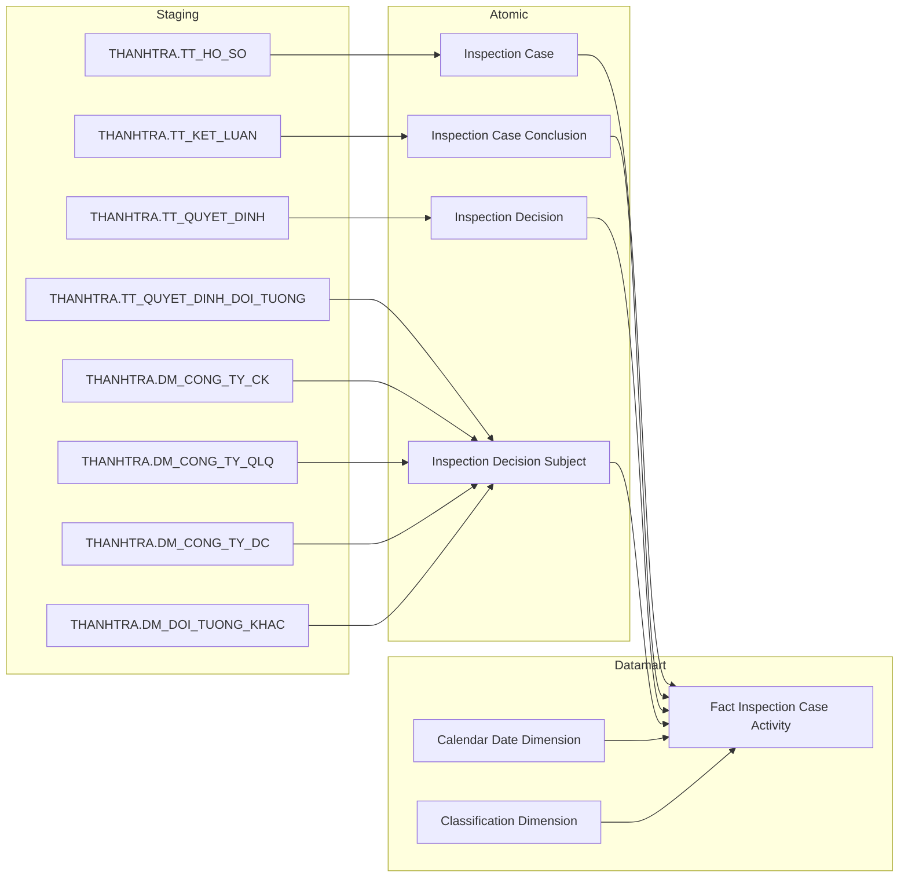
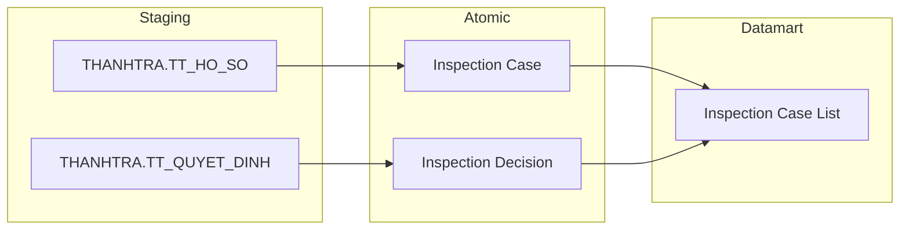
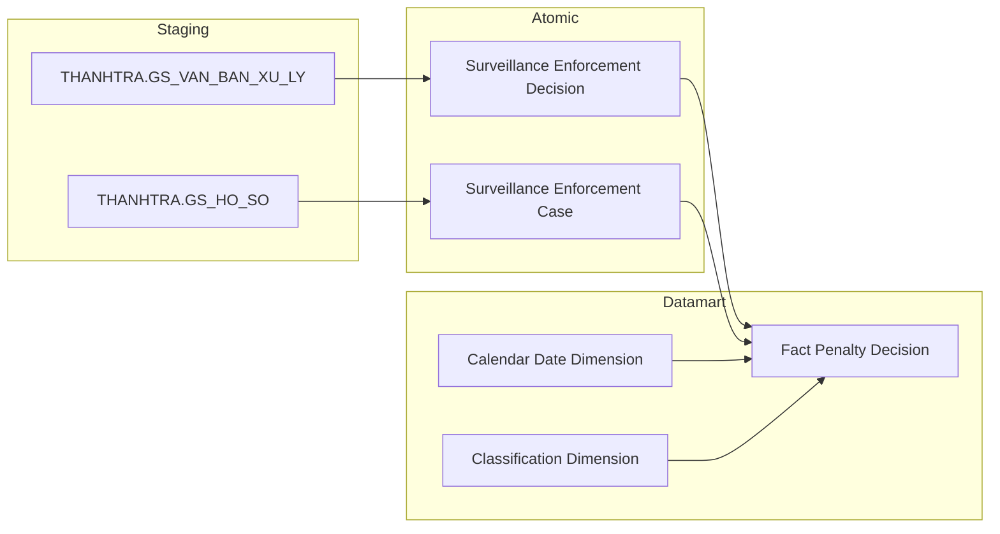
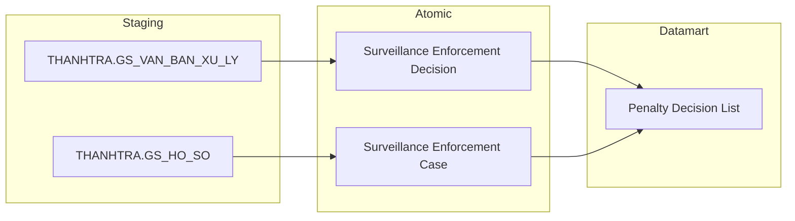
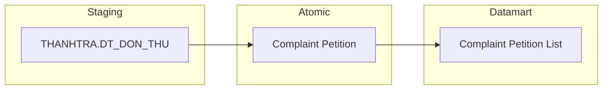

## 3.2.1 Luồng đồng bộ dữ liệu cho nhóm báo cáo Thanh Tra

### 3.2.1.1 Thông tin chung luồng đồng bộ

- tên job:
- nguồn dữ liệu (hệ thống nguồn): THANHTRA
- cách thức truy xuất đồng bộ dữ liệu:
- tần suất đồng bộ dữ liệu:
- dung lượng dữ liệu sẽ thực hiện đồng bộ:
- thời gian lưu trữ dữ liệu:
- thư mục lưu trữ dữ liệu trên kho dữ liệu:

### 3.2.1.2 Luồng nghiệp vụ

#### 3.2.1.2.1 Nhóm thông tin Thống kê & Cơ cấu vụ việc Thanh tra/Kiểm tra

**Mục đích:** Phục vụ toàn bộ Tab TỔNG QUAN và Tab KIỂM TRA — KPI cards thống kê số đoàn/cuộc, biểu đồ bar theo tháng, donut cơ cấu theo loại hành vi vi phạm và theo đối tượng.

**Mô tả luồng:**

Staging → Atomic:
- **Inspection Case:** Bảng lưu thông tin hồ sơ thanh tra/kiểm tra lấy thông tin từ bảng THANHTRA.TT_HO_SO
- **Inspection Case Conclusion:** Bảng lưu thông tin kết luận thanh tra/kiểm tra lấy thông tin từ bảng THANHTRA.TT_KET_LUAN
- **Inspection Decision:** Bảng lưu thông tin quyết định thanh tra/kiểm tra lấy thông tin từ bảng THANHTRA.TT_QUYET_DINH
- **Inspection Decision Subject:** Bảng lưu thông tin đối tượng trong quyết định thanh tra/kiểm tra lấy thông tin từ bảng THANHTRA.TT_QUYET_DINH_DOI_TUONG, kết hợp thông tin danh mục đối tượng từ các bảng THANHTRA.DM_CONG_TY_CK, THANHTRA.DM_CONG_TY_QLQ, THANHTRA.DM_CONG_TY_DC, THANHTRA.DM_DOI_TUONG_KHAC

Atomic → Datamart:
- **Fact Inspection Case Activity:** Bảng sự kiện tổng hợp thông tin vụ việc thanh tra/kiểm tra theo grain 1 hồ sơ × 1 đối tượng, phục vụ phân tích KPI đếm hồ sơ và cơ cấu theo hành vi vi phạm, loại đối tượng
- **Calendar Date Dimension:** Bảng lưu thông tin thời gian phục vụ phân tích theo năm, quý, tháng
- **Classification Dimension:** Bảng lưu danh mục thông tin phân loại (ví dụ: loại hành vi vi phạm TT_VIOLATION_TYPE, loại đối tượng TT_SUBJECT_CATEGORY)

#### 3.2.1.2.2 Nhóm thông tin Danh sách vụ việc Tác nghiệp

**Mục đích:** Phục vụ block Danh sách vụ việc trên Tab TỔNG QUAN (Nhóm 5) và Tab KIỂM TRA (Nhóm 10) — bảng tra cứu từng hồ sơ thanh tra/kiểm tra ở trạng thái mới nhất.

**Mô tả luồng:**

Staging → Atomic:
- **Inspection Case:** Bảng lưu thông tin hồ sơ thanh tra/kiểm tra lấy thông tin từ bảng THANHTRA.TT_HO_SO
- **Inspection Decision:** Bảng lưu thông tin quyết định thanh tra/kiểm tra lấy thông tin từ bảng THANHTRA.TT_QUYET_DINH

Atomic → Datamart:
- **Inspection Case List:** Bảng tác nghiệp lưu danh sách hồ sơ thanh tra/kiểm tra ở trạng thái mới nhất, phục vụ tra cứu và lọc theo loại hình (Định kỳ/Đột xuất), trạng thái hồ sơ

#### 3.2.1.2.3 Nhóm thông tin Xử phạt vi phạm — Fact

**Mục đích:** Phục vụ Tab XỬ PHẠT — KPI cards tổng số quyết định và tổng tiền phạt, biểu đồ dual axis theo tháng, donut cơ cấu theo hành vi vi phạm và theo đối tượng bị xử phạt.

**Mô tả luồng:**

Staging → Atomic:
- **Surveillance Enforcement Decision:** Bảng lưu thông tin quyết định xử phạt vi phạm lấy thông tin từ bảng THANHTRA.GS_VAN_BAN_XU_LY
- **Surveillance Enforcement Case:** Bảng lưu thông tin hồ sơ giám sát vi phạm lấy thông tin từ bảng THANHTRA.GS_HO_SO

Atomic → Datamart:
- **Fact Penalty Decision:** Bảng sự kiện tổng hợp thông tin quyết định xử phạt theo grain 1 quyết định xử phạt, phục vụ phân tích số lượng và tổng tiền phạt theo thời gian, loại hành vi, đối tượng
- **Calendar Date Dimension:** Bảng lưu thông tin thời gian phục vụ phân tích theo năm, quý, tháng
- **Classification Dimension:** Bảng lưu danh mục thông tin phân loại (ví dụ: loại hành vi vi phạm TT_VIOLATION_TYPE, loại đối tượng xử phạt TT_PENALTY_SUBJECT_CATEGORY)

#### 3.2.1.2.4 Nhóm thông tin Xử phạt vi phạm — Tác nghiệp

**Mục đích:** Phục vụ block Danh sách quyết định xử phạt trên Tab XỬ PHẠT (Nhóm 15) — bảng tra cứu từng quyết định xử phạt ở trạng thái mới nhất.

**Mô tả luồng:**

Staging → Atomic:
- **Surveillance Enforcement Decision:** Bảng lưu thông tin quyết định xử phạt vi phạm lấy thông tin từ bảng THANHTRA.GS_VAN_BAN_XU_LY
- **Surveillance Enforcement Case:** Bảng lưu thông tin hồ sơ giám sát vi phạm lấy thông tin từ bảng THANHTRA.GS_HO_SO

Atomic → Datamart:
- **Penalty Decision List:** Bảng tác nghiệp lưu danh sách quyết định xử phạt ở trạng thái mới nhất, phục vụ tra cứu theo đối tượng, loại hành vi, trạng thái quyết định

#### 3.2.1.2.5 Nhóm thông tin Đơn thư khiếu nại tố cáo

**Mục đích:** Phục vụ Tab ĐƠN THƯ — KPI aggregate tổng đơn đã xử lý (Nhóm 16–18), biểu đồ tình hình xử lý và cơ cấu theo loại đơn, danh sách chi tiết đơn thư (Nhóm 19).

**Mô tả luồng:**

Staging → Atomic:
- **Complaint Petition:** Bảng lưu thông tin đơn thư khiếu nại tố cáo lấy thông tin từ bảng THANHTRA.DT_DON_THU

Atomic → Datamart:
- **Complaint Petition List:** Bảng tác nghiệp lưu danh sách đơn thư khiếu nại tố cáo ở trạng thái mới nhất, phục vụ cả KPI aggregate lẫn danh sách chi tiết theo loại đơn và trạng thái xử lý
