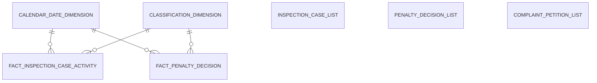
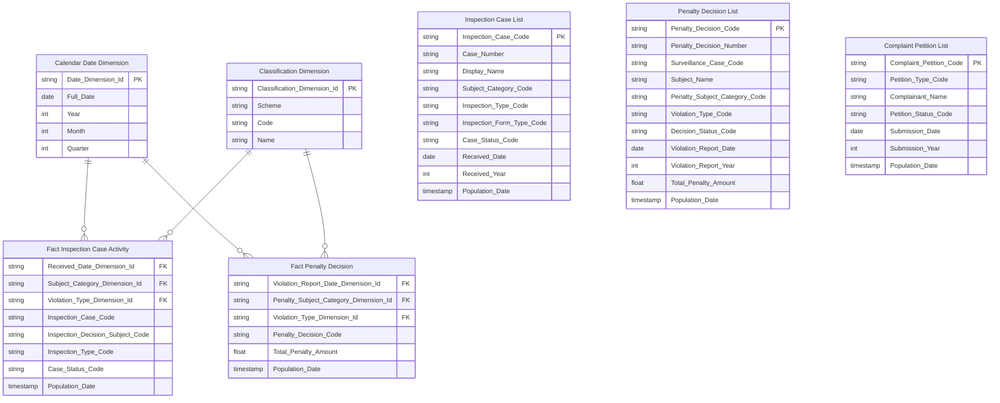
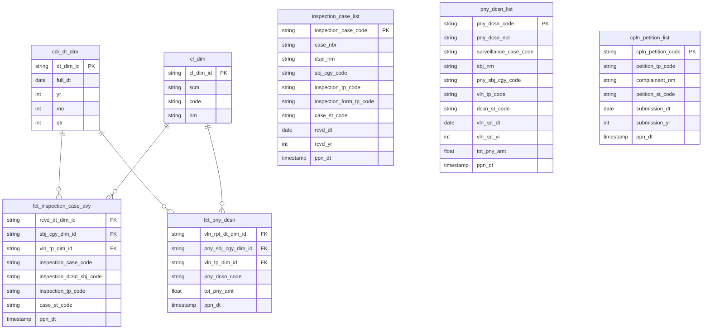

# 3. KHO DỮ LIỆU (OLAP) — Thanh Tra

## 3.1 Mô hình dữ liệu mức High Level / Conceptual

### 3.1.1 Sơ đồ ERD

### 3.1.2 Danh sách thực thể

| STT | Thực thể | Tên bảng | Mô tả |
|---|---|---|---|
| 1 | Calendar Date Dimension | cdr_dt_dim | Lịch ngày — năm/quý/tháng phục vụ slicer và phân tích theo thời gian |
| 2 | Classification Dimension | cl_dim | Danh mục phân loại — phục vụ 3 scheme trên 2 Fact: TT_SUBJECT_CATEGORY / TT_PENALTY_SUBJECT_CATEGORY / TT_VIOLATION_TYPE |
| 3 | Fact Inspection Case Activity | fct_inspection_case_avy | Event vụ việc TT/KT — 1 row per hồ sơ × đối tượng |
| 4 | Fact Penalty Decision | fct_pny_dcsn | Event quyết định xử phạt — 1 row per quyết định xử phạt |
| 5 | Inspection Case List | inspection_case_list | Hồ sơ TT/KT — latest state per hồ sơ |
| 6 | Penalty Decision List | pny_dcsn_list | Quyết định xử phạt — latest state per quyết định |
| 7 | Complaint Petition List | cpln_petition_list | Đơn thư khiếu nại tố cáo — latest state per đơn |

---

## 3.2 Mô hình dữ liệu mức Logic

### 3.2.1 Sơ đồ ERD

### 3.2.2 Danh sách các bảng và thuộc tính

#### 3.2.2.1 Bảng Calendar Date Dimension

| STT | Tên trường | Kiểu dữ liệu và độ dài | Nullable | Unique | P/F Key | Mặc định | Mô tả |
|---|---|---|---|---|---|---|---|
| 1 | Date Dimension Id | string | | X | P | | Surrogate key lịch ngày |
| 2 | Full Date | date | X | | | | Ngày đầy đủ |
| 3 | Year | int | X | | | | Năm |
| 4 | Month | int | X | | | | Tháng (1–12) |
| 5 | Quarter | int | X | | | | Quý (1–4) |

#### 3.2.2.2 Bảng Classification Dimension

| STT | Tên trường | Kiểu dữ liệu và độ dài | Nullable | Unique | P/F Key | Mặc định | Mô tả |
|---|---|---|---|---|---|---|---|
| 1 | Classification Dimension Id | string | | X | P | | Surrogate key danh mục — unique per (Scheme + Code) |
| 2 | Scheme | string | X | | | | Mã scheme phân loại |
| 3 | Code | string | X | | | | Mã giá trị trong scheme |
| 4 | Name | string | X | | | | Tên hiển thị tiếng Việt của giá trị |

#### 3.2.2.3 Bảng Fact Inspection Case Activity

| STT | Tên trường | Kiểu dữ liệu và độ dài | Nullable | Unique | P/F Key | Mặc định | Mô tả |
|---|---|---|---|---|---|---|---|
| 1 | Received Date Dimension Id | string | | | F | | FK lịch ngày nhận hồ sơ |
| 2 | Subject Category Dimension Id | string | | | F | | FK phân loại đối tượng (scheme TT_SUBJECT_CATEGORY) |
| 3 | Violation Type Dimension Id | string | | | F | | FK loại hành vi vi phạm (scheme TT_VIOLATION_TYPE) |
| 4 | Inspection Case Code | string | X | | | | Mã hồ sơ (degenerate key) |
| 5 | Inspection Decision Subject Code | string | X | | | | Mã đối tượng trong quyết định (degenerate key) |
| 6 | Inspection Type Code | string | X | | | | Loại hình THANH_TRA / KIEM_TRA |
| 7 | Case Status Code | string | X | | | | Trạng thái hồ sơ |
| 8 | Population Date | timestamp | X | | | | ETL load timestamp |

#### 3.2.2.4 Bảng Fact Penalty Decision

| STT | Tên trường | Kiểu dữ liệu và độ dài | Nullable | Unique | P/F Key | Mặc định | Mô tả |
|---|---|---|---|---|---|---|---|
| 1 | Violation Report Date Dimension Id | string | | | F | | FK lịch ngày ký biên bản vi phạm |
| 2 | Penalty Subject Category Dimension Id | string | | | F | | FK phân loại đối tượng bị xử phạt (scheme TT_PENALTY_SUBJECT_CATEGORY) |
| 3 | Violation Type Dimension Id | string | | | F | | FK loại hành vi vi phạm (scheme TT_VIOLATION_TYPE) |
| 4 | Penalty Decision Code | string | X | | | | Mã quyết định xử phạt (degenerate key) |
| 5 | Total Penalty Amount | decimal(23,2) | X | | | | Tổng tiền phạt (đơn vị VNĐ) |
| 6 | Population Date | timestamp | X | | | | ETL load timestamp |

#### 3.2.2.5 Bảng Inspection Case List

| STT | Tên trường | Kiểu dữ liệu và độ dài | Nullable | Unique | P/F Key | Mặc định | Mô tả |
|---|---|---|---|---|---|---|---|
| 1 | Inspection Case Code | string | | X | P | | Mã hồ sơ thanh tra/kiểm tra (PK) |
| 2 | Case Number | string | X | | | | Mã hồ sơ nghiệp vụ hiển thị |
| 3 | Display Name | string | X | | | | Tên hiển thị đối tượng thanh tra/kiểm tra |
| 4 | Subject Category Code | string | X | | | | Phân loại đối tượng (scheme TT_SUBJECT_CATEGORY) |
| 5 | Inspection Type Code | string | X | | | | Loại hình THANH_TRA / KIEM_TRA |
| 6 | Inspection Form Type Code | string | X | | | | Loại hình đợt: DINH_KY / DOT_XUAT |
| 7 | Case Status Code | string | X | | | | Trạng thái hồ sơ (scheme TT_CASE_STATUS) |
| 8 | Received Date | date | X | | | | Ngày nhận hồ sơ |
| 9 | Received Year | int | X | | | | Năm nhận hồ sơ |
| 10 | Population Date | timestamp | X | | | | ETL load timestamp |

#### 3.2.2.6 Bảng Penalty Decision List

| STT | Tên trường | Kiểu dữ liệu và độ dài | Nullable | Unique | P/F Key | Mặc định | Mô tả |
|---|---|---|---|---|---|---|---|
| 1 | Penalty Decision Code | string | | X | P | | Mã quyết định xử phạt (PK) |
| 2 | Penalty Decision Number | string | X | | | | Số quyết định xử phạt |
| 3 | Surveillance Case Code | string | X | | | | Mã hồ sơ giám sát |
| 4 | Subject Name | string | X | | | | Tên đối tượng vi phạm |
| 5 | Penalty Subject Category Code | string | X | | | | Phân loại đối tượng bị xử phạt (scheme TT_PENALTY_SUBJECT_CATEGORY) |
| 6 | Violation Type Code | string | X | | | | Loại hành vi vi phạm (scheme TT_VIOLATION_TYPE) |
| 7 | Decision Status Code | string | X | | | | Trạng thái quyết định (scheme TT_CASE_STATUS) |
| 8 | Violation Report Date | date | X | | | | Ngày ký biên bản vi phạm hành chính |
| 9 | Violation Report Year | int | X | | | | Năm biên bản vi phạm |
| 10 | Total Penalty Amount | decimal(23,2) | X | | | | Tổng tiền phạt (VNĐ) |
| 11 | Population Date | timestamp | X | | | | ETL load timestamp |

#### 3.2.2.7 Bảng Complaint Petition List

| STT | Tên trường | Kiểu dữ liệu và độ dài | Nullable | Unique | P/F Key | Mặc định | Mô tả |
|---|---|---|---|---|---|---|---|
| 1 | Complaint Petition Code | string | | X | P | | Mã đơn thư khiếu nại tố cáo (PK) |
| 2 | Petition Type Code | string | X | | | | Loại đơn (scheme TT_PETITION_TYPE) |
| 3 | Complainant Name | string | X | | | | Tên tổ chức/cá nhân gửi đơn |
| 4 | Petition Status Code | string | X | | | | Trạng thái đơn (scheme TT_PETITION_STATUS) |
| 5 | Submission Date | date | X | | | | Ngày tiếp nhận đơn |
| 6 | Submission Year | int | X | | | | Năm tiếp nhận đơn |
| 7 | Population Date | timestamp | X | | | | ETL load timestamp |

---

## 3.3 Mô hình dữ liệu mức vật lý

### 3.3.1 Sơ đồ ERD

### 3.3.2 Danh sách bảng Dimension

#### 3.3.2.1 Bảng Calendar Date Dimension (cdr_dt_dim)

*Mô tả bảng:* Lịch ngày — năm/quý/tháng phục vụ slicer và phân tích theo thời gian
*Đường dẫn trên kho dữ liệu:*
*Các trường Partition:*
*Thời gian lưu trữ:*
*Định dạng lưu trữ:*

| STT | Tên trường | Kiểu dữ liệu và độ dài | Nullable | Unique | P/F Key | Giá trị mặc định | Mô tả | Hệ thống nguồn | Schema.Table | Source Field Name | ETL Rules |
|---|---|---|---|---|---|---|---|---|---|---|---|
| 1 | dt_dim_id | string | | X | P | | Surrogate key lịch ngày | | | | ETL sinh tự động |
| 2 | full_dt | date | X | | | | Ngày đầy đủ | | | | ETL sinh tự động |
| 3 | yr | int | X | | | | Năm | | | | ETL sinh tự động |
| 4 | mo | int | X | | | | Tháng (1–12) | | | | ETL sinh tự động |
| 5 | qtr | int | X | | | | Quý (1–4) | | | | ETL sinh tự động |

#### 3.3.2.2 Bảng Classification Dimension (cl_dim)

*Mô tả bảng:* Danh mục phân loại — phục vụ 3 scheme trên 2 Fact: TT_SUBJECT_CATEGORY / TT_PENALTY_SUBJECT_CATEGORY / TT_VIOLATION_TYPE
*Đường dẫn trên kho dữ liệu:*
*Các trường Partition:*
*Thời gian lưu trữ:*
*Định dạng lưu trữ:*

| STT | Tên trường | Kiểu dữ liệu và độ dài | Nullable | Unique | P/F Key | Giá trị mặc định | Mô tả | Hệ thống nguồn | Schema.Table | Source Field Name | ETL Rules |
|---|---|---|---|---|---|---|---|---|---|---|---|
| 1 | cl_dim_id | string | | X | P | | Surrogate key danh mục | | | | ETL sinh tự động |
| 2 | scm | string | X | | | | Mã scheme phân loại | | | | ETL sinh tự động |
| 3 | code | string | X | | | | Mã giá trị trong scheme | | | | ETL sinh tự động |
| 4 | nm | string | X | | | | Tên hiển thị tiếng Việt của giá trị | | | | ETL sinh tự động |

### 3.3.3 Danh sách bảng Detail Fact

#### 3.3.3.1 Bảng Fact Inspection Case Activity (fct_inspection_case_avy)

*Mô tả bảng:* Event vụ việc TT/KT — 1 row per hồ sơ × đối tượng
*Đường dẫn trên kho dữ liệu:*
*Các trường Partition:*
*Thời gian lưu trữ:*
*Định dạng lưu trữ:*

| STT | Tên trường | Kiểu dữ liệu và độ dài | Nullable | Unique | P/F Key | Giá trị mặc định | Mô tả | Hệ thống nguồn | Schema.Table | Source Field Name | ETL Rules |
|---|---|---|---|---|---|---|---|---|---|---|---|
| 1 | rcvd_dt_dim_id | string | | | F | | FK lịch ngày nhận hồ sơ | THANHTRA | ATM.inspection_case | rcvd_dt | ETL lookup Calendar Date Dimension từ Inspection Case.Received Date |
| 2 | sbj_cgy_dim_id | string | | | F | | FK phân loại đối tượng | THANHTRA | ATM.inspection_dcsn_sbj | sbj_refr_id | ETL derived — resolve polymorphic FK từ Inspection Decision Subject.Subject Reference Id → lookup Classification Dimension (scheme TT_SUBJECT_CATEGORY) |
| 3 | vln_tp_dim_id | string | | | F | | FK loại hành vi vi phạm | THANHTRA | ATM.inspection_case_conclusion | vln_tp_code | ETL join Inspection Case Conclusion (lấy MAX Conclusion Sequence Number) → lookup Classification Dimension (scheme TT_VIOLATION_TYPE) |
| 4 | inspection_case_code | string | X | | | | Mã hồ sơ (degenerate key) | THANHTRA | ATM.inspection_case | inspection_case_code | ETL sinh tự động |
| 5 | inspection_dcsn_sbj_code | string | X | | | | Mã đối tượng trong quyết định (degenerate key) | THANHTRA | ATM.inspection_dcsn_sbj | inspection_dcsn_sbj_code | ETL sinh tự động |
| 6 | inspection_tp_code | string | X | | | | Loại hình THANH_TRA / KIEM_TRA | THANHTRA | ATM.inspection_case | inspection_tp_code | ETL sinh tự động |
| 7 | case_st_code | string | X | | | | Trạng thái hồ sơ | THANHTRA | ATM.inspection_case | case_st_code | ETL sinh tự động |
| 8 | ppn_dt | timestamp | X | | | | ETL load timestamp | | | | ETL sinh tự động |

#### 3.3.3.2 Bảng Fact Penalty Decision (fct_pny_dcsn)

*Mô tả bảng:* Event quyết định xử phạt — 1 row per quyết định xử phạt
*Đường dẫn trên kho dữ liệu:*
*Các trường Partition:*
*Thời gian lưu trữ:*
*Định dạng lưu trữ:*

| STT | Tên trường | Kiểu dữ liệu và độ dài | Nullable | Unique | P/F Key | Giá trị mặc định | Mô tả | Hệ thống nguồn | Schema.Table | Source Field Name | ETL Rules |
|---|---|---|---|---|---|---|---|---|---|---|---|
| 1 | vln_rpt_dt_dim_id | string | | | F | | FK lịch ngày ký biên bản vi phạm | THANHTRA | ATM.surveillance_enforcement_dcsn | vln_rpt_dt | ETL lookup Calendar Date Dimension từ Surveillance Enforcement Decision.Violation Report Date |
| 2 | pny_sbj_cgy_dim_id | string | | | F | | FK phân loại đối tượng bị xử phạt | | | | ETL sinh tự động |
| 3 | vln_tp_dim_id | string | | | F | | FK loại hành vi vi phạm | | | | ETL sinh tự động |
| 4 | pny_dcsn_code | string | X | | | | Mã quyết định xử phạt (degenerate key) | THANHTRA | ATM.surveillance_enforcement_dcsn | surveillance_enforcement_dcsn_code | ETL sinh tự động |
| 5 | tot_pny_amt | decimal(23,2) | X | | | | Tổng tiền phạt (đơn vị VNĐ) | THANHTRA | ATM.surveillance_enforcement_dcsn | tot_pny_amt | ETL sinh tự động |
| 6 | ppn_dt | timestamp | X | | | | ETL load timestamp | | | | ETL sinh tự động |

### 3.3.4 Danh sách bảng tác nghiệp (Operational)

#### 3.3.4.1 Bảng Inspection Case List (inspection_case_list)

*Mô tả bảng:* Hồ sơ TT/KT — latest state per hồ sơ (1 row per TT_HO_SO)
*Đường dẫn trên kho dữ liệu:*
*Các trường Partition:*
*Thời gian lưu trữ:*
*Định dạng lưu trữ:*

| STT | Tên trường | Kiểu dữ liệu và độ dài | Nullable | Unique | P/F Key | Giá trị mặc định | Mô tả | Hệ thống nguồn | Schema.Table | Source Field Name | ETL Rules |
|---|---|---|---|---|---|---|---|---|---|---|---|
| 1 | inspection_case_code | string | | X | P | | Mã hồ sơ thanh tra/kiểm tra (PK) | THANHTRA | ATM.inspection_case | inspection_case_code | ETL sinh tự động |
| 2 | case_nbr | string | X | | | | Mã hồ sơ nghiệp vụ hiển thị | THANHTRA | ATM.inspection_case | case_nbr | ETL sinh tự động |
| 3 | dspl_nm | string | X | | | | Tên hiển thị đối tượng | | | | ETL sinh tự động |
| 4 | sbj_cgy_code | string | X | | | | Phân loại đối tượng | | | | ETL sinh tự động |
| 5 | inspection_tp_code | string | X | | | | Loại hình THANH_TRA / KIEM_TRA | THANHTRA | ATM.inspection_case | inspection_tp_code | ETL sinh tự động |
| 6 | inspection_form_tp_code | string | X | | | | Loại hình đợt: DINH_KY / DOT_XUAT | | | | ETL derived: Inspection Decision.Inspection Annual Plan Id IS NULL → DOT_XUAT; NOT NULL → DINH_KY |
| 7 | case_st_code | string | X | | | | Trạng thái hồ sơ | THANHTRA | ATM.inspection_case | case_st_code | ETL sinh tự động |
| 8 | rcvd_dt | date | X | | | | Ngày nhận hồ sơ | THANHTRA | ATM.inspection_case | rcvd_dt | ETL sinh tự động |
| 9 | rcvd_yr | int | X | | | | Năm nhận hồ sơ | | | | ETL sinh tự động |
| 10 | ppn_dt | timestamp | X | | | | ETL load timestamp | | | | ETL sinh tự động |

#### 3.3.4.2 Bảng Penalty Decision List (pny_dcsn_list)

*Mô tả bảng:* Quyết định xử phạt — latest state per quyết định (1 row per GS_VAN_BAN_XU_LY)
*Đường dẫn trên kho dữ liệu:*
*Các trường Partition:*
*Thời gian lưu trữ:*
*Định dạng lưu trữ:*

| STT | Tên trường | Kiểu dữ liệu và độ dài | Nullable | Unique | P/F Key | Giá trị mặc định | Mô tả | Hệ thống nguồn | Schema.Table | Source Field Name | ETL Rules |
|---|---|---|---|---|---|---|---|---|---|---|---|
| 1 | pny_dcsn_code | string | | X | P | | Mã quyết định xử phạt (PK) | THANHTRA | ATM.surveillance_enforcement_dcsn | surveillance_enforcement_dcsn_code | ETL sinh tự động |
| 2 | pny_dcsn_nbr | string | X | | | | Số quyết định xử phạt | THANHTRA | ATM.surveillance_enforcement_dcsn | pny_dcsn_nbr | ETL sinh tự động |
| 3 | surveillance_case_code | string | X | | | | Mã hồ sơ giám sát | THANHTRA | ATM.surveillance_enforcement_case | case_nbr | ETL sinh tự động |
| 4 | sbj_nm | string | X | | | | Tên đối tượng vi phạm | THANHTRA | ATM.surveillance_enforcement_case | sbj_nm | ETL sinh tự động |
| 5 | pny_sbj_cgy_code | string | X | | | | Phân loại đối tượng bị xử phạt | | | | ETL sinh tự động |
| 6 | vln_tp_code | string | X | | | | Loại hành vi vi phạm | | | | ETL sinh tự động |
| 7 | dcsn_st_code | string | X | | | | Trạng thái quyết định | THANHTRA | ATM.surveillance_enforcement_dcsn | dcsn_st_code | ETL sinh tự động |
| 8 | vln_rpt_dt | date | X | | | | Ngày ký biên bản vi phạm hành chính | THANHTRA | ATM.surveillance_enforcement_dcsn | vln_rpt_dt | ETL sinh tự động |
| 9 | vln_rpt_yr | int | X | | | | Năm biên bản vi phạm | | | | ETL sinh tự động |
| 10 | tot_pny_amt | decimal(23,2) | X | | | | Tổng tiền phạt (VNĐ) | THANHTRA | ATM.surveillance_enforcement_dcsn | tot_pny_amt | ETL sinh tự động |
| 11 | ppn_dt | timestamp | X | | | | ETL load timestamp | | | | ETL sinh tự động |

#### 3.3.4.3 Bảng Complaint Petition List (cpln_petition_list)

*Mô tả bảng:* Đơn thư khiếu nại tố cáo — latest state per đơn (1 row per DT_DON_THU)
*Đường dẫn trên kho dữ liệu:*
*Các trường Partition:*
*Thời gian lưu trữ:*
*Định dạng lưu trữ:*

| STT | Tên trường | Kiểu dữ liệu và độ dài | Nullable | Unique | P/F Key | Giá trị mặc định | Mô tả | Hệ thống nguồn | Schema.Table | Source Field Name | ETL Rules |
|---|---|---|---|---|---|---|---|---|---|---|---|
| 1 | cpln_petition_code | string | | X | P | | Mã đơn thư (PK) | THANHTRA | ATM.cpln_petition | cpln_petition_code | ETL sinh tự động |
| 2 | petition_tp_code | string | X | | | | Loại đơn (scheme TT_PETITION_TYPE) | THANHTRA | ATM.cpln_petition | petition_tp_code | ETL sinh tự động |
| 3 | complainant_nm | string | X | | | | Tên tổ chức/cá nhân gửi đơn | THANHTRA | ATM.cpln_petition | complainant_nm | ETL sinh tự động |
| 4 | petition_st_code | string | X | | | | Trạng thái đơn (scheme TT_PETITION_STATUS) | THANHTRA | ATM.cpln_petition | petition_st_code | ETL sinh tự động |
| 5 | submission_dt | date | X | | | | Ngày tiếp nhận đơn | THANHTRA | ATM.cpln_petition | submission_dt | ETL sinh tự động |
| 6 | submission_yr | int | X | | | | Năm tiếp nhận đơn | | | | ETL sinh tự động |
| 7 | ppn_dt | timestamp | X | | | | ETL load timestamp | | | | ETL sinh tự động |
