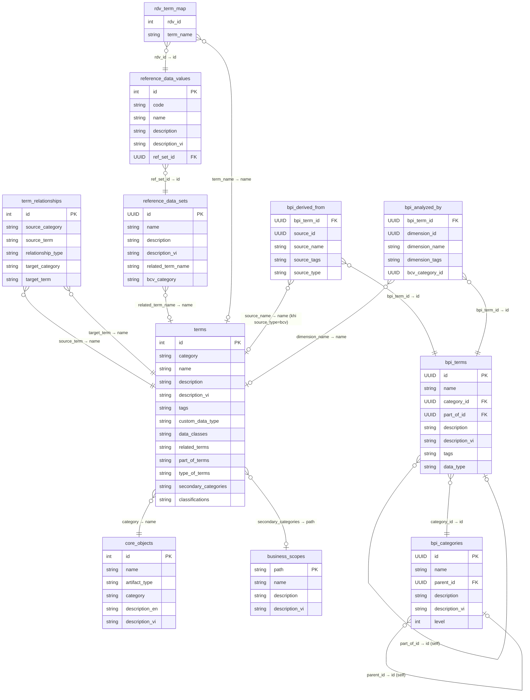

# Business Vocabulary Database — Hướng dẫn tham chiếu

## Tổng quan
Đây là bộ từ điển thuật ngữ nghiệp vụ ngành Tài chính (Financial Services). Bộ dữ liệu này là nguồn tham chiếu chính để BA/Data Modeler sử dụng khi thiết kế data model, đảm bảo đặt tên và định nghĩa nhất quán với chuẩn nghiệp vụ.

## Mô hình quan hệ các bảng (ERD)

> **Ký hiệu join:**
> `||` = join chính xác (UUID/int), `o|` = join bằng string name (soft reference).
> Quan hệ `terms ↔ business_scopes` và các soft reference dùng string match, không phải FK tường minh trong DB.

## Cấu trúc dữ liệu

### 1. core_objects.csv (15 dòng)
- **Mục đích**: Các danh mục cấp cao nhất của từ vựng nghiệp vụ
- **Cột chính**: name, category, description_en, description_vi
- **Các danh mục**: Location, Involved Party, Transaction, Common, Event...
- **Dùng khi**: Cần xác định entity thuộc nhóm nghiệp vụ nào

### 2. terms.csv (8,614 dòng) — FILE QUAN TRỌNG NHẤT
- **Mục đích**: Từ điển thuật ngữ nghiệp vụ chi tiết
- **Cột chính**:
  - `category`: Nhóm nghiệp vụ (Accounting, Product, Channel...)
  - `name`: Tên thuật ngữ (tiếng Anh)
  - `description`: Định nghĩa chi tiết (tiếng Anh)
  - `description_vi`: Định nghĩa tiếng Việt (bản dịch tự động)
  - `tags`: Loại thuật ngữ (property, entity, concept...)
  - `custom_data_type`: Kiểu dữ liệu gợi ý (Date, Reference Data, Monetary Amount...)
  - `data_classes`: Phân loại dữ liệu (Relationship, Identifier...)
- **Dùng khi**: Tra cứu định nghĩa chuẩn, xác định data type, đặt tên cột/bảng

### 3. term_relationships.csv (17,652 dòng) — tự động sync từ terms
- **Mục đích**: Quan hệ giữa các thuật ngữ
- **Cột chính**: source_term, relationship_type (part_of, related, type_of), target_term
- **Dùng khi**: Xác định mối quan hệ giữa các entity từ đó giúp hiểu ngữ cảnh nghiệp vụ và gợi ý các thuật ngữ liên quan có thể bổ sung làm giàu, thiết kế foreign key

### 4. reference_data_sets.csv (883 dòng)
- **Mục đích**: Các bộ dữ liệu tham chiếu (reference/lookup data)
- **Cột chính**: name, description, description_vi, related_term_name
- **Dùng khi**: Xác định các trường nào cần reference table / lookup value; và dùng để tìm kiếm theo giá trị phân loại (khi không tìm được theo tên hoặc mô tả thuật ngữ); và tìm hiểu giá trị phân loại chuẩn để tham khảo.

### 5. reference_data_values.csv (5,073 dòng)
- **Mục đích**: Giá trị cụ thể trong mỗi bộ tham chiếu
- **Cột chính**: code, name, description, ref_set_id (liên kết với reference_data_sets)
- **Dùng khi**: Dùng để tìm kiếm theo giá trị phân loại (khi không tìm được theo tên hoặc mô tả thuật ngữ); và tìm hiểu giá trị phân loại chuẩn để tham khảo.

### 6. bpi_categories.csv (56 dòng)
- **Mục đích**: Danh mục chỉ số hiệu suất kinh doanh (Business Performance Indicators)
- **Các nhóm**: Asset & Liability Management, Investment Management, Payments, Profitability...
- **Dùng khi**: tham khảo khi thiết kế model theo hướng top-down (từ yêu cầu báo cáo phân tích)

### 7. bpi_terms.csv (4,693 dòng)
- **Mục đích**: Các chỉ số đo lường nghiệp vụ
- **Cột chính**: name, description, description_vi, tags (measure/dimension), data_type
- **Dùng khi**: Tham khảo khi thiết kế model theo hướng top-down (từ yêu cầu báo cáo phân tích) và Thiết kế fact table và xác định các measure cần theo dõi

### 8. bpi_derived_from.csv (3,592 dòng) — nguồn tính toán BPI
- **Mục đích**: Nguồn gốc của các chỉ số BPI — mỗi chỉ số được tính từ thuật ngữ nào
- **Dùng khi**: Tham khảo nguyên tắc tính toán của thuật ngữ.

### 9. business_scopes.csv (973 dòng)
- **Mục đích**: Phạm vi nghiệp vụ — phân loại theo lĩnh vực hoạt động
- **Ví dụ**: AML, Accessibility, Advanced Securities, Basel III...
- **Dùng khi**: Xác định scope của data model đang thiết kế theo hướng của các hệ thống/ ứng dụng theo tiêu chuẩn quốc tế.

### 10. bpi_analyzed_by.csv (1,978 dòng) — dimension phân tích BPI
- **Mục đích**: Mapping giữa BPI term (measure) và các dimension phân tích
- **Cột chính**: bpi\_term\_id, dimension\_name, dimension\_tags
- **Dùng khi**: Thiết kế fact table trên tầng Gold — xác định fact cần liên kết với dimension nào

## Cách sử dụng khi thiết kế Data Model

1. **Đặt tên entity/table**: Tra `terms.csv` → cột `name` (dùng tên chuẩn thay vì tự đặt)
2. **Định nghĩa attribute**: Tra `terms.csv` → cột `description` / `description_vi`
3. **Xác định data type**: Tra `terms.csv` → cột `custom_data_type`
4. **Thiết kế relationship**: Tra `term_relationships.csv` → xác định part_of, related, type_of
5. **Xác định reference data**: Tra `reference_data_sets.csv` + `reference_data_values.csv`
6. **Thiết kế fact/measure**: Tra `bpi_terms.csv` → các thuật ngữ có tags = "measure"